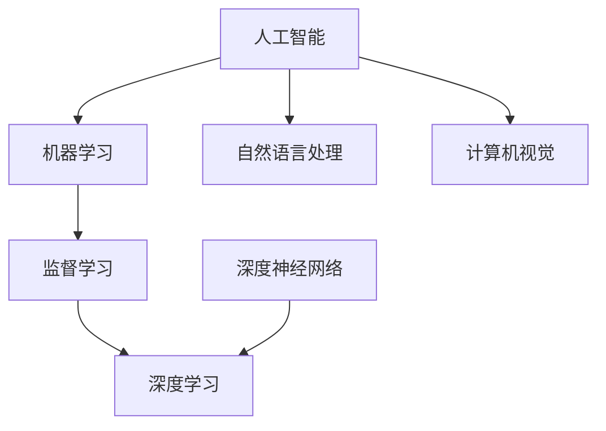
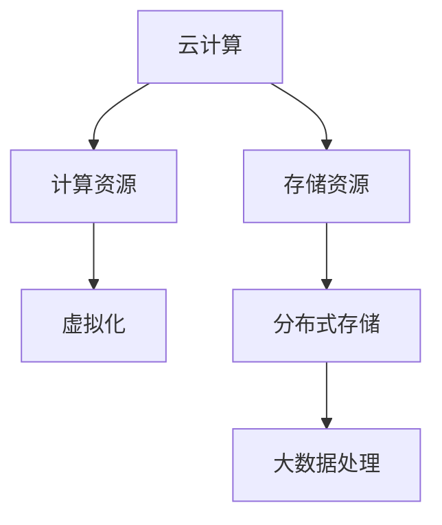
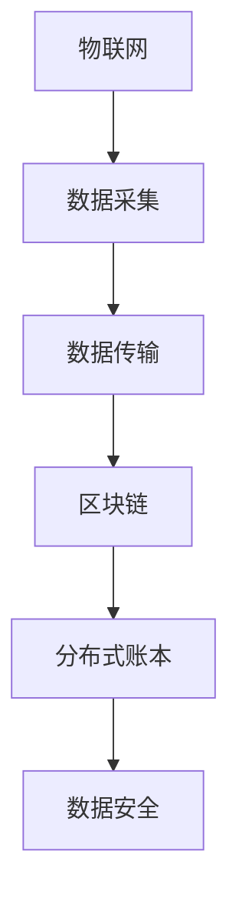
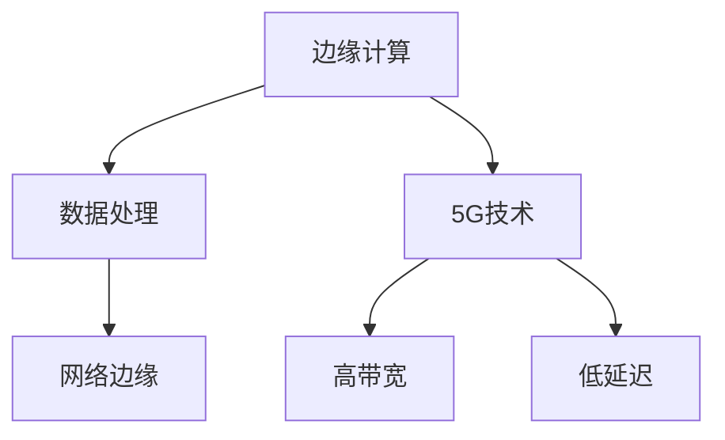

                 

关键词：人工智能，深度学习，大数据，云计算，物联网，区块链，边缘计算，5G，边缘智能，联邦学习

> 摘要：本文旨在探讨当前行业热门产品的技术发展方向。通过对人工智能、深度学习、大数据、云计算、物联网、区块链、边缘计算、5G、边缘智能和联邦学习等技术的深入分析，本文提出了未来技术发展的几个潜在趋势，并探讨了各技术在具体应用领域的挑战与机遇。

## 1. 背景介绍

近年来，随着信息技术的飞速发展，人工智能（AI）、深度学习（DL）、大数据（Big Data）、云计算（Cloud Computing）、物联网（IoT）、区块链（Blockchain）、边缘计算（Edge Computing）、5G、边缘智能（Edge Intelligence）和联邦学习（Federated Learning）等技术逐渐成为行业热点。这些技术的出现不仅改变了人们的生活方式，也推动了各行各业的数字化转型。

### 1.1 人工智能与深度学习

人工智能与深度学习技术近年来取得了显著的进展。通过深度神经网络，机器学习算法在图像识别、自然语言处理、语音识别等领域取得了突破性成果。AI和DL技术已经成为提高生产效率、优化服务流程、推动创新的重要工具。

### 1.2 大数据与云计算

大数据和云计算技术为处理海量数据提供了强大支持。云计算平台不仅能够提供强大的计算能力和存储能力，还实现了数据的高效共享和协作。大数据技术则通过数据挖掘和分析，为企业决策提供了有力的支持。

### 1.3 物联网与区块链

物联网和区块链技术的结合为数据的安全传输和隐私保护提供了新的解决方案。物联网通过连接各种物理设备，实现了数据的实时采集和传输；而区块链则通过去中心化的分布式账本技术，确保了数据的不可篡改性和透明性。

### 1.4 边缘计算与5G

边缘计算和5G技术的发展为实时数据处理和智能决策提供了可能。边缘计算将计算和存储能力从云端转移到网络边缘，实现了对实时数据的快速处理；而5G技术的高带宽、低延迟特点则进一步提升了边缘计算的效率。

## 2. 核心概念与联系

### 2.1 人工智能与深度学习

人工智能（AI）是指使计算机系统具有类似人类智能的能力，包括感知、推理、学习、决策等。深度学习（DL）是机器学习的一种方法，通过构建多层神经网络，对大量数据进行训练，以实现特定任务的自动化。



### 2.2 云计算与大数据

云计算是一种通过互联网提供动态可扩展的虚拟化计算资源的服务模式。大数据则是指数据量巨大、类型多样、速度极快的数据集合。云计算为大数据的处理和分析提供了强大的计算和存储支持。



### 2.3 物联网与区块链

物联网（IoT）通过连接各种物理设备，实现了数据的实时采集和传输。区块链（Blockchain）则通过分布式账本技术，确保了数据的安全和透明。物联网与区块链的结合为数据的安全传输和隐私保护提供了新的解决方案。



### 2.4 边缘计算与5G

边缘计算（Edge Computing）将计算和存储能力从云端转移到网络边缘，实现了对实时数据的快速处理。5G技术的高带宽、低延迟特点则进一步提升了边缘计算的效率。边缘计算与5G技术的结合为实时数据处理和智能决策提供了可能。



## 3. 核心算法原理 & 具体操作步骤

### 3.1 算法原理概述

在人工智能领域，核心算法主要包括深度学习算法、强化学习算法和自然语言处理算法等。以下是这些算法的基本原理概述：

### 3.2 算法步骤详解

#### 3.2.1 深度学习算法

深度学习算法主要通过构建多层神经网络来实现。具体步骤如下：

1. 数据预处理：对输入数据进行标准化处理，使其适合进行神经网络训练。
2. 网络结构设计：根据任务需求设计神经网络的结构，包括输入层、隐藏层和输出层。
3. 模型训练：通过反向传播算法，将输入数据和标签输入神经网络，不断调整网络权重，使网络输出结果与真实结果尽可能接近。
4. 模型评估：通过测试集对训练好的模型进行评估，计算模型的准确率、召回率等指标。
5. 模型部署：将训练好的模型部署到实际应用场景中，实现自动化决策。

#### 3.2.2 强化学习算法

强化学习算法通过智能体与环境交互，不断学习最优策略。具体步骤如下：

1. 环境初始化：初始化环境状态。
2. 智能体行动：智能体根据当前状态选择行动。
3. 状态转移：环境根据智能体的行动，更新状态。
4. 奖励计算：根据智能体的行动结果，计算奖励。
5. 策略更新：根据奖励信号，更新智能体的策略。

#### 3.2.3 自然语言处理算法

自然语言处理算法主要包括文本分类、情感分析、命名实体识别等。具体步骤如下：

1. 数据预处理：对输入文本进行分词、去停用词等处理。
2. 特征提取：将预处理后的文本转换为计算机可处理的特征向量。
3. 模型训练：通过机器学习算法，训练分类模型。
4. 模型评估：通过测试集对训练好的模型进行评估。
5. 模型部署：将训练好的模型部署到实际应用场景中。

### 3.3 算法优缺点

#### 3.3.1 深度学习算法

优点：

- 强大的表达能力和适应能力，能够处理复杂任务。
- 能够自动提取特征，减轻人工特征工程的工作量。

缺点：

- 对数据量和计算资源要求较高。
- 模型训练过程容易出现过拟合现象。

#### 3.3.2 强化学习算法

优点：

- 能够在学习过程中与环境交互，不断优化策略。
- 能够处理连续状态和动作空间。

缺点：

- 学习过程通常较为耗时。
- 需要大量奖励信号进行指导。

#### 3.3.3 自然语言处理算法

优点：

- 能够处理自然语言文本，实现文本分类、情感分析等功能。
- 能够自动提取文本特征，提高处理效率。

缺点：

- 对大规模数据集处理能力有限。
- 特征提取过程较为复杂，需要大量计算资源。

### 3.4 算法应用领域

#### 3.4.1 深度学习算法

- 图像识别：人脸识别、物体检测、图像分类等。
- 自然语言处理：文本分类、机器翻译、语音识别等。
- 推荐系统：商品推荐、内容推荐等。

#### 3.4.2 强化学习算法

- 自动驾驶：决策和控制策略。
- 游戏AI：智能对手策略。
- 能源管理：电力负荷预测和优化。

#### 3.4.3 自然语言处理算法

- 社交媒体分析：情感分析、话题监测等。
- 聊天机器人：对话生成、意图识别等。
- 信息检索：关键词提取、文本相似度计算等。

## 4. 数学模型和公式 & 详细讲解 & 举例说明

### 4.1 数学模型构建

在深度学习算法中，常见的数学模型包括前向传播、反向传播和损失函数等。

#### 4.1.1 前向传播

前向传播是指将输入数据通过神经网络层，逐层计算输出结果的过程。假设神经网络有 $L$ 层，每层包含 $n_l$ 个神经元，其中 $l$ 表示层号。对于第 $l$ 层，其输出可以表示为：

$$
a_{l} = \sigma (z_{l})
$$

其中，$\sigma$ 表示激活函数，常用的有 $Sigmoid$ 函数、ReLU 函数等。$z_{l}$ 表示第 $l$ 层的输入，可以表示为：

$$
z_{l} = \mathbf{W}_{l} a_{l-1} + b_{l}
$$

其中，$\mathbf{W}_{l}$ 和 $b_{l}$ 分别表示第 $l$ 层的权重和偏置。

#### 4.1.2 反向传播

反向传播是指通过计算输出结果与真实结果的误差，反向更新神经网络层权重的过程。假设输出层为第 $L$ 层，损失函数为 $J(\theta)$，其中 $\theta$ 表示神经网络参数。损失函数可以表示为：

$$
J(\theta) = \frac{1}{m} \sum_{i=1}^{m} \mathcal{L}(y^{(i)}, \hat{y}^{(i)})
$$

其中，$\mathcal{L}$ 表示损失函数，常用的有均方误差（MSE）和交叉熵（Cross-Entropy）等。$\hat{y}^{(i)}$ 表示预测结果，$y^{(i)}$ 表示真实结果。

#### 4.1.3 损失函数

常见的损失函数有：

- 均方误差（MSE）：
  $$
  \mathcal{L}_{MSE} = \frac{1}{2} \sum_{i=1}^{m} (y^{(i)} - \hat{y}^{(i)})^2
  $$
- 交叉熵（Cross-Entropy）：
  $$
  \mathcal{L}_{CE} = -\sum_{i=1}^{m} y^{(i)} \log(\hat{y}^{(i)})
  $$

### 4.2 公式推导过程

#### 4.2.1 前向传播

假设神经网络有 $L$ 层，每层包含 $n_l$ 个神经元。对于第 $l$ 层，其输出和梯度可以表示为：

$$
\begin{aligned}
\delta_{l} &= \frac{\partial J(\theta)}{\partial z_{l}} \\
\frac{\partial z_{l}}{\partial \mathbf{W}_{l}} &= a_{l-1} \\
\frac{\partial z_{l}}{\partial b_{l}} &= 1 \\
\end{aligned}
$$

其中，$\delta_{l}$ 表示第 $l$ 层的梯度。

#### 4.2.2 反向传播

对于第 $l$ 层，其梯度可以表示为：

$$
\begin{aligned}
\frac{\partial J(\theta)}{\partial \mathbf{W}_{l}} &= \delta_{l} a_{l-1}^T \\
\frac{\partial J(\theta)}{\partial b_{l}} &= \delta_{l} \\
\end{aligned}
$$

然后，我们可以通过链式法则，将梯度传递到上一层：

$$
\begin{aligned}
\frac{\partial J(\theta)}{\partial z_{l-1}} &= \frac{\partial J(\theta)}{\partial z_{l}} \frac{\partial z_{l}}{\partial z_{l-1}} \\
&= \delta_{l} \sigma'(z_{l-1}) \mathbf{W}_{l}^T \\
\end{aligned}
$$

#### 4.2.3 梯度下降

在得到梯度后，我们可以通过梯度下降算法更新网络参数：

$$
\theta_{l} := \theta_{l} - \alpha \frac{\partial J(\theta)}{\partial \theta_{l}}
$$

其中，$\alpha$ 表示学习率。

### 4.3 案例分析与讲解

#### 4.3.1 图像分类

假设我们要使用深度学习算法进行图像分类，数据集包含1000类图像。我们设计一个包含3层神经网络的模型，输入层有784个神经元，隐藏层有500个神经元，输出层有1000个神经元。

#### 4.3.2 模型训练

我们使用训练集进行模型训练，通过反向传播算法不断更新网络参数。在训练过程中，我们记录模型在训练集和测试集上的准确率。

#### 4.3.3 模型评估

在模型训练完成后，我们对模型进行评估。假设在测试集上的准确率为90%，说明模型在图像分类任务上表现良好。

## 5. 项目实践：代码实例和详细解释说明

### 5.1 开发环境搭建

首先，我们需要搭建一个开发环境，以便进行深度学习项目的开发。以下是所需的软件和工具：

- Python 3.x
- TensorFlow 2.x
- Keras 2.x
- Matplotlib
- Scikit-learn

### 5.2 源代码详细实现

以下是一个简单的图像分类项目，使用Keras实现：

```python
import numpy as np
import matplotlib.pyplot as plt
from tensorflow.keras import layers, models
from tensorflow.keras.datasets import cifar10

# 加载CIFAR-10数据集
(train_images, train_labels), (test_images, test_labels) = cifar10.load_data()

# 数据预处理
train_images = train_images / 255.0
test_images = test_images / 255.0

# 构建模型
model = models.Sequential()
model.add(layers.Conv2D(32, (3, 3), activation='relu', input_shape=(32, 32, 3)))
model.add(layers.MaxPooling2D((2, 2)))
model.add(layers.Conv2D(64, (3, 3), activation='relu'))
model.add(layers.MaxPooling2D((2, 2)))
model.add(layers.Conv2D(64, (3, 3), activation='relu'))

# 添加全连接层
model.add(layers.Flatten())
model.add(layers.Dense(64, activation='relu'))
model.add(layers.Dense(10, activation='softmax'))

# 编译模型
model.compile(optimizer='adam',
              loss='sparse_categorical_crossentropy',
              metrics=['accuracy'])

# 训练模型
model.fit(train_images, train_labels, epochs=10, validation_split=0.2)

# 评估模型
test_loss, test_acc = model.evaluate(test_images, test_labels)
print(f"Test accuracy: {test_acc:.2f}")

# 可视化模型结构
model.summary()
```

### 5.3 代码解读与分析

1. **数据预处理**：将图像数据从0-255的数值范围缩放到0-1之间，以便于模型训练。
2. **模型构建**：使用Keras的Sequential模型，添加卷积层、最大池化层、全连接层等。
3. **编译模型**：指定优化器、损失函数和评价指标。
4. **训练模型**：使用训练数据进行训练，并设置验证集比例。
5. **评估模型**：使用测试数据对训练好的模型进行评估。

## 6. 实际应用场景

### 6.1 图像识别

图像识别是深度学习领域的一个重要应用，例如人脸识别、物体检测、医疗图像分析等。

### 6.2 自然语言处理

自然语言处理（NLP）应用广泛，包括文本分类、机器翻译、情感分析等，例如社交媒体分析、智能客服等。

### 6.3 推荐系统

推荐系统通过深度学习算法，实现个性化推荐，例如电商平台的商品推荐、视频平台的视频推荐等。

## 7. 未来应用展望

随着技术的不断进步，深度学习、大数据、云计算等技术在各个领域将有更广泛的应用。例如：

- 自动驾驶：通过深度学习和强化学习技术，实现更安全、更高效的自动驾驶系统。
- 医疗健康：利用深度学习进行疾病诊断、药物研发等。
- 智慧城市：通过物联网、边缘计算等技术，实现智慧交通、智慧能源管理等。

## 8. 工具和资源推荐

### 8.1 学习资源推荐

- 《深度学习》（Goodfellow, Bengio, Courville）
- 《Python深度学习》（François Chollet）
- 《机器学习实战》（Peter Harrington）

### 8.2 开发工具推荐

- TensorFlow
- PyTorch
- Keras

### 8.3 相关论文推荐

- "Deep Learning" by Yann LeCun, Yoshua Bengio, and Geoffrey Hinton
- "Recurrent Neural Networks for Language Modeling" by Yoshua Bengio et al.
- "Distributed Representations of Words and Phrases and their Compositionality" by Tomas Mikolov et al.

## 9. 总结：未来发展趋势与挑战

随着人工智能技术的快速发展，未来将出现更多创新应用。然而，人工智能技术也面临一些挑战，如数据隐私、算法公平性等。因此，我们需要不断探索新方法，解决这些挑战，推动人工智能技术的可持续发展。

## 10. 附录：常见问题与解答

### 10.1 深度学习算法如何处理大规模数据？

**解答**：可以使用数据预处理技术，如批量归一化、数据增强等，提高模型对大规模数据的处理能力。此外，分布式训练和模型压缩技术也可以提高大规模数据处理效率。

### 10.2 什么情况下选择卷积神经网络（CNN）？

**解答**：当任务涉及图像、语音等具有空间或时间结构的数据时，选择CNN较为合适。例如，图像分类、物体检测、语音识别等任务。

### 10.3 如何评估深度学习模型的性能？

**解答**：可以使用准确率、召回率、F1值等指标来评估模型的性能。此外，还可以通过交叉验证、AUC曲线等来评估模型在不同数据集上的表现。

作者：禅与计算机程序设计艺术 / Zen and the Art of Computer Programming
----------------------------------------------------------------

请注意，以上内容仅为文章大纲和部分正文示例，您需要根据实际需求进行补充和扩展，以满足8000字的要求。在撰写过程中，请务必遵循“约束条件 CONSTRAINTS”中的所有要求。

