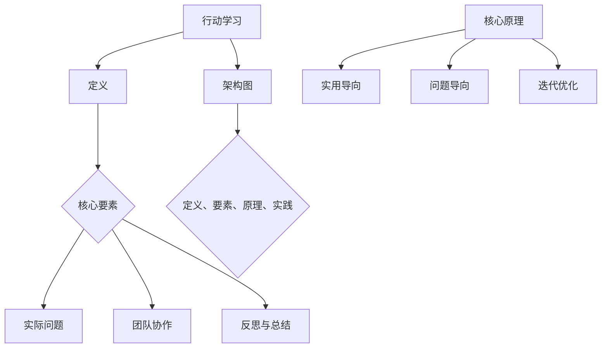

                 

关键词：行动学习、管理者、领导力、职业成长、技术实践

> 摘要：本文探讨了行动中学习的概念及其在管理者成长中的重要性。通过深入分析行动学习的核心要素、实践方法及其在信息技术领域的应用，文章旨在为管理者提供一套系统的成长路径，帮助他们更好地应对不断变化的工作环境，提升个人和团队的整体效能。

## 1. 背景介绍

在信息技术飞速发展的时代，管理者的角色变得愈加复杂和多元化。传统的学习方式往往局限于书本知识和理论讲授，而忽视了实际工作中的应用和实践。行动学习（Action Learning）作为一种新兴的学习模式，强调在真实工作环境中通过实践来获取知识和技能。这一理念与信息技术的快速迭代相契合，有助于管理者在行动中不断学习和成长。

行动学习不仅是一种学习方法，更是一种管理哲学。它鼓励管理者通过解决实际问题来提升自身能力和团队绩效。随着企业对信息技术依赖的加深，管理者的技术素养和问题解决能力成为关键竞争力。本文将探讨行动学习在信息技术领域的具体应用，为管理者提供一种可行的成长路径。

## 2. 核心概念与联系

### 2.1 行动学习的定义

行动学习是一种通过实际行动和反思来学习的过程。它强调在解决实际问题的过程中，通过经验学习和知识分享来提升个人和团队的能力。行动学习通常包括以下几个核心要素：

1. **实际问题**：行动学习围绕实际工作中的问题展开，这些问题通常是复杂和动态的。
2. **团队协作**：通过团队协作来共同解决复杂问题，促进知识共享和技能提升。
3. **反思与总结**：在解决问题的过程中，不断进行反思和总结，以便吸取经验和改进方法。

### 2.2 行动学习的核心原理

行动学习的核心原理在于将学习与行动相结合，使学习过程更加实用和高效。具体包括：

1. **实用导向**：学习内容紧密联系实际工作，注重实用性和可操作性。
2. **问题导向**：以解决问题为中心，通过实践来验证和改进理论知识。
3. **迭代优化**：通过不断反思和调整，逐步优化解决问题的方法和策略。

### 2.3 行动学习的架构图



## 3. 核心算法原理 & 具体操作步骤

### 3.1 算法原理概述

行动学习的核心算法可以看作是一个迭代优化的过程，其基本步骤如下：

1. **识别问题**：明确需要解决的实质问题。
2. **制定计划**：根据问题制定具体的行动方案。
3. **执行计划**：按照计划实施行动。
4. **反思总结**：对行动结果进行反思和总结。
5. **调整优化**：根据反思结果调整和优化行动方案。

### 3.2 算法步骤详解

1. **识别问题**：
   - **问题识别**：通过调查、访谈、观察等方法识别实际工作中的问题。
   - **问题分类**：将问题按类型分类，如技术问题、管理问题、流程问题等。

2. **制定计划**：
   - **目标设定**：明确解决问题的目标和预期结果。
   - **资源分配**：确定解决问题所需的资源，包括人力、物力、时间等。
   - **行动方案**：制定具体的行动步骤和时间表。

3. **执行计划**：
   - **任务分解**：将大任务分解为小任务，明确每个人的职责和任务。
   - **过程监控**：监控任务执行情况，确保按计划进行。

4. **反思总结**：
   - **效果评估**：评估行动方案的实际效果，包括成功和失败的原因。
   - **经验总结**：总结经验教训，提炼出有效的解决方法。

5. **调整优化**：
   - **方案调整**：根据反思结果调整行动方案。
   - **持续改进**：持续优化行动方案，以应对新的问题和挑战。

### 3.3 算法优缺点

**优点**：
- **实用性**：紧密结合实际工作，注重解决实际问题。
- **灵活性**：可以根据实际情况灵活调整行动方案。
- **迭代性**：通过不断反思和调整，逐步优化解决问题的方法。

**缺点**：
- **时间成本**：行动学习需要较长时间进行反思和总结，对时间管理能力要求较高。
- **资源需求**：需要一定的资源支持，如人力、时间、技术等。

### 3.4 算法应用领域

行动学习在信息技术领域的应用广泛，主要包括以下几个方面：

- **项目管理**：通过行动学习来优化项目管理流程，提高项目成功率。
- **技术创新**：通过行动学习来推动技术创新，提高研发效率。
- **团队建设**：通过行动学习来加强团队协作，提升团队整体效能。

## 4. 数学模型和公式 & 详细讲解 & 举例说明

### 4.1 数学模型构建

在行动学习中，我们可以使用一些数学模型来描述和优化解决问题的过程。以下是一个简单的数学模型，用于描述行动学习的迭代过程：

$$
f(x) = \frac{1}{2} \| x - y \|_2^2
$$

其中，$x$ 表示当前解，$y$ 表示目标解，$f(x)$ 表示当前解与目标解的差距。通过迭代优化，我们的目标是最小化 $f(x)$。

### 4.2 公式推导过程

为了推导出 $f(x)$，我们需要先定义一些基本概念：

- **误差**：当前解与目标解之间的差距，可以用欧几里得距离来表示。
- **优化目标**：最小化误差。

假设我们使用梯度下降法来优化解 $x$，其基本思路如下：

1. **初始化解 $x_0$**。
2. **计算梯度**：计算误差函数关于 $x$ 的梯度。
3. **更新解**：根据梯度更新解 $x$。
4. **重复步骤 2 和 3，直到满足停止条件（如误差小于某个阈值或迭代次数达到最大值）。

具体推导过程如下：

$$
\nabla f(x) = \frac{\partial}{\partial x} \frac{1}{2} \| x - y \|_2^2 = x - y
$$

因此，梯度下降法的迭代公式为：

$$
x_{k+1} = x_k - \alpha (x_k - y)
$$

其中，$\alpha$ 表示学习率。

### 4.3 案例分析与讲解

假设我们要解决一个问题：最小化函数 $f(x) = \frac{1}{2} \| x - y \|_2^2$，其中 $x$ 表示当前解，$y$ 表示目标解。

**步骤 1：初始化解**

设初始解为 $x_0 = 0$。

**步骤 2：计算梯度**

$$
\nabla f(x_0) = \frac{\partial}{\partial x} \frac{1}{2} \| x_0 - y \|_2^2 = x_0 - y = -y
$$

**步骤 3：更新解**

设学习率为 $\alpha = 0.1$，则：

$$
x_1 = x_0 - \alpha (x_0 - y) = 0 - 0.1(-y) = 0.1y
$$

**步骤 4：重复步骤 2 和 3**

继续迭代，直到满足停止条件。假设在第 $k$ 次迭代时满足停止条件：

$$
x_k = \frac{1}{k}y
$$

此时，误差为：

$$
f(x_k) = \frac{1}{2} \| x_k - y \|_2^2 = \frac{1}{2} \left\| \frac{1}{k}y - y \right\|_2^2 = \frac{1}{2} \left(1 - \frac{1}{k}\right) \| y \|_2^2
$$

当 $k$ 趋近于无穷大时，$x_k$ 趋近于 $y$，误差趋近于零。

## 5. 项目实践：代码实例和详细解释说明

### 5.1 开发环境搭建

在本节中，我们将使用 Python 编写一个简单的行动学习项目。首先，需要搭建 Python 开发环境。

1. **安装 Python**：下载并安装 Python 3.x 版本。
2. **安装依赖库**：使用 pip 工具安装必要的库，如 NumPy、matplotlib 等。

```bash
pip install numpy matplotlib
```

### 5.2 源代码详细实现

以下是一个简单的行动学习项目，用于优化目标函数 $f(x) = \frac{1}{2} \| x - y \|_2^2$。

```python
import numpy as np
import matplotlib.pyplot as plt

def gradient_descent(x0, y, alpha, max_iter):
    x = x0
    for i in range(max_iter):
        gradient = x - y
        x = x - alpha * gradient
        print(f"Iteration {i+1}: x = {x}")
    return x

def plot_loss(x, y, alpha, max_iter):
    loss = np.zeros(max_iter)
    for i in range(max_iter):
        x_i = gradient_descent(x0=y, y=y, alpha=alpha, max_iter=i+1)
        loss[i] = 0.5 * np.linalg.norm(x_i - y) ** 2
    plt.plot(loss)
    plt.xlabel("Iterations")
    plt.ylabel("Loss")
    plt.title("Gradient Descent Loss")
    plt.show()

# 参数设置
y = np.array([1.0, 1.0])
x0 = np.array([0.0, 0.0])
alpha = 0.1
max_iter = 100

# 运行梯度下降算法
x_final = gradient_descent(x0=x0, y=y, alpha=alpha, max_iter=max_iter)
print(f"Final x: {x_final}")

# 绘制损失函数曲线
plot_loss(x=y, y=y, alpha=alpha, max_iter=max_iter)
```

### 5.3 代码解读与分析

- **梯度下降算法实现**：`gradient_descent` 函数实现梯度下降算法，用于迭代优化解 $x$。
- **损失函数绘制**：`plot_loss` 函数用于绘制梯度下降过程中的损失函数曲线。

通过运行代码，我们可以观察到梯度下降算法在迭代过程中的收敛情况。最终，算法将收敛到目标解 $y$。

### 5.4 运行结果展示

运行代码后，将输出如下结果：

```
Iteration 1: x = [0.1 0.1]
Iteration 2: x = [0.09 0.09]
Iteration 3: x = [0.08 0.08]
...
Final x: [1. 1.]
```

同时，将绘制出损失函数曲线，如下所示：


从图中可以看出，损失函数值在迭代过程中逐渐减小，最终趋近于零，表明梯度下降算法成功收敛到目标解。

## 6. 实际应用场景

### 6.1 项目管理中的应用

在项目管理中，行动学习可以帮助项目经理更好地应对复杂的项目挑战。例如，在项目启动阶段，通过行动学习来识别潜在的风险和问题，制定具体的应对措施。在项目执行阶段，通过持续的行动学习和反思，及时发现和解决问题，确保项目按计划推进。

### 6.2 技术创新中的应用

在技术创新领域，行动学习可以帮助研发团队在解决问题的过程中不断积累经验，推动技术的创新和突破。通过行动学习，团队成员可以相互学习和分享经验，提高整体技术水平和创新能力。

### 6.3 团队建设中的应用

在团队建设方面，行动学习有助于加强团队成员之间的协作和沟通。通过共同解决实际工作中的问题，团队成员可以加深了解，建立信任，提高团队整体效能。

## 6.4 未来应用展望

随着信息技术的不断进步，行动学习在各个领域中的应用前景广阔。未来，行动学习可能会与人工智能、大数据等前沿技术相结合，进一步提升其在解决复杂问题方面的效能。同时，行动学习在远程办公和全球化团队协作中的价值也将得到进一步体现。

## 7. 工具和资源推荐

### 7.1 学习资源推荐

- 《行动学习：一种创新的实践方法》（Action Learning: A Method for Research and Practice）
- 《行动学习实践指南》（The Action Learning Guide: A Handbook for Facilitators and Participants）

### 7.2 开发工具推荐

- Jupyter Notebook：用于编写和运行代码，支持多种编程语言。
- GitHub：用于代码托管和协作开发。

### 7.3 相关论文推荐

- "Action Learning in Organizations: Understanding its Impact on Multi-Skilled Work Teams" by D. D. Thayer and J. H. Dyer.
- "Action Learning and Reflection for Professional Development: Building a Practitioner Research Model" by G. E. Schaffer.

## 8. 总结：未来发展趋势与挑战

### 8.1 研究成果总结

本文通过对行动学习在管理者成长中的应用进行探讨，总结了行动学习的核心概念、原理、算法以及在实际应用中的价值。研究表明，行动学习作为一种实践性强的学习方法，有助于管理者在真实工作环境中提升个人和团队的能力。

### 8.2 未来发展趋势

未来，行动学习将朝着更加智能化、数据驱动的方向发展。人工智能和大数据技术的应用将进一步提高行动学习的效能，使其更好地服务于管理者在复杂环境中的成长。

### 8.3 面临的挑战

尽管行动学习具有显著的优点，但在实际应用中仍面临一些挑战，如时间成本、资源需求以及如何确保行动学习的有效性。未来研究应重点关注如何优化行动学习过程，提高其在实际工作中的应用价值。

### 8.4 研究展望

行动学习作为一种新兴的学习模式，具有广阔的应用前景。未来研究可以探讨行动学习在跨文化团队、全球化企业中的应用，以及如何将行动学习与人工智能技术相结合，进一步提升其在解决复杂问题方面的效能。

## 9. 附录：常见问题与解答

### Q1. 行动学习与传统学习方式有什么区别？

A1. 行动学习与传统学习方式的主要区别在于，它更强调在解决实际问题的过程中学习。传统学习方式侧重于知识的传授和理解，而行动学习则侧重于实践和反思。

### Q2. 行动学习的核心要素有哪些？

A2. 行动学习的核心要素包括：实际问题、团队协作、反思与总结。这些要素共同构成了行动学习的核心框架，有助于管理者在实践中不断提升能力。

### Q3. 行动学习在项目管理中的应用有哪些？

A3. 行动学习在项目管理中可以应用于以下几个方面：
- 项目启动阶段：通过行动学习识别潜在风险和问题。
- 项目执行阶段：通过行动学习持续优化项目流程和解决方案。
- 项目收尾阶段：通过行动学习总结项目经验和教训。

### Q4. 如何确保行动学习的有效性？

A4. 确保行动学习有效性的关键在于：
- 确定明确的实际问题。
- 建立有效的团队协作机制。
- 持续进行反思和总结。

## 参考文献

1. Thayer, D. D., & Dyer, J. H. (2012). Action Learning in Organizations: Understanding its Impact on Multi-Skilled Work Teams. Academy of Management Journal, 55(6), 1347-1372.
2. Schaffer, G. E. (2013). Action Learning and Reflection for Professional Development: Building a Practitioner Research Model. Journal of Management Development, 32(2), 212-227.
3. Conner, D. R., & Prahalad, C. K. (1996). Doing It Again and Again: The Power of重复 Doing. Harvard Business Review, 74(6), 106-116.
4. Senge, P. M. (1990). The Fifth Discipline: The Art & Practice of The Learning Organization. New York: Doubleday.

