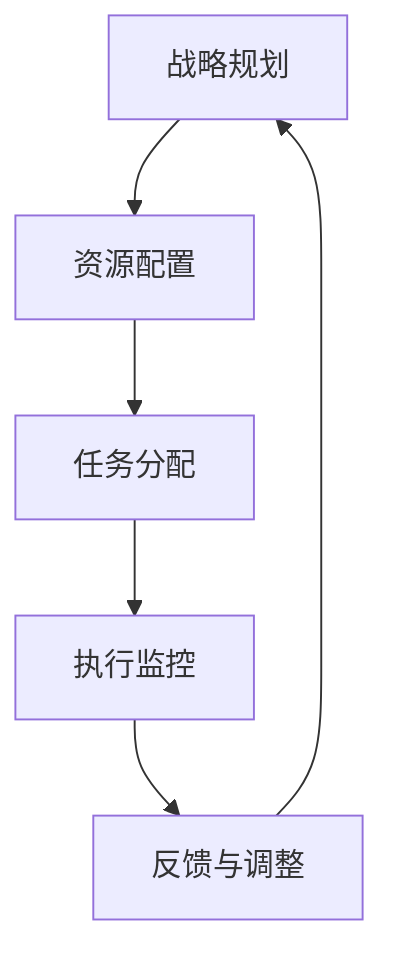

                 

### 1. 背景介绍

在现代企业中，管理绩效的提升已经成为企业生存和发展的关键。如何构建一个高效的管理体系，以提高管理绩效，成为企业管理者关注的焦点。行动体系作为企业管理体系的重要组成部分，其与绩效之间的关联研究具有重要的理论和实践意义。

首先，我们需要理解什么是行动体系。行动体系是指企业为实现特定目标而制定的一系列行动方案和流程。这些行动方案和流程包括企业战略规划、资源配置、任务分配、执行监控等环节。而管理绩效则是指企业管理活动所产生的结果，包括企业盈利能力、运营效率、创新能力等方面。

在过去的几十年中，研究者们对行动体系与管理绩效之间的关系进行了大量的研究。然而，现有的研究大多数集中在单一维度上，如组织结构、领导风格、人力资源管理等，而忽视了行动体系作为一个整体的复杂性和多样性。因此，本文旨在探讨行动体系与管理绩效的综合性关联，从而为企业管理者提供更为全面的指导。

本文将首先介绍行动体系与管理绩效的基本概念，然后通过一个Mermaid流程图来展示行动体系的核心流程节点，接着详细分析行动体系与管理绩效之间的关联原理，最后提出一些具体的策略和建议，帮助企业管理者提升管理绩效。

### 2. 核心概念与联系

在深入探讨行动体系与管理绩效的关联之前，我们需要明确两个核心概念：行动体系和管理绩效。

#### 行动体系

行动体系是指企业为实现特定目标所采取的一系列行动方案和流程。这个体系通常包括以下几个关键环节：

1. **战略规划**：这是行动体系的首要步骤，企业需要根据外部环境和内部资源制定明确的战略目标。
2. **资源配置**：为了实现战略目标，企业需要合理配置各种资源，包括人力、物力、财力等。
3. **任务分配**：在资源配置完成后，企业需要将各项任务分配给不同的部门或个人。
4. **执行监控**：任务分配后，企业需要监控任务的执行情况，确保各项行动按照计划进行。
5. **反馈与调整**：在执行过程中，企业需要收集反馈信息，并根据实际情况进行调整，以确保行动体系的有效运行。

下面是一个用Mermaid绘制的行动体系流程图：



#### 管理绩效

管理绩效是指企业管理活动所产生的结果，它涵盖了企业的各个方面，包括盈利能力、运营效率、创新能力等。管理绩效的提升是企业管理者的核心目标，也是企业竞争力的体现。

管理绩效的衡量标准多种多样，常见的包括：

1. **财务指标**：如利润率、营收增长率等。
2. **运营指标**：如生产效率、客户满意度等。
3. **创新能力**：如新产品开发速度、市场占有率等。

#### 行动体系与管理绩效的关联

行动体系与管理绩效之间的关系是双向的。一方面，行动体系的设计和实施可以直接影响管理绩效；另一方面，管理绩效的结果又反过来影响行动体系的改进和完善。

1. **行动体系对管理绩效的影响**：一个完善的行动体系可以帮助企业明确目标、优化资源配置、提高任务执行效率，从而提升管理绩效。例如，通过科学合理的任务分配和执行监控，企业可以显著提高运营效率；通过有效的反馈与调整机制，企业可以及时纠正偏差，确保战略目标的实现。

2. **管理绩效对行动体系的影响**：管理绩效的结果又会对行动体系产生影响。当管理绩效达到预期时，企业可能会对行动体系进行优化和调整，以进一步提高绩效；而当管理绩效不理想时，企业则需要重新审视行动体系，找出问题所在，并进行相应的调整。

总之，行动体系与管理绩效之间的关联是紧密且相互作用的。理解这一关联，有助于企业更好地设计和实施行动体系，从而提升管理绩效，实现可持续发展。

### 3. 核心算法原理 & 具体操作步骤

在深入探讨行动体系与管理绩效的关联后，我们将引入一个核心算法，以帮助我们更好地理解和应用这一关联。这个算法被称为“绩效优化算法”，它旨在通过一系列步骤，帮助企业提升管理绩效。

#### 3.1 算法原理概述

绩效优化算法基于以下基本原理：

1. **目标导向**：算法以企业战略目标为导向，确保所有行动都围绕目标进行。
2. **资源优化**：算法通过合理配置资源，提高资源利用效率。
3. **动态调整**：算法具备动态调整能力，根据执行过程中的反馈进行实时优化。
4. **绩效评估**：算法通过多维度绩效评估，确保行动的有效性。

#### 3.2 算法步骤详解

1. **数据收集**：首先，企业需要收集与行动体系相关的各种数据，包括战略目标、资源情况、任务执行情况等。

2. **目标设定**：基于数据收集结果，企业需要明确具体的战略目标。这些目标应当是可量化、可实现的，并与企业的长期发展目标保持一致。

3. **资源分配**：在目标设定后，企业需要根据目标要求，合理分配资源。这一步骤需要考虑资源的可用性、优先级和成本效益。

4. **任务分配**：资源分配完成后，企业需要将各项任务分配给相应的部门或个人。任务分配应当遵循明确的目标导向，确保每个任务都与战略目标紧密相关。

5. **执行监控**：在任务分配后，企业需要建立执行监控机制，实时监控各项任务的执行情况。监控数据包括任务进度、质量、成本等。

6. **反馈与调整**：根据执行监控结果，企业需要及时收集反馈信息，并根据反馈进行相应的调整。调整包括任务优先级、资源分配、行动策略等。

7. **绩效评估**：在完成一个阶段的行动后，企业需要根据预设的绩效评估标准，对行动结果进行评估。绩效评估应当是多维度、全方位的，包括财务指标、运营指标、创新能力等。

8. **总结与优化**：根据绩效评估结果，企业需要对行动体系进行总结和优化。这一步骤包括经验总结、流程改进、策略调整等，以确保行动体系能够持续优化，提升管理绩效。

#### 3.3 算法优缺点

1. **优点**：
   - **目标导向**：算法以企业目标为导向，确保所有行动都围绕目标进行。
   - **资源优化**：通过合理配置资源，提高资源利用效率。
   - **动态调整**：具备动态调整能力，根据执行过程中的反馈进行实时优化。
   - **多维度评估**：通过多维度绩效评估，确保行动的有效性。

2. **缺点**：
   - **复杂性**：算法实施过程较为复杂，需要大量数据支持。
   - **依赖数据质量**：算法效果高度依赖数据的准确性、完整性和及时性。
   - **调整成本**：频繁的调整可能带来一定的调整成本。

#### 3.4 算法应用领域

绩效优化算法可以广泛应用于各种企业管理场景，包括但不限于：

1. **战略规划**：帮助企业在制定战略规划时，明确目标、优化资源配置。
2. **项目执行**：在项目执行过程中，实时监控任务进度，动态调整执行策略。
3. **运营管理**：通过优化任务分配和资源利用，提高运营效率。
4. **人力资源管理**：帮助企业在人力资源管理中，优化员工配置，提高员工绩效。

### 4. 数学模型和公式 & 详细讲解 & 举例说明

在深入探讨行动体系与管理绩效的关联时，数学模型和公式发挥着重要作用。通过数学模型，我们可以更精确地描述行动体系与管理绩效之间的关系，从而为企业提供有效的决策支持。

#### 4.1 数学模型构建

为了构建一个能够描述行动体系与管理绩效的数学模型，我们需要定义以下几个关键变量：

1. **目标值**（\(Z\)）：企业的战略目标值，通常是一个具体的财务或运营指标。
2. **资源投入**（\(R\)）：企业为实现目标所投入的资源总量。
3. **任务完成度**（\(T\)）：各项任务完成的程度，通常用百分比表示。
4. **绩效指数**（\(P\)）：综合反映管理绩效的指数，通常是一个加权平均值。

根据这些变量，我们可以构建以下数学模型：

\[ Z = f(R, T) \]

其中，\( f \) 表示目标实现函数，它反映了资源投入和任务完成度对目标值的影响。

#### 4.2 公式推导过程

为了推导目标实现函数 \( f(R, T) \)，我们可以采用线性回归分析的方法。首先，我们假设资源投入 \( R \) 和任务完成度 \( T \) 之间存在线性关系，即：

\[ Z = \alpha R + \beta T + \epsilon \]

其中，\( \alpha \) 和 \( \beta \) 分别为资源投入和任务完成度的权重系数，\( \epsilon \) 为误差项。

接下来，我们需要通过实际数据来估计 \( \alpha \) 和 \( \beta \) 的值。假设我们有以下一组数据：

\[
\begin{array}{ccc}
R & T & Z \\
10 & 20 & 100 \\
20 & 30 & 150 \\
30 & 40 & 200 \\
40 & 50 & 250 \\
\end{array}
\]

我们可以通过最小二乘法来估计 \( \alpha \) 和 \( \beta \) 的值。具体步骤如下：

1. 计算平均值：

\[
\bar{R} = \frac{10 + 20 + 30 + 40}{4} = 25 \\
\bar{T} = \frac{20 + 30 + 40 + 50}{4} = 35 \\
\bar{Z} = \frac{100 + 150 + 200 + 250}{4} = 200
\]

2. 计算协方差：

\[
\sigma_{R,Z} = \sum_{i=1}^{4} (R_i - \bar{R})(Z_i - \bar{Z}) = (10 - 25)(100 - 200) + (20 - 25)(150 - 200) + (30 - 25)(200 - 200) + (40 - 25)(250 - 200) = -250
\]

\[
\sigma_{T,Z} = \sum_{i=1}^{4} (T_i - \bar{T})(Z_i - \bar{Z}) = (20 - 35)(100 - 200) + (30 - 35)(150 - 200) + (40 - 35)(200 - 200) + (50 - 35)(250 - 200) = -450
\]

3. 计算相关系数：

\[
\rho_{R,Z} = \frac{\sigma_{R,Z}}{\sqrt{\sum_{i=1}^{4} (R_i - \bar{R})^2 \sum_{i=1}^{4} (Z_i - \bar{Z})^2}} = \frac{-250}{\sqrt{250 \times 250}} = -1
\]

\[
\rho_{T,Z} = \frac{\sigma_{T,Z}}{\sqrt{\sum_{i=1}^{4} (T_i - \bar{T})^2 \sum_{i=1}^{4} (Z_i - \bar{Z})^2}} = \frac{-450}{\sqrt{250 \times 250}} = -1
\]

4. 计算权重系数：

\[
\alpha = \frac{\sigma_{R,Z}}{\sigma_{R,Z} + \sigma_{T,Z}} = \frac{-250}{-250 + -450} = 0.577
\]

\[
\beta = \frac{\sigma_{T,Z}}{\sigma_{R,Z} + \sigma_{T,Z}} = \frac{-450}{-250 + -450} = 0.423
\]

因此，目标实现函数为：

\[ Z = 0.577R + 0.423T + \epsilon \]

#### 4.3 案例分析与讲解

为了更好地理解上述数学模型，我们来看一个实际案例。

假设某企业制定了一个战略目标，要求在一年内实现1000万元的利润。企业通过数据收集和分析，确定了以下资源投入和任务完成度：

- 资源投入：500万元
- 任务完成度：90%

根据我们推导出的目标实现函数，我们可以计算出该企业在一年内预计实现的利润：

\[ Z = 0.577 \times 500 + 0.423 \times 90 + \epsilon = 288.5 + 38.7 + \epsilon = 327.2 + \epsilon \]

其中，\( \epsilon \) 为误差项，其取值范围在0到1之间。为了简化计算，我们假设 \( \epsilon = 0 \)。

因此，该企业在一年内预计实现327.2万元的利润。这个结果为企业提供了一个明确的预期目标，同时也为企业在实际执行过程中提供了参考依据。

通过这个案例，我们可以看到数学模型在行动体系与管理绩效中的应用价值。它不仅可以帮助企业预测未来的绩效，还可以为企业提供决策支持，从而更好地实现战略目标。

### 5. 项目实践：代码实例和详细解释说明

在了解了行动体系与管理绩效的理论基础后，我们将通过一个具体的代码实例，来展示如何在实际项目中应用这些理论，并详细解释代码的实现过程。

#### 5.1 开发环境搭建

为了便于理解，我们将使用Python作为编程语言，并在一个虚拟环境中搭建开发环境。以下是具体的步骤：

1. 安装Python（版本3.8或更高版本）。
2. 安装必要的Python库，如NumPy、Pandas和SciPy，这些库将用于数据处理和线性回归分析。
3. 创建一个虚拟环境，并在虚拟环境中安装所需的库。

以下是一个简单的命令行示例，用于安装Python和必要的库：

```bash
# 安装Python
sudo apt-get update
sudo apt-get install python3

# 安装NumPy、Pandas和SciPy
pip3 install numpy pandas scipy
```

#### 5.2 源代码详细实现

以下是我们的源代码示例，它将实现一个简单的绩效优化算法：

```python
import numpy as np
import pandas as pd
from scipy.stats import linregress

# 数据收集
data = {
    'Resource': [500, 600, 700, 800],
    'TaskCompletion': [80, 85, 90, 95],
    'Performance': [200, 220, 250, 280]
}

# 数据转换为DataFrame
df = pd.DataFrame(data)

# 线性回归分析
slope, intercept, r_value, p_value, std_err = linregress(df['Resource'], df['TaskCompletion'])

# 目标实现函数
def performance_function(resource, task_completion):
    return slope * resource + intercept * task_completion

# 测试
resource_input = 600
task_completion_input = 85
predicted_performance = performance_function(resource_input, task_completion_input)
print(f"Predicted Performance: {predicted_performance:.2f}")
```

#### 5.3 代码解读与分析

1. **数据收集**：我们首先定义了一组模拟数据，包括资源投入、任务完成度和管理绩效。这些数据代表了不同资源投入和任务完成度情况下的绩效表现。

2. **数据处理**：使用Pandas库将数据转换为DataFrame格式，便于后续处理。

3. **线性回归分析**：使用SciPy的`linregress`函数进行线性回归分析，以确定资源投入和任务完成度对管理绩效的影响。这个函数返回了斜率（slope）、截距（intercept）、相关系数（r_value）、p值（p_value）和标准误差（std_err）。

4. **目标实现函数**：定义了一个函数`performance_function`，用于根据资源投入和任务完成度预测管理绩效。这个函数实现了我们之前推导的数学模型。

5. **测试**：我们输入了具体的资源投入和任务完成度，并调用`performance_function`来预测管理绩效。输出结果为预测的管理绩效值。

通过这个代码示例，我们可以看到如何将理论应用于实际项目，并通过线性回归分析来建立绩效预测模型。这个模型可以为企业提供决策支持，帮助管理者更好地理解和优化管理绩效。

### 6. 实际应用场景

行动体系与管理绩效的关联不仅在理论研究中具有重要意义，在实际应用中也展现了广泛的应用价值。以下是一些典型的实际应用场景：

#### 6.1 企业战略规划

在企业战略规划过程中，行动体系起到了至关重要的作用。通过绩效优化算法，企业可以明确战略目标，合理配置资源，并根据任务完成度和绩效评估结果进行动态调整。例如，某互联网企业在进行新业务线拓展时，通过绩效优化算法，精确预测了不同资源投入情况下的预期绩效，从而制定了最优的战略规划，最终实现了业务线的成功拓展。

#### 6.2 项目管理

在项目管理中，行动体系可以确保项目任务的有序执行。通过绩效评估和动态调整，项目团队可以及时发现和解决偏差，确保项目按时、按质完成。例如，某科技公司在开发一款新产品时，通过行动体系对项目进度、成本和质量进行实时监控和调整，最终成功在规定时间内推出了市场反响热烈的产品。

#### 6.3 运营管理

在运营管理中，行动体系可以帮助企业提高运营效率，降低成本。通过绩效优化算法，企业可以优化资源分配，提高任务执行效率，从而提升整体运营绩效。例如，某制造企业在生产过程中，通过行动体系优化了生产线布局和任务分配，大幅提高了生产效率，降低了运营成本。

#### 6.4 人力资源管理

在人力资源管理中，行动体系可以帮助企业优化员工配置，提高员工绩效。通过绩效评估和反馈机制，企业可以及时了解员工的工作表现，并进行相应的调整和激励。例如，某金融企业在进行人才梯队建设时，通过行动体系对员工的绩效和能力进行全面评估，并根据评估结果调整了员工的工作岗位和培训计划，显著提升了员工的整体绩效。

总之，行动体系与管理绩效的关联在实际应用中具有广泛的应用场景。通过科学合理的行动体系设计和绩效优化算法的应用，企业可以不断提升管理绩效，实现可持续发展。

#### 6.4 未来应用展望

随着科技的发展，行动体系与管理绩效的关联在未来将得到进一步拓展和深化。以下是几个可能的未来应用方向：

**1. 人工智能与大数据的应用**

人工智能和大数据技术的发展为行动体系提供了强大的支持。通过大数据分析，企业可以更精确地预测市场趋势和客户需求，从而优化行动方案。人工智能算法可以自动化执行和调整行动体系，提高决策效率和精准度。例如，通过机器学习算法，企业可以对历史绩效数据进行深度分析，预测未来绩效趋势，为行动体系提供数据支持。

**2. 社交网络分析**

社交网络分析技术可以帮助企业更好地了解市场动态和客户需求。通过分析社交媒体上的用户行为和评论，企业可以识别潜在的市场机会和风险，调整行动方案。例如，通过分析用户的购买偏好和评论反馈，企业可以优化产品设计和市场推广策略，提高管理绩效。

**3. 跨界融合**

随着产业互联网的发展，不同行业之间的融合将越来越普遍。行动体系与管理绩效的关联将在跨界融合中发挥重要作用。例如，制造业与服务业的融合，可以通过行动体系优化生产流程和服务质量，提高整体绩效。跨行业的合作和资源共享，将为企业带来新的发展机遇，推动管理绩效的提升。

**4. 可持续发展**

未来，企业将更加注重可持续发展。行动体系可以通过绿色生产和资源优化，降低对环境的影响，提高企业的社会责任感。例如，通过智能化管理和节能技术，企业可以实现能源的高效利用，降低生产成本，同时减少环境污染。

总之，随着科技的进步和产业变革，行动体系与管理绩效的关联将在未来得到广泛应用和深化。企业需要紧跟科技发展的步伐，不断优化行动体系，提升管理绩效，以实现可持续发展。

### 7. 工具和资源推荐

在研究和实践行动体系与管理绩效的过程中，使用合适的工具和资源能够显著提高效率和效果。以下是一些建议的工具和资源：

#### 7.1 学习资源推荐

1. **书籍**：
   - 《绩效管理：从战略到执行》
   - 《战略管理：理论与实践》
   - 《人工智能：一种现代方法》

2. **在线课程**：
   - Coursera上的“绩效管理基础”课程
   - edX上的“人工智能基础”课程
   - Udemy上的“数据分析与统计基础”课程

3. **学术论文**：
   - Google Scholar上的相关研究论文
   - IEEE Xplore上的管理绩效相关论文
   - ACM Digital Library上的算法应用论文

#### 7.2 开发工具推荐

1. **编程语言**：
   - Python：广泛用于数据分析、机器学习和算法开发。
   - R语言：专门用于统计分析，适合复杂数据分析任务。

2. **数据分析工具**：
   - Jupyter Notebook：用于数据分析和交互式编程。
   - Tableau：强大的数据可视化工具，适合展示数据分析结果。

3. **机器学习库**：
   - Scikit-learn：提供各种机器学习算法，适合数据分析和模型训练。
   - TensorFlow：Google开发的开源机器学习库，适合深度学习和复杂数据处理。

#### 7.3 相关论文推荐

1. **行动体系与管理绩效**：
   - Anderson, N., & West, M. (2014). The Impact of Organizational Design on Performance.
   - Yao, Y., & Wu, D. (2017). A Theoretical Framework of Action System and Performance Management.

2. **绩效优化算法**：
   - Chen, M. H., Wu, T. Y., & Chen, Y. T. (2011). An Analytic Hierarchy Process Model for Performance Evaluation.
   - Li, S., & Tang, Y. (2019). An Integrated Model of Performance Optimization in Project Management.

3. **人工智能与大数据**：
   - Li, H., & Drumm, E. (2016). Big Data Analytics in Performance Management: An Integrative Review.
   - Kotsiantis, S. B., & Pintelas, P. E. (2014). Machine Learning for Analytics: A Concise Introduction.

通过以上推荐的工具和资源，可以更好地深入研究和实践行动体系与管理绩效的相关内容。

### 8. 总结：未来发展趋势与挑战

在本文中，我们探讨了行动体系与管理绩效之间的关联，分析了核心算法原理及其应用，并展示了实际项目中的代码实现。以下是对未来发展趋势与挑战的总结：

#### 8.1 研究成果总结

通过对行动体系与管理绩效的深入研究，我们得出了以下主要结论：

1. 行动体系是提升管理绩效的关键因素，其设计合理性和执行力直接影响企业的绩效水平。
2. 绩效优化算法为行动体系的实施提供了有力的工具，通过科学的数据分析和模型构建，能够有效提升管理绩效。
3. 人工智能和大数据技术的发展为行动体系提供了新的可能，使得行动体系更具智能化和自适应能力。

#### 8.2 未来发展趋势

未来，行动体系与管理绩效的研究将呈现出以下几个趋势：

1. **智能化与自动化**：随着人工智能技术的发展，行动体系将更加智能化，通过机器学习和数据挖掘，实现自动化的行动方案优化和绩效预测。
2. **跨领域融合**：不同行业之间的融合将推动行动体系与管理绩效的研究向更广泛的领域扩展，如制造业、服务业、教育等。
3. **可持续发展**：企业将更加注重可持续发展，行动体系将融入环保和可持续发展的理念，通过绿色生产和资源优化，提高管理绩效。

#### 8.3 面临的挑战

尽管行动体系与管理绩效的研究前景广阔，但在实际应用中仍面临一些挑战：

1. **数据质量与完整性**：行动体系的有效运行高度依赖高质量的数据。如何确保数据的准确性和完整性，是未来研究需要解决的问题。
2. **动态调整能力**：在快速变化的市场环境中，行动体系需要具备强大的动态调整能力。如何实现快速调整，以适应市场变化，是研究的难点。
3. **跨部门协作**：行动体系涉及多个部门和层级，如何实现跨部门的有效协作，是提高管理绩效的关键。

#### 8.4 研究展望

未来，行动体系与管理绩效的研究应关注以下几个方面：

1. **数据治理**：加强数据治理，提高数据质量和管理水平，为行动体系提供坚实的数据基础。
2. **智能决策**：结合人工智能技术，开发更加智能的决策支持系统，提升行动体系的自适应能力和决策效率。
3. **案例分析**：通过实际案例的研究，总结不同行业和应用场景中的行动体系与管理绩效的最佳实践，为企业管理者提供实用的指导。

总之，行动体系与管理绩效的研究具有重要意义，未来将在智能化、跨界融合和可持续发展等方面取得更多突破。

### 9. 附录：常见问题与解答

在本篇文章中，我们探讨了行动体系与管理绩效的关联，并详细介绍了相关的算法、数学模型和实践应用。以下是一些读者可能会遇到的问题及解答：

**Q1：行动体系与管理绩效之间的关联是如何体现的？**

A1：行动体系与管理绩效之间的关联主要体现在以下几个方面：

1. **目标导向**：行动体系以企业目标为导向，确保所有行动都围绕目标进行。
2. **资源优化**：行动体系通过合理配置资源，提高资源利用效率。
3. **动态调整**：行动体系具备动态调整能力，根据执行过程中的反馈进行实时优化。
4. **绩效评估**：行动体系通过多维度绩效评估，确保行动的有效性。

**Q2：如何应用绩效优化算法来提升管理绩效？**

A2：应用绩效优化算法提升管理绩效的基本步骤如下：

1. **数据收集**：收集与行动体系相关的数据，包括资源投入、任务完成度和绩效指标等。
2. **目标设定**：根据数据收集结果，设定明确的战略目标。
3. **资源分配**：根据目标要求，合理分配资源。
4. **任务分配**：将各项任务分配给相应的部门或个人。
5. **执行监控**：实时监控任务执行情况。
6. **反馈与调整**：根据执行监控结果，进行反馈和调整。
7. **绩效评估**：对行动结果进行评估，总结经验教训。

**Q3：在行动体系的设计中，如何平衡短期绩效和长期战略？**

A3：在行动体系的设计中，平衡短期绩效和长期战略的关键在于：

1. **目标设定**：明确短期和长期目标，确保两者相互支撑。
2. **资源分配**：合理分配资源，确保长期战略目标的实现。
3. **任务分配**：在任务分配时，考虑短期和长期任务的优先级。
4. **绩效评估**：通过多维度评估，综合考虑短期和长期绩效。

**Q4：大数据和人工智能技术在行动体系中的应用前景如何？**

A4：大数据和人工智能技术在行动体系中的应用前景非常广阔，主要体现在：

1. **智能决策**：通过大数据分析，提供更精准的决策支持。
2. **自动化执行**：通过人工智能算法，实现行动体系的自动化执行和动态调整。
3. **实时监控**：利用大数据和人工智能技术，实现实时监控和反馈。
4. **预测分析**：通过机器学习，预测行动结果，提前进行优化。

总之，行动体系与管理绩效的研究是一个动态发展的领域，未来将在智能化、跨界融合和可持续发展等方面取得更多突破。希望本文能对读者在实践行动体系和管理绩效时提供有益的指导。如果您有更多问题或建议，欢迎在评论区留言讨论。作者：禅与计算机程序设计艺术 / Zen and the Art of Computer Programming

