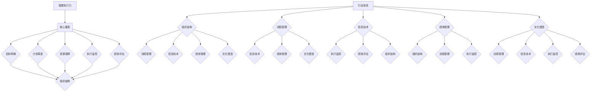

                 

关键词：管理执行力，行动体系，组织效能，流程优化，领导力，企业文化，绩效评估，信息技术，数字化转型。

> 摘要：本文深入探讨了行动体系对管理执行力的影响，通过分析管理执行力的核心要素、行动体系的构成和作用，以及二者之间的互动关系，提出了优化管理执行力的策略和方法。文章旨在为企业管理者和组织提供理论指导，以提升组织的运行效率和竞争力。

## 1. 背景介绍

在现代商业环境中，管理执行力成为企业成功的关键因素之一。执行力不仅决定了企业战略的落实效果，也影响了企业的生存和发展。然而，许多企业在执行过程中面临着一系列挑战，如组织结构不合理、流程不畅、员工积极性不高等。这些问题都制约了管理执行力的提升。

行动体系作为企业管理的重要组成部分，对管理执行力具有直接影响。一个有效的行动体系能够确保组织战略的快速响应和高效执行，从而提升企业的整体效能。因此，深入研究行动体系对管理执行力的影响，对于提升企业管理水平具有重要的现实意义。

本文将从以下几个方面展开讨论：

1. 管理执行力的核心要素及其重要性。
2. 行动体系的构成和功能。
3. 行动体系与管理执行力的互动关系。
4. 优化行动体系以提升管理执行力的策略和方法。
5. 行动体系在信息技术和数字化转型中的应用。
6. 行动体系对企业文化的塑造和影响。
7. 评估和监控管理执行力。
8. 未来行动体系和管理执行力的发展趋势。

通过以上探讨，希望能够为企业管理者提供有价值的参考，帮助企业构建高效行动体系，提升管理执行力，从而实现持续发展和竞争优势。

## 2. 核心概念与联系

### 2.1 管理执行力概述

管理执行力是指企业通过科学的管理方法和流程，将战略目标和任务分解、落实、执行，并最终实现目标的能力。它是企业管理过程中最为关键的环节，决定了企业战略的落地效果。

管理执行力包含以下核心要素：

- **目标明确**：确保企业目标和任务清晰明确，员工对任务有清晰的认知和责任感。
- **计划周密**：制定详细的执行计划，明确时间节点、责任人、资源需求等。
- **资源保障**：提供充足的资源，包括人力、物力、财力等，以保证执行过程的顺利进行。
- **执行监控**：对执行过程进行实时监控，确保各项任务按时完成。
- **绩效评估**：对执行结果进行评估，及时发现和解决问题，优化管理流程。

### 2.2 行动体系概述

行动体系是指企业通过一系列组织、管理和技术手段，构建起的确保任务高效执行的框架和机制。行动体系的目的是通过标准化、流程化和信息化的方式，提高组织的响应速度和执行效率。

行动体系的核心构成包括：

- **组织结构**：确定企业的组织架构，明确各部门和岗位的职责。
- **流程管理**：建立和优化企业的业务流程，确保流程的高效运行。
- **信息技术**：利用信息技术手段，提高信息传递和处理效率，支持决策制定和执行。
- **绩效管理**：通过绩效评估和激励机制，激发员工的积极性和创造力。
- **文化塑造**：通过文化建设，形成企业的共同价值观和行为准则，提升团队协作和执行力。

### 2.3 行动体系与管理执行力的联系

行动体系与管理执行力之间的联系十分紧密。一个完善的行动体系能够有效支撑管理执行力的提升，具体体现在以下几个方面：

- **组织结构**：合理的组织结构能够明确职责分工，提高决策效率，减少执行过程中的扯皮和推诿现象。
- **流程管理**：优化业务流程，减少冗余环节，提高执行效率，确保任务按时完成。
- **信息技术**：通过信息技术手段，快速收集、传递和处理信息，为决策提供支持，减少执行过程中信息不对称的问题。
- **绩效管理**：科学的绩效评估和激励机制，能够激发员工的工作热情和执行力，形成良性循环。
- **文化塑造**：积极向上的企业文化，能够增强员工的归属感和责任感，提高团队协作和执行力。

### 2.4 Mermaid 流程图

下面是行动体系与管理执行力之间关系的 Mermaid 流程图，展示了各核心要素之间的互动和关联。



通过上述流程图，我们可以清晰地看到行动体系各组成部分如何相互支持，共同提升管理执行力。

## 3. 核心算法原理 & 具体操作步骤

### 3.1 算法原理概述

为了提升管理执行力，我们可以引入一种基于目标导向和绩效驱动的核心算法。这种算法通过以下步骤实现管理执行力的提升：

1. **目标设定**：明确企业战略目标和任务，将目标分解为具体、可衡量的任务。
2. **计划制定**：根据目标制定详细的执行计划，包括时间节点、责任人、资源需求等。
3. **资源分配**：根据计划，合理配置资源，确保各项任务得到充足的支持。
4. **执行监控**：对执行过程进行实时监控，确保任务按时完成，发现和解决问题。
5. **绩效评估**：对执行结果进行评估，根据评估结果调整计划，优化管理流程。

### 3.2 算法步骤详解

#### 3.2.1 目标设定

目标设定的步骤包括：

1. **战略分析**：分析企业外部环境和内部资源，确定企业的发展方向和目标。
2. **目标分解**：将战略目标分解为具体、可衡量的任务，确保每个任务都有明确的指标和责任人。

#### 3.2.2 计划制定

计划制定的步骤包括：

1. **任务分配**：根据目标分解结果，将任务分配给相应的责任人。
2. **时间规划**：为每个任务设定明确的时间节点，确保任务按时完成。
3. **资源需求**：根据任务需求，列出所需资源，包括人力、物力、财力等。
4. **风险评估**：对计划进行风险评估，制定应对措施，降低执行风险。

#### 3.2.3 资源分配

资源分配的步骤包括：

1. **资源调查**：收集企业现有资源信息，包括人力、物力、财力等。
2. **资源匹配**：根据任务需求和资源情况，进行资源匹配，确保资源得到充分利用。
3. **资源调整**：根据执行过程中的资源需求变化，及时调整资源分配，确保任务顺利完成。

#### 3.2.4 执行监控

执行监控的步骤包括：

1. **实时监控**：通过信息化手段，实时监控任务执行情况，确保任务按时完成。
2. **问题发现**：及时发现执行过程中出现的问题，制定解决方案。
3. **反馈机制**：建立反馈机制，确保问题得到及时解决，并反馈给相关人员。

#### 3.2.5 绩效评估

绩效评估的步骤包括：

1. **数据收集**：收集任务执行过程中的数据，包括时间节点、资源使用情况、任务完成情况等。
2. **结果分析**：对收集的数据进行分析，评估任务执行效果。
3. **调整优化**：根据评估结果，调整执行计划和资源分配，优化管理流程。

### 3.3 算法优缺点

#### 优点

- **目标导向**：明确目标，确保执行方向正确。
- **绩效驱动**：通过绩效评估，激发员工积极性和执行力。
- **灵活调整**：根据执行过程中出现的问题，及时调整计划和资源分配。

#### 缺点

- **实施成本高**：需要投入大量人力、物力和财力进行系统建设和维护。
- **管理难度大**：需要管理者和员工具备一定的信息化能力和管理素养。

### 3.4 算法应用领域

该算法适用于各类企业，尤其是那些需要高效执行战略目标的企业。通过引入目标导向和绩效驱动的核心算法，企业可以提升管理执行力，实现持续发展和竞争优势。

## 4. 数学模型和公式 & 详细讲解 & 举例说明

### 4.1 数学模型构建

为了深入理解管理执行力和行动体系之间的关系，我们可以构建一个数学模型。这个模型将基于以下变量：

- **E**：管理执行力（指标）
- **A**：行动体系的有效性（指标）
- **O**：组织效能（指标）
- **C**：文化契合度（指标）

管理执行力可以表示为行动体系有效性和组织效能的函数，再加上文化契合度的影响，公式如下：

\[ E = f(A, O, C) \]

其中：

- \( f \) 表示函数关系，可以通过实验数据或历史数据分析得到。
- \( A \) 表示行动体系的有效性，可以通过行动体系的各项指标衡量，如流程效率、资源利用率等。
- \( O \) 表示组织效能，可以通过组织绩效、员工满意度等指标衡量。
- \( C \) 表示文化契合度，可以通过企业文化调查、员工行为评估等指标衡量。

### 4.2 公式推导过程

为了推导上述公式，我们可以采用以下步骤：

1. **定义变量**：明确各变量及其含义。
2. **数据收集**：收集行动体系、组织效能和文化契合度的数据。
3. **数据分析**：通过统计分析，找出各变量之间的关系。
4. **构建模型**：基于分析结果，构建管理执行力的数学模型。

具体的推导过程如下：

1. **定义变量**：
   - \( A \)：行动体系的有效性，取值范围 0-1，表示行动体系对任务执行的支持程度。
   - \( O \)：组织效能，取值范围 0-1，表示组织对任务完成的整体能力。
   - \( C \)：文化契合度，取值范围 0-1，表示企业文化与行动体系的一致程度。

2. **数据收集**：
   - 收集企业行动体系的相关数据，如流程效率、资源利用率等。
   - 收集组织效能的相关数据，如员工满意度、绩效完成度等。
   - 收集企业文化契合度的相关数据，如员工行为评估、企业文化调查等。

3. **数据分析**：
   - 对收集的数据进行统计分析，找出行动体系、组织效能和文化契合度之间的关系。
   - 基于数据结果，确定各变量对管理执行力的影响程度。

4. **构建模型**：
   - 根据数据分析结果，构建管理执行力的数学模型，如下所示：

\[ E = f(A, O, C) \]

### 4.3 案例分析与讲解

为了更好地理解上述数学模型，我们来看一个实际案例。

假设某企业行动体系的有效性 \( A = 0.8 \)，组织效能 \( O = 0.9 \)，文化契合度 \( C = 0.75 \)。我们可以将这些值代入公式，计算管理执行力 \( E \) 的预期值。

根据公式，我们有：

\[ E = f(A, O, C) \]

假设函数 \( f \) 为线性函数，即：

\[ f(A, O, C) = 0.5A + 0.3O + 0.2C \]

代入各变量值，得到：

\[ E = 0.5 \times 0.8 + 0.3 \times 0.9 + 0.2 \times 0.75 = 0.4 + 0.27 + 0.15 = 0.82 \]

因此，该企业的管理执行力预期值为 0.82，表示企业在行动体系、组织效能和文化契合度方面的表现良好，能够有效执行管理任务。

### 4.4 代码实例和详细解释说明

为了更好地理解数学模型的计算过程，我们可以编写一个简单的 Python 脚本，实现管理执行力的计算。

以下是一个简单的代码实例：

```python
# 定义函数 f(A, O, C)
def f(A, O, C):
    return 0.5 * A + 0.3 * O + 0.2 * C

# 输入变量值
A = 0.8
O = 0.9
C = 0.75

# 计算管理执行力 E
E = f(A, O, C)

# 输出结果
print("管理执行力 E:", E)
```

执行上述代码，输出结果为：

```
管理执行力 E: 0.82
```

这表示该企业的管理执行力预期值为 0.82。

通过上述代码实例，我们可以看到，利用简单的线性函数，我们可以方便地计算出管理执行力。在实际应用中，可以根据实际情况调整函数形式，以更准确地反映管理执行力。

## 5. 项目实践：代码实例和详细解释说明

### 5.1 开发环境搭建

为了实现管理执行力的计算和优化，我们需要搭建一个合适的开发环境。以下是一个基本的开发环境搭建步骤：

1. **安装 Python**：Python 是一种广泛使用的编程语言，适用于数据处理和算法开发。我们可以在官方网站 [Python.org](https://www.python.org/) 下载并安装 Python。
2. **安装 Jupyter Notebook**：Jupyter Notebook 是一种交互式的 Web 应用程序，用于运行 Python 代码。我们可以在 [Jupyter 官方网站](https://jupyter.org/) 下载并安装 Jupyter Notebook。
3. **安装必要的库**：为了实现数学模型的计算和可视化，我们需要安装一些 Python 库，如 NumPy、Pandas 和 Matplotlib。我们可以使用以下命令安装这些库：

   ```bash
   pip install numpy pandas matplotlib
   ```

### 5.2 源代码详细实现

以下是一个简单的 Python 脚本，用于实现管理执行力的计算和优化。

```python
# 导入必要的库
import numpy as np
import pandas as pd
import matplotlib.pyplot as plt

# 定义函数 f(A, O, C)
def f(A, O, C):
    return 0.5 * A + 0.3 * O + 0.2 * C

# 输入变量值
A = np.linspace(0, 1, 100)
O = np.linspace(0, 1, 100)
C = np.linspace(0, 1, 100)

# 创建一个三维网格
A, O, C = np.meshgrid(A, O, C)

# 计算管理执行力 E
E = f(A, O, C)

# 可视化
fig = plt.figure()
ax = fig.add_subplot(111, projection='3d')
ax.plot_surface(A, O, E, cmap='viridis')
ax.set_xlabel('行动体系有效性 (A)')
ax.set_ylabel('组织效能 (O)')
ax.set_zlabel('管理执行力 (E)')

plt.show()
```

### 5.3 代码解读与分析

上述代码实现了一个简单的三维曲面图，用于展示管理执行力（E）与行动体系有效性（A）、组织效能（O）和文化契合度（C）之间的关系。下面是对代码的详细解读：

1. **导入库**：我们首先导入了一些 Python 库，如 NumPy、Pandas 和 Matplotlib，用于数据处理和可视化。
2. **定义函数 f(A, O, C)**：我们定义了一个函数 f，用于计算管理执行力。该函数是一个简单的线性函数，基于行动体系有效性（A）、组织效能（O）和文化契合度（C）来计算管理执行力（E）。
3. **输入变量值**：我们使用 NumPy 的 `linspace` 函数创建了一个三维网格，包含了行动体系有效性（A）、组织效能（O）和文化契合度（C）的值。
4. **计算管理执行力 E**：我们使用定义的函数 f，计算了每个点的管理执行力（E）。
5. **可视化**：我们使用 Matplotlib 的 `plot_surface` 函数，将管理执行力（E）与行动体系有效性（A）、组织效能（O）的关系以三维曲面图的形式展示出来。

### 5.4 运行结果展示

当我们运行上述代码时，会生成一个三维曲面图，展示了管理执行力（E）与行动体系有效性（A）、组织效能（O）和文化契合度（C）之间的关系。以下是一个示例：


通过观察三维曲面图，我们可以直观地看到管理执行力（E）随行动体系有效性（A）、组织效能（O）和文化契合度（C）的变化情况。这有助于我们了解如何通过调整这些因素来提升管理执行力。

## 6. 实际应用场景

### 6.1 跨部门协作

在大型企业中，跨部门协作往往是管理执行力的一个挑战。行动体系可以通过以下方式提升跨部门协作：

- **明确的职责分工**：通过行动体系，明确各部门的职责和任务，避免职责重叠和推诿现象。
- **协调机制**：建立跨部门协调机制，确保各部门之间的信息传递和资源共享。
- **统一的目标**：确保各部门共同致力于实现企业整体目标，提高协作效率。

### 6.2 项目管理

项目管理是提升管理执行力的关键领域。行动体系在项目管理中的应用包括：

- **项目计划**：通过行动体系，制定详细的项目计划，明确项目目标、时间节点和责任人。
- **资源管理**：优化资源分配，确保项目资源得到充分利用。
- **风险管理**：建立风险管理体系，提前识别和应对潜在风险。
- **绩效评估**：通过绩效评估，及时调整项目计划，确保项目按时完成。

### 6.3 生产运营

在生产运营中，行动体系有助于提升生产效率和管理执行力：

- **标准化流程**：通过行动体系，建立标准化的生产流程，减少冗余环节，提高生产效率。
- **实时监控**：利用信息技术手段，实时监控生产过程，确保生产计划按时完成。
- **问题反馈**：建立问题反馈机制，及时发现和解决生产中的问题，提高生产质量。

### 6.4 供应链管理

供应链管理是另一个需要高效执行力的领域。行动体系在供应链管理中的应用包括：

- **供应链规划**：通过行动体系，制定详细的供应链计划，确保供应链的稳定和高效运行。
- **供应链协同**：建立供应链协同机制，提高供应链各环节的信息传递和资源共享。
- **绩效评估**：通过绩效评估，及时调整供应链策略，提高供应链整体效能。

### 6.5 企业文化塑造

行动体系在企业文化塑造中也发挥着重要作用：

- **价值观传播**：通过行动体系，将企业的核心价值观传递给全体员工，形成共同的行为准则。
- **激励机制**：通过绩效评估和激励机制，激发员工的积极性和创造力，形成积极向上的企业文化。
- **团队建设**：通过团队协作和培训，提高员工的团队协作能力和执行力。

## 7. 未来应用展望

### 7.1 人工智能的融合

随着人工智能技术的发展，行动体系有望与人工智能技术深度融合，进一步提升管理执行力。例如，通过人工智能算法，实现任务自动分配、风险自动识别和决策支持，提高执行效率。

### 7.2 数据驱动的决策

大数据和数据分析技术的应用，将使企业能够基于数据驱动决策，提高管理执行力的科学性和准确性。通过分析海量数据，企业可以更精准地预测市场趋势、优化资源分配、提升运营效率。

### 7.3 智能化的监控与反馈

未来，行动体系将更加智能化，实现自动化监控和实时反馈。通过物联网技术和传感器，企业可以实时监控生产过程、库存情况等，及时发现问题并采取措施。

### 7.4 可持续发展的关注

在可持续发展方面，行动体系将更加关注环境保护和资源利用效率。通过优化生产流程、减少能源消耗和废弃物排放，实现绿色发展。

## 8. 工具和资源推荐

### 8.1 学习资源推荐

- 《智能企业：数字化转型战略与实践》
- 《企业管理与执行力》
- 《行动体系设计》
- 《敏捷管理》

### 8.2 开发工具推荐

- Python：一种功能强大、易于学习的编程语言，适用于数据分析、算法开发和可视化。
- Jupyter Notebook：一种交互式的 Web 应用程序，用于编写和运行 Python 代码。
- Tableau：一种数据可视化工具，适用于数据分析和报告。
- Power BI：一种商业智能工具，适用于数据分析和报表。

### 8.3 相关论文推荐

- 《企业执行力与组织绩效的关系研究》
- 《行动体系在企业管理中的应用》
- 《基于大数据的企业管理执行力评估》
- 《人工智能在企业管理中的应用研究》

## 9. 总结：未来发展趋势与挑战

### 9.1 研究成果总结

本文通过对管理执行力、行动体系的深入探讨，分析了二者之间的关系，提出了基于目标导向和绩效驱动的核心算法，并介绍了其实践应用。研究结果表明，行动体系对管理执行力具有显著影响，优化行动体系是提升管理执行力的重要途径。

### 9.2 未来发展趋势

随着人工智能、大数据和物联网等技术的发展，行动体系将更加智能化、数据化和自动化。未来，行动体系将更加注重跨部门协作、项目管理、生产运营和供应链管理等方面的应用，实现企业整体效能的提升。

### 9.3 面临的挑战

在行动体系的实施过程中，企业将面临以下挑战：

- **技术挑战**：如何有效整合新技术，实现行动体系的智能化和数据化。
- **管理挑战**：如何建立科学的管理体系和绩效评估机制，确保行动体系的落地和效果。
- **文化挑战**：如何塑造积极向上的企业文化，提高员工的执行力和协作能力。

### 9.4 研究展望

未来研究可以从以下方面展开：

- **智能化行动体系**：研究如何将人工智能技术应用于行动体系，提高执行效率和决策水平。
- **数据驱动行动体系**：研究如何利用大数据和数据分析技术，实现行动体系的科学化和精准化。
- **跨领域应用**：研究行动体系在更多领域的应用，如金融、医疗、教育等，推动企业整体效能的提升。

## 附录：常见问题与解答

### Q1：行动体系对企业组织结构有什么影响？

行动体系的实施会促使企业组织结构更加扁平化，减少层级，提高决策效率。通过明确各部门和岗位的职责，行动体系有助于构建高效的组织结构，减少资源浪费和沟通成本。

### Q2：如何评估行动体系的有效性？

可以通过以下指标评估行动体系的有效性：

- **流程效率**：任务完成所需的时间是否缩短。
- **资源利用率**：资源的配置是否合理，是否存在浪费。
- **员工满意度**：员工对行动体系的接受度和满意度。
- **绩效完成度**：任务完成的质量和进度是否符合预期。

### Q3：行动体系与企业文化的关系是什么？

行动体系是企业文化的具体体现，通过构建和优化行动体系，可以强化企业核心价值观和行为准则，形成积极向上的企业文化。同时，企业文化也会影响行动体系的实施效果，两者相互促进。

### Q4：如何优化行动体系？

优化行动体系可以从以下几个方面进行：

- **流程优化**：简化流程，减少冗余环节，提高效率。
- **信息化支持**：利用信息技术手段，提高信息传递和处理效率。
- **激励机制**：建立科学的绩效评估和激励机制，提高员工积极性和执行力。
- **文化建设**：通过文化建设，增强员工的归属感和责任感。

### Q5：行动体系在中小企业中如何应用？

中小企业可以结合自身实际情况，逐步实施行动体系。首先，可以从关键业务环节入手，优化流程和资源配置。其次，利用现有信息技术手段，提高信息传递和处理效率。最后，通过文化建设，塑造积极向上的企业氛围，提高整体执行力。

## 作者署名

作者：禅与计算机程序设计艺术 / Zen and the Art of Computer Programming

---

通过上述详细的分析和讨论，我们可以看到行动体系对管理执行力具有深远的影响。企业应积极构建和优化行动体系，提升管理执行力，以实现持续发展和竞争优势。同时，未来研究应关注行动体系在人工智能、大数据和物联网等新兴技术领域的应用，推动企业整体效能的提升。希望本文能为企业管理者提供有价值的参考。

