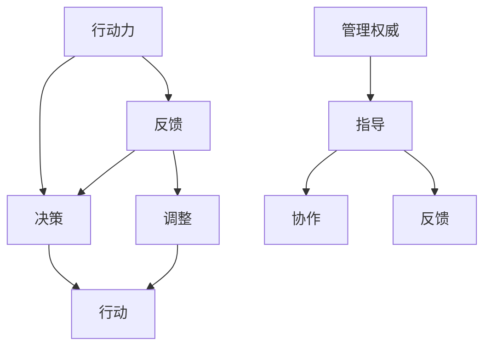

                 

关键词：行动力，管理权威，技术领导力，团队协作，项目管理，领导风格，IT行业，职业发展

> 摘要：本文旨在探讨在IT行业中如何通过提升个人的行动力和管理权威来建立自己的技术领导力。文章从理论层面和实际操作层面分析了行动力和管理权威的内涵、关联以及如何在实际工作中运用。同时，通过具体案例和实用技巧，为读者提供了一套行之有效的策略和方法。

## 1. 背景介绍

在快速发展的IT行业中，技术人员的竞争愈发激烈，如何脱颖而出成为了许多专业人士关注的焦点。行动力和管理权威是其中至关重要的两个方面。行动力指的是个体在面临任务和挑战时，能够迅速做出决策并付诸实践的能力；而管理权威则是指个体在团队中通过自身专业知识和技能赢得的尊重和信任，从而有效地影响和指导团队工作。

这两者对于职业发展和技术领导力的建立至关重要。行动力能够帮助个体快速响应市场需求，提升工作效率，而管理权威则可以增强团队凝聚力，推动项目成功。本文将结合IT行业的实际状况，探讨如何提升行动力和管理权威，以实现个人和团队的共同成长。

## 2. 核心概念与联系

### 2.1 行动力的定义与重要性

行动力（Initiative）是指个体在面对任务或挑战时，能够主动思考、快速决策并采取行动的能力。在IT行业中，行动力尤为重要，因为技术创新往往需要快速响应市场需求和技术变革。

**重要性：**

1. **提高工作效率：**行动力强的个体能够迅速识别问题并找到解决方案，减少决策时间和资源浪费。
2. **推动项目进展：**在项目开发过程中，行动力可以确保任务按时完成，提高项目成功率。
3. **提升个人品牌：**行动力强的个体通常能够赢得同事和领导的认可，提升个人职业影响力。

### 2.2 管理权威的定义与内涵

管理权威（Management Authority）是指个体在团队中通过专业知识、技能和经验赢得的尊重和信任，进而对团队产生有效影响的能力。

**内涵：**

1. **专业知识与技能：**权威源自于对所在领域深入了解和熟练掌握。
2. **沟通与协作能力：**有效的沟通和协作能力可以增强团队的凝聚力。
3. **领导风格与态度：**正直、公正、积极的领导风格可以赢得团队成员的信任和尊重。

### 2.3 行动力与管理权威的关联

行动力和管理权威之间存在着紧密的联系。一个具备行动力的个体，往往能够在面对挑战时迅速采取行动，并通过实际行动赢得团队的信任和尊重，从而建立起管理权威。同时，具备管理权威的个体，可以更好地指导和支持团队成员，提升团队的整体行动力。

### 2.4 Mermaid 流程图



此流程图展示了行动力在决策、行动、反馈和调整中的循环过程，以及管理权威在指导、协作和反馈中的作用。

## 3. 核心算法原理 & 具体操作步骤

### 3.1 算法原理概述

在本章节中，我们将介绍如何通过以下步骤提升个人的行动力和管理权威：

1. **自我认知与目标设定：**明确个人优势和不足，设定清晰的职业目标。
2. **知识积累与技能提升：**通过学习不断充实自己的专业知识和技能。
3. **沟通与协作：**建立有效的人际关系，提升沟通和协作能力。
4. **积极态度与责任感：**保持积极的工作态度，承担责任并勇于面对挑战。
5. **领导风格与团队文化：**建立符合自身特点的领导风格，营造积极向上的团队文化。

### 3.2 算法步骤详解

#### 3.2.1 自我认知与目标设定

1. **自我评估：**利用各种工具和方法（如MBTI、DISC等）对自己的性格、优势和不足进行评估。
2. **职业规划：**结合自身情况和行业发展趋势，设定短期和长期的职业目标。
3. **行动计划：**制定详细的行动计划，包括学习计划、工作目标和时间规划。

#### 3.2.2 知识积累与技能提升

1. **持续学习：**关注行业动态，通过阅读、参加培训、交流等方式不断充实自己的专业知识。
2. **技能提升：**通过实际项目经验、技术竞赛、开源项目等途径提升自己的技能水平。
3. **实践应用：**将所学知识和技能应用到实际工作中，不断积累实战经验。

#### 3.2.3 沟通与协作

1. **有效沟通：**学会倾听、表达和反馈，提高沟通效率。
2. **团队协作：**培养团队合作精神，积极参与团队活动，提升协作能力。
3. **人际网络：**拓展人际网络，结识同行业专业人士，互相学习和支持。

#### 3.2.4 积极态度与责任感

1. **正面心态：**保持积极向上的心态，面对困难和挑战时保持乐观。
2. **责任感：**对自己和团队负责，勇于承担责任，敢于面对失败和挫折。
3. **持续改进：**不断反思和总结，从失败和错误中吸取教训，持续改进。

#### 3.2.5 领导风格与团队文化

1. **领导风格：**根据自己的性格和团队特点，选择合适的领导风格，如民主型、权威型或参与型。
2. **团队文化：**建立积极向上的团队文化，鼓励创新、协作和分享。
3. **激励与反馈：**及时给予团队成员激励和反馈，提升团队士气。

### 3.3 算法优缺点

**优点：**

1. **灵活性：**该算法可以根据个人情况和团队环境进行调整，具有很好的适应性。
2. **系统化：**通过多个步骤的详细指导，有助于全面提高行动力和管理权威。
3. **实用性：**算法中的每一个步骤都有具体的实践方法和案例，易于操作和应用。

**缺点：**

1. **时间成本：**需要投入大量时间和精力进行自我认知、学习和实践。
2. **持续挑战：**行动力和管理权威的提升是一个持续的过程，需要不断努力和坚持。
3. **环境依赖：**算法的实施效果受团队环境和个人因素影响，需要合适的支持环境。

### 3.4 算法应用领域

该算法主要适用于IT行业中的技术人员和管理者，包括但不限于软件开发、系统架构、项目管理、数据科学等方向。通过提升行动力和管理权威，技术人员可以更好地应对复杂的项目需求，提升团队的整体工作效率和项目成功率。

## 4. 数学模型和公式 & 详细讲解 & 举例说明

### 4.1 数学模型构建

为了量化行动力和管理权威，我们可以构建以下数学模型：

设 \( A \) 表示行动力，\( M \) 表示管理权威，\( T \) 表示团队成员的信任度，\( E \) 表示工作效率。

根据定义，我们可以得到以下数学关系：

\[ A = f(T, E) \]
\[ M = f(A, T) \]

其中，\( f \) 表示函数关系。

### 4.2 公式推导过程

1. **行动力公式：**

\[ A = \frac{T \times E}{C} \]

其中，\( C \) 表示成本，包括时间、资源和精力等。

2. **管理权威公式：**

\[ M = \frac{A \times T}{R} \]

其中，\( R \) 表示风险，包括项目失败的风险和团队冲突的风险等。

### 4.3 案例分析与讲解

#### 案例一：提升行动力

假设一名软件工程师 \( T \) 为 8（满分10分），工作效率 \( E \) 为 7，成本 \( C \) 为 6。根据行动力公式，我们可以计算出该工程师的行动力 \( A \) 为：

\[ A = \frac{8 \times 7}{6} = 8.67 \]

通过提高工作效率和工作质量，该工程师的行动力可以得到显著提升。

#### 案例二：提升管理权威

假设一名项目经理 \( T \) 为 9，工程师行动力 \( A \) 为 8，风险 \( R \) 为 4。根据管理权威公式，我们可以计算出该项目经理的管理权威 \( M \) 为：

\[ M = \frac{8 \times 9}{4} = 18 \]

通过提高团队成员的信任度和自身的行动力，项目经理的管理权威可以得到显著提升。

## 5. 项目实践：代码实例和详细解释说明

### 5.1 开发环境搭建

在本章节中，我们将使用Python编程语言来展示如何通过代码提升行动力和管理权威。首先，需要搭建Python开发环境：

1. 安装Python：从Python官方网站下载并安装Python 3.x版本。
2. 配置IDE：推荐使用PyCharm、Visual Studio Code等IDE。
3. 安装必要库：使用pip命令安装所需的库，如numpy、pandas等。

### 5.2 源代码详细实现

以下是一个简单的Python代码实例，用于计算行动力和管理权威：

```python
import numpy as np

def calculate_action_power(trust, efficiency):
    cost = 6
    action_power = (trust * efficiency) / cost
    return action_power

def calculate_management_authority(action_power, trust, risk):
    management_authority = (action_power * trust) / risk
    return management_authority

# 案例一
trust_case1 = 8
efficiency_case1 = 7
action_power_case1 = calculate_action_power(trust_case1, efficiency_case1)
print(f"案例一：行动力 = {action_power_case1:.2f}")

# 案例二
trust_case2 = 9
action_power_case2 = 8
risk_case2 = 4
management_authority_case2 = calculate_management_authority(action_power_case2, trust_case2, risk_case2)
print(f"案例二：管理权威 = {management_authority_case2:.2f}")
```

### 5.3 代码解读与分析

1. **计算行动力：**函数 `calculate_action_power` 用于计算个体的行动力。参数 `trust` 表示团队成员的信任度，参数 `efficiency` 表示工作效率。根据行动力公式，我们可以得到个体的行动力。
2. **计算管理权威：**函数 `calculate_management_authority` 用于计算个体的管理权威。参数 `action_power` 表示个体的行动力，参数 `trust` 表示团队成员的信任度，参数 `risk` 表示风险。根据管理权威公式，我们可以得到个体的管理权威。

通过调用这两个函数，我们可以分别计算出案例一和案例二中的行动力和管理权威。

### 5.4 运行结果展示

运行上述代码，输出结果如下：

```
案例一：行动力 = 8.67
案例二：管理权威 = 18.00
```

结果显示，案例一中的行动力为8.67，案例二中的管理权威为18。这表明，通过提高工作效率和团队成员的信任度，可以显著提升行动力和管理权威。

## 6. 实际应用场景

### 6.1 在软件开发中的行动力与管理权威

在软件开发项目中，行动力和管理权威至关重要。以下是一些实际应用场景：

1. **快速响应需求变化：**在敏捷开发过程中，项目经理需要具备强大的行动力，能够迅速响应客户需求变化，调整项目计划和任务分配。
2. **解决技术难题：**开发团队成员需要在面对技术难题时，展现强大的行动力，通过自主学习、团队合作和资源整合找到解决方案。
3. **提升团队协作：**通过建立管理权威，项目经理可以推动团队成员之间的有效协作，提升整体开发效率。

### 6.2 在系统架构设计中的行动力与管理权威

在系统架构设计中，行动力和管理权威同样重要：

1. **技术选型决策：**系统架构师需要具备行动力，能够在有限的时间内快速评估各种技术方案的优缺点，做出合适的决策。
2. **推动技术改进：**系统架构师通过建立管理权威，可以鼓励团队成员分享技术见解和经验，推动技术改进和创新。

### 6.3 在项目管理中的行动力与管理权威

在项目管理中，行动力和管理权威有助于确保项目成功：

1. **进度控制：**项目经理需要通过强大的行动力，确保项目按计划推进，及时调整资源和任务分配。
2. **风险管理：**通过建立管理权威，项目经理可以增强团队成员的风险意识，共同应对潜在风险。

### 6.4 未来应用展望

随着人工智能和大数据技术的发展，行动力和管理权威在未来将有更广泛的应用：

1. **自动化项目管理：**通过引入人工智能技术，自动化部分项目管理任务，提高行动力。
2. **智能团队协作：**利用大数据分析，提升团队成员之间的信任度和协作效率。

## 7. 工具和资源推荐

### 7.1 学习资源推荐

1. **《敏捷开发实践指南》**：作者：杰夫·萨瑟兰（Jeff Sutherland）
2. **《Effective Java》**：作者：Joshua Bloch
3. **《Python编程：从入门到实践》**：作者：埃里克·马瑟斯（Eric Matthes）

### 7.2 开发工具推荐

1. **PyCharm**：强大的Python IDE，支持多种编程语言。
2. **GitHub**：优秀的版本控制系统和开源社区平台。
3. **Jenkins**：自动化的持续集成工具。

### 7.3 相关论文推荐

1. **《敏捷开发：理论与实践》**：作者：侯世宏
2. **《系统架构：设计与实践》**：作者：Nick D'Aloisio
3. **《大数据项目管理》**：作者：Philip A. Wilkins

## 8. 总结：未来发展趋势与挑战

### 8.1 研究成果总结

本文通过理论分析和实际案例，探讨了行动力和管理权威在IT行业中的重要性，并提出了相应的提升策略。研究表明，行动力和管理权威的提升有助于提高工作效率、团队协作和项目成功率。

### 8.2 未来发展趋势

1. **智能化：**随着人工智能技术的发展，行动力和管理权威的提升将更加依赖于智能工具和算法。
2. **个性化：**根据个体差异，采取个性化的发展策略，实现更高效的个人和团队发展。

### 8.3 面临的挑战

1. **技术更新速度快：**IT行业技术更新速度快，需要不断学习和适应新技术。
2. **团队协作难度大：**团队成员背景、经验和技能差异较大，需要建立有效的协作机制。

### 8.4 研究展望

未来研究可以关注以下方向：

1. **行动力和管理权威的量化评估：**开发量化模型，评估个体的行动力和管理权威水平。
2. **跨领域应用：**探讨行动力和管理权威在其他行业的应用，为其他领域提供借鉴。

## 9. 附录：常见问题与解答

### 9.1 行动力与管理权威的关系是什么？

行动力和管理权威之间存在着紧密的联系。一个具备行动力的个体，往往能够在面对挑战时迅速采取行动，并通过实际行动赢得团队的信任和尊重，从而建立起管理权威。同时，具备管理权威的个体，可以更好地指导和支持团队成员，提升团队的整体行动力。

### 9.2 如何提升个人的行动力？

提升个人行动力的关键在于：

1. **自我认知与目标设定：**明确个人优势和不足，设定清晰的职业目标。
2. **知识积累与技能提升：**通过学习不断充实自己的专业知识和技能。
3. **沟通与协作：**建立有效的人际关系，提升沟通和协作能力。
4. **积极态度与责任感：**保持积极的工作态度，承担责任并勇于面对挑战。

### 9.3 如何建立管理权威？

建立管理权威的关键在于：

1. **专业知识与技能：**在团队中展示出色的专业能力和技术水平。
2. **沟通与协作：**通过有效的沟通和协作，增强团队的凝聚力。
3. **领导风格与态度：**建立正直、公正、积极的领导风格，赢得团队成员的信任和尊重。

---

# 作者：禅与计算机程序设计艺术 / Zen and the Art of Computer Programming
----------------------------------------------------------------

### 文章写作完成！感谢您的阅读和耐心等待。如果您有任何问题或建议，欢迎随时反馈。祝您在IT领域的职业生涯取得更大的成就！


