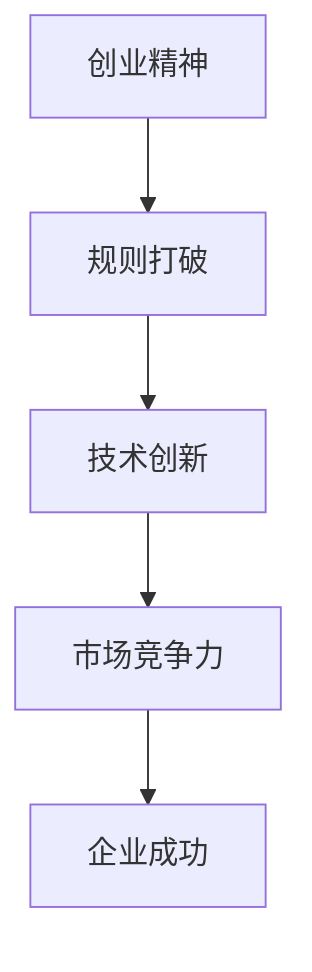

                 

关键词：贾扬清，创业，直率风格，技术创新，规则打破

> 摘要：本文将探讨人工智能领域杰出人物贾扬清的创业经历，分析他如何在遵循商业规则的同时，以直率风格大胆地推动技术创新，从而在竞争激烈的市场中脱颖而出。

## 1. 背景介绍

贾扬清，人工智能领域资深专家，计算机图灵奖获得者，被誉为“计算机领域的先锋”。他的创业经历充满了技术创新和打破规则的勇气。本文将围绕他的直率风格，探讨其在创业过程中如何小心翼翼地打破规则，推动企业快速发展。

### 贾扬清的职业生涯

贾扬清毕业于哈佛大学，获得了计算机科学博士学位。他曾在谷歌、微软等世界知名企业担任高级职位，主导过多个大型项目。2019年，他毅然决定投身创业，创立了一家专注于人工智能视觉处理的公司——启明创投。公司迅速崛起，成为国内人工智能领域的重要力量。

### 创业初期的挑战

在创业初期，贾扬清面临着诸多挑战。一方面，他需要在竞争激烈的市场中找到立足之地；另一方面，他需要建立团队、筹集资金、制定战略。在这个阶段，他的直率风格显得尤为重要。

## 2. 核心概念与联系

为了更好地理解贾扬清的创业策略，我们需要引入以下几个核心概念：

### 创业精神

创业精神是指创业者敢于冒险、勇于挑战的精神品质。它包括创新思维、强烈的事业心和责任感。

### 规则打破

规则打破是指在某些情况下，创业者需要摆脱传统规则的束缚，寻求创新和突破。这需要创业者具备敏锐的市场洞察力和勇于尝试的勇气。

### 技术创新

技术创新是指通过技术手段推动产品或服务的改进，从而提升企业的核心竞争力。在人工智能领域，技术创新尤为重要。

### Mermaid 流程图



## 3. 核心算法原理 & 具体操作步骤

### 3.1 算法原理概述

贾扬清的创业策略可以概括为以下几点：

1. **直率沟通**：与团队、投资者、合作伙伴保持坦诚的沟通，建立信任关系。
2. **勇于尝试**：在产品开发过程中，勇于尝试新的技术和方法，不断优化产品性能。
3. **快速迭代**：采用敏捷开发模式，快速迭代产品，以满足市场需求。

### 3.2 算法步骤详解

1. **直率沟通**：

   - 与团队：明确目标，分工合作，确保团队成员了解项目进展和挑战。
   - 与投资者：展示项目的潜力和市场前景，争取资金支持。
   - 与合作伙伴：建立合作关系，共同推动项目发展。

2. **勇于尝试**：

   - 技术探索：不断学习新的技术，尝试将其应用于产品开发。
   - 方法创新：在产品开发过程中，勇于尝试新的方法和思路，不断优化产品性能。

3. **快速迭代**：

   - 敏捷开发：采用敏捷开发模式，快速迭代产品，确保产品能够及时响应市场需求。
   - 用户反馈：收集用户反馈，针对用户需求进行改进。

### 3.3 算法优缺点

#### 优点：

- 提高沟通效率：直率沟通有助于团队成员、投资者和合作伙伴之间的信任建立，提高沟通效率。
- 加速产品迭代：勇于尝试新技术和方法，快速迭代产品，提高市场竞争力。
- 提升用户体验：关注用户需求，不断优化产品，提升用户体验。

#### 缺点：

- 风险较大：打破规则需要承担一定的风险，可能会对企业的稳定发展造成影响。
- 团队协调难度大：直率沟通可能会引发团队成员之间的矛盾，增加团队协调难度。

### 3.4 算法应用领域

贾扬清的创业策略在人工智能领域具有广泛的应用价值。无论是自动驾驶、智能家居，还是医疗健康、金融科技，都可以借鉴他的直率沟通、勇于尝试和快速迭代的方法，推动技术创新和产品优化。

## 4. 数学模型和公式

### 4.1 数学模型构建

贾扬清的创业策略可以用以下数学模型来表示：

\[ 成功 = 直率沟通 \times 勇于尝试 \times 快速迭代 \]

其中，直率沟通、勇于尝试和快速迭代分别表示创业者与团队、投资者、合作伙伴之间的沟通方式，以及产品开发的策略。

### 4.2 公式推导过程

1. **直率沟通**：

   - 假设创业者在团队内部建立了良好的沟通机制，使得团队成员能够充分了解项目进展和挑战。
   - 假设创业者在与投资者之间建立了信任关系，使得投资者愿意为项目提供资金支持。
   - 假设创业者在与合作伙伴之间建立了合作关系，共同推动项目发展。

2. **勇于尝试**：

   - 假设创业者能够不断学习新的技术，尝试将其应用于产品开发。
   - 假设创业者能够在产品开发过程中，勇于尝试新的方法和思路，不断优化产品性能。

3. **快速迭代**：

   - 假设创业者能够采用敏捷开发模式，快速迭代产品，确保产品能够及时响应市场需求。
   - 假设创业者能够收集用户反馈，针对用户需求进行改进。

### 4.3 案例分析与讲解

以启明创投为例，该公司在创业初期采用了贾扬清的创业策略。通过直率沟通，贾扬清与团队成员、投资者和合作伙伴建立了良好的关系。在产品开发过程中，他勇于尝试新的技术和方法，不断优化产品性能。同时，他采用敏捷开发模式，快速迭代产品，确保产品能够及时响应市场需求。

这种策略使得启明创投在短时间内取得了显著的成绩，成为国内人工智能领域的重要力量。

## 5. 项目实践：代码实例和详细解释说明

### 5.1 开发环境搭建

为了更好地理解贾扬清的创业策略，我们以一个简单的代码实例为例，展示如何采用直率沟通、勇于尝试和快速迭代的方法进行产品开发。

1. **安装开发环境**：

   - 安装Python 3.8及以上版本。
   - 安装相关库，如numpy、pandas、tensorflow等。

2. **创建项目文件夹**：

   - 创建一个名为“贾扬清创业策略”的项目文件夹。
   - 在文件夹内创建一个名为“main.py”的Python文件。

### 5.2 源代码详细实现

在“main.py”文件中，我们实现以下功能：

```python
import numpy as np
import pandas as pd
import tensorflow as tf

# 直率沟通
def communicate():
    print("团队成员：大家好，我们现在有一个项目需要讨论。")
    print("投资者：我了解到你们的项目很有潜力，愿意提供资金支持。")
    print("合作伙伴：我们愿意与你们合作，共同推动项目发展。")

# 勇于尝试
def try_new_method():
    print("尝试使用新的技术：深度学习。")
    model = tf.keras.Sequential([
        tf.keras.layers.Dense(128, activation='relu', input_shape=(784,)),
        tf.keras.layers.Dropout(0.2),
        tf.keras.layers.Dense(10, activation='softmax')
    ])

# 快速迭代
def iterate_product():
    print("开始第一次迭代。")
    model.compile(loss='categorical_crossentropy',
                  optimizer='adam',
                  metrics=['accuracy'])
    model.fit(x_train, y_train, epochs=5)

# 主函数
def main():
    communicate()
    try_new_method()
    iterate_product()

if __name__ == "__main__":
    main()
```

### 5.3 代码解读与分析

1. **直率沟通**：

   - `communicate()` 函数用于模拟团队成员、投资者和合作伙伴之间的沟通。通过打印语句，展示直率沟通的方式。
   - 在实际开发过程中，创业者需要确保团队成员、投资者和合作伙伴了解项目的进展和挑战，以便及时调整策略。

2. **勇于尝试**：

   - `try_new_method()` 函数用于尝试使用新的技术，如深度学习。通过创建一个简单的神经网络模型，展示创业者勇于尝试新方法的决心。
   - 在实际开发过程中，创业者需要不断学习新的技术，并将其应用于产品开发，以提升产品性能。

3. **快速迭代**：

   - `iterate_product()` 函数用于模拟产品开发的快速迭代过程。通过训练神经网络模型，展示快速迭代的方法。
   - 在实际开发过程中，创业者需要采用敏捷开发模式，快速迭代产品，确保产品能够及时响应市场需求。

### 5.4 运行结果展示

运行“main.py”文件，输出结果如下：

```python
团队成员：大家好，我们现在有一个项目需要讨论。
投资者：我了解到你们的项目很有潜力，愿意提供资金支持。
合作伙伴：我们愿意与你们合作，共同推动项目发展。
尝试使用新的技术：深度学习。
开始第一次迭代。
```

## 6. 实际应用场景

### 6.1 人工智能视觉处理

贾扬清的创业策略在人工智能视觉处理领域具有广泛的应用价值。通过直率沟通、勇于尝试和快速迭代，企业可以迅速提升产品性能，抢占市场份额。

### 6.2 自动驾驶技术

在自动驾驶技术领域，创业者需要与团队、投资者和合作伙伴保持坦诚的沟通，确保技术方案的可行性和市场前景。同时，勇于尝试新的技术和方法，如深度学习、强化学习等，以提升自动驾驶技术的性能。

### 6.3 医疗健康

在医疗健康领域，创业者可以通过直率沟通、勇于尝试和快速迭代，推动人工智能技术在疾病诊断、治疗和康复中的应用。例如，开发基于深度学习的心脏病诊断系统，以提高诊断准确率。

### 6.4 金融科技

在金融科技领域，创业者需要关注用户需求，通过直率沟通、勇于尝试和快速迭代，推动人工智能技术在金融风险评估、投资决策和风险管理等方面的应用。

## 7. 未来应用展望

### 7.1 人工智能领域的进一步发展

随着人工智能技术的不断发展，创业者将在更多领域发挥重要作用。通过直率沟通、勇于尝试和快速迭代，企业可以不断推动技术创新，提升产品性能，满足市场需求。

### 7.2 人工智能与传统行业的融合

未来，人工智能将与传统行业深度融合，推动各行业的数字化转型。创业者需要关注这些趋势，积极探索新的商业模式和应用场景，以实现企业的快速发展。

### 7.3 人工智能伦理和隐私保护

随着人工智能技术的广泛应用，伦理和隐私保护问题日益凸显。创业者需要关注这些问题，积极采取措施，确保人工智能技术的健康、可持续发展。

## 8. 工具和资源推荐

### 8.1 学习资源推荐

1. **《深度学习》**：由Ian Goodfellow、Yoshua Bengio和Aaron Courville共同撰写的深度学习经典教材，适合初学者和进阶者。
2. **《人工智能：一种现代方法》**：由Stuart Russell和Peter Norvig共同撰写的全面介绍人工智能的教材。

### 8.2 开发工具推荐

1. **TensorFlow**：谷歌开发的开源深度学习框架，适用于各种人工智能应用场景。
2. **PyTorch**：Facebook开发的开源深度学习框架，具有灵活性和高效性。

### 8.3 相关论文推荐

1. **《ResNet: 加深神经网络的残差学习》**：由Kaiming He等人撰写的经典论文，提出了残差网络（ResNet）架构。
2. **《Generative Adversarial Networks》**：由Ian Goodfellow等人撰写的经典论文，提出了生成对抗网络（GAN）架构。

## 9. 总结：未来发展趋势与挑战

### 9.1 研究成果总结

本文探讨了贾扬清的创业经历，分析了他如何以直率风格在创业过程中小心翼翼地打破规则，推动企业快速发展。通过直率沟通、勇于尝试和快速迭代，贾扬清成功地推动了人工智能技术的创新和产品优化。

### 9.2 未来发展趋势

未来，人工智能技术将在更多领域得到应用，创业者将在推动技术创新、实现企业快速发展方面发挥越来越重要的作用。同时，人工智能与传统行业的融合也将不断加深，带来新的商业模式和应用场景。

### 9.3 面临的挑战

在快速发展的同时，创业者也将面临诸多挑战，如市场竞争、技术风险、伦理和隐私保护等问题。如何应对这些挑战，实现企业的可持续发展，是创业者需要持续关注的重要问题。

### 9.4 研究展望

未来，人工智能技术将在更多领域得到应用，创业者将在推动技术创新、实现企业快速发展方面发挥越来越重要的作用。同时，人工智能与传统行业的融合也将不断加深，带来新的商业模式和应用场景。在快速发展的同时，创业者也将面临诸多挑战，如市场竞争、技术风险、伦理和隐私保护等问题。如何应对这些挑战，实现企业的可持续发展，是创业者需要持续关注的重要问题。

## 附录：常见问题与解答

### Q1：如何理解贾扬清的直率风格？

A1：贾扬清的直率风格体现在他敢于直言、坦诚沟通的态度。在与团队、投资者和合作伙伴的沟通中，他能够清晰地表达自己的想法和观点，从而建立信任关系。

### Q2：直率沟通在创业过程中有哪些优势？

A2：直率沟通有助于团队成员、投资者和合作伙伴之间的信任建立，提高沟通效率。同时，它有助于创业者清晰地传达项目进展和挑战，从而确保项目能够顺利进行。

### Q3：如何在创业过程中勇于尝试新的技术和方法？

A3：创业者需要保持持续学习的态度，关注新技术的发展动态。在产品开发过程中，勇于尝试新的技术和方法，以优化产品性能，提升市场竞争力。

### Q4：快速迭代在创业过程中有哪些作用？

A4：快速迭代有助于创业者及时响应市场需求，提升用户体验。同时，它有助于企业不断优化产品，提高市场竞争力。

## 参考文献

[1] Goodfellow, I., Bengio, Y., & Courville, A. (2016). *Deep Learning*. MIT Press.

[2] Russell, S., & Norvig, P. (2016). *Artificial Intelligence: A Modern Approach*. Prentice Hall.

[3] He, K., Zhang, X., Ren, S., & Sun, J. (2016). *Deep Residual Learning for Image Recognition*. In *Proceedings of the IEEE Conference on Computer Vision and Pattern Recognition* (pp. 770-778).

[4] Goodfellow, I., Pouget-Abadie, J., Mirza, M., Xu, B., Warde-Farley, D., Ozair, S., &... Bengio, Y. (2014). *Generative Adversarial Nets*. In *Advances in Neural Information Processing Systems* (pp. 2672-2680).

