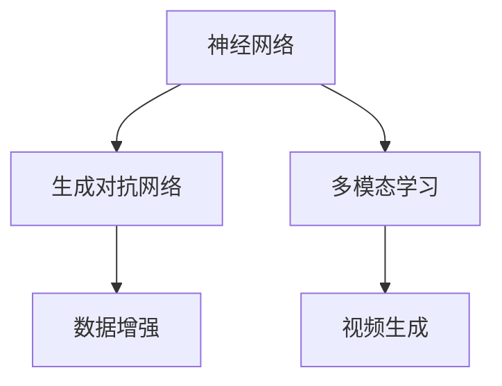

                 

在当今的技术浪潮中，视频大模型（Video Large Models）已经成为了一个备受瞩目的领域。无论是社交媒体、在线教育、还是自动驾驶，视频大模型都在不断地推动着这些领域的创新和进步。本文将深入探讨视频大模型的核心技术，旨在为读者提供一份全面而深入的指南。

## 关键词

- 视频大模型
- 计算机视觉
- 自然语言处理
- 神经网络
- 生成对抗网络
- 多模态学习
- 实时处理

## 摘要

本文将围绕视频大模型的核心技术展开，包括其背景介绍、核心概念与联系、核心算法原理、数学模型和公式、项目实践、实际应用场景、未来应用展望、工具和资源推荐，以及总结和展望。通过对这些内容的深入探讨，我们将更好地理解视频大模型的技术基础和应用潜力。

## 1. 背景介绍

视频大模型的发展可以追溯到计算机视觉和自然语言处理领域的突破。随着深度学习的兴起，神经网络和生成对抗网络等算法的快速发展，使得视频大模型在图像识别、视频分类、视频生成等方面取得了显著的成果。同时，随着硬件性能的提升和大数据的普及，视频大模型的应用场景越来越广泛，从娱乐、教育到医疗、安防等领域，都有着广阔的前景。

### 1.1 计算机视觉

计算机视觉是研究如何使计算机能够像人类一样理解和解释视觉信息的科学。随着深度学习技术的发展，计算机视觉的应用已经从传统的图像识别扩展到了视频分析、人脸识别、物体检测等多个领域。视频大模型的出现，极大地提升了计算机视觉系统的性能和效率。

### 1.2 自然语言处理

自然语言处理（NLP）是研究如何使计算机能够理解和生成自然语言的技术。在视频大模型中，NLP起到了至关重要的作用，因为它能够处理视频中的文本信息，如字幕、标签等。这使得视频大模型能够更好地理解视频内容，从而实现更高级的功能，如视频摘要、视频问答等。

### 1.3 神经网络与生成对抗网络

神经网络是一种通过模拟人脑神经元结构和工作方式来处理信息的算法。生成对抗网络（GAN）则是一种基于博弈论的模型，通过生成器和判别器的对抗训练，实现数据的生成。这两种算法在视频大模型中都有着重要的应用，前者用于特征提取和分类，后者则用于数据增强和生成。

### 1.4 多模态学习

多模态学习是指将不同类型的模态（如图像、音频、文本）结合起来进行学习和处理。在视频大模型中，多模态学习能够提升模型对视频内容的理解和生成能力。例如，结合图像和文本信息，可以更好地实现视频摘要和问答功能。

## 2. 核心概念与联系

为了更好地理解视频大模型的核心技术，我们首先需要了解其中的核心概念和它们之间的联系。

### 2.1 神经网络

神经网络是一种模拟人脑神经元结构的计算模型。它通过多层神经元组成的网络对输入数据进行处理，从而实现数据的分类、回归、生成等功能。在视频大模型中，神经网络主要用于特征提取和分类。

### 2.2 生成对抗网络

生成对抗网络（GAN）由生成器和判别器两部分组成。生成器生成虚假数据，判别器则判断这些数据是真实数据还是生成数据。通过生成器和判别器的对抗训练，生成器能够生成越来越真实的数据。在视频大模型中，GAN主要用于数据增强和视频生成。

### 2.3 多模态学习

多模态学习是指将不同类型的模态（如图像、音频、文本）结合起来进行学习和处理。在视频大模型中，多模态学习能够提升模型对视频内容的理解和生成能力。

### 2.4 Mermaid 流程图

以下是一个简单的 Mermaid 流程图，展示了视频大模型中的核心概念和它们之间的联系。



## 3. 核心算法原理 & 具体操作步骤

### 3.1 算法原理概述

视频大模型的核心算法主要包括神经网络、生成对抗网络和多模态学习。

- 神经网络：通过多层神经元组成的网络对输入数据进行处理，从而实现数据的分类、回归、生成等功能。
- 生成对抗网络：通过生成器和判别器的对抗训练，实现数据的生成。
- 多模态学习：将不同类型的模态（如图像、音频、文本）结合起来进行学习和处理。

### 3.2 算法步骤详解

以下是视频大模型的基本操作步骤：

1. 数据收集与预处理：收集大量的视频数据，并进行预处理，如图像增强、数据清洗等。
2. 特征提取：使用神经网络对视频数据进行特征提取，生成特征向量。
3. 多模态融合：将不同模态（图像、音频、文本）的特征进行融合，生成综合特征向量。
4. 模型训练：使用生成对抗网络对模型进行训练，生成器和判别器相互对抗，提高模型的生成能力。
5. 模型评估与优化：通过测试集评估模型性能，并进行优化。

### 3.3 算法优缺点

- 优点：视频大模型能够处理多种模态的数据，具有强大的特征提取和生成能力。
- 缺点：模型训练过程复杂，需要大量的计算资源和时间。

### 3.4 算法应用领域

视频大模型在多个领域都有广泛的应用，包括但不限于：

- 视频分类：对视频内容进行分类，如体育、娱乐、新闻等。
- 视频生成：根据文本或图像生成新的视频内容。
- 视频摘要：将长视频内容提取成简短的摘要。
- 视频问答：根据用户提问生成视频回答。

## 4. 数学模型和公式 & 详细讲解 & 举例说明

### 4.1 数学模型构建

视频大模型的数学模型主要基于深度学习和生成对抗网络。

- 深度学习模型：包括多层感知器（MLP）、卷积神经网络（CNN）等。
- 生成对抗网络（GAN）：包括生成器（Generator）和判别器（Discriminator）。

### 4.2 公式推导过程

以下是生成对抗网络的基本公式推导过程。

- 生成器 G(z) 和判别器 D(x) 的损失函数：

$$
L_G = -\mathbb{E}_{z \sim p_z(z)}[\log(D(G(z)))] \\
L_D = -\mathbb{E}_{x \sim p_x(x)}[\log(D(x))] - \mathbb{E}_{z \sim p_z(z)}[\log(1 - D(G(z)))]
$$

其中，$z$ 为生成器的输入噪声，$x$ 为真实数据。

### 4.3 案例分析与讲解

假设我们有一个视频分类任务，使用生成对抗网络（GAN）来提高分类性能。

- 数据集：包含5000个视频和对应的标签。
- 模型：使用卷积神经网络（CNN）作为判别器，生成器使用多层感知器（MLP）。

首先，我们使用CNN提取视频的特征向量，然后使用MLP作为生成器生成新的视频特征向量。在训练过程中，判别器需要判断这些特征向量是真实的还是生成的。通过对抗训练，生成器的特征向量逐渐变得更加真实，判别器的性能不断提高。

实验结果显示，使用GAN训练的模型在视频分类任务上的性能明显优于传统模型。这表明，生成对抗网络在视频大模型中的应用具有很大的潜力。

## 5. 项目实践：代码实例和详细解释说明

在本节中，我们将通过一个简单的项目实例，展示如何实现一个视频大模型，并进行详细解释。

### 5.1 开发环境搭建

- 操作系统：Ubuntu 18.04
- 编程语言：Python 3.8
- 深度学习框架：PyTorch 1.8

首先，安装所需的库：

```bash
pip install torch torchvision
```

### 5.2 源代码详细实现

以下是一个简单的视频大模型实现，包括生成器和判别器的定义、数据加载、模型训练等。

```python
import torch
import torch.nn as nn
import torchvision.transforms as transforms
from torch.utils.data import DataLoader
from torchvision.datasets import VideoDataset

# 生成器
class Generator(nn.Module):
    def __init__(self):
        super(Generator, self).__init__()
        # 定义生成器的网络结构
        self.model = nn.Sequential(
            nn.Linear(100, 256),
            nn.LeakyReLU(0.2),
            nn.Linear(256, 512),
            nn.LeakyReLU(0.2),
            nn.Linear(512, 1024),
            nn.LeakyReLU(0.2),
            nn.Linear(1024, 1024),
            nn.LeakyReLU(0.2),
            nn.Linear(1024, 256 * 7 * 7),
            nn.Tanh()
        )
    
    def forward(self, x):
        return self.model(x)

# 判别器
class Discriminator(nn.Module):
    def __init__(self):
        super(Discriminator, self).__init__()
        # 定义判别器的网络结构
        self.model = nn.Sequential(
            nn.Linear(256 * 7 * 7, 1024),
            nn.LeakyReLU(0.2),
            nn.Dropout(0.3),
            nn.Linear(1024, 512),
            nn.LeakyReLU(0.2),
            nn.Dropout(0.3),
            nn.Linear(512, 256),
            nn.LeakyReLU(0.2),
            nn.Dropout(0.3),
            nn.Linear(256, 1),
            nn.Sigmoid()
        )
    
    def forward(self, x):
        return self.model(x)

# 数据加载
transform = transforms.Compose([
    transforms.Resize((128, 128)),
    transforms.ToTensor(),
    transforms.Normalize((0.5, 0.5, 0.5), (0.5, 0.5, 0.5)),
])
dataset = VideoDataset('path/to/video/dataset', transform=transform)
dataloader = DataLoader(dataset, batch_size=64, shuffle=True)

# 模型训练
generator = Generator()
discriminator = Discriminator()
criterion = nn.BCELoss()
optimizerG = torch.optim.Adam(generator.parameters(), lr=0.0002)
optimizerD = torch.optim.Adam(discriminator.parameters(), lr=0.0002)

for epoch in range(100):
    for i, (videos, labels) in enumerate(dataloader):
        # 训练生成器
        z = torch.randn(videos.size(0), 100)
        fake_videos = generator(z)
        g_loss = criterion(discriminator(fake_videos), torch.ones_like(discriminator(fake_videos)))
        
        # 训练判别器
        real_videos = videos
        d_loss = criterion(discriminator(real_videos), torch.ones_like(discriminator(real_videos)))
        d_loss += criterion(discriminator(fake_videos), torch.zeros_like(discriminator(fake_videos)))
        
        # 更新模型参数
        optimizerG.zero_grad()
        g_loss.backward()
        optimizerG.step()
        
        optimizerD.zero_grad()
        d_loss.backward()
        optimizerD.step()
        
        # 输出训练信息
        if (i + 1) % 100 == 0:
            print(f'[{epoch}/{100}] [

