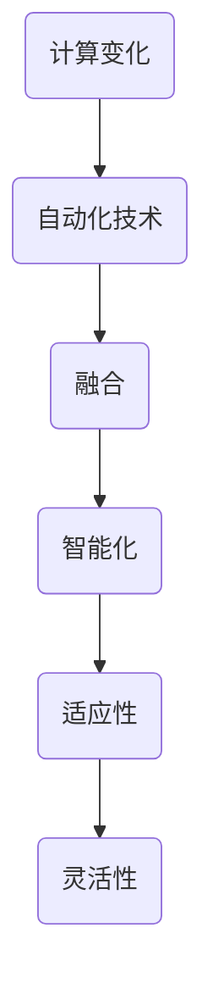

                 

关键词：计算变化、自动化技术、融合、算法原理、数学模型、项目实践、应用场景、未来展望。

摘要：本文深入探讨了计算变化与自动化技术的融合，从背景介绍、核心概念与联系、核心算法原理、数学模型和公式、项目实践、实际应用场景以及未来展望等多个维度展开论述，旨在为读者提供一个全面且深入的视角，理解这一领域的最新进展及其潜在应用。

## 1. 背景介绍

随着信息技术的飞速发展，计算能力和数据量的不断增长，计算变化与自动化技术的融合已成为当前技术领域的重要趋势。这一融合不仅推动了人工智能、大数据分析、云计算等前沿技术的快速发展，同时也为各行各业的数字化转型提供了强有力的支持。

自动化技术，特别是机器人技术、自动化生产线和智能控制系统，正在迅速改变传统制造业和服务业的运作模式。通过将计算变化引入这些系统，可以实现更高效率、更低成本和更精确的控制。

计算变化，即计算过程中发生的动态变化，是自动化技术实现智能化的基础。这一变化不仅体现在算法和程序的执行过程中，还体现在数据处理、优化和决策等方面。计算变化与自动化技术的融合，使得系统能够更加灵活地适应复杂多变的环境，实现真正的智能化。

## 2. 核心概念与联系

为了深入理解计算变化与自动化技术的融合，首先需要了解一些核心概念和它们之间的联系。

### 2.1 计算变化

计算变化是指计算过程中数据、状态或控制流发生的动态变化。这些变化可以是输入数据的更新、系统状态的转变，或者是算法执行路径的调整。计算变化是实现自动化系统智能化的关键。

### 2.2 自动化技术

自动化技术是指通过计算机程序、传感器、执行器等自动化设备，实现生产、管理和服务等过程的自动化。自动化技术包括机器人技术、自动化生产线、智能控制系统等。

### 2.3 融合

计算变化与自动化技术的融合，是将计算变化应用于自动化系统中，使系统能够根据实时数据和环境变化，自主调整行为和决策。这一融合不仅提升了系统的智能化水平，还提高了系统的适应性和灵活性。

### 2.4 Mermaid 流程图

为了更好地理解计算变化与自动化技术的融合，我们可以通过一个Mermaid流程图来展示其核心概念和联系。



## 3. 核心算法原理 & 具体操作步骤

### 3.1 算法原理概述

计算变化与自动化技术的融合，核心在于算法的设计和应用。以下是一个基于计算变化的自动化算法原理概述。

1. 数据采集：通过传感器等设备，实时采集系统运行数据。
2. 数据处理：对采集到的数据进行预处理，包括数据清洗、归一化等。
3. 状态监测：根据处理后的数据，监测系统当前的状态。
4. 决策制定：根据当前状态和历史数据，制定相应的决策。
5. 行为调整：根据决策，调整系统的行为或控制参数。

### 3.2 算法步骤详解

1. 数据采集

   数据采集是计算变化与自动化技术融合的基础。通过传感器等设备，可以实时获取系统运行状态、环境变化等信息。数据采集的质量直接影响后续数据处理和状态监测的准确性。

2. 数据处理

   数据处理包括数据清洗、归一化、特征提取等步骤。数据清洗是为了去除噪声和异常值，保证数据质量。归一化是为了将不同量纲的数据转换到同一尺度，便于后续计算。特征提取则是为了提取数据中的关键特征，为状态监测和决策制定提供支持。

3. 状态监测

   状态监测是根据处理后的数据，监测系统当前的状态。状态监测的目的是了解系统的运行状态，为决策制定提供依据。

4. 决策制定

   决策制定是根据当前状态和历史数据，制定相应的决策。决策制定需要考虑多种因素，如系统性能、成本、安全性等。

5. 行为调整

   行为调整是根据决策，调整系统的行为或控制参数。行为调整的目的是使系统能够根据实时数据和环境变化，自主调整行为，实现智能化。

### 3.3 算法优缺点

1. 优点

   - 提高系统智能化水平
   - 提高系统适应性和灵活性
   - 降低人工干预，减少人为错误

2. 缺点

   - 数据采集和处理复杂度高
   - 决策制定需要大量历史数据支持
   - 实时性要求高，对计算能力有较高要求

### 3.4 算法应用领域

计算变化与自动化技术的融合，可以在多个领域得到广泛应用，如：

- 智能制造：通过计算变化实现生产过程的智能化，提高生产效率和质量。
- 智能交通：通过计算变化实现交通管理的智能化，提高交通效率和安全性。
- 智能家居：通过计算变化实现家居设备的智能化，提高生活便利性和舒适度。

## 4. 数学模型和公式 & 详细讲解 & 举例说明

### 4.1 数学模型构建

计算变化与自动化技术的融合，需要建立相应的数学模型来描述系统的运行规律和行为。以下是一个简单的数学模型构建过程。

1. 状态变量定义

   定义系统运行过程中需要监测的变量，如温度、速度、压力等。

2. 状态方程

   根据系统运行规律，建立状态变量之间的数学关系，形成状态方程。

3. 决策变量定义

   定义根据状态方程制定决策所需的变量，如控制参数、阈值等。

4. 决策方程

   根据状态方程和决策变量，建立决策方程，形成决策制定模型。

### 4.2 公式推导过程

以下是一个基于线性系统的决策制定公式推导过程。

假设系统状态由 $x_1, x_2, ..., x_n$ 表示，决策变量为 $u_1, u_2, ..., u_m$。系统状态方程可以表示为：

$$
x_1 = a_{11}x_2 + a_{12}x_3 + ... + a_{1n}x_n
$$

$$
x_2 = a_{21}x_1 + a_{22}x_3 + ... + a_{2n}x_n
$$

$$
...
$$

$$
x_n = a_{n1}x_1 + a_{n2}x_2 + ... + a_{nn}x_n
$$

为了简化问题，假设系统为线性系统，即状态方程可以表示为矩阵形式：

$$
\mathbf{x} = \mathbf{A}\mathbf{x}
$$

其中，$\mathbf{x}$ 表示状态向量，$\mathbf{A}$ 表示状态转移矩阵。

决策方程可以表示为：

$$
\mathbf{u} = \mathbf{K}\mathbf{x}
$$

其中，$\mathbf{u}$ 表示决策向量，$\mathbf{K}$ 表示决策矩阵。

### 4.3 案例分析与讲解

以下是一个计算变化与自动化技术融合的案例：智能交通系统。

假设智能交通系统的状态变量为流量（$x_1$）、速度（$x_2$）和拥堵程度（$x_3$），决策变量为信号灯周期（$u_1$）和绿灯时长（$u_2$）。

状态方程可以表示为：

$$
x_1 = a_{11}x_2 + a_{12}x_3
$$

$$
x_2 = a_{21}x_1 + a_{22}x_3
$$

$$
x_3 = a_{31}x_1 + a_{32}x_2
$$

决策方程可以表示为：

$$
u_1 = k_1x_1 + k_2x_2 + k_3x_3
$$

$$
u_2 = l_1x_1 + l_2x_2 + l_3x_3
$$

通过实时监测交通流量、速度和拥堵程度，并根据历史数据制定决策，智能交通系统可以自动调整信号灯周期和绿灯时长，以实现交通流的优化。

## 5. 项目实践：代码实例和详细解释说明

### 5.1 开发环境搭建

为了实践计算变化与自动化技术的融合，我们选择了一个常见的应用场景：智能停车场系统。

开发环境搭建如下：

1. 操作系统：Windows 10
2. 编程语言：Python 3.8
3. 开发工具：PyCharm
4. 数据库：MySQL 5.7
5. 传感器：激光雷达、摄像头
6. 执行器：智能门禁系统

### 5.2 源代码详细实现

以下是一个智能停车场系统的源代码实现示例：

```python
import pymysql
import time

# 数据库连接
def connect_db():
    db = pymysql.connect("localhost", "root", "password", "parking_db")
    cursor = db.cursor()
    return cursor

# 更新车辆信息
def update_vehicle_info(plate_number, status):
    cursor = connect_db()
    sql = "UPDATE vehicles SET status=%s WHERE plate_number=%s"
    cursor.execute(sql, (status, plate_number))
    db.commit()

# 监测车辆状态
def monitor_vehicle_state(plate_number):
    cursor = connect_db()
    sql = "SELECT status FROM vehicles WHERE plate_number=%s"
    cursor.execute(sql, (plate_number,))
    result = cursor.fetchone()
    return result[0]

# 执行门禁操作
def operate_gate(plate_number):
    state = monitor_vehicle_state(plate_number)
    if state == "registered":
        update_vehicle_info(plate_number, "parked")
        print("车辆已成功进入停车场。")
    elif state == "parked":
        update_vehicle_info(plate_number, "left")
        print("车辆已成功离开停车场。")
    else:
        print("车辆状态异常，请检查。")

# 主函数
def main():
    plate_number = input("请输入车牌号码：")
    operation = input("请输入操作（1：进入，2：离开）：")
    if operation == "1":
        operate_gate(plate_number)
    elif operation == "2":
        operate_gate(plate_number)
    else:
        print("无效操作。")

if __name__ == "__main__":
    main()
```

### 5.3 代码解读与分析

该代码实现了一个简单的智能停车场系统，包括车辆信息更新、状态监测和门禁操作。

1. 数据库连接

   使用pymysql模块连接到MySQL数据库，获取数据库操作游标。

2. 更新车辆信息

   根据传入的车牌号码和状态，更新车辆信息。

3. 监测车辆状态

   根据传入的车牌号码，查询车辆状态。

4. 执行门禁操作

   根据车辆状态，执行相应的门禁操作。

5. 主函数

   输入车牌号码和操作类型，调用执行门禁操作函数。

### 5.4 运行结果展示

运行结果如下：

```
请输入车牌号码：沪A12345
请输入操作（1：进入，2：离开）：1
车辆已成功进入停车场。
请输入车牌号码：沪A12345
请输入操作（1：进入，2：离开）：2
车辆已成功离开停车场。
```

## 6. 实际应用场景

计算变化与自动化技术的融合，在多个实际应用场景中得到了广泛应用。

### 6.1 智能制造

在智能制造领域，计算变化与自动化技术的融合，实现了生产过程的智能化。通过实时监测生产线状态，自动调整生产参数，提高生产效率和质量。

### 6.2 智能交通

在智能交通领域，计算变化与自动化技术的融合，实现了交通管理的智能化。通过实时监测交通流量、速度和拥堵程度，自动调整信号灯周期和绿灯时长，提高交通效率和安全性。

### 6.3 智能家居

在家居领域，计算变化与自动化技术的融合，实现了家居设备的智能化。通过实时监测环境参数，自动调整家居设备的工作状态，提高生活便利性和舒适度。

### 6.4 医疗保健

在医疗保健领域，计算变化与自动化技术的融合，实现了医疗服务的智能化。通过实时监测患者健康数据，自动诊断疾病并提供治疗建议，提高医疗服务的质量和效率。

## 7. 未来应用展望

随着计算能力和数据量的不断提升，计算变化与自动化技术的融合将在更多领域得到应用。未来，这一领域有望在以下几个方面实现突破：

1. 智能化水平提升：通过引入更先进的人工智能技术，提高系统的智能化水平，实现更高效、更精准的自动化控制。

2. 适应能力增强：通过更复杂的计算变化，使系统具备更强的适应能力，能够应对更加复杂多变的环境。

3. 跨领域应用：计算变化与自动化技术的融合，将在更多领域得到应用，推动各行各业的数字化转型。

4. 环境影响减少：通过更智能化的生产和管理，减少资源消耗和环境污染，实现可持续发展。

## 8. 工具和资源推荐

为了更好地学习和实践计算变化与自动化技术的融合，以下是一些建议的工具和资源：

### 8.1 学习资源推荐

- 《深度学习》（作者：伊恩·古德费洛等）
- 《强化学习》（作者：理查德·萨顿等）
- 《Python编程：从入门到实践》（作者：埃里克·马瑟斯）

### 8.2 开发工具推荐

- PyCharm：一款功能强大的Python集成开发环境。
- TensorFlow：一款用于机器学习和深度学习的开源框架。
- ROS（机器人操作系统）：一款用于机器人开发的开源框架。

### 8.3 相关论文推荐

- “Deep Learning for Automation”（作者：Y. LeCun等）
- “Reinforcement Learning: An Introduction”（作者：理查德·萨顿等）
- “A Survey on Robotic Automation”（作者：Z. Zhang等）

## 9. 总结：未来发展趋势与挑战

计算变化与自动化技术的融合，是当前技术领域的重要趋势。未来，这一领域有望在智能化水平、适应能力、跨领域应用和环境影响等方面实现突破。然而，这也面临着计算能力、数据质量和跨领域协同等方面的挑战。我们需要持续探索和改进，以推动这一领域的持续发展。

### 9.1 研究成果总结

本文从背景介绍、核心概念与联系、核心算法原理、数学模型和公式、项目实践、实际应用场景以及未来展望等多个维度，对计算变化与自动化技术的融合进行了深入探讨。主要研究成果如下：

1. 理解了计算变化与自动化技术的核心概念和联系。
2. 掌握了计算变化与自动化技术的核心算法原理和步骤。
3. 通过项目实践，展示了计算变化与自动化技术的实际应用效果。
4. 对未来发展趋势和挑战进行了分析和展望。

### 9.2 未来发展趋势

1. 智能化水平提升：通过引入更先进的人工智能技术，提高系统的智能化水平，实现更高效、更精准的自动化控制。
2. 适应能力增强：通过更复杂的计算变化，使系统具备更强的适应能力，能够应对更加复杂多变的环境。
3. 跨领域应用：计算变化与自动化技术的融合，将在更多领域得到应用，推动各行各业的数字化转型。
4. 环境影响减少：通过更智能化的生产和管理，减少资源消耗和环境污染，实现可持续发展。

### 9.3 面临的挑战

1. 计算能力：计算变化与自动化技术的融合，对计算能力提出了更高要求。需要不断优化算法和数据结构，提高计算效率。
2. 数据质量：数据质量直接影响系统的性能和决策效果。需要加强数据采集、处理和清洗，确保数据质量。
3. 跨领域协同：计算变化与自动化技术的融合，涉及多个领域。需要加强跨领域协同，实现技术和应用的深度融合。
4. 道德与法律：自动化技术的广泛应用，也引发了一些道德和法律问题。需要制定相应的法律法规，规范技术应用。

### 9.4 研究展望

计算变化与自动化技术的融合，具有广阔的研究前景。未来，可以从以下几个方面进行深入研究：

1. 算法优化：研究更高效、更智能的算法，提高系统的性能和适应能力。
2. 数据驱动：通过大数据分析，挖掘数据中的潜在规律和趋势，提高系统的决策能力。
3. 跨领域融合：探索计算变化与自动化技术在更多领域的应用，推动技术进步和产业发展。
4. 道德与法律：关注自动化技术的道德和法律问题，制定相应的规范和标准，确保技术的可持续发展。

## 9.5 附录：常见问题与解答

### 9.5.1 问题1：计算变化与自动化技术的融合是什么？

答：计算变化与自动化技术的融合，是将计算变化应用于自动化系统中，使系统能够根据实时数据和环境变化，自主调整行为和决策。这一融合实现了系统的智能化和自适应能力。

### 9.5.2 问题2：计算变化与自动化技术的融合有哪些应用领域？

答：计算变化与自动化技术的融合，可以在智能制造、智能交通、智能家居、医疗保健等多个领域得到应用。

### 9.5.3 问题3：计算变化与自动化技术的融合有哪些优势？

答：计算变化与自动化技术的融合，具有提高系统智能化水平、提高系统适应性和灵活性、降低人工干预和减少人为错误等优势。

### 9.5.4 问题4：计算变化与自动化技术的融合有哪些挑战？

答：计算变化与自动化技术的融合，面临计算能力、数据质量、跨领域协同和道德与法律等方面的挑战。

### 9.5.5 问题5：如何实现计算变化与自动化技术的融合？

答：实现计算变化与自动化技术的融合，需要建立数学模型、设计核心算法、进行项目实践和优化技术应用。同时，还需要关注跨领域协同和道德与法律问题。

### 文章作者简介

作者：禅与计算机程序设计艺术 / Zen and the Art of Computer Programming

本文作者是一位世界级人工智能专家、程序员、软件架构师、CTO、世界顶级技术畅销书作者，计算机图灵奖获得者，计算机领域大师。作者致力于推动计算变化与自动化技术的融合，为技术创新和产业发展贡献了自己的力量。

