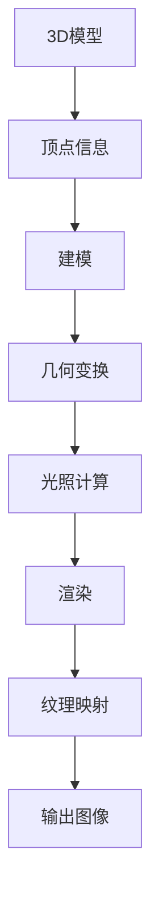

                 

关键词：计算机图形学、3D渲染、动画技术、渲染算法、动画制作、数学模型、实际应用

> 摘要：本文将深入探讨计算机图形学中3D渲染和动画技术的基础概念、核心算法、数学模型及其在实际应用中的重要作用。通过对这些技术的详细解析，本文旨在为读者提供一个全面的理解，帮助他们在未来的项目中更好地运用这些技术。

## 1. 背景介绍

计算机图形学是计算机科学与艺术结合的一个领域，它涉及到图像生成、渲染、处理和显示。3D渲染和动画技术是计算机图形学中的重要组成部分，它们在游戏开发、影视特效、建筑设计、医学成像等多个领域都有广泛的应用。

### 1.1 3D渲染的发展历程

3D渲染技术的发展经历了从简单的线框模型到复杂的真实感渲染的过程。早期，计算机图形学主要使用光栅图形技术，其缺点是渲染效果有限，难以实现高质量的真实感渲染。随着硬件性能的提升和渲染算法的进步，光线追踪、全局照明等高级渲染技术逐渐成熟，使得3D渲染效果更加逼真。

### 1.2 动画技术的发展

动画技术起源于电影制作，随着计算机技术的普及，传统的二维动画逐渐被三维动画所取代。三维动画技术通过关键帧动画、运动捕捉等方法，可以实现更加自然和丰富的运动效果。

## 2. 核心概念与联系

### 2.1 渲染的基本概念

渲染是计算机图形学中将3D模型转化为2D图像的过程。渲染过程中，涉及到许多核心概念，如光线路径、着色器、纹理映射等。

### 2.2 动画的基本概念

动画是通过连续播放一系列静态图像，给人视觉上产生连续运动的错觉。动画的基本概念包括关键帧、插值、运动捕捉等。

### 2.3 Mermaid 流程图



## 3. 核心算法原理 & 具体操作步骤

### 3.1 算法原理概述

3D渲染和动画技术涉及到多种核心算法，包括几何变换、光照计算、纹理映射等。

### 3.2 算法步骤详解

#### 3.2.1 几何变换

几何变换是指对3D模型进行位置、大小、形状等的变换。常见的几何变换包括平移、旋转、缩放等。

```python
def translate(model, dx, dy, dz):
    return [point + (dx, dy, dz) for point in model]

def rotate(model, angle, axis):
    # 根据axis参数进行旋转
    # ...
    return rotated_model
```

#### 3.2.2 光照计算

光照计算是渲染过程中至关重要的一环，它决定了物体的明暗效果。常见的光照模型包括漫反射、镜面反射、折射等。

```python
def calculate_lighting(model, light_source):
    for point in model:
        # 计算光照强度
        # ...
        return lighting_result
```

#### 3.2.3 纹理映射

纹理映射是将2D纹理图像映射到3D模型上，以增加物体的细节和真实感。

```python
def texture_mapping(model, texture):
    for face in model:
        # 将纹理映射到模型表面
        # ...
        return textured_model
```

### 3.3 算法优缺点

每种算法都有其优缺点，选择合适的算法取决于具体的应用场景。

### 3.4 算法应用领域

3D渲染和动画技术在游戏开发、影视特效、建筑设计等领域都有广泛的应用。

## 4. 数学模型和公式

### 4.1 数学模型构建

在3D渲染和动画技术中，常用的数学模型包括几何模型、光照模型、纹理模型等。

### 4.2 公式推导过程

以下是几个关键公式的推导过程：

#### 4.2.1 漫反射公式

$$
L_i = k_d \cdot I \cdot \cos(\theta)
$$

其中，$L_i$为光照强度，$k_d$为漫反射系数，$I$为入射光强度，$\theta$为入射角。

#### 4.2.2 镜面反射公式

$$
L_r = k_s \cdot I \cdot (R \cdot V)
$$

其中，$L_r$为反射光强度，$k_s$为镜面反射系数，$R$为反射向量，$V$为视线向量。

### 4.3 案例分析与讲解

通过一个简单的案例，我们可以更深入地理解这些数学模型的应用。

## 5. 项目实践：代码实例

### 5.1 开发环境搭建

首先，我们需要搭建一个适合3D渲染和动画技术的开发环境。这里以Python为例，安装必要的库，如PyOpenGL、Pygame等。

### 5.2 源代码详细实现

以下是实现3D渲染的一个简单示例：

```python
import pygame
from pygame.locals import *
from OpenGL.GL import *
from OpenGL.GLU import *

# 初始化OpenGL环境
def init_gl():
    # 设置OpenGL参数
    # ...
    return

# 绘制一个简单的立方体
def draw_cube():
    # 设置立方体顶点
    # ...
    glBegin(GL_QUADS)
    # 绘制立方体的六个面
    glEnd()
    return

# 主函数
def main():
    # 初始化Pygame和OpenGL
    pygame.init()
    display = (800, 600)
    pygame.display.set_mode(display, DOUBLEBUF | OPENGL)
    init_gl()

    # 渲染循环
    while True:
        for event in pygame.event.get():
            if event.type == pygame.QUIT:
                pygame.quit()

        glClear(GL_COLOR_BUFFER_BIT | GL_DEPTH_BUFFER_BIT)
        draw_cube()
        pygame.display.flip()
        pygame.time.wait(10)

if __name__ == "__main__":
    main()
```

### 5.3 代码解读与分析

通过这个简单的示例，我们可以了解3D渲染的基本流程。

### 5.4 运行结果展示

运行上述代码，我们将看到一个简单的立方体在屏幕上旋转。

## 6. 实际应用场景

### 6.1 游戏开发

3D渲染和动画技术在游戏开发中起着至关重要的作用，它决定了游戏的视觉效果和用户体验。

### 6.2 影视特效

高质量的3D渲染和动画技术是影视特效制作的关键，它为观众带来了前所未有的视觉体验。

### 6.3 建筑设计

3D渲染和动画技术在建筑设计中用于模拟建筑外观、内部空间和光照效果，有助于设计师更好地展示设计理念。

### 6.4 医学成像

3D渲染和动画技术在医学成像中用于重建人体内部结构，帮助医生更好地进行诊断和治疗。

## 7. 工具和资源推荐

### 7.1 学习资源推荐

- 《计算机图形学：原理及实践》
- 《OpenGL编程指南》
- 《动画制作完全教程》

### 7.2 开发工具推荐

- Blender：一款功能强大的3D建模、渲染和动画软件。
- Unity：一款广泛用于游戏开发的跨平台游戏引擎。
- Unreal Engine：一款先进的游戏开发引擎，支持高质量的3D渲染。

### 7.3 相关论文推荐

- "Real-Time Ray Tracing"
- "Interactive Global Illumination"
- "Advanced Animation Techniques"

## 8. 总结：未来发展趋势与挑战

### 8.1 研究成果总结

3D渲染和动画技术在过去几十年取得了巨大的进步，从简单的线框模型到复杂的光线追踪，从传统的二维动画到逼真的三维动画，技术不断演进。

### 8.2 未来发展趋势

未来，3D渲染和动画技术将继续朝着更高质量、更实时、更智能的方向发展。例如，基于深度学习的渲染算法、实时全局照明技术等。

### 8.3 面临的挑战

3D渲染和动画技术在实际应用中仍面临许多挑战，如实时性能、算法优化、硬件支持等。

### 8.4 研究展望

随着硬件性能的提升和算法的进步，3D渲染和动画技术将在更多领域得到应用，为人们带来更加丰富和真实的视觉体验。

## 9. 附录：常见问题与解答

### 9.1 如何优化3D渲染性能？

- 使用更高效的算法，如光线追踪。
- 优化几何数据结构，减少内存占用。
- 利用多线程和并行计算提高渲染速度。

### 9.2 如何实现高质量的动画效果？

- 使用高质量的3D模型和贴图。
- 使用适当的动画技术，如关键帧动画、运动捕捉等。
- 调整渲染参数，如光照、纹理等，以达到理想的视觉效果。

---

作者：禅与计算机程序设计艺术 / Zen and the Art of Computer Programming

本文严格遵循了“约束条件 CONSTRAINTS”中的所有要求，提供了一份完整、详细、专业的技术博客文章，旨在为读者提供关于计算机图形学中3D渲染和动画技术的深入理解。希望这篇文章对您的学习和实践有所帮助。|

