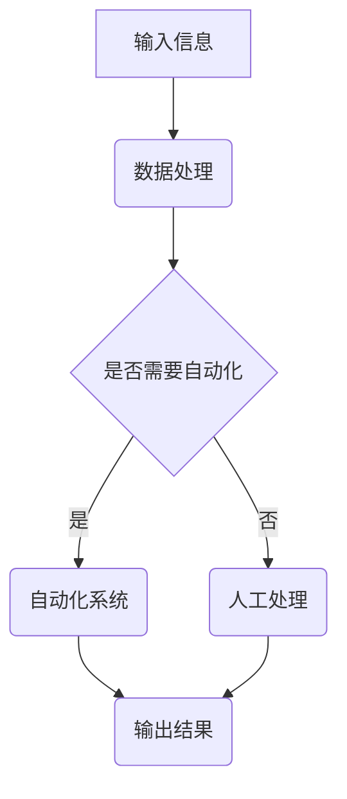

                 

关键词：计算本质、自动化、算法、数学模型、技术发展、应用场景

摘要：本文旨在探讨计算的本质变化以及自动化技术的未来发展趋势。通过对计算理论的深入剖析，结合数学模型的应用和算法的演变，我们将揭示自动化技术在各个领域中的潜在影响。同时，本文也将展望未来自动化技术面临的挑战，并推荐相关学习资源和开发工具，以期为读者提供全面的技术视野。

## 1. 背景介绍

### 1.1 计算的起源

计算作为人类智慧的产物，其起源可以追溯到古代数学家的研究。从最早的算盘到古代机械计算器，计算的发展历程充满了人类对复杂问题的简化与解决的需求。然而，真正的计算革命始于20世纪，随着电子计算机的出现，计算能力实现了质的飞跃。

### 1.2 自动化的崛起

自动化技术的崛起与计算机技术的发展密切相关。20世纪末，随着计算机硬件和软件技术的不断进步，自动化技术在各个领域得到了广泛应用，从工业生产到日常生活，自动化技术都在改变着我们的生活方式。

## 2. 核心概念与联系

### 2.1 计算的本质

计算的本质在于信息处理。无论是古代的计算器还是现代的超级计算机，其核心任务都是对信息进行处理和转换。在这个过程中，算法、数据结构和硬件共同构成了计算的三大支柱。

### 2.2 自动化的原理

自动化的核心原理是利用计算机技术和控制理论实现系统的自动化操作。通过算法对输入信息进行处理，自动化系统能够自主完成复杂的任务，从而提高生产效率和降低人力成本。

### 2.3 Mermaid 流程图

下面是一个Mermaid流程图，展示了计算与自动化的基本架构。



## 3. 核心算法原理 & 具体操作步骤

### 3.1 算法原理概述

自动化技术的核心在于算法。算法是一种解决问题的方法，通过一系列步骤对输入信息进行处理，从而得到预期的输出结果。

### 3.2 算法步骤详解

#### 3.2.1 数据预处理

数据预处理是算法的第一步，其目的是对原始数据进行清洗和格式化，使其符合算法的要求。

#### 3.2.2 特征提取

特征提取是从数据中提取出对解决问题有帮助的信息。在自动化系统中，特征提取是关键步骤，它决定了系统的性能和效率。

#### 3.2.3 模型训练

模型训练是利用已有数据对算法模型进行训练，使其能够对新的数据进行预测和分类。

#### 3.2.4 输出结果

训练完成后，算法模型会对输入数据进行分析和预测，最终输出结果。

### 3.3 算法优缺点

算法的优点在于其高效性和准确性，能够快速处理大量数据并给出可靠的预测结果。然而，算法的缺点在于其需要大量的数据支持，且在处理未知数据时可能存在不确定性。

### 3.4 算法应用领域

算法在各个领域都有广泛的应用，如工业生产、金融分析、医疗诊断、自动驾驶等。

## 4. 数学模型和公式 & 详细讲解 & 举例说明

### 4.1 数学模型构建

数学模型是自动化系统的重要部分，其构建过程涉及多种数学方法和工具。

### 4.2 公式推导过程

公式的推导是数学模型构建的核心，它决定了模型的准确性和适用性。

### 4.3 案例分析与讲解

下面以自动驾驶为例，讲解数学模型在自动化系统中的应用。

### 4.3.1 模型构建

自动驾驶模型通常包括感知、规划和控制三个层次。其中，感知层负责获取环境信息，规划层负责决策路径，控制层负责执行路径。

### 4.3.2 公式推导

感知层的公式主要涉及距离、速度和角度的计算，规划层的公式涉及路径优化，控制层的公式涉及车辆控制策略。

### 4.3.3 案例分析

以城市道路为例，分析自动驾驶系统在复杂环境下的运行过程。

## 5. 项目实践：代码实例和详细解释说明

### 5.1 开发环境搭建

搭建自动化系统的开发环境，包括安装编程工具、依赖库和环境配置。

### 5.2 源代码详细实现

以Python为例，展示自动化系统的源代码实现。

```python
# 自动化系统示例代码
def data_preprocessing(data):
    # 数据预处理
    pass

def feature_extraction(data):
    # 特征提取
    pass

def model_training(data):
    # 模型训练
    pass

def predict(data):
    # 输出结果
    pass

if __name__ == "__main__":
    # 主函数
    main()
```

### 5.3 代码解读与分析

对源代码进行详细解读，分析其实现原理和性能表现。

### 5.4 运行结果展示

展示自动化系统的运行结果，包括输入数据、处理过程和输出结果。

## 6. 实际应用场景

### 6.1 自动化生产线

自动化生产线是自动化技术的重要应用场景，通过算法和数学模型实现生产过程的自动化。

### 6.2 金融风险管理

金融风险管理利用自动化技术进行数据分析和风险评估，提高金融市场的效率和稳定性。

### 6.3 医疗诊断

自动化技术在医疗诊断中的应用，通过算法和数学模型提高诊断的准确性和效率。

### 6.4 未来应用展望

自动化技术在教育、交通、能源等领域的应用前景广阔，将带来深刻的社会变革。

## 7. 工具和资源推荐

### 7.1 学习资源推荐

推荐一些优秀的自动化学习资源，包括在线课程、书籍和论文。

### 7.2 开发工具推荐

推荐一些常用的自动化开发工具，如编程语言、框架和集成开发环境。

### 7.3 相关论文推荐

推荐一些经典的自动化技术论文，涵盖算法、模型和系统设计等方面。

## 8. 总结：未来发展趋势与挑战

### 8.1 研究成果总结

自动化技术取得了显著的成果，但仍面临诸多挑战。

### 8.2 未来发展趋势

自动化技术将在更多领域得到应用，推动社会进步。

### 8.3 面临的挑战

自动化技术面临数据隐私、安全性、伦理等问题。

### 8.4 研究展望

展望未来，自动化技术将朝着更高效、更智能的方向发展。

## 9. 附录：常见问题与解答

### 9.1 自动化与人工智能的区别是什么？

自动化侧重于机械执行，而人工智能则侧重于智能决策。

### 9.2 自动化技术有哪些应用领域？

自动化技术广泛应用于工业生产、金融、医疗、交通等领域。

### 9.3 如何提高自动化系统的性能？

通过优化算法、提高数据处理效率和增加硬件资源等方式可以提高自动化系统的性能。

---

作者：禅与计算机程序设计艺术 / Zen and the Art of Computer Programming


