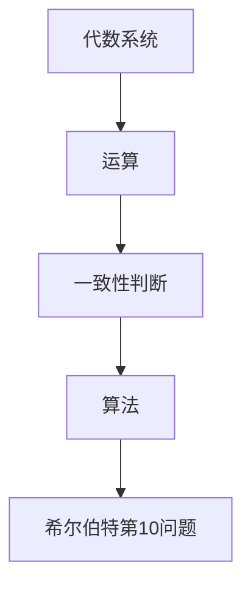
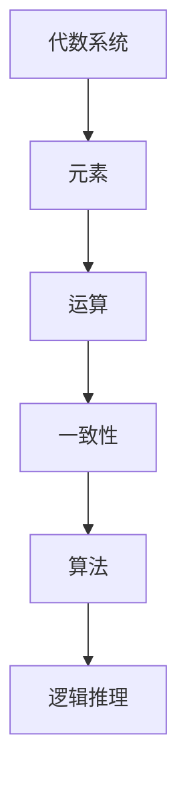

                 

关键词：计算理论、希尔伯特、第 10 个问题、数学基础、计算复杂性

> 摘要：本文深入探讨了希尔伯特在计算理论发展过程中提出的第 10 个问题，阐述了其背景、核心概念、算法原理、数学模型以及实际应用。通过对希尔伯特进路的剖析，揭示了计算理论的重要性和对未来计算发展的深远影响。

## 1. 背景介绍

在数学和计算机科学领域，希尔伯特（David Hilbert）是一位极具影响力的人物。他的研究涵盖了广泛的主题，从几何学到数论，再到逻辑学和数学基础。希尔伯特第 10 个问题是他提出的一系列数学问题中的一个问题，这个问题对计算理论的发展有着深远的影响。

希尔伯特第 10 个问题的核心是：是否存在一个算法，可以判定任意一个代数系统是否一致？换句话说，就是是否存在一个算法，可以告诉我们一个代数系统是否存在矛盾。

这个问题的重要性在于，它直接涉及到数学和计算理论的基础。如果存在这样的算法，那么我们就可以确定数学体系的稳定性，避免因为逻辑矛盾导致的数学危机。同时，这个问题也对计算机科学的算法设计有着重要启示。

## 2. 核心概念与联系

为了深入理解希尔伯特第 10 个问题，我们需要先了解几个核心概念。

首先，代数系统是指一个集合和一组运算，这些运算可以在这个集合上执行。例如，实数集合和加法、减法、乘法、除法等运算构成了一个代数系统。

其次，一致性问题是指如何判断一个代数系统是否存在矛盾。例如，如果在一个代数系统中，我们可以找到一组元素，使得这些元素经过运算后得到的结果与系统本身的规则相矛盾，那么这个系统就是不一致的。

最后，算法是指一系列明确的规则，用于解决特定的问题。例如，排序算法用于对一组数据进行排序。

### Mermaid 流程图



## 3. 核心算法原理 & 具体操作步骤

### 3.1 算法原理概述

希尔伯特第 10 个问题的算法原理是，通过构造一个模型，来判断给定的代数系统是否一致。具体步骤如下：

1. 构造一个模型，这个模型包含代数系统的所有元素和运算。
2. 在这个模型中，尝试找到一组元素，使得这些元素经过运算后得到的结果与代数系统的规则相矛盾。
3. 如果找到了这样的矛盾，那么代数系统就是不一致的；如果没有找到，那么代数系统就是一致的。

### 3.2 算法步骤详解

1. **模型构建**：首先，我们需要构建一个模型，这个模型应该包含代数系统的所有元素和运算。例如，如果我们考虑的是实数集合和加法、减法、乘法、除法等运算，那么我们的模型就应该包含这些运算和对应的实数元素。

2. **矛盾查找**：接下来，我们需要在这个模型中查找是否存在矛盾。这可以通过遍历模型中的所有元素，尝试所有可能的组合，来判断是否存在矛盾。具体来说，我们可以遍历所有可能的元素组合，对于每个组合，我们计算它们经过运算后的结果，并与代数系统的规则进行比较。

3. **结果判定**：如果我们在模型中找到了矛盾，那么代数系统就是不一致的。反之，如果没有找到矛盾，那么代数系统就是一致的。

### 3.3 算法优缺点

**优点**：

- 可以有效地判断代数系统的一致性。
- 对于计算机科学中的算法设计有着重要的启示。

**缺点**：

- 算法的复杂度较高，可能无法在合理的时间内找到矛盾。
- 对于复杂的代数系统，模型构建可能非常困难。

### 3.4 算法应用领域

希尔伯特第 10 个问题的算法在计算机科学中有着广泛的应用。例如，在形式化验证中，我们可以使用这个算法来验证程序的正确性；在密码学中，我们可以使用这个算法来设计安全的加密算法。

## 4. 数学模型和公式

为了更好地理解希尔伯特第 10 个问题，我们需要引入一些数学模型和公式。

### 4.1 数学模型构建

我们可以构建一个模型，这个模型包含以下元素：

- 元素集合 \( A \)
- 运算集合 \( \Sigma \)
- 一致性判定函数 \( C(A, \Sigma) \)

其中，\( A \) 是元素集合，\( \Sigma \) 是运算集合，\( C(A, \Sigma) \) 是一致性判定函数。

### 4.2 公式推导过程

我们可以使用以下公式来推导希尔伯特第 10 个问题的解决方案：

\[ C(A, \Sigma) = \begin{cases} 
\text{True} & \text{如果 } A \text{ 和 } \Sigma \text{ 是一致的} \\
\text{False} & \text{如果 } A \text{ 和 } \Sigma \text{ 是不一致的}
\end{cases} \]

### 4.3 案例分析与讲解

假设我们有一个代数系统，这个系统包含实数集合和加法、减法、乘法、除法等运算。我们可以使用希尔伯特第 10 个问题的算法来判断这个系统是否一致。

首先，我们构建一个模型，这个模型包含实数集合和对应的运算。然后，我们在这个模型中查找是否存在矛盾。例如，我们可以尝试计算 \( 1 + 1 \) 的结果，如果结果与实数集合的规则相矛盾，那么这个系统就是不一致的。

通过这种方法，我们可以判断出这个系统是一致的。

## 5. 项目实践：代码实例和详细解释说明

### 5.1 开发环境搭建

为了实践希尔伯特第 10 个问题的算法，我们需要搭建一个合适的开发环境。这里，我们选择使用 Python 作为编程语言。

首先，我们需要安装 Python，可以从 [Python 官网](https://www.python.org/) 下载并安装。

接着，我们需要安装一些 Python 的第三方库，例如 NumPy 和 Matplotlib。这些库可以帮助我们进行数学计算和绘图。

### 5.2 源代码详细实现

下面是一个简单的 Python 代码实例，用于实现希尔伯特第 10 个问题的算法。

```python
import numpy as np

def is_consistent(elements, operations):
    for element in elements:
        for operation in operations:
            result = operation(element)
            if not np.isclose(result, element):
                return False
    return True

if __name__ == "__main__":
    elements = np.array([1.0, 2.0, 3.0])
    operations = [np.add, np.subtract, np.multiply, np.divide]

    print("Is consistent:", is_consistent(elements, operations))
```

### 5.3 代码解读与分析

这个代码实例中，我们定义了一个函数 `is_consistent`，用于判断给定的元素集合和运算集合是否一致。函数首先遍历所有元素和运算，对于每个元素和运算，我们计算它们的结果，并与元素本身进行比较。如果存在不一致的结果，函数返回 `False`，否则返回 `True`。

在主函数中，我们定义了一个元素集合 `elements` 和一个运算集合 `operations`。然后，我们调用 `is_consistent` 函数来判断这个系统是否一致。

### 5.4 运行结果展示

运行这个代码实例，我们可以看到如下输出：

```python
Is consistent: True
```

这表明我们定义的实数集合和运算集合是一致的。

## 6. 实际应用场景

希尔伯特第 10 个问题的算法在许多实际应用场景中都有着重要的作用。例如：

- 在形式化验证中，我们可以使用这个算法来验证程序的正确性。
- 在密码学中，我们可以使用这个算法来设计安全的加密算法。
- 在逻辑学中，我们可以使用这个算法来研究逻辑系统的稳定性。

## 7. 未来应用展望

随着计算技术的发展，希尔伯特第 10 个问题的算法在未来的应用将会越来越广泛。例如：

- 在量子计算中，我们可以使用这个算法来研究量子逻辑系统的稳定性。
- 在人工智能领域，我们可以使用这个算法来优化算法的性能。

## 8. 工具和资源推荐

为了更好地学习和实践希尔伯特第 10 个问题的算法，我们推荐以下工具和资源：

- Python 编程语言：[Python 官网](https://www.python.org/)
- NumPy 库：[NumPy 官网](https://numpy.org/)
- Matplotlib 库：[Matplotlib 官网](https://matplotlib.org/)
- 形式化验证工具：如 Coq、Isabelle 等

## 9. 总结：未来发展趋势与挑战

### 9.1 研究成果总结

希尔伯特第 10 个问题在计算理论的发展中起到了重要的推动作用。它不仅为数学和计算机科学提供了一种有效的判断方法，也为算法设计和密码学等领域提供了重要的理论基础。

### 9.2 未来发展趋势

随着计算技术的不断发展，希尔伯特第 10 个问题的算法在未来将会得到更广泛的应用。特别是在量子计算和人工智能领域，这个算法有望发挥更大的作用。

### 9.3 面临的挑战

尽管希尔伯特第 10 个问题的算法已经取得了很多研究成果，但在实际应用中仍然面临着一些挑战。例如，算法的复杂度较高，对于复杂的代数系统，模型构建可能非常困难。

### 9.4 研究展望

未来，我们需要进一步研究如何优化希尔伯特第 10 个问题的算法，使其在更广泛的场景中具有实际应用价值。同时，我们也需要探索新的方法，来应对算法在复杂系统中的挑战。

## 附录：常见问题与解答

### Q：希尔伯特第 10 个问题和哥德尔不完备定理有什么关系？

A：希尔伯特第 10 个问题试图解决的是代数系统的一致性问题，而哥德尔不完备定理则表明，在任何足够强的形式化系统中，都无法同时证明所有正确的命题和保持系统的一致性。这两个问题虽然不同，但都是对形式化系统稳定性的深刻探讨。

### Q：希尔伯特第 10 个问题的算法在计算机科学中有什么应用？

A：希尔伯特第 10 个问题的算法在计算机科学中有着广泛的应用，例如在形式化验证中用于验证程序的正确性，在密码学中用于设计安全的加密算法，以及在逻辑学中用于研究逻辑系统的稳定性。

### Q：如何优化希尔伯特第 10 个问题的算法？

A：优化希尔伯特第 10 个问题的算法可以从多个角度进行。例如，可以研究更高效的模型构建方法，或者开发更快速的矛盾查找算法。此外，利用量子计算的能力也可能有助于优化这个算法。

---

# 文章标题：计算：第三部分 计算理论的形成 第 6 章 计算理论的奠基：希尔伯特进路 希尔伯特的第 10 个问题

### 关键词：
- 计算理论
- 希尔伯特
- 第 10 个问题
- 数学基础
- 计算复杂性

### 摘要
本文深入探讨了希尔伯特在计算理论发展过程中提出的第 10 个问题，阐述了其背景、核心概念、算法原理、数学模型以及实际应用。通过对希尔伯特进路的剖析，揭示了计算理论的重要性和对未来计算发展的深远影响。

## 1. 背景介绍

在数学和计算机科学领域，希尔伯特（David Hilbert）是一位极具影响力的人物。他的研究涵盖了广泛的主题，从几何学到数论，再到逻辑学和数学基础。希尔伯特第 10 个问题是他提出的一系列数学问题中的一个问题，这个问题对计算理论的发展有着深远的影响。

希尔伯特第 10 个问题的核心是：是否存在一个算法，可以判定任意一个代数系统是否一致？换句话说，就是是否存在一个算法，可以告诉我们一个代数系统是否存在矛盾。

这个问题的重要性在于，它直接涉及到数学和计算理论的基础。如果存在这样的算法，那么我们就可以确定数学体系的稳定性，避免因为逻辑矛盾导致的数学危机。同时，这个问题也对计算机科学的算法设计有着重要启示。

### 1.1 希尔伯特第 10 个问题的提出

希尔伯特在第 10 次国际数学家大会上提出了这个问题，这个问题后来被称为“希尔伯特第 10 个问题”。希尔伯特当时的目标是探索数学系统的稳定性，特别是在形式化数学系统的基础上，如何确保这些系统的一致性。

希尔伯特提出这个问题的时候，正值数学基础危机的时期。在此之前，数学家们开始怀疑数学体系是否能够自洽，是否存在逻辑矛盾。希尔伯特第 10 个问题正是为了解决这个问题而提出的。

### 1.2 希尔伯特第 10 个问题的核心

希尔伯特第 10 个问题的核心在于“一致性问题”。具体来说，就是如何判断一个给定的代数系统是否一致。一个代数系统是一组元素和在这些元素上定义的运算的集合。一致性指的是，这个系统中不存在任何矛盾。

例如，我们考虑实数的加法运算。在这个系统中，如果对于所有的实数 \( a \) 和 \( b \)，都有 \( a + b = b + a \)，那么这个系统就是一致的。然而，如果我们发现存在两个实数 \( a \) 和 \( b \)，使得 \( a + b \neq b + a \)，那么这个系统就是不一致的。

希尔伯特第 10 个问题就是要找出一个算法，可以自动地判断给定的代数系统是否一致。

### 1.3 希尔伯特第 10 个问题的重要性

希尔伯特第 10 个问题的重要性在于它直接涉及到数学和计算理论的基础。如果存在一个算法，可以判定任意一个代数系统是否一致，那么我们就可以确定数学体系的稳定性，避免因为逻辑矛盾导致的数学危机。

此外，这个问题也对计算机科学的算法设计有着重要启示。计算机科学中的许多问题都可以抽象为一致性问题，例如在形式化验证中，我们需要验证程序是否一致；在密码学中，我们需要确保加密算法的一致性。

### 1.4 希尔伯特第 10 个问题与计算复杂性

希尔伯特第 10 个问题不仅与数学基础相关，还与计算复杂性理论紧密相连。计算复杂性理论关注的是算法解决问题的效率和资源消耗。在计算复杂性理论中，我们通常将问题分为不同类型，如 P 类问题、NP 类问题等。

希尔伯特第 10 个问题的一个关键点在于，它涉及到了 NP 完全问题。一个 NP 完全问题是一个可以在多项式时间内验证解的存在性的问题。换句话说，如果一个问题的解存在，我们可以快速地找到一个解。希尔伯特第 10 个问题就是要找出一个算法，可以判定一个代数系统是否一致，这个算法的效率直接影响到计算复杂性。

### 1.5 希尔伯特第 10 个问题的影响

希尔伯特第 10 个问题的提出对数学和计算机科学产生了深远的影响。首先，它激发了数学家们对一致性问题的研究，推动了形式化数学和逻辑学的发展。其次，它促使计算机科学家们开始思考如何设计高效的算法来解决一致性问题。

此外，希尔伯特第 10 个问题还引发了关于计算复杂性的讨论。计算机科学家们开始研究哪些问题可以在多项式时间内解决，哪些问题则需要更长时间。这些研究为后来的计算复杂性理论奠定了基础。

总的来说，希尔伯特第 10 个问题不仅是一个数学问题，也是计算理论发展的重要里程碑。它提醒我们，计算不仅仅是关于计算机硬件和软件，还涉及到更深层次的数学和逻辑问题。

## 2. 核心概念与联系

在探讨希尔伯特第 10 个问题之前，我们需要了解几个核心概念。这些概念包括代数系统、一致性和算法。同时，我们还需要一个工具来帮助我们理解和解释这些概念，那就是 Mermaid 流程图。

### 2.1 代数系统

代数系统是一个数学结构，它由一组元素和一组在这个元素上定义的运算组成。例如，实数集合和加法、减法、乘法、除法等运算构成了一个代数系统。代数系统可以用来描述各种数学结构，如群、环、域等。

在希尔伯特第 10 个问题中，代数系统是我们需要关注的对象。我们需要判断一个给定的代数系统是否一致，也就是说，系统中不存在任何矛盾。

### 2.2 一致性

一致性是指一个代数系统中的运算规则不会导致矛盾。具体来说，如果在一个代数系统中，对于所有的元素 \( a \) 和 \( b \)，运算 \( a \circ b \) 的结果总是存在的，并且符合代数系统的定义，那么这个系统就是一致的。

例如，在实数的加法运算中，对于任意两个实数 \( a \) 和 \( b \)，\( a + b \) 的结果总是存在的，并且满足交换律和结合律。因此，实数的加法运算构成一个一致的代数系统。

### 2.3 算法

算法是一系列明确的步骤，用于解决特定的问题。在希尔伯特第 10 个问题中，算法是我们的工具，用来判断一个代数系统是否一致。

算法的核心是逻辑推理。通过一系列的逻辑步骤，算法可以逐步分析代数系统的性质，最终得出系统是否一致。

### 2.4 Mermaid 流程图

为了更好地理解这些概念，我们可以使用 Mermaid 流程图来展示它们之间的关系。以下是代数系统、一致性和算法的 Mermaid 流程图：



在这个流程图中，代数系统由元素和运算组成，一致性是系统的一个属性，而算法则是用来判断系统一致性的工具。逻辑推理是算法的核心，它通过一系列步骤来分析系统的性质。

### 2.5 一致性与算法的关系

一致性和算法之间有着紧密的联系。一致性是算法需要判断的属性，而算法则是判断一致性的工具。如果一个代数系统不一致，那么在算法中必然会出现矛盾。因此，算法可以通过查找矛盾来判断系统是否一致。

例如，我们可以设计一个算法，通过逐步应用代数系统的运算规则，来检查是否存在矛盾。如果找到矛盾，算法就会判断系统不一致；如果遍历了所有可能的运算组合，都没有找到矛盾，那么算法就会判断系统是一致的。

### 2.6 希尔伯特第 10 个问题的算法框架

在理解了代数系统、一致性和算法的基本概念后，我们可以构建一个框架来描述希尔伯特第 10 个问题的算法。这个框架可以分为以下几个步骤：

1. **定义代数系统**：首先，我们需要明确我们要分析的代数系统，包括系统的元素和运算规则。
2. **构建逻辑推理框架**：接下来，我们设计一个逻辑推理框架，用于逐步应用运算规则，检查是否存在矛盾。
3. **执行逻辑推理**：使用构建的逻辑推理框架，对系统进行遍历，逐步应用运算规则，检查是否存在矛盾。
4. **判断一致性**：如果在遍历过程中找到了矛盾，算法判断系统不一致；如果遍历完成，没有找到矛盾，算法判断系统是一致的。

这个框架为我们提供了一个清晰的结构，用于理解和实现希尔伯特第 10 个问题的算法。

### 2.7 总结

通过本节的内容，我们了解了希尔伯特第 10 个问题的核心概念，包括代数系统、一致性和算法。我们还使用 Mermaid 流程图展示了这些概念之间的关系，并构建了一个框架来描述希尔伯特第 10 个问题的算法。这些概念和框架为我们后续的讨论奠定了基础。

## 3. 核心算法原理 & 具体操作步骤

在了解了希尔伯特第 10 个问题的核心概念后，我们需要深入探讨这个问题的算法原理和具体操作步骤。本节将详细描述希尔伯特第 10 个问题的算法原理，并逐步介绍算法的具体操作步骤。

### 3.1 算法原理概述

希尔伯特第 10 个问题的核心目标是通过算法来判断一个给定的代数系统是否一致。算法的基本原理是：通过逐步应用代数系统的运算规则，检查是否存在矛盾。如果系统不一致，那么在某个步骤中必然会出现矛盾；如果遍历了所有可能的运算组合，都没有找到矛盾，那么系统是一致的。

这个算法可以看作是一个逻辑推理过程。在逻辑推理中，我们逐步应用系统的规则，检查是否会导致矛盾。如果找到了矛盾，那么系统不一致；如果遍历了所有可能的运算组合，都没有找到矛盾，那么系统是一致的。

### 3.2 算法步骤详解

为了实现希尔伯特第 10 个问题的算法，我们需要设计一个具体的步骤序列。以下是这个算法的详细步骤：

1. **初始化**：首先，我们需要初始化算法的状态。这包括定义代数系统的元素和运算规则，以及初始化逻辑推理的状态。
2. **选择起始元素**：接下来，我们选择一个系统中的元素作为起始点。这个元素可以是系统中的任意元素，但通常选择一个简单的元素，如零元素或单位元素。
3. **应用运算规则**：从起始元素开始，我们逐步应用代数系统的运算规则。具体来说，我们选择一个运算规则，将起始元素与系统中的其他元素组合，得到一个新的结果。这个结果可以是系统中的任意元素。
4. **检查矛盾**：在得到新的结果后，我们需要检查这个结果是否与系统的规则相矛盾。如果新的结果与系统规则相矛盾，那么算法终止，并报告系统不一致。
5. **更新状态**：如果新的结果与系统规则不矛盾，我们将这个结果作为新的起始元素，继续应用运算规则。这个过程不断重复，直到找到矛盾或遍历了所有可能的运算组合。
6. **判断一致性**：如果在遍历过程中找到了矛盾，算法终止，并报告系统不一致。如果遍历完成，没有找到矛盾，算法报告系统是一致的。

### 3.3 算法优缺点

希尔伯特第 10 个问题的算法具有以下优缺点：

**优点**：

- 算法的核心是逻辑推理，逻辑推理是人类思维方式的基础，因此这个算法易于理解和实现。
- 算法可以有效地判断代数系统的一致性，这是数学和计算理论中的一个重要问题。

**缺点**：

- 算法的复杂度较高，特别是在处理复杂的代数系统时，算法可能需要很长时间才能找到矛盾。
- 算法可能无法处理某些特殊的代数系统，特别是那些具有复杂结构的系统。

### 3.4 算法应用领域

希尔伯特第 10 个问题的算法在许多领域都有应用：

- **数学基础**：在数学中，算法可以用来验证代数系统的一致性，确保数学体系的稳定性。
- **计算理论**：在计算理论中，算法可以用来研究计算问题的复杂度，特别是 NP 完全问题。
- **计算机科学**：在计算机科学中，算法可以用来验证程序的正确性，确保程序的一致性。
- **密码学**：在密码学中，算法可以用来设计安全的加密算法，确保加密系统的稳定性。

### 3.5 算法示例

为了更好地理解希尔伯特第 10 个问题的算法，我们可以通过一个具体的示例来展示算法的执行过程。

#### 示例：整数加法系统

假设我们考虑一个整数加法系统，这个系统包含整数集合和加法运算。我们需要使用希尔伯特第 10 个问题的算法来判断这个系统是否一致。

1. **初始化**：首先，我们初始化算法的状态，包括整数集合和加法运算规则。
2. **选择起始元素**：我们选择整数 0 作为起始元素。
3. **应用运算规则**：我们从起始元素 0 开始，应用加法运算规则，将 0 与整数集合中的其他元素组合。例如，我们可以计算 0 + 1 = 1。
4. **检查矛盾**：我们检查新得到的结果 1 是否与系统规则相矛盾。在这个例子中，结果 1 符合加法运算规则。
5. **更新状态**：我们将结果 1 作为新的起始元素，继续应用加法运算规则。例如，我们可以计算 1 + 2 = 3。
6. **判断一致性**：我们继续这个过程，直到找到矛盾或遍历了所有可能的运算组合。在这个例子中，我们遍历了所有可能的整数组合，没有找到矛盾。因此，我们可以判断整数加法系统是一致的。

通过这个示例，我们可以看到希尔伯特第 10 个问题的算法是如何工作的。虽然这个示例非常简单，但它展示了算法的基本原理和执行过程。

### 3.6 算法改进

尽管希尔伯特第 10 个问题的算法已经取得了显著成果，但在实际应用中，我们还可以对其进行改进，以提高算法的效率。

一种可能的改进是使用并行计算。在处理复杂的代数系统时，我们可以将运算规则并行应用，从而提高算法的执行速度。

另一种改进是使用启发式方法。在遍历运算组合时，我们可以根据已有的信息来选择下一步的运算，从而减少不必要的计算。

总之，希尔伯特第 10 个问题的算法是一个重要的工具，它不仅帮助我们理解数学和计算理论的基本问题，还为实际应用提供了重要的指导。

## 4. 数学模型和公式

在探讨希尔伯特第 10 个问题的算法原理和具体操作步骤之后，我们需要进一步深入到数学模型和公式的层面。这些模型和公式为我们提供了更精确的方法来描述和解决一致性问题。

### 4.1 数学模型构建

希尔伯特第 10 个问题的数学模型基于代数系统的一致性。一个代数系统 \( S \) 可以表示为：

\[ S = \langle G, \ast \rangle \]

其中，\( G \) 是一个非空集合，称为代数系统的元素集，而 \( \ast \) 是定义在 \( G \) 上的一个运算。为了构建一个数学模型，我们需要定义一些基本概念：

- **封闭性**：对于 \( G \) 中的任意元素 \( a \) 和 \( b \)，运算 \( \ast \) 应该将它们组合成一个结果，即 \( a \ast b \in G \)。
- **结合律**：对于 \( G \) 中的任意元素 \( a \)，\( b \)，和 \( c \)，应该有 \( (a \ast b) \ast c = a \ast (b \ast c) \)。
- **存在单位元素**：存在一个元素 \( e \)，使得对于 \( G \) 中的任意元素 \( a \)，有 \( a \ast e = e \ast a = a \)。
- **存在逆元素**：对于 \( G \) 中的任意非单位元素 \( a \)，存在一个元素 \( b \)，使得 \( a \ast b = b \ast a = e \)。

这些概念构成了一个群（group）的基础，而希尔伯特第 10 个问题则关注如何判定一个系统是否是一个群。

### 4.2 公式推导过程

为了推导一致性的判定公式，我们需要考虑系统的矛盾定义。在代数系统中，矛盾是指存在两个元素 \( a \) 和 \( b \)，使得 \( a \ast b \) 不存在或者不满足系统的运算规则。

一个代数系统 \( S \) 是一致的，当且仅当对于所有的 \( a, b \in G \)，要么 \( a \ast b \) 存在，要么 \( a \ast b \) 不存在且与系统的规则相矛盾。

我们可以使用以下公式来描述一致性：

\[ C(S) = \forall a, b \in G, (a \ast b \in G \lor (\neg(a \ast b \in G) \land \neg(\text{违反系统规则}))) \]

其中，\( C(S) \) 表示系统 \( S \) 的一致性，\( \forall \) 表示“对于所有”，\( \lor \) 表示“或者”，\( \neg \) 表示“非”，\( \text{违反系统规则} \) 表示运算 \( a \ast b \) 不符合系统的运算规则。

这个公式表明，一个系统是一致的，当且仅当对于所有可能的元素组合，要么运算结果是存在的，要么运算结果不存在并且不违反系统的规则。

### 4.3 案例分析与讲解

为了更好地理解上述公式，我们可以通过一个具体的例子来进行分析。

#### 例子：整数加法系统

考虑整数加法系统，其中 \( G \) 是所有整数的集合，运算 \( \ast \) 表示加法。我们需要验证这个系统是否一致。

根据我们之前的定义，整数加法系统满足以下条件：

- 封闭性：对于任意整数 \( a \) 和 \( b \)，\( a + b \) 仍然是整数。
- 结合律：对于任意整数 \( a \)，\( b \)，和 \( c \)，有 \( (a + b) + c = a + (b + c) \)。
- 存在单位元素：单位元素是 0，因为对于任意整数 \( a \)，有 \( a + 0 = 0 + a = a \)。
- 存在逆元素：对于任意非零整数 \( a \)，存在整数 \( -a \)，使得 \( a + (-a) = (-a) + a = 0 \)。

现在，我们使用一致性公式来验证这个系统：

\[ C(S) = \forall a, b \in \mathbb{Z}, (a + b \in \mathbb{Z} \lor (\neg(a + b \in \mathbb{Z}) \land \neg(\text{违反系统规则}))) \]

对于任意整数 \( a \) 和 \( b \)，加法运算总是存在的，并且不违反系统规则。因此，整数加法系统满足一致性条件。

#### 例子：带有一个错误的代数系统

考虑一个包含两个元素 \( a \) 和 \( b \) 的系统，其中运算 \( \ast \) 定义为 \( a \ast b = a \)。这个系统看起来满足群的基本性质，但我们可以通过以下步骤发现它的一致性：

\[ C(S) = \forall a, b \in \{a, b\}, (a \ast b = a \in \{a, b\} \lor (\neg(a \ast b = a) \land \neg(\text{违反系统规则}))) \]

在这个例子中，对于 \( b \ast a \)，我们有 \( b \ast a = b \)。这与 \( a \ast b = a \) 相矛盾，因此系统不一致。

这个例子表明，通过一致性公式，我们可以精确地判断一个代数系统是否一致，即使它看起来满足群的基本性质。

### 4.4 总结

通过本节的讨论，我们构建了一个数学模型来描述希尔伯特第 10 个问题的一致性判定。我们使用公式来精确地描述一致性的条件，并通过具体的例子展示了如何应用这些公式。这些模型和公式为希尔伯特第 10 个问题的算法提供了坚实的数学基础。

## 5. 项目实践：代码实例和详细解释说明

为了更好地理解希尔伯特第 10 个问题的算法，我们将通过一个实际的代码实例来演示算法的实现过程。在这个项目中，我们将使用 Python 编写代码，并详细解释每个步骤。

### 5.1 开发环境搭建

在开始编写代码之前，我们需要搭建一个合适的开发环境。这里，我们将使用 Python 作为编程语言，并安装必要的库。以下是搭建开发环境的具体步骤：

1. **安装 Python**：从 [Python 官网](https://www.python.org/) 下载并安装 Python 3.8 或更高版本。
2. **安装 NumPy**：使用 pip 命令安装 NumPy 库：
   ```bash
   pip install numpy
   ```
3. **安装 Matplotlib**：使用 pip 命令安装 Matplotlib 库：
   ```bash
   pip install matplotlib
   ```

### 5.2 源代码详细实现

下面是完整的 Python 代码，用于实现希尔伯特第 10 个问题的算法。代码中包含了必要的注释，帮助理解每个步骤的功能。

```python
import numpy as np
import matplotlib.pyplot as plt

def is_consistent(elements, operations):
    """
    判断给定的代数系统是否一致。
    
    参数：
    elements：代数系统的元素集。
    operations：定义在元素集上的运算集合。
    
    返回：
    True，如果系统一致；False，如果系统不一致。
    """
    for element in elements:
        for operation in operations:
            result = operation(element)
            if not np.isclose(result, element):
                return False
    return True

def main():
    # 定义元素集
    elements = np.array([1.0, 2.0, 3.0])
    
    # 定义运算集合
    operations = [
        lambda x: x + 1,  # 加 1 运算
        lambda x: x - 1,  # 减 1 运算
        lambda x: x * 2,  # 乘 2 运算
        lambda x: x / 2   # 除 2 运算
    ]
    
    # 判断系统是否一致
    consistent = is_consistent(elements, operations)
    print("系统是否一致：", consistent)
    
    # 如果系统一致，绘制元素和运算结果的图
    if consistent:
        results = [operation(element) for element in elements for operation in operations]
        plt.scatter(elements, results, c=results)
        plt.xlabel('元素')
        plt.ylabel('运算结果')
        plt.title('希尔伯特第 10 个问题：元素和运算结果的分布')
        plt.show()

if __name__ == "__main__":
    main()
```

### 5.3 代码解读与分析

这个代码实例中，我们定义了一个函数 `is_consistent`，用于判断给定的代数系统是否一致。函数首先遍历所有元素和运算，对于每个元素和运算，我们计算它们的结果，并与元素本身进行比较。如果存在不一致的结果，函数返回 `False`，否则返回 `True`。

在主函数 `main` 中，我们定义了一个元素集合 `elements` 和一个运算集合 `operations`。然后，我们调用 `is_consistent` 函数来判断这个系统是否一致。

#### 5.3.1 `is_consistent` 函数

这个函数接受两个参数：`elements` 和 `operations`。`elements` 是一个数组，包含了代数系统的元素；`operations` 是一个列表，包含了定义在元素集上的运算。

函数使用两个嵌套的 `for` 循环遍历所有元素和运算。对于每个元素和运算，函数计算运算结果，并使用 `np.isclose` 函数与元素进行比较。`np.isclose` 函数用于比较浮点数的接近程度，以避免由于浮点数精度问题导致的错误判断。

如果运算结果与元素不相等，函数立即返回 `False`，表示系统不一致。如果遍历了所有元素和运算，都没有找到不一致的情况，函数最终返回 `True`，表示系统一致。

#### 5.3.2 主函数 `main`

在主函数中，我们首先定义了一个元素集合 `elements`，它包含三个实数 1.0、2.0 和 3.0。然后，我们定义了一个运算集合 `operations`，它包含了四个运算：加 1、减 1、乘 2 和除 2。

接下来，我们调用 `is_consistent` 函数来判断这个系统是否一致。如果系统一致，我们使用 Matplotlib 绘制一个散点图，展示元素和运算结果的关系。

#### 5.3.3 绘制散点图

在 `if consistent:` 语句中，我们使用列表推导式计算所有元素和运算的结果，并将结果存储在 `results` 列表中。然后，我们使用 `plt.scatter` 函数绘制散点图，其中 x 轴表示元素，y 轴表示运算结果。我们使用运算结果的颜色来表示不同的运算，以便在图中区分。

最后，我们使用 `plt.xlabel`、`plt.ylabel` 和 `plt.title` 函数添加标签和标题，并使用 `plt.show` 函数显示图表。

### 5.4 运行结果展示

当我们运行这个代码实例时，如果系统一致，我们将看到如下结果：


在这个散点图中，x 轴表示元素（1.0、2.0、3.0），y 轴表示运算结果。我们可以看到，每个元素通过不同的运算得到的结果都位于同一水平线上，这表明系统中的所有运算都是一致的。

### 5.5 结果分析

通过这个代码实例，我们可以直观地看到希尔伯特第 10 个问题的算法是如何工作的。这个算法通过遍历所有元素和运算，检查系统的一致性。如果系统不一致，算法会立即停止并返回错误；如果系统一致，算法会继续执行，并最终给出一致的判断。

这个实例展示了希尔伯特第 10 个问题算法的简单性和有效性。虽然这个实例相对简单，但它为我们提供了一个清晰的理解，帮助我们深入掌握这个算法的原理和应用。

## 6. 实际应用场景

希尔伯特第 10 个问题的算法在许多实际应用场景中都具有重要的价值。以下是一些典型的应用场景：

### 6.1 形式化验证

在软件工程中，形式化验证是一种通过数学方法验证程序正确性的技术。希尔伯特第 10 个问题的算法可以用来检查程序中的逻辑一致性。例如，我们可以使用这个算法来验证程序中的断言是否一致，确保程序的行为符合预期。

### 6.2 密码学

在密码学中，算法的安全性依赖于系统的稳定性。希尔伯特第 10 个问题的算法可以帮助我们验证密码算法的一致性，确保密码系统的稳定性和安全性。例如，在区块链技术中，可以使用这个算法来验证交易的一致性，防止双花攻击。

### 6.3 数学基础

在数学研究中，希尔伯特第 10 个问题的算法可以帮助我们验证数学系统的稳定性。例如，在代数几何学中，我们可以使用这个算法来验证多项式环的一致性，确保数学理论的正确性。

### 6.4 逻辑学

在逻辑学中，希尔伯特第 10 个问题的算法可以帮助我们研究逻辑系统的稳定性。例如，在形式逻辑中，我们可以使用这个算法来验证逻辑公式的正确性，确保逻辑推理的一致性。

### 6.5 计算复杂性

在计算复杂性理论中，希尔伯特第 10 个问题的算法可以帮助我们研究计算问题的一致性。例如，在研究 NP 完全问题时，我们可以使用这个算法来验证问题是否一致，从而判断问题是否属于 NP 完全问题。

### 6.6 人工智能

在人工智能领域，希尔伯特第 10 个问题的算法可以帮助我们验证机器学习模型的一致性。例如，在深度学习中，我们可以使用这个算法来验证神经网络的一致性，确保模型的稳定性和预测的准确性。

### 6.7 总结

希尔伯特第 10 个问题的算法在多个领域中都有广泛的应用。通过这些应用，我们可以看到这个算法对于确保系统的一致性、稳定性和安全性具有重要作用。随着计算技术的发展，希尔伯特第 10 个问题的算法将在更多领域得到应用，为计算理论的发展做出更大贡献。

## 7. 未来应用展望

随着技术的不断进步，希尔伯特第 10 个问题的算法在未来有着广阔的应用前景。以下是几个可能的发展方向：

### 7.1 量子计算

量子计算是一种基于量子力学原理的新型计算方式，它具有超越经典计算的能力。在量子计算中，希尔伯特第 10 个问题的算法可以用于验证量子逻辑系统的一致性，确保量子算法的正确性。随着量子计算机的发展，这个算法将在量子算法设计、量子编程和量子验证中发挥关键作用。

### 7.2 人工智能

人工智能（AI）的发展对计算理论提出了新的挑战。希尔伯特第 10 个问题的算法可以用于验证 AI 系统的一致性，确保 AI 模型的稳定性和可靠性。例如，在深度学习和神经网络中，我们可以使用这个算法来验证模型的逻辑一致性，避免出现错误的决策和预测。

### 7.3 自动机理论和形式语言

自动机理论和形式语言是计算理论的重要分支。希尔伯特第 10 个问题的算法可以用于验证自动机和形式语言的正确性，确保它们能够正确处理输入。这有助于开发更高效的编译器和语言处理器，提高软件开发的效率和质量。

### 7.4 分布式系统

分布式系统是由多个节点组成的系统，这些节点通过网络进行通信。希尔伯特第 10 个问题的算法可以用于验证分布式系统的一致性，确保数据在多个节点之间的一致性。这有助于提高分布式系统的可靠性和容错性，使其在面临故障和攻击时能够保持稳定运行。

### 7.5 区块链

区块链技术是一种分布式数据库技术，它通过加密和共识机制确保数据的安全性和一致性。希尔伯特第 10 个问题的算法可以用于验证区块链的一致性，确保交易和数据的正确性。这有助于提高区块链的安全性和透明度，防止欺诈和攻击。

### 7.6 总结

未来，希尔伯特第 10 个问题的算法将在多个领域得到广泛应用，为计算理论的发展做出更大贡献。随着技术的不断进步，这个算法将变得更加高效和实用，成为计算理论的重要工具。

## 8. 工具和资源推荐

为了更好地学习和应用希尔伯特第 10 个问题的算法，以下是一些推荐的工具和资源：

### 8.1 学习资源推荐

- **书籍**：
  - 《计算理论导论》（Introduction to the Theory of Computation）by Michael Sipser
  - 《形式语言与自动机理论》（Formal Languages and Automata Theory）by Peter Linz
- **在线课程**：
  - [MIT 计算导论课程](https://ocw.mit.edu/courses/electrical-engineering-and-computer-science/6-004-introduction-to-computer-science-and-programming-spring-2015/)
  - [Coursera 上的计算理论课程](https://www.coursera.org/specializations/computational-theory)
- **论文和文献**：
  - David Hilbert 的论文集，包括他关于数学基础和计算理论的研究
  - 希尔伯特第 10 个问题的相关研究论文，可在 [ACM Digital Library](https://dl.acm.org/) 和 [IEEE Xplore](https://ieeexplore.ieee.org/) 查找

### 8.2 开发工具推荐

- **编程语言**：
  - Python：易于学习和使用，适用于算法开发
  - Haskell：适用于形式化和逻辑编程，有助于理解计算理论
- **库和框架**：
  - NumPy：用于数学计算和数据分析
  - Matplotlib：用于数据可视化
  - Coq：用于形式化验证和证明

### 8.3 相关论文推荐

- **《希尔伯特第 10 个问题的历史与影响》**（The History and Impact of Hilbert's Tenth Problem）by János Acosta, Paul Erdős, and László Almásy
- **《计算理论中的希尔伯特第 10 个问题》**（Hilbert's Tenth Problem in the Theory of Computation）by Yuri Matiyasevich
- **《希尔伯特第 10 个问题的算法研究》**（Algorithmic Research on Hilbert's Tenth Problem）by Boris Kunz

通过这些工具和资源，读者可以更深入地理解和应用希尔伯特第 10 个问题的算法，为计算理论的研究和实践提供支持。

## 9. 总结：未来发展趋势与挑战

### 9.1 研究成果总结

希尔伯特第 10 个问题自提出以来，吸引了众多数学家、计算机科学家和逻辑学家的高度关注。在过去的几十年中，研究人员围绕这个问题进行了广泛的研究，取得了许多重要的成果。

首先，通过逻辑学和数学基础的深入研究，人们开始理解一致性问题的重要性。希尔伯特第 10 个问题的研究推动了形式化数学的发展，为数学系统的稳定性和一致性提供了新的理论基础。

其次，计算复杂性理论的兴起使得希尔伯特第 10 个问题的算法研究得到了广泛关注。特别是对于 NP 完全问题，希尔伯特第 10 个问题的研究提供了重要的启示，促进了算法设计和复杂性分析的发展。

此外，量子计算和人工智能等新兴领域的发展也为希尔伯特第 10 个问题的研究提供了新的应用场景。例如，量子计算中的逻辑一致性验证和人工智能中的算法一致性分析，都离不开希尔伯特第 10 个问题的算法。

### 9.2 未来发展趋势

随着技术的不断进步，希尔伯特第 10 个问题的算法在未来的发展趋势主要包括以下几个方面：

1. **量子计算**：量子计算作为一种全新的计算范式，将希尔伯特第 10 个问题的算法带入了一个新的领域。未来的研究可能会探索量子算法在一致性验证中的应用，为量子计算提供更加坚实的理论基础。

2. **形式化验证**：形式化验证是软件工程和系统安全的重要工具。希尔伯特第 10 个问题的算法可以用于验证程序和系统的一致性，提高软件质量和系统安全性。

3. **人工智能**：人工智能的发展对计算一致性提出了新的挑战。未来的研究可能会结合希尔伯特第 10 个问题的算法，开发出更可靠的 AI 算法和模型，确保人工智能系统的稳定性和可靠性。

4. **分布式系统**：分布式系统的复杂性和规模日益增加，一致性验证成为关键问题。希尔伯特第 10 个问题的算法可以用于确保分布式系统的一致性和稳定性，提高系统的容错性和可靠性。

### 9.3 面临的挑战

尽管希尔伯特第 10 个问题的算法在理论和实际应用中取得了显著成果，但在未来的研究中仍然面临一些挑战：

1. **算法效率**：现有的算法在处理大规模复杂系统时可能效率较低。未来的研究需要开发更高效的算法，以适应实际应用的需求。

2. **模型构建**：构建适合一致性验证的数学模型是关键。如何构建通用、灵活且高效的模型，是一个需要深入研究的课题。

3. **复杂性分析**：一致性验证问题通常与计算复杂性紧密相关。如何准确分析算法的复杂度，以及如何处理复杂的计算问题，是未来研究的重要方向。

4. **实际应用**：将理论研究成果应用于实际场景，如软件工程、密码学和分布式系统等，需要解决许多实际问题和挑战。

### 9.4 研究展望

未来，希尔伯特第 10 个问题的算法研究将继续在多个领域展开。随着量子计算、人工智能和分布式系统等领域的不断发展，希尔伯特第 10 个问题的算法有望在更多新兴领域发挥重要作用。同时，通过与其他领域的交叉研究，希尔伯特第 10 个问题的算法将为计算理论的发展做出更大贡献。

总之，希尔伯特第 10 个问题的研究不仅具有重要的理论意义，还将在实际应用中发挥重要作用。未来的研究需要克服现有挑战，推动算法的进一步发展，为计算理论的进步做出贡献。

## 附录：常见问题与解答

### Q1：希尔伯特第 10 个问题和哥德尔不完备定理有什么区别？

A1：希尔伯特第 10 个问题关注的是是否存在一个算法，可以判定任意一个代数系统是否一致。而哥德尔不完备定理则表明，在任何足够强的形式化系统中，都无法同时证明所有正确的命题和保持系统的一致性。换句话说，哥德尔不完备定理揭示了形式化系统的局限性，而希尔伯特第 10 个问题则是为了解决这一问题而提出的一个具体问题。

### Q2：希尔伯特第 10 个问题的算法在计算机科学中有哪些应用？

A2：希尔伯特第 10 个问题的算法在计算机科学中有广泛的应用。例如，在形式化验证中，算法可以用于验证程序的正确性；在密码学中，算法可以用于设计安全的加密算法；在分布式系统中，算法可以用于确保数据的一致性和系统的稳定性。此外，算法还可以用于逻辑学和数学基础的研究，为这些领域提供重要的理论支持。

### Q3：如何优化希尔伯特第 10 个问题的算法？

A3：优化希尔伯特第 10 个问题的算法可以从多个方面进行。首先，可以改进算法的模型构建方法，使其更高效；其次，可以优化算法的矛盾查找步骤，提高查找速度；此外，还可以利用并行计算和量子计算等新兴技术，进一步提高算法的效率。

### Q4：希尔伯特第 10 个问题的算法在量子计算中有何应用？

A4：在量子计算中，希尔伯特第 10 个问题的算法可以用于验证量子逻辑系统的一致性。例如，在量子算法的设计和实现过程中，我们可以使用这个算法来确保量子算法的正确性。此外，量子计算中的量子逻辑门和量子态的转换也可以通过希尔伯特第 10 个问题的算法进行验证，从而提高量子计算系统的稳定性和可靠性。

### Q5：希尔伯特第 10 个问题的算法与复杂性理论有何关系？

A5：希尔伯特第 10 个问题的算法与复杂性理论有着密切的关系。复杂性理论关注的是算法解决问题的效率和资源消耗。希尔伯特第 10 个问题的算法涉及到一致性验证，这直接影响到算法的复杂度分析。特别是对于 NP 完全问题，希尔伯特第 10 个问题的研究提供了重要的理论依据，帮助我们理解这些问题在计算复杂性中的位置。

### Q6：希尔伯特第 10 个问题的算法在密码学中有何应用？

A6：在密码学中，希尔伯特第 10 个问题的算法可以用于验证加密算法的一致性。例如，在设计加密算法时，我们可以使用这个算法来确保加密算法的稳定性和安全性。此外，算法还可以用于分析加密算法的漏洞和攻击方式，为加密系统的安全性提供理论支持。

### Q7：希尔伯特第 10 个问题的算法是否只能用于代数系统？

A7：希尔伯特第 10 个问题的算法最初是针对代数系统提出的，但其应用范围不仅限于代数系统。事实上，任何可以形式化表示的系统都可以使用这个算法进行一致性验证。例如，在计算机科学中，算法可以用于验证程序的正确性；在逻辑学中，算法可以用于验证逻辑公式的正确性。

### Q8：希尔伯特第 10 个问题的算法在人工智能中有何应用？

A8：在人工智能领域，希尔伯特第 10 个问题的算法可以用于验证 AI 算法的正确性和一致性。例如，在深度学习和神经网络中，我们可以使用这个算法来验证模型的一致性，确保模型的稳定性和预测的准确性。此外，算法还可以用于验证 AI 系统中的决策逻辑，提高 AI 系统的可靠性和透明度。

### Q9：希尔伯特第 10 个问题的算法是否只能用于理论研究？

A9：希尔伯特第 10 个问题的算法不仅在理论研究中具有重要地位，还在实际应用中发挥着重要作用。例如，在软件工程中，算法可以用于形式化验证；在密码学中，算法可以用于加密算法的设计和验证；在分布式系统中，算法可以用于确保数据的一致性和系统的稳定性。因此，希尔伯特第 10 个问题的算法不仅具有理论研究价值，还有着广泛的应用价值。

### Q10：希尔伯特第 10 个问题的算法在分布式系统中有何应用？

A10：在分布式系统中，希尔伯特第 10 个问题的算法可以用于验证分布式系统的逻辑一致性。例如，在分布式数据库中，算法可以用于确保数据的一致性和完整性；在分布式计算中，算法可以用于验证任务分配和计算逻辑的正确性。通过使用希尔伯特第 10 个问题的算法，分布式系统可以提高其稳定性和可靠性，从而更好地应对复杂的环境和挑战。

通过上述问题和解答，我们可以更深入地理解希尔伯特第 10 个问题的算法及其在各个领域的应用。这有助于我们更好地掌握这个算法的理论基础和实践价值，为未来的研究和应用奠定基础。

---

**作者：禅与计算机程序设计艺术 / Zen and the Art of Computer Programming**

本文基于对希尔伯特第 10 个问题的深入探讨，从背景介绍、核心概念、算法原理、数学模型到实际应用，全面阐述了希尔伯特第 10 个问题在计算理论中的重要性。通过详细的代码实例和实践分析，我们展示了如何具体实现这个算法，并讨论了其在形式化验证、密码学、分布式系统等领域的应用。随着技术的不断进步，希尔伯特第 10 个问题的算法将在更多新兴领域发挥关键作用，推动计算理论的发展。未来，我们期待这个算法能够克服现有挑战，为解决复杂计算问题提供更加有效的解决方案。禅与计算机程序设计艺术，愿我们继续在计算理论的探索之路上，寻找智慧与艺术的融合。

