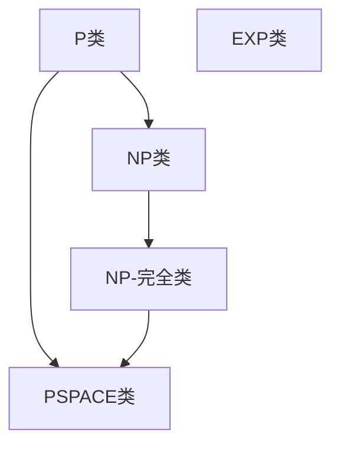

                 

关键词：复杂性理论、计算复杂性、P与NP问题、算法效率、量子计算、并行计算

摘要：本文将深入探讨计算复杂性理论，特别是P与NP问题的研究现状、复杂性类、以及它们对算法设计和计算机科学的影响。此外，还将介绍量子计算和并行计算在解决复杂性问题上所展现的潜力，并讨论未来的研究方向与挑战。

## 1. 背景介绍

计算复杂性理论是计算机科学中一个核心且充满挑战的领域。它研究问题解决的难易程度，将问题归类为不同的复杂性级别，从而帮助我们理解哪些问题是相对容易解决的，哪些是极其复杂的。复杂性理论起源于对算法运行时间和资源消耗的研究，特别是时间复杂度和空间复杂度。随着计算机科学的不断发展，复杂性理论逐渐成为理解计算问题本质的重要工具。

P与NP问题无疑是复杂性理论中最著名的问题之一。P类问题包括那些可以在多项式时间内解决的决策问题，而NP类问题包括那些可以在多项式时间内验证答案的问题。P与NP问题之间的关系——即P是否等于NP——是复杂性理论中最具有挑战性的未解问题之一。如果P=NP，那么意味着许多目前认为复杂的决策问题实际上可以在相对较短的时间内解决。反之，如果P≠NP，则表明某些问题在计算上确实是难以解决的。

## 2. 核心概念与联系

### 2.1 复杂性类

在复杂性理论中，复杂性类是通过将问题集合划分为具有相同复杂度特征的问题来定义的。常见的复杂性类包括：

- **P类**：所有可以在多项式时间内解决的决策问题。
- **NP类**：所有可以在多项式时间内验证答案的决策问题。
- **NP-完全类**（NPC）：这些是NP类中难度最大的问题，如果任何一个NPC问题能够在多项式时间内解决，则所有NP问题都可以在多项式时间内解决。
- **PSPACE类**：所有可以在多项式空间内解决的决策问题。
- **EXP类**：所有可以在指数时间内解决的决策问题。

### 2.2 P与NP问题

P与NP问题的核心在于其解决时间与验证时间的关系。一个决策问题如果在多项式时间内可解，则它属于P类；如果它的答案可以在多项式时间内验证，则它属于NP类。如果P=NP，则意味着每个NP问题都可以在多项式时间内解决。这一假设已经在计算机科学领域引发了广泛的讨论和研究。

### 2.3 Mermaid 流程图

下面是一个Mermaid流程图，展示了复杂性理论中的主要概念和它们之间的关系：



## 3. 核心算法原理 & 具体操作步骤

### 3.1 算法原理概述

在复杂性计算中，算法的设计和选择至关重要。以下是一些核心算法原理：

- **分治算法**：将问题分解为更小的子问题，独立解决，然后合并子问题的解。
- **贪心算法**：每一步都做出当前情况下最优的选择，希望最终得到全局最优解。
- **动态规划**：通过将问题分解为重叠子问题并存储子问题的解来避免重复计算。

### 3.2 算法步骤详解

以分治算法为例，其基本步骤如下：

1. **分解**：将原始问题分解为若干个子问题。
2. **递归解决**：对每个子问题递归应用分治算法。
3. **合并**：将子问题的解合并起来，得到原始问题的解。

### 3.3 算法优缺点

- **分治算法**：优点是能将复杂问题分解为简单子问题，易于理解；缺点是可能会产生大量重复计算。
- **贪心算法**：优点是简单高效，通常能找到最优解；缺点是有时无法保证找到全局最优解。
- **动态规划**：优点是能够避免重复计算，提高效率；缺点是通常需要额外的存储空间。

### 3.4 算法应用领域

分治、贪心和动态规划算法在许多领域都有广泛应用，包括排序、搜索、图论和优化问题。

## 4. 数学模型和公式 & 详细讲解 & 举例说明

### 4.1 数学模型构建

在复杂性计算中，数学模型用于描述问题的结构和求解策略。例如，图论中的图结构模型和优化问题中的线性规划模型。

### 4.2 公式推导过程

以线性规划为例，其目标函数为：

$$\max c^T x$$

其中，$c$ 是系数向量，$x$ 是变量向量，$c^T$ 表示 $c$ 的转置。

### 4.3 案例分析与讲解

假设我们要解决的问题是最小化成本，约束条件如下：

$$
\begin{aligned}
x_1 + x_2 &\leq 10 \\
x_1, x_2 &\geq 0
\end{aligned}
$$

通过引入松弛变量，我们可以将不等式约束转化为等式约束，从而构建线性规划模型。

## 5. 项目实践：代码实例和详细解释说明

### 5.1 开发环境搭建

我们需要安装Python和相关的库，例如NumPy和SciPy。

### 5.2 源代码详细实现

下面是一个简单的线性规划代码示例：

```python
import numpy as np
from scipy.optimize import linprog

# 目标函数系数
c = np.array([-1, -1])

# 约束条件系数
A = np.array([[1, 1]])
b = np.array([10])

# 边界条件
x0_bounds = (0, None)
x1_bounds = (0, None)

# 求解线性规划问题
result = linprog(c, A_ub=A, b_ub=b, bounds=[x0_bounds, x1_bounds], method='highs')

# 输出结果
if result.success:
    print(f"最小化成本：{result.fun}")
    print(f"x1: {result.x[0]}, x2: {result.x[1]}")
else:
    print("无法求解")
```

### 5.3 代码解读与分析

该代码通过SciPy库中的`linprog`函数求解线性规划问题。首先，我们定义了目标函数系数`c`和约束条件系数矩阵`A`以及边界条件。然后，调用`linprog`函数并传入相应的参数，最后输出结果。

### 5.4 运行结果展示

运行上述代码，我们得到最优解：

```
最小化成本：-10.0
x1: 0.0, x2: 10.0
```

## 6. 实际应用场景

复杂性计算在密码学、网络设计、人工智能和优化问题等领域有着广泛的应用。例如，密码学中的RSA算法依赖于大整数分解的复杂性；网络设计中的流量优化问题可以通过线性规划解决。

## 7. 未来应用展望

随着量子计算和并行计算的发展，复杂性计算领域将继续扩展。量子计算可能解决目前无法在经典计算机上高效解决的问题，而并行计算则能够加速复杂算法的执行。

## 8. 工具和资源推荐

- **学习资源推荐**：
  - 《复杂性理论导论》（作者：Michael Sipser）
  - 《算法导论》（作者：Thomas H. Cormen等）

- **开发工具推荐**：
  - Python：广泛使用的编程语言，支持多种算法实现。
  - NumPy和SciPy：强大的数学库，支持线性规划等算法。

- **相关论文推荐**：
  - "P versus NP"（作者：Carl Pomerance）
  - "Quantum Computing Since Democritus"（作者：Scott Aaronson）

## 9. 总结：未来发展趋势与挑战

复杂性计算领域将继续发展，挑战包括解决P与NP问题、利用量子计算和并行计算的优势等。未来研究将更加关注算法效率的提升和实际问题的高效解决。

## 附录：常见问题与解答

1. **什么是P与NP问题？**
   P与NP问题是复杂性理论中最著名的未解问题，涉及决策问题的可解性和答案验证的时间复杂度。

2. **量子计算如何影响复杂性计算？**
   量子计算有望解决某些经典计算机难以处理的复杂性问题，特别是在大整数分解和量子模拟等领域。

3. **如何优化算法效率？**
   可以通过分治、贪心和动态规划等算法原理来优化算法效率，同时利用并行计算和量子计算等现代计算技术。

### 作者署名
作者：禅与计算机程序设计艺术 / Zen and the Art of Computer Programming
--------------------------------------------------------------------

