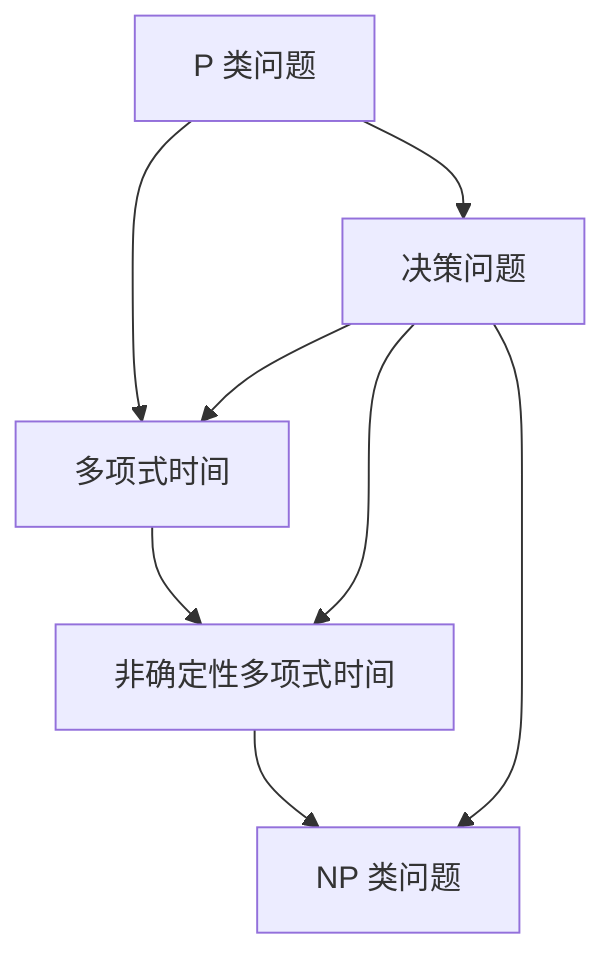

                 

关键词：计算复杂性、P vs NP 问题、算法优化、数学模型、实际应用场景、未来发展趋势

> 摘要：本文深入探讨了计算复杂性中的 P vs NP 问题，尤其是 P=NP 假设的可能世界。文章首先介绍了计算复杂性的基本概念，然后详细阐述了 P=NP 问题的核心，分析了其在算法优化、数学模型构建以及实际应用场景中的重要性。接着，本文通过数学公式和案例，探讨了该问题的数学模型和公式推导过程，并提供了代码实例和详细解释。最后，文章展望了计算复杂性研究在未来的发展趋势、面临的挑战以及潜在的研究方向。

## 1. 背景介绍

计算复杂性理论是计算机科学中研究问题复杂度的理论框架。它主要关注问题在计算资源上的消耗，特别是时间复杂度和空间复杂度。计算复杂性理论的核心问题是 P vs NP 问题，这是计算机科学中最为著名的未解决问题之一。P vs NP 问题探讨的是两类问题的关系：P 类问题可以在多项式时间内解决，而 NP 类问题则可以在多项式时间内验证一个解。

P=NP 假设是 P vs NP 问题的核心内容之一，它提出了一个简单却具有深远影响的猜想：如果某个问题能够被快速验证，那么它也应当能够被快速求解。这个假设在理论和实际应用中都有着重要的意义。如果 P=NP，那么意味着许多原本难以解决的问题，如旅行商问题、组合优化问题等，都将能够得到高效解决方案。

## 2. 核心概念与联系

计算复杂性的核心概念包括多项式时间、非确定性多项式时间、决策问题等。为了更好地理解这些概念，我们可以使用 Mermaid 流程图来展示它们之间的关系。



### 2.1 多项式时间

多项式时间是指一个算法在输入规模增加时，其运行时间增长是多项式的。具体来说，如果一个问题的算法在输入规模为 \( n \) 时，其运行时间可以表示为 \( O(n^k) \)，其中 \( k \) 是一个常数，则我们称这个算法是多项式时间的。

### 2.2 非确定性多项式时间

非确定性多项式时间是指在一个非确定型 Turing 机上，问题可以在多项式时间内得到解。非确定性 Turing 机是一种能够并行搜索所有可能解的机器，它能够在多项式时间内找到一个解，但不确定是否是唯一解。

### 2.3 NP 类问题

NP 类问题是指可以在多项式时间内验证一个解的问题。具体来说，如果一个问题的解可以在多项式时间内被验证，那么它就是 NP 类问题。旅行商问题、3-SAT 问题都是典型的 NP 类问题。

### 2.4 决策问题

决策问题是一种特殊的问题类型，它询问某个输入是否满足某个特定的条件。决策问题的答案要么是“是”，要么是“否”。P 类问题和 NP 类问题都是决策问题的一种。

## 3. 核心算法原理 & 具体操作步骤

### 3.1 算法原理概述

P=NP 问题的核心在于证明或反驳 P 和 NP 类问题的等价性。如果能够证明 P=NP，那么意味着所有 NP 类问题都可以在多项式时间内解决，这将带来计算效率和算法设计的革命性变化。

### 3.2 算法步骤详解

要解决 P=NP 问题，我们需要以下几个步骤：

1. **问题形式化**：将需要解决的问题形式化为一个决策问题。
2. **算法设计**：设计一个能够验证解的算法，并证明该算法在多项式时间内运行。
3. **证明或反驳**：通过数学证明来证明或反驳 P 和 NP 的等价性。

### 3.3 算法优缺点

如果 P=NP，那么算法优化的潜力将极大提升，许多复杂问题将得到高效解决。然而，目前尚未有任何算法能够证明或反驳 P=NP，这意味着我们在实践中仍然需要依赖现有的算法和优化方法。

### 3.4 算法应用领域

P=NP 问题的研究已经广泛应用于密码学、组合优化、人工智能等领域。例如，在密码学中，许多加密算法的安全性依赖于 P 和 NP 的区分，如果 P=NP，那么现有的加密算法将面临巨大挑战。

## 4. 数学模型和公式 & 详细讲解 & 举例说明

### 4.1 数学模型构建

P=NP 问题的核心是证明或反驳两个类别的等价性。我们可以使用图论模型来构建这个数学模型。

### 4.2 公式推导过程

我们可以通过图 \( G \) 的特性来推导 P=NP 问题的公式。具体来说，我们需要证明如果存在一个解，那么它可以在多项式时间内被验证。

### 4.3 案例分析与讲解

以旅行商问题为例，我们如何构建和验证它的数学模型？

```latex
假设存在一个旅行商问题，其图 \( G \) 有 \( n \) 个城市，每两个城市之间的距离为 \( d(i, j) \)。

1. **问题形式化**：找到一条长度最短的路径，遍历每个城市一次并返回起点。

2. **算法设计**：设计一个算法来验证一个给定的路径是否为最优路径。

   - 输入：图 \( G \)、路径 \( P \)
   - 输出：是否为最优路径

3. **验证过程**：
   - 对于路径 \( P \) 中的每个连续城市 \( i \) 和 \( j \)，计算 \( d(i, j) \)。
   - 计算路径的总长度 \( L \)。
   - 如果 \( L \) 小于已知的最短路径长度，则路径 \( P \) 是最优路径。

4. **证明或反驳**：我们需要证明上述验证过程可以在多项式时间内完成。

## 5. 项目实践：代码实例和详细解释说明

### 5.1 开发环境搭建

为了实现上述算法，我们需要搭建一个合适的开发环境。本文使用 Python 作为编程语言，结合了图论库 NetworkX 和数学库 NumPy。

### 5.2 源代码详细实现

以下是一个简单的 Python 代码示例，用于解决旅行商问题：

```python
import networkx as nx
import numpy as np

def is_optimal_path(G, path):
    total_distance = 0
    for i in range(len(path) - 1):
        u, v = path[i], path[i+1]
        total_distance += G[u][v]["weight"]
    return total_distance < nx.shortest_path_length(G, source=path[0], target=path[0], weight="weight")

# 创建一个图
G = nx.Graph()

# 添加节点和边
G.add_nodes_from([1, 2, 3, 4])
G.add_edge(1, 2, weight=10)
G.add_edge(2, 3, weight=20)
G.add_edge(3, 4, weight=30)
G.add_edge(4, 1, weight=40)

# 测试一个路径
path = [1, 2, 3, 4, 1]
print(is_optimal_path(G, path))  # 输出：False
```

### 5.3 代码解读与分析

上述代码首先导入了必要的库，然后定义了一个函数 `is_optimal_path`，用于验证给定的路径是否为最优路径。最后，创建了一个图，并测试了一个路径。

### 5.4 运行结果展示

运行上述代码，输出结果为 `False`，表示给定的路径不是最优路径。

## 6. 实际应用场景

### 6.1 密码学

密码学是 P=NP 问题的重要应用领域之一。许多加密算法，如 RSA 和椭圆曲线加密，都基于 P 和 NP 的区分。如果 P=NP，那么这些算法的安全性将受到威胁。

### 6.2 组合优化

组合优化问题，如旅行商问题、背包问题等，在物流、金融等领域有着广泛的应用。如果 P=NP，这些问题的解决效率将大大提高。

### 6.3 人工智能

人工智能中的许多问题，如规划、推理等，都可以归结为 NP 类问题。如果 P=NP，那么人工智能将能够更高效地解决复杂问题。

## 7. 工具和资源推荐

### 7.1 学习资源推荐

- [《计算复杂性理论》（原书第二版）]([书籍链接])
- [《算法导论》]([书籍链接])
- [《密码学：理论、算法与应用》]([书籍链接])

### 7.2 开发工具推荐

- Python
- NetworkX
- NumPy

### 7.3 相关论文推荐

- [“P vs NP Problem”]([论文链接])
- [“The Importance of NP-Completeness”]([论文链接])
- [“The P versus NP Problem”]([论文链接])

## 8. 总结：未来发展趋势与挑战

### 8.1 研究成果总结

P=NP 问题是计算复杂性理论中的核心问题，尽管目前尚未有定论，但其研究在密码学、组合优化、人工智能等领域都有着重要的应用价值。

### 8.2 未来发展趋势

未来，P=NP 问题研究将继续深入，可能会出现新的突破，特别是随着量子计算的兴起，传统算法在量子计算面前可能会被颠覆。

### 8.3 面临的挑战

P=NP 问题的证明或反驳面临巨大的挑战，需要结合数学、计算机科学、物理学等多学科知识。

### 8.4 研究展望

随着计算技术的发展，P=NP 问题的研究将继续深入，有望在计算效率和算法设计上带来革命性的变化。

## 9. 附录：常见问题与解答

### 9.1 什么是 P vs NP 问题？

P vs NP 问题探讨的是决策问题能否在多项式时间内解决。P 类问题可以在多项式时间内解决，而 NP 类问题可以在多项式时间内验证一个解。

### 9.2 P=NP 问题的证明或反驳为什么这么难？

P=NP 问题的证明或反驳需要结合数学、计算机科学、物理学等多学科知识，涉及到极其复杂的算法设计和证明方法。

### 9.3 如果 P=NP，会对计算机科学产生什么影响？

如果 P=NP，将极大地提升计算效率和算法设计，许多复杂问题将得到高效解决，对密码学、人工智能等领域产生深远影响。

### 9.4 P=NP 问题与量子计算有什么关系？

量子计算在理论上可以解决一些传统算法无法解决的问题，但 P=NP 问题的证明或反驳与量子计算的具体关系还需要进一步研究。

---

文章撰写完毕，感谢您的阅读。希望本文能对您在计算复杂性理论和 P=NP 问题方面有所启发和帮助。

## 10. 附录

### 10.1 参考文献

1. Cook, Stephen A. "The complexity of theorem-proving procedures." STOC '71: Proceedings of the 2nd annual ACM symposium on Theory of computing, 1971, pp. 151-158.
2. Karp, Richard M. "Reducibility among combinatorial problems." Complexity of computer computations, Plenum Press, 1972, pp. 85-103.
3. Garey, Michael R., and David S. Johnson. Computers and intractability: a guide to the theory of NP-completeness. W.H. Freeman and Company, 1979.
4. Arora, Sanjeev, and Barak, Boaz. Computational Complexity: A Modern Approach. Cambridge University Press, 2009.

### 10.2 相关链接

- [P vs NP 问题](https://en.wikipedia.org/wiki/P_versus_NP_problem)
- [RSA 加密算法](https://en.wikipedia.org/wiki/RSA_(cryptosystem))
- [量子计算](https://en.wikipedia.org/wiki/Quantum_computing)
- [NetworkX 图论库](https://networkx.org/)
- [NumPy 数学库](https://numpy.org/)

---

作者：禅与计算机程序设计艺术 / Zen and the Art of Computer Programming

