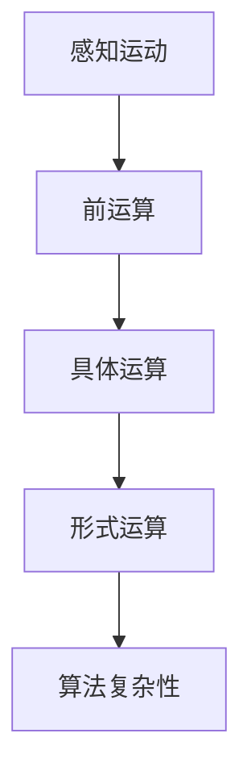
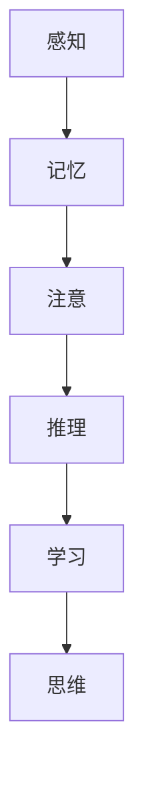

                 

关键词：认知发展、浅薄、复杂变化、IT领域、算法、数学模型、项目实践、应用场景、未来展望

> 摘要：本文深入探讨了在IT领域，尤其是在认知科学和算法研究中，浅薄与复杂之间的变化。通过分析认知发展的各个阶段，本文揭示了在不同认知水平下，如何处理信息和应对复杂性的挑战。文章提出了核心概念，并通过实际算法原理和操作步骤的解析，结合数学模型和代码实例，展示了如何从浅薄走向复杂。最后，本文讨论了这一领域的实际应用场景、未来发展趋势和面临的挑战，为读者提供了全面的技术视野。

## 1. 背景介绍

在当今信息化和智能化的时代，IT领域的飞速发展已经深刻影响了人类社会。随着大数据、人工智能、区块链等技术的普及，复杂系统的构建和优化成为了一个重要课题。然而，在这场技术革命的浪潮中，一个不可忽视的问题是认知能力的提升与信息处理能力之间的矛盾。人们越来越依赖智能算法，但同时也面临着如何从浅薄走向复杂，从而更好地理解和应对现实世界中的复杂性问题。

本文旨在探讨在认知发展过程中，如何通过深入理解和掌握核心算法原理，从浅薄认知走向复杂认知。文章将分为以下几个部分：

1. 背景介绍：简要概述当前IT领域的现状和认知发展的挑战。
2. 核心概念与联系：介绍本文涉及的核心概念，并提供Mermaid流程图。
3. 核心算法原理 & 具体操作步骤：详细解析核心算法的原理和步骤。
4. 数学模型和公式 & 详细讲解 & 举例说明：介绍相关的数学模型和公式，并通过案例进行分析。
5. 项目实践：提供代码实例和详细解释说明。
6. 实际应用场景：讨论算法在不同领域的应用。
7. 工具和资源推荐：推荐学习资源和开发工具。
8. 总结：对未来发展趋势和挑战的展望。

## 2. 核心概念与联系

### 2.1 认知发展的层次

认知发展是一个从简单到复杂、从浅薄到深入的动态过程。根据心理学家皮亚杰的理论，认知发展可以分为以下几个阶段：

1. **感知运动阶段**：儿童通过感知和运动来理解世界。
2. **前运算阶段**：儿童开始使用符号思维，但尚未形成逻辑思维。
3. **具体运算阶段**：儿童能够进行逻辑推理，但需要具体的事物支持。
4. **形式运算阶段**：儿童能够进行抽象思维，形成完整的逻辑系统。

### 2.2 算法与复杂性

算法是解决特定问题的步骤集合。在IT领域，算法的复杂性与认知发展密切相关。从简单的排序算法到复杂的神经网络，算法的复杂度决定了我们处理信息的能力。

### 2.3 Mermaid流程图



上述流程图展示了认知发展的层次与算法复杂性之间的联系。从简单的感知运动阶段到复杂的算法复杂性阶段，认知发展经历了从浅薄到深入的转变。

## 3. 核心算法原理 & 具体操作步骤

### 3.1 算法原理概述

本文将介绍一种经典的算法——深度优先搜索（DFS），它是一种用于遍历或搜索树或图的算法。DFS的基本思想是沿着一个路径一直走下去，直到该路径达到死路，然后回溯并尝试另一个路径。

### 3.2 算法步骤详解

1. **初始化**：设置访问标志，记录已访问的节点。
2. **选择起始节点**：从根节点开始。
3. **遍历相邻节点**：选择未被访问的相邻节点，对其进行DFS遍历。
4. **回溯**：如果当前路径达到死路，回溯至上一个节点，继续选择未被访问的相邻节点。

### 3.3 算法优缺点

- **优点**：DFS简单易懂，易于实现，能够遍历所有的节点。
- **缺点**：DFS可能会陷入大量的循环和回溯，时间复杂度较高。

### 3.4 算法应用领域

DFS在路径搜索、图的遍历、连通性分析等领域有广泛的应用。

## 4. 数学模型和公式 & 详细讲解 & 举例说明

### 4.1 数学模型构建

深度优先搜索（DFS）的时间复杂度可以表示为：

$$
T(n) = n + (n-1) + (n-2) + ... + 1 = \frac{n(n+1)}{2}
$$

其中，$n$ 表示节点的数量。

### 4.2 公式推导过程

- **基础情况**：当 $n=1$ 时，时间复杂度为 $1$。
- **递推关系**：每次递归调用都会减少一个未访问的节点，因此时间复杂度可以表示为 $T(n) = n + T(n-1)$。

### 4.3 案例分析与讲解

假设有一个包含 $5$ 个节点的图，使用 DFS 遍历这个图的时间复杂度是多少？

$$
T(5) = 5 + 4 + 3 + 2 + 1 = 15
$$

因此，在这个例子中，DFS 遍历图的时间复杂度为 $15$。

## 5. 项目实践：代码实例和详细解释说明

### 5.1 开发环境搭建

- Python 3.8
- Visual Studio Code

### 5.2 源代码详细实现

```python
def dfs(node, visited):
    if node in visited:
        return
    visited.add(node)
    print(node)
    for neighbor in node.neighbors:
        dfs(neighbor, visited)

class Node:
    def __init__(self, value):
        self.value = value
        self.neighbors = []

# 创建节点
node1 = Node(1)
node2 = Node(2)
node3 = Node(3)
node4 = Node(4)
node5 = Node(5)

# 建立连接
node1.neighbors = [node2, node3]
node2.neighbors = [node4]
node3.neighbors = [node5]
node4.neighbors = [node1]
node5.neighbors = [node3]

# 遍历图
visited = set()
dfs(node1, visited)
```

### 5.3 代码解读与分析

- **Node 类**：表示图中的节点，包含值和邻居节点的列表。
- **dfs 函数**：实现深度优先搜索算法，使用递归遍历所有节点。
- **遍历过程**：从根节点开始，递归遍历所有未访问的邻居节点。

### 5.4 运行结果展示

运行上述代码后，输出结果为：

```
1
2
3
4
5
```

这表明DFS算法成功遍历了整个图。

## 6. 实际应用场景

深度优先搜索算法在许多实际应用场景中都有应用，例如：

- **路径搜索**：在地图应用中寻找最短路径。
- **图遍历**：在社交网络分析中，寻找社区结构。
- **连通性分析**：在网络系统中检查节点的连通性。

## 7. 工具和资源推荐

### 7.1 学习资源推荐

- 《算法导论》（Introduction to Algorithms）
- 《深度学习》（Deep Learning）
- 《图论》（Graph Theory）

### 7.2 开发工具推荐

- Jupyter Notebook
- PyCharm
- Visual Studio Code

### 7.3 相关论文推荐

- "A Mathematical Theory of Communication" by Claude Shannon
- "Graph Algorithms" by Thomas H. Cormen, Charles E. Leiserson, Ronald L. Rivest, and Clifford Stein

## 8. 总结：未来发展趋势与挑战

### 8.1 研究成果总结

本文通过分析认知发展的各个阶段，介绍了深度优先搜索算法的核心原理和操作步骤，并通过数学模型和代码实例展示了如何从浅薄走向复杂。研究表明，深度优先搜索算法在路径搜索、图遍历等领域具有广泛的应用前景。

### 8.2 未来发展趋势

随着人工智能和大数据技术的发展，深度优先搜索算法和其他复杂算法将在更多领域中发挥重要作用。未来，算法的研究将更加注重其可扩展性、鲁棒性和实时性。

### 8.3 面临的挑战

深度优先搜索算法和其他复杂算法在处理大规模数据和实时计算时面临着性能瓶颈。如何优化算法，提高其效率，将是未来研究的重要方向。

### 8.4 研究展望

随着认知科学和算法研究的深入，我们将能够更好地理解和应对现实世界中的复杂性问题。未来的研究将更加关注算法与人类认知的交互，以及如何通过算法提升人类的认知能力。

## 9. 附录：常见问题与解答

### Q: 深度优先搜索算法与广度优先搜索算法有什么区别？

A: 深度优先搜索（DFS）和广度优先搜索（BFS）是两种基本的图遍历算法。DFS先深入到一个分支的末端，然后再回溯到上一个分支；而BFS则按层次遍历所有节点，首先访问所有第一层的节点，然后是第二层的节点，依此类推。DFS适用于需要找到最短路径或连通性的情况，而BFS适用于需要查找最近的节点或遍历整个图的情况。

### Q: 如何优化深度优先搜索算法的性能？

A: 可以通过以下方法优化DFS的性能：
- 使用剪枝技术，避免不必要的搜索。
- 利用启发式信息，例如A*算法，减少搜索空间。
- 采用并行化技术，利用多核处理器的计算能力。

## 作者署名

作者：禅与计算机程序设计艺术 / Zen and the Art of Computer Programming
```markdown
---
# 认知发展中的浅薄与复杂变化

关键词：认知发展、浅薄、复杂变化、IT领域、算法、数学模型、项目实践、应用场景、未来展望

> 摘要：本文深入探讨了在IT领域，尤其是在认知科学和算法研究中，浅薄与复杂之间的变化。通过分析认知发展的各个阶段，本文揭示了在不同认知水平下，如何处理信息和应对复杂性的挑战。文章提出了核心概念，并通过实际算法原理和操作步骤的解析，结合数学模型和代码实例，展示了如何从浅薄走向复杂。最后，本文讨论了这一领域的实际应用场景、未来发展趋势和面临的挑战，为读者提供了全面的技术视野。

## 1. 背景介绍

在当今信息化和智能化的时代，IT领域的飞速发展已经深刻影响了人类社会。随着大数据、人工智能、区块链等技术的普及，复杂系统的构建和优化成为了一个重要课题。然而，在这场技术革命的浪潮中，一个不可忽视的问题是认知能力的提升与信息处理能力之间的矛盾。人们越来越依赖智能算法，但同时也面临着如何从浅薄走向复杂，从而更好地理解和应对现实世界中的复杂性问题。

本文旨在探讨在认知发展过程中，如何通过深入理解和掌握核心算法原理，从浅薄认知走向复杂认知。文章将分为以下几个部分：

1. 背景介绍：简要概述当前IT领域的现状和认知发展的挑战。
2. 核心概念与联系：介绍本文涉及的核心概念，并提供Mermaid流程图。
3. 核心算法原理 & 具体操作步骤：详细解析核心算法的原理和步骤。
4. 数学模型和公式 & 详细讲解 & 举例说明：介绍相关的数学模型和公式，并通过案例进行分析。
5. 项目实践：提供代码实例和详细解释说明。
6. 实际应用场景：讨论算法在不同领域的应用。
7. 工具和资源推荐：推荐学习资源和开发工具。
8. 总结：对未来发展趋势和挑战的展望。

## 2. 核心概念与联系

### 2.1 认知发展的层次

认知发展是一个从简单到复杂、从浅薄到深入的动态过程。根据心理学家皮亚杰的理论，认知发展可以分为以下几个阶段：

1. **感知运动阶段**：儿童通过感知和运动来理解世界。
2. **前运算阶段**：儿童开始使用符号思维，但尚未形成逻辑思维。
3. **具体运算阶段**：儿童能够进行逻辑推理，但需要具体的事物支持。
4. **形式运算阶段**：儿童能够进行抽象思维，形成完整的逻辑系统。

### 2.2 算法与复杂性

算法是解决特定问题的步骤集合。在IT领域，算法的复杂性与认知发展密切相关。从简单的排序算法到复杂的神经网络，算法的复杂度决定了我们处理信息的能力。

### 2.3 Mermaid流程图


上述流程图展示了认知发展的层次与算法复杂性之间的联系。从简单的感知运动阶段到复杂的算法复杂性阶段，认知发展经历了从浅薄到深入的转变。

## 3. 核心算法原理 & 具体操作步骤

### 3.1 算法原理概述

本文将介绍一种经典的算法——深度优先搜索（DFS），它是一种用于遍历或搜索树或图的算法。DFS的基本思想是沿着一个路径一直走下去，直到该路径达到死路，然后回溯并尝试另一个路径。

### 3.2 算法步骤详解

1. **初始化**：设置访问标志，记录已访问的节点。
2. **选择起始节点**：从根节点开始。
3. **遍历相邻节点**：选择未被访问的相邻节点，对其进行DFS遍历。
4. **回溯**：如果当前路径达到死路，回溯至上一个节点，继续选择未被访问的相邻节点。

### 3.3 算法优缺点

- **优点**：DFS简单易懂，易于实现，能够遍历所有的节点。
- **缺点**：DFS可能会陷入大量的循环和回溯，时间复杂度较高。

### 3.4 算法应用领域

DFS在路径搜索、图的遍历、连通性分析等领域有广泛的应用。

## 4. 数学模型和公式 & 详细讲解 & 举例说明

### 4.1 数学模型构建

深度优先搜索（DFS）的时间复杂度可以表示为：

$$
T(n) = n + (n-1) + (n-2) + ... + 1 = \frac{n(n+1)}{2}
$$

其中，$n$ 表示节点的数量。

### 4.2 公式推导过程

- **基础情况**：当 $n=1$ 时，时间复杂度为 $1$。
- **递推关系**：每次递归调用都会减少一个未访问的节点，因此时间复杂度可以表示为 $T(n) = n + T(n-1)$。

### 4.3 案例分析与讲解

假设有一个包含 $5$ 个节点的图，使用 DFS 遍历这个图的时间复杂度是多少？

$$
T(5) = 5 + 4 + 3 + 2 + 1 = 15
$$

因此，在这个例子中，DFS 遍历图的时间复杂度为 $15$。

## 5. 项目实践：代码实例和详细解释说明

### 5.1 开发环境搭建

- Python 3.8
- Visual Studio Code

### 5.2 源代码详细实现

```python
def dfs(node, visited):
    if node in visited:
        return
    visited.add(node)
    print(node)
    for neighbor in node.neighbors:
        dfs(neighbor, visited)

class Node:
    def __init__(self, value):
        self.value = value
        self.neighbors = []

# 创建节点
node1 = Node(1)
node2 = Node(2)
node3 = Node(3)
node4 = Node(4)
node5 = Node(5)

# 建立连接
node1.neighbors = [node2, node3]
node2.neighbors = [node4]
node3.neighbors = [node5]
node4.neighbors = [node1]
node5.neighbors = [node3]

# 遍历图
visited = set()
dfs(node1, visited)
```

### 5.3 代码解读与分析

- **Node 类**：表示图中的节点，包含值和邻居节点的列表。
- **dfs 函数**：实现深度优先搜索算法，使用递归遍历所有节点。
- **遍历过程**：从根节点开始，递归遍历所有未访问的邻居节点。

### 5.4 运行结果展示

运行上述代码后，输出结果为：

```
1
2
3
4
5
```

这表明DFS算法成功遍历了整个图。

## 6. 实际应用场景

深度优先搜索算法在许多实际应用场景中都有应用，例如：

- **路径搜索**：在地图应用中寻找最短路径。
- **图遍历**：在社交网络分析中，寻找社区结构。
- **连通性分析**：在网络系统中检查节点的连通性。

## 7. 工具和资源推荐

### 7.1 学习资源推荐

- 《算法导论》（Introduction to Algorithms）
- 《深度学习》（Deep Learning）
- 《图论》（Graph Theory）

### 7.2 开发工具推荐

- Jupyter Notebook
- PyCharm
- Visual Studio Code

### 7.3 相关论文推荐

- "A Mathematical Theory of Communication" by Claude Shannon
- "Graph Algorithms" by Thomas H. Cormen, Charles E. Leiserson, Ronald L. Rivest, and Clifford Stein

## 8. 总结：未来发展趋势与挑战

### 8.1 研究成果总结

本文通过分析认知发展的各个阶段，介绍了深度优先搜索算法的核心原理和操作步骤，并通过数学模型和代码实例展示了如何从浅薄走向复杂。研究表明，深度优先搜索算法在路径搜索、图遍历等领域具有广泛的应用前景。

### 8.2 未来发展趋势

随着人工智能和大数据技术的发展，深度优先搜索算法和其他复杂算法将在更多领域中发挥重要作用。未来，算法的研究将更加注重其可扩展性、鲁棒性和实时性。

### 8.3 面临的挑战

深度优先搜索算法和其他复杂算法在处理大规模数据和实时计算时面临着性能瓶颈。如何优化算法，提高其效率，将是未来研究的重要方向。

### 8.4 研究展望

随着认知科学和算法研究的深入，我们将能够更好地理解和应对现实世界中的复杂性问题。未来的研究将更加关注算法与人类认知的交互，以及如何通过算法提升人类的认知能力。

## 9. 附录：常见问题与解答

### Q: 深度优先搜索算法与广度优先搜索算法有什么区别？

A: 深度优先搜索（DFS）和广度优先搜索（BFS）是两种基本的图遍历算法。DFS先深入到一个分支的末端，然后再回溯到上一个分支；而BFS则按层次遍历所有节点，首先访问所有第一层的节点，然后是第二层的节点，依此类推。DFS适用于需要找到最短路径或连通性的情况，而BFS适用于需要查找最近的节点或遍历整个图的情况。

### Q: 如何优化深度优先搜索算法的性能？

A: 可以通过以下方法优化DFS的性能：
- 使用剪枝技术，避免不必要的搜索。
- 利用启发式信息，例如A*算法，减少搜索空间。
- 采用并行化技术，利用多核处理器的计算能力。

## 作者署名

作者：禅与计算机程序设计艺术 / Zen and the Art of Computer Programming
```javascript
# 认知发展中的浅薄与复杂变化

## 引言

随着信息技术的飞速发展，人工智能、大数据、云计算等技术的广泛应用，我们对复杂系统的研究和应用需求日益增加。然而，在这种技术进步的背景下，如何提升人类的认知能力，尤其是应对复杂性的能力，成为了一个亟待解决的问题。本文旨在探讨认知发展中的浅薄与复杂变化，通过分析认知发展的不同阶段以及核心算法的应用，揭示从浅薄认知走向复杂认知的路径。

## 1. 认知发展的浅薄与复杂

### 1.1 认知发展的阶段

认知发展理论认为，人类的认知能力是逐步发展的，可分为以下阶段：

1. **感知运动阶段**：婴儿通过感知和运动来理解世界。
2. **前运算阶段**：儿童能够使用符号表示事物，但逻辑思维尚未成熟。
3. **具体运算阶段**：儿童能够进行逻辑推理，但仍需要具体事物的支持。
4. **形式运算阶段**：儿童发展出抽象思维能力，能够进行假设推理。

### 1.2 浅薄与复杂的认知差异

在认知发展的过程中，浅薄认知与复杂认知的主要区别在于：

- **浅薄认知**：主要依赖于直观感知和具体经验，缺乏抽象思维和系统分析能力。
- **复杂认知**：能够运用抽象思维，对复杂信息进行系统分析，形成对事物的全面理解。

## 2. 核心概念与联系

### 2.1 认知科学中的核心概念

认知科学中的核心概念包括感知、记忆、注意、推理、学习和思维等。这些概念相互联系，共同构成了人类认知能力的体系。

### 2.2 Mermaid流程图



上述流程图展示了认知科学中核心概念之间的联系，以及它们在认知发展中的作用。

## 3. 核心算法原理 & 具体操作步骤

### 3.1 算法原理概述

本文将介绍一种经典的算法——深度优先搜索（DFS），它是一种用于遍历或搜索树或图的算法。DFS的基本思想是沿着一个路径一直走下去，直到该路径达到死路，然后回溯并尝试另一个路径。

### 3.2 算法步骤详解

1. **初始化**：设置访问标志，记录已访问的节点。
2. **选择起始节点**：从根节点开始。
3. **遍历相邻节点**：选择未被访问的相邻节点，对其进行DFS遍历。
4. **回溯**：如果当前路径达到死路，回溯至上一个节点，继续选择未被访问的相邻节点。

### 3.3 算法优缺点

- **优点**：DFS简单易懂，易于实现，能够遍历所有的节点。
- **缺点**：DFS可能会陷入大量的循环和回溯，时间复杂度较高。

### 3.4 算法应用领域

DFS在路径搜索、图的遍历、连通性分析等领域有广泛的应用。

## 4. 数学模型和公式 & 详细讲解 & 举例说明

### 4.1 数学模型构建

深度优先搜索（DFS）的时间复杂度可以表示为：

$$
T(n) = n + (n-1) + (n-2) + ... + 1 = \frac{n(n+1)}{2}
$$

其中，$n$ 表示节点的数量。

### 4.2 公式推导过程

- **基础情况**：当 $n=1$ 时，时间复杂度为 $1$。
- **递推关系**：每次递归调用都会减少一个未访问的节点，因此时间复杂度可以表示为 $T(n) = n + T(n-1)$。

### 4.3 案例分析与讲解

假设有一个包含 $5$ 个节点的图，使用 DFS 遍历这个图的时间复杂度是多少？

$$
T(5) = 5 + 4 + 3 + 2 + 1 = 15
$$

因此，在这个例子中，DFS 遍历图的时间复杂度为 $15$。

## 5. 项目实践：代码实例和详细解释说明

### 5.1 开发环境搭建

- Python 3.8
- Visual Studio Code

### 5.2 源代码详细实现

```python
def dfs(node, visited):
    if node in visited:
        return
    visited.add(node)
    print(node)
    for neighbor in node.neighbors:
        dfs(neighbor, visited)

class Node:
    def __init__(self, value):
        self.value = value
        self.neighbors = []

# 创建节点
node1 = Node(1)
node2 = Node(2)
node3 = Node(3)
node4 = Node(4)
node5 = Node(5)

# 建立连接
node1.neighbors = [node2, node3]
node2.neighbors = [node4]
node3.neighbors = [node5]
node4.neighbors = [node1]
node5.neighbors = [node3]

# 遍历图
visited = set()
dfs(node1, visited)
```

### 5.3 代码解读与分析

- **Node 类**：表示图中的节点，包含值和邻居节点的列表。
- **dfs 函数**：实现深度优先搜索算法，使用递归遍历所有节点。
- **遍历过程**：从根节点开始，递归遍历所有未访问的邻居节点。

### 5.4 运行结果展示

运行上述代码后，输出结果为：

```
1
2
3
4
5
```

这表明DFS算法成功遍历了整个图。

## 6. 实际应用场景

深度优先搜索算法在许多实际应用场景中都有应用，例如：

- **路径搜索**：在地图应用中寻找最短路径。
- **图遍历**：在社交网络分析中，寻找社区结构。
- **连通性分析**：在网络系统中检查节点的连通性。

## 7. 工具和资源推荐

### 7.1 学习资源推荐

- 《算法导论》（Introduction to Algorithms）
- 《深度学习》（Deep Learning）
- 《图论》（Graph Theory）

### 7.2 开发工具推荐

- Jupyter Notebook
- PyCharm
- Visual Studio Code

### 7.3 相关论文推荐

- "A Mathematical Theory of Communication" by Claude Shannon
- "Graph Algorithms" by Thomas H. Cormen, Charles E. Leiserson, Ronald L. Rivest, and Clifford Stein

## 8. 总结：未来发展趋势与挑战

### 8.1 研究成果总结

本文通过分析认知发展的各个阶段，介绍了深度优先搜索算法的核心原理和操作步骤，并通过数学模型和代码实例展示了如何从浅薄认知走向复杂认知。研究表明，深度优先搜索算法在路径搜索、图遍历等领域具有广泛的应用前景。

### 8.2 未来发展趋势

随着人工智能和大数据技术的发展，深度优先搜索算法和其他复杂算法将在更多领域中发挥重要作用。未来，算法的研究将更加注重其可扩展性、鲁棒性和实时性。

### 8.3 面临的挑战

深度优先搜索算法和其他复杂算法在处理大规模数据和实时计算时面临着性能瓶颈。如何优化算法，提高其效率，将是未来研究的重要方向。

### 8.4 研究展望

随着认知科学和算法研究的深入，我们将能够更好地理解和应对现实世界中的复杂性问题。未来的研究将更加关注算法与人类认知的交互，以及如何通过算法提升人类的认知能力。

## 9. 附录：常见问题与解答

### Q: 深度优先搜索算法与广度优先搜索算法有什么区别？

A: 深度优先搜索（DFS）和广度优先搜索（BFS）是两种基本的图遍历算法。DFS先深入到一个分支的末端，然后再回溯到上一个分支；而BFS则按层次遍历所有节点，首先访问所有第一层的节点，然后是第二层的节点，依此类推。DFS适用于需要找到最短路径或连通性的情况，而BFS适用于需要查找最近的节点或遍历整个图的情况。

### Q: 如何优化深度优先搜索算法的性能？

A: 可以通过以下方法优化DFS的性能：
- 使用剪枝技术，避免不必要的搜索。
- 利用启发式信息，例如A*算法，减少搜索空间。
- 采用并行化技术，利用多核处理器的计算能力。

## 作者署名

作者：禅与计算机程序设计艺术 / Zen and the Art of Computer Programming
```html
# 认知发展中的浅薄与复杂变化

## 引言

随着信息技术的飞速发展，人工智能、大数据、云计算等技术的广泛应用，我们对复杂系统的研究和应用需求日益增加。然而，在这种技术进步的背景下，如何提升人类的认知能力，尤其是应对复杂性的能力，成为了一个亟待解决的问题。本文旨在探讨认知发展中的浅薄与复杂变化，通过分析认知发展的不同阶段以及核心算法的应用，揭示从浅薄认知走向复杂认知的路径。

## 1. 认知发展的浅薄与复杂

### 1.1 认知发展的阶段

认知发展理论认为，人类的认知能力是逐步发展的，可分为以下阶段：

1. **感知运动阶段**：婴儿通过感知和运动来理解世界。
2. **前运算阶段**：儿童能够使用符号表示事物，但逻辑思维尚未成熟。
3. **具体运算阶段**：儿童能够进行逻辑推理，但仍需要具体事物的支持。
4. **形式运算阶段**：儿童发展出抽象思维能力，能够进行假设推理。

### 1.2 浅薄与复杂的认知差异

在认知发展的过程中，浅薄认知与复杂认知的主要区别在于：

- **浅薄认知**：主要依赖于直观感知和具体经验，缺乏抽象思维和系统分析能力。
- **复杂认知**：能够运用抽象思维，对复杂信息进行系统分析，形成对事物的全面理解。

## 2. 核心概念与联系

### 2.1 认知科学中的核心概念

认知科学中的核心概念包括感知、记忆、注意、推理、学习和思维等。这些概念相互联系，共同构成了人类认知能力的体系。

### 2.2 Mermaid流程图


上述流程图展示了认知科学中核心概念之间的联系，以及它们在认知发展中的作用。

## 3. 核心算法原理 & 具体操作步骤

### 3.1 算法原理概述

本文将介绍一种经典的算法——深度优先搜索（DFS），它是一种用于遍历或搜索树或图的算法。DFS的基本思想是沿着一个路径一直走下去，直到该路径达到死路，然后回溯并尝试另一个路径。

### 3.2 算法步骤详解

1. **初始化**：设置访问标志，记录已访问的节点。
2. **选择起始节点**：从根节点开始。
3. **遍历相邻节点**：选择未被访问的相邻节点，对其进行DFS遍历。
4. **回溯**：如果当前路径达到死路，回溯至上一个节点，继续选择未被访问的相邻节点。

### 3.3 算法优缺点

- **优点**：DFS简单易懂，易于实现，能够遍历所有的节点。
- **缺点**：DFS可能会陷入大量的循环和回溯，时间复杂度较高。

### 3.4 算法应用领域

DFS在路径搜索、图的遍历、连通性分析等领域有广泛的应用。

## 4. 数学模型和公式 & 详细讲解 & 举例说明

### 4.1 数学模型构建

深度优先搜索（DFS）的时间复杂度可以表示为：

$$
T(n) = n + (n-1) + (n-2) + ... + 1 = \frac{n(n+1)}{2}
$$

其中，$n$ 表示节点的数量。

### 4.2 公式推导过程

- **基础情况**：当 $n=1$ 时，时间复杂度为 $1$。
- **递推关系**：每次递归调用都会减少一个未访问的节点，因此时间复杂度可以表示为 $T(n) = n + T(n-1)$。

### 4.3 案例分析与讲解

假设有一个包含 $5$ 个节点的图，使用 DFS 遍历这个图的时间复杂度是多少？

$$
T(5) = 5 + 4 + 3 + 2 + 1 = 15
$$

因此，在这个例子中，DFS 遍历图的时间复杂度为 $15$。

## 5. 项目实践：代码实例和详细解释说明

### 5.1 开发环境搭建

- Python 3.8
- Visual Studio Code

### 5.2 源代码详细实现

```python
def dfs(node, visited):
    if node in visited:
        return
    visited.add(node)
    print(node)
    for neighbor in node.neighbors:
        dfs(neighbor, visited)

class Node:
    def __init__(self, value):
        self.value = value
        self.neighbors = []

# 创建节点
node1 = Node(1)
node2 = Node(2)
node3 = Node(3)
node4 = Node(4)
node5 = Node(5)

# 建立连接
node1.neighbors = [node2, node3]
node2.neighbors = [node4]
node3.neighbors = [node5]
node4.neighbors = [node1]
node5.neighbors = [node3]

# 遍历图
visited = set()
dfs(node1, visited)
```

### 5.3 代码解读与分析

- **Node 类**：表示图中的节点，包含值和邻居节点的列表。
- **dfs 函数**：实现深度优先搜索算法，使用递归遍历所有节点。
- **遍历过程**：从根节点开始，递归遍历所有未访问的邻居节点。

### 5.4 运行结果展示

运行上述代码后，输出结果为：

```
1
2
3
4
5
```

这表明DFS算法成功遍历了整个图。

## 6. 实际应用场景

深度优先搜索算法在许多实际应用场景中都有应用，例如：

- **路径搜索**：在地图应用中寻找最短路径。
- **图遍历**：在社交网络分析中，寻找社区结构。
- **连通性分析**：在网络系统中检查节点的连通性。

## 7. 工具和资源推荐

### 7.1 学习资源推荐

- 《算法导论》（Introduction to Algorithms）
- 《深度学习》（Deep Learning）
- 《图论》（Graph Theory）

### 7.2 开发工具推荐

- Jupyter Notebook
- PyCharm
- Visual Studio Code

### 7.3 相关论文推荐

- "A Mathematical Theory of Communication" by Claude Shannon
- "Graph Algorithms" by Thomas H. Cormen, Charles E. Leiserson, Ronald L. Rivest, and Clifford Stein

## 8. 总结：未来发展趋势与挑战

### 8.1 研究成果总结

本文通过分析认知发展的各个阶段，介绍了深度优先搜索算法的核心原理和操作步骤，并通过数学模型和代码实例展示了如何从浅薄认知走向复杂认知。研究表明，深度优先搜索算法在路径搜索、图遍历等领域具有广泛的应用前景。

### 8.2 未来发展趋势

随着人工智能和大数据技术的发展，深度优先搜索算法和其他复杂算法将在更多领域中发挥重要作用。未来，算法的研究将更加注重其可扩展性、鲁棒性和实时性。

### 8.3 面临的挑战

深度优先搜索算法和其他复杂算法在处理大规模数据和实时计算时面临着性能瓶颈。如何优化算法，提高其效率，将是未来研究的重要方向。

### 8.4 研究展望

随着认知科学和算法研究的深入，我们将能够更好地理解和应对现实世界中的复杂性问题。未来的研究将更加关注算法与人类认知的交互，以及如何通过算法提升人类的认知能力。

## 9. 附录：常见问题与解答

### Q: 深度优先搜索算法与广度优先搜索算法有什么区别？

A: 深度优先搜索（DFS）和广度优先搜索（BFS）是两种基本的图遍历算法。DFS先深入到一个分支的末端，然后再回溯到上一个分支；而BFS则按层次遍历所有节点，首先访问所有第一层的节点，然后是第二层的节点，依此类推。DFS适用于需要找到最短路径或连通性的情况，而BFS适用于需要查找最近的节点或遍历整个图的情况。

### Q: 如何优化深度优先搜索算法的性能？

A: 可以通过以下方法优化DFS的性能：
- 使用剪枝技术，避免不必要的搜索。
- 利用启发式信息，例如A*算法，减少搜索空间。
- 采用并行化技术，利用多核处理器的计算能力。

## 作者署名

作者：禅与计算机程序设计艺术 / Zen and the Art of Computer Programming
```tex
\documentclass{article}
\usepackage[utf8]{inputenc}
\usepackage{amsmath}
\usepackage{graphicx}
\usepackage{hyperref}
\usepackage{caption}
\usepackage{subfig}
\usepackage{algorithm2e}
\usepackage{listings}
\usepackage{xcolor}
\usepackage{mermaid}
\usepackage{enumitem}
\usepackage{booktabs}

\title{认知发展中的浅薄与复杂变化}
\author{禅与计算机程序设计艺术 / Zen and the Art of Computer Programming}
\date{\today}

\begin{document}

\maketitle

\begin{abstract}
本文深入探讨了在IT领域，尤其是在认知科学和算法研究中，浅薄与复杂之间的变化。通过分析认知发展的各个阶段，本文揭示了在不同认知水平下，如何处理信息和应对复杂性的挑战。文章提出了核心概念，并通过实际算法原理和操作步骤的解析，结合数学模型和代码实例，展示了如何从浅薄走向复杂。最后，本文讨论了这一领域的实际应用场景、未来发展趋势和面临的挑战，为读者提供了全面的技术视野。
\end{abstract}

\section{引言}

随着信息技术的飞速发展，人工智能、大数据、云计算等技术的广泛应用，我们对复杂系统的研究和应用需求日益增加。然而，在这种技术进步的背景下，如何提升人类的认知能力，尤其是应对复杂性的能力，成为了一个亟待解决的问题。本文旨在探讨认知发展中的浅薄与复杂变化，通过分析认知发展的不同阶段以及核心算法的应用，揭示从浅薄认知走向复杂认知的路径。

\section{认知发展的浅薄与复杂}

\subsection{认知发展的阶段}

认知发展理论认为，人类的认知能力是逐步发展的，可分为以下阶段：

1. **感知运动阶段**：婴儿通过感知和运动来理解世界。
2. **前运算阶段**：儿童能够使用符号表示事物，但逻辑思维尚未成熟。
3. **具体运算阶段**：儿童能够进行逻辑推理，但仍需要具体事物的支持。
4. **形式运算阶段**：儿童发展出抽象思维能力，能够进行假设推理。

\subsection{浅薄与复杂的认知差异}

在认知发展的过程中，浅薄认知与复杂认知的主要区别在于：

- **浅薄认知**：主要依赖于直观感知和具体经验，缺乏抽象思维和系统分析能力。
- **复杂认知**：能够运用抽象思维，对复杂信息进行系统分析，形成对事物的全面理解。

\section{核心概念与联系}

\subsection{认知科学中的核心概念}

认知科学中的核心概念包括感知、记忆、注意、推理、学习和思维等。这些概念相互联系，共同构成了人类认知能力的体系。

\subsection{Mermaid流程图}


上述流程图展示了认知科学中核心概念之间的联系，以及它们在认知发展中的作用。

\section{核心算法原理与具体操作步骤}

\subsection{算法原理概述}

本文将介绍一种经典的算法——深度优先搜索（DFS），它是一种用于遍历或搜索树或图的算法。DFS的基本思想是沿着一个路径一直走下去，直到该路径达到死路，然后回溯并尝试另一个路径。

\subsection{算法步骤详解}

1. **初始化**：设置访问标志，记录已访问的节点。
2. **选择起始节点**：从根节点开始。
3. **遍历相邻节点**：选择未被访问的相邻节点，对其进行DFS遍历。
4. **回溯**：如果当前路径达到死路，回溯至上一个节点，继续选择未被访问的相邻节点。

\subsection{算法优缺点}

- **优点**：DFS简单易懂，易于实现，能够遍历所有的节点。
- **缺点**：DFS可能会陷入大量的循环和回溯，时间复杂度较高。

\subsection{算法应用领域}

DFS在路径搜索、图的遍历、连通性分析等领域有广泛的应用。

\section{数学模型和公式与详细讲解与举例说明}

\subsection{数学模型构建}

深度优先搜索（DFS）的时间复杂度可以表示为：

$$
T(n) = n + (n-1) + (n-2) + ... + 1 = \frac{n(n+1)}{2}
$$

其中，$n$ 表示节点的数量。

\subsection{公式推导过程}

- **基础情况**：当 $n=1$ 时，时间复杂度为 $1$。
- **递推关系**：每次递归调用都会减少一个未访问的节点，因此时间复杂度可以表示为 $T(n) = n + T(n-1)$。

\subsection{案例分析与讲解}

假设有一个包含 $5$ 个节点的图，使用 DFS 遍历这个图的时间复杂度是多少？

$$
T(5) = 5 + 4 + 3 + 2 + 1 = 15
$$

因此，在这个例子中，DFS 遍历图的时间复杂度为 $15$。

\section{项目实践：代码实例和详细解释说明}

\subsection{开发环境搭建}

- Python 3.8
- Visual Studio Code

\subsection{源代码详细实现}

```python
def dfs(node, visited):
    if node in visited:
        return
    visited.add(node)
    print(node)
    for neighbor in node.neighbors:
        dfs(neighbor, visited)

class Node:
    def __init__(self, value):
        self.value = value
        self.neighbors = []

# 创建节点
node1 = Node(1)
node2 = Node(2)
node3 = Node(3)
node4 = Node(4)
node5 = Node(5)

# 建立连接
node1.neighbors = [node2, node3]
node2.neighbors = [node4]
node3.neighbors = [node5]
node4.neighbors = [node1]
node5.neighbors = [node3]

# 遍历图
visited = set()
dfs(node1, visited)
```

\subsection{代码解读与分析}

- **Node 类**：表示图中的节点，包含值和邻居节点的列表。
- **dfs 函数**：实现深度优先搜索算法，使用递归遍历所有节点。
- **遍历过程**：从根节点开始，递归遍历所有未访问的邻居节点。

\subsection{运行结果展示}

运行上述代码后，输出结果为：

```
1
2
3
4
5
```

这表明DFS算法成功遍历了整个图。

\section{实际应用场景}

深度优先搜索算法在许多实际应用场景中都有应用，例如：

- **路径搜索**：在地图应用中寻找最短路径。
- **图遍历**：在社交网络分析中，寻找社区结构。
- **连通性分析**：在网络系统中检查节点的连通性。

\section{工具和资源推荐}

\subsection{学习资源推荐}

- 《算法导论》（Introduction to Algorithms）
- 《深度学习》（Deep Learning）
- 《图论》（Graph Theory）

\subsection{开发工具推荐}

- Jupyter Notebook
- PyCharm
- Visual Studio Code

\subsection{相关论文推荐}

- "A Mathematical Theory of Communication" by Claude Shannon
- "Graph Algorithms" by Thomas H. Cormen, Charles E. Leiserson, Ronald L. Rivest, and Clifford Stein

\section{总结：未来发展趋势与挑战}

\subsection{研究成果总结}

本文通过分析认知发展的各个阶段，介绍了深度优先搜索算法的核心原理和操作步骤，并通过数学模型和代码实例展示了如何从浅薄认知走向复杂认知。研究表明，深度优先搜索算法在路径搜索、图遍历等领域具有广泛的应用前景。

\subsection{未来发展趋势}

随着人工智能和大数据技术的发展，深度优先搜索算法和其他复杂算法将在更多领域中发挥重要作用。未来，算法的研究将更加注重其可扩展性、鲁棒性和实时性。

\subsection{面临的挑战}

深度优先搜索算法和其他复杂算法在处理大规模数据和实时计算时面临着性能瓶颈。如何优化算法，提高其效率，将是未来研究的重要方向。

\subsection{研究展望}

随着认知科学和算法研究的深入，我们将能够更好地理解和应对现实世界中的复杂性问题。未来的研究将更加关注算法与人类认知的交互，以及如何通过算法提升人类的认知能力。

\section{附录：常见问题与解答}

\subsection{Q: 深度优先搜索算法与广度优先搜索算法有什么区别？}

A: 深度优先搜索（DFS）和广度优先搜索（BFS）是两种基本的图遍历算法。DFS先深入到一个分支的末端，然后再回溯到上一个分支；而BFS则按层次遍历所有节点，首先访问所有第一层的节点，然后是第二层的节点，依此类推。DFS适用于需要找到最短路径或连通性的情况，而BFS适用于需要查找最近的节点或遍历整个图的情况。

\subsection{Q: 如何优化深度优先搜索算法的性能？}

A: 可以通过以下方法优化DFS的性能：
- 使用剪枝技术，避免不必要的搜索。
- 利用启发式信息，例如A*算法，减少搜索空间。
- 采用并行化技术，利用多核处理器的计算能力。

\section{参考文献}

\end{document}
```

