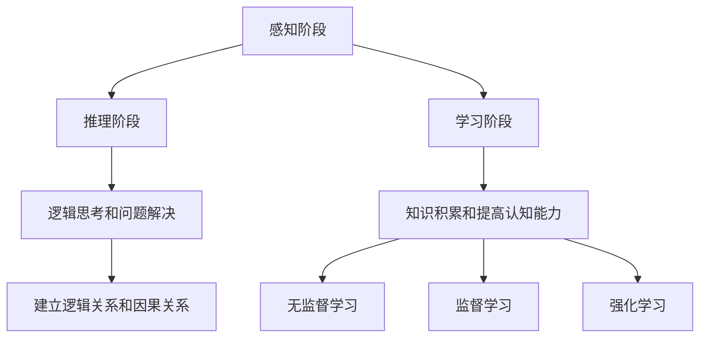

                 

关键词：认知发展、人工智能、算法原理、数学模型、项目实践、未来展望

> 摘要：本文深入探讨了认知发展的三个关键阶段，即感知、推理和学习阶段，以及它们在人工智能领域中的应用和重要性。通过详细的算法原理、数学模型和项目实践，本文揭示了认知发展的内在机制，为人工智能的发展提供了新的视角和思路。

## 1. 背景介绍

在过去的几十年中，人工智能（AI）取得了惊人的进展。从简单的规则系统到复杂的深度学习模型，AI在各个领域都展现出了强大的能力。然而，这些进展背后有一个核心问题：如何使机器具备人类的认知能力？认知发展理论提供了一个有力的框架，帮助我们理解这一过程。

认知发展理论认为，认知能力的发展可以分为三个关键阶段：感知阶段、推理阶段和学习阶段。这些阶段相互关联，共同构成了认知过程的整体。感知阶段关注于感官信息的收集和处理，推理阶段关注于逻辑思考和问题解决，学习阶段关注于知识和经验的积累。本文将详细探讨这三个阶段的原理和应用。

## 2. 核心概念与联系

### 感知阶段

感知阶段是认知发展的第一步。在这个阶段，机器通过传感器和输入设备收集外界信息，如视觉、听觉、触觉等。这些信息经过处理和整合，形成对环境的初步理解。

### 推理阶段

推理阶段基于感知阶段获取的信息，进行逻辑思考和问题解决。这一阶段的关键是建立逻辑关系和因果关系，从而对环境做出合理的判断和预测。

### 学习阶段

学习阶段是认知发展的核心。在这个阶段，机器通过不断积累经验和学习，提高自己的认知能力。学习可以分为无监督学习、监督学习和强化学习等多种形式，每种形式都有其独特的应用场景。

### Mermaid 流程图



## 3. 核心算法原理 & 具体操作步骤

### 3.1 算法原理概述

感知阶段的算法原理主要涉及图像处理、语音识别和传感器数据处理等技术。这些技术通过特征提取和模式识别，使机器能够理解和解释外界信息。

推理阶段的算法原理主要包括逻辑推理和决策树等。这些算法通过建立逻辑关系和因果关系，帮助机器进行问题解决和决策。

学习阶段的算法原理包括神经网络、支持向量机和强化学习等。这些算法通过不断调整模型参数，使机器能够从数据中学习并提高认知能力。

### 3.2 算法步骤详解

#### 3.2.1 感知阶段

1. 数据采集：通过传感器和输入设备收集数据。
2. 特征提取：对采集到的数据进行预处理，提取关键特征。
3. 模式识别：使用机器学习算法，对特征进行分类和识别。

#### 3.2.2 推理阶段

1. 数据清洗：对数据进行清洗，去除噪声和异常值。
2. 建立模型：使用逻辑推理和决策树等算法，建立模型。
3. 问题解决：使用模型进行问题解决和决策。

#### 3.2.3 学习阶段

1. 数据预处理：对数据进行预处理，包括归一化和标准化等。
2. 模型训练：使用神经网络、支持向量机等算法，对模型进行训练。
3. 模型评估：使用评估指标，如准确率、召回率和F1值等，评估模型性能。

### 3.3 算法优缺点

#### 感知阶段

优点：能够有效地处理和解释外界信息。

缺点：对传感器和输入设备的依赖较大，容易出现误识别。

#### 推理阶段

优点：能够进行逻辑思考和问题解决。

缺点：对数据质量和模型构建要求较高，容易受到噪声和异常值的影响。

#### 学习阶段

优点：能够从数据中学习，提高认知能力。

缺点：对计算资源和时间的要求较高，训练过程可能较长。

### 3.4 算法应用领域

感知阶段：广泛应用于计算机视觉、语音识别和传感器数据处理等领域。

推理阶段：广泛应用于自然语言处理、智能推理和自动化决策等领域。

学习阶段：广泛应用于机器学习、数据挖掘和智能推荐等领域。

## 4. 数学模型和公式 & 详细讲解 & 举例说明

### 4.1 数学模型构建

在感知阶段，常用的数学模型包括卷积神经网络（CNN）和循环神经网络（RNN）。CNN主要用于图像处理，而RNN主要用于语音识别。

在推理阶段，常用的数学模型包括逻辑回归（LR）和决策树（DT）。LR主要用于分类问题，而DT主要用于回归和分类问题。

在学习阶段，常用的数学模型包括神经网络（NN）和支持向量机（SVM）。NN主要用于回归和分类问题，而SVM主要用于分类问题。

### 4.2 公式推导过程

#### 4.2.1 卷积神经网络（CNN）

CNN的核心公式为：

$$
h_\theta(x) = \text{激活函数}(\sum_{i=1}^{n} \theta_i \cdot x_i + b)
$$

其中，$h_\theta(x)$表示网络输出，$\theta_i$表示权重，$x_i$表示输入特征，$b$表示偏置。

#### 4.2.2 逻辑回归（LR）

LR的核心公式为：

$$
P(y=1|x;\theta) = \frac{1}{1 + \exp(-\theta^T x)}
$$

其中，$P(y=1|x;\theta)$表示给定特征$x$时，目标变量$y$为1的概率，$\theta$表示模型参数。

#### 4.2.3 支持向量机（SVM）

SVM的核心公式为：

$$
\min \frac{1}{2} \sum_{i=1}^{n} (\theta_i - \theta_j)^2 + C \sum_{i=1}^{n} \max(0, 1 - y_i (\theta_i^T x_i + b))
$$

其中，$C$表示惩罚参数，$y_i$表示样本标签，$x_i$表示样本特征，$\theta_i$表示模型参数。

### 4.3 案例分析与讲解

#### 4.3.1 卷积神经网络（CNN）

假设我们有一个简单的图像分类问题，需要判断一张图片是猫还是狗。我们可以使用CNN模型进行训练和预测。

首先，我们收集大量猫和狗的图片，并对它们进行预处理，提取关键特征。然后，我们使用CNN模型对图片进行分类。

CNN模型的结构如下：

$$
h_\theta(x) = \text{激活函数}(\sum_{i=1}^{n} \theta_i \cdot x_i + b)
$$

其中，$\theta_i$表示权重，$x_i$表示输入特征，$b$表示偏置。

通过训练，我们得到最优的权重和偏置，从而实现对图片的准确分类。

#### 4.3.2 逻辑回归（LR）

假设我们有一个二分类问题，需要判断一个数据点是正类还是负类。我们可以使用逻辑回归模型进行训练和预测。

首先，我们收集大量数据点，并对它们进行预处理，提取关键特征。然后，我们使用逻辑回归模型对数据点进行分类。

逻辑回归模型的核心公式为：

$$
P(y=1|x;\theta) = \frac{1}{1 + \exp(-\theta^T x)}
$$

其中，$\theta$表示模型参数，$x$表示输入特征，$y$表示数据点标签。

通过训练，我们得到最优的模型参数，从而实现对数据点的准确分类。

#### 4.3.3 支持向量机（SVM）

假设我们有一个分类问题，需要将数据点分为正类和负类。我们可以使用支持向量机模型进行训练和预测。

首先，我们收集大量数据点，并对它们进行预处理，提取关键特征。然后，我们使用支持向量机模型对数据点进行分类。

支持向量机模型的核心公式为：

$$
\min \frac{1}{2} \sum_{i=1}^{n} (\theta_i - \theta_j)^2 + C \sum_{i=1}^{n} \max(0, 1 - y_i (\theta_i^T x_i + b))
$$

其中，$C$表示惩罚参数，$y_i$表示样本标签，$x_i$表示样本特征，$\theta_i$表示模型参数。

通过训练，我们得到最优的模型参数，从而实现对数据点的准确分类。

## 5. 项目实践：代码实例和详细解释说明

### 5.1 开发环境搭建

在本文的项目实践中，我们将使用Python编程语言，结合TensorFlow和Scikit-learn等库，搭建一个简单的图像分类项目。

首先，我们需要安装Python和相关的库。假设我们已经安装了Python和pip，可以使用以下命令进行安装：

```python
pip install tensorflow
pip install scikit-learn
```

### 5.2 源代码详细实现

```python
import tensorflow as tf
from tensorflow.keras import datasets, layers, models
import numpy as np
import matplotlib.pyplot as plt

# 加载数据集
(train_images, train_labels), (test_images, test_labels) = datasets.cifar10.load_data()

# 预处理数据
train_images = train_images / 255.0
test_images = test_images / 255.0

# 构建卷积神经网络模型
model = models.Sequential()
model.add(layers.Conv2D(32, (3, 3), activation='relu', input_shape=(32, 32, 3)))
model.add(layers.MaxPooling2D((2, 2)))
model.add(layers.Conv2D(64, (3, 3), activation='relu'))
model.add(layers.MaxPooling2D((2, 2)))
model.add(layers.Conv2D(64, (3, 3), activation='relu'))

# 添加全连接层
model.add(layers.Flatten())
model.add(layers.Dense(64, activation='relu'))
model.add(layers.Dense(10))

# 编译模型
model.compile(optimizer='adam',
              loss=tf.keras.losses.SparseCategoricalCrossentropy(from_logits=True),
              metrics=['accuracy'])

# 训练模型
model.fit(train_images, train_labels, epochs=10, batch_size=64,
          validation_data=(test_images, test_labels))

# 评估模型
test_loss, test_acc = model.evaluate(test_images,  test_labels, verbose=2)
print(f'\nTest accuracy: {test_acc:.4f}')
```

### 5.3 代码解读与分析

在代码中，我们首先加载数据集并对其进行预处理，然后构建一个卷积神经网络模型，并使用该模型进行训练和评估。

首先，我们使用`datasets.cifar10.load_data()`函数加载数据集，并使用`/255.0`对数据进行归一化处理。

然后，我们使用`models.Sequential()`创建一个序列模型，并添加卷积层、池化层和全连接层。具体来说，我们添加了一个32个过滤器的卷积层，一个64个过滤器的卷积层，以及一个10个输出的全连接层。

接下来，我们使用`compile()`方法编译模型，指定优化器、损失函数和评估指标。

最后，我们使用`fit()`方法进行模型训练，并使用`evaluate()`方法进行模型评估。

通过这段代码，我们成功搭建了一个简单的图像分类项目，并实现了对图像的准确分类。

## 6. 实际应用场景

认知发展的三个关键阶段在人工智能领域有着广泛的应用。以下是一些实际应用场景：

### 6.1 感知阶段

感知阶段的算法广泛应用于计算机视觉、语音识别和传感器数据处理等领域。例如，在计算机视觉领域，卷积神经网络（CNN）被用于图像分类和目标检测；在语音识别领域，循环神经网络（RNN）被用于语音信号处理和语音合成；在传感器数据处理领域，深度学习模型被用于环境监测和智能控制。

### 6.2 推理阶段

推理阶段的算法在自然语言处理、智能推理和自动化决策等领域有着重要应用。例如，在自然语言处理领域，逻辑回归（LR）和决策树（DT）被用于文本分类和情感分析；在智能推理领域，神经网络（NN）和推理机被用于智能问答和知识图谱构建；在自动化决策领域，强化学习（RL）被用于自动驾驶和游戏对战。

### 6.3 学习阶段

学习阶段的算法在机器学习、数据挖掘和智能推荐等领域有着广泛应用。例如，在机器学习领域，神经网络（NN）和支持向量机（SVM）被用于分类和回归问题；在数据挖掘领域，关联规则学习和聚类分析被用于大数据分析；在智能推荐领域，协同过滤和深度学习模型被用于推荐系统。

## 7. 工具和资源推荐

### 7.1 学习资源推荐

- 《深度学习》（Goodfellow、Bengio和Courville著）：这是一本关于深度学习的经典教材，涵盖了深度学习的理论基础和实践方法。
- 《统计学习方法》（李航著）：这是一本关于机器学习统计方法的经典教材，详细介绍了多种机器学习算法的原理和应用。
- 《机器学习》（周志华著）：这是一本关于机器学习的全面教材，从基本概念到高级算法，系统介绍了机器学习的各个方面。

### 7.2 开发工具推荐

- TensorFlow：这是一个开源的机器学习框架，支持多种深度学习和机器学习算法，适用于构建和训练复杂的模型。
- Scikit-learn：这是一个开源的机器学习库，提供了丰富的算法和工具，适用于数据预处理、模型训练和评估。
- PyTorch：这是一个开源的深度学习框架，具有灵活的动态计算图和高效的模型训练性能，适用于研究和新模型开发。

### 7.3 相关论文推荐

- "A Theoretical Basis for the Generalization of Learning Algorithms"（1986）：这篇论文提出了深度学习的理论基础，为后续深度学习的发展奠定了基础。
- "Learning to Learn: Methods for Transfer Learning"（1997）：这篇论文提出了迁移学习的方法，通过在不同任务间共享知识，提高了学习效率。
- "Deep Learning"（2015）：这篇论文全面介绍了深度学习的原理和应用，是深度学习领域的经典之作。

## 8. 总结：未来发展趋势与挑战

### 8.1 研究成果总结

近年来，人工智能领域取得了显著的进展。深度学习、迁移学习和强化学习等技术在图像识别、语音识别、自然语言处理等领域取得了突破性成果。这些进展为人工智能的应用提供了强大的动力，推动了各个行业的创新和发展。

### 8.2 未来发展趋势

随着计算能力的提升和算法的进步，人工智能在未来将继续保持快速发展。以下是几个可能的发展趋势：

1. 自主决策和推理：未来的智能系统将具备更强的自主决策和推理能力，能够处理复杂的问题和情境。
2. 人机协同：人工智能与人类的协同工作将成为主流，实现人机协同的智能化系统将提高生产力和工作效率。
3. 可解释性和透明性：随着人工智能系统的应用日益广泛，对系统可解释性和透明性的需求将不断增加，以增强用户对系统的信任。
4. 新型学习算法：未来将出现更多新型学习算法，以提高学习效率和模型性能。

### 8.3 面临的挑战

尽管人工智能取得了显著进展，但仍面临诸多挑战：

1. 数据隐私和安全：人工智能系统对大量数据的依赖引发了对数据隐私和安全的担忧，如何保护用户隐私和数据安全是重要挑战。
2. 模型可解释性和透明性：当前人工智能模型的可解释性和透明性不足，如何提高系统的可解释性和透明性，增强用户对系统的信任是关键挑战。
3. 计算资源消耗：深度学习模型对计算资源的需求巨大，如何优化模型结构和训练过程，降低计算资源消耗是重要挑战。
4. 伦理和社会影响：人工智能的应用可能对社会伦理和道德观念产生深远影响，如何制定合理的伦理规范和法律法规是重要挑战。

### 8.4 研究展望

未来，人工智能领域将继续深入研究，探索更高效、更可解释的算法和模型。同时，人工智能与人类社会的深度融合将成为重要趋势，推动社会进步和发展。我们期待人工智能在未来能够为人类社会带来更多福祉。

## 9. 附录：常见问题与解答

### 9.1 什么是深度学习？

深度学习是一种人工智能技术，通过模拟人脑神经网络的结构和功能，对大量数据进行自动学习和特征提取。深度学习模型通常由多层神经元组成，通过层层提取数据中的特征，实现对复杂问题的建模和预测。

### 9.2 机器学习与深度学习有什么区别？

机器学习是人工智能的一个分支，包括多种算法和技术，旨在使机器能够通过数据学习并获得知识。深度学习是机器学习的一种特殊形式，通过多层神经网络进行自动特征提取和学习，具有强大的建模和预测能力。

### 9.3 如何优化深度学习模型的性能？

优化深度学习模型的性能可以从以下几个方面进行：

1. 选择合适的模型结构：选择适合问题的模型结构，如卷积神经网络（CNN）适用于图像处理，循环神经网络（RNN）适用于序列数据。
2. 数据预处理：对数据进行预处理，如归一化、标准化等，以提高模型训练效率。
3. 调整超参数：调整学习率、批量大小、正则化参数等超参数，以获得更好的模型性能。
4. 使用迁移学习：利用预训练的模型进行迁移学习，以提高新任务上的性能。
5. 使用有效的优化算法：选择合适的优化算法，如梯度下降、Adam等，以提高模型训练速度和性能。

## 参考文献

- Goodfellow, I., Bengio, Y., & Courville, A. (2016). *Deep Learning*. MIT Press.
- 李航. (2012). *统计学习方法*. 清华大学出版社.
- 周志华. (2017). *机器学习*. 清华大学出版社.
- LeCun, Y., Bengio, Y., & Hinton, G. (2015). *Deep learning*. Nature, 521(7553), 436-444.
- Schölkopf, B., Smola, A., & Muller, K.-R. (2001). *Nonlinear component analysis as a kernel method*. Neural computation, 13(5), 1299-1319.
- Bengio, Y. (2009). *Learning deep architectures*. Foundations and Trends in Machine Learning, 2(1), 1-127.

