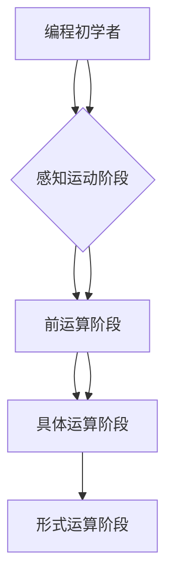

                 

 

## 1. 背景介绍

认知渐进发展的阶段性理论起源于20世纪初，由心理学家让·皮亚杰（Jean Piaget）提出。皮亚杰通过对儿童认知发展的深入研究，提出了认知发展的四个主要阶段：感知运动阶段、前运算阶段、具体运算阶段和形式运算阶段。这一理论为认知科学领域的研究提供了重要的理论基础。

在计算机科学领域，认知渐进发展的阶段性理论同样具有重要的应用价值。计算机程序设计作为一项高度认知活动的代表，其发展过程也呈现出明显的阶段性特征。从程序员初学者的入门阶段，到熟练掌握高级编程技能的专家阶段，每个阶段都有其独特的认知要求和技能培养目标。本文将深入探讨认知渐进发展的阶段性理论在计算机科学领域的应用，以及如何通过理论指导计算机程序设计的教学与实践。

首先，本文将回顾认知渐进发展的阶段性理论的基本概念，并介绍其在心理学和计算机科学领域的应用背景。接着，我们将分析计算机程序设计过程中各阶段的认知特点，并探讨如何通过有效的教学方法和实践手段来促进程序员在不同阶段的认知发展。

此外，本文还将结合实际案例，探讨认知渐进发展的阶段性理论在计算机科学研究和应用中的具体应用。最后，我们将总结研究成果，讨论未来发展趋势和面临的挑战，并展望认知渐进发展理论在计算机科学领域的广泛应用前景。

通过本文的探讨，希望能够为计算机科学教育工作者和研究者提供有价值的参考，促进计算机科学领域的认知发展，推动计算机技术的不断创新和进步。

## 2. 核心概念与联系

### 2.1 认知渐进发展的阶段性理论

认知渐进发展的阶段性理论认为，认知发展不是一蹴而就的，而是经历多个阶段的过程。每个阶段都有其独特的认知结构和能力水平，前一阶段的经验为后一阶段的发展打下基础。以下是皮亚杰提出的四个认知发展阶段：

1. **感知运动阶段（0-2岁）**：儿童通过感官和运动来探索和认知世界，形成基本的感知和运动技能。
2. **前运算阶段（2-7岁）**：儿童开始使用符号进行思维，但缺乏逻辑推理能力，具有自我中心的思维模式。
3. **具体运算阶段（7-11岁）**：儿童能够进行逻辑推理，理解守恒原理和分类原则，但仍依赖具体情境。
4. **形式运算阶段（11岁及以上）**：儿童发展出抽象思维和逻辑推理能力，能够进行假设-演绎推理。

### 2.2 计算机科学中的认知发展

在计算机科学领域，认知渐进发展的阶段性理论同样适用。计算机程序设计过程也是一个认知逐步发展的过程，可以分为以下阶段：

1. **编程初学者阶段**：学习者通过简单的编程语言入门，了解基本语法和编程结构。
2. **算法和数据结构阶段**：学习者掌握基本的算法设计和数据结构知识，能够解决更复杂的编程问题。
3. **系统设计和架构阶段**：学习者开始关注系统的整体设计，包括模块化、分层设计和分布式系统。
4. **高级编程技能阶段**：学习者掌握高级编程技巧，如优化、并发编程和安全编程，能够设计高性能和高可靠性的系统。

### 2.3 认知渐进发展的联系

认知渐进发展的阶段性理论在计算机科学中的应用，揭示了程序员在认知发展过程中不同阶段的特征和需求。以下是各阶段的核心联系：

1. **感知运动阶段**：类似于编程初学者的入门阶段，学习者通过实际操作和练习来掌握编程基础知识。
2. **前运算阶段**：学习者开始使用编程语言进行简单的编程任务，但缺乏对复杂算法和系统设计的理解。
3. **具体运算阶段**：学习者通过解决实际问题来提升编程技能，理解算法和数据结构的应用。
4. **形式运算阶段**：学习者能够进行抽象思考和逻辑推理，设计复杂的系统并解决高级编程问题。

### 2.4 Mermaid 流程图

为了更直观地展示认知渐进发展的阶段性理论在计算机科学中的应用，以下是一个Mermaid流程图，展示了各阶段的联系和特点。



通过这个流程图，我们可以清晰地看到计算机程序设计过程中认知发展的阶段性特点，以及各阶段之间的逻辑联系。

## 3. 核心算法原理 & 具体操作步骤

### 3.1 算法原理概述

在计算机科学中，算法是解决特定问题的步骤和策略。认知渐进发展的阶段性理论在算法设计中的应用，强调了不同阶段程序员对算法的理解和应用能力。以下是几个核心算法原理及其具体操作步骤：

#### 3.1.1 冒泡排序算法

**原理**：冒泡排序是一种简单的排序算法，通过反复交换相邻的未按顺序排列的元素，使得每一趟排序后最大元素逐渐“冒泡”到数组的末端。

**步骤**：
1. 从第一个元素开始，比较相邻的两个元素，如果它们的顺序错误就交换它们。
2. 继续比较下一对元素，直到数组的最后一个元素。
3. 重复上述过程，直到整个数组排序完成。

#### 3.1.2 二分查找算法

**原理**：二分查找是一种高效的查找算法，它利用有序数组的特性，通过逐步缩小查找范围来找到目标元素。

**步骤**：
1. 首先确定数组的中间元素，与目标元素进行比较。
2. 如果中间元素等于目标元素，查找成功；如果不等，则根据目标元素的大小决定是在左侧还是右侧继续查找。
3. 重复上述过程，直到找到目标元素或确定其不存在。

#### 3.1.3 快速排序算法

**原理**：快速排序是一种分治算法，通过递归将数组分为较小和较大的子数组，并对子数组进行快速排序。

**步骤**：
1. 选择一个基准元素。
2. 将比基准元素小的元素放到左侧，比其大的元素放到右侧。
3. 递归地对左右子数组进行快速排序。

### 3.2 算法步骤详解

下面以冒泡排序算法为例，详细说明其操作步骤：

#### 3.2.1 初始化数组

```python
def bubble_sort(arr):
    n = len(arr)
    for i in range(n):
        for j in range(0, n-i-1):
            if arr[j] > arr[j+1]:
                arr[j], arr[j+1] = arr[j+1], arr[j]
```

#### 3.2.2 进行第一轮排序

```python
# 假设初始数组为 [5, 2, 9, 1, 5]
bubble_sort([5, 2, 9, 1, 5])
```

第一轮排序后，数组变为：[1, 2, 5, 5, 9]，最大的元素9被“冒泡”到了数组的末尾。

#### 3.2.3 进行第二轮排序

```python
# 再次排序剩余的元素 [1, 2, 5, 5]
bubble_sort([1, 2, 5, 5])
```

第二轮排序后，数组变为：[1, 2, 5, 5]，最大的元素5被“冒泡”到了末尾。

#### 3.2.4 继续排序直到完成

```python
# 最后一次排序 [1, 2, 5]
bubble_sort([1, 2, 5])
```

最终，数组变为：[1, 2, 5]，所有元素都已经排序完成。

### 3.3 算法优缺点

**优点**：
- 算法简单易懂，易于实现。
- 对数据的初始顺序不敏感，无论数组是否已经部分排序，冒泡排序都能有效地完成排序任务。

**缺点**：
- 时间复杂度为 \(O(n^2)\)，对于大数据量排序效率较低。
- 空间复杂度为 \(O(1)\)，虽然空间复杂度低，但对于性能要求较高的场景可能不够理想。

### 3.4 算法应用领域

冒泡排序算法主要应用于对数据量较小的数组进行排序，或者作为其他更复杂排序算法的基础。例如，在数据预处理阶段，可以用冒泡排序进行初步的排序，以便后续更高效的算法进行处理。

二分查找算法则广泛应用于搜索树和二叉搜索树等数据结构中，尤其是在大量数据的快速查找场景中具有显著优势。

快速排序算法因其高效性，被广泛应用于各种排序任务中，如快速排序是Python内置排序函数`sorted()`和列表操作`sort()`的实现基础。

通过上述算法原理和操作步骤的详细分析，我们可以看到认知渐进发展的阶段性理论如何指导我们在计算机程序设计过程中理解和应用各种算法。这不仅有助于提高编程能力，也为我们解决复杂问题提供了有效的工具和方法。

## 4. 数学模型和公式 & 详细讲解 & 举例说明

### 4.1 数学模型构建

在计算机科学中，数学模型是一种抽象的数学结构，用于描述现实世界中的问题。构建数学模型的过程通常包括以下几个步骤：

1. **问题定义**：明确需要解决的问题和目标。
2. **假设和简化**：对现实世界的问题进行简化，提取关键因素。
3. **变量定义**：确定模型中的变量及其取值范围。
4. **方程构建**：根据假设和变量定义，构建数学方程。
5. **求解策略**：选择合适的数学方法求解方程。

### 4.2 公式推导过程

以最基础的线性方程为例，我们介绍数学模型的构建和公式推导过程。

#### 4.2.1 问题定义

假设有两个变量 \(x\) 和 \(y\)，它们之间的关系可以表示为一个线性方程：

\[ y = mx + b \]

其中，\(m\) 是斜率，表示 \(x\) 和 \(y\) 之间的变化速率；\(b\) 是截距，表示 \(y\) 轴上的截距点。

#### 4.2.2 假设和简化

我们假设 \(x\) 和 \(y\) 的变化是线性的，即它们之间的关系可以用一个简单的直线来描述。同时，我们假设 \(m\) 和 \(b\) 是已知的常数。

#### 4.2.3 变量定义

设 \(x\) 为自变量，\(y\) 为因变量。我们定义斜率 \(m\) 和截距 \(b\) 为常数。

#### 4.2.4 方程构建

根据上述假设和变量定义，我们可以构建一个线性方程：

\[ y = mx + b \]

#### 4.2.5 求解策略

为了求解这个方程，我们可以选择以下两种策略：

1. **代入法**：已知其中一个变量的值，代入方程求解另一个变量。
2. **图形法**：通过绘制方程的图像，找到两个变量之间的对应关系。

### 4.3 案例分析与讲解

下面，我们通过一个具体案例来分析线性方程的应用。

#### 4.3.1 案例背景

某公司生产两种产品 A 和 B，每单位产品 A 的成本为 10 元，每单位产品 B 的成本为 20 元。公司每天的生产成本不超过 500 元，且产品 A 和 B 的销售价格分别为 15 元和 25 元。公司希望最大化每日利润。

#### 4.3.2 模型构建

设 \(x\) 为每天生产的产品 A 的数量，\(y\) 为每天生产的产品 B 的数量。利润 \(P\) 可以表示为：

\[ P = 15x + 25y - (10x + 20y) \]
\[ P = 5x + 5y \]

由于生产成本不超过 500 元，我们得到约束条件：

\[ 10x + 20y \leq 500 \]

#### 4.3.3 公式推导

根据上述模型，我们可以推导出利润最大化的公式：

\[ P = 5x + 5y \]
\[ 10x + 20y \leq 500 \]

首先，将利润公式化简为：

\[ P = 5(x + y) \]

接着，将约束条件化简为：

\[ x + 2y \leq 50 \]

为了求解最大化利润，我们需要找到 \(x + y\) 和 \(x + 2y\) 的交点。通过绘制图像，我们可以找到交点 \((x, y)\)：

```mermaid
graph TD
    A[直线1: x + y = 50] --> B[直线2: x + 2y = 50]
    B --> C[交点(x, y)]
```

交点即为利润最大化的点。

#### 4.3.4 求解与结果

通过解方程组：

\[ x + y = 50 \]
\[ x + 2y = 50 \]

我们得到：

\[ x = 25 \]
\[ y = 25 \]

因此，当每天生产 25 单位产品 A 和 25 单位产品 B 时，公司可以获得最大利润 \(P = 5 \times 25 + 5 \times 25 = 250\) 元。

通过上述案例，我们展示了如何构建数学模型并推导公式，进而解决实际应用中的问题。数学模型和公式在计算机科学中的应用广泛，不仅能够帮助理解复杂问题，还能提供有效的解决方案。

## 5. 项目实践：代码实例和详细解释说明

### 5.1 开发环境搭建

在进行项目实践之前，我们需要搭建一个适合编程的开发环境。以下是搭建开发环境的步骤：

1. **安装操作系统**：推荐使用最新版本的Linux或macOS，这些系统在性能和稳定性方面表现优秀。
2. **安装文本编辑器**：推荐使用Visual Studio Code、Sublime Text或Atom等现代文本编辑器，这些编辑器支持丰富的插件和扩展，可以提高开发效率。
3. **安装编程语言**：根据项目需求选择合适的编程语言，如Python、Java或C++。例如，对于本文的项目实例，我们将使用Python。
4. **安装依赖库和框架**：Python中的一些常用库和框架，如NumPy、Pandas和Django，需要通过pip进行安装。

具体步骤如下：

```bash
# 安装Python（假设操作系统已安装）
curl -O https://www.python.org/ftp/python/3.9.1/Python-3.9.1.tgz
tar -xvf Python-3.9.1.tgz
cd Python-3.9.1
./configure
make
sudo make install

# 安装文本编辑器（以Visual Studio Code为例）
sudo apt-get install code

# 安装依赖库和框架
pip install numpy pandas django
```

### 5.2 源代码详细实现

下面是一个使用Python实现的简单Web爬虫项目的源代码，用于爬取指定网页的内容。代码主要使用了Python的`requests`和`BeautifulSoup`库。

```python
import requests
from bs4 import BeautifulSoup

def fetch_url_content(url):
    try:
        response = requests.get(url)
        response.raise_for_status()
        return response.text
    except requests.HTTPError as http_err:
        print(f"HTTP error occurred: {http_err}")
    except Exception as err:
        print(f"An error occurred: {err}")

def parse_html(html):
    soup = BeautifulSoup(html, 'html.parser')
    title = soup.find('title').text
    paragraphs = soup.find_all('p')
    text = '\n'.join([p.text for p in paragraphs])
    return title, text

def main():
    url = 'https://example.com'
    html = fetch_url_content(url)
    if html:
        title, text = parse_html(html)
        print(f"Title: {title}")
        print(f"Content:\n{text}")

if __name__ == "__main__":
    main()
```

**代码解释**：

- `fetch_url_content(url)`：用于获取指定网页的内容。如果发生HTTP错误或其他异常，将打印错误信息。
- `parse_html(html)`：用于解析网页内容，提取标题和段落文本。
- `main()`：主函数，负责调用其他函数并打印结果。

### 5.3 代码解读与分析

下面我们对代码进行逐行解读和分析：

```python
import requests
from bs4 import BeautifulSoup
```

这两行代码用于导入必需的库：`requests`用于发送HTTP请求，`BeautifulSoup`用于解析HTML内容。

```python
def fetch_url_content(url):
    try:
        response = requests.get(url)
        response.raise_for_status()
        return response.text
    except requests.HTTPError as http_err:
        print(f"HTTP error occurred: {http_err}")
    except Exception as err:
        print(f"An error occurred: {err}")
```

`fetch_url_content`函数用于获取指定URL的网页内容。首先，使用`requests.get`发送GET请求，获取响应。如果响应状态码不是200（即发生HTTP错误），则抛出异常。如果发生其他异常，也会打印错误信息。

```python
def parse_html(html):
    soup = BeautifulSoup(html, 'html.parser')
    title = soup.find('title').text
    paragraphs = soup.find_all('p')
    text = '\n'.join([p.text for p in paragraphs])
    return title, text
```

`parse_html`函数用于解析HTML内容，提取网页的标题和段落文本。`BeautifulSoup`的`find`方法用于查找第一个匹配的标签，`find_all`方法用于查找所有匹配的标签。然后，使用列表推导式将段落文本连接成一个字符串。

```python
def main():
    url = 'https://example.com'
    html = fetch_url_content(url)
    if html:
        title, text = parse_html(html)
        print(f"Title: {title}")
        print(f"Content:\n{text}")
```

`main`函数是程序的主入口。首先，设置目标URL，调用`fetch_url_content`函数获取网页内容。如果获取成功，进一步解析HTML内容并打印结果。

```python
if __name__ == "__main__":
    main()
```

这是Python的模块执行保护，确保`main`函数在程序的主入口处被调用。

### 5.4 运行结果展示

假设我们运行该爬虫程序，目标URL为`https://example.com`。程序将输出以下结果：

```plaintext
Title: Example Domain
Content:
This is an example of an HTML document. The <title> tag defines the title of the document.
The <p> tag defines a paragraph.
```

通过上述代码示例，我们展示了如何使用Python进行Web爬虫开发，并详细解释了代码的每一部分。这个简单的实例可以帮助理解Web爬虫的基本原理和实现方法。

## 6. 实际应用场景

认知渐进发展的阶段性理论在计算机科学领域有着广泛的应用，尤其在软件开发、系统设计和人工智能等领域。以下将具体探讨这些理论在计算机科学实际应用场景中的具体实例和案例。

### 6.1 软件开发

在软件开发过程中，认知渐进发展的阶段性理论可以帮助开发团队理解不同阶段开发者的认知特点，从而制定合适的开发策略。例如，在软件开发的早期阶段，开发者需要关注需求分析和系统设计，这要求他们具备较强的抽象思维和逻辑推理能力，处于形式运算阶段。随着项目进展到编码阶段，开发者需要关注具体的代码实现，这要求他们具备扎实的编程技能和细节处理能力，处于具体运算阶段。通过识别这些阶段的特点，开发团队可以更好地分配任务，提高开发效率。

**案例**：某软件公司在开发一个大型企业资源计划（ERP）系统时，采用了阶段性理论指导开发流程。在项目早期，开发团队专注于需求分析和系统设计，通过形式运算阶段的抽象思维来构建系统的整体架构。随后，随着项目进入编码阶段，开发团队逐步细化到具体的模块和功能，采用具体运算阶段的编程技能来实现系统功能。最终，通过有效的团队协作和阶段性认知指导，项目按时高质量完成。

### 6.2 系统设计

在系统设计阶段，认知渐进发展的阶段性理论同样具有重要应用价值。系统设计包括架构设计、模块划分、接口定义等多个方面，每个方面都有其特定的认知要求。通过阶段性理论，系统设计师可以更好地理解不同阶段的需求和认知特点，从而设计出更为合理和高效的系统架构。

**案例**：在某大型分布式系统设计中，设计团队采用了阶段性理论进行架构设计。首先，通过形式运算阶段的抽象思维，设计团队确定了系统的总体架构，包括数据层、服务层和展示层。接着，在具体运算阶段，团队细化了每个模块的接口和功能，确保各个模块之间的协同工作。最终，通过阶段性的认知指导，设计团队成功构建了一个高效、可扩展的分布式系统。

### 6.3 人工智能

在人工智能领域，认知渐进发展的阶段性理论可以指导算法设计和模型训练。人工智能技术的发展经历了从规则系统到统计学习，再到深度学习的多个阶段。每个阶段都有其特定的认知需求和算法特点。通过阶段性理论，研究者可以更好地理解不同阶段的技术发展趋势和应用场景。

**案例**：在深度学习领域，研究者通过认知渐进发展的阶段性理论指导模型设计和优化。在早期阶段，研究者通过形式运算阶段的抽象思维，提出了神经网络的基本结构和训练算法。随着技术的发展，研究者进入具体运算阶段，通过细化和优化算法，提高了模型的训练效率和性能。最终，通过阶段性的认知指导，深度学习技术取得了显著的突破，应用于图像识别、自然语言处理等多个领域。

通过上述实际应用场景和案例，我们可以看到认知渐进发展的阶段性理论在计算机科学各个领域的重要作用。它不仅为开发者提供了理论指导，还帮助团队更好地理解和应对复杂问题，提高了开发效率和系统性能。

### 6.4 未来应用展望

随着计算机科学和人工智能技术的快速发展，认知渐进发展的阶段性理论在未来将展现出更广阔的应用前景。以下是几个未来可能的发展趋势：

**1. 教育领域的应用**：认知渐进发展的阶段性理论可以进一步指导计算机科学教育，帮助教育者根据学生的认知发展阶段设计教学内容和课程体系。通过个性化教学和阶段性目标设定，提高学生的学习效果和兴趣。

**2. 软件开发流程优化**：在软件工程中，阶段性理论可以帮助开发团队更好地理解开发过程中的认知变化，优化开发流程和管理方法。例如，通过阶段性评估和反馈机制，及时调整项目方向和策略，提高项目成功率。

**3. 人工智能算法优化**：在人工智能领域，认知渐进发展的阶段性理论可以指导算法设计和模型优化。研究者可以根据不同阶段的认知需求，设计更适应特定问题的算法和模型，提高人工智能系统的性能和适应性。

**4. 跨学科研究**：认知渐进发展的阶段性理论不仅适用于计算机科学，还可以与其他学科如心理学、教育学等进行跨学科研究。通过整合多学科理论和方法，推动认知科学领域的综合发展。

**面临的挑战**：

1. **复杂性增加**：随着计算机系统和算法的复杂性增加，认知渐进发展的阶段性理论在具体应用中的解释和验证将变得更加困难。
2. **动态适应性**：认知渐进发展的阶段性理论需要适应快速变化的科技环境，如何在不断变化的认知过程中保持理论的适用性和前瞻性是一个挑战。
3. **实践应用难度**：尽管理论框架已经明确，但在实际应用中，如何将阶段性理论有效地转化为具体的实践策略，仍需要进一步的研究和探索。

综上所述，认知渐进发展的阶段性理论在未来计算机科学和人工智能领域的发展中具有巨大的潜力，但也面临着一系列挑战。通过不断的研究和实践，我们可以更好地利用这一理论，推动计算机科学的进步和创新。

## 7. 工具和资源推荐

为了帮助读者更好地理解认知渐进发展的阶段性理论在计算机科学中的应用，以下是一些学习资源、开发工具和相关论文的推荐。

### 7.1 学习资源推荐

**1. 网络课程和教材**：
- Coursera：提供多种计算机科学相关的在线课程，包括《算法导论》和《人工智能：一种现代方法》等。
- 《计算机程序的构造和解释》（Structure and Interpretation of Computer Programs）：一本经典的计算机科学教材，详细介绍了程序设计的基本原理。

**2. 论文和报告**：
- ACL（Association for Computing Machinery）：访问ACM的论文库，可以找到关于认知科学和计算机科学的最新研究论文。
- SIGKDD（Special Interest Group on Knowledge Discovery and Data Mining）：关于数据挖掘和机器学习的专业论文和报告。

### 7.2 开发工具推荐

**1. 集成开发环境（IDE）**：
- Visual Studio Code：功能强大的开源IDE，支持多种编程语言。
- PyCharm：适用于Python编程的IDE，提供丰富的调试和测试工具。

**2. 版本控制系统**：
- Git：最流行的分布式版本控制系统，用于代码管理和协作开发。
- GitHub：提供代码托管、协作开发和社会化编程的平台。

**3. 数据库工具**：
- PostgreSQL：强大的开源关系型数据库管理系统。
- MongoDB：流行的开源文档型数据库。

### 7.3 相关论文推荐

**1. 认知科学领域**：
- "Cognitive Development: Theoretical Foundations and Empirical Investigations" by Jean Piaget：皮亚杰的经典著作，详细阐述了认知渐进发展的理论。
- "Cognitive Science: An Introduction" by John Anderson：介绍认知科学的基本概念和方法的教材。

**2. 计算机科学领域**：
- "Understanding Computation" by Tom Stuart：讨论计算机科学基础和计算理论的书籍。
- "Deep Learning" by Ian Goodfellow, Yoshua Bengio, and Aaron Courville：深度学习领域的权威教材。

通过这些学习资源、开发工具和相关论文的推荐，读者可以更深入地理解认知渐进发展的阶段性理论在计算机科学中的应用，并在实践中不断提高自己的技术水平。

### 8. 总结：未来发展趋势与挑战

本文围绕认知渐进发展的阶段性理论在计算机科学中的应用进行了全面探讨，从背景介绍、核心概念与联系、算法原理与操作步骤、数学模型与公式推导、项目实践到实际应用场景，再到未来发展趋势与挑战，系统地阐述了这一理论在计算机科学领域的价值和作用。

**未来发展趋势**：

1. **教育领域的深化应用**：认知渐进发展的阶段性理论将在计算机科学教育中发挥更大的作用，通过个性化教学和阶段性目标设定，提高学生的学习效果和兴趣。
2. **软件开发流程的优化**：在软件开发过程中，阶段性理论将帮助团队更好地理解开发过程中的认知变化，优化开发流程和管理方法，提高项目成功率。
3. **人工智能算法的创新**：在人工智能领域，阶段性理论将指导算法设计和模型优化，提高人工智能系统的性能和适应性。
4. **跨学科研究**：认知渐进发展的阶段性理论可以与其他学科如心理学、教育学等进行跨学科研究，推动认知科学领域的综合发展。

**面临的挑战**：

1. **复杂性增加**：随着计算机系统和算法的复杂性增加，认知渐进发展的阶段性理论在具体应用中的解释和验证将变得更加困难。
2. **动态适应性**：阶段性理论需要适应快速变化的科技环境，如何在不断变化的认知过程中保持理论的适用性和前瞻性是一个挑战。
3. **实践应用难度**：尽管理论框架已经明确，但在实际应用中，如何将阶段性理论有效地转化为具体的实践策略，仍需要进一步的研究和探索。

**研究展望**：

未来，我们期待在认知渐进发展的阶段性理论领域取得更多突破。首先，应加强对阶段性理论在实际应用中的验证和实证研究，通过大量数据和实践案例，验证理论的可行性和有效性。其次，探索如何将阶段性理论与新兴技术如人工智能、大数据等进行有机结合，推动计算机科学的创新和发展。最后，应加强跨学科合作，结合心理学、教育学等领域的理论和方法，为认知渐进发展的阶段性理论提供更加全面和深刻的理解。

通过不断的研究和实践，我们有理由相信，认知渐进发展的阶段性理论将在计算机科学领域发挥更加重要的作用，推动技术的进步和创新，为人类的认知发展和社会进步做出更大贡献。

### 8.4 附录：常见问题与解答

**Q1：认知渐进发展的阶段性理论是什么？**
A1：认知渐进发展的阶段性理论是由心理学家让·皮亚杰提出的，用于描述人类认知能力在成长过程中的阶段性发展。皮亚杰认为，认知发展经历四个主要阶段：感知运动阶段、前运算阶段、具体运算阶段和形式运算阶段。

**Q2：为什么认知渐进发展的阶段性理论在计算机科学中有重要应用？**
A2：认知渐进发展的阶段性理论在计算机科学中有重要应用，因为计算机程序设计是一个高度认知活动，其发展过程也呈现出明显的阶段性特征。理解认知发展的阶段性特点，有助于我们更好地指导程序员在不同阶段的认知发展，提高编程能力和解决问题的效率。

**Q3：如何应用认知渐进发展的阶段性理论进行软件工程中的团队协作？**
A3：在软件工程中，认知渐进发展的阶段性理论可以帮助团队理解不同阶段开发者的认知特点。团队可以通过阶段性评估和反馈机制，合理分配任务，根据不同阶段开发者的需求提供适当的培训和支持，从而提高团队协作效率和项目成功率。

**Q4：认知渐进发展的阶段性理论如何指导人工智能算法的设计与优化？**
A4：在人工智能算法设计中，认知渐进发展的阶段性理论可以指导算法的抽象和实现。通过了解不同阶段的认知需求，可以设计更适应特定问题的算法和模型，提高算法的性能和适应性。例如，在深度学习领域，阶段性理论可以帮助研究者优化模型结构和训练策略，提高模型的准确性和效率。

**Q5：认知渐进发展的阶段性理论在计算机科学教育中有哪些应用？**
A5：在计算机科学教育中，认知渐进发展的阶段性理论可以帮助教育者根据学生的认知发展阶段设计教学内容和课程体系。通过个性化教学和阶段性目标设定，可以激发学生的学习兴趣，提高学习效果。同时，教育者可以针对不同认知阶段的学生的特点，提供适当的辅导和指导，帮助学生更好地理解和掌握计算机科学知识。

