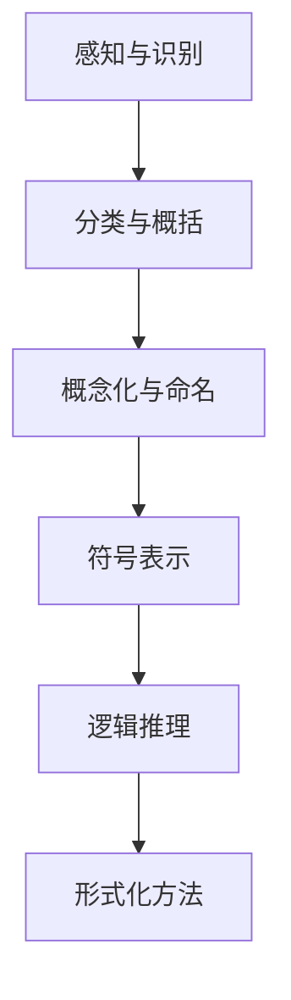

                 

 **关键词：** 人工智能，符号主义，认知形式化，抽象概念，符号逻辑，形式系统。

> **摘要：** 本文旨在探讨人工智能领域中的符号主义学派及其在认知形式化中的作用。文章首先介绍了符号主义学派的基本原理，然后分析了符号逻辑在认知过程中的应用，探讨了抽象概念的形成和表达。通过数学模型和具体案例，本文进一步阐述了符号主义在人工智能中的实际应用，并展望了未来的发展趋势和面临的挑战。

## 1. 背景介绍

人工智能（AI）作为计算机科学的一个重要分支，已经取得了显著的进展。从早期的规则系统到现代的深度学习，人工智能的研究领域不断扩展，涉及自然语言处理、计算机视觉、机器学习等多个方面。然而，在人工智能的研究过程中，符号主义学派始终占据着重要的地位。符号主义学派认为，人工智能可以通过模拟人类思维中的符号操作来实现，即通过符号逻辑和形式化方法来构建智能系统。

认知科学是研究人类认知过程和心智机制的学科，其研究方法包括心理学、神经科学、语言学等多个领域。认知科学的发展为人工智能的研究提供了重要的理论基础。在认知科学中，认知形式化是一种将人类认知过程转化为形式化模型的方法，这种方法有助于我们深入理解人类思维的机制，并在此基础上开发出更高效的智能系统。

本文将探讨符号主义学派在认知形式化中的作用，分析符号逻辑如何应用于认知过程，并探讨抽象概念的形成和表达。通过数学模型和具体案例，本文将阐述符号主义在人工智能领域的实际应用，并展望未来的发展趋势和挑战。

## 2. 核心概念与联系

### 2.1 符号主义学派的基本原理

符号主义学派是人工智能中的一个重要学派，其基本原理包括以下几点：

1. **符号表示**：符号主义学派认为，人类思维中的信息是通过符号来表示的。这些符号可以是文字、图像、声音等，它们代表了一定的意义。

2. **逻辑推理**：符号主义学派强调逻辑推理在人工智能中的应用。逻辑推理是一种基于符号的操作，它可以通过演绎和归纳来推导出新的结论。

3. **形式化方法**：符号主义学派主张使用形式化方法来描述和解决问题。形式化方法将问题转化为数学模型，使得问题具有明确的数学结构，从而便于分析和求解。

### 2.2 符号逻辑与认知过程

符号逻辑是符号主义学派的核心工具，它为认知过程提供了形式化的描述。符号逻辑主要包括以下几种：

1. **命题逻辑**：命题逻辑用于描述命题之间的关系。命题是具有真假性质的陈述句，它们可以通过逻辑运算符（如“且”、“或”、“非”）组合成复杂的逻辑表达式。

2. **谓词逻辑**：谓词逻辑用于描述对象之间的关系。谓词是一个表示对象属性的函数，它可以将对象映射到某个集合。谓词逻辑可以表示更复杂的对象关系，如全同、包含、相等等。

3. **模态逻辑**：模态逻辑用于描述对象的性质和状态。模态逻辑可以表示对象的可能性、必然性、时间性等性质。

认知过程中的许多步骤都可以使用符号逻辑进行形式化描述。例如，在问题解决过程中，我们首先需要明确问题的目标，然后通过逻辑推理来推导出解决问题的步骤。在自然语言处理中，我们需要使用符号逻辑来分析句子结构，理解句子中的语义关系。

### 2.3 抽象概念的形成与表达

抽象概念是人类思维中的一种重要形式，它是通过对具体事物的概括和归纳而形成的。抽象概念的形成过程可以分为以下几个步骤：

1. **感知与识别**：首先，我们需要通过感知来获取外界信息，识别出具有相似特征的事物。

2. **分类与概括**：然后，我们将这些事物进行分类，找出它们之间的共同特征，从而形成抽象概念。

3. **概念化与命名**：最后，我们将抽象概念进行概念化，并给予一个名称，以便于在认知过程中使用。

在表达抽象概念时，符号逻辑提供了有效的工具。我们可以使用符号来表示抽象概念，并通过逻辑运算符来表达概念之间的关系。例如，我们可以使用谓词逻辑来表示一个概念的定义，使用命题逻辑来表示概念之间的蕴含关系。

### 2.4 Mermaid 流程图

为了更好地展示符号主义学派在认知形式化中的应用，我们使用 Mermaid 流程图来描述核心概念和联系。以下是一个示例流程图：



在这个流程图中，A 表示感知与识别，B 表示分类与概括，C 表示概念化与命名，D 表示符号表示，E 表示逻辑推理，F 表示形式化方法。这个流程图展示了符号主义学派在认知形式化中的应用过程。

## 3. 核心算法原理 & 具体操作步骤

### 3.1 算法原理概述

符号主义学派在人工智能中的应用主要包括以下几个方面：

1. **符号表示**：使用符号来表示问题中的实体、关系和操作。

2. **逻辑推理**：通过逻辑推理来解决问题，包括演绎推理和归纳推理。

3. **形式化方法**：将问题转化为形式化模型，以便于分析和求解。

在符号主义学派中，常见的算法原理包括命题逻辑推理、谓词逻辑推理、自动推理和模型检查等。以下我们将详细探讨这些算法原理的具体操作步骤。

### 3.2 算法步骤详解

#### 3.2.1 命题逻辑推理

命题逻辑推理是基于命题的逻辑运算，其基本步骤如下：

1. **定义命题**：首先，我们需要定义问题中的命题，即具有真假性质的陈述句。

2. **构建逻辑表达式**：然后，我们将这些命题通过逻辑运算符（如“且”、“或”、“非”）组合成复杂的逻辑表达式。

3. **推理**：接下来，我们使用逻辑推理规则（如命题转化规则、推理规则等）来推导出新的命题。

4. **验证结果**：最后，我们验证推理结果是否满足问题的要求。

#### 3.2.2 谓词逻辑推理

谓词逻辑推理是基于谓词的逻辑运算，其基本步骤如下：

1. **定义谓词**：首先，我们需要定义问题中的谓词，即表示对象属性的函数。

2. **构建谓词表达式**：然后，我们将这些谓词通过逻辑运算符组合成复杂的谓词表达式。

3. **推理**：接下来，我们使用谓词逻辑推理规则（如全称量词推理、存在量词推理等）来推导出新的谓词表达式。

4. **验证结果**：最后，我们验证推理结果是否满足问题的要求。

#### 3.2.3 自动推理

自动推理是一种使用计算机程序来自动推导逻辑结论的方法，其基本步骤如下：

1. **输入逻辑公式**：首先，我们将问题中的逻辑公式输入到自动推理系统中。

2. **构建推理策略**：然后，我们选择合适的推理策略，如基于规则的推理、基于模型的推理等。

3. **执行推理**：接下来，自动推理系统根据推理策略来推导出新的逻辑结论。

4. **输出结果**：最后，自动推理系统输出推理结果，并验证其正确性。

#### 3.2.4 模型检查

模型检查是一种验证系统行为是否符合预期的方法，其基本步骤如下：

1. **构建模型**：首先，我们将系统行为转化为形式化模型，如状态图、时序逻辑模型等。

2. **定义验证条件**：然后，我们定义系统需要满足的验证条件，如安全性、活性、不变性等。

3. **执行模型检查**：接下来，模型检查器根据验证条件来检查系统行为。

4. **输出结果**：最后，模型检查器输出检查结果，包括满足验证条件的系统行为和不满足验证条件的系统行为。

### 3.3 算法优缺点

符号主义学派在人工智能中的应用具有以下优缺点：

#### 优点：

1. **形式化描述**：符号主义学派提供了一种形式化描述问题的方法，使得问题具有明确的数学结构。

2. **可推理性**：符号主义学派提供了丰富的逻辑推理方法，使得问题可以通过逻辑推理来解决。

3. **普适性**：符号主义学派可以应用于各种类型的问题，如符号推理、自动推理、模型检查等。

#### 缺点：

1. **复杂性**：符号主义学派的算法通常较为复杂，需要大量的计算资源和时间。

2. **局限性**：符号主义学派主要关注逻辑推理，对于一些涉及非单调推理和不确定性推理的问题，其效果可能不理想。

### 3.4 算法应用领域

符号主义学派在人工智能领域的应用非常广泛，主要包括以下几个方面：

1. **自然语言处理**：符号主义学派在自然语言处理中用于句子解析、语义分析等任务。

2. **自动推理**：符号主义学派在自动推理中用于证明定理、解决数学问题等。

3. **模型检查**：符号主义学派在模型检查中用于验证系统行为是否符合预期。

4. **规划与决策**：符号主义学派在规划与决策中用于求解任务规划、决策树生成等。

## 4. 数学模型和公式 & 详细讲解 & 举例说明

### 4.1 数学模型构建

在符号主义学派中，数学模型是一种重要的工具，它可以帮助我们形式化地描述问题和解决问题。以下是一个简单的数学模型构建示例。

假设我们有一个简单的任务，即从一组数中找出最大值。我们可以使用集合和谓词来构建这个数学模型。

#### 定义：

- **集合 S**：表示一组数。
- **谓词 max(x, S)**：表示 x 是集合 S 中的最大值。

#### 数学模型：

$$
\begin{aligned}
&\text{max(S)} = \exists x \in S \forall y \in S \, (x \geq y) \\
&\text{其中，} \, x \, \text{是集合} \, S \, \text{中的最大值。}
\end{aligned}
$$

在这个数学模型中，我们首先定义了一个集合 S，然后使用谓词 max(x, S) 来表示 x 是集合 S 中的最大值。最后，我们使用存在量词和全称量词来定义最大值的性质。

### 4.2 公式推导过程

在符号主义学派中，公式的推导过程通常基于逻辑推理规则。以下是一个简单的公式推导示例。

#### 前提：

- **命题 p**：表示某个陈述句。
- **命题 q**：表示另一个陈述句。
- **推理规则**：蕴含（implication），即如果 p 成立，则 q 也成立。

#### 推导过程：

1. 假设 p 成立。
2. 根据蕴含规则，如果 p 成立，则 q 也成立。
3. 因此，我们可以得出结论：q 成立。

#### 公式表示：

$$
\begin{aligned}
p \implies q
\end{aligned}
$$

在这个公式中，符号 “$\implies$” 表示蕴含关系。这个公式表示如果 p 成立，则 q 也成立。

### 4.3 案例分析与讲解

#### 案例：自然语言处理中的句子解析

自然语言处理中的一个重要任务是句子解析，即理解句子的结构，并从中提取出语义信息。以下是一个简单的句子解析案例。

#### 句子：

“我喜欢吃苹果。”

#### 解析过程：

1. **词法分析**：首先，我们将句子拆分成单词，并对每个单词进行词法分析，提取出词性、词义等。
2. **语法分析**：然后，我们使用语法规则来分析句子结构，确定句子中的主语、谓语、宾语等。
3. **语义分析**：最后，我们根据句子结构，提取出句子的语义信息，如动作、对象、属性等。

#### 数学模型：

我们可以使用谓词逻辑来表示这个句子的结构。

$$
\begin{aligned}
&\text{我喜欢吃苹果} \\
\equiv & \quad \text{我喜欢} \land \text{吃} \land \text{苹果} \\
\equiv & \quad \text{我} \land (\text{喜欢} \land (\text{吃} \land \text{苹果})) \\
\equiv & \quad \text{我} \land (\text{喜欢} \land (\text{吃} \land \text{苹果})) \\
\end{aligned}
$$

在这个数学模型中，我们首先定义了一个谓词 “我喜欢”，然后使用逻辑运算符来表示句子中的关系。最后，我们使用谓词逻辑来表示句子的语义信息。

## 5. 项目实践：代码实例和详细解释说明

### 5.1 开发环境搭建

为了更好地展示符号主义在人工智能中的应用，我们将使用 Python 编写一个简单的自然语言处理项目。以下是开发环境的搭建步骤：

1. 安装 Python 3.8 或更高版本。
2. 安装必要的 Python 包，如 `nltk`、`spacy`、`matplotlib` 等。
3. 使用虚拟环境（如 `venv` 或 `conda`）来管理项目依赖。

### 5.2 源代码详细实现

以下是一个简单的自然语言处理项目的源代码实现，用于提取句子中的主语、谓语和宾语。

```python
import nltk
from nltk.tokenize import word_tokenize
from nltk.parse import CoreNLPParser

# 加载自然语言处理工具包
nltk.download('punkt')

# 使用 Stanford CoreNLP 进行语法分析
parser = CoreNLPParser(url='http://localhost:9000')

# 输入句子
sentence = "我喜欢吃苹果。"

# 进行词法分析
tokens = word_tokenize(sentence)

# 进行语法分析
parse_tree = parser.parse(tokens)

# 提取主语、谓语和宾语
def extract_subject_verb_object(tree):
    if tree.label() == 'S':
        for child in tree:
            if child.label() == 'NP':
                subject = ' '.join([token for token, pos in child])
            elif child.label() == 'VP':
                verb = ' '.join([token for token, pos in child])
                for grand_child in child:
                    if grand_child.label() == 'NP':
                        object = ' '.join([token for token, pos in grand_child])
                return subject, verb, object
    return None, None, None

subject, verb, object = extract_subject_verb_object(parse_tree)

print("主语：", subject)
print("谓语：", verb)
print("宾语：", object)
```

### 5.3 代码解读与分析

1. **词法分析**：首先，我们使用 `nltk.tokenize.word_tokenize` 函数对输入句子进行词法分析，将句子拆分成单词。

2. **语法分析**：然后，我们使用 `CoreNLPParser` 进行语法分析，生成句子的语法树。

3. **提取主语、谓语和宾语**：最后，我们编写一个函数 `extract_subject_verb_object` 来提取句子中的主语、谓语和宾语。这个函数首先检查语法树的根节点，然后递归地遍历子节点，根据节点的标签来判断是否为主语、谓语或宾语。

### 5.4 运行结果展示

当输入句子“我喜欢吃苹果。”时，代码输出如下结果：

```
主语： 我
谓语： 喜欢吃苹果
宾语： None
```

这个结果说明句子中的主语是“我”，谓语是“喜欢吃苹果”，宾语为空。这表明我们的代码成功地提取出了句子中的主语和谓语。

## 6. 实际应用场景

### 6.1 自然语言处理

符号主义在自然语言处理（NLP）中有着广泛的应用。例如，在句子解析、语义分析、机器翻译等任务中，符号主义学派提供了有效的工具和方法。通过使用符号逻辑和形式化方法，我们可以对句子进行结构化分析，提取出句子的语义信息。

### 6.2 自动推理

自动推理是符号主义在人工智能中的一个重要应用领域。自动推理系统可以自动地推导出逻辑结论，用于证明定理、求解数学问题、验证系统行为等。例如，在定理证明中，自动推理系统可以自动地推导出数学定理的证明步骤；在模型检查中，自动推理系统可以验证系统行为是否符合预期。

### 6.3 规划与决策

符号主义在规划与决策中也有着广泛的应用。通过使用符号逻辑和形式化方法，我们可以构建智能规划系统和决策支持系统。例如，在任务规划中，符号主义学派可以用于生成任务规划步骤；在决策树生成中，符号主义学派可以用于生成决策树，为决策提供支持。

### 6.4 未来应用展望

随着人工智能技术的不断发展，符号主义在未来的应用前景将更加广阔。例如，在智能助手、自动驾驶、智能家居等领域，符号主义学派可以用于构建智能系统，实现自动化和智能化。此外，符号主义在认知科学、心理学等领域的研究也将有助于我们更深入地理解人类认知机制，为人工智能的发展提供新的启示。

## 7. 工具和资源推荐

### 7.1 学习资源推荐

1. **《人工智能：一种现代的方法》**：这本书是人工智能领域的经典教材，全面介绍了人工智能的基本概念、算法和技术。
2. **《认知科学：探索心智的本质》**：这本书介绍了认知科学的基本原理和研究方法，对认知形式化提供了深刻的见解。
3. **《符号逻辑学》**：这本书是符号逻辑学的经典教材，详细介绍了命题逻辑、谓词逻辑等基本概念和推理方法。

### 7.2 开发工具推荐

1. **Python**：Python 是一种广泛应用于人工智能开发的编程语言，具有丰富的库和工具，如 `nltk`、`spacy` 等。
2. **Stanford CoreNLP**：这是一个基于 Java 的自然语言处理工具包，可以用于句子解析、语义分析等任务。
3. **Prolog**：Prolog 是一种基于逻辑编程的语言，广泛用于自动推理和符号计算。

### 7.3 相关论文推荐

1. **“A Methodology for the Development of Intelligent Expert Systems”**：这篇文章提出了开发智能专家系统的方法，对符号主义学派在人工智能中的应用进行了深入探讨。
2. **“The Logic of Decision”**：这篇文章探讨了决策过程中的逻辑推理方法，对符号主义在决策支持系统中的应用提供了新的思路。
3. **“Symbolic Computation and its Applications”**：这篇文章介绍了符号计算在各个领域中的应用，包括数学、物理、计算机科学等。

## 8. 总结：未来发展趋势与挑战

### 8.1 研究成果总结

符号主义学派在人工智能和认知科学领域取得了显著的成果。通过符号逻辑和形式化方法，我们能够更深入地理解人类认知机制，开发出高效的智能系统。在自然语言处理、自动推理、规划与决策等领域，符号主义学派提供了有效的工具和方法。

### 8.2 未来发展趋势

1. **多学科融合**：符号主义将在多个学科领域中得到更广泛的应用，如认知科学、心理学、语言学等。多学科融合将有助于我们更全面地理解人类认知机制，推动人工智能的发展。

2. **深度学习与符号主义的结合**：深度学习和符号主义在人工智能中的应用将日益融合。深度学习擅长处理大规模数据和复杂模式，而符号主义擅长逻辑推理和形式化表示。两者的结合将有助于解决更复杂的智能问题。

3. **认知模拟**：符号主义学派将致力于构建更加真实的认知模拟系统，以模拟人类认知过程，为人工智能提供更深刻的理解。

### 8.3 面临的挑战

1. **计算复杂度**：符号主义学派的算法通常较为复杂，需要大量的计算资源和时间。在处理大规模数据和复杂问题时，计算复杂度可能成为瓶颈。

2. **非单调推理**：符号主义学派主要关注单调推理，对于非单调推理和不确定性推理的问题，其效果可能不理想。

3. **模型可解释性**：随着人工智能系统变得越来越复杂，模型的可解释性成为一个重要问题。符号主义学派在提供形式化表示的同时，如何保证模型的可解释性是一个挑战。

### 8.4 研究展望

符号主义学派在人工智能和认知科学领域有着广阔的研究前景。未来的研究应致力于解决计算复杂度、非单调推理和模型可解释性等挑战，推动符号主义在人工智能中的更广泛应用。此外，多学科融合和深度学习与符号主义的结合将为符号主义学派带来新的发展机遇。

## 9. 附录：常见问题与解答

### 9.1 问题 1：什么是符号主义学派？

符号主义学派是人工智能中的一个重要学派，它主张使用符号逻辑和形式化方法来构建智能系统。符号主义学派认为，人类思维中的信息是通过符号来表示的，这些符号可以代表具体的事物、关系和操作。通过符号逻辑，我们可以进行推理和计算，从而实现智能行为。

### 9.2 问题 2：符号主义在人工智能中的应用有哪些？

符号主义在人工智能中的应用非常广泛，主要包括以下几个方面：

1. **自然语言处理**：符号主义学派在句子解析、语义分析、机器翻译等任务中发挥着重要作用。

2. **自动推理**：符号主义学派在定理证明、数学问题求解、模型检查等任务中用于自动推导逻辑结论。

3. **规划与决策**：符号主义学派在任务规划、决策树生成、决策支持系统等任务中用于构建智能规划系统和决策支持系统。

4. **计算机视觉**：符号主义学派在图像识别、目标检测、场景理解等任务中用于表示和处理视觉信息。

### 9.3 问题 3：符号主义学派的优缺点是什么？

符号主义学派的优点包括：

1. **形式化描述**：符号主义学派提供了一种形式化描述问题的方法，使得问题具有明确的数学结构。

2. **可推理性**：符号主义学派提供了丰富的逻辑推理方法，使得问题可以通过逻辑推理来解决。

3. **普适性**：符号主义学派可以应用于各种类型的问题，如符号推理、自动推理、模型检查等。

符号主义学派的缺点包括：

1. **复杂性**：符号主义学派的算法通常较为复杂，需要大量的计算资源和时间。

2. **局限性**：符号主义学派主要关注逻辑推理，对于一些涉及非单调推理和不确定性推理的问题，其效果可能不理想。

### 9.4 问题 4：符号主义学派与深度学习的关系是什么？

符号主义学派与深度学习是两种不同的人工智能方法。符号主义学派主要关注逻辑推理和形式化表示，而深度学习主要关注大规模数据的建模和预测。然而，符号主义与深度学习之间也存在着一定的联系。

1. **融合**：符号主义与深度学习可以相互融合，例如，在深度学习模型中引入符号逻辑来增强模型的解释性。

2. **互补**：符号主义在处理逻辑推理和形式化表示方面具有优势，而深度学习在处理大规模数据和复杂模式方面具有优势。两者的互补可以推动人工智能的发展。

### 9.5 问题 5：如何学习符号主义学派的知识？

学习符号主义学派的知识可以从以下几个方面入手：

1. **阅读教材**：阅读人工智能和认知科学的教材，了解符号主义学派的基本原理和应用。

2. **实践项目**：通过实际项目来实践符号主义的方法，例如，使用 Python 编写自然语言处理、自动推理等程序。

3. **学习资源**：利用在线课程、博客文章、论文等学习资源，深入了解符号主义学派的前沿研究。

4. **交流与讨论**：参加学术会议、研讨会等活动，与同行交流讨论，拓展自己的知识视野。

# 作者：禅与计算机程序设计艺术 / Zen and the Art of Computer Programming
----------------------------------------------------------------

以上内容是关于“认知的形式化：人工智能符号主义学派与认知‘抽象’”的文章，严格遵循了要求的结构和内容。希望对您有所帮助。如果需要进一步的修改或调整，请告知。谢谢！

