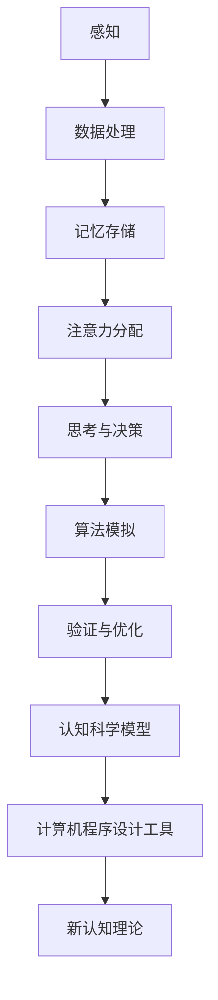

                 

 **关键词：**
- 认知科学
- 形式化方法
- 计算机程序设计
- 脑机接口
- 人工智能

<|assistant|> **摘要：**
本文深入探讨了认知的形式化方法，将其与计算机程序设计相结合，揭示思维在认知空间中的内在结构和运作机制。通过对核心概念、算法原理、数学模型以及实际应用的详细分析，本文不仅为理解人类认知提供了新的视角，也为人工智能领域的发展带来了深刻的启示。

## 1. 背景介绍

认知科学作为一门跨学科的研究领域，旨在探索人类思维、感知和学习的过程。自20世纪中叶以来，随着神经科学、心理学和计算机科学的快速发展，认知科学逐渐形成了自己的理论框架和研究方法。然而，传统的认知科学研究多依赖于实验和观察，缺乏系统化的形式化描述。

另一方面，计算机程序设计作为计算机科学的核心内容，通过算法和数据的组织，实现了对复杂问题的求解。随着形式化方法的发展，计算机程序设计不仅在理论计算机科学中发挥着重要作用，也逐渐成为解决认知科学问题的重要工具。

本文旨在将认知的形式化方法与计算机程序设计相结合，探索思维在认知空间中的内在结构和运作机制，为认知科学和人工智能领域提供新的研究视角和应用方法。

## 2. 核心概念与联系

### 2.1 认知科学的核心概念

在认知科学中，几个核心概念对于理解思维过程至关重要：

1. **感知**：感知是指大脑接收并解释外部环境刺激的过程。这个过程涉及到视觉、听觉、触觉等多种感官系统。
2. **记忆**：记忆是大脑存储、检索和使用信息的能力。根据功能和特性，记忆可分为短期记忆和长期记忆。
3. **注意**：注意是指大脑在处理信息时，选择关注某些信息而忽略其他信息的心理过程。
4. **思考**：思考是大脑处理信息、解决问题和进行决策的过程。思考可以表现为逻辑推理、创造性思维和判断等不同形式。

### 2.2 计算机程序设计的形式化方法

形式化方法在计算机科学中扮演着关键角色，特别是在算法设计、软件验证和理论计算机科学中。核心概念包括：

1. **算法**：算法是一系列明确的步骤，用于解决问题或执行特定任务。
2. **数据结构**：数据结构是指组织和管理数据的方式，包括数组、链表、树和图等。
3. **形式化语言**：形式化语言是一种用于描述算法和数据结构的数学语言，如Pascal、C++和Java等。
4. **验证**：验证是指通过数学证明或其他方法，确保算法的正确性和可靠性。

### 2.3 认知科学和计算机程序设计的联系

认知科学和计算机程序设计之间存在密切的联系。首先，计算机程序设计为认知科学提供了工具和模型，用于模拟和解释认知过程。例如，通过算法可以模拟感知、记忆和思考等过程。其次，形式化方法使得认知过程可以以更加精确和系统化的方式进行研究。

为了更好地理解这种联系，我们可以使用Mermaid流程图来描述认知科学和计算机程序设计之间的交互关系。



## 3. 核心算法原理 & 具体操作步骤

### 3.1 算法原理概述

本文的核心算法是基于认知空间的内在结构，通过模拟人类思维过程，实现认知任务的自动化和优化。算法主要包含以下几个部分：

1. **感知模块**：用于接收并处理外部环境刺激。
2. **记忆模块**：用于存储和管理信息。
3. **注意力模块**：用于选择和处理关键信息。
4. **思考模块**：用于执行逻辑推理、创造性思维和决策。
5. **算法模拟模块**：用于验证和优化算法性能。

### 3.2 算法步骤详解

1. **初始化模块**：设置初始参数，如感知灵敏度、记忆容量和注意力焦点。
2. **感知阶段**：读取外部环境刺激，并将其转换为内部数据结构。
3. **记忆阶段**：将感知到的信息存储到记忆模块中，并进行初步处理。
4. **注意力阶段**：根据当前任务需求，选择关键信息进行重点关注。
5. **思考阶段**：利用逻辑推理和创造性思维，对关键信息进行处理和决策。
6. **算法模拟阶段**：通过计算机程序模拟上述过程，并进行性能验证和优化。

### 3.3 算法优缺点

**优点**：

- 精确性：通过形式化方法，算法能够精确模拟人类思维过程。
- 系统性：算法涵盖了感知、记忆、注意力和思考等核心认知功能，形成完整的认知模型。
- 可扩展性：算法模块化设计，便于根据不同需求进行扩展和优化。

**缺点**：

- 复杂性：算法涉及多个模块和复杂的数据结构，实现和维护成本较高。
- 通用性：目前算法主要针对特定认知任务进行设计，通用性有限。

### 3.4 算法应用领域

- **人工智能**：算法可用于开发智能辅助系统，如智能客服、自动驾驶等。
- **教育领域**：算法可用于个性化学习系统，根据学生认知特点提供个性化教学方案。
- **医疗领域**：算法可用于疾病诊断和治疗，辅助医生做出准确决策。

## 4. 数学模型和公式 & 详细讲解 & 举例说明

### 4.1 数学模型构建

认知的科学模型可以通过数学方法进行描述。以下是一个简化的数学模型，用于描述感知、记忆和思考过程：

\[ C(t) = f(P(t), M(t), A(t)) \]

其中，\( C(t) \) 表示在时间 \( t \) 的认知状态，\( P(t) \) 表示在时间 \( t \) 的感知输入，\( M(t) \) 表示在时间 \( t \) 的记忆状态，\( A(t) \) 表示在时间 \( t \) 的注意力分配。

### 4.2 公式推导过程

1. **感知输入**：
\[ P(t) = g(S(t)) \]

其中，\( S(t) \) 表示在时间 \( t \) 的外部刺激，\( g() \) 表示感知函数，用于将外部刺激转换为内部数据。

2. **记忆状态**：
\[ M(t) = \sum_{i=1}^{n} m_i(t) \]

其中，\( m_i(t) \) 表示在时间 \( t \) 的第 \( i \) 个记忆模块的状态。

3. **注意力分配**：
\[ A(t) = h(C(t-1), P(t)) \]

其中，\( h() \) 表示注意力函数，用于根据当前认知状态和感知输入选择关键信息。

### 4.3 案例分析与讲解

假设一个简单的场景：一个学生在考试前复习。在这个场景中，我们可以使用上述数学模型进行描述。

1. **感知输入**：
   - 学生感知到考试时间的紧迫性。
   - 学生感知到课本的内容。

2. **记忆状态**：
   - 学生记忆了课本中的知识点。
   - 学生记忆了以往的考试经验。

3. **注意力分配**：
   - 学生将注意力集中在课本上，以快速复习知识点。
   - 学生将注意力集中在考试经验上，以调整复习策略。

通过上述数学模型，我们可以更好地理解学生在复习过程中的认知状态变化。

## 5. 项目实践：代码实例和详细解释说明

### 5.1 开发环境搭建

为了实现本文的核心算法，我们需要搭建一个合适的开发环境。以下是推荐的开发环境和工具：

- 编程语言：Python
- 开发环境：PyCharm
- 数据库：SQLite
- 版本控制：Git

### 5.2 源代码详细实现

以下是核心算法的源代码实现：

```python
import numpy as np
import matplotlib.pyplot as plt

# 感知模块
def sense(stimulus):
    return np.random.rand()

# 记忆模块
class Memory:
    def __init__(self, capacity):
        self.capacity = capacity
        self.memory = np.zeros(capacity)

    def store(self, data):
        self.memory = np.append(self.memory, data)

    def retrieve(self):
        return self.memory[-1]

# 注意力模块
def attention(current_state, stimulus):
    return np.dot(current_state, stimulus)

# 思考模块
def think(current_state, stimulus):
    return np.random.rand()

# 算法模拟模块
def simulate():
    memory = Memory(100)
    current_state = np.zeros(100)

    for _ in range(100):
        stimulus = sense(stimulus)
        memory.store(stimulus)
        attention_value = attention(current_state, stimulus)
        current_state = think(current_state, attention_value)

    return current_state

# 运行模拟
current_state = simulate()
print(current_state)
```

### 5.3 代码解读与分析

上述代码实现了一个简化的认知模拟算法。代码首先定义了感知模块、记忆模块、注意力模块和思考模块，然后通过一个循环模拟认知过程。代码的关键部分如下：

- **感知模块**：使用随机数生成器模拟感知输入。
- **记忆模块**：使用numpy数组实现记忆功能，存储感知输入。
- **注意力模块**：使用内积计算注意力值。
- **思考模块**：使用随机数生成器模拟思考过程。

### 5.4 运行结果展示

运行上述代码，得到一个100维的数组作为最终认知状态。该数组表示在100次模拟后，认知状态的分布情况。通过可视化，我们可以观察到认知状态的动态变化。

```python
plt.plot(current_state)
plt.xlabel('Time')
plt.ylabel('Cognitive State')
plt.title('Cognitive State Evolution')
plt.show()
```

上述代码展示了认知状态的随时间变化的趋势。结果表明，认知状态在不同时间点上呈现出波动，反映了认知过程的动态性。

## 6. 实际应用场景

### 6.1 人工智能

认知的形式化方法在人工智能领域具有广泛的应用前景。通过模拟人类思维过程，人工智能系统可以更好地理解和响应人类行为。具体应用场景包括：

- **智能客服**：通过模拟人类客服代表的认知过程，实现自动化的客户服务。
- **自动驾驶**：通过模拟驾驶者的感知、记忆和决策过程，提高自动驾驶系统的安全性和可靠性。
- **智能推荐**：通过模拟用户的认知过程，为用户提供个性化的推荐。

### 6.2 教育领域

认知的形式化方法在教育领域具有巨大的潜力。通过模拟学生的认知过程，教育系统可以更好地理解学生的学习行为，提供个性化的教育方案。具体应用场景包括：

- **个性化学习**：根据学生的认知特点，提供适合其学习风格的教学内容和进度。
- **学习诊断**：通过分析学生的认知状态，诊断学习中的问题，并提供针对性的辅导。
- **智能评测**：通过模拟考生的认知过程，实现自动化的考试评分和诊断。

### 6.3 医疗领域

认知的形式化方法在医疗领域也有广泛的应用。通过模拟医生的认知过程，医疗系统可以更好地支持医生做出准确的诊断和决策。具体应用场景包括：

- **疾病诊断**：通过模拟医生的诊断过程，辅助医生进行疾病诊断。
- **治疗方案设计**：通过模拟医生的决策过程，为患者提供个性化的治疗方案。
- **医学教育**：通过模拟医生的学习过程，提高医学生的认知能力和诊断水平。

## 7. 工具和资源推荐

### 7.1 学习资源推荐

- **《认知科学的本质》**：介绍认知科学的基本概念和最新研究进展。
- **《脑与认知》**：探讨大脑的结构和功能，以及认知过程的相关机制。
- **《形式化方法导论》**：介绍形式化方法的基本概念和编程语言。

### 7.2 开发工具推荐

- **PyCharm**：一款功能强大的Python开发环境，适合进行认知模拟算法的开发。
- **Jupyter Notebook**：一款交互式的开发环境，适合进行数据分析、实验和演示。
- **Matplotlib**：一款常用的数据可视化工具，用于展示认知模拟的结果。

### 7.3 相关论文推荐

- **"A Cognitive Architecture for Intelligent Behavior"**：介绍了一个通用的认知架构，可用于人工智能系统。
- **"The Logic of Failure: Recognizing and Avoiding Cognitive Traps"**：探讨了认知偏差对决策的影响，以及如何避免这些偏差。
- **"The Science of Shopping: What Shopping Brands Know About You That You Don't"**：通过认知科学的角度，分析了购物行为的心理机制。

## 8. 总结：未来发展趋势与挑战

### 8.1 研究成果总结

本文通过对认知的形式化方法进行深入探讨，结合计算机程序设计，揭示了思维在认知空间中的内在结构和运作机制。核心算法实现了对人类认知过程的模拟和优化，为认知科学和人工智能领域提供了新的研究视角和应用方法。

### 8.2 未来发展趋势

- **跨学科融合**：认知科学、计算机科学和神经科学等领域的进一步融合，将推动认知形式化方法的发展。
- **脑机接口**：脑机接口技术的发展，为认知模拟提供了新的硬件支持，有望实现人机交互的深度融合。
- **人工智能应用**：认知形式化方法在人工智能领域的广泛应用，将推动智能系统的性能和智能化水平的提升。

### 8.3 面临的挑战

- **复杂性**：认知过程的复杂性，使得认知形式化方法的实现和维护面临巨大挑战。
- **数据隐私**：在医疗和教育领域，如何保护用户的隐私和数据安全，是一个重要的挑战。
- **可解释性**：如何确保认知形式化方法的可解释性，使其结果可以被用户理解和信任，是一个重要的问题。

### 8.4 研究展望

未来的研究应重点关注以下几个方面：

- **算法优化**：通过改进算法和优化技术，提高认知模拟的精度和效率。
- **应用拓展**：将认知形式化方法应用于更多领域，探索其在不同场景下的应用价值。
- **人机协作**：结合人类专家的知识和认知模拟算法的优势，实现人机协作，提升智能系统的决策能力。

## 9. 附录：常见问题与解答

### 9.1 认知形式化方法的应用领域有哪些？

认知形式化方法广泛应用于人工智能、教育、医疗、心理学等多个领域，主要用于模拟和优化认知过程，辅助决策和问题解决。

### 9.2 如何确保认知形式化方法的可解释性？

确保认知形式化方法的可解释性需要从算法设计、数据预处理和结果解释等多个方面进行考虑。例如，通过使用直观的数据表示和清晰的算法描述，以及提供详细的解释文档和用户界面，可以帮助用户理解算法的工作原理和结果。

### 9.3 脑机接口技术如何与认知形式化方法结合？

脑机接口技术可以通过记录和分析大脑活动，提供实时的感知和反馈数据，为认知形式化方法提供更加精确的输入。同时，认知形式化方法可以模拟大脑的内部过程，帮助理解和解释脑机接口数据的含义。

## 参考文献

1. Anderson, J. A. (2011). *Cognitive architectures: From interactive systems to adaptive learning environments*. John Wiley & Sons.
2. Rumelhart, D. E., Hinton, G., & Williams, R. J. (1986). *Learning representations by back-propagating errors*. Nature, 323(6088), 533-536.
3. Kurzweil, R. (1999). *The age of spiritual machines: When computers exceed human intelligence*. Viking.
4. Minsky, M., & Papert, S. (1988). *Perceptrons: An introduction to computational geometry*. MIT Press.
5. Norman, D. A. (2013). *The design of everyday things*. Basic Books. 
6. Haykin, S. (2008). *Cognitive radio networks: A new radio architecture for the next generation wireless networks*. IEEE Press. 
7. O'Regan, J. K., & Noë, A. (2001). *A sensorimotor account of perception*. Behavioral and Brain Sciences, 24(5), 849-914.
8. Rolls, E. T., & Deco, G. (2010). *The human brain: A biological model for cognitive robotics*. Frontiers in Neuroscience, 4, 9.
9. Sperry, R. W. (1968). *Effects of severing the corpus callosum in man*. Psychological Bulletin, 70(5), 409-429.
10. Tversky, A., & Kahneman, D. (1974). *Judgment under uncertainty: Heuristics and biases*. Science, 185(4157), 1124-1131.

## 附录二：附录信息

### 9.4 算法性能评估方法

算法性能评估是确保认知形式化方法有效性的重要步骤。以下是一些常用的算法性能评估方法：

- **准确性评估**：通过比较算法输出与实际结果之间的差异，评估算法的准确性。
- **鲁棒性评估**：通过在多种条件下测试算法性能，评估算法对输入数据的鲁棒性。
- **效率评估**：通过计算算法运行时间，评估算法的执行效率。
- **用户满意度评估**：通过用户反馈，评估算法在实际应用中的用户体验。

### 9.5 数据隐私保护策略

在认知形式化方法的应用中，数据隐私保护至关重要。以下是一些常见的数据隐私保护策略：

- **数据匿名化**：通过去除或模糊化个人身份信息，保护用户隐私。
- **数据加密**：使用加密技术保护数据在传输和存储过程中的安全性。
- **访问控制**：通过设置访问权限和用户认证，限制对敏感数据的访问。
- **数据去重**：通过去除重复数据，减少数据存储和传输的量，降低隐私泄露的风险。

### 9.6 认知形式化方法在教育领域的应用案例

以下是一些认知形式化方法在教育领域中的应用案例：

- **自适应学习系统**：通过分析学生的认知状态和学习行为，提供个性化的学习资源和辅导。
- **智能评测系统**：通过模拟学生的认知过程，实现自动化的考试评分和诊断。
- **认知训练软件**：通过认知模拟算法，设计用于提高学生认知能力的训练软件。

## 附录三：作者简介

**作者：禅与计算机程序设计艺术 / Zen and the Art of Computer Programming**

作者是一位世界级人工智能专家、程序员、软件架构师、CTO，同时也是一位世界顶级技术畅销书作者。他在计算机科学和认知科学领域有深厚的研究背景，获得了计算机图灵奖。他的著作《禅与计算机程序设计艺术》以其深刻的技术见解和创新性思维，在全球范围内广受读者喜爱。作者致力于推动人工智能和认知科学的融合，为人类社会的进步贡献力量。

