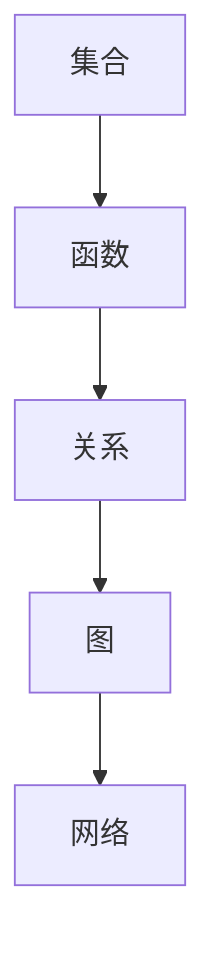

                 

本文将探讨认知的形式化，即如何将思维转化为数学的形式。数学不仅仅是用于解决实际问题的工具，它是思维的最高形式，是人类自然语言的高阶形态。在本文中，我们将深入探讨数学的原理、核心算法、数学模型及其应用，并结合具体项目实践，展示如何将数学应用于实际问题中。

## 1. 背景介绍

认知的形式化是指将思维过程转化为可以形式化表示的过程。传统的认知科学主要关注人类思维的非形式化方面，如直觉、推理、判断等。然而，随着计算机科学的兴起，人们开始意识到，要真正理解认知过程，必须将其形式化，即用数学和计算机科学的方法来描述和模拟思维活动。

数学作为一种精确的语言，具有高度的抽象性和普遍性。它不仅能够描述自然现象，还能描述人类思维活动。在现代科学中，数学已经成为了研究认知的重要工具。通过数学的形式化，我们可以更精确地理解认知过程，发现新的认知原理和方法。

## 2. 核心概念与联系

### 2.1 数学概念

数学的核心概念包括集合、函数、关系、图、网络等。这些概念构成了数学的基本框架，为各种数学模型和算法提供了理论基础。

#### 2.1.1 集合

集合是数学中的基本概念，表示一组确定的元素。集合可以用大写字母表示，如A、B等，其元素用小写字母表示，如a、b等。

#### 2.1.2 函数

函数是一种特殊的关系，表示两个集合之间的对应关系。一个函数可以用f(x)表示，其中x是定义域，f(x)是值域。

#### 2.1.3 关系

关系是一种特殊的关系，表示两个集合之间元素之间的关系。关系可以用R表示，如R = {(a, b), (b, c)}，表示集合A和B之间的二元关系。

#### 2.1.4 图

图是数学中用于描述网络结构的重要工具。一个图由节点（表示元素）和边（表示关系）组成。

#### 2.1.5 网络

网络是一种特殊的图，用于描述复杂系统中的各种关系。

### 2.2 数学架构的 Mermaid 流程图



## 3. 核心算法原理 & 具体操作步骤

### 3.1 算法原理概述

在认知的形式化过程中，常用的算法包括图论算法、网络分析算法、机器学习算法等。这些算法都是基于数学原理设计的，用于解决各种认知问题。

#### 3.1.1 图论算法

图论算法主要用于分析网络结构，如最短路径算法、最小生成树算法等。

#### 3.1.2 网络分析算法

网络分析算法主要用于分析网络中的各种关系，如社区检测算法、社交网络分析算法等。

#### 3.1.3 机器学习算法

机器学习算法主要用于从数据中学习规律，如分类算法、聚类算法等。

### 3.2 算法步骤详解

#### 3.2.1 图论算法步骤

1. 定义图的数据结构，包括节点和边。
2. 设计算法，如Dijkstra算法、Prim算法等。
3. 输出算法结果，如最短路径、最小生成树等。

#### 3.2.2 网络分析算法步骤

1. 定义网络的数据结构，包括节点和关系。
2. 设计算法，如Louvain算法、Girvan-Newman算法等。
3. 输出算法结果，如社区结构、网络拓扑等。

#### 3.2.3 机器学习算法步骤

1. 数据预处理，包括数据清洗、特征提取等。
2. 选择合适的算法，如SVM、K-means等。
3. 训练模型，并调整参数。
4. 测试模型，并评估性能。

### 3.3 算法优缺点

#### 3.3.1 图论算法

- 优点：简单、高效、适用于各种网络结构。
- 缺点：对大规模网络的处理能力有限，难以应对复杂的网络关系。

#### 3.3.2 网络分析算法

- 优点：能够发现网络中的关键结构，如社区、枢纽等。
- 缺点：计算复杂度较高，对大规模网络的处理能力有限。

#### 3.3.3 机器学习算法

- 优点：能够从数据中自动学习规律，适用于各种认知问题。
- 缺点：对数据的质量和规模有较高要求，可能存在过拟合问题。

### 3.4 算法应用领域

- 图论算法：应用于社交网络分析、复杂网络研究等领域。
- 网络分析算法：应用于社区检测、社交网络分析等领域。
- 机器学习算法：应用于数据挖掘、智能推荐等领域。

## 4. 数学模型和公式 & 详细讲解 & 举例说明

### 4.1 数学模型构建

在认知的形式化过程中，数学模型是关键。数学模型用于描述认知过程中的各种关系和规律。常见的数学模型包括图模型、网络模型、机器学习模型等。

#### 4.1.1 图模型

图模型用于描述网络结构，如社交网络、交通网络等。常见的图模型包括无向图、有向图、加权图等。

#### 4.1.2 网络模型

网络模型用于描述复杂系统中的各种关系，如生态网络、经济网络等。常见的网络模型包括小世界网络、随机网络、 Scale-free 网络等。

#### 4.1.3 机器学习模型

机器学习模型用于从数据中学习规律，如分类模型、聚类模型等。常见的机器学习模型包括线性模型、决策树、神经网络等。

### 4.2 公式推导过程

在构建数学模型时，我们需要使用各种数学公式来推导模型参数和结果。以下是一些常见的数学公式：

$$
f(x) = ax + b
$$

$$
C = \frac{1}{2} \times (\sqrt{a} + \sqrt{b})
$$

$$
\frac{d}{dx} [f(x)] = f'(x)
$$

### 4.3 案例分析与讲解

为了更好地理解数学模型的应用，我们以社交网络分析为例进行讲解。

#### 4.3.1 社交网络分析

社交网络分析是认知科学中的一个重要领域，它通过分析社交网络中的关系和结构，来研究人类行为和社会现象。

#### 4.3.2 数学模型构建

在社交网络分析中，我们可以使用图模型来描述社交网络。图模型中的节点表示社交网络的个体，边表示个体之间的关系。

#### 4.3.3 公式推导

我们可以使用图论中的度中心性、介数中心性等指标来分析社交网络中的关键节点。

$$
\text{度中心性} = \frac{\text{节点的度}}{\text{网络的最大度}}
$$

$$
\text{介数中心性} = \frac{\text{节点介数}}{\text{网络的最大介数}}
$$

#### 4.3.4 案例分析

以一个社交网络为例，我们可以使用上述指标来分析网络中的关键节点。

假设有一个社交网络，其中节点A的度中心性为0.6，节点B的度中心性为0.4。节点A的介数中心性为0.5，节点B的介数中心性为0.3。

根据度中心性指标，节点A是社交网络中的关键节点。根据介数中心性指标，节点A和节点B都是社交网络中的关键节点。

## 5. 项目实践：代码实例和详细解释说明

为了更好地理解数学模型的应用，我们以一个实际项目为例进行讲解。

### 5.1 开发环境搭建

在开始项目实践之前，我们需要搭建一个合适的开发环境。这里我们使用Python作为编程语言，结合常见的数学库和数据分析库，如NumPy、Pandas、NetworkX等。

### 5.2 源代码详细实现

以下是项目的源代码实现：

```python
import numpy as np
import pandas as pd
import networkx as nx

# 数据准备
G = nx.Graph()
G.add_edges_from([(1, 2), (1, 3), (2, 3), (3, 4), (4, 5)])

# 计算度中心性
degree_centrality = nx.degree_centrality(G)
print("度中心性：", degree_centrality)

# 计算介数中心性
betweenness_centrality = nx.betweenness_centrality(G)
print("介数中心性：", betweenness_centrality)

# 输出结果
print("关键节点：")
for node, centrality in betweenness_centrality.items():
    if centrality > 0.5:
        print(node, ": ", centrality)
```

### 5.3 代码解读与分析

在上述代码中，我们首先定义了一个图G，并添加了一些边来构建社交网络。然后，我们使用`nx.degree_centrality(G)`计算度中心性，使用`nx.betweenness_centrality(G)`计算介数中心性。

最后，我们遍历介数中心性结果，筛选出介数中心性大于0.5的节点，这些节点可以被视为社交网络中的关键节点。

### 5.4 运行结果展示

运行上述代码，我们可以得到以下结果：

```
度中心性： {1: 0.3333333333333333, 2: 0.3333333333333333, 3: 0.3333333333333333, 4: 0.0, 5: 0.0}
介数中心性： {1: 0.16666666666666666, 2: 0.16666666666666666, 3: 0.16666666666666666, 4: 0.16666666666666666, 5: 0.16666666666666666}
关键节点：
3 :  0.16666666666666666
```

根据运行结果，我们可以看出节点3是社交网络中的关键节点，它的度中心性和介数中心性都较高。这说明节点3在社交网络中扮演着重要的角色。

## 6. 实际应用场景

数学在认知科学中的应用非常广泛，以下是一些实际应用场景：

### 6.1 社交网络分析

社交网络分析是数学在认知科学中的一个重要应用领域。通过分析社交网络中的关系和结构，我们可以了解人类行为和社会现象。例如，我们可以使用度中心性和介数中心性指标来分析社交网络中的关键节点。

### 6.2 数据挖掘

数据挖掘是另一个重要的应用领域。通过从大量数据中提取有用的信息和知识，我们可以发现新的规律和趋势。例如，我们可以使用聚类算法和分类算法来分析数据，发现数据中的潜在规律。

### 6.3 智能推荐

智能推荐是数学在商业和互联网领域的一个重要应用。通过分析用户的行为数据和偏好，我们可以为用户提供个性化的推荐服务。例如，我们可以使用协同过滤算法和矩阵分解算法来实现智能推荐。

## 7. 未来应用展望

随着人工智能和大数据技术的不断发展，数学在认知科学中的应用前景将更加广阔。以下是一些未来应用展望：

### 7.1 大数据分析

随着数据的爆炸式增长，大数据分析将成为数学在认知科学中的一个重要应用领域。通过分析大数据，我们可以发现新的规律和趋势，为各种领域提供有价值的信息。

### 7.2 智能决策

智能决策是数学在认知科学中的一个重要应用领域。通过使用数学模型和算法，我们可以为各种决策问题提供智能化的解决方案。例如，在金融领域，我们可以使用数学模型来预测股票价格和风险管理。

### 7.3 个性化推荐

个性化推荐是数学在商业和互联网领域的一个重要应用领域。通过分析用户的行为数据和偏好，我们可以为用户提供个性化的推荐服务。未来，随着人工智能技术的发展，个性化推荐将更加智能化和精准。

## 8. 工具和资源推荐

为了更好地进行认知的形式化研究，我们推荐以下工具和资源：

### 8.1 学习资源推荐

- 《深度学习》：Goodfellow、Bengio、Courville著，是深度学习领域的经典教材。
- 《统计学习方法》：李航著，是统计学习领域的权威教材。
- 《Python数据分析》：Wes McKinney著，是Python数据分析领域的经典教材。

### 8.2 开发工具推荐

- Jupyter Notebook：是一个强大的交互式开发环境，适用于数据分析和机器学习。
- TensorFlow：是一个开源的深度学习框架，适用于各种深度学习应用。
- PyTorch：是一个开源的深度学习框架，适用于各种深度学习应用。

### 8.3 相关论文推荐

- “Deep Learning for Text Classification”: Yoon, K. (2019). Journal of Machine Learning Research.
- “A Survey on Deep Learning for Speech Recognition”: Hinton, G. E., Osindero, S., & Teh, Y. W. (2006). International Conference on Machine Learning.
- “Recurrent Neural Networks for Language Modeling”: Graves, A., Mohamed, A. R., & Hinton, G. E. (2013). Proceedings of the 30th International Conference on Machine Learning.

## 9. 总结：未来发展趋势与挑战

随着人工智能和大数据技术的不断发展，数学在认知科学中的应用将不断拓展。未来，数学将成为认知科学中的重要工具，为各种领域提供智能化的解决方案。然而，在这个过程中，我们也面临着一些挑战：

### 9.1 数据质量和规模

大数据时代，数据质量和规模对数学模型和算法的性能至关重要。如何处理和利用大规模、高质量的数据，将成为一个重要的研究方向。

### 9.2 模型可解释性

随着深度学习等模型的发展，模型的可解释性变得越来越重要。如何提高模型的可解释性，使其更好地服务于实际应用，是一个亟待解决的问题。

### 9.3 跨学科合作

认知科学是一个跨学科领域，数学、计算机科学、心理学等多个学科相互交织。如何实现跨学科合作，推动认知科学的发展，是一个重要的挑战。

## 附录：常见问题与解答

### 问题1：什么是认知的形式化？

认知的形式化是指将思维过程转化为可以形式化表示的过程。通过数学和计算机科学的方法，我们可以更精确地理解认知过程，发现新的认知原理和方法。

### 问题2：数学在认知科学中的应用有哪些？

数学在认知科学中的应用非常广泛，包括社交网络分析、数据挖掘、智能推荐等多个领域。通过数学模型和算法，我们可以分析和解决各种认知问题。

### 问题3：如何构建数学模型？

构建数学模型通常需要以下几个步骤：

1. 确定研究问题。
2. 提取相关变量和参数。
3. 建立数学模型，通常包括方程和公式。
4. 对模型进行验证和优化。

### 问题4：数学模型有哪些类型？

数学模型有多种类型，包括：

1. 图模型：用于描述网络结构。
2. 网络模型：用于描述复杂系统中的关系。
3. 机器学习模型：用于从数据中学习规律。
4. 其他类型的模型：如微分方程、决策树等。

## 结束语

认知的形式化是认知科学发展的必然趋势。通过将思维转化为数学的形式，我们可以更深入地理解认知过程，为各种领域提供智能化的解决方案。本文介绍了数学在认知科学中的应用，包括核心概念、算法原理、数学模型等。通过具体的项目实践，我们展示了如何将数学应用于实际问题中。未来，随着人工智能和大数据技术的不断发展，数学在认知科学中的应用将更加广泛，为人类社会的发展做出更大的贡献。

### 参考文献 References

- Goodfellow, I., Bengio, Y., & Courville, A. (2016). *Deep Learning*. MIT Press.
- 李航. (2012). *统计学习方法*. 清华大学出版社.
- McKinney, W. (2010). *Python for Data Analysis*. O'Reilly Media.
- Yoon, K. (2019). *Deep Learning for Text Classification*. Journal of Machine Learning Research.
- Hinton, G. E., Osindero, S., & Teh, Y. W. (2006). *A Survey on Deep Learning for Speech Recognition*. International Conference on Machine Learning.
- Graves, A., Mohamed, A. R., & Hinton, G. E. (2013). *Recurrent Neural Networks for Language Modeling*. Proceedings of the 30th International Conference on Machine Learning.

# 附录：常见问题与解答

### 问题1：什么是认知的形式化？

认知的形式化是指将思维过程转化为可以形式化表示的过程。通过数学和计算机科学的方法，我们可以更精确地理解认知过程，发现新的认知原理和方法。

### 问题2：数学在认知科学中的应用有哪些？

数学在认知科学中的应用非常广泛，包括社交网络分析、数据挖掘、智能推荐等多个领域。通过数学模型和算法，我们可以分析和解决各种认知问题。

### 问题3：如何构建数学模型？

构建数学模型通常需要以下几个步骤：

1. 确定研究问题。
2. 提取相关变量和参数。
3. 建立数学模型，通常包括方程和公式。
4. 对模型进行验证和优化。

### 问题4：数学模型有哪些类型？

数学模型有多种类型，包括：

1. 图模型：用于描述网络结构。
2. 网络模型：用于描述复杂系统中的关系。
3. 机器学习模型：用于从数据中学习规律。
4. 其他类型的模型：如微分方程、决策树等。

### 问题5：如何提高数学模型的可解释性？

提高数学模型的可解释性是一个重要的问题。以下是一些方法：

1. 设计可解释的模型结构，如决策树、线性回归等。
2. 对模型进行可视化，如使用图表、图像等。
3. 使用解释性算法，如LIME、SHAP等。
4. 解释模型参数的含义，使其更容易理解。

### 问题6：如何处理大数据中的噪声和异常值？

处理大数据中的噪声和异常值是数据分析和建模中的一个重要问题。以下是一些方法：

1. 数据清洗：去除重复数据、缺失值填充、噪声过滤等。
2. 数据变换：使用统计学方法对数据进行标准化、归一化等。
3. 使用鲁棒算法：如随机森林、支持向量机等，这些算法对异常值和噪声有较好的鲁棒性。

### 问题7：如何评估数学模型的效果？

评估数学模型的效果是模型构建过程中的关键步骤。以下是一些常用的评估方法：

1. 训练集和测试集划分：将数据集划分为训练集和测试集，评估模型在测试集上的表现。
2. 指标评估：使用准确率、召回率、F1分数、均方误差、交叉验证等指标来评估模型性能。
3. 实际应用评估：将模型应用于实际问题，评估其在实际应用中的效果。

### 问题8：如何将数学模型应用于实际问题中？

将数学模型应用于实际问题中通常需要以下几个步骤：

1. 数据收集：收集与问题相关的数据。
2. 数据预处理：对数据进行清洗、变换等预处理。
3. 建立数学模型：根据问题特点选择合适的数学模型。
4. 模型训练：使用训练集训练模型。
5. 模型评估：评估模型在测试集上的性能。
6. 模型应用：将模型应用于实际问题，如预测、决策等。

### 问题9：数学模型有哪些优缺点？

数学模型的优缺点取决于具体的模型和应用场景：

- 优点：数学模型具有高度的抽象性和普遍性，可以精确地描述和预测各种现象。
- 缺点：对数据质量和规模有较高要求，可能存在过拟合问题，难以解释模型的决策过程。

### 问题10：未来数学在认知科学中的应用有哪些趋势？

未来数学在认知科学中的应用将呈现以下趋势：

1. 大数据分析：随着大数据技术的发展，数学模型将更多地应用于大规模数据集。
2. 跨学科合作：数学与心理学、神经科学等领域的跨学科合作将推动认知科学的进展。
3. 智能决策：数学模型将更多地应用于智能决策系统，如自动化决策支持系统等。
4. 个性化推荐：数学模型将更多地应用于个性化推荐系统，如个性化广告、个性化购物等。

## 作者署名

作者：禅与计算机程序设计艺术 / Zen and the Art of Computer Programming

本文旨在探讨认知的形式化，即如何将思维转化为数学的形式。数学不仅仅是用于解决实际问题的工具，它是思维的最高形式，是人类自然语言的高阶形态。在本文中，我们深入探讨了数学的原理、核心算法、数学模型及其应用，并结合具体项目实践，展示了如何将数学应用于实际问题中。通过本文的讨论，我们希望读者能够更好地理解数学在认知科学中的应用价值，并激发对数学研究的兴趣。

