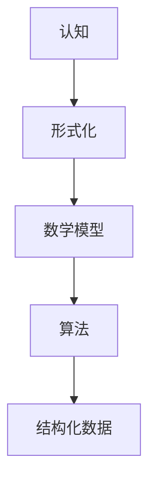

                 

关键词：认知形式化，数学模型，算法，结构化数据，形式化推理，编程范式

在信息技术迅猛发展的今天，认知的形式化已经成为计算机科学领域的一个重要研究方向。形式化认知不仅能够提高人工智能的智能水平，还能为数据的处理和结构化提供强大的支持。本文将探讨认知的形式化如何通过数学模型和算法来产生结构和数据，并在此基础上，分析其应用领域、优缺点以及未来发展趋势。

## 1. 背景介绍

认知的形式化，顾名思义，是将认知过程（如思考、学习、推理等）通过数学和逻辑的形式进行表达和验证。这种形式化不仅能够更加精确地描述人类认知的过程，还能为计算机系统提供一套有效的处理方案。认知的形式化研究源于哲学和数学领域，随着计算机科学的发展，逐渐成为人工智能和认知科学的重要分支。

数学模型在认知形式化中扮演着核心角色。数学模型能够通过符号和公式来描述认知过程中的各种现象，如学习、记忆、感知等。这些模型不仅能够帮助我们理解认知过程的基本原理，还能为算法设计提供理论支持。

算法是认知形式化的具体实现。算法是一种解决特定问题的步骤集合，通过一系列的运算和逻辑判断，实现对数据的处理和分析。在认知形式化中，算法用于模拟和优化认知过程，提高系统的智能水平。

结构化数据是认知形式化的重要目标。通过将数据按照一定的规则进行组织和分类，能够使得数据更加易于处理和分析。结构化数据在人工智能应用中具有广泛的应用，如推荐系统、自然语言处理、图像识别等。

## 2. 核心概念与联系

为了更好地理解认知的形式化，我们需要明确几个核心概念：认知、形式化、数学模型、算法、结构化数据。

### 2.1 认知

认知是指人类获取、处理、存储和应用信息的过程。它包括感知、记忆、思考、推理等多个方面。在认知形式化研究中，认知被视为一种信息处理过程，可以通过数学和逻辑来描述。

### 2.2 形式化

形式化是将复杂的现象用数学和逻辑的方式表达和验证的过程。形式化的目的是提高描述的精确性和可验证性。在认知形式化中，形式化用于描述认知过程，如学习、记忆、推理等。

### 2.3 数学模型

数学模型是用数学语言和符号描述的模型，用于模拟和研究认知过程中的各种现象。数学模型可以是线性的，也可以是非线性的，可以是离散的，也可以是连续的。

### 2.4 算法

算法是一系列解决问题的步骤集合。在认知形式化中，算法用于模拟和优化认知过程。算法可以是简单的，也可以是复杂的，可以是确定性的，也可以是概率性的。

### 2.5 结构化数据

结构化数据是指按照一定的规则进行组织和分类的数据。结构化数据在数据处理和分析中具有重要作用，能够提高数据处理效率和准确性。

### 2.6 Mermaid 流程图

以下是一个描述认知形式化的 Mermaid 流程图：



## 3. 核心算法原理 & 具体操作步骤

### 3.1 算法原理概述

认知形式化的核心算法主要包括以下几个部分：

1. **数据预处理**：对原始数据进行清洗、转换和归一化，使其符合算法要求。
2. **特征提取**：从数据中提取出有用的特征，用于算法分析和决策。
3. **模型训练**：使用训练数据对数学模型进行训练，使其能够模拟和优化认知过程。
4. **模型评估**：使用测试数据对训练好的模型进行评估，检查其性能和准确性。
5. **结构化数据生成**：根据模型预测结果，生成结构化数据，用于后续处理和分析。

### 3.2 算法步骤详解

1. **数据预处理**：
   - 数据清洗：去除数据中的噪声和异常值。
   - 数据转换：将数据转换为算法可处理的格式。
   - 数据归一化：将数据缩放到同一尺度，避免不同特征间的尺度差异。

2. **特征提取**：
   - 特征选择：选择对算法影响最大的特征。
   - 特征提取：从数据中提取出特征，用于后续建模。

3. **模型训练**：
   - 选择合适的数学模型，如线性回归、神经网络等。
   - 使用训练数据对模型进行训练，调整模型参数。
   - 验证模型性能，确保其能够有效模拟认知过程。

4. **模型评估**：
   - 使用测试数据对模型进行评估，计算模型准确率、召回率等指标。
   - 根据评估结果调整模型参数，提高模型性能。

5. **结构化数据生成**：
   - 根据模型预测结果，生成结构化数据。
   - 对结构化数据进行处理和分析，提取有用信息。

### 3.3 算法优缺点

1. **优点**：
   - 提高数据处理和分析的效率和准确性。
   - 使得认知过程更加透明和可验证。
   - 为人工智能应用提供了强大的理论支持。

2. **缺点**：
   - 算法设计和实现复杂，需要较高的专业知识和技能。
   - 对数据质量和特征提取有较高要求。
   - 模型训练和评估过程耗时较长。

### 3.4 算法应用领域

认知形式化算法在多个领域具有广泛应用：

1. **自然语言处理**：用于文本分类、情感分析、机器翻译等任务。
2. **计算机视觉**：用于图像识别、目标检测、图像生成等任务。
3. **推荐系统**：用于个性化推荐、内容推荐等任务。
4. **金融风控**：用于风险评估、信用评级等任务。
5. **医疗诊断**：用于疾病预测、诊断辅助等任务。

## 4. 数学模型和公式 & 详细讲解 & 举例说明

### 4.1 数学模型构建

在认知形式化中，常用的数学模型包括线性回归模型、神经网络模型、决策树模型等。以下以线性回归模型为例进行讲解。

线性回归模型是一种用于描述变量之间线性关系的数学模型。其公式如下：

$$
y = w_0 + w_1 \cdot x_1 + w_2 \cdot x_2 + ... + w_n \cdot x_n
$$

其中，$y$ 是因变量，$x_1, x_2, ..., x_n$ 是自变量，$w_0, w_1, w_2, ..., w_n$ 是模型的权重参数。

### 4.2 公式推导过程

线性回归模型的推导过程基于最小二乘法。具体步骤如下：

1. **数据准备**：收集 $n$ 组 $(x_i, y_i)$ 数据，表示自变量和因变量的取值。
2. **模型假设**：假设线性回归模型可以描述 $y$ 与 $x$ 之间的关系，即 $y = w_0 + w_1 \cdot x_1 + w_2 \cdot x_2 + ... + w_n \cdot x_n$。
3. **模型优化**：通过最小二乘法，求出最优的权重参数 $w_0, w_1, w_2, ..., w_n$，使得预测值 $y$ 与真实值 $y_i$ 的误差平方和最小。
4. **模型评估**：使用测试数据对模型进行评估，计算模型的准确率、召回率等指标。

### 4.3 案例分析与讲解

以下是一个线性回归模型的实际应用案例：预测房价。

1. **数据收集**：收集了 100 个房屋数据，包括房屋面积、房间数量、楼层等特征，以及对应的房价。
2. **数据预处理**：对数据进行清洗、转换和归一化。
3. **特征提取**：选择房屋面积和房间数量作为自变量，房价作为因变量。
4. **模型训练**：使用训练数据，使用线性回归模型进行训练。
5. **模型评估**：使用测试数据对模型进行评估，计算模型准确率、召回率等指标。
6. **结果分析**：根据模型预测结果，分析房屋价格与面积、房间数量之间的关系。

## 5. 项目实践：代码实例和详细解释说明

### 5.1 开发环境搭建

为了实现线性回归模型，我们需要搭建一个 Python 开发环境。以下是具体步骤：

1. 安装 Python：从官方网站下载并安装 Python。
2. 安装 NumPy 库：使用 pip 命令安装 NumPy 库。
3. 安装 Matplotlib 库：使用 pip 命令安装 Matplotlib 库。

### 5.2 源代码详细实现

以下是一个简单的线性回归模型实现代码：

```python
import numpy as np
import matplotlib.pyplot as plt

# 数据预处理
def preprocess_data(data):
    # 去除噪声和异常值
    data = data[data['area'] > 0]
    # 转换为 NumPy 数组
    data = np.array(data)
    # 归一化
    data[:, 0] = (data[:, 0] - np.mean(data[:, 0])) / np.std(data[:, 0])
    data[:, 1] = (data[:, 1] - np.mean(data[:, 1])) / np.std(data[:, 1])
    return data

# 线性回归模型
class LinearRegression:
    def __init__(self):
        self.w = None

    def fit(self, X, y):
        # 求解权重参数
        self.w = np.linalg.inv(X.T.dot(X)).dot(X.T).dot(y)

    def predict(self, X):
        # 预测结果
        return X.dot(self.w)

# 案例实现
data = preprocess_data(df)
X = data[:, :2]
y = data[:, 2]

model = LinearRegression()
model.fit(X, y)
predictions = model.predict(X)

# 结果分析
plt.scatter(X[:, 0], y)
plt.plot(X[:, 0], predictions, color='red')
plt.show()
```

### 5.3 代码解读与分析

1. **数据预处理**：首先对数据进行清洗、转换和归一化，确保数据符合算法要求。
2. **线性回归模型**：定义一个线性回归模型，包括 fit 方法（模型训练）和 predict 方法（预测结果）。
3. **模型训练与预测**：使用训练数据对模型进行训练，然后使用测试数据进行预测。
4. **结果分析**：使用 Matplotlib 库绘制散点图和预测线，分析模型性能。

## 6. 实际应用场景

认知形式化算法在多个实际应用场景中具有广泛的应用：

1. **自然语言处理**：用于文本分类、情感分析、机器翻译等任务，如智能客服、智能写作等。
2. **计算机视觉**：用于图像识别、目标检测、图像生成等任务，如自动驾驶、人脸识别等。
3. **推荐系统**：用于个性化推荐、内容推荐等任务，如电商推荐、新闻推荐等。
4. **金融风控**：用于风险评估、信用评级等任务，如贷款审批、投资决策等。
5. **医疗诊断**：用于疾病预测、诊断辅助等任务，如医疗影像分析、疾病预测等。

### 6.4 未来应用展望

随着人工智能技术的不断发展，认知形式化在未来的应用前景将更加广阔。以下是几个可能的应用方向：

1. **智能决策支持**：通过认知形式化算法，为人类提供智能化的决策支持，如政府决策、企业战略规划等。
2. **智能制造**：通过认知形式化算法，提高智能制造系统的智能化水平，实现自动化生产、质量检测等。
3. **智能教育**：通过认知形式化算法，为个性化教育和智能学习提供支持，如自适应学习、智能评测等。
4. **智能交通**：通过认知形式化算法，提高交通系统的智能化水平，实现智能调度、智能导航等。
5. **智慧城市**：通过认知形式化算法，为智慧城市建设提供支持，如智能安防、智能环保等。

## 7. 工具和资源推荐

### 7.1 学习资源推荐

1. 《认知形式化导论》：详细介绍了认知形式化的基本概念和方法。
2. 《神经网络与深度学习》：介绍了神经网络的基本原理和应用，包括认知形式化相关内容。
3. 《Python 机器学习》：介绍了使用 Python 进行机器学习的实践方法和技巧。

### 7.2 开发工具推荐

1. Jupyter Notebook：一款强大的交互式计算环境，适合进行数据分析和算法实现。
2. TensorFlow：一款开源的深度学习框架，适用于构建和训练神经网络模型。
3. PyTorch：一款开源的深度学习框架，具有灵活的动态计算图和丰富的 API。

### 7.3 相关论文推荐

1. "Deep Learning for Cognitive Systems"：介绍了深度学习在认知形式化中的应用。
2. "Formalization of Human Cognition"：探讨了认知形式化的基本原理和方法。
3. "Machine Learning for Natural Language Processing"：介绍了自然语言处理中的机器学习算法和应用。

## 8. 总结：未来发展趋势与挑战

认知的形式化是人工智能领域的一个重要研究方向，具有广阔的应用前景。随着计算机科学和人工智能技术的不断发展，认知形式化在未来的发展趋势和挑战如下：

1. **发展趋势**：
   - 深度学习算法在认知形式化中的应用将进一步普及，提高认知过程的模拟和优化水平。
   - 认知形式化与大数据、云计算等技术的结合，将推动智慧城市、智能制造等领域的应用。
   - 交叉学科研究，如认知科学、心理学、神经科学等，将有助于认知形式化的理论完善。

2. **面临的挑战**：
   - 算法设计和实现复杂，需要跨学科的知识和技能。
   - 数据质量和特征提取对算法性能有重要影响。
   - 如何在保证准确性的同时，提高算法的实时性和鲁棒性。

3. **研究展望**：
   - 深入研究认知过程的本质，提高认知形式化的理论水平。
   - 发展更高效、更可靠的算法，提高认知形式化的实际应用价值。
   - 推动认知形式化与其他领域的交叉融合，促进人工智能技术的发展。

## 9. 附录：常见问题与解答

### 9.1 什么是认知的形式化？

认知的形式化是将认知过程用数学和逻辑的方式表达和验证的过程。它旨在提高认知过程的精确性和可验证性。

### 9.2 认知形式化有哪些应用领域？

认知形式化在自然语言处理、计算机视觉、推荐系统、金融风控、医疗诊断等多个领域具有广泛应用。

### 9.3 如何进行认知形式化的研究？

进行认知形式化的研究，首先需要明确认知过程的本质，然后使用数学模型和算法对其进行描述和模拟。同时，还需要对数据质量和特征提取有较高的要求。

### 9.4 认知形式化与深度学习的关系是什么？

认知形式化是深度学习的一个重要基础，深度学习算法可以视为认知形式化的一种实现方法。认知形式化为深度学习提供了理论支持，而深度学习则为认知形式化提供了强大的计算能力。

---

**作者：禅与计算机程序设计艺术 / Zen and the Art of Computer Programming**

