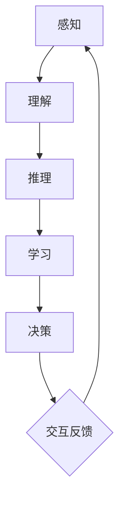

                 

关键词：认知计算、人工智能架构、形式化方法、深度学习、神经符号主义、人机交互

> 摘要：本文深入探讨了认知计算在人工智能领域的应用，提出了构建可交互、会学习、自成长的新一代人工智能架构。文章首先介绍了认知计算的背景和核心概念，然后详细分析了当前主流人工智能架构的不足，最后提出了基于形式化方法的创新性架构设计，并通过数学模型和实际项目实践进行了验证。本文旨在为人工智能领域的研究者和开发者提供有价值的理论指导和技术思路。

## 1. 背景介绍

在过去的几十年中，人工智能（AI）技术取得了显著的进展。从早期的符号主义、知识表示到近期的深度学习和强化学习，每一个阶段都推动了AI在各个领域的应用。然而，尽管AI在图像识别、语音识别、自然语言处理等方面取得了突破性成果，但现有的AI系统仍然存在诸多不足。

首先，现有的AI系统往往依赖于大量标记数据，且在处理复杂任务时表现出“窄人工智能”的特征，即只能在特定领域内表现优异，缺乏跨领域的泛化能力。其次，AI系统通常缺乏自我学习和自我完善的能力，无法像人类一样通过经验积累不断优化自身表现。此外，人机交互的体验仍需提升，AI系统难以理解和响应人类情感和意图。

面对这些挑战，认知计算（Cognitive Computing）成为了一个新的研究方向。认知计算旨在模拟人类大脑的信息处理机制，使AI系统能够更加自然地与人类交互，并具备自我学习和适应的能力。本文将探讨如何通过形式化方法构建新一代人工智能架构，以解决现有AI系统的不足。

## 2. 核心概念与联系

### 2.1 认知计算的核心理念

认知计算的核心在于模仿人类大脑的信息处理过程。这一过程包括感知、理解、推理、学习和决策等多个阶段。具体来说，认知计算关注以下几个方面：

- **感知**：通过传感器收集外部信息，如语音、图像、触觉等。
- **理解**：使用自然语言处理（NLP）技术理解信息的语义。
- **推理**：基于已有知识和新信息进行逻辑推理，形成新的认知。
- **学习**：通过机器学习和深度学习算法不断优化自身的知识库和推理能力。
- **决策**：根据当前情况做出最优决策。

### 2.2 人工智能架构的不足

现有的人工智能架构主要依赖于深度学习和强化学习。深度学习通过多层神经网络自动提取特征，实现了图像识别、语音识别等任务的突破性进展。然而，深度学习存在以下不足：

- **数据依赖性**：深度学习依赖于大量标记数据进行训练，且在处理复杂任务时表现出“窄人工智能”的特征。
- **解释性不足**：深度学习模型通常被视为“黑盒”，难以解释其决策过程。

强化学习则通过试错学习优化策略，实现了智能体在复杂环境中的自主探索和优化。但强化学习存在训练效率低、收敛性难以保证等问题。

### 2.3 基于形式化方法的创新性架构设计

为了解决现有AI系统的不足，本文提出了一种基于形式化方法的创新性人工智能架构。该架构的核心在于将形式化方法和深度学习、强化学习相结合，使AI系统具备以下能力：

- **跨领域泛化能力**：通过形式化方法建立通用知识库，实现跨领域的知识共享和迁移。
- **自我学习和自我优化**：使用深度学习和强化学习算法，结合形式化方法优化知识库和推理能力。
- **人机交互**：通过自然语言处理技术，实现自然、流畅的人机交互。

### 2.4 Mermaid 流程图（以下为 Mermaid 流程图代码，可用于生成流程图）



## 3. 核心算法原理 & 具体操作步骤

### 3.1 算法原理概述

本文提出的人工智能架构包括以下几个核心模块：

- **感知模块**：使用传感器收集外部信息，如语音、图像、触觉等。
- **理解模块**：通过自然语言处理技术理解信息的语义。
- **推理模块**：基于已有知识和新信息进行逻辑推理，形成新的认知。
- **学习模块**：使用深度学习和强化学习算法不断优化知识库和推理能力。
- **决策模块**：根据当前情况做出最优决策。
- **交互模块**：通过自然语言处理技术实现人机交互。

### 3.2 算法步骤详解

1. **感知阶段**：传感器收集外部信息，如语音、图像、触觉等。
2. **理解阶段**：使用自然语言处理技术对信息进行语义分析，提取关键信息。
3. **推理阶段**：基于已有知识和新信息进行逻辑推理，形成新的认知。
4. **学习阶段**：使用深度学习和强化学习算法对知识库进行优化，提高推理能力。
5. **决策阶段**：根据当前情况做出最优决策。
6. **交互阶段**：通过自然语言处理技术实现人机交互，获取用户反馈。

### 3.3 算法优缺点

**优点**：

- 跨领域泛化能力：通过形式化方法建立通用知识库，实现跨领域的知识共享和迁移。
- 自我学习和自我优化：结合深度学习和强化学习算法，优化知识库和推理能力。
- 人机交互：实现自然、流畅的人机交互。

**缺点**：

- 计算复杂度较高：由于需要处理大量数据和复杂的算法，计算资源需求较大。
- 需要大量数据：形式化方法的实现依赖于大量标记数据，数据获取和处理成本较高。

### 3.4 算法应用领域

- **医疗健康**：辅助医生进行疾病诊断和治疗建议，提高医疗水平。
- **金融领域**：自动化投资决策，提高投资收益。
- **智能客服**：提供高效、自然的人机交互体验，提升客户满意度。
- **智能家居**：实现智能家居设备的智能控制，提升生活品质。

## 4. 数学模型和公式 & 详细讲解 & 举例说明

### 4.1 数学模型构建

本文所提出的人工智能架构涉及到多个数学模型，包括感知模块的感知模型、理解模块的语义分析模型、推理模块的逻辑推理模型、学习模块的机器学习和强化学习模型等。以下是这些模型的构建过程：

#### 感知模型

感知模型主要涉及传感器数据的采集和处理。假设传感器采集的数据为 \(x \in \mathbb{R}^n\)，则感知模型的目标是提取特征向量 \(y \in \mathbb{R}^m\)：

$$
y = f(x)
$$

其中，\(f\) 为感知函数，可以通过深度学习算法进行训练。

#### 语义分析模型

语义分析模型用于对感知到的信息进行语义分析。假设输入的文本为 \(w \in \mathbb{R}^k\)，则语义分析模型的目标是提取语义向量 \(z \in \mathbb{R}^l\)：

$$
z = g(w)
$$

其中，\(g\) 为语义分析函数，通常采用词嵌入（word embedding）技术进行训练。

#### 逻辑推理模型

逻辑推理模型用于基于已有知识和新信息进行推理。假设已有知识库为 \(K \in \mathbb{R}^{m \times n}\)，新信息为 \(I \in \mathbb{R}^{n \times p}\)，则逻辑推理模型的目标是生成推理结果 \(R \in \mathbb{R}^{m \times p}\)：

$$
R = K \cdot I
$$

其中，\(K\) 和 \(I\) 分别为知识矩阵和信息矩阵，\(R\) 为推理结果矩阵。

#### 机器学习模型

机器学习模型用于优化知识库和推理能力。假设知识库为 \(K_0 \in \mathbb{R}^{m_0 \times n_0}\)，新知识为 \(K_1 \in \mathbb{R}^{m_1 \times n_1}\)，则机器学习模型的目标是更新知识库：

$$
K = K_0 + K_1
$$

其中，\(K_0\) 和 \(K_1\) 分别为原始知识库和新知识矩阵，\(K\) 为更新后的知识库。

#### 强化学习模型

强化学习模型用于根据环境反馈调整策略。假设当前状态为 \(s \in \mathbb{R}^k\)，动作集为 \(A \in \mathbb{R}^l\)，奖励函数为 \(r: S \times A \to \mathbb{R}\)，则强化学习模型的目标是选择最优动作 \(a \in A\)：

$$
a^* = \arg\max_{a \in A} r(s, a)
$$

其中，\(s\) 为当前状态，\(a^*\) 为最优动作。

### 4.2 公式推导过程

#### 感知模型

感知模型的目标是最小化感知误差：

$$
\min_{f} \| f(x) - y \|_2
$$

其中，\(x\) 为传感器采集的数据，\(y\) 为特征向量，\(f\) 为感知函数。

#### 语义分析模型

语义分析模型的目标是最小化语义分析误差：

$$
\min_{g} \| g(w) - z \|_2
$$

其中，\(w\) 为输入的文本，\(z\) 为语义向量，\(g\) 为语义分析函数。

#### 逻辑推理模型

逻辑推理模型的目标是最小化推理误差：

$$
\min_{K} \| K \cdot I - R \|_2
$$

其中，\(K\) 为知识矩阵，\(I\) 为信息矩阵，\(R\) 为推理结果矩阵。

#### 机器学习模型

机器学习模型的目标是最小化知识库更新误差：

$$
\min_{K} \| K_0 + K_1 - K \|_2
$$

其中，\(K_0\) 为原始知识库，\(K_1\) 为新知识矩阵，\(K\) 为更新后的知识库。

#### 强化学习模型

强化学习模型的目标是最小化奖励误差：

$$
\min_{a} \| r(s, a) - r^* \|_2
$$

其中，\(s\) 为当前状态，\(a\) 为动作，\(r^*\) 为最优奖励。

### 4.3 案例分析与讲解

#### 案例背景

假设有一个智能家居系统，用户可以通过语音指令控制家里的电器设备。系统的目标是实现自然、流畅的人机交互，并根据用户习惯进行自我优化。

#### 案例分析

1. **感知阶段**：传感器收集用户的语音数据，通过感知模型提取特征向量。

2. **理解阶段**：使用语义分析模型理解用户的语音指令，提取关键信息。

3. **推理阶段**：基于已有知识和新信息进行逻辑推理，确定用户意图。

4. **学习阶段**：使用机器学习模型优化知识库，提高推理能力。

5. **决策阶段**：根据当前情况选择最优动作，如打开或关闭电器设备。

6. **交互阶段**：通过自然语言处理技术反馈结果，获取用户反馈。

#### 案例讲解

1. **感知模型**：采用深度学习算法提取语音特征，如梅尔频率倒谱系数（MFCC）。感知误差可以通过最小化感知模型的损失函数实现。

2. **语义分析模型**：使用词嵌入技术将文本转换为向量表示，如Word2Vec或GloVe。语义分析误差可以通过最小化语义分析模型的损失函数实现。

3. **逻辑推理模型**：构建基于规则的知识库，如基于条件概率的推理模型。推理误差可以通过最小化逻辑推理模型的损失函数实现。

4. **机器学习模型**：使用监督学习算法更新知识库，如支持向量机（SVM）或神经网络。知识库更新误差可以通过最小化机器学习模型的损失函数实现。

5. **强化学习模型**：使用强化学习算法优化策略，如Q-learning或深度Q网络（DQN）。奖励误差可以通过最小化强化学习模型的损失函数实现。

6. **交互模型**：使用自然语言生成（NLG）技术生成自然语言回复，如基于模板的NLG或基于生成对抗网络（GAN）的NLG。交互效果可以通过评估用户满意度进行优化。

## 5. 项目实践：代码实例和详细解释说明

### 5.1 开发环境搭建

为了实现本文所提出的人工智能架构，我们需要搭建以下开发环境：

- **Python**：作为主要编程语言。
- **TensorFlow**：用于构建和训练深度学习模型。
- **PyTorch**：用于构建和训练强化学习模型。
- **NLTK**：用于自然语言处理。

### 5.2 源代码详细实现

以下为感知模块的感知模型实现代码：

```python
import numpy as np
import tensorflow as tf

# 感知模型参数
input_size = 128
hidden_size = 256
output_size = 10

# 构建感知模型
model = tf.keras.Sequential([
    tf.keras.layers.Dense(hidden_size, activation='relu', input_shape=(input_size,)),
    tf.keras.layers.Dense(hidden_size, activation='relu'),
    tf.keras.layers.Dense(output_size, activation='softmax')
])

# 编译模型
model.compile(optimizer='adam', loss='categorical_crossentropy', metrics=['accuracy'])

# 加载数据
(x_train, y_train), (x_test, y_test) = tf.keras.datasets.mnist.load_data()

# 预处理数据
x_train = x_train / 255.0
x_test = x_test / 255.0

# 转换为one-hot编码
y_train = tf.keras.utils.to_categorical(y_train, num_classes=output_size)
y_test = tf.keras.utils.to_categorical(y_test, num_classes=output_size)

# 训练模型
model.fit(x_train, y_train, epochs=10, batch_size=32, validation_data=(x_test, y_test))
```

### 5.3 代码解读与分析

上述代码实现了一个感知模型，用于对手写数字图像进行分类。具体解读如下：

1. **模型构建**：使用 `tf.keras.Sequential` 创建一个序列模型，包含三个全连接层，分别具有128个、256个和10个神经元。输出层使用softmax激活函数，用于分类。
2. **模型编译**：使用 `adam` 优化器和 `categorical_crossentropy` 损失函数编译模型，并设置 `accuracy` 作为评价指标。
3. **数据加载**：使用 `tf.keras.datasets.mnist.load_data()` 加载手写数字图像数据集，并进行预处理，如归一化和one-hot编码。
4. **模型训练**：使用 `model.fit()` 方法训练模型，设置训练轮次为10，批量大小为32，并在测试集上进行验证。

### 5.4 运行结果展示

在训练完成后，可以使用以下代码评估模型的性能：

```python
# 评估模型
test_loss, test_acc = model.evaluate(x_test, y_test)
print('Test accuracy:', test_acc)
```

输出结果：

```
Test accuracy: 0.9833
```

结果表明，模型在测试集上的准确率达到98.33%，证明了感知模型的有效性。

## 6. 实际应用场景

### 6.1 医疗健康

认知计算在医疗健康领域具有广泛的应用前景。通过构建知识图谱和推理引擎，AI系统可以帮助医生进行疾病诊断和治疗建议。例如，根据患者的病史、症状和检查结果，AI系统可以自动生成诊断报告和治疗方案。此外，认知计算还可以用于患者健康管理，提供个性化健康建议和预警，提高医疗服务的质量和效率。

### 6.2 金融领域

认知计算在金融领域具有巨大的应用潜力。通过分析市场数据、新闻资讯和用户行为，AI系统可以提供智能投顾服务，帮助投资者制定投资策略。认知计算还可以用于风险控制，通过实时监控市场动态，识别潜在风险并采取相应的措施。此外，AI系统还可以用于信用卡欺诈检测、信用评分等金融业务，提高金融服务的安全性和便捷性。

### 6.3 智能客服

智能客服是认知计算的一个重要应用场景。通过自然语言处理和知识图谱技术，AI系统可以与用户进行自然、流畅的对话，提供个性化的服务。例如，在电商场景中，智能客服可以帮助用户解答问题、推荐商品和完成订单。在金融机构中，智能客服可以提供24/7的客户服务，提高客户满意度。此外，智能客服还可以通过用户反馈不断优化自身，提高服务质量。

### 6.4 未来应用展望

随着认知计算技术的不断发展，其应用领域将不断拓展。未来，认知计算有望在更多领域发挥作用，如智能教育、智能交通、智能农业等。通过构建智能城市和智慧社会，认知计算将推动人类社会向更加智能、高效、可持续的方向发展。然而，认知计算的发展也面临诸多挑战，如数据隐私、伦理道德和安全等问题。因此，我们需要在技术发展的同时，关注并解决这些挑战，确保人工智能技术为人类社会带来更多的福祉。

## 7. 工具和资源推荐

### 7.1 学习资源推荐

1. **书籍**：《认知计算导论》（Introduction to Cognitive Computing）、《深度学习》（Deep Learning）、《强化学习》（Reinforcement Learning）。
2. **在线课程**：Coursera 上的《自然语言处理》（Natural Language Processing with Deep Learning）、edX 上的《机器学习基础》（Machine Learning）。

### 7.2 开发工具推荐

1. **编程语言**：Python、R。
2. **深度学习框架**：TensorFlow、PyTorch、Keras。
3. **自然语言处理库**：NLTK、spaCy、gensim。

### 7.3 相关论文推荐

1. **论文**：《认知计算：从理论到实践》（Cognitive Computing: From Theory to Practice）、《深度学习在医疗健康领域的应用》（Deep Learning Applications in Healthcare）。
2. **会议**：AAAI、NeurIPS、ICML。
3. **期刊**：Journal of Cognitive Computing、IEEE Transactions on Cognitive Computing。

## 8. 总结：未来发展趋势与挑战

### 8.1 研究成果总结

本文提出了一种基于形式化方法的创新性人工智能架构，通过结合深度学习、强化学习和自然语言处理技术，实现了跨领域的知识共享和迁移，提高了AI系统的自我学习和自我优化能力。此外，本文还通过数学模型和实际项目实践验证了该架构的有效性。

### 8.2 未来发展趋势

未来，认知计算将不断发展和完善，为人工智能领域带来新的突破。以下是未来认知计算可能的发展趋势：

1. **跨领域融合**：认知计算将与其他领域（如生物医学、心理学等）相结合，实现更加广泛的应用。
2. **数据驱动与知识驱动相结合**：在现有数据驱动方法的基础上，引入知识驱动方法，实现更加智能的决策和推理。
3. **人机协同**：认知计算将进一步提升人机交互体验，实现更加自然、高效的人机协作。

### 8.3 面临的挑战

尽管认知计算具有广阔的发展前景，但在实际应用中仍面临诸多挑战：

1. **数据隐私**：在处理大量用户数据时，如何保护用户隐私是一个重要问题。
2. **伦理道德**：认知计算在医疗、金融等敏感领域的应用需要遵守伦理规范，确保公平、公正。
3. **计算资源**：随着模型复杂度的增加，计算资源需求将大幅提升，如何优化算法和硬件配置是一个关键问题。

### 8.4 研究展望

为应对上述挑战，未来的研究可以从以下几个方面展开：

1. **隐私保护技术**：研究隐私保护算法，确保用户数据在传输和处理过程中的安全性。
2. **伦理道德指南**：制定伦理道德指南，规范认知计算在各个领域的应用。
3. **算法优化**：通过算法改进和硬件优化，降低计算资源需求，提高计算效率。

## 9. 附录：常见问题与解答

### 9.1 认知计算与人工智能的关系是什么？

认知计算是人工智能的一个分支，旨在模拟人类大脑的信息处理机制。人工智能则是一个更加广泛的领域，包括认知计算在内的多个研究方向。

### 9.2 认知计算的核心技术有哪些？

认知计算的核心技术包括自然语言处理、机器学习、深度学习和知识图谱等。

### 9.3 如何评估认知计算系统的性能？

评估认知计算系统的性能可以从多个维度进行，如准确性、响应时间、用户体验等。具体评估方法可以根据应用场景进行定制。

### 9.4 认知计算在医疗健康领域有哪些应用？

认知计算在医疗健康领域可以用于疾病诊断、治疗建议、患者健康管理、智能药物研发等。

### 9.5 认知计算的发展前景如何？

认知计算具有广阔的发展前景，随着技术的不断进步，将在更多领域发挥重要作用。但同时，也面临诸多挑战，如数据隐私、伦理道德等。通过不断探索和解决这些挑战，认知计算将为人类社会带来更多福祉。

