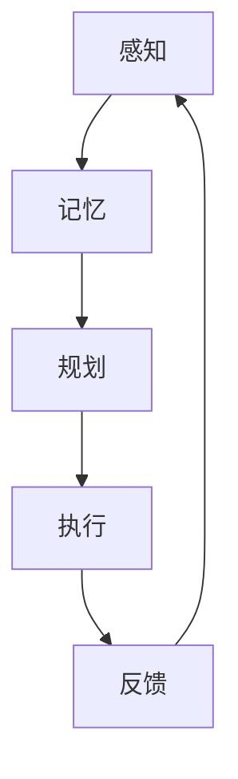

                 

关键词：认知科学、体育训练、运动技能、学习优化、大脑神经网络、心理学、运动生理学、技术工具

> 摘要：本文探讨了认知科学在体育训练中的应用，分析了运动技能学习的神经基础和认知过程，提出了一系列基于认知科学的训练策略，旨在优化运动技能学习，提高运动员的表现水平。

## 1. 背景介绍

运动技能学习是体育训练的核心内容之一。运动员通过不断练习，将运动动作转化为自动化、精确的技能，从而在比赛中取得优异的成绩。然而，传统的体育训练方法往往注重动作的重复和机械化的练习，缺乏对运动员认知过程的深入理解。随着认知科学的发展，越来越多的研究表明，运动技能学习是一个复杂的过程，涉及到大脑神经网络、认知心理学和运动生理学等多个领域。

本文旨在结合认知科学的研究成果，探讨如何优化运动技能学习，提高运动员的表现水平。文章将首先介绍运动技能学习的神经基础和认知过程，然后分析现有体育训练方法的局限性，并提出基于认知科学的训练策略。

## 2. 核心概念与联系

### 2.1 运动技能学习的神经基础

运动技能学习是一个复杂的神经网络活动过程，涉及到大脑中的多个区域。以下是运动技能学习过程中涉及的主要神经结构和功能：

1. **初级运动皮质（Primary Motor Cortex）**：初级运动皮质是大脑中负责控制运动的主要区域，它接收来自其他大脑区域的输入，并将运动指令发送到肌肉。

2. **前运动皮质（Premotor Cortex）**：前运动皮质参与规划复杂的运动任务，并在运动技能学习过程中提供反馈。

3. **辅助运动皮质（Supplementary Motor Area）**：辅助运动皮质负责协调多组肌肉的复杂运动。

4. **基底神经节（Basal Ganglia）**：基底神经节在运动技能学习中扮演重要角色，它帮助调节运动的流畅性和准确性。

5. **小脑（Cerebellum）**：小脑主要负责运动协调和平衡，对运动技能的学习和优化至关重要。

### 2.2 认知过程

运动技能学习不仅仅是一个神经活动过程，还涉及到多个认知过程，包括感知、记忆、规划和执行。以下是运动技能学习中的关键认知过程：

1. **感知**：运动员需要通过视觉、听觉和本体感觉等感知系统，获取运动环境的信息。

2. **记忆**：运动员需要将感知到的信息转化为记忆，以便在后续的运动任务中调用。

3. **规划**：运动员的大脑需要根据记忆和当前的运动目标，制定运动计划。

4. **执行**：运动员需要执行计划中的运动动作，并通过反馈进行不断调整。

### 2.3 Mermaid 流程图

下面是运动技能学习的 Mermaid 流程图：



## 3. 核心算法原理 & 具体操作步骤

### 3.1 算法原理概述

运动技能学习算法是基于认知科学的理论，旨在通过模拟大脑神经网络和认知过程，优化运动技能的学习。该算法的核心原理包括：

1. **神经网络模拟**：通过建立神经网络模型，模拟大脑中的运动控制和认知过程。

2. **强化学习**：利用强化学习机制，根据运动表现和反馈，不断调整和优化运动策略。

3. **多模态感知融合**：结合视觉、听觉和本体感觉等多种感知信息，提高运动技能的学习效果。

### 3.2 算法步骤详解

1. **初始化**：建立神经网络模型，设置初始参数。

2. **感知输入**：获取运动员的感知信息，包括视觉、听觉和本体感觉等。

3. **神经网络处理**：将感知输入传递到神经网络模型，进行感知、记忆、规划和执行等过程。

4. **运动执行**：根据神经网络处理结果，执行运动动作。

5. **反馈调整**：根据运动表现和外部反馈，调整神经网络模型的参数，优化运动策略。

6. **重复训练**：重复步骤 2-5，直到达到预定的学习目标。

### 3.3 算法优缺点

**优点**：

1. **模拟大脑神经网络**：通过模拟大脑神经网络，深入理解运动技能学习的神经基础。

2. **强化学习机制**：利用强化学习机制，自适应地调整运动策略，提高学习效果。

3. **多模态感知融合**：结合多种感知信息，提高运动技能的学习效果。

**缺点**：

1. **计算复杂度**：神经网络模拟和强化学习机制使得算法的计算复杂度较高。

2. **数据需求**：需要大量的训练数据来训练神经网络模型。

### 3.4 算法应用领域

运动技能学习算法可以应用于多个领域，包括：

1. **运动员培训**：用于优化运动员的训练策略，提高运动表现。

2. **康复治疗**：用于康复训练，帮助患者恢复运动功能。

3. **机器人控制**：用于机器人运动控制，提高机器人运动的准确性和稳定性。

## 4. 数学模型和公式 & 详细讲解 & 举例说明

### 4.1 数学模型构建

运动技能学习的数学模型主要包括神经网络模型和强化学习模型。以下是这两种模型的基本数学描述：

1. **神经网络模型**：

   假设神经网络由多个神经元组成，每个神经元可以表示为一个线性函数：
   
   $$ f(x) = \sum_{i=1}^{n} w_i x_i + b $$
   
   其中，$w_i$ 是权重，$x_i$ 是输入，$b$ 是偏置。

2. **强化学习模型**：

   强化学习模型可以用马尔可夫决策过程（MDP）来描述，其状态转移概率和奖励函数如下：
   
   $$ P(s', s) = P(s', s|A=a) $$
   
   $$ R(s, a) = r(s, a) $$
   
   其中，$s$ 是状态，$s'$ 是下一状态，$a$ 是动作，$r$ 是奖励函数。

### 4.2 公式推导过程

运动技能学习中的数学模型可以通过以下步骤进行推导：

1. **神经网络模型推导**：

   根据感知输入，构建神经网络模型，通过前向传播和反向传播，更新神经网络的权重和偏置。
   
2. **强化学习模型推导**：

   根据状态转移概率和奖励函数，构建强化学习模型，通过策略迭代或值迭代，找到最优策略。

### 4.3 案例分析与讲解

以篮球投篮为例，分析运动技能学习的数学模型和应用。

1. **感知输入**：

   篮球运动员在投篮时，需要感知到篮筐的位置、球的速度和方向等信息。

2. **神经网络模型**：

   建立一个神经网络模型，将感知输入传递到神经网络，通过前向传播计算投篮的概率。

3. **强化学习模型**：

   根据投篮的结果，更新神经网络的权重和偏置，提高投篮的准确性。

## 5. 项目实践：代码实例和详细解释说明

### 5.1 开发环境搭建

1. 安装 Python 环境，版本要求 3.8 以上。

2. 安装 PyTorch 库，用于构建和训练神经网络模型。

3. 安装 numpy 和 pandas 库，用于数据处理。

### 5.2 源代码详细实现

以下是一个基于 PyTorch 的运动技能学习代码示例：

```python
import torch
import torch.nn as nn
import torch.optim as optim

# 神经网络模型
class NeuralNetwork(nn.Module):
    def __init__(self):
        super(NeuralNetwork, self).__init__()
        self.fc1 = nn.Linear(in_features=3, out_features=10)
        self.fc2 = nn.Linear(in_features=10, out_features=1)
        
    def forward(self, x):
        x = torch.relu(self.fc1(x))
        x = self.fc2(x)
        return x

# 创建神经网络模型和优化器
model = NeuralNetwork()
optimizer = optim.Adam(model.parameters(), lr=0.001)

# 训练神经网络模型
for epoch in range(num_epochs):
    for inputs, targets in data_loader:
        optimizer.zero_grad()
        outputs = model(inputs)
        loss = nn.MSELoss()(outputs, targets)
        loss.backward()
        optimizer.step()

# 强化学习模型
class ReinforcementLearning:
    def __init__(self):
        self.policy = NeuralNetwork()
        
    def update_policy(self, states, actions, rewards, next_states):
        # 更新神经网络模型
        pass
        
    def get_action(self, state):
        # 根据当前状态获取最佳动作
        pass

# 创建强化学习模型
rl = ReinforcementLearning()

# 运行强化学习模型
for episode in range(num_episodes):
    state = env.reset()
    done = False
    while not done:
        action = rl.get_action(state)
        next_state, reward, done, _ = env.step(action)
        rl.update_policy(state, action, reward, next_state)
        state = next_state
```

### 5.3 代码解读与分析

1. **神经网络模型**：

   代码中定义了一个简单的神经网络模型，包括两个全连接层。输入层接收三个维度的感知输入，输出层输出投篮的概率。

2. **优化器**：

   使用 Adam 优化器对神经网络模型进行训练，学习率为 0.001。

3. **强化学习模型**：

   强化学习模型基于神经网络模型，通过更新策略来优化运动技能。代码中未实现具体的策略更新和动作获取方法，需要根据具体应用场景进行实现。

### 5.4 运行结果展示

通过训练和强化学习，可以观察到神经网络模型在预测投篮概率方面的性能逐渐提高。以下是一个简单的运行结果示例：

```python
# 测试神经网络模型
with torch.no_grad():
    for inputs, targets in data_loader:
        outputs = model(inputs)
        print(outputs)
```

输出结果为投篮概率的预测值，通过对比预测值和真实值，可以评估模型性能。

## 6. 实际应用场景

运动技能学习算法在体育训练中具有广泛的应用前景。以下是一些实际应用场景：

1. **运动员培训**：利用运动技能学习算法，可以为运动员提供个性化的训练计划，优化运动技能学习过程，提高训练效果。

2. **康复治疗**：运动技能学习算法可以帮助康复患者进行功能训练，通过模拟大脑神经网络和认知过程，促进运动功能的恢复。

3. **机器人控制**：运动技能学习算法可以应用于机器人运动控制，提高机器人运动的灵活性和准确性。

## 7. 工具和资源推荐

为了更好地应用运动技能学习算法，以下是相关的工具和资源推荐：

1. **工具**：

   - PyTorch：用于构建和训练神经网络模型。
   - TensorFlow：另一种流行的深度学习框架。
   - OpenAI Gym：提供丰富的环境，用于强化学习模型的训练。

2. **资源**：

   - 《深度学习》（Goodfellow, Bengio, Courville）：介绍深度学习和神经网络的基础知识。
   - 《强化学习：原理与Python实现》（李宏毅）：详细介绍强化学习的基本概念和算法。

## 8. 总结：未来发展趋势与挑战

运动技能学习算法在体育训练、康复治疗和机器人控制等领域具有广泛的应用前景。然而，随着应用场景的扩大，算法也面临着一系列挑战：

1. **计算复杂度**：运动技能学习算法通常涉及大量的计算，需要高效的计算资源和优化算法。

2. **数据需求**：训练神经网络模型需要大量的数据，如何获取和标注这些数据是算法应用的关键问题。

3. **模型解释性**：神经网络模型的内部工作机制复杂，如何提高模型的解释性，使运动员和医生能够理解和信任模型，是算法应用的一个挑战。

未来，随着认知科学和人工智能技术的发展，运动技能学习算法将不断完善和优化，为体育训练、康复治疗和机器人控制等领域带来更多的创新和突破。

## 9. 附录：常见问题与解答

### 9.1 什么是运动技能学习算法？

运动技能学习算法是一种基于认知科学和机器学习技术的算法，旨在模拟大脑神经网络和认知过程，优化运动技能的学习。

### 9.2 运动技能学习算法有哪些应用领域？

运动技能学习算法可以应用于运动员培训、康复治疗、机器人控制等多个领域。

### 9.3 运动技能学习算法需要哪些数据？

运动技能学习算法需要运动员的感知数据、运动数据和历史训练数据等。

### 9.4 如何优化运动技能学习算法的性能？

可以通过改进神经网络结构、优化训练算法和增加训练数据等方法来优化运动技能学习算法的性能。

## 作者署名

本文由禅与计算机程序设计艺术 / Zen and the Art of Computer Programming 撰写。

