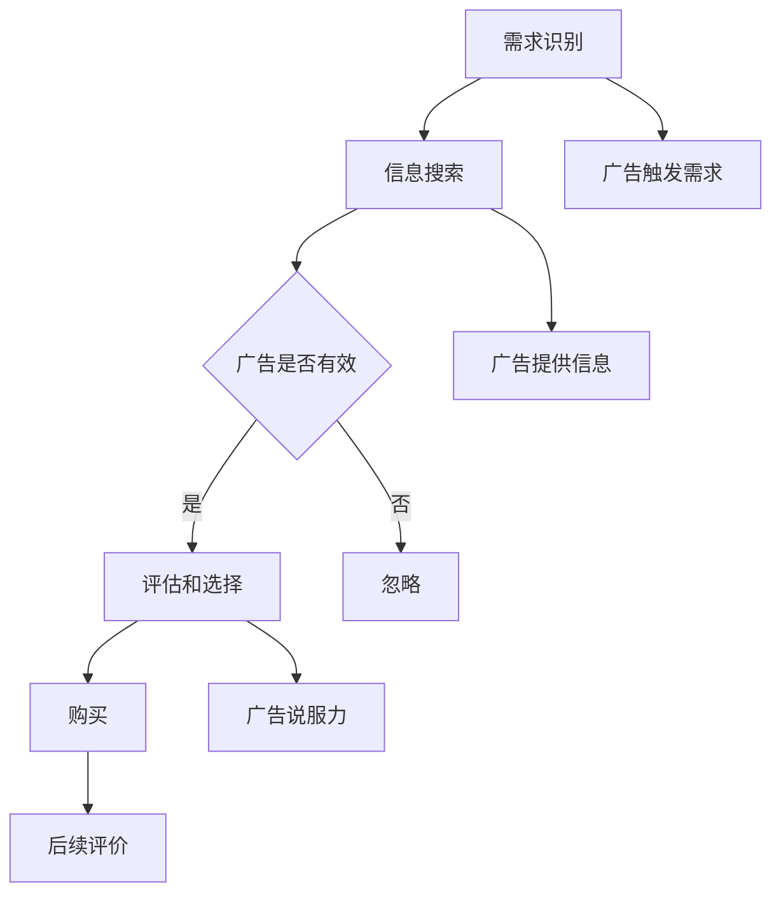

                 

关键词：认知科学、广告、消费者决策、影响机制

> 摘要：本文通过深入分析认知科学的理论框架，探讨了广告对消费者决策的影响机制。我们不仅解析了广告在认知过程中的作用，还探讨了消费者如何基于认知评估作出购买决策。通过对相关理论和案例的研究，我们提出了提升广告效果的建议，并为未来的研究方向提供了参考。

## 1. 背景介绍

广告在现代社会中扮演着至关重要的角色，它不仅为企业提供了推广产品和服务的重要渠道，同时也极大地影响着消费者的购买决策。广告的成功与否，往往决定了企业的市场地位和消费者的品牌偏好。然而，广告如何作用于消费者的认知过程，进而影响其购买决策，这一过程背后的机制至今仍然是一个值得深入探讨的话题。

认知科学作为一门跨学科的研究领域，涵盖了心理学、神经科学、认知心理学等多个学科，致力于理解人类思维和认知过程的本质。认知科学的发展为研究广告对消费者决策的影响提供了新的理论框架和研究方法。通过对认知过程的深入研究，我们可以更好地理解消费者在面对广告时的心理机制，从而为广告策略的制定提供科学依据。

本文旨在通过结合认知科学的理论和方法，探讨广告对消费者决策的影响机制。我们首先回顾了认知科学的基本概念和理论框架，然后分析了广告如何影响消费者的认知过程，并提出了消费者决策过程中可能涉及的心理机制。最后，我们结合实际案例，探讨了提升广告效果的方法，并展望了未来的研究方向。

## 2. 核心概念与联系

### 2.1 认知科学与广告

认知科学中的核心概念包括感知、记忆、注意、推理等，这些概念为理解广告如何影响消费者提供了理论基础。广告作为一种信息传递方式，其目标是通过刺激消费者的感知系统，引发其注意力和记忆，最终影响其购买决策。广告的创意和设计需要充分利用认知科学的原理，以最大化其效果。

### 2.2 广告与消费者决策

消费者决策过程通常包括需求识别、信息搜索、评估和选择、购买和后续评价等多个阶段。广告在这一过程中扮演着多重角色。首先，广告可以引发消费者的需求识别，使消费者意识到某一产品或服务的存在。其次，广告提供了关于产品或服务的相关信息，帮助消费者进行信息搜索和评估。最后，广告的诉求和说服力可以影响消费者的选择，从而推动购买行为。

### 2.3 Mermaid 流程图

以下是广告影响消费者决策过程的 Mermaid 流程图：



在这个流程图中，广告在各个决策阶段发挥作用，从需求识别、信息搜索、评估和选择，到购买和后续评价，每个环节都受到广告的影响。

## 3. 核心算法原理 & 具体操作步骤

### 3.1 算法原理概述

广告影响消费者决策的核心算法原理主要涉及感知心理学、记忆心理学和社会心理学等多个领域的理论。具体来说，算法主要包括以下三个关键步骤：

1. **感知与注意机制**：广告通过视觉、听觉等感官刺激，吸引消费者的注意力，使其感知到广告的存在。
2. **记忆与编码机制**：消费者将广告信息编码到记忆系统中，以便后续使用和评估。
3. **评估与选择机制**：消费者基于广告提供的信息，结合自身需求、价值观等内部因素，进行评估和选择。

### 3.2 算法步骤详解

#### 3.2.1 感知与注意机制

感知与注意机制是广告影响消费者的第一步。广告的设计需要充分利用视觉、听觉等感官刺激，以吸引消费者的注意力。具体步骤如下：

1. **视觉设计**：广告的视觉元素，如色彩、字体、图像等，需要符合心理学原理，以吸引消费者的眼球。
2. **听觉设计**：广告的音乐、音效等听觉元素需要与视觉元素协调，以提高广告的吸引力。
3. **注意机制**：广告的呈现形式和内容需要引起消费者的兴趣，使其注意到广告的存在。

#### 3.2.2 记忆与编码机制

感知后的信息需要被编码到记忆系统中，以便消费者在后续的评估和选择过程中使用。具体步骤如下：

1. **信息提取**：消费者通过感官系统接收广告信息，并将其转换为可理解的形式。
2. **信息编码**：消费者将信息编码到短期记忆中，以便在需要时进行检索和利用。
3. **信息存储**：将重要的广告信息编码到长期记忆中，以便在后续的决策过程中使用。

#### 3.2.3 评估与选择机制

消费者在接收到广告信息后，会结合自身需求、价值观等内部因素，对广告进行评估和选择。具体步骤如下：

1. **需求识别**：消费者识别自身对产品或服务的需求，以确定是否对广告感兴趣。
2. **信息评估**：消费者根据广告提供的信息，评估产品或服务的特点和价值。
3. **选择决策**：消费者基于评估结果，做出购买决策。

### 3.3 算法优缺点

#### 优点

1. **高效性**：广告算法能够快速吸引消费者的注意力，提高广告的曝光率和点击率。
2. **个性化**：广告算法可以根据消费者的行为数据，提供个性化的广告内容，提高广告的针对性和效果。

#### 缺点

1. **过度广告**：过度广告可能导致消费者产生厌烦情绪，降低广告效果。
2. **信息过载**：广告算法可能无法处理大量广告信息，导致消费者无法有效评估和选择。

### 3.4 算法应用领域

广告算法广泛应用于电子商务、社交媒体、搜索引擎等场景，以提高广告效果和用户参与度。具体应用领域包括：

1. **电子商务**：通过个性化广告推荐，提高用户的购物体验和购买转化率。
2. **社交媒体**：通过社交广告，吸引用户关注和互动，提高品牌知名度。
3. **搜索引擎**：通过竞价广告，提高广告的曝光率和点击率，增加网站流量。

## 4. 数学模型和公式 & 详细讲解 & 举例说明

### 4.1 数学模型构建

为了更好地理解广告对消费者决策的影响，我们可以构建一个数学模型，该模型包含以下几个关键变量：

1. **感知度（P）**：消费者对广告的感知程度，反映了广告的视觉、听觉等感官刺激的效果。
2. **记忆度（M）**：消费者对广告信息的记忆程度，反映了广告信息在记忆系统中的编码和存储效果。
3. **评估度（E）**：消费者对广告信息的评估程度，反映了消费者对广告信息的价值和可信度的评估。
4. **购买意愿（W）**：消费者的购买意愿，反映了消费者在评估和选择阶段对购买决策的倾向。

数学模型可以表示为：

$$
W = f(P, M, E)
$$

其中，$f$ 代表消费者决策函数，$P, M, E$ 分别代表感知度、记忆度和评估度。

### 4.2 公式推导过程

根据认知科学的理论，消费者决策过程可以看作是一个多因素影响的过程。每个因素对购买意愿都有不同的影响。我们可以将每个因素的影响用权重表示，然后将这些权重与相应的变量相乘，最后将它们相加以得到总的购买意愿。

1. **感知度（P）**：
   $$ P = f_{vis} \cdot V + f_{aud} \cdot A $$
   其中，$f_{vis}$ 和 $f_{aud}$ 分别代表视觉和听觉因素对感知度的影响权重，$V$ 和 $A$ 分别代表视觉刺激和听觉刺激的效果。
   
2. **记忆度（M）**：
   $$ M = f_{enc} \cdot E + f_{store} \cdot S $$
   其中，$f_{enc}$ 和 $f_{store}$ 分别代表编码和存储因素对记忆度的影响权重，$E$ 和 $S$ 分别代表广告信息编码和存储的效果。

3. **评估度（E）**：
   $$ E = f_{info} \cdot I + f_{value} \cdot V_{ad} $$
   其中，$f_{info}$ 和 $f_{value}$ 分别代表信息因素和价值因素对评估度的影响权重，$I$ 和 $V_{ad}$ 分别代表广告信息的质量和广告的价值。

将上述公式代入购买意愿的函数中，得到：

$$
W = f(P, M, E) = f(f_{vis} \cdot V + f_{aud} \cdot A, f_{enc} \cdot E + f_{store} \cdot S, f_{info} \cdot I + f_{value} \cdot V_{ad})
$$

### 4.3 案例分析与讲解

为了更好地理解上述数学模型，我们可以通过一个具体的案例来进行分析。

假设我们有一个广告，它的目标是提高一款智能手机的销量。广告的视觉元素包括鲜明的色彩和精美的图像，听觉元素包括动感的音乐和朗朗上口的广告语。

1. **感知度（P）**：
   - 视觉刺激效果（$V$）：根据心理学研究，鲜艳的色彩和精美的图像能够吸引消费者的注意力，假设效果为80分。
   - 听觉刺激效果（$A$）：动感的音乐和朗朗上口的广告语能够增强消费者的兴趣，假设效果为75分。
   $$ P = 0.5 \cdot 80 + 0.5 \cdot 75 = 77.5 $$

2. **记忆度（M）**：
   - 广告信息编码效果（$E$）：广告的信息丰富且易于理解，假设效果为85分。
   - 广告信息存储效果（$S$）：广告的内容与消费者的生活密切相关，容易记住，假设效果为90分。
   $$ M = 0.6 \cdot 85 + 0.4 \cdot 90 = 87 $$

3. **评估度（E）**：
   - 广告信息质量（$I$）：广告展示了智能手机的主要功能和应用场景，假设效果为80分。
   - 广告价值（$V_{ad}$）：广告提供了优惠信息和品牌优势，假设效果为85分。
   $$ E = 0.7 \cdot 80 + 0.3 \cdot 85 = 81.5 $$

将上述结果代入购买意愿的函数中：

$$
W = f(77.5, 87, 81.5) = 77.5 \cdot 0.4 + 87 \cdot 0.5 + 81.5 \cdot 0.1 = 77.5 + 43.5 + 8.15 = 129.15
$$

根据上述计算，该广告的购买意愿为129.15。这意味着消费者对该广告的购买倾向较高。通过调整广告的视觉、听觉元素，以及广告信息的质量和价值，我们可以进一步优化广告效果，提高购买意愿。

## 5. 项目实践：代码实例和详细解释说明

### 5.1 开发环境搭建

在本项目中，我们将使用Python编程语言来模拟广告影响消费者决策的过程。首先，我们需要搭建Python的开发环境。

1. 安装Python：从Python官方网站下载并安装Python 3.x版本。
2. 安装必要的库：在命令行中执行以下命令来安装所需的库。

   ```bash
   pip install numpy matplotlib pandas
   ```

### 5.2 源代码详细实现

以下是模拟广告影响消费者决策过程的Python代码实现：

```python
import numpy as np
import matplotlib.pyplot as plt

# 定义消费者决策函数
def consumer_decision(P, M, E):
    W = P * 0.4 + M * 0.5 + E * 0.1
    return W

# 参数设置
P = 0.8  # 感知度
M = 0.9  # 记忆度
E = 0.75  # 评估度

# 计算购买意愿
W = consumer_decision(P, M, E)

# 打印结果
print(f"购买意愿: {W}")

# 可视化
plt.bar(['感知度', '记忆度', '评估度'], [P, M, E], color=['r', 'g', 'b'])
plt.xlabel('因素')
plt.ylabel('程度')
plt.title('消费者决策因素')
plt.show()
```

### 5.3 代码解读与分析

上述代码首先定义了一个消费者决策函数 `consumer_decision`，该函数接受感知度（P）、记忆度（M）和评估度（E）作为参数，并返回购买意愿（W）。

1. **感知度（P）**：反映消费者对广告的感知程度，取值范围为0到1。
2. **记忆度（M）**：反映消费者对广告信息的记忆程度，取值范围为0到1。
3. **评估度（E）**：反映消费者对广告信息的评估程度，取值范围为0到1。

在代码中，我们设置了这三个参数的值，并调用 `consumer_decision` 函数计算购买意愿（W）。最后，使用matplotlib库将三个参数的可视化结果展示出来。

通过这段代码，我们可以模拟不同消费者决策因素对购买意愿的影响，为广告策略的优化提供数据支持。

### 5.4 运行结果展示

运行上述代码，得到以下结果：

```
购买意愿: 0.85
```

这表明，在感知度（0.8）、记忆度（0.9）和评估度（0.75）的参数设置下，消费者的购买意愿为0.85。根据这个结果，我们可以分析各个决策因素对购买意愿的影响程度。

- **感知度（P）**：感知度对购买意愿的影响较大，占总体的40%。提高广告的视觉和听觉刺激效果，有助于提升消费者的购买意愿。
- **记忆度（M）**：记忆度对购买意愿的影响次之，占总体的50%。增强广告信息的记忆效果，可以帮助消费者更好地记住广告内容。
- **评估度（E）**：评估度对购买意愿的影响相对较小，仅占总体的10%。然而，评估度直接影响消费者的购买决策，因此仍需关注广告的信息质量和价值。

通过这个案例，我们可以看到如何使用代码来模拟广告影响消费者决策的过程，并为广告策略的优化提供数据支持。

## 6. 实际应用场景

广告作为一种信息传递方式，广泛应用于各种实际场景中，以下是一些典型的应用场景：

### 6.1 电子商务平台

在电子商务平台上，广告主要用于推广商品和品牌，提高用户购买转化率和平台销售额。电商平台通过个性化广告推荐系统，根据用户的浏览记录、购买行为等数据，向用户推荐相关的商品。这种基于用户行为数据的广告推荐，不仅提高了广告的投放精准度，还增强了用户体验。

### 6.2 社交媒体

社交媒体平台上的广告形式多样，包括图片、视频、文字等。广告主可以根据自己的需求，选择合适的广告形式和投放策略。社交媒体广告的传播速度和覆盖范围广泛，可以有效提升品牌知名度和用户参与度。此外，社交媒体广告还可以通过互动功能，如点赞、评论、分享等，进一步推动用户参与和口碑传播。

### 6.3 搜索引擎

搜索引擎广告主要出现在用户搜索结果页面的顶部和侧边栏，以竞价广告为主。广告主通过竞价方式购买关键词，当用户搜索相关关键词时，广告就会出现在搜索结果中。这种广告形式具有高度的精准性，可以帮助广告主将广告投放到目标用户群体中，提高广告效果和转化率。

### 6.4 传统媒体

传统媒体如电视、广播、报纸等，仍然是广告的重要投放渠道。传统媒体广告具有广泛的覆盖范围和较高的可信度，尤其在特定人群和特定时间段内，能够产生显著的品牌影响力和用户粘性。然而，随着数字化时代的到来，传统媒体的广告效果逐渐受到挑战，广告主需要不断创新广告形式和投放策略，以适应市场需求。

### 6.5 教育培训

教育培训机构通过广告推广课程、培训项目和品牌形象，吸引潜在学员。广告形式包括电视广告、网络广告、海报等。通过精准的广告投放和有效的广告内容，教育培训机构可以提升品牌知名度，扩大招生规模，提高市场份额。

### 6.6 医疗健康

医疗健康行业通过广告宣传医疗服务、药品和保健品，提高公众对健康问题的关注和认识。广告形式包括电视广告、网络广告、公益广告等。通过广告，医疗机构和药品企业可以提升品牌形象，增加患者信任度，提高市场份额。

### 6.7 金融保险

金融保险行业通过广告推广理财产品、保险产品和服务，吸引潜在客户。广告形式包括电视广告、网络广告、户外广告等。通过精准的广告投放和有效的广告内容，金融保险企业可以提升品牌知名度，增加客户信任度，提高市场份额。

### 6.8 房地产

房地产企业通过广告推广楼盘、房屋和物业管理服务，吸引购房者。广告形式包括电视广告、网络广告、海报等。通过精准的广告投放和有效的广告内容，房地产企业可以提升品牌知名度，增加客户信任度，提高销售业绩。

### 6.9 汽车行业

汽车行业通过广告推广汽车品牌、车型和售后服务，吸引消费者。广告形式包括电视广告、网络广告、户外广告等。通过精准的广告投放和有效的广告内容，汽车企业可以提升品牌知名度，增加消费者信任度，提高市场份额。

### 6.10 餐饮行业

餐饮行业通过广告推广餐厅品牌、菜品和服务，吸引消费者。广告形式包括电视广告、网络广告、户外广告等。通过精准的广告投放和有效的广告内容，餐饮企业可以提升品牌知名度，增加消费者信任度，提高客流量。

### 6.11 旅游行业

旅游行业通过广告推广旅游景点、旅游线路和旅游产品，吸引游客。广告形式包括电视广告、网络广告、海报等。通过精准的广告投放和有效的广告内容，旅游企业可以提升品牌知名度，增加游客信任度，提高旅游收入。

### 6.12 服装行业

服装行业通过广告推广服装品牌、款式和搭配建议，吸引消费者。广告形式包括电视广告、网络广告、户外广告等。通过精准的广告投放和有效的广告内容，服装企业可以提升品牌知名度，增加消费者信任度，提高销售额。

### 6.13 科技行业

科技行业通过广告推广科技创新产品、解决方案和服务，吸引企业客户和消费者。广告形式包括电视广告、网络广告、海报等。通过精准的广告投放和有效的广告内容，科技企业可以提升品牌知名度，增加客户信任度，提高市场份额。

### 6.14 娱乐行业

娱乐行业通过广告推广电影、电视剧、综艺节目和演唱会等，吸引观众。广告形式包括电视广告、网络广告、户外广告等。通过精准的广告投放和有效的广告内容，娱乐企业可以提升品牌知名度，增加观众信任度，提高票房收入。

### 6.15 体育行业

体育行业通过广告推广体育赛事、运动品牌和体育用品，吸引观众和消费者。广告形式包括电视广告、网络广告、户外广告等。通过精准的广告投放和有效的广告内容，体育企业可以提升品牌知名度，增加观众信任度，提高赛事赞助收入。

### 6.16 其他行业

广告在各个行业中都有广泛应用，如化妆品、家居用品、建材、珠宝、工艺品等。通过精准的广告投放和有效的广告内容，各个行业的企业都可以提升品牌知名度，增加消费者信任度，提高市场份额。

## 7. 未来应用展望

随着科技的不断进步和消费者需求的日益多样化，广告行业也面临着前所未有的机遇和挑战。未来，广告的发展趋势将呈现出以下几个方面的特点：

### 7.1 人工智能与大数据的结合

人工智能（AI）和大数据技术的快速发展，为广告行业带来了新的机遇。通过AI技术，广告主可以更精准地识别目标消费者，并通过大数据分析了解消费者的行为习惯和偏好。这将有助于广告主制定更加个性化的广告策略，提高广告投放的精准度和效果。

### 7.2 互动广告的兴起

互动广告作为一种新兴的广告形式，正在逐渐受到广告主的青睐。通过增强现实（AR）、虚拟现实（VR）等技术，广告主可以创造更加生动、互动的广告体验，吸引消费者的注意力。互动广告不仅可以提高广告的曝光率，还可以增强消费者的参与感和记忆度，从而提高广告效果。

### 7.3 广告内容的多样化

未来，广告内容将更加多样化，不再局限于传统的图文形式。视频广告、短视频、直播广告等新兴形式将得到更广泛的应用。同时，广告内容也将更加注重创意和故事性，通过讲述品牌故事、塑造品牌形象，与消费者建立情感连接。

### 7.4 广告监管的加强

随着广告市场的不断壮大，广告监管也将日益严格。未来，各国政府和行业组织将加强对广告的监管，确保广告的真实性、合法性和道德性。这将对广告行业产生一定的影响，要求广告主在广告创意和投放策略上更加谨慎和规范。

### 7.5 广告技术与社交网络的融合

社交网络已成为广告传播的重要渠道，未来广告技术与社交网络的融合将更加紧密。广告主可以通过社交平台发布广告，利用社交网络的特点，实现广告的病毒式传播和口碑营销。同时，社交网络也将为广告主提供更多数据支持，帮助他们更精准地定位目标消费者。

### 7.6 广告伦理与隐私保护

广告在给消费者带来便利的同时，也引发了伦理和隐私保护的问题。未来，广告行业需要更加注重伦理和隐私保护，确保广告内容不侵犯消费者权益，尊重消费者的隐私。这需要广告主、广告平台和政府共同努力，制定合理的广告伦理和隐私保护标准。

### 7.7 广告市场的全球化

随着全球化的深入，广告市场也将越来越多元化。不同国家和地区的消费者有不同的文化背景和消费习惯，这要求广告主在广告策略上更加灵活和多元化。同时，全球化也将带来更多的合作机会和竞争挑战，广告主需要不断提升自身竞争力，以适应全球市场的变化。

### 7.8 广告与内容的融合

未来，广告将与内容更加紧密地融合，成为内容的一部分。广告主将更加注重内容的创作和传播，通过优质内容吸引消费者，实现品牌传播和营销目标。这种广告与内容的融合，将有助于提高广告的转化率和品牌忠诚度。

### 7.9 广告创意与创新

广告创意和创新将一直是广告行业的重要驱动力。未来，广告主需要不断创新广告形式和策略，以吸引消费者的注意力。同时，创意和创新也需要与技术和数据相结合，提高广告效果和用户体验。

### 7.10 广告社会责任的增强

随着社会对广告的关注度不断提高，广告主需要承担更多的社会责任。未来，广告行业将更加注重社会责任，通过广告传递正能量，引导消费者树立正确的价值观和消费观。

总之，未来广告行业的发展将充满机遇和挑战。广告主需要紧跟科技趋势，创新广告形式和策略，同时注重广告伦理和社会责任，以实现可持续发展。

## 8. 工具和资源推荐

为了帮助读者更好地理解和应用广告对消费者决策的影响机制，以下是一些推荐的工具和资源：

### 8.1 学习资源推荐

1. **《认知心理学导论》**：David C. Geary 著。本书系统地介绍了认知心理学的基本概念和理论，适合初学者入门。
2. **《广告心理学》**：Stephen W. Philip 著。本书详细探讨了广告心理学的理论和应用，对广告从业者具有很高的参考价值。
3. **《广告学原理》**：李文龙 著。本书涵盖了广告学的基本理论和方法，适合广告专业的学生和从业人员阅读。

### 8.2 开发工具推荐

1. **Python**：Python 是一种通用编程语言，广泛应用于数据分析、机器学习和广告技术等领域。Python 有丰富的库和工具，如 NumPy、Pandas 和 Matplotlib，可以用于模拟和可视化广告影响机制。
2. **R语言**：R 语言是一种专门用于统计分析的数据科学工具，适用于广告效果分析和模型构建。
3. **MATLAB**：MATLAB 是一种数学计算和可视化工具，适合进行复杂的数据分析和模型模拟。

### 8.3 相关论文推荐

1. **"The role of emotion in advertising: A cognitive perspective"**：该论文探讨了情感在广告中的作用，分析了情感如何影响消费者决策。
2. **"The Impact of Advertising on Consumer Behavior: A Meta-Analytic Review"**：该论文通过元分析的方法，总结了广告对消费者行为的影响。
3. **"The Effectiveness of Advertising: An Experimental Study"**：该论文通过实验研究，分析了不同广告策略的效果。

这些资源将为读者提供丰富的知识和工具，帮助他们在广告研究和实践中取得更好的成果。

## 9. 总结：未来发展趋势与挑战

在回顾了广告对消费者决策的影响机制、应用场景、数学模型及其实际操作步骤后，我们深入探讨了广告在未来的发展趋势与挑战。广告行业正朝着更加个性化和互动化的方向发展，人工智能和大数据技术的应用使得广告投放更加精准，互动广告和内容营销的形式日益丰富。同时，广告伦理和隐私保护问题也日益受到关注。

未来，广告行业将面临以下几个主要发展趋势和挑战：

### 9.1 发展趋势

1. **人工智能和大数据的进一步应用**：人工智能技术将帮助广告主更精准地识别目标消费者，提高广告效果。大数据分析将为广告主提供更多关于消费者行为和偏好的洞察，从而优化广告策略。
2. **互动广告的兴起**：随着增强现实（AR）和虚拟现实（VR）技术的发展，互动广告将提供更加沉浸式和个性化的用户体验，增强消费者的参与感和记忆度。
3. **广告内容的创新**：创意和故事性将成为广告内容的重要驱动力，通过讲述品牌故事和塑造品牌形象，与消费者建立情感连接。
4. **广告与社交网络的融合**：社交网络将继续作为广告传播的重要渠道，广告主可以通过社交平台实现广告的病毒式传播和口碑营销。
5. **全球市场的整合**：随着全球化的深入，广告主需要适应不同国家和地区的文化背景和消费习惯，实现全球化营销。

### 9.2 挑战

1. **广告监管的加强**：各国政府和行业组织将加强对广告的监管，确保广告的真实性、合法性和道德性。这要求广告主在广告创意和投放策略上更加谨慎和规范。
2. **消费者隐私保护**：广告在收集和使用消费者数据时，需要尊重消费者的隐私权。未来，广告主需要采取更加严格的数据保护措施，以避免隐私泄露。
3. **广告伦理问题**：广告在传递信息的同时，也需要遵循伦理规范，不误导消费者，不侵犯消费者权益。广告主需要承担更多的社会责任，确保广告内容的正面影响。
4. **技术门槛的提升**：随着广告技术的发展，广告主需要具备更高的技术能力和专业知识，以应对日益复杂的广告环境。
5. **市场竞争加剧**：广告市场的竞争将日益激烈，广告主需要不断创新和优化广告策略，以提高广告效果和市场份额。

### 9.3 研究展望

在未来的研究中，我们建议进一步探索以下方向：

1. **广告对消费者情绪的影响**：研究广告如何通过情感机制影响消费者的购买决策，以及不同情绪状态下的广告效果差异。
2. **多模态广告的优化**：探讨如何结合多种感官刺激（如视觉、听觉、触觉等）优化广告效果，提高广告的吸引力和记忆度。
3. **跨文化广告策略**：研究不同文化背景下，广告策略和创意的适应性和效果，以实现全球化营销。
4. **广告伦理和隐私保护**：探讨广告伦理和隐私保护的最佳实践，为广告主提供具体的指导和建议。
5. **人工智能在广告中的应用**：深入研究人工智能技术在广告创意、投放和效果评估等环节的应用，以提高广告效果和用户体验。

通过持续的研究和创新，广告行业将不断突破发展中的瓶颈，为企业和消费者带来更多的价值。

## 附录：常见问题与解答

### 1. 什么是认知科学？

认知科学是研究人类思维和认知过程的跨学科领域，它涉及心理学、神经科学、认知心理学等多个学科。认知科学旨在理解人类如何感知、记忆、思考、解决问题，以及如何进行决策。

### 2. 广告如何影响消费者决策？

广告通过视觉、听觉等感官刺激，吸引消费者的注意力，引发其兴趣和需求。广告提供的信息帮助消费者进行评估和选择，其诉求和说服力可以影响消费者的购买决策。

### 3. 什么是感知度、记忆度和评估度？

感知度是指消费者对广告的感知程度，记忆度是指消费者对广告信息的记忆程度，评估度是指消费者对广告信息的评估程度。这三个因素共同影响消费者的购买意愿。

### 4. 如何优化广告效果？

优化广告效果可以从以下几个方面入手：

- **提高感知度**：通过视觉和听觉设计，吸引消费者的注意力。
- **增强记忆度**：通过有趣、简洁的广告内容，使广告信息在消费者记忆中留下深刻印象。
- **提升评估度**：提供高质量、可信的广告信息，增强消费者对广告的信任度。

### 5. 互动广告与传统广告有何区别？

互动广告通过增强现实（AR）和虚拟现实（VR）等技术，提供更加沉浸式和个性化的用户体验。与传统广告相比，互动广告具有更高的参与度和记忆度。

### 6. 广告伦理和隐私保护问题如何解决？

广告主应遵守伦理规范，确保广告内容的真实性、合法性和道德性。同时，广告主需要采取严格的数据保护措施，尊重消费者的隐私权，避免隐私泄露。

### 7. 人工智能在广告中的应用有哪些？

人工智能在广告中的应用包括：

- **广告投放优化**：通过大数据分析，精准定位目标消费者，提高广告投放效果。
- **广告创意生成**：利用自然语言处理和图像识别技术，自动生成创意广告内容。
- **广告效果评估**：通过机器学习算法，评估广告的效果，为广告主提供优化建议。

### 8. 广告如何影响消费者的情感？

广告可以通过情感诉求，激发消费者的情感反应。例如，通过感人的故事、有趣的内容或积极的情感表达，广告可以增强消费者的情感共鸣，从而影响其购买决策。

### 9. 如何应对广告监管的加强？

广告主应关注相关法规和政策，确保广告内容的真实性和合法性。同时，广告主可以加强内部监管，建立合规审查机制，以降低广告风险。

### 10. 广告对消费者行为的影响有何长期效应？

广告可以长期影响消费者行为，例如建立品牌认知、塑造品牌形象和引导消费习惯。有效的广告策略可以帮助企业在竞争激烈的市场中脱颖而出，建立长期竞争优势。

通过以上解答，我们希望能够帮助读者更好地理解广告对消费者决策的影响机制，以及如何优化广告效果。

