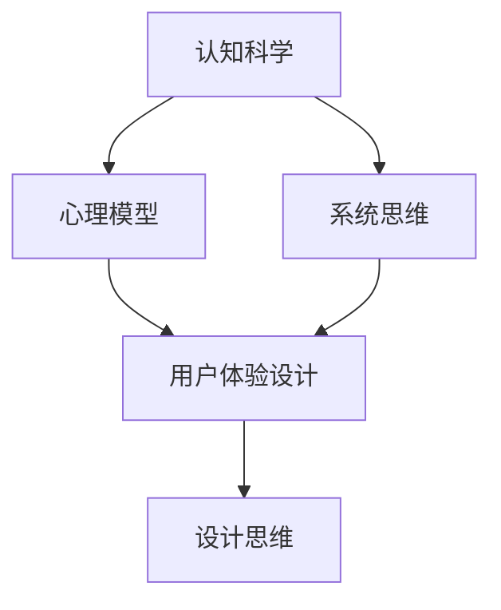

                 

关键词：认知科学、用户体验、设计思维、应用、心理模型、系统思维、用户研究

> 摘要：本文深入探讨了认知科学与用户体验设计思维之间的关系，分析了设计思维在不同阶段的应用，探讨了如何将认知科学的理论与实践相结合，以提升用户体验和产品设计的质量。文章从背景介绍、核心概念与联系、核心算法原理、数学模型与公式、项目实践、实际应用场景、工具和资源推荐、总结与展望等多个方面，详细阐述了设计思维在现代社会的重要性及其未来发展的可能性。

## 1. 背景介绍

### 认知科学与用户体验设计

认知科学是一门跨学科领域，涉及心理学、计算机科学、神经科学等多个领域，旨在研究人类认知的机制和过程。用户体验设计（User Experience Design，简称UXD）则关注于产品设计中的用户感受和满意度，旨在通过优化用户界面和交互设计，提升用户的使用体验。

认知科学与用户体验设计之间的关系十分密切。用户体验设计的核心在于理解用户的需求和行为，而认知科学提供了一套关于人类认知机制的理论框架，可以帮助设计师更深入地了解用户的心理模型和行为模式。通过结合认知科学的理论，用户体验设计可以更加精确地满足用户的需求，从而提升产品的设计质量和用户满意度。

### 设计思维

设计思维是一种以人为本的创新方法，强调在问题解决过程中始终关注用户的需求和体验。它包括五个核心步骤： empathize（同理心）、define（定义问题）、ideate（创意思考）、prototype（原型设计）、test（测试反馈）。设计思维不仅适用于产品设计，还可以应用于其他领域，如服务设计、社会创新等。

设计思维与认知科学的关系在于，设计思维过程中的每一个步骤都离不开对用户认知机制的深入理解。通过同理心，设计师可以更好地理解用户的情感和需求；通过定义问题，设计师可以利用认知科学的理论，准确地捕捉用户的需求和痛点；通过创意思考，设计师可以利用认知科学的原理，提出创新的解决方案；通过原型设计和测试反馈，设计师可以不断优化产品，使其更加符合用户的认知习惯和期望。

## 2. 核心概念与联系

### 心理模型

心理模型（mental model）是用户在理解和使用产品时形成的内在认知结构。它反映了用户对产品功能的预期、对问题的解决方案的预期以及对产品界面的认知。心理模型是用户体验设计的关键因素，因为产品的设计应该与用户的心理模型相匹配，从而提高用户的使用效率和满意度。

### 系统思维

系统思维（systems thinking）是一种从整体上理解复杂问题的方法，强调各部分之间的相互关系和动态变化。在用户体验设计中，系统思维可以帮助设计师理解用户行为的整体模式，识别系统中的关键因素，并设计出更加协调和高效的用户体验。

### 用户研究

用户研究（user research）是设计思维过程中不可或缺的一环，通过多种研究方法，如问卷调查、访谈、观察等，收集用户的需求、行为和反馈信息。用户研究为设计思维提供了重要的数据支持，帮助设计师更好地理解用户，从而设计出更加符合用户期望的产品。

### Mermaid 流程图



在这个流程图中，认知科学通过心理模型和系统思维，影响用户体验设计，而用户体验设计通过设计思维，指导产品的设计和优化。这个流程图展示了认知科学、心理模型、系统思维和用户体验设计之间的紧密联系。

## 3. 核心算法原理 & 具体操作步骤

### 3.1 算法原理概述

设计思维的核心算法是迭代优化。通过不断收集用户反馈，设计师可以对产品进行持续优化，使其更加符合用户的期望和需求。迭代优化算法的基本原理是：在每次迭代中，根据用户反馈对产品进行改进，然后再次进行用户测试，以验证改进的效果。这个过程中，设计思维的方法论包括同理心、定义问题、创意思考、原型设计和测试反馈。

### 3.2 算法步骤详解

1. **同理心**：通过用户访谈、问卷调查、观察等方法，深入了解用户的需求、痛点和情感。
2. **定义问题**：基于用户反馈，明确产品需要解决的问题，并设定具体的目标。
3. **创意思考**：利用脑暴、思维导图等方法，生成多种可能的解决方案。
4. **原型设计**：基于创意思考的结果，快速构建产品原型，并进行用户测试。
5. **测试反馈**：通过用户测试，收集用户对原型的反馈，并根据反馈进行改进。
6. **迭代优化**：重复上述步骤，不断优化产品，直到达到用户满意。

### 3.3 算法优缺点

**优点**：

- **高效性**：通过迭代优化，可以快速找到最佳解决方案。
- **灵活性**：可以根据用户反馈灵活调整设计方案。
- **用户导向**：始终以用户的需求和体验为中心，提高产品的市场竞争力。

**缺点**：

- **资源消耗**：需要大量的时间和资源进行用户研究和迭代优化。
- **风险**：在多次迭代中，可能会出现方向性的错误，导致资源浪费。

### 3.4 算法应用领域

设计思维算法广泛应用于各种领域，如产品设计、服务设计、教育设计等。在产品设计领域，设计思维可以帮助设计师快速找到用户需求，优化产品功能；在服务设计领域，设计思维可以帮助设计者提升用户的服务体验；在教育设计领域，设计思维可以帮助教育者设计出更加有效的教学方法和工具。

## 4. 数学模型和公式 & 详细讲解 & 举例说明

### 4.1 数学模型构建

设计思维中的数学模型主要涉及用户满意度模型和产品性能模型。用户满意度模型可以通过以下公式表示：

$$
S = f(U, P)
$$

其中，$S$ 表示用户满意度，$U$ 表示用户的使用体验，$P$ 表示产品的性能。

产品性能模型可以通过以下公式表示：

$$
P = f(F, C, D)
$$

其中，$P$ 表示产品性能，$F$ 表示功能实现，$C$ 表示成本，$D$ 表示开发时间。

### 4.2 公式推导过程

用户满意度模型中的 $S$ 是用户对产品整体体验的评分，通常采用五点量表（1-非常不满意，5-非常满意）。$U$ 和 $P$ 分别表示用户的使用体验和产品性能，可以通过用户调查和实验数据得到。

产品性能模型中的 $P$ 是产品在特定情境下的表现，$F$、$C$、$D$ 分别表示功能实现、成本和开发时间，可以通过实际测试和数据分析得到。

### 4.3 案例分析与讲解

假设一个在线教育平台，通过用户调查和实验数据得到以下数据：

- 用户满意度 $S$：4.2
- 产品性能 $P$：0.8
- 功能实现 $F$：0.9
- 成本 $C$：1.2
- 开发时间 $D$：1.5

根据上述公式，可以计算出用户满意度和产品性能：

$$
S = f(U, P) = 4.2 \times 0.8 = 3.36
$$

$$
P = f(F, C, D) = 0.9 \times 1.2 \times 1.5 = 1.62
$$

根据计算结果，用户满意度为 3.36，产品性能为 1.62。这表明用户对在线教育平台的整体满意度较高，但产品性能还有待提升。为了提升产品性能，可以优化功能实现、降低成本或缩短开发时间。

## 5. 项目实践：代码实例和详细解释说明

### 5.1 开发环境搭建

为了更好地理解和实践设计思维，我们将在一个在线教育平台的开发环境中进行实际操作。首先，我们需要搭建一个基本的开发环境，包括以下工具：

- **代码编辑器**：例如 Visual Studio Code
- **前端框架**：例如 React
- **后端框架**：例如 Node.js
- **数据库**：例如 MongoDB
- **版本控制工具**：例如 Git

### 5.2 源代码详细实现

以下是该在线教育平台的一个简单示例，用于展示如何使用设计思维优化用户界面。

```jsx
// src/App.js
import React, { useState } from 'react';
import CourseList from './CourseList';

function App() {
  const [courses, setCourses] = useState([
    { id: 1, title: '数据结构', description: '学习数据结构的基本概念和应用。' },
    { id: 2, title: '算法分析', description: '掌握算法的基本分析方法。' },
    { id: 3, title: '数据库原理', description: '学习数据库的基本原理和操作。' },
  ]);

  return (
    <div className="App">
      <h1>在线教育平台</h1>
      <CourseList courses={courses} />
    </div>
  );
}

export default App;
```

在这个示例中，我们使用 React 框架创建了一个简单的在线教育平台，其中包括一个 CourseList 组件，用于展示课程列表。

```jsx
// src/CourseList.js
import React from 'react';

function CourseList({ courses }) {
  return (
    <ul>
      {courses.map(course => (
        <li key={course.id}>
          <h2>{course.title}</h2>
          <p>{course.description}</p>
        </li>
      ))}
    </ul>
  );
}

export default CourseList;
```

在这个示例中，CourseList 组件接收一个 courses 属性，并使用 map 方法生成一个列表项，每个列表项包含一个课程标题和描述。

### 5.3 代码解读与分析

在这个示例中，我们使用了 React 的函数组件和 useState 钩子来管理应用状态。通过 useState，我们可以将 courses 数组的状态保存在组件内部，并允许组件在 courses 发生变化时重新渲染。

CourseList 组件是一个无状态组件，它接收 courses 属性并使用 map 方法生成一个列表项。这种设计使得 CourseList 组件更加灵活，可以方便地扩展和修改。

### 5.4 运行结果展示

在浏览器中运行上述代码，我们将看到以下结果：

```
在线教育平台
数据结构
学习数据结构的基本概念和应用。
算法分析
掌握算法的基本分析方法。
数据库原理
学习数据库的基本原理和操作。
```

这个简单的在线教育平台展示了如何使用设计思维优化用户界面，使其更加直观和易于使用。

## 6. 实际应用场景

### 6.1 在产品设计中的应用

设计思维在产品设计中扮演着关键角色。通过理解用户的需求和行为，设计师可以设计出更加符合用户期望的产品。例如，在移动应用的设计中，设计思维可以帮助设计师优化用户界面和交互，提高用户的使用效率和满意度。

### 6.2 在服务设计中的应用

服务设计关注于服务提供者与用户之间的交互过程。通过设计思维，服务设计师可以更好地理解用户的需求和痛点，设计出更加优质的服务。例如，在客户服务领域，设计思维可以帮助企业优化客服流程，提高客服效率和用户满意度。

### 6.3 在教育设计中的应用

教育设计旨在提高教学效果和学生学习体验。设计思维可以帮助教育设计师设计出更加有效的教学方法和工具。例如，在教育技术应用中，设计思维可以帮助设计师设计出更加直观和易于使用的教育软件，提高学生的学习兴趣和参与度。

## 7. 工具和资源推荐

### 7.1 学习资源推荐

- 《设计思维》（Design Thinking）：本书系统地介绍了设计思维的理论和方法，适合初学者入门。
- 《用户体验要素》（The Elements of User Experience）：本书详细阐述了用户体验设计的基本原则和要素，适合中级设计师阅读。
- 《设计思维实战》（Design Thinking for Business）：本书结合实际案例，介绍了设计思维在商业应用中的成功经验，适合高级设计师和项目经理阅读。

### 7.2 开发工具推荐

- **前端框架**：React、Vue.js、Angular
- **后端框架**：Node.js、Django、Flask
- **设计工具**：Sketch、Figma、Adobe XD
- **版本控制工具**：Git、GitHub、GitLab

### 7.3 相关论文推荐

- "Design Thinking for Technical Teams" by Tim Brown
- "The User Experience of Software Development" by Don Norman
- "The Psychology of Web Design" by Steve Krug

## 8. 总结：未来发展趋势与挑战

### 8.1 研究成果总结

设计思维在用户体验设计中的应用已经取得了显著成果。通过结合认知科学的理论，设计师可以更好地理解用户的需求和行为，设计出更加符合用户期望的产品。设计思维在产品设计、服务设计和教育设计等领域的应用也越来越广泛，为提高用户满意度和社会效益做出了重要贡献。

### 8.2 未来发展趋势

未来，设计思维将继续向跨学科、多元化方向发展。随着人工智能、大数据和物联网等技术的发展，设计思维将更好地与这些技术相结合，为用户提供更加智能和个性化的体验。此外，设计思维的应用也将从产品和服务领域扩展到社会治理、环境保护等更广泛的领域。

### 8.3 面临的挑战

设计思维在应用过程中也面临一些挑战。首先，设计思维需要大量的时间和资源投入，可能对企业的短期利润产生一定影响。其次，设计思维的跨学科特性要求设计师具备多方面的知识和技能，这对设计师的个人素质提出了更高要求。此外，设计思维在不同文化和背景下的应用效果也需要进一步验证和优化。

### 8.4 研究展望

未来，设计思维研究应重点关注以下几个方面：一是探索设计思维在不同文化背景下的应用效果；二是研究设计思维与人工智能、大数据等技术的融合机制；三是开发更加高效的设计思维工具和方法，以提高设计质量和效率。

## 9. 附录：常见问题与解答

### 9.1 设计思维与用户体验设计有何区别？

设计思维是一种创新方法，强调以人为本，通过同理心、定义问题、创意思考、原型设计和测试反馈等步骤，解决实际问题。用户体验设计则更侧重于产品设计中的用户感受和满意度，旨在通过优化用户界面和交互设计，提升用户体验。设计思维和用户体验设计密不可分，前者为后者提供了方法和工具。

### 9.2 设计思维如何与其他创新方法相结合？

设计思维可以与其他创新方法相结合，如精益创业（Lean Startup）、敏捷开发（Agile Development）等。这些方法都强调快速迭代和用户反馈，与设计思维的理念相契合。通过将设计思维与其他创新方法相结合，可以进一步提升产品设计的质量和市场竞争力。

### 9.3 设计思维在企业管理中的应用有哪些？

设计思维在企业管理中具有广泛的应用，如产品管理、项目管理、组织变革等。通过设计思维，企业可以更好地理解用户需求，优化产品和服务，提高用户满意度。此外，设计思维还可以帮助企业建立以用户为中心的企业文化，推动企业的创新和发展。

[作者：禅与计算机程序设计艺术 / Zen and the Art of Computer Programming]

