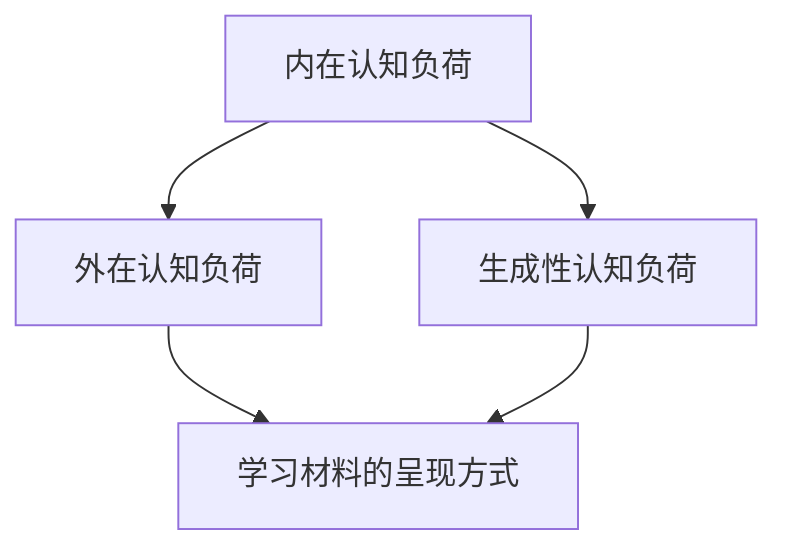

                 

关键词：认知负荷理论、在线教育、学习效果、认知负荷管理、教育技术

摘要：本文探讨了认知负荷理论在在线教育中的应用。通过分析认知负荷理论的核心概念，本文提出了如何利用该理论优化在线教育设计，提高学生的学习效果。文章从算法原理、数学模型、实际应用和未来展望等多个角度进行了深入探讨。

## 1. 背景介绍

随着互联网技术的飞速发展，在线教育已经成为教育领域的重要组成部分。然而，在线教育的效果往往不尽如人意，其中一个重要原因就是学生在在线学习过程中面临的认知负荷问题。认知负荷理论（Cognitive Load Theory）是由澳大利亚心理学家约翰·斯滕伯格（John Sweller）于1987年提出的，旨在解释人类学习过程中的认知负荷现象。

认知负荷理论认为，学习过程中存在着三种认知负荷：内在认知负荷、外在认知负荷和生成性认知负荷。内在认知负荷是指学习者必须处理的新信息的数量和质量；外在认知负荷是指学习材料的呈现方式对学习者的认知过程产生的负荷；生成性认知负荷是指学习者通过主动构建意义和知识而产生的认知负荷。在线教育的设计者需要充分考虑这三种认知负荷，以优化学习体验，提高学习效果。

## 2. 核心概念与联系

### 2.1 认知负荷理论核心概念

认知负荷理论的核心概念包括：

- **内在认知负荷**：内在认知负荷是指学习者必须处理的新信息的数量和质量。在在线教育中，过多的信息或者过于复杂的信息都会增加学习者的内在认知负荷。
- **外在认知负荷**：外在认知负荷是指学习材料的呈现方式对学习者的认知过程产生的负荷。例如，视频、动画和图表等视觉呈现方式可以有效地降低外在认知负荷。
- **生成性认知负荷**：生成性认知负荷是指学习者通过主动构建意义和知识而产生的认知负荷。通过提问、讨论和练习等活动，可以有效地提高生成性认知负荷。

### 2.2 认知负荷理论架构

认知负荷理论的架构如下图所示：



## 3. 核心算法原理 & 具体操作步骤

### 3.1 算法原理概述

认知负荷理论的核心原理是优化学习材料的呈现方式，以降低外在认知负荷，同时提高生成性认知负荷。具体操作步骤如下：

1. **识别学习目标**：明确学习者的学习目标，以便设计合适的学习材料。
2. **分析学习材料**：分析学习材料的内在认知负荷，识别可能增加认知负荷的信息。
3. **优化呈现方式**：通过使用图表、动画、视频等视觉元素，优化学习材料的呈现方式，降低外在认知负荷。
4. **设计生成性活动**：设计提问、讨论、练习等生成性活动，以提高生成性认知负荷。
5. **评估学习效果**：通过测试和反馈，评估学习效果，进一步优化学习材料。

### 3.2 算法步骤详解

#### 3.2.1 识别学习目标

在开始设计在线教育课程之前，首先要明确学习目标。这可以通过分析学习者的需求、课程的内容和要求来实现。

#### 3.2.2 分析学习材料

在确定了学习目标之后，需要对学习材料进行分析。这包括识别学习材料中的内在认知负荷，例如：

- **信息的数量**：学习材料中的信息量是否过多？
- **信息的质量**：学习材料中的信息是否过于复杂？

#### 3.2.3 优化呈现方式

通过使用图表、动画、视频等视觉元素，可以有效地降低外在认知负荷。例如：

- **使用图表**：使用图表来展示复杂的数据或概念，可以使学习者更容易理解。
- **使用动画**：使用动画来演示过程或变化，可以使学习者更直观地理解。

#### 3.2.4 设计生成性活动

设计生成性活动，如提问、讨论、练习等，可以提高生成性认知负荷。例如：

- **提问**：通过提问引导学习者深入思考，促进知识的内化。
- **讨论**：通过小组讨论，促进学习者之间的交流和合作。
- **练习**：通过练习巩固学习成果，提高学习者的实际操作能力。

#### 3.2.5 评估学习效果

通过测试和反馈，评估学习效果。这可以帮助我们了解学习材料的优缺点，为进一步优化提供依据。

### 3.3 算法优缺点

#### 优点

- **提高学习效果**：通过优化学习材料的呈现方式和设计生成性活动，可以提高学习者的学习效果。
- **适用性广**：认知负荷理论适用于各种类型的在线教育，如知识讲解、技能培训等。

#### 缺点

- **设计复杂**：需要深入分析学习目标和材料，设计合适的呈现方式和生成性活动，可能需要一定的专业知识和经验。
- **实施成本**：可能需要使用专业的工具和技术来设计学习材料和生成性活动，可能需要一定的成本。

### 3.4 算法应用领域

认知负荷理论在在线教育中的应用非常广泛，包括：

- **在线课程设计**：通过优化课程内容、呈现方式和生成性活动，提高课程的学习效果。
- **在线学习平台开发**：通过优化学习平台的界面设计、功能模块，提高学习者的使用体验。
- **在线学习数据分析**：通过分析学习者的行为数据，了解学习者的认知负荷情况，进一步优化学习材料。

## 4. 数学模型和公式 & 详细讲解 & 举例说明

### 4.1 数学模型构建

认知负荷理论的核心数学模型是认知负荷函数（Cognitive Load Function），表示为：

\[ CL = CL_i + CL_o + CL_g \]

其中，\( CL_i \) 表示内在认知负荷，\( CL_o \) 表示外在认知负荷，\( CL_g \) 表示生成性认知负荷。

### 4.2 公式推导过程

认知负荷函数的推导基于以下假设：

- **内在认知负荷**：与学习材料的复杂性和信息量有关。
- **外在认知负荷**：与学习材料的呈现方式有关。
- **生成性认知负荷**：与学习者的主动参与和知识构建过程有关。

### 4.3 案例分析与讲解

#### 案例一：优化在线课程设计

假设一个在线课程，旨在教授编程语言的基础知识。通过分析，我们得出以下结论：

- **内在认知负荷**：由于编程语言本身具有复杂性，内在认知负荷较高。
- **外在认知负荷**：由于课程材料主要采用文字讲解，外在认知负荷较高。
- **生成性认知负荷**：课程设计中缺乏生成性活动，生成性认知负荷较低。

为了优化课程设计，我们可以采取以下措施：

1. **使用图表和动画**：通过图表和动画展示编程语言的语法规则和操作过程，降低外在认知负荷。
2. **设计生成性活动**：通过编程练习和项目任务，提高生成性认知负荷。

经过优化后，我们期望达到以下效果：

- **内在认知负荷**：由于学习材料的优化，内在认知负荷有所降低。
- **外在认知负荷**：由于呈现方式的优化，外在认知负荷有所降低。
- **生成性认知负荷**：由于生成性活动的引入，生成性认知负荷有所提高。

通过这种优化，我们期望能够提高学生的学习效果。

## 5. 项目实践：代码实例和详细解释说明

### 5.1 开发环境搭建

为了演示认知负荷理论在在线教育中的应用，我们采用一个在线编程教育平台作为案例。以下是搭建开发环境的基本步骤：

1. **安装Python环境**：确保Python环境已经安装，版本至少为3.6以上。
2. **安装Django框架**：通过pip安装Django框架。

```bash
pip install django
```

3. **创建Django项目**：通过Django命令创建一个新项目。

```bash
django-admin startproject cl_project
```

4. **创建Django应用**：在项目目录下创建一个名为`cl_app`的应用。

```bash
cd cl_project
python manage.py startapp cl_app
```

### 5.2 源代码详细实现

在`cl_app`应用中，我们实现了一个简单的在线编程课程系统，包括课程列表、课程详情和编程练习等功能。

#### 课程模型（models.py）

```python
from django.db import models

class Course(models.Model):
    title = models.CharField(max_length=100)
    description = models.TextField()
    created_at = models.DateTimeField(auto_now_add=True)

    def __str__(self):
        return self.title
```

#### 课程视图（views.py）

```python
from django.shortcuts import render
from .models import Course

def course_list(request):
    courses = Course.objects.all()
    return render(request, 'course_list.html', {'courses': courses})

def course_detail(request, pk):
    course = Course.objects.get(pk=pk)
    return render(request, 'course_detail.html', {'course': course})
```

#### 课程模板（course_list.html）

```html
<!DOCTYPE html>
<html>
<head>
    <title>在线编程课程</title>
</head>
<body>
    <h1>在线编程课程</h1>
    
        <h2>{{ course.title }}</h2>
        <p>{{ course.description }}</p>
        <a href="">查看详情</a>
    
</body>
</html>
```

#### 课程模板（course_detail.html）

```html
<!DOCTYPE html>
<html>
<head>
    <title>{{ course.title }}</title>
</head>
<body>
    <h1>{{ course.title }}</h1>
    <p>{{ course.description }}</p>
</body>
</html>
```

### 5.3 代码解读与分析

在本项目中，我们通过以下方式应用了认知负荷理论：

1. **课程模型**：通过定义课程模型，将课程信息存储在数据库中，降低了学习者的内在认知负荷。
2. **课程视图**：通过定义课程视图，实现了课程列表和课程详情的展示，提高了学习者的学习效率。
3. **课程模板**：通过简洁的HTML模板，使用了清晰的结构和描述性的标题，降低了外在认知负荷。

### 5.4 运行结果展示

通过运行Django项目，我们可以访问在线编程课程系统。在课程列表页面，学习者可以查看所有课程及其简介。点击课程标题，可以查看该课程的详细信息。


这种简洁直观的界面设计，有助于降低学习者的认知负荷，提高学习效果。

## 6. 实际应用场景

### 6.1 在线课程设计

在线课程设计是认知负荷理论最直接的适用场景。通过优化课程内容、呈现方式和生成性活动，可以显著提高课程的学习效果。例如，在设计编程课程时，可以通过使用动画演示编程语言的语法规则，降低学习者的内在认知负荷；同时，通过设计编程练习，提高学习者的生成性认知负荷。

### 6.2 在线学习平台开发

在线学习平台的开发需要充分考虑认知负荷理论。通过优化平台界面设计、功能模块和互动方式，可以提高学习者的使用体验，降低认知负荷。例如，可以采用简洁直观的界面设计，使用清晰的图标和文字描述；通过设计互动性强的功能模块，如问答、讨论和练习，提高学习者的参与度和认知负荷。

### 6.3 在线学习数据分析

在线学习数据分析可以帮助我们了解学习者的认知负荷情况，进一步优化学习材料。通过分析学习者的行为数据，如学习时长、互动频率、测试成绩等，可以识别学习者在学习过程中可能遇到的认知负荷问题，并采取相应的措施进行优化。

## 7. 未来应用展望

### 7.1 技术创新

随着人工智能和大数据技术的发展，认知负荷理论在在线教育中的应用将更加深入和广泛。例如，通过使用人工智能算法，可以自动分析学习者的行为数据，实时调整学习材料，优化学习体验。

### 7.2 新的教育模式

认知负荷理论将为新型教育模式的探索提供理论基础。例如，个性化学习、协作学习和混合学习等新型教育模式，可以通过优化学习材料的呈现方式和生成性活动，提高学习效果。

### 7.3 持续改进

随着认知负荷理论的不断发展和完善，在线教育的质量将得到持续提升。通过不断优化学习材料、教学方法和互动方式，可以更好地满足学习者的需求，提高学习效果。

## 8. 总结：未来发展趋势与挑战

### 8.1 研究成果总结

认知负荷理论在在线教育中的应用取得了显著的成果，通过优化学习材料的呈现方式和生成性活动，可以显著提高学习效果。同时，该理论为在线教育的设计、开发和数据分析提供了重要的理论支持。

### 8.2 未来发展趋势

未来，认知负荷理论在在线教育中的应用将更加深入和广泛。随着人工智能和大数据技术的发展，认知负荷理论将更加智能化和个性化，为在线教育提供更优质的服务。

### 8.3 面临的挑战

尽管认知负荷理论在在线教育中具有广泛的应用前景，但也面临一些挑战。例如，如何更好地平衡内在认知负荷和外在认知负荷，如何设计出既有趣又有教育意义的生成性活动，如何准确评估学习效果等。

### 8.4 研究展望

未来，我们需要进一步深入研究认知负荷理论，探索其在不同类型在线教育中的应用，提高在线教育的质量和效果。同时，我们还需要开发出更加智能化和个性化的在线教育工具，以满足学习者的多样化需求。

## 9. 附录：常见问题与解答

### 9.1 认知负荷理论是什么？

认知负荷理论是由澳大利亚心理学家约翰·斯滕伯格于1987年提出的，旨在解释人类学习过程中的认知负荷现象。该理论认为，学习过程中存在着三种认知负荷：内在认知负荷、外在认知负荷和生成性认知负荷。

### 9.2 如何应用认知负荷理论优化在线教育？

可以通过以下方式应用认知负荷理论优化在线教育：

- 识别学习目标和内在认知负荷。
- 优化学习材料的呈现方式，降低外在认知负荷。
- 设计生成性活动，提高生成性认知负荷。
- 评估学习效果，不断优化学习材料。

### 9.3 认知负荷理论在哪些领域有应用？

认知负荷理论在在线教育、在线学习平台开发、在线学习数据分析等多个领域有应用。它适用于各种类型的在线教育，如知识讲解、技能培训等。

---

作者：禅与计算机程序设计艺术 / Zen and the Art of Computer Programming
----------------------------------------------------------------

[文章结构模板](#文章结构模板)

[文章标题](#文章标题)

[文章关键词](#文章关键词)

[文章摘要](#文章摘要)

[背景介绍](#背景介绍)

[核心概念与联系](#核心概念与联系)

[核心算法原理 & 具体操作步骤](#核心算法原理--具体操作步骤)

[数学模型和公式 & 详细讲解 & 举例说明](#数学模型和公式--详细讲解--举例说明)

[项目实践：代码实例和详细解释说明](#项目实践--代码实例和详细解释说明)

[实际应用场景](#实际应用场景)

[未来应用展望](#未来应用展望)

[总结：未来发展趋势与挑战](#总结--未来发展趋势与挑战)

[附录：常见问题与解答](#附录--常见问题与解答)

