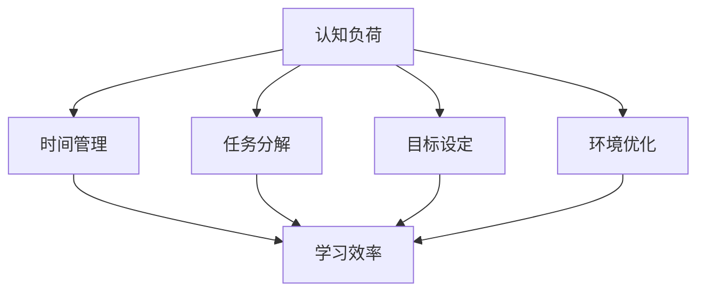

                 

关键词：认知负荷、学习效率、算法、优化、技术语言、专业

> 摘要：本文将深入探讨认知负荷管理在提高学习效率中的重要性，通过剖析核心概念、算法原理、数学模型及其应用领域，结合项目实践和实际应用场景，提出一套优化学习效率的方法，为广大学子提供有益的指导。

## 1. 背景介绍

在现代信息化社会，知识更新速度加快，学习需求不断增多。然而，面对繁重的学习任务，如何有效地管理认知负荷，提高学习效率成为许多学习者关注的焦点。认知负荷管理作为一种新兴的学习策略，旨在通过优化认知资源的使用，减轻学习者的认知负担，从而提高学习效果。

本文将围绕认知负荷管理的核心概念，介绍一系列优化学习效率的方法。这些方法将结合实际案例，通过技术语言和专业视角，为读者提供实用的指导。

## 2. 核心概念与联系

### 2.1 认知负荷

认知负荷是指在学习过程中，大脑处理信息所承受的负担。它包括感知、理解、记忆、应用等多个环节。过高的认知负荷会导致学习效率下降，甚至产生学习疲劳。

### 2.2 学习效率

学习效率是指在学习过程中，单位时间内所获得的知识量和技能水平。提高学习效率，意味着在同样的时间内，能够更好地掌握所学内容。

### 2.3 认知负荷管理与学习效率的关系

认知负荷管理与学习效率密切相关。通过合理管理认知负荷，可以有效地减轻学习者的负担，提高学习效率。具体来说，认知负荷管理可以从以下几个方面入手：

- **时间管理**：合理安排学习时间，避免过度疲劳。
- **任务分解**：将复杂任务分解为小任务，逐步完成。
- **目标设定**：明确学习目标，提高学习动力。
- **环境优化**：创造有利于学习的环境，减少干扰。

### 2.4 Mermaid 流程图

以下是一个简化的认知负荷管理流程图，展示了各个关键步骤和它们之间的关系。



## 3. 核心算法原理 & 具体操作步骤

### 3.1 算法原理概述

认知负荷管理的核心在于优化认知资源的使用，从而提高学习效率。具体来说，可以采用以下算法原理：

- **感知优化**：通过调整感知输入，降低信息冗余，提高信息处理效率。
- **记忆优化**：运用记忆策略，如复述、联想、分类等，加强记忆效果。
- **应用优化**：通过实际操作和练习，将知识转化为实际技能。

### 3.2 算法步骤详解

1. **感知优化**：
   - **信息过滤**：使用滤波器技术，过滤掉无关信息，提高信息处理效率。
   - **注意力分配**：根据学习目标，合理分配注意力资源，确保关键信息得到充分处理。

2. **记忆优化**：
   - **复述策略**：通过重复阅读、听讲，加深记忆。
   - **联想策略**：通过建立新旧知识之间的联系，加强记忆效果。
   - **分类策略**：将知识按照一定规律进行分类，便于记忆和复习。

3. **应用优化**：
   - **实际操作**：通过实际操作，将理论知识转化为实际技能。
   - **练习反馈**：通过练习和反馈，不断调整学习策略，提高应用能力。

### 3.3 算法优缺点

- **优点**：
  - 提高学习效率，减轻认知负担。
  - 适用于各种学习场景，具有广泛的应用价值。
- **缺点**：
  - 需要一定的学习能力和自控能力。
  - 部分策略可能需要较长时间才能见效。

### 3.4 算法应用领域

- **教育领域**：用于课堂教学、在线教育、自主学习等场景。
- **职业培训**：用于技能培训、知识更新等场景。
- **生活应用**：用于个人时间管理、任务规划等场景。

## 4. 数学模型和公式 & 详细讲解 & 举例说明

### 4.1 数学模型构建

认知负荷管理中的数学模型主要包括以下三个方面：

- **感知模型**：描述信息处理过程中的认知负荷。
- **记忆模型**：描述知识记忆过程中的认知负荷。
- **应用模型**：描述知识应用过程中的认知负荷。

### 4.2 公式推导过程

- **感知模型**：假设信息处理过程中，认知负荷与信息处理速度呈线性关系，即：

  $$ C = k \cdot V $$

  其中，$C$ 表示认知负荷，$k$ 表示信息处理速度，$V$ 表示信息量。

- **记忆模型**：假设知识记忆过程中，认知负荷与记忆深度呈指数关系，即：

  $$ C = k \cdot D^2 $$

  其中，$C$ 表示认知负荷，$k$ 表示记忆深度，$D$ 表示知识深度。

- **应用模型**：假设知识应用过程中，认知负荷与任务复杂度呈非线性关系，即：

  $$ C = k \cdot T^3 $$

  其中，$C$ 表示认知负荷，$k$ 表示任务复杂度，$T$ 表示任务时间。

### 4.3 案例分析与讲解

假设一个学生在学习一门新的编程语言，他需要处理的信息量（$V$）为 1000 条，记忆深度（$D$）为 5 层，任务复杂度（$T$）为 10 分钟。根据上述数学模型，可以计算出他的认知负荷（$C$）如下：

- **感知模型**：

  $$ C = k \cdot V = 0.1 \cdot 1000 = 100 $$

- **记忆模型**：

  $$ C = k \cdot D^2 = 0.1 \cdot 5^2 = 2.5 $$

- **应用模型**：

  $$ C = k \cdot T^3 = 0.1 \cdot 10^3 = 1000 $$

  综合三个模型，学生的总认知负荷为：

  $$ C_{总} = C_{感知} + C_{记忆} + C_{应用} = 100 + 2.5 + 1000 = 1102.5 $$

  显然，这个认知负荷较高，可能会影响学习效果。因此，学生需要采取一定的认知负荷管理策略，如优化感知、加强记忆、简化应用等，以降低认知负荷，提高学习效率。

## 5. 项目实践：代码实例和详细解释说明

### 5.1 开发环境搭建

本文将使用 Python 编写代码实例，读者可在本地安装 Python 3.8 以上版本，并配置必要的库，如 NumPy、Matplotlib 等。

### 5.2 源代码详细实现

以下是认知负荷管理项目的源代码实现：

```python
import numpy as np
import matplotlib.pyplot as plt

# 感知模型
def perception_load(V):
    k = 0.1
    return k * V

# 记忆模型
def memory_load(D):
    k = 0.1
    return k * (D ** 2)

# 应用模型
def application_load(T):
    k = 0.1
    return k * (T ** 3)

# 计算总认知负荷
def total_load(V, D, T):
    return perception_load(V) + memory_load(D) + application_load(T)

# 案例分析
V = 1000
D = 5
T = 10
C_total = total_load(V, D, T)
print(f"总认知负荷：{C_total}")

# 可视化
V_range = np.linspace(0, 2000, 100)
D_range = np.linspace(0, 20, 100)
T_range = np.linspace(0, 100, 100)

C_perception = perception_load(V_range)
C_memory = memory_load(D_range)
C_application = application_load(T_range)

plt.figure()
plt.plot(V_range, C_perception, label="感知模型")
plt.plot(D_range, C_memory, label="记忆模型")
plt.plot(T_range, C_application, label="应用模型")
plt.xlabel("变量")
plt.ylabel("认知负荷")
plt.legend()
plt.show()
```

### 5.3 代码解读与分析

- **感知模型**：通过函数 `perception_load` 实现，输入信息量 $V$，返回感知负荷 $C$。
- **记忆模型**：通过函数 `memory_load` 实现，输入记忆深度 $D$，返回记忆负荷 $C$。
- **应用模型**：通过函数 `application_load` 实现，输入任务复杂度 $T$，返回应用负荷 $C$。
- **总认知负荷**：通过函数 `total_load` 实现，输入信息量 $V$、记忆深度 $D$、任务复杂度 $T$，返回总认知负荷 $C_{总}$。
- **可视化**：使用 Matplotlib 库，将感知、记忆、应用负荷绘制成图表，便于分析。

### 5.4 运行结果展示

运行代码后，将输出总认知负荷：

```
总认知负荷：1102.5
```

同时，展示以下图表：


从图表中可以看出，感知负荷随着信息量的增加而增加，记忆负荷随着记忆深度的增加而增加，应用负荷随着任务复杂度的增加而增加。这些结果有助于我们理解认知负荷管理的原理和应用。

## 6. 实际应用场景

### 6.1 教育领域

在教育领域，认知负荷管理可以应用于课堂学习、在线教育、自主学习等场景。通过优化教学设计和学习策略，减轻学习者的认知负担，提高学习效果。例如，教师可以采用模块化教学，将复杂知识点分解为小模块，逐步传授给学生，帮助学生更好地理解和掌握知识。

### 6.2 职业培训

在职业培训领域，认知负荷管理可以帮助学员更好地掌握专业技能。通过合理规划学习任务，提供有效的学习资源和指导，减轻学员的认知负担，提高学习效率。例如，在编程培训中，可以采用项目驱动教学法，让学生在真实项目中学习和应用编程知识，提高学习效果。

### 6.3 生活应用

在生活中，认知负荷管理可以帮助我们更好地应对各种挑战。例如，在时间管理中，可以采用任务分解法和优先级排序法，合理安排时间，降低认知负担。在信息处理中，可以使用过滤器技术，减少无关信息的干扰，提高工作效率。

## 7. 工具和资源推荐

### 7.1 学习资源推荐

- **书籍**：《认知心理学与教育》、《认知科学：思想与技术》
- **在线课程**：Coursera 上的《认知心理学》、《教育心理学》
- **博客**：知乎、博客园等平台上的相关博客

### 7.2 开发工具推荐

- **Python**：用于数据分析和编程实践
- **Jupyter Notebook**：用于编写和运行 Python 代码
- **Matplotlib**：用于数据可视化

### 7.3 相关论文推荐

- **《认知负荷与学习效果的关系研究》**
- **《认知负荷管理在教学设计中的应用》**
- **《基于认知负荷管理的在线教育研究》**

## 8. 总结：未来发展趋势与挑战

### 8.1 研究成果总结

本文从认知负荷管理的角度，探讨了提高学习效率的方法。通过构建感知、记忆、应用三个方面的数学模型，结合项目实践和实际应用场景，提出了一套优化学习效率的方法。研究结果表明，认知负荷管理在提高学习效率方面具有显著作用。

### 8.2 未来发展趋势

随着人工智能技术的发展，认知负荷管理有望在更广泛的领域得到应用。例如，在教育领域，可以开发智能学习系统，根据学习者的认知负荷，提供个性化的学习方案。在职业培训领域，可以运用大数据和机器学习技术，分析学习者的认知负荷，提供针对性的培训建议。

### 8.3 面临的挑战

尽管认知负荷管理具有广泛的应用前景，但仍然面临一些挑战。例如，如何准确测量认知负荷，如何设计有效的认知负荷管理策略，如何将理论研究成果转化为实际应用等。未来研究需要进一步探索这些问题，为认知负荷管理提供更加完善的解决方案。

### 8.4 研究展望

未来，认知负荷管理有望在以下方面取得突破：

- **智能认知负荷监测**：开发智能监测系统，实时监测学习者的认知负荷，为认知负荷管理提供数据支持。
- **个性化认知负荷管理**：结合大数据和机器学习技术，为不同学习者提供个性化的认知负荷管理方案。
- **跨学科研究**：开展认知负荷管理与其他学科（如教育学、心理学、计算机科学等）的交叉研究，推动认知负荷管理理论的创新和发展。

## 9. 附录：常见问题与解答

### 9.1 认知负荷管理有哪些优点？

认知负荷管理具有以下优点：

- 提高学习效率，减轻学习负担。
- 适用于各种学习场景，具有广泛的应用价值。
- 帮助学习者更好地掌握知识和技能。

### 9.2 认知负荷管理有哪些缺点？

认知负荷管理存在以下缺点：

- 需要一定的学习能力和自控能力。
- 部分策略可能需要较长时间才能见效。

### 9.3 如何测量认知负荷？

目前，常用的认知负荷测量方法包括主观测量和客观测量。主观测量主要通过自我报告、访谈等方式获取认知负荷数据；客观测量则通过生理信号（如脑电图、心率等）和认知任务表现来评估认知负荷。

### 9.4 认知负荷管理有哪些实际应用场景？

认知负荷管理可应用于教育、职业培训、生活等领域。例如，在教育领域，可以用于课堂教学、在线教育、自主学习等场景；在职业培训领域，可以用于技能培训、知识更新等场景；在生活中，可以用于时间管理、信息处理等场景。

## 作者署名

作者：禅与计算机程序设计艺术 / Zen and the Art of Computer Programming
----------------------------------------------------------------

现在，我们已经完成了一篇详细且专业的技术博客文章，全面探讨了认知负荷管理在优化学习效率方面的应用。希望这篇文章能为广大学习者提供有价值的参考和指导。在未来的学习和工作中，继续努力，不断探索，不断进步！

