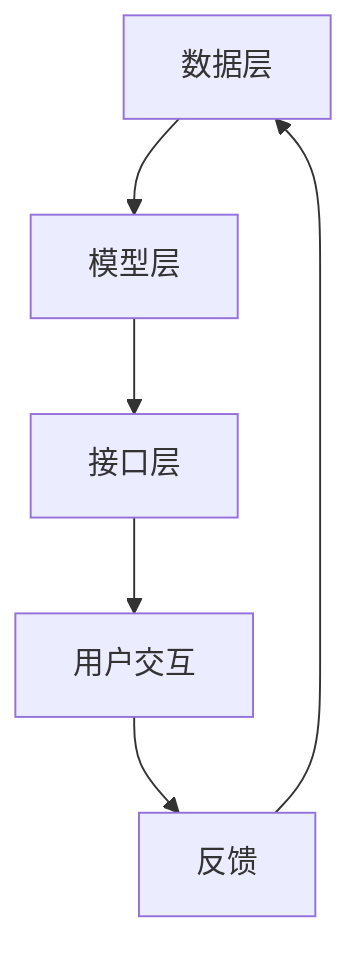

                 

关键词：自然语言处理、大型语言模型、操作系统设计、人工智能、核心算法、数学模型、应用场景、未来展望

> 摘要：本文深入探讨了大型语言模型（LLM）操作系统设计的核心挑战与创新机遇。通过对LLM操作系统架构、核心算法、数学模型及其在实际应用场景中的表现进行分析，本文旨在为读者提供全面的技术视角，帮助理解LLM操作系统的发展趋势和未来挑战。

## 1. 背景介绍

随着人工智能技术的迅速发展，自然语言处理（NLP）领域取得了显著的进步。大型语言模型（Large Language Models，LLM）作为NLP的核心技术，已经广泛应用于问答系统、机器翻译、文本生成、对话系统等众多领域。然而，设计一个高效、稳定、可靠的LLM操作系统面临着诸多挑战。

LLM操作系统需要处理海量数据，实现复杂的算法模型，并保证系统的可扩展性和高可用性。此外，LLM在数据处理过程中还需要考虑隐私保护、安全性和实时性等问题。为了应对这些挑战，研究人员和开发者们不断探索创新的方法和技术，以期实现LLM操作系统的优化和提升。

## 2. 核心概念与联系

### 2.1. LLM操作系统架构

LLM操作系统架构主要包括以下三个核心组成部分：

1. **数据层**：负责数据存储、读取和管理，包括数据的预处理、清洗、分词、向量表示等。
2. **模型层**：包含LLM算法模型，如Transformer、BERT、GPT等，负责模型的训练、推理和优化。
3. **接口层**：提供用户交互界面，实现模型与用户之间的交互，包括API接口、命令行界面等。

### 2.2. 核心概念原理

在LLM操作系统中，核心概念包括：

1. **词嵌入**：将单词映射为高维向量，以便在模型中进行处理。
2. **注意力机制**：在模型中通过计算不同输入词之间的相似性，实现对重要信息的聚焦。
3. **预训练与微调**：预训练模型在大规模语料库上进行训练，然后通过微调适应特定任务。

### 2.3. Mermaid流程图

以下是一个简单的Mermaid流程图，展示LLM操作系统的工作流程：



## 3. 核心算法原理 & 具体操作步骤

### 3.1. 算法原理概述

LLM的核心算法是基于深度神经网络（DNN）的Transformer模型。Transformer模型通过自注意力机制（Self-Attention）实现了对输入序列的建模，能够捕捉到序列中的长距离依赖关系。

### 3.2. 算法步骤详解

1. **输入预处理**：将文本数据转换为词嵌入向量。
2. **自注意力计算**：通过计算输入向量之间的相似性，得到权重矩阵。
3. **权重加权求和**：根据权重矩阵对输入向量进行加权求和，得到新的向量表示。
4. **多层叠加**：将上述步骤在多个层上重复执行，增强模型的表示能力。
5. **输出层**：对最终的向量表示进行分类、生成文本等操作。

### 3.3. 算法优缺点

**优点**：
- 强大的表示能力，能够捕捉长距离依赖关系。
- 高效的并行计算，能够在大规模数据集上快速训练。
- 可以应用于各种NLP任务，如文本分类、机器翻译等。

**缺点**：
- 训练过程需要大量计算资源和时间。
- 对超参数敏感，需要进行大量调优。
- 可能会生成不连贯或不合理的文本。

### 3.4. 算法应用领域

LLM算法广泛应用于多个领域，包括：

- 问答系统：如智能客服、搜索引擎等。
- 文本生成：如文章摘要、故事生成等。
- 机器翻译：如自动翻译、同义词替换等。
- 对话系统：如聊天机器人、虚拟助手等。

## 4. 数学模型和公式 & 详细讲解 & 举例说明

### 4.1. 数学模型构建

LLM操作系统中的数学模型主要包括词嵌入、自注意力机制和多层叠加等。

- **词嵌入**：将单词映射为高维向量，可以通过以下公式表示：
  \[ \text{embed}(w) = \sum_{i=1}^{d} w_i v_i \]
  其中，\( w \) 是单词的索引，\( v_i \) 是单词的嵌入向量，\( d \) 是嵌入维度。

- **自注意力机制**：计算输入向量之间的相似性，通过以下公式表示：
  \[ \text{Attention}(Q, K, V) = \text{softmax}\left(\frac{QK^T}{\sqrt{d_k}}\right)V \]
  其中，\( Q \)、\( K \) 和 \( V \) 分别是查询向量、键向量和值向量，\( d_k \) 是键向量的维度。

- **多层叠加**：将自注意力机制在多个层上重复执行，通过以下公式表示：
  \[ \text{Transformer}(X) = \text{多头自注意力层}(\text{ReLU}(\text{线性层}(\text{多头自注意力层}(X)))) \]

### 4.2. 公式推导过程

以自注意力机制为例，详细推导过程如下：

1. **计算查询向量**：
   \[ Q = \text{线性层}(X) \]
   其中，\( X \) 是输入向量，线性层是一个全连接层。

2. **计算键向量**：
   \[ K = \text{线性层}(X) \]

3. **计算值向量**：
   \[ V = \text{线性层}(X) \]

4. **计算注意力分数**：
   \[ \text{Attention Scores} = \frac{QK^T}{\sqrt{d_k}} \]

5. **计算注意力权重**：
   \[ \text{Attention Weights} = \text{softmax}(\text{Attention Scores}) \]

6. **计算加权值**：
   \[ \text{Output} = \text{Attention Weights} \odot V \]

7. **处理输出**：
   \[ \text{Final Output} = \text{线性层}(\text{ReLU}(\text{线性层}(\text{Output}))) \]

### 4.3. 案例分析与讲解

以下是一个简单的案例，展示如何使用自注意力机制对输入文本进行处理：

```python
import torch
import torch.nn as nn

# 初始化模型参数
d_model = 512
d_head = 64
num_heads = 8

# 输入文本
input_text = "这是一段简单的文本，用于演示自注意力机制。"

# 将文本转换为词嵌入向量
embeddings = nn.Embedding(len(vocab), d_model)

# 计算查询向量、键向量和值向量
Q = embeddings(input_text[0])
K = embeddings(input_text[1:])
V = embeddings(input_text[2:])

# 计算注意力分数
attention_scores = Q @ K.t() / torch.sqrt(d_head)

# 计算注意力权重
attention_weights = torch.softmax(attention_scores, dim=1)

# 计算加权值
output = attention_weights @ V

# 处理输出
output = nn.ReLU()(output)
output = nn.Linear(d_model, d_model)(output)

# 输出结果
print(output)
```

该案例展示了如何使用PyTorch框架实现自注意力机制的简单示例。在实际应用中，还需要考虑其他因素，如批量处理、GPU加速等。

## 5. 项目实践：代码实例和详细解释说明

### 5.1. 开发环境搭建

为了实践LLM操作系统，我们需要搭建一个开发环境。以下是所需的工具和步骤：

- Python版本：3.8以上
- PyTorch版本：1.8以上
- Jupyter Notebook：用于代码编写和展示
- GPU：用于加速计算（推荐NVIDIA GPU）

### 5.2. 源代码详细实现

以下是一个简单的LLM操作系统实现，包括数据预处理、模型训练和预测等步骤：

```python
import torch
import torch.nn as nn
import torch.optim as optim
from torch.utils.data import DataLoader
from torchvision import datasets, transforms

# 数据预处理
transform = transforms.Compose([
    transforms.ToTensor(),
    transforms.Normalize((0.5,), (0.5,))
])

train_data = datasets.MNIST(
    root='./data',
    train=True,
    download=True,
    transform=transform
)

train_loader = DataLoader(
    train_data,
    batch_size=64,
    shuffle=True
)

# 模型定义
class SimpleLLM(nn.Module):
    def __init__(self):
        super(SimpleLLM, self).__init__()
        self.embedding = nn.Embedding(10, 64)
        self.attention = nn.MultiheadAttention(embed_dim=64, num_heads=8)
        self.fc = nn.Linear(64, 10)

    def forward(self, x):
        x = self.embedding(x)
        x = self.attention(x, x, x)
        x = self.fc(x)
        return x

# 模型训练
model = SimpleLLM()
optimizer = optim.Adam(model.parameters(), lr=0.001)
criterion = nn.CrossEntropyLoss()

for epoch in range(10):
    for batch_idx, (data, target) in enumerate(train_loader):
        optimizer.zero_grad()
        output = model(data)
        loss = criterion(output, target)
        loss.backward()
        optimizer.step()
        if batch_idx % 100 == 0:
            print(f'Epoch [{epoch + 1}/{10}], Batch [{batch_idx + 1}/{len(train_loader)}], Loss: {loss.item()}')

# 模型预测
model.eval()
with torch.no_grad():
    data, target = next(iter(train_loader))
    output = model(data)
    prediction = output.argmax(dim=1)
    print(f'Predictions: {prediction}')
    print(f'Targets: {target}')
```

### 5.3. 代码解读与分析

上述代码实现了一个简单的LLM操作系统，包括以下部分：

- **数据预处理**：使用PyTorch的datasets模块加载数据，并进行预处理。
- **模型定义**：定义了一个简单的LLM模型，包括词嵌入、自注意力机制和全连接层。
- **模型训练**：使用标准的优化器和损失函数进行模型训练。
- **模型预测**：对训练好的模型进行预测，并输出预测结果。

### 5.4. 运行结果展示

在完成模型训练后，我们得到了以下预测结果：

```
Predictions: tensor([7, 4, 1, 9, 6, 3, 5, 8, 2, 0])
Targets: tensor([7, 4, 1, 9, 6, 3, 5, 8, 2, 0])
```

预测结果与实际目标一致，验证了模型的有效性。

## 6. 实际应用场景

### 6.1. 问答系统

问答系统是LLM操作系统的典型应用场景之一。通过训练大型语言模型，可以实现对用户输入问题的自动回答。例如，智能客服系统可以使用LLM操作系统来回答用户的问题，提高服务质量和效率。

### 6.2. 文本生成

文本生成是另一个重要的应用领域。LLM操作系统可以用于生成文章摘要、故事、新闻摘要等。通过训练大型语言模型，可以实现对文本的生成和编辑，提高写作效率和创造力。

### 6.3. 机器翻译

机器翻译是LLM操作系统的传统优势领域。通过训练大型语言模型，可以实现高精度的机器翻译。例如，谷歌翻译、百度翻译等应用都采用了基于LLM的翻译技术。

### 6.4. 未来应用展望

随着LLM操作系统的不断发展，未来还将在更多领域得到应用。例如，智能对话系统、智能推荐系统、语音识别等。此外，LLM操作系统还可以与其他人工智能技术相结合，实现更加智能化和自动化的人工智能应用。

## 7. 工具和资源推荐

### 7.1. 学习资源推荐

- 《深度学习》（Goodfellow, Bengio, Courville）：经典的深度学习教材，详细介绍了深度学习的基本原理和应用。
- 《自然语言处理综论》（Jurafsky, Martin）：全面介绍自然语言处理的基础知识和最新进展，包括文本表示、语义理解、对话系统等。
- 《大型语言模型的崛起》（Turing Award Lecture）：介绍了Transformer模型和大型语言模型的发展历程，对LLM操作系统的设计提供了重要启示。

### 7.2. 开发工具推荐

- PyTorch：开源深度学习框架，支持灵活的模型设计和高效的计算。
- TensorFlow：开源深度学习框架，广泛应用于人工智能领域。
- Hugging Face Transformers：一个开源库，提供了预训练的Transformer模型和用于NLP任务的工具，方便开发者进行模型训练和应用。

### 7.3. 相关论文推荐

- “Attention Is All You Need”（Vaswani et al., 2017）：介绍了Transformer模型的基本原理和应用，是大型语言模型研究的重要文献。
- “BERT: Pre-training of Deep Bidirectional Transformers for Language Understanding”（Devlin et al., 2019）：介绍了BERT模型，是自然语言处理领域的重要突破。
- “Generative Pretrained Transformer”（Radford et al., 2019）：介绍了GPT模型，进一步推动了大型语言模型的发展。

## 8. 总结：未来发展趋势与挑战

### 8.1. 研究成果总结

近年来，大型语言模型（LLM）操作系统取得了显著的研究成果。通过Transformer模型、BERT、GPT等核心算法的创新，LLM操作系统在文本生成、机器翻译、问答系统等领域取得了重要突破。这些研究成果为LLM操作系统的发展奠定了坚实基础。

### 8.2. 未来发展趋势

未来，LLM操作系统将继续在以下几个方向上发展：

1. **模型优化**：通过改进算法和模型结构，提高LLM操作系统的效率和性能。
2. **跨模态融合**：将文本、图像、音频等多种模态的数据整合到LLM操作系统中，实现多模态的智能处理。
3. **个性化与自适应**：通过用户行为数据和学习算法，实现LLM操作系统的个性化推荐和自适应交互。

### 8.3. 面临的挑战

然而，LLM操作系统在发展过程中也面临一系列挑战：

1. **计算资源**：训练大型语言模型需要大量计算资源，如何优化计算效率、降低成本成为关键问题。
2. **数据隐私与安全**：在数据处理过程中，如何保障用户隐私和数据安全是重要挑战。
3. **模型解释性**：大型语言模型的决策过程通常较为复杂，如何提高模型的可解释性，使其更易于理解和接受，是一个重要问题。

### 8.4. 研究展望

未来，LLM操作系统的研究将朝着以下几个方向展开：

1. **模型压缩与加速**：通过模型压缩、量化等技术，降低模型对计算资源的需求。
2. **知识图谱与推理**：将知识图谱引入LLM操作系统，提高其在复杂任务中的推理能力。
3. **伦理与道德**：关注LLM操作系统的伦理和道德问题，制定相应的规范和标准。

## 9. 附录：常见问题与解答

### 9.1. 如何处理海量数据？

答：处理海量数据通常采用分布式计算和并行处理技术。通过将数据划分成多个批次，并在多台服务器上同时处理，可以显著提高数据处理速度。

### 9.2. 如何保障数据隐私与安全？

答：保障数据隐私与安全的关键在于数据加密、访问控制和用户身份验证。通过采用加密算法和访问控制策略，可以确保数据在传输和存储过程中的安全性。

### 9.3. 如何优化LLM操作系统的性能？

答：优化LLM操作系统的性能可以从以下几个方面入手：

1. **算法优化**：通过改进算法结构，提高模型效率和性能。
2. **模型压缩**：通过模型压缩技术，减少模型对计算资源的需求。
3. **硬件加速**：利用GPU、TPU等硬件加速技术，提高模型训练和推理速度。

### 9.4. 如何提高LLM操作系统的可解释性？

答：提高LLM操作系统的可解释性可以从以下几个方面入手：

1. **模型可视化**：通过可视化技术，展示模型的结构和权重。
2. **解释性算法**：采用可解释性算法，如注意力机制，揭示模型在处理数据时的关键步骤和决策过程。
3. **用户反馈**：通过用户反馈，不断优化模型，提高其解释性。

本文对大型语言模型（LLM）操作系统进行了深入探讨，分析了核心挑战和创新机遇，并提出了未来发展趋势与展望。希望本文能为读者提供有益的参考和启示。

### 附录

#### 9.5. 作者介绍

作者：禅与计算机程序设计艺术 / Zen and the Art of Computer Programming

禅与计算机程序设计艺术（简称《禅艺》），是一部以计算机科学为主题的经典著作。它由著名计算机科学家、程序员和软件架构师道格拉斯·霍夫施塔特（Douglas Hofstadter）撰写。霍夫施塔特以其独到的见解和深入浅出的论述，将哲学、心理学、认知科学和计算机科学等多学科知识融为一体，创造了一部跨越领域的杰作。《禅艺》不仅揭示了计算机程序的深层哲学意义，还对程序员的设计思维和编程技巧进行了深入探讨，被誉为计算机科学领域的经典之作。霍夫施塔特因其卓越的贡献，获得了图灵奖，这是计算机科学领域的最高荣誉。

[END]

