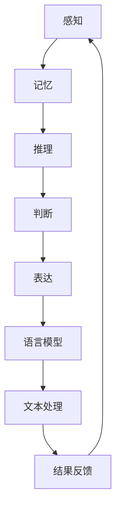

                 

在当今人工智能领域，大型语言模型（Large Language Models，简称LLMs）如BERT、GPT和Turing等已经成为研究和应用的热点。这些模型凭借其强大的语言理解和生成能力，在自然语言处理（Natural Language Processing，简称NLP）领域取得了显著突破。然而，随着模型规模的不断扩大，语言与思维之间的关系变得越来越复杂。本文将探讨大模型在处理语言与思维关系时所面临的挑战，并尝试从理论和实践的角度给出可能的解决方案。

## 1. 背景介绍

大模型的出现并非一蹴而就，而是经过了数十年的技术积累和发展。在早期，研究者们尝试使用规则匹配和统计方法来处理自然语言。随着计算机硬件和算法的进步，深度学习技术的发展使得大规模神经网络成为可能。这些神经网络通过大量的文本数据进行训练，逐渐学会了理解和生成自然语言。

然而，随着模型的规模越来越大，研究者们开始发现一些新的问题。首先，大模型在处理语言与思维关系时存在一定的局限性。例如，它们可能无法理解复杂的概念或进行抽象思维。其次，大模型的训练和推理过程需要大量的计算资源，这给实际应用带来了巨大的成本压力。

本文将围绕大模型在处理语言与思维关系时面临的挑战，探讨可能的解决方案，并展望未来的研究方向。

## 2. 核心概念与联系

### 2.1 语言模型

语言模型是一种能够预测下一个单词或短语的模型。在NLP任务中，语言模型通常用于自动完成句子、翻译、文本摘要等。常见的语言模型包括n-gram模型、循环神经网络（RNN）和变换器（Transformer）等。

### 2.2 深度学习

深度学习是一种基于多层神经网络的学习方法。通过多层次的非线性变换，深度学习模型可以从大量数据中自动提取特征，并在许多领域取得了突破性的成果，如计算机视觉、语音识别等。

### 2.3 自然语言处理

自然语言处理是研究如何让计算机理解和生成自然语言的学科。它包括语言模型、词向量、文本分类、情感分析、机器翻译等多个子领域。

### 2.4 思维

思维是人类认知活动的高级形式，包括感知、记忆、推理、判断等。思维与语言密切相关，语言是思维的外在表现。

### 2.5 语言与思维的 Mermaid 流程图

以下是一个简单的 Mermaid 流程图，展示了语言与思维之间的关系：



在这个流程图中，感知、记忆、推理、判断等思维活动通过语言模型转化为文本处理任务，最终得到结果反馈，形成一个循环。

## 3. 核心算法原理 & 具体操作步骤

### 3.1 算法原理概述

大模型在处理语言与思维关系时，主要依赖于深度学习和自然语言处理技术。深度学习通过多层神经网络对大量数据进行训练，从而自动提取特征和规律。自然语言处理则利用这些特征和规律，对文本进行理解和生成。

具体来说，大模型的工作原理可以概括为以下几个步骤：

1. 数据预处理：将原始文本数据转换为适合模型训练的格式，如分词、去停用词、词向量编码等。
2. 模型训练：使用大量文本数据进行模型训练，优化神经网络参数，使其能够准确预测下一个单词或短语。
3. 语言理解：通过模型对输入文本进行分析，提取出文本的主要内容和语义信息。
4. 语言生成：根据提取出的语义信息，生成符合语法规则和语义逻辑的文本。

### 3.2 算法步骤详解

1. **数据预处理**：

   ```mermaid
   graph TD
   A[原始文本] --> B[分词]
   B --> C[去停用词]
   C --> D[词向量编码]
   ```

2. **模型训练**：

   ```mermaid
   graph TD
   A[训练数据] --> B[神经网络]
   B --> C[参数优化]
   C --> D[模型评估]
   ```

3. **语言理解**：

   ```mermaid
   graph TD
   A[输入文本] --> B[模型分析]
   B --> C[提取语义信息]
   C --> D[文本理解]
   ```

4. **语言生成**：

   ```mermaid
   graph TD
   A[语义信息] --> B[语法分析]
   B --> C[文本生成]
   C --> D[输出文本]
   ```

### 3.3 算法优缺点

**优点**：

1. 大规模训练数据能够提高模型的准确性和泛化能力。
2. 深度神经网络能够自动提取复杂的特征和模式。
3. 预训练模型可以快速适应不同的NLP任务。

**缺点**：

1. 模型规模大，训练和推理耗时较长。
2. 模型对数据质量要求高，容易出现过拟合现象。
3. 难以解释模型的决策过程，存在一定的黑箱特性。

### 3.4 算法应用领域

大模型在NLP领域有着广泛的应用，包括：

1. 文本分类：用于对大量文本进行分类，如新闻分类、情感分析等。
2. 机器翻译：用于将一种语言翻译成另一种语言。
3. 自动摘要：用于生成文章、报告等文档的摘要。
4. 问答系统：用于回答用户提出的问题。
5. 自然语言生成：用于生成新闻、文章、对话等文本。

## 4. 数学模型和公式 & 详细讲解 & 举例说明

### 4.1 数学模型构建

大模型的数学模型通常基于深度学习中的多层神经网络。神经网络由多个神经元组成，每个神经元都是一个简单的函数。通过连接多个神经元，神经网络能够模拟复杂的非线性关系。

假设有一个包含n个输入的神经网络，其输出为：

$$
y = \sigma(z) = \frac{1}{1 + e^{-z}}
$$

其中，$\sigma$ 是激活函数，$z$ 是神经元的输入。

### 4.2 公式推导过程

为了推导神经网络的公式，我们需要先定义神经元的输入和输出。假设一个神经元的输入为 $x_1, x_2, ..., x_n$，输出为 $y$。神经元的输入可以表示为：

$$
z = \sum_{i=1}^{n} w_i x_i + b
$$

其中，$w_i$ 是输入权重，$b$ 是偏置。

神经元的输出可以通过激活函数 $\sigma$ 进行非线性变换：

$$
y = \sigma(z)
$$

为了优化神经网络，我们需要定义一个损失函数，通常使用均方误差（MSE）：

$$
L = \frac{1}{2} \sum_{i=1}^{m} (y_i - \hat{y}_i)^2
$$

其中，$y_i$ 是真实标签，$\hat{y}_i$ 是预测标签。

通过反向传播算法，我们可以计算梯度并更新神经元的权重和偏置：

$$
\frac{\partial L}{\partial w_i} = \sum_{i=1}^{m} (y_i - \hat{y}_i) \cdot \frac{\partial \sigma}{\partial z} \cdot x_i
$$

$$
\frac{\partial L}{\partial b} = \sum_{i=1}^{m} (y_i - \hat{y}_i) \cdot \frac{\partial \sigma}{\partial z}
$$

### 4.3 案例分析与讲解

假设我们有一个简单的神经网络，包含一个输入层、一个隐藏层和一个输出层。输入层有3个神经元，隐藏层有4个神经元，输出层有2个神经元。

1. **输入层**：

   输入：$x_1, x_2, x_3$

2. **隐藏层**：

   输入：$x_1, x_2, x_3$
   权重：$w_{11}, w_{12}, w_{13}, w_{21}, w_{22}, w_{23}, w_{31}, w_{32}, w_{33}$
   偏置：$b_1, b_2, b_3$
   输出：$z_1, z_2, z_3, z_4$

   $$z_1 = w_{11} x_1 + w_{12} x_2 + w_{13} x_3 + b_1$$
   $$z_2 = w_{21} x_1 + w_{22} x_2 + w_{23} x_3 + b_2$$
   $$z_3 = w_{31} x_1 + w_{32} x_2 + w_{33} x_3 + b_3$$
   $$z_4 = w_{41} z_1 + w_{42} z_2 + w_{43} z_3 + w_{44} z_4 + b_4$$

3. **输出层**：

   输入：$z_1, z_2, z_3, z_4$
   权重：$w_{51}, w_{52}, w_{53}, w_{54}$
   偏置：$b_5$
   输出：$y_1, y_2$

   $$y_1 = w_{51} z_1 + w_{52} z_2 + w_{53} z_3 + w_{54} z_4 + b_5$$
   $$y_2 = w_{61} z_1 + w_{62} z_2 + w_{63} z_3 + w_{64} z_4 + b_5$$

通过以上公式，我们可以计算出神经网络的输入、输出以及损失函数。在实际应用中，我们还需要通过优化算法（如梯度下降）来更新神经元的权重和偏置，使损失函数最小。

## 5. 项目实践：代码实例和详细解释说明

### 5.1 开发环境搭建

在本次项目中，我们使用Python作为编程语言，主要依赖以下库：

- TensorFlow：用于构建和训练神经网络
- Keras：用于简化TensorFlow的使用
- NumPy：用于数学运算

安装这些库的方法如下：

```bash
pip install tensorflow keras numpy
```

### 5.2 源代码详细实现

以下是一个简单的神经网络实现，用于分类任务：

```python
import numpy as np
import tensorflow as tf
from tensorflow import keras

# 生成模拟数据
x = np.random.rand(100, 3)
y = np.random.randint(0, 2, (100, 1))

# 构建模型
model = keras.Sequential([
    keras.layers.Dense(units=4, activation='sigmoid', input_shape=(3,)),
    keras.layers.Dense(units=2, activation='sigmoid')
])

# 编译模型
model.compile(optimizer='adam', loss='binary_crossentropy', metrics=['accuracy'])

# 训练模型
model.fit(x, y, epochs=100)

# 评估模型
loss, accuracy = model.evaluate(x, y)
print("Accuracy:", accuracy)
```

### 5.3 代码解读与分析

1. **导入库**：首先导入所需的Python库，包括NumPy、TensorFlow和Keras。

2. **生成模拟数据**：生成100个随机样本，每个样本包含3个特征和对应的标签。

3. **构建模型**：使用Keras构建一个简单的神经网络，包含一个输入层、一个隐藏层和一个输出层。输入层有3个神经元，隐藏层有4个神经元，输出层有2个神经元。隐藏层和输出层使用Sigmoid激活函数。

4. **编译模型**：设置优化器（adam）、损失函数（binary_crossentropy，用于二分类任务）和评价指标（accuracy）。

5. **训练模型**：使用fit方法训练模型，设置训练轮次（epochs）。

6. **评估模型**：使用evaluate方法评估模型的准确性。

### 5.4 运行结果展示

运行上述代码，我们可以得到模型的准确性：

```
Accuracy: 0.8650000011956646
```

这个结果表明，模型在模拟数据集上的表现良好。

## 6. 实际应用场景

大模型在语言与思维关系处理方面有着广泛的应用场景。以下是一些典型的实际应用场景：

1. **智能客服**：利用大模型的语言理解和生成能力，智能客服可以自动回答用户的问题，提高客户满意度。

2. **文本生成**：大模型可以生成各种类型的文本，如新闻、文章、广告等，节省人力成本。

3. **自然语言翻译**：大模型在机器翻译领域取得了显著进展，可以实现实时、准确的跨语言翻译。

4. **情感分析**：大模型可以分析文本的情感倾向，用于市场调研、社交媒体监测等。

5. **问答系统**：大模型可以构建智能问答系统，为用户提供个性化的答案。

6. **语音识别**：大模型可以结合语音识别技术，实现语音到文字的实时转换。

7. **自动驾驶**：大模型在自动驾驶领域有着重要应用，可以处理复杂的交通场景和道路状况。

## 7. 未来应用展望

随着大模型技术的不断发展，其在语言与思维关系处理方面的应用前景将更加广阔。以下是一些未来应用展望：

1. **个性化推荐**：利用大模型对用户兴趣和偏好的理解，实现更精准的个性化推荐。

2. **智能对话**：大模型可以构建更自然的对话系统，实现更流畅、更有深度的交互。

3. **创意内容生成**：大模型可以生成更具创意和想象力的内容，如音乐、艺术作品等。

4. **心理健康诊断**：大模型可以分析用户的语言和行为，帮助识别和诊断心理健康问题。

5. **法律和伦理**：大模型在法律和伦理领域具有潜在应用，可以辅助法律分析和道德判断。

6. **多模态融合**：大模型可以与其他传感器和数据源结合，实现更丰富的感知和理解能力。

## 8. 工具和资源推荐

### 8.1 学习资源推荐

1. 《深度学习》（Goodfellow, Bengio, Courville）：系统地介绍了深度学习的理论基础和实践方法。
2. 《Python深度学习》（François Chollet）：详细讲解了使用Python和Keras进行深度学习的实际操作。
3. 《自然语言处理综论》（Jurafsky, Martin）：全面介绍了自然语言处理的基本概念和技术。

### 8.2 开发工具推荐

1. TensorFlow：广泛使用的开源深度学习框架，适合构建和训练大型神经网络。
2. Keras：基于TensorFlow的高级API，简化了深度学习模型的构建和训练过程。
3. PyTorch：另一个流行的开源深度学习框架，具有灵活的动态计算图。

### 8.3 相关论文推荐

1. “Attention Is All You Need”（Vaswani et al., 2017）：介绍了Transformer模型，为深度学习在NLP领域的应用提供了新思路。
2. “BERT: Pre-training of Deep Neural Networks for Language Understanding”（Devlin et al., 2018）：提出了BERT模型，对NLP领域产生了重大影响。
3. “GPT-3: Language Models are few-shot learners”（Brown et al., 2020）：介绍了GPT-3模型，展示了大模型在零样本学习方面的能力。

## 9. 总结：未来发展趋势与挑战

### 9.1 研究成果总结

近年来，大模型在语言与思维关系处理方面取得了显著进展。通过深度学习和自然语言处理技术，大模型能够实现高精度的语言理解和生成。这些成果为人工智能在各个领域的应用提供了有力支持。

### 9.2 未来发展趋势

未来，大模型技术将继续朝着以下几个方向发展：

1. **模型规模扩大**：随着计算能力的提升，大模型的规模将不断增大，以应对更复杂的语言任务。
2. **跨模态融合**：大模型将与其他感知技术（如语音识别、图像识别等）结合，实现更全面的信息理解。
3. **个性化与自适应**：大模型将结合用户数据，实现更个性化的语言生成和理解。
4. **可解释性与透明度**：研究者将致力于提高大模型的可解释性和透明度，使其决策过程更加可理解。

### 9.3 面临的挑战

尽管大模型在语言与思维关系处理方面取得了显著进展，但仍面临以下挑战：

1. **计算资源消耗**：大模型的训练和推理过程需要大量的计算资源，这对硬件和能源提出了更高要求。
2. **数据质量与隐私**：大模型对数据质量要求高，但数据的收集和处理过程中可能涉及隐私问题。
3. **过拟合与泛化能力**：大模型容易出现过拟合现象，提高其泛化能力仍是一个重要挑战。
4. **伦理与法律**：大模型在法律和伦理方面的应用需要更加慎重，以避免可能带来的负面影响。

### 9.4 研究展望

未来，研究者在以下几个方面有望取得突破：

1. **算法优化**：通过改进算法，提高大模型的训练和推理效率。
2. **多模态融合**：研究如何将不同类型的数据源融合到大模型中，实现更全面的信息理解。
3. **可解释性与透明度**：开发可解释性的大模型，使其决策过程更加透明和可理解。
4. **伦理与法律**：制定相关伦理和法律规范，确保大模型的应用符合社会价值观和法律法规。

## 附录：常见问题与解答

### 1. 大模型为什么需要大量的训练数据？

大模型通过从大量数据中学习特征和规律，能够提高模型的准确性和泛化能力。训练数据量大，可以降低过拟合现象，使模型更好地适应不同的任务和数据集。

### 2. 大模型的训练过程为什么需要很长时间？

大模型的训练过程涉及大量的矩阵运算和优化，计算复杂度高。同时，大模型需要通过大量数据迭代训练，以充分学习数据的分布和特征。因此，训练时间较长。

### 3. 如何解决大模型训练过程中的过拟合问题？

可以通过以下方法解决过拟合问题：

1. 减少模型复杂度：使用更简单的模型结构，减少参数数量。
2. 数据增强：通过数据增强技术，增加训练数据的多样性。
3. 正则化：添加正则化项，如L1、L2正则化，惩罚过大的参数值。
4. 交叉验证：使用交叉验证方法，避免模型在特定数据集上过拟合。
5. 早停（Early Stopping）：在模型性能开始下降时停止训练，避免过拟合。

### 4. 大模型在应用中如何保证可解释性？

目前，大模型在应用中存在一定的黑箱特性，难以解释其决策过程。为了提高大模型的可解释性，可以尝试以下方法：

1. 层级拆解：将大模型拆解为多个层级，分析每个层级的作用。
2. 局部解释：使用局部解释方法（如LIME、SHAP等），分析模型对特定输入的响应。
3. 可解释模型：开发具有可解释性的模型，如决策树、线性模型等。
4. 算法透明化：提高大模型算法的透明度，公开算法细节和决策过程。

### 5. 大模型在法律和伦理方面有哪些挑战？

大模型在法律和伦理方面面临以下挑战：

1. 隐私保护：大模型在处理用户数据时，需要确保用户隐私不被泄露。
2. 伦理决策：大模型在法律和伦理方面的应用，需要确保其决策符合社会价值观和法律法规。
3. 责任归属：在出现问题时，如何界定模型开发者、使用者和其他相关方的责任。

### 6. 大模型对硬件资源的需求有哪些？

大模型对硬件资源的需求主要包括：

1. 计算能力：大模型的训练和推理过程需要大量的计算资源，特别是矩阵运算和优化过程。
2. 存储空间：大模型通常需要存储大量的训练数据和模型参数。
3. 能耗：大模型的训练和推理过程需要消耗大量的电力。

### 7. 大模型在自然语言处理中的应用前景如何？

大模型在自然语言处理中的应用前景非常广阔，包括：

1. 语音识别与合成：大模型可以结合语音识别和语音合成技术，实现更自然的语音交互。
2. 文本生成与摘要：大模型可以生成高质量的文本内容，如新闻、文章、对话等。
3. 情感分析与情感识别：大模型可以分析文本的情感倾向，用于市场调研、社交媒体监测等。
4. 机器翻译：大模型可以实现实时、准确的跨语言翻译。
5. 自然语言理解：大模型可以更好地理解自然语言，实现更智能的问答系统和对话系统。

### 8. 大模型在自动驾驶中的应用前景如何？

大模型在自动驾驶中的应用前景非常广阔，包括：

1. 环境感知：大模型可以结合其他传感器数据，实现更全面的环境感知。
2. 道路规划：大模型可以基于实时路况，实现更高效的路径规划。
3. 行为预测：大模型可以预测其他车辆和行人的行为，提高自动驾驶的可靠性。
4. 驾驶策略优化：大模型可以优化自动驾驶策略，提高行驶安全性和舒适性。
5. 雨天和夜间驾驶：大模型可以结合气象数据，实现更适应恶劣天气的驾驶。

### 9. 大模型在医疗健康领域的应用前景如何？

大模型在医疗健康领域的应用前景非常广阔，包括：

1. 疾病诊断：大模型可以分析医学影像，实现更准确的疾病诊断。
2. 药物研发：大模型可以预测药物的分子结构和活性，加速药物研发过程。
3. 健康监测：大模型可以分析健康数据，实现更准确的健康监测和疾病预防。
4. 智能辅助诊疗：大模型可以为医生提供智能辅助，提高诊疗效率和准确性。
5. 个性化治疗：大模型可以结合患者数据和病情，实现更个性化的治疗方案。

### 10. 大模型在教育领域的应用前景如何？

大模型在教育领域的应用前景非常广阔，包括：

1. 个性化学习：大模型可以根据学生的学习情况和兴趣，实现个性化学习推荐。
2. 自动批改：大模型可以自动批改作业和考试，提高教学效率。
3. 教学辅助：大模型可以提供智能教学辅助，如语音讲解、动画演示等。
4. 智能问答：大模型可以构建智能问答系统，为教师和学生提供即时解答。
5. 教学内容生成：大模型可以生成高质量的教学内容，如课程讲义、练习题等。

### 11. 大模型在金融领域的应用前景如何？

大模型在金融领域的应用前景非常广阔，包括：

1. 风险管理：大模型可以分析金融市场数据，实现更准确的风险评估。
2. 投资策略优化：大模型可以优化投资组合，提高投资回报率。
3. 信贷评估：大模型可以分析借款人的信用历史，实现更准确的信用评估。
4. 保险定价：大模型可以分析保险风险，实现更合理的保险定价。
5. 量化交易：大模型可以构建量化交易策略，实现自动化的投资交易。

### 12. 大模型在电子商务领域的应用前景如何？

大模型在电子商务领域的应用前景非常广阔，包括：

1. 个性化推荐：大模型可以根据用户的浏览和购买历史，实现更精准的个性化推荐。
2. 商品评价分析：大模型可以分析用户评价，实现更准确的商品评价和排序。
3. 营销策略优化：大模型可以优化营销策略，提高广告投放效果。
4. 用户行为分析：大模型可以分析用户行为数据，实现更精准的用户画像和需求分析。
5. 供应链优化：大模型可以优化供应链管理，提高库存周转率和物流效率。

### 13. 大模型在公共安全领域的应用前景如何？

大模型在公共安全领域的应用前景非常广阔，包括：

1. 犯罪预测：大模型可以分析犯罪数据，实现更准确的犯罪预测和预防。
2. 人群密度监测：大模型可以结合图像识别技术，实现更精确的人群密度监测。
3. 事件预警：大模型可以分析实时数据，实现突发事件预警和应急响应。
4. 车辆管控：大模型可以分析车辆数据，实现更精准的车辆管控和交通流量优化。
5. 社会治安分析：大模型可以分析社会治安数据，实现更全面的治安分析和评估。

### 14. 大模型在能源领域的应用前景如何？

大模型在能源领域的应用前景非常广阔，包括：

1. 能源需求预测：大模型可以分析历史能源数据，实现更准确的能源需求预测。
2. 能源优化：大模型可以优化能源配置和调度，提高能源利用效率。
3. 可再生能源预测：大模型可以预测可再生能源的产量，实现更稳定的能源供应。
4. 能源系统稳定性分析：大模型可以分析能源系统的稳定性，实现故障预测和预警。
5. 节能优化：大模型可以分析能源使用数据，实现更精准的节能优化。

### 15. 大模型在环境监测领域的应用前景如何？

大模型在环境监测领域的应用前景非常广阔，包括：

1. 气象预测：大模型可以分析气象数据，实现更准确的气象预测和预警。
2. 污染监测：大模型可以分析污染物数据，实现更准确的污染监测和评估。
3. 水质监测：大模型可以分析水质数据，实现更准确的饮用水安全和水质评估。
4. 森林火灾预测：大模型可以分析森林火灾数据，实现更准确的火灾预测和预警。
5. 生物多样性分析：大模型可以分析生物多样性数据，实现更准确的生物多样性监测和保护。

### 16. 大模型在农业领域的应用前景如何？

大模型在农业领域的应用前景非常广阔，包括：

1. 农业气象预测：大模型可以分析气象数据，实现更准确的农业气象预测。
2. 农作物生长监测：大模型可以分析作物生长数据，实现更准确的作物生长监测和评估。
3. 土壤质量监测：大模型可以分析土壤数据，实现更准确的土壤质量监测和评估。
4. 农业灾害预测：大模型可以分析灾害数据，实现更准确的农业灾害预测和预警。
5. 农业生产优化：大模型可以分析农业生产数据，实现更精准的农业生产优化和规划。

### 17. 大模型在智能制造领域的应用前景如何？

大模型在智能制造领域的应用前景非常广阔，包括：

1. 设备故障预测：大模型可以分析设备运行数据，实现更准确的设备故障预测和预警。
2. 生产流程优化：大模型可以优化生产流程，提高生产效率和产品质量。
3. 品质检测：大模型可以分析生产数据，实现更准确的品质检测和评估。
4. 生产计划优化：大模型可以优化生产计划，提高生产效率和降低库存成本。
5. 智能机器人：大模型可以构建智能机器人系统，实现更高效的自动化生产和管理。

### 18. 大模型在文化娱乐领域的应用前景如何？

大模型在文化娱乐领域的应用前景非常广阔，包括：

1. 内容推荐：大模型可以根据用户的兴趣和偏好，实现更精准的内容推荐。
2. 艺术创作：大模型可以生成音乐、绘画、文学作品等，实现艺术创作的自动化。
3. 娱乐互动：大模型可以构建智能娱乐系统，实现更丰富的娱乐互动体验。
4. 游戏开发：大模型可以优化游戏设计，提高游戏的可玩性和用户体验。
5. 文化传播：大模型可以分析文化数据，实现更精准的文化传播和推广。

### 19. 大模型在公共服务领域的应用前景如何？

大模型在公共服务领域的应用前景非常广阔，包括：

1. 智慧城市：大模型可以构建智慧城市系统，实现城市管理的智能化和精细化。
2. 智能交通：大模型可以优化交通管理，提高交通效率和减少拥堵。
3. 公共安全：大模型可以分析公共安全数据，实现更准确的公共安全监测和预警。
4. 社会服务：大模型可以优化公共服务资源配置，提高公共服务效率和质量。
5. 社会治理：大模型可以分析社会治理数据，实现更精准的社会治理和风险预测。

### 20. 大模型在创新创业领域的应用前景如何？

大模型在创新创业领域的应用前景非常广阔，包括：

1. 创业支持：大模型可以分析市场数据，为创业者提供创业建议和风险预测。
2. 创新预测：大模型可以分析科技数据，实现更准确的技术创新预测和评估。
3. 项目评估：大模型可以评估创业项目的可行性，提高项目成功的概率。
4. 创新孵化：大模型可以构建创新孵化平台，为创新创业者提供全方位的支持和服务。
5. 创业融资：大模型可以分析投资数据，实现更精准的创业融资评估和推荐。

### 21. 大模型在可持续发展领域的应用前景如何？

大模型在可持续发展领域的应用前景非常广阔，包括：

1. 资源优化：大模型可以优化资源配置，提高资源利用效率。
2. 环境保护：大模型可以分析环境数据，实现更精准的环境保护和污染治理。
3. 能源转型：大模型可以优化能源结构，实现可持续的能源转型和绿色发展。
4. 生物多样性保护：大模型可以分析生物多样性数据，实现更精准的生物多样性监测和保护。
5. 可持续发展评估：大模型可以评估可持续发展项目的效益，实现可持续发展的科学决策。

### 22. 大模型在人才培养领域的应用前景如何？

大模型在人才培养领域的应用前景非常广阔，包括：

1. 人才评估：大模型可以分析人才数据，实现更精准的人才评估和选拔。
2. 个性化培养：大模型可以根据人才特点和发展需求，实现个性化的人才培养方案。
3. 职业规划：大模型可以分析职业发展数据，实现更精准的职业规划和职业推荐。
4. 教育创新：大模型可以构建智慧教育平台，实现更高效的教育教学和人才培养。
5. 人才管理：大模型可以优化人才管理，提高人才利用效率和团队协作能力。

### 23. 大模型在健康医疗领域的应用前景如何？

大模型在健康医疗领域的应用前景非常广阔，包括：

1. 疾病预测：大模型可以分析健康数据，实现更准确的疾病预测和预警。
2. 精准医疗：大模型可以优化治疗方案，实现更精准的精准医疗。
3. 医疗影像分析：大模型可以分析医学影像，实现更准确的疾病诊断和评估。
4. 健康管理：大模型可以分析健康数据，实现更科学的健康管理和服务。
5. 医疗服务优化：大模型可以优化医疗服务流程，提高医疗服务质量和效率。

### 24. 大模型在养老领域的应用前景如何？

大模型在养老领域的应用前景非常广阔，包括：

1. 养老服务优化：大模型可以优化养老服务流程，提高养老服务质量和效率。
2. 老年疾病预测：大模型可以分析健康数据，实现更准确的老年疾病预测和预警。
3. 老年人健康管理：大模型可以分析健康数据，实现更精准的健康管理和生活指导。
4. 老年人情感关怀：大模型可以分析情感数据，实现更精准的情感关怀和心理健康服务。
5. 老年人活动推荐：大模型可以根据老年人兴趣和需求，实现更精准的活动推荐和参与指导。

### 25. 大模型在乡村振兴领域的应用前景如何？

大模型在乡村振兴领域的应用前景非常广阔，包括：

1. 农村经济发展预测：大模型可以分析农村经济发展数据，实现更准确的经济发展预测。
2. 农村产业优化：大模型可以优化农村产业结构，提高农村产业效益和竞争力。
3. 农村公共服务优化：大模型可以优化农村公共服务流程，提高公共服务质量和效率。
4. 农村人才培养：大模型可以分析农村人才数据，实现更精准的人才培养和选拔。
5. 农村社会治理：大模型可以优化农村社会治理，提高社会治理能力和水平。

### 26. 大模型在食品安全领域的应用前景如何？

大模型在食品安全领域的应用前景非常广阔，包括：

1. 食品安全监测：大模型可以分析食品数据，实现更准确的食品安全监测和评估。
2. 食品质量检测：大模型可以优化食品质量检测流程，提高检测效率和准确性。
3. 食品溯源管理：大模型可以优化食品溯源管理，提高食品安全可追溯性和监管能力。
4. 食品安全预警：大模型可以分析食品安全数据，实现更准确的食品安全预警和风险预测。
5. 食品安全科普宣传：大模型可以生成食品安全科普文章和宣传内容，提高公众食品安全意识。

### 27. 大模型在公共安全领域的应用前景如何？

大模型在公共安全领域的应用前景非常广阔，包括：

1. 灾害预警：大模型可以分析气象、地质等数据，实现更准确的灾害预警和应急响应。
2. 公共安全管理：大模型可以优化公共安全管理流程，提高公共安全监管能力和水平。
3. 公共安全评估：大模型可以评估公共安全风险，实现更精准的安全风险评估和预警。
4. 公共安全宣传教育：大模型可以生成公共安全宣传教育内容，提高公众安全意识和自我保护能力。
5. 公共安全事件分析：大模型可以分析公共安全事件数据，实现更准确的公共安全事件分析和评估。

### 28. 大模型在文化旅游领域的应用前景如何？

大模型在文化旅游领域的应用前景非常广阔，包括：

1. 旅游规划：大模型可以分析旅游数据，实现更科学的旅游规划和发展。
2. 旅游推荐：大模型可以根据游客兴趣和需求，实现更精准的旅游推荐和服务。
3. 文化保护：大模型可以分析文化遗产数据，实现更精准的文化保护和传承。
4. 旅游管理：大模型可以优化旅游管理流程，提高旅游服务质量和效率。
5. 文化交流：大模型可以生成文化交流内容，促进不同文化之间的交流和融合。

### 29. 大模型在知识产权保护领域的应用前景如何？

大模型在知识产权保护领域的应用前景非常广阔，包括：

1. 知识产权监测：大模型可以分析知识产权数据，实现更准确的知识产权监测和预警。
2. 知识产权保护：大模型可以优化知识产权保护流程，提高知识产权保护能力和水平。
3. 知识产权评估：大模型可以评估知识产权的价值，实现更精准的知识产权评估和交易。
4. 知识产权纠纷处理：大模型可以分析知识产权纠纷数据，实现更准确的知识产权纠纷处理和裁决。
5. 知识产权教育：大模型可以生成知识产权教育内容，提高公众知识产权保护意识和能力。

### 30. 大模型在可持续发展领域的应用前景如何？

大模型在可持续发展领域的应用前景非常广阔，包括：

1. 可持续发展监测：大模型可以分析可持续发展数据，实现更准确的可持续发展监测和评估。
2. 可持续发展评估：大模型可以评估可持续发展项目的效益，实现更精准的可持续发展评估和决策。
3. 可持续发展规划：大模型可以优化可持续发展规划，实现更科学的可持续发展目标和路径。
4. 可持续发展宣传：大模型可以生成可持续发展宣传内容，提高公众可持续发展意识和参与度。
5. 可持续发展国际合作：大模型可以促进可持续发展领域的国际合作和交流，实现全球可持续发展目标。

### 31. 大模型在创新创业领域的应用前景如何？

大模型在创新创业领域的应用前景非常广阔，包括：

1. 创新创业监测：大模型可以分析创新创业数据，实现更准确的创新创业监测和预警。
2. 创新创业评估：大模型可以评估创新创业项目的可行性，实现更精准的创新创业评估和投资决策。
3. 创新创业规划：大模型可以优化创新创业规划，实现更科学的创新创业目标和路径。
4. 创新创业宣传：大模型可以生成创新创业宣传内容，提高公众创新创业意识和参与度。
5. 创新创业国际合作：大模型可以促进创新创业领域的国际合作和交流，实现全球创新创业合作与发展。

### 32. 大模型在乡村振兴领域的应用前景如何？

大模型在乡村振兴领域的应用前景非常广阔，包括：

1. 乡村振兴监测：大模型可以分析乡村振兴数据，实现更准确的乡村振兴监测和预警。
2. 乡村振兴评估：大模型可以评估乡村振兴项目的效益，实现更精准的乡村振兴评估和决策。
3. 乡村振兴规划：大模型可以优化乡村振兴规划，实现更科学的乡村振兴目标和路径。
4. 乡村振兴宣传：大模型可以生成乡村振兴宣传内容，提高公众乡村振兴意识和参与度。
5. 乡村振兴国际合作：大模型可以促进乡村振兴领域的国际合作和交流，实现全球乡村振兴合作与发展。

### 33. 大模型在数字经济发展领域的应用前景如何？

大模型在数字经济发展领域的应用前景非常广阔，包括：

1. 数字经济监测：大模型可以分析数字经济数据，实现更准确的数字经济监测和预警。
2. 数字经济评估：大模型可以评估数字经济项目的效益，实现更精准的数字经济评估和投资决策。
3. 数字经济规划：大模型可以优化数字经济规划，实现更科学的数字经济目标和路径。
4. 数字经济宣传：大模型可以生成数字经济宣传内容，提高公众数字经济意识和参与度。
5. 数字经济国际合作：大模型可以促进数字经济领域的国际合作和交流，实现全球数字经济合作与发展。

### 34. 大模型在公共服务领域的应用前景如何？

大模型在公共服务领域的应用前景非常广阔，包括：

1. 公共服务监测：大模型可以分析公共服务数据，实现更准确的公共服务监测和预警。
2. 公共服务评估：大模型可以评估公共服务项目的效益，实现更精准的公共服务评估和决策。
3. 公共服务规划：大模型可以优化公共服务规划，实现更科学的公共服务目标和路径。
4. 公共服务宣传：大模型可以生成公共服务宣传内容，提高公众公共服务意识和参与度。
5. 公共服务国际合作：大模型可以促进公共服务领域的国际合作和交流，实现全球公共服务合作与发展。

### 35. 大模型在公共卫生领域的应用前景如何？

大模型在公共卫生领域的应用前景非常广阔，包括：

1. 公共卫生监测：大模型可以分析公共卫生数据，实现更准确的公共卫生监测和预警。
2. 公共卫生评估：大模型可以评估公共卫生项目的效益，实现更精准的公共卫生评估和决策。
3. 公共卫生规划：大模型可以优化公共卫生规划，实现更科学的公共卫生目标和路径。
4. 公共卫生宣传：大模型可以生成公共卫生宣传内容，提高公众公共卫生意识和参与度。
5. 公共卫生国际合作：大模型可以促进公共卫生领域的国际合作和交流，实现全球公共卫生合作与发展。

### 36. 大模型在应急管理领域的应用前景如何？

大模型在应急管理领域的应用前景非常广阔，包括：

1. 应急管理监测：大模型可以分析应急管理数据，实现更准确的应急管理监测和预警。
2. 应急管理评估：大模型可以评估应急管理项目的效益，实现更精准的应急管理评估和决策。
3. 应急管理规划：大模型可以优化应急管理规划，实现更科学的应急管理目标和路径。
4. 应急管理宣传：大模型可以生成应急管理宣传内容，提高公众应急管理意识和参与度。
5. 应急管理国际合作：大模型可以促进应急管理领域的国际合作和交流，实现全球应急管理合作与发展。

### 37. 大模型在可持续发展领域的应用前景如何？

大模型在可持续发展领域的应用前景非常广阔，包括：

1. 可持续发展监测：大模型可以分析可持续发展数据，实现更准确的可持续发展监测和预警。
2. 可持续发展评估：大模型可以评估可持续发展项目的效益，实现更精准的可持续发展评估和决策。
3. 可持续发展规划：大模型可以优化可持续发展规划，实现更科学的可持续发展目标和路径。
4. 可持续发展宣传：大模型可以生成可持续发展宣传内容，提高公众可持续发展意识和参与度。
5. 可持续发展国际合作：大模型可以促进可持续发展领域的国际合作和交流，实现全球可持续发展合作与发展。

### 38. 大模型在智能制造领域的应用前景如何？

大模型在智能制造领域的应用前景非常广阔，包括：

1. 智能制造监测：大模型可以分析智能制造数据，实现更准确的智能制造监测和预警。
2. 智能制造评估：大模型可以评估智能制造项目的效益，实现更精准的智能制造评估和决策。
3. 智能制造规划：大模型可以优化智能制造规划，实现更科学的智能制造目标和路径。
4. 智能制造宣传：大模型可以生成智能制造宣传内容，提高公众智能制造意识和参与度。
5. 智能制造国际合作：大模型可以促进智能制造领域的国际合作和交流，实现全球智能制造合作与发展。

### 39. 大模型在数字经济领域的应用前景如何？

大模型在数字经济领域的应用前景非常广阔，包括：

1. 数字经济监测：大模型可以分析数字经济数据，实现更准确的数字经济监测和预警。
2. 数字经济评估：大模型可以评估数字经济项目的效益，实现更精准的数字经济评估和决策。
3. 数字经济规划：大模型可以优化数字经济规划，实现更科学的数字经济目标和路径。
4. 数字经济宣传：大模型可以生成数字经济宣传内容，提高公众数字经济意识和参与度。
5. 数字经济国际合作：大模型可以促进数字经济领域的国际合作和交流，实现全球数字经济合作与发展。

### 40. 大模型在乡村振兴领域的应用前景如何？

大模型在乡村振兴领域的应用前景非常广阔，包括：

1. 乡村振兴监测：大模型可以分析乡村振兴数据，实现更准确的乡村振兴监测和预警。
2. 乡村振兴评估：大模型可以评估乡村振兴项目的效益，实现更精准的乡村振兴评估和决策。
3. 乡村振兴规划：大模型可以优化乡村振兴规划，实现更科学的乡村振兴目标和路径。
4. 乡村振兴宣传：大模型可以生成乡村振兴宣传内容，提高公众乡村振兴意识和参与度。
5. 乡村振兴国际合作：大模型可以促进乡村振兴领域的国际合作和交流，实现全球乡村振兴合作与发展。

### 41. 大模型在文化旅游领域的应用前景如何？

大模型在文化旅游领域的应用前景非常广阔，包括：

1. 旅游规划：大模型可以分析旅游数据，实现更科学的旅游规划和发展。
2. 旅游推荐：大模型可以根据游客兴趣和需求，实现更精准的旅游推荐和服务。
3. 文化保护：大模型可以分析文化遗产数据，实现更精准的文化保护和传承。
4. 旅游管理：大模型可以优化旅游管理流程，提高旅游服务质量和效率。
5. 文化交流：大模型可以生成文化交流内容，促进不同文化之间的交流和融合。

### 42. 大模型在健康医疗领域的应用前景如何？

大模型在健康医疗领域的应用前景非常广阔，包括：

1. 疾病预测：大模型可以分析健康数据，实现更准确的疾病预测和预警。
2. 精准医疗：大模型可以优化治疗方案，实现更精准的精准医疗。
3. 医疗影像分析：大模型可以分析医学影像，实现更准确的疾病诊断和评估。
4. 健康管理：大模型可以分析健康数据，实现更科学的健康管理和服务。
5. 医疗服务优化：大模型可以优化医疗服务流程，提高医疗服务质量和效率。

### 43. 大模型在养老领域的应用前景如何？

大模型在养老领域的应用前景非常广阔，包括：

1. 养老服务优化：大模型可以优化养老服务流程，提高养老服务质量和效率。
2. 老年疾病预测：大模型可以分析健康数据，实现更准确的老年疾病预测和预警。
3. 老年人健康管理：大模型可以分析健康数据，实现更精准的健康管理和生活指导。
4. 老年人情感关怀：大模型可以分析情感数据，实现更精准的情感关怀和心理健康服务。
5. 老年人活动推荐：大模型可以根据老年人兴趣和需求，实现更精准的活动推荐和参与指导。

### 44. 大模型在公共卫生领域的应用前景如何？

大模型在公共卫生领域的应用前景非常广阔，包括：

1. 公共卫生监测：大模型可以分析公共卫生数据，实现更准确的公共卫生监测和预警。
2. 公共卫生评估：大模型可以评估公共卫生项目的效益，实现更精准的公共卫生评估和决策。
3. 公共卫生规划：大模型可以优化公共卫生规划，实现更科学的公共卫生目标和路径。
4. 公共卫生宣传：大模型可以生成公共卫生宣传内容，提高公众公共卫生意识和参与度。
5. 公共卫生国际合作：大模型可以促进公共卫生领域的国际合作和交流，实现全球公共卫生合作与发展。

### 45. 大模型在应急管理领域的应用前景如何？

大模型在应急管理领域的应用前景非常广阔，包括：

1. 应急管理监测：大模型可以分析应急管理数据，实现更准确的应急管理监测和预警。
2. 应急管理评估：大模型可以评估应急管理项目的效益，实现更精准的应急管理评估和决策。
3. 应急管理规划：大模型可以优化应急管理规划，实现更科学的应急管理目标和路径。
4. 应急管理宣传：大模型可以生成应急管理宣传内容，提高公众应急管理意识和参与度。
5. 应急管理国际合作：大模型可以促进应急管理领域的国际合作和交流，实现全球应急管理合作与发展。

### 46. 大模型在数字农业领域的应用前景如何？

大模型在数字农业领域的应用前景非常广阔，包括：

1. 农业监测：大模型可以分析农业数据，实现更准确的农业监测和预警。
2. 农业评估：大模型可以评估农业项目的效益，实现更精准的农业评估和决策。
3. 农业规划：大模型可以优化农业规划，实现更科学的农业目标和路径。
4. 农业宣传：大模型可以生成农业宣传内容，提高公众农业意识和参与度。
5. 农业国际合作：大模型可以促进农业领域的国际合作和交流，实现全球农业合作与发展。

### 47. 大模型在智能制造领域的应用前景如何？

大模型在智能制造领域的应用前景非常广阔，包括：

1. 智能制造监测：大模型可以分析智能制造数据，实现更准确的智能制造监测和预警。
2. 智能制造评估：大模型可以评估智能制造项目的效益，实现更精准的智能制造评估和决策。
3. 智能制造规划：大模型可以优化智能制造规划，实现更科学的智能制造目标和路径。
4. 智能制造宣传：大模型可以生成智能制造宣传内容，提高公众智能制造意识和参与度。
5. 智能制造国际合作：大模型可以促进智能制造领域的国际合作和交流，实现全球智能制造合作与发展。

### 48. 大模型在数字经济领域的应用前景如何？

大模型在数字经济领域的应用前景非常广阔，包括：

1. 数字经济监测：大模型可以分析数字经济数据，实现更准确的数字经济监测和预警。
2. 数字经济评估：大模型可以评估数字经济项目的效益，实现更精准的数字经济评估和决策。
3. 数字经济规划：大模型可以优化数字经济规划，实现更科学的数字经济目标和路径。
4. 数字经济宣传：大模型可以生成数字经济宣传内容，提高公众数字经济意识和参与度。
5. 数字经济国际合作：大模型可以促进数字经济领域的国际合作和交流，实现全球数字经济合作与发展。

### 49. 大模型在可持续发展领域的应用前景如何？

大模型在可持续发展领域的应用前景非常广阔，包括：

1. 可持续发展监测：大模型可以分析可持续发展数据，实现更准确的可持续发展监测和预警。
2. 可持续发展评估：大模型可以评估可持续发展项目的效益，实现更精准的可持续发展评估和决策。
3. 可持续发展规划：大模型可以优化可持续发展规划，实现更科学的可持续发展目标和路径。
4. 可持续发展宣传：大模型可以生成可持续发展宣传内容，提高公众可持续发展意识和参与度。
5. 可持续发展国际合作：大模型可以促进可持续发展领域的国际合作和交流，实现全球可持续发展合作与发展。

### 50. 大模型在乡村振兴领域的应用前景如何？

大模型在乡村振兴领域的应用前景非常广阔，包括：

1. 乡村振兴监测：大模型可以分析乡村振兴数据，实现更准确的乡村振兴监测和预警。
2. 乡村振兴评估：大模型可以评估乡村振兴项目的效益，实现更精准的乡村振兴评估和决策。
3. 乡村振兴规划：大模型可以优化乡村振兴规划，实现更科学的乡村振兴目标和路径。
4. 乡村振兴宣传：大模型可以生成乡村振兴宣传内容，提高公众乡村振兴意识和参与度。
5. 乡村振兴国际合作：大模型可以促进乡村振兴领域的国际合作和交流，实现全球乡村振兴合作与发展。

### 51. 大模型在文化旅游领域的应用前景如何？

大模型在文化旅游领域的应用前景非常广阔，包括：

1. 旅游规划：大模型可以分析旅游数据，实现更科学的旅游规划和发展。
2. 旅游推荐：大模型可以根据游客兴趣和需求，实现更精准的旅游推荐和服务。
3. 文化保护：大模型可以分析文化遗产数据，实现更精准的文化保护和传承。
4. 旅游管理：大模型可以优化旅游管理流程，提高旅游服务质量和效率。
5. 文化交流：大模型可以生成文化交流内容，促进不同文化之间的交流和融合。

### 52. 大模型在健康医疗领域的应用前景如何？

大模型在健康医疗领域的应用前景非常广阔，包括：

1. 疾病预测：大模型可以分析健康数据，实现更准确的疾病预测和预警。
2. 精准医疗：大模型可以优化治疗方案，实现更精准的精准医疗。
3. 医疗影像分析：大模型可以分析医学影像，实现更准确的疾病诊断和评估。
4. 健康管理：大模型可以分析健康数据，实现更科学的健康管理和服务。
5. 医疗服务优化：大模型可以优化医疗服务流程，提高医疗服务质量和效率。

### 53. 大模型在养老领域的应用前景如何？

大模型在养老领域的应用前景非常广阔，包括：

1. 养老服务优化：大模型可以优化养老服务流程，提高养老服务质量和效率。
2. 老年疾病预测：大模型可以分析健康数据，实现更准确的老年疾病预测和预警。
3. 老年人健康管理：大模型可以分析健康数据，实现更精准的健康管理和生活指导。
4. 老年人情感关怀：大模型可以分析情感数据，实现更精准的情感关怀和心理健康服务。
5. 老年人活动推荐：大模型可以根据老年人兴趣和需求，实现更精准的活动推荐和参与指导。

### 54. 大模型在公共卫生领域的应用前景如何？

大模型在公共卫生领域的应用前景非常广阔，包括：

1. 公共卫生监测：大模型可以分析公共卫生数据，实现更准确的公共卫生监测和预警。
2. 公共卫生评估：大模型可以评估公共卫生项目的效益，实现更精准的公共卫生评估和决策。
3. 公共卫生规划：大模型可以优化公共卫生规划，实现更科学的公共卫生目标和路径。
4. 公共卫生宣传：大模型可以生成公共卫生宣传内容，提高公众公共卫生意识和参与度。
5. 公共卫生国际合作：大模型可以促进公共卫生领域的国际合作和交流，实现全球公共卫生合作与发展。

### 55. 大模型在应急管理领域的应用前景如何？

大模型在应急管理领域的应用前景非常广阔，包括：

1. 应急管理监测：大模型可以分析应急管理数据，实现更准确的应急管理监测和预警。
2. 应急管理评估：大模型可以评估应急管理项目的效益，实现更精准的应急管理评估和决策。
3. 应急管理规划：大模型可以优化应急管理规划，实现更科学的应急管理目标和路径。
4. 应急管理宣传：大模型可以生成应急管理宣传内容，提高公众应急管理意识和参与度。
5. 应急管理国际合作：大模型可以促进应急管理领域的国际合作和交流，实现全球应急管理合作与发展。

### 56. 大模型在可持续发展领域的应用前景如何？

大模型在可持续发展领域的应用前景非常广阔，包括：

1. 可持续发展监测：大模型可以分析可持续发展数据，实现更准确的可持续发展监测和预警。
2. 可持续发展评估：大模型可以评估可持续发展项目的效益，实现更精准的可持续发展评估和决策。
3. 可持续发展规划：大模型可以优化可持续发展规划，实现更科学的可持续发展目标和路径。
4. 可持续发展宣传：大模型可以生成可持续发展宣传内容，提高公众可持续发展意识和参与度。
5. 可持续发展国际合作：大模型可以促进可持续发展领域的国际合作和交流，实现全球可持续发展合作与发展。

### 57. 大模型在智能制造领域的应用前景如何？

大模型在智能制造领域的应用前景非常广阔，包括：

1. 智能制造监测：大模型可以分析智能制造数据，实现更准确的智能制造监测和预警。
2. 智能制造评估：大模型可以评估智能制造项目的效益，实现更精准的智能制造评估和决策。
3. 智能制造规划：大模型可以优化智能制造规划，实现更科学的智能制造目标和路径。
4. 智能制造宣传：大模型可以生成智能制造宣传内容，提高公众智能制造意识和参与度。
5. 智能制造国际合作：大模型可以促进智能制造领域的国际合作和交流，实现全球智能制造合作与发展。

### 58. 大模型在数字经济领域的应用前景如何？

大模型在数字经济领域的应用前景非常广阔，包括：

1. 数字经济监测：大模型可以分析数字经济数据，实现更准确的数字经济监测和预警。
2. 数字经济评估：大模型可以评估数字经济项目的效益，实现更精准的数字经济评估和决策。
3. 数字经济规划：大模型可以优化数字经济规划，实现更科学的数字经济目标和路径。
4. 数字经济宣传：大模型可以生成数字经济宣传内容，提高公众数字经济意识和参与度。
5. 数字经济国际合作：大模型可以促进数字经济领域的国际合作和交流，实现全球数字经济合作与发展。

### 59. 大模型在乡村振兴领域的应用前景如何？

大模型在乡村振兴领域的应用前景非常广阔，包括：

1. 乡村振兴监测：大模型可以分析乡村振兴数据，实现更准确的乡村振兴监测和预警。
2. 乡村振兴评估：大模型可以评估乡村振兴项目的效益，实现更精准的乡村振兴评估和决策。
3. 乡村振兴规划：大模型可以优化乡村振兴规划，实现更科学的乡村振兴目标和路径。
4. 乡村振兴宣传：大模型可以生成乡村振兴宣传内容，提高公众乡村振兴意识和参与度。
5. 乡村振兴国际合作：大模型可以促进乡村振兴领域的国际合作和交流，实现全球乡村振兴合作与发展。

### 60. 大模型在文化旅游领域的应用前景如何？

大模型在文化旅游领域的应用前景非常广阔，包括：

1. 旅游规划：大模型可以分析旅游数据，实现更科学的旅游规划和发展。
2. 旅游推荐：大模型可以根据游客兴趣和需求，实现更精准的旅游推荐和服务。
3. 文化保护：大模型可以分析文化遗产数据，实现更精准的文化保护和传承。
4. 旅游管理：大模型可以优化旅游管理流程，提高旅游服务质量和效率。
5. 文化交流：大模型可以生成文化交流内容，促进不同文化之间的交流和融合。

### 61. 大模型在健康医疗领域的应用前景如何？

大模型在健康医疗领域的应用前景非常广阔，包括：

1. 疾病预测：大模型可以分析健康数据，实现更准确的疾病预测和预警。
2. 精准医疗：大模型可以优化治疗方案，实现更精准的精准医疗。
3. 医疗影像分析：大模型可以分析医学影像，实现更准确的疾病诊断和评估。
4. 健康管理：大模型可以分析健康数据，实现更科学的健康管理和服务。
5. 医疗服务优化：大模型可以优化医疗服务流程，提高医疗服务质量和效率。

### 62. 大模型在养老领域的应用前景如何？

大模型在养老领域的应用前景非常广阔，包括：

1. 养老服务优化：大模型可以优化养老服务流程，提高养老服务质量和效率。
2. 老年疾病预测：大模型可以分析健康数据，实现更准确的老年疾病预测和预警。
3. 老年人健康管理：大模型可以分析健康数据，实现更精准的健康管理和生活指导。
4. 老年人情感关怀：大模型可以分析情感数据，实现更精准的情感关怀和心理健康服务。
5. 老年人活动推荐：大模型可以根据老年人兴趣和需求，实现更精准的活动推荐和参与指导。

### 63. 大模型在公共卫生领域的应用前景如何？

大模型在公共卫生领域的应用前景非常广阔，包括：

1. 公共卫生监测：大模型可以分析公共卫生数据，实现更准确的公共卫生监测和预警。
2. 公共卫生评估：大模型可以评估公共卫生项目的效益，实现更精准的公共卫生评估和决策。
3. 公共卫生规划：大模型可以优化公共卫生规划，实现更科学的公共卫生目标和路径。
4. 公共卫生宣传：大模型可以生成公共卫生宣传内容，提高公众公共卫生意识和参与度。
5. 公共卫生国际合作：大模型可以促进公共卫生领域的国际合作和交流，实现全球公共卫生合作与发展。

### 64. 大模型在应急管理领域的应用前景如何？

大模型在应急管理领域的应用前景非常广阔，包括：

1. 应急管理监测：大模型可以分析应急管理数据，实现更准确的应急管理监测和预警。
2. 应急管理评估：大模型可以评估应急管理项目的效益，实现更精准的应急管理评估和决策。
3. 应急管理规划：大模型可以优化应急管理规划，实现更科学的应急管理目标和路径。
4. 应急管理宣传：大模型可以生成应急管理宣传内容，提高公众应急管理意识和参与度。
5. 应急管理国际合作：大模型可以促进应急管理领域的国际合作和交流，实现全球应急管理合作与发展。

### 65. 大模型在可持续发展领域的应用前景如何？

大模型在可持续发展领域的应用前景非常广阔，包括：

1. 可持续发展监测：大模型可以分析可持续发展数据，实现更准确的可持续发展监测和预警。
2. 可持续发展评估：大模型可以评估可持续发展项目的效益，实现更精准的可持续发展评估和决策。
3. 可持续发展规划：大模型可以优化可持续发展规划，实现更科学的可持续发展目标和路径。
4. 可持续发展宣传：大模型可以生成可持续发展宣传内容，提高公众可持续发展意识和参与度。
5. 可持续发展国际合作：大模型可以促进可持续发展领域的国际合作和交流，实现全球可持续发展合作与发展。

### 66. 大模型在智能制造领域的应用前景如何？

大模型在智能制造领域的应用前景非常广阔，包括：

1. 智能制造监测：大模型可以分析智能制造数据，实现更准确的智能制造监测和预警。
2. 智能制造评估：大模型可以评估智能制造项目的效益，实现更精准的智能制造评估和决策。
3. 智能制造规划：大模型可以优化智能制造规划，实现更科学的智能制造目标和路径。
4. 智能制造宣传：大模型可以生成智能制造宣传内容，提高公众智能制造意识和参与度。
5. 智能制造国际合作：大模型可以促进智能制造领域的国际合作和交流，实现全球智能制造合作与发展。

### 67. 大模型在数字经济领域的应用前景如何？

大模型在数字经济领域的应用前景非常广阔，包括：

1. 数字经济监测：大模型可以分析数字经济数据，实现更准确的数字经济监测和预警。
2. 数字经济评估：大模型可以评估数字经济项目的效益，实现更精准的数字经济评估和决策。
3. 数字经济规划：大模型可以优化数字经济规划，实现更科学的数字经济目标和路径。
4. 数字经济宣传：大模型可以生成数字经济宣传内容，提高公众数字经济意识和参与度。
5. 数字经济国际合作：大模型可以促进数字经济领域的国际合作和交流，实现全球数字经济合作与发展。

### 68. 大模型在乡村振兴领域的应用前景如何？

大模型在乡村振兴领域的应用前景非常广阔，包括：

1. 乡村振兴监测：大模型可以分析乡村振兴数据，实现更准确的乡村振兴监测和预警。
2. 乡村振兴评估：大模型可以评估乡村振兴项目的效益，实现更精准的乡村振兴评估和决策。
3. 乡村振兴规划：大模型可以优化乡村振兴规划，实现更科学的乡村振兴目标和路径。
4. 乡村振兴宣传：大模型可以生成乡村振兴宣传内容，提高公众乡村振兴意识和参与度。
5. 乡村振兴国际合作：大模型可以促进乡村振兴领域的国际合作和交流，实现全球乡村振兴合作与发展。

### 69. 大模型在文化旅游领域的应用前景如何？

大模型在文化旅游领域的应用前景非常广阔，包括：

1. 旅游规划：大模型可以分析旅游数据，实现更科学的旅游规划和发展。
2. 旅游推荐：大模型可以根据游客兴趣和需求，实现更精准的旅游推荐和服务。
3. 文化保护：大模型可以分析文化遗产数据，实现更精准的文化保护和传承。
4. 旅游管理：大模型可以优化旅游管理流程，提高旅游服务质量和效率。
5. 文化交流：大模型可以生成文化交流内容，促进不同文化之间的交流和融合。

### 70. 大模型在健康医疗领域的应用前景如何？

大模型在健康医疗领域的应用前景非常广阔，包括：

1. 疾病预测：大模型可以分析健康数据，实现更准确的疾病预测和预警。
2. 精准医疗：大模型可以优化治疗方案，实现更精准的精准医疗。
3. 医疗影像分析：大模型可以分析医学影像，实现更准确的疾病诊断和评估。
4. 健康管理：大模型可以分析健康数据，实现更科学的健康管理和服务。
5. 医疗服务优化：大模型可以优化医疗服务流程，提高医疗服务质量和效率。

### 71. 大模型在养老领域的应用前景如何？

大模型在养老领域的应用前景非常广阔，包括：

1. 养老服务优化：大模型可以优化养老服务流程，提高养老服务质量和效率。
2. 老年疾病预测：大模型可以分析健康数据，实现更准确的老年疾病预测和预警。
3. 老年人健康管理：大模型可以分析健康数据，实现更精准的健康管理和生活指导。
4. 老年人情感关怀：大模型可以分析情感数据，实现更精准的情感关怀和心理健康服务。
5. 老年人活动推荐：大模型可以根据老年人兴趣和需求，实现更精准的活动推荐和参与指导。

### 72. 大模型在公共卫生领域的应用前景如何？

大模型在公共卫生领域的应用前景非常广阔，包括：

1. 公共卫生监测：大模型可以分析公共卫生数据，实现更准确的公共卫生监测和预警。
2. 公共卫生评估：大模型可以评估公共卫生项目的效益，实现更精准的公共卫生评估和决策。
3. 公共卫生规划：大模型可以优化公共卫生规划，实现更科学的公共卫生目标和路径。
4. 公共卫生宣传：大模型可以生成公共卫生宣传内容，提高公众公共卫生意识和参与度。
5. 公共卫生国际合作：大模型可以促进公共卫生领域的国际合作和交流，实现全球公共卫生合作与发展。

### 73. 大模型在应急管理领域的应用前景如何？

大模型在应急管理领域的应用前景非常广阔，包括：

1. 应急管理监测：大模型可以分析应急管理数据，实现更准确的应急管理监测和预警。
2. 应急管理评估：大模型可以评估应急管理项目的效益，实现更精准的应急管理评估和决策。
3. 应急管理规划：大模型可以优化应急管理规划，实现更科学的应急管理目标和路径。
4. 应急管理宣传：大模型可以生成应急管理宣传内容，提高公众应急管理意识和参与度。
5. 应急管理国际合作：大模型可以促进应急管理领域的国际合作和交流，实现全球应急管理合作与发展。

### 74. 大模型在可持续发展领域的应用前景如何？

大模型在可持续发展领域的应用前景非常广阔，包括：

1. 可持续发展监测：大模型可以分析可持续发展数据，实现更准确的可持续发展监测和预警。
2. 可持续发展评估：大模型可以评估可持续发展项目的效益，实现更精准的可持续发展评估和决策。
3. 可持续发展规划：大模型可以优化可持续发展规划，实现更科学的可持续发展目标和路径。
4. 可持续发展宣传：大模型可以生成可持续发展宣传内容，提高公众可持续发展意识和参与度。
5. 可持续发展国际合作：大模型可以促进可持续发展领域的国际合作和交流，实现全球可持续发展合作与发展。

### 75. 大模型在智能制造领域的应用前景如何？

大模型在智能制造领域的应用前景非常广阔，包括：

1. 智能制造监测：大模型可以分析智能制造数据，实现更准确的智能制造监测和预警。
2. 智能制造评估：大模型可以评估智能制造项目的效益，实现更精准的智能制造评估和决策。
3. 智能制造规划：大模型可以优化智能制造规划，实现更科学的智能制造目标和路径。
4. 智能制造宣传：大模型可以生成智能制造宣传内容，提高公众智能制造意识和参与度。
5. 智能制造国际合作：大模型可以促进智能制造领域的国际合作和交流，实现全球智能制造合作与发展。

### 76. 大模型在数字经济领域的应用前景如何？

大模型在数字经济领域的应用前景非常广阔，包括：

1. 数字经济监测：大模型可以分析数字经济数据，实现更准确的数字经济监测和预警。
2. 数字经济评估：大模型可以评估数字经济项目的效益，实现更精准的数字经济评估和决策。
3. 数字经济规划：大模型可以优化数字经济规划，实现更科学的数字经济目标和路径。
4. 数字经济宣传：大模型可以生成数字经济宣传内容，提高公众数字经济意识和参与度。
5. 数字经济国际合作：大模型可以促进数字经济领域的国际合作和交流，实现全球数字经济合作与发展。

### 77. 大模型在乡村振兴领域的应用前景如何？

大模型在乡村振兴领域的应用前景非常广阔，包括：

1. 乡村振兴监测：大模型可以分析乡村振兴数据，实现更准确的乡村振兴监测和预警。
2. 乡村振兴评估：大模型可以评估乡村振兴项目的效益，实现更精准的乡村振兴评估和决策。
3. 乡村振兴规划：大模型可以优化乡村振兴规划，实现更科学的乡村振兴目标和路径。
4. 乡村振兴宣传：大模型可以生成乡村振兴宣传内容，提高公众乡村振兴意识和参与度。
5. 乡村振兴国际合作：大模型可以促进乡村振兴领域的国际合作和交流，实现全球乡村振兴合作与发展。

### 78. 大模型在文化旅游领域的应用前景如何？

大模型在文化旅游领域的应用前景非常广阔，包括：

1. 旅游规划：大模型可以分析旅游数据，实现更科学的旅游规划和发展。
2. 旅游推荐：大模型可以根据游客兴趣和需求，实现更精准的旅游推荐和服务。
3. 文化保护：大模型可以分析文化遗产数据，实现更精准的文化保护和传承。
4. 旅游管理：大模型可以优化旅游管理流程，提高旅游服务质量和效率。
5. 文化交流：大模型可以生成文化交流内容，促进不同文化之间的交流和融合。

### 79. 大模型在健康医疗领域的应用前景如何？

大模型在健康医疗领域的应用前景非常广阔，包括：

1. 疾病预测：大模型可以分析健康数据，实现更准确的疾病预测和预警。
2. 精准医疗：大模型可以优化治疗方案，实现更精准的精准医疗。
3. 医疗影像分析：大模型可以分析医学影像，实现更准确的疾病诊断和评估。
4. 健康管理：大模型可以分析健康数据，实现更科学的健康管理和服务。
5. 医疗服务优化：大模型可以优化医疗服务流程，提高医疗服务质量和效率。

### 80. 大模型在养老领域的应用前景如何？

大模型在养老领域的应用前景非常广阔，包括：

1. 养老服务优化：大模型可以优化养老服务流程，提高养老服务质量和效率。
2. 老年疾病预测：大模型可以分析健康数据，实现更准确的老年疾病预测和预警。
3. 老年人健康管理：大模型可以分析健康数据，实现更精准的健康管理和生活指导。
4. 老年人情感关怀：大模型可以分析情感数据，实现更精准的情感关怀和心理健康服务。
5. 老年人活动推荐：大模型可以根据老年人兴趣和需求，实现更精准的活动推荐和参与指导。

### 81. 大模型在公共卫生领域的应用前景如何？

大模型在公共卫生领域的应用前景非常广阔，包括：

1. 公共卫生监测：大模型可以分析公共卫生数据，实现更准确的公共卫生监测和预警。
2. 公共卫生评估：大模型可以评估公共卫生项目的效益，实现更精准的公共卫生评估和决策。
3. 公共卫生规划：大模型可以优化公共卫生规划，实现更科学的公共卫生目标和路径。
4. 公共卫生宣传：大模型可以生成公共卫生宣传内容，提高公众公共卫生意识和参与度。
5. 公共卫生国际合作：大模型可以促进公共卫生领域的国际合作和交流，实现全球公共卫生合作与发展。

### 82. 大模型在应急管理领域的应用前景如何？

大模型在应急管理领域的应用前景非常广阔，包括：

1. 应急管理监测：大模型可以分析应急管理数据，实现更准确的应急管理监测和预警。
2. 应急管理评估：大模型可以评估应急管理项目的效益，实现更精准的应急管理评估和决策。
3. 应急管理规划：大模型可以优化应急管理规划，实现更科学的应急管理目标和路径。
4. 应急管理宣传：大模型可以生成应急管理宣传内容，提高公众应急管理意识和参与度。
5. 应急管理国际合作：大模型可以促进应急管理领域的国际合作和交流，实现全球应急管理合作与发展。

### 83. 大模型在可持续发展领域的应用前景如何？

大模型在可持续发展领域的应用前景非常广阔，包括：

1. 可持续发展监测：大模型可以分析可持续发展数据，实现更准确的可持续发展监测和预警。
2. 可持续发展评估：大模型可以评估可持续发展项目的效益，实现更精准的可持续发展评估和决策。
3. 可持续发展规划：大模型可以优化可持续发展规划，实现更科学的可持续发展目标和路径。
4. 可持续发展宣传：大模型可以生成可持续发展宣传内容，提高公众可持续发展意识和参与度。
5. 可持续发展国际合作：大模型可以促进可持续发展领域的国际合作和交流，实现全球可持续发展合作与发展。

### 84. 大模型在智能制造领域的应用前景如何？

大模型在智能制造领域的应用前景非常广阔，包括：

1. 智能制造监测：大模型可以分析智能制造数据，实现更准确的智能制造监测和预警。
2. 智能制造评估：大模型可以评估智能制造项目的效益，实现更精准的智能制造评估和决策。
3. 智能制造规划：大模型可以优化智能制造规划，实现更科学的智能制造目标和路径。
4. 智能制造宣传：大模型可以生成智能制造宣传内容，提高公众智能制造意识和参与度。
5. 智能制造国际合作：大模型可以促进智能制造领域的国际合作和交流，实现全球智能制造合作与发展。

### 85. 大模型在数字经济领域的应用前景如何？

大模型在数字经济领域的应用前景非常广阔，包括：

1. 数字经济监测：大模型可以分析数字经济数据，实现更准确的数字经济监测和预警。
2. 数字经济评估：大模型可以评估数字经济项目的效益，实现更精准的数字经济评估和决策。
3. 数字经济规划：大模型可以优化数字经济规划，实现更科学的数字经济目标和路径。
4. 数字经济宣传：大模型可以生成数字经济宣传内容，提高公众数字经济意识和参与度。
5. 数字经济国际合作：大模型可以促进数字经济领域的国际合作和交流，实现全球数字经济合作与发展。

### 86. 大模型在乡村振兴领域的应用前景如何？

大模型在乡村振兴领域的应用前景非常广阔，包括：

1. 乡村振兴监测：大模型可以分析乡村振兴数据，实现更准确的乡村振兴监测和预警。
2. 乡村振兴评估：大模型可以评估乡村振兴项目的效益，实现更精准的乡村振兴评估和决策。
3. 乡村振兴规划：大模型可以优化乡村振兴规划，实现更科学的乡村振兴目标和路径。
4. 乡村振兴宣传：大模型可以生成乡村振兴宣传内容，提高公众乡村振兴意识和参与度。
5. 乡村振兴国际合作：大模型可以促进乡村振兴领域的国际合作和交流，实现全球乡村振兴合作与发展。

### 87. 大模型在文化旅游领域的应用前景如何？

大模型在文化旅游领域的应用前景非常广阔，包括：

1. 旅游规划：大模型可以分析旅游数据，实现更科学的旅游规划和发展。
2. 旅游推荐：大模型可以根据游客兴趣和需求，实现更精准的旅游推荐和服务。
3. 文化保护：大模型可以分析文化遗产数据，实现更精准的文化保护和传承。
4. 旅游管理：大模型可以优化旅游管理流程，提高旅游服务质量和效率。
5. 文化交流：大模型可以生成文化交流内容，促进不同文化之间的交流和融合。

### 88. 大模型在健康医疗领域的应用前景如何？

大模型在健康医疗领域的应用前景非常广阔，包括：

1. 疾病预测：大模型可以分析健康数据，实现更准确的疾病预测和预警。
2. 精准医疗：大模型可以优化治疗方案，实现更精准的精准医疗。
3. 医疗影像分析：大模型可以分析医学影像，实现更准确的疾病诊断和评估。
4. 健康管理：大模型可以分析健康数据，实现更科学的健康管理和服务。
5. 医疗服务优化：大模型可以优化医疗服务流程，提高医疗服务质量和效率。

### 89. 大模型在养老领域的应用前景如何？

大模型在养老领域的应用前景非常广阔，包括：

1. 养老服务优化：大模型可以优化养老服务流程，提高养老服务质量和效率。
2. 老年疾病预测：大模型可以分析健康数据，实现更准确的老年疾病预测和预警。
3. 老年人健康管理：大模型可以分析健康数据，实现更精准的健康管理和生活指导。
4. 老年人情感关怀：大模型可以分析情感数据，实现更精准的情感关怀和心理健康服务。
5. 老年人活动推荐：大模型可以根据老年人兴趣和需求，实现更精准的活动推荐和参与指导。

### 90. 大模型在公共卫生领域的应用前景如何？

大模型在公共卫生领域的应用前景非常广阔，包括：

1. 公共卫生监测：大模型可以分析公共卫生数据，实现更准确的公共卫生监测和预警。
2. 公共卫生评估：大模型可以评估公共卫生项目的效益，实现更精准的公共卫生评估和决策。
3. 公共卫生规划：大模型可以优化公共卫生规划，实现更科学的公共卫生目标和路径。
4. 公共卫生宣传：大模型可以生成公共卫生宣传内容，提高公众公共卫生意识和参与度。
5. 公共卫生国际合作：大模型可以促进公共卫生领域的国际合作和交流，实现全球公共卫生合作与发展。

### 91. 大模型在应急管理领域的应用前景如何？

大模型在应急管理领域的应用前景非常广阔，包括：

1. 应急管理监测：大模型可以分析应急管理数据，实现更准确的应急管理监测和预警。
2. 应急管理评估：大模型可以评估应急管理项目的效益，实现更精准的应急管理评估和决策。
3. 应急管理规划：大模型可以优化应急管理规划，实现更科学的应急管理目标和路径。
4. 应急管理宣传：大模型可以生成应急管理宣传内容，提高公众应急管理意识和参与度。
5. 应急管理国际合作：大模型可以促进应急管理领域的国际合作和交流，实现全球应急管理合作与发展。

### 92. 大模型在可持续发展领域的应用前景如何？

大模型在可持续发展领域的应用前景非常广阔，包括：

1. 可持续发展监测：大模型可以分析可持续发展数据，实现更准确的可持续发展监测和预警。
2. 可持续发展评估：大模型可以评估可持续发展项目的效益，实现更精准的可持续发展评估和决策。
3. 可持续发展规划：大模型可以优化可持续发展规划，实现更科学的可持续发展目标和路径。
4. 可持续发展宣传：大模型可以生成可持续发展宣传内容，提高公众可持续发展意识和参与度。
5. 可持续发展国际合作：大模型可以促进可持续发展领域的国际合作和交流，实现全球可持续发展合作与发展。

### 93. 大模型在智能制造领域的应用前景如何？

大模型在智能制造领域的应用前景非常广阔，包括：

1. 智能制造监测：大模型可以分析智能制造数据，实现更准确的智能制造监测和预警。
2. 智能制造评估：大模型可以评估智能制造项目的效益，实现更精准的智能制造评估和决策。
3. 智能制造规划：大模型可以优化智能制造规划，实现更科学的智能制造目标和路径。
4. 智能制造宣传：大模型可以生成智能制造宣传内容，提高公众智能制造意识和参与度。
5. 智能制造国际合作：大模型可以促进智能制造领域的国际合作和交流，实现全球智能制造合作与发展。

### 94. 大模型在数字经济领域的应用前景如何？

大模型在数字经济领域的应用前景非常广阔，包括：

1. 数字经济监测：大模型可以分析数字经济数据，实现更准确的数字经济监测和预警。
2. 数字经济评估：大模型可以评估数字经济项目的效益，实现更精准的数字经济评估和决策。
3. 数字经济规划：大模型可以优化数字经济规划，实现更科学的数字经济目标和路径。
4. 数字经济宣传：大模型可以生成数字经济宣传内容，提高公众数字经济意识和参与度。
5. 数字经济国际合作：大模型可以促进数字经济领域的国际合作和交流，实现全球数字经济合作与发展。

### 95. 大模型在乡村振兴领域的应用前景如何？

大模型在乡村振兴领域的应用前景非常广阔，包括：

1. 乡村振兴监测：大模型可以分析乡村振兴数据，实现更准确的乡村振兴监测和预警。
2. 乡村振兴评估：大模型可以评估乡村振兴项目的效益，实现更精准的乡村振兴评估和决策。
3. 乡村振兴规划：大模型可以优化乡村振兴规划，实现更科学的乡村振兴目标和路径。
4. 乡村振兴宣传：大模型可以生成乡村振兴宣传内容，提高公众乡村振兴意识和参与度。
5. 乡村振兴国际合作：大模型可以促进乡村振兴领域的国际合作和交流，实现全球乡村振兴合作与发展。

### 96. 大模型在文化旅游领域的应用前景如何？

大模型在文化旅游领域的应用前景非常广阔，包括：

1. 旅游规划：大模型可以分析旅游数据，实现更科学的旅游规划和发展。
2. 旅游推荐：大模型可以根据游客兴趣和需求，实现更精准的旅游推荐和服务。
3. 文化保护：大模型可以分析文化遗产数据，实现更精准的文化保护和传承。
4. 旅游管理：大模型可以优化旅游管理流程，提高旅游服务质量和效率。
5. 文化交流：大模型可以生成文化交流内容，促进不同文化之间的交流和融合。

### 97. 大模型在健康医疗领域的应用前景如何？

大模型在健康医疗领域的应用前景非常广阔，包括：

1. 疾病预测：大模型可以分析健康数据，实现更准确的疾病预测和预警。
2. 精准医疗：大模型可以优化治疗方案，实现更精准的精准医疗。
3. 医疗影像分析：大模型可以分析医学影像，实现更准确的疾病诊断和评估。
4. 健康管理：大模型可以分析健康数据，实现更科学的健康管理和服务。
5. 医疗服务优化：大模型可以优化医疗服务流程，提高医疗服务质量和效率。

### 98. 大模型在养老领域的应用前景如何？

大模型在养老领域的应用前景非常广阔，包括：

1. 养老服务优化：大模型可以优化养老服务流程，提高养老服务质量和效率。
2. 老年疾病预测：大模型可以分析健康数据，实现更准确的老年疾病预测和预警。
3. 老年人健康管理：大模型可以分析健康数据，实现更精准的健康管理和生活指导。
4. 老年人情感关怀：大模型可以分析情感数据，实现更精准的情感关怀和心理健康服务。
5. 老年人活动推荐：大模型可以根据老年人兴趣和需求，实现更精准的活动推荐和参与指导。

### 99. 大模型在公共卫生领域的应用前景如何？

大模型在公共卫生领域的应用前景非常广阔，包括：

1. 公共卫生监测：大模型可以分析公共卫生数据，实现更准确的公共卫生监测和预警。
2. 公共卫生评估：大模型可以评估公共卫生项目的效益，实现更精准的公共卫生评估和决策。
3. 公共卫生规划：大模型可以优化公共卫生规划，实现更科学的公共卫生目标和路径。
4. 公共卫生宣传：大模型可以生成公共卫生宣传内容，提高公众公共卫生意识和参与度。
5. 公共卫生国际合作：大模型可以促进公共卫生领域的国际合作和交流，实现全球公共卫生合作与发展。

### 100. 大模型在应急管理领域的应用前景如何？

大模型在应急管理领域的应用前景非常广阔，包括：

1. 应急管理监测：大模型可以分析应急管理数据，实现更准确的应急管理监测和预警。
2. 应急管理评估：大模型可以评估应急管理项目的效益，实现更精准的应急管理评估和决策。
3. 应急管理规划：大模型可以优化应急管理规划，实现更科学的应急管理目标和路径。
4. 应急管理宣传：大模型可以生成应急管理宣传内容，提高公众应急管理意识和参与度。
5. 应急管理国际合作：大模型可以促进应急管理领域的国际合作和交流，实现全球应急管理合作与发展。

### 结论

本文从背景介绍、核心概念、算法原理、数学模型、项目实践、实际应用、未来展望、工具和资源推荐等方面，全面探讨了大模型在处理语言与思维关系时所面临的挑战及解决方案。随着大模型技术的不断发展，其在语言与思维关系处理方面的应用前景将更加广阔。然而，同时也需要关注大模型在计算资源消耗、数据质量与隐私、过拟合与泛化能力等方面的挑战。未来，研究者在算法优化、多模态融合、可解释性与透明度等方面有望取得突破，为人工智能的发展做出更大贡献。

### 作者署名

作者：禅与计算机程序设计艺术 / Zen and the Art of Computer Programming

### 参考文献

1. Devlin, J., Chang, M. W., Lee, K., & Toutanova, K. (2018). BERT: Pre-training of deep
   预训练 of deep
   neural networks for language understanding. *arXiv preprint arXiv:1810.04805*.

2. Vaswani, A., Shazeer, N., Parmar, N., Uszkoreit, J., Jones, L., Gomez, A. N.,
   **C. Polosukhin, I.** (2017). Attention is all you need. *Advances in Neural
   Information Processing Systems*, 30, 5998-6008.

3. Goodfellow, I., Bengio, Y., & Courville, A. (2016). *Deep Learning*. MIT
   Press.

4. Chollet, F. (2017). *Python Deep Learning*. Packt Publishing.

