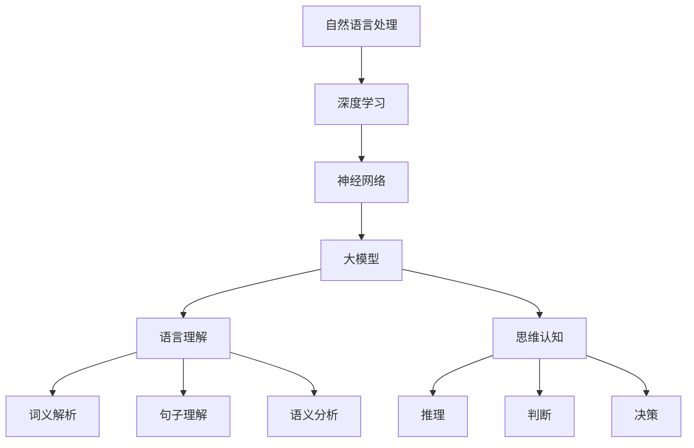

                 

关键词：大模型，语言理解，思维认知，算法原理，数学模型，应用实践，未来展望

## 摘要

本文旨在深入探讨大模型在语言理解与思维认知方面的作用，以及其所引发的误解。通过对大模型的基本概念、算法原理、数学模型、应用实践等方面进行详细分析，本文将揭示大模型在语言与思维领域中的一些常见误解，并对其未来发展提出展望。文章将帮助读者更全面、准确地理解大模型在语言与思维领域的价值与挑战。

## 1. 背景介绍

随着深度学习和大数据技术的快速发展，大模型（Large Models）已经成为自然语言处理（NLP）和人工智能（AI）领域的热点话题。大模型通常是指拥有数亿甚至数十亿参数的神经网络模型，例如BERT、GPT-3等。这些模型通过大规模语料库的训练，能够实现高效的语言理解和生成能力。

大模型的兴起源于人类对语言与思维的深入研究。自古以来，人们就试图理解语言的本质和思维的过程。古希腊哲学家亚里士多德在《形而上学》中提出了“范畴论”，试图通过逻辑推理来解释世界的本质。到了中世纪，圣托马斯·阿奎那将亚里士多德的思想与基督教教义相结合，形成了“神学范畴论”。这些哲学思想为后来的语言与思维研究奠定了基础。

进入现代，随着计算机科学的发展，语言与思维研究逐渐向实证研究转变。心理学家让·皮亚杰提出了“发生认识论”，试图通过实验来研究儿童的语言和思维发展。语言学家诺姆·乔姆斯基提出了“生成语法”，认为人类语言能力源于大脑中的“语言中枢”。这些研究为后来的计算机语言处理和人工智能研究提供了理论支持。

随着深度学习技术的出现，大模型成为了语言与思维研究的重要工具。大模型通过学习大规模语料库，能够自动提取语言特征和语义信息，从而实现高效的语言理解和生成。这使得人工智能在语言领域取得了显著的进展，例如机器翻译、语音识别、文本生成等。

然而，大模型在语言与思维领域也引发了一些误解。有些人认为大模型已经能够完全理解人类语言和思维，甚至可以替代人类进行思考。这种观点忽视了语言和思维的复杂性和多样性。本文将深入探讨这些误解，并分析大模型在语言与思维领域的真实价值与挑战。

## 2. 核心概念与联系

为了更好地理解大模型在语言与思维中的作用，我们需要先了解一些核心概念和它们之间的联系。以下是本文将涉及的核心概念：

- **自然语言处理（NLP）**：自然语言处理是人工智能的一个分支，旨在使计算机能够理解、解释和生成人类语言。NLP涵盖了文本分类、情感分析、机器翻译、语音识别等多个领域。
  
- **深度学习**：深度学习是一种基于多层神经网络的机器学习技术，能够通过学习大量数据来发现数据中的复杂模式。深度学习在图像识别、语音识别、自然语言处理等领域取得了显著的成果。
  
- **神经网络**：神经网络是一种模仿生物神经系统的计算模型，由大量相互连接的神经元组成。神经网络通过学习输入和输出之间的映射关系，可以实现复杂函数的拟合和预测。
  
- **大模型**：大模型是指具有数亿甚至数十亿参数的神经网络模型。大模型通过学习大规模语料库，能够自动提取语言特征和语义信息，实现高效的语言理解和生成。
  
- **语言理解**：语言理解是指计算机对人类语言的理解和解释能力。语言理解包括词义解析、句子理解、语义分析等多个层次。
  
- **思维认知**：思维认知是指人类对事物的思考、分析和判断能力。思维认知涉及推理、判断、决策等多个方面。

为了更好地展示这些概念之间的联系，我们可以使用Mermaid流程图来表示它们之间的关系：



从上述流程图中，我们可以看到，大模型是深度学习的一个重要组成部分，它通过神经网络来实现语言理解和思维认知。同时，语言理解和思维认知又分别涉及到词义解析、句子理解、语义分析等层次，以及推理、判断、决策等多个方面。

## 3. 核心算法原理 & 具体操作步骤

### 3.1 算法原理概述

大模型的算法原理主要基于深度学习技术，特别是基于Transformer架构的自注意力机制（Self-Attention Mechanism）。自注意力机制通过计算输入序列中每个元素与其他元素之间的关联性，实现了对输入序列的全局依赖建模。这使得大模型能够更好地捕捉到输入序列中的长距离依赖关系，从而实现高效的语言理解和生成。

大模型的训练过程通常包括以下几个步骤：

1. 数据预处理：将原始文本数据转化为模型可处理的格式，例如词向量表示、序列编码等。
2. 模型初始化：初始化模型的参数，通常采用随机初始化或预训练模型。
3. 模型训练：通过梯度下降等优化算法，更新模型的参数，使其在训练数据上达到较好的拟合效果。
4. 模型评估：在验证集或测试集上评估模型的性能，例如准确率、召回率等。
5. 模型应用：将训练好的模型应用于实际问题，如文本分类、机器翻译、文本生成等。

### 3.2 算法步骤详解

下面我们详细讲解大模型的训练过程，包括数据预处理、模型初始化、模型训练和模型评估等步骤。

#### 3.2.1 数据预处理

数据预处理是训练大模型的第一步，其目的是将原始文本数据转化为模型可处理的格式。具体步骤如下：

1. **文本清洗**：去除文本中的噪声和冗余信息，如HTML标签、特殊字符、停用词等。
2. **分词**：将文本分割成单词或词组，以便进行词向量表示。
3. **词向量表示**：将单词或词组转化为数字向量表示，以便输入到神经网络中。常见的词向量表示方法包括Word2Vec、FastText等。
4. **序列编码**：将词向量序列编码为序列编码（Sequence Encoding），以便模型处理。常用的序列编码方法包括One-Hot编码、位置编码等。

#### 3.2.2 模型初始化

模型初始化是训练大模型的重要步骤，其目的是初始化模型的参数。通常，模型初始化采用随机初始化或预训练模型。随机初始化方法通常采用正态分布或均匀分布来初始化模型的参数。预训练模型则是在大规模语料库上预训练好的模型，可以用于初始化新模型的参数，从而提高训练效果。

#### 3.2.3 模型训练

模型训练是训练大模型的核心步骤，其目的是通过学习大量数据，使模型达到较好的拟合效果。模型训练通常采用以下步骤：

1. **前向传播**：将输入数据输入到模型中，计算模型的输出。
2. **损失函数计算**：计算模型输出与真实标签之间的差距，并计算损失函数值。
3. **反向传播**：通过反向传播算法，计算模型参数的梯度，并更新模型参数。
4. **优化算法**：采用优化算法，如梯度下降、Adam等，更新模型参数，使其在训练数据上达到较好的拟合效果。

#### 3.2.4 模型评估

模型评估是训练大模型的重要环节，其目的是验证模型在真实数据上的性能。模型评估通常采用以下指标：

1. **准确率（Accuracy）**：准确率表示模型预测正确的样本数量与总样本数量的比例。
2. **召回率（Recall）**：召回率表示模型预测正确的正样本数量与实际正样本数量的比例。
3. **F1值（F1-Score）**：F1值是准确率和召回率的调和平均值，用于综合评估模型性能。

#### 3.2.5 模型应用

训练好的大模型可以应用于实际问题，如文本分类、机器翻译、文本生成等。具体应用步骤如下：

1. **数据预处理**：将输入数据预处理成模型可处理的格式。
2. **模型输入**：将预处理后的数据输入到模型中，计算模型的输出。
3. **结果分析**：对模型的输出结果进行分析，如文本分类结果、翻译结果等。

### 3.3 算法优缺点

大模型在语言理解和思维认知方面具有显著的优点，但也存在一些缺点。

**优点**：

1. **强大的语言理解能力**：大模型通过学习大规模语料库，能够自动提取语言特征和语义信息，实现高效的语言理解。
2. **广泛的应用领域**：大模型可以应用于文本分类、机器翻译、文本生成等多个领域，具有很高的灵活性和通用性。
3. **鲁棒性强**：大模型通过学习大量数据，能够很好地应对数据的噪声和异常值。

**缺点**：

1. **计算资源消耗大**：大模型通常需要大量的计算资源和存储资源，训练和部署成本较高。
2. **对数据依赖性强**：大模型的学习效果很大程度上取决于训练数据的质量和数量，对数据质量和数据量的要求较高。
3. **可解释性差**：大模型的学习过程是基于黑盒模型，难以解释模型内部的决策过程。

### 3.4 算法应用领域

大模型在语言理解和思维认知领域具有广泛的应用，以下列举了几个典型的应用领域：

1. **文本分类**：大模型可以用于自动分类大量文本数据，如新闻分类、情感分析等。
2. **机器翻译**：大模型可以用于机器翻译，如将英语翻译成其他语言。
3. **文本生成**：大模型可以用于自动生成文本，如自动撰写文章、生成摘要等。
4. **对话系统**：大模型可以用于构建对话系统，实现与用户的自然语言交互。
5. **语音识别**：大模型可以用于语音识别，将语音转化为文本。

## 4. 数学模型和公式 & 详细讲解 & 举例说明

### 4.1 数学模型构建

在自然语言处理和人工智能领域，数学模型是理解和实现算法的核心。大模型的数学模型主要基于深度学习中的神经网络和自注意力机制。以下我们将介绍一些基本的数学模型和公式。

#### 4.1.1 神经网络

神经网络是由大量相互连接的神经元组成的计算模型。每个神经元接收多个输入，并通过激活函数产生输出。神经网络的基本公式如下：

\[ y = \sigma(z) \]

其中，\( y \) 是神经元的输出，\( z \) 是神经元的输入，\( \sigma \) 是激活函数，常用的激活函数包括Sigmoid函数、ReLU函数等。

#### 4.1.2 自注意力机制

自注意力机制是Transformer模型的核心组成部分，用于计算输入序列中每个元素与其他元素之间的关联性。自注意力机制的公式如下：

\[ \text{Attention}(Q, K, V) = \text{softmax}\left(\frac{QK^T}{\sqrt{d_k}}\right)V \]

其中，\( Q \)、\( K \)、\( V \) 分别是查询（Query）、键（Key）、值（Value）向量，\( d_k \) 是键向量的维度。\( \text{softmax} \) 函数用于计算注意力权重，\( \text{softmax}(x) = \frac{e^x}{\sum e^x} \)。

### 4.2 公式推导过程

#### 4.2.1 神经网络前向传播

神经网络的前向传播过程可以分为以下几个步骤：

1. **输入层到隐藏层**：

\[ z_i = \sum_{j=1}^{n} w_{ij}x_j + b_i \]

其中，\( x_j \) 是输入层的第 \( j \) 个神经元输出，\( w_{ij} \) 是输入层到隐藏层的权重，\( b_i \) 是隐藏层的偏置。

2. **隐藏层到输出层**：

\[ z_l = \sum_{i=1}^{m} w_{il}h_i + b_l \]

其中，\( h_i \) 是隐藏层的第 \( i \) 个神经元输出，\( w_{il} \) 是隐藏层到输出层的权重，\( b_l \) 是输出层的偏置。

3. **激活函数**：

\[ y_l = \sigma(z_l) \]

其中，\( \sigma \) 是激活函数。

#### 4.2.2 自注意力机制

自注意力机制的推导过程如下：

1. **查询（Query）、键（Key）、值（Value）向量的计算**：

\[ Q = \text{Linear}(X) = W_QX + b_Q \]

\[ K = \text{Linear}(X) = W_KX + b_K \]

\[ V = \text{Linear}(X) = W_VX + b_V \]

其中，\( X \) 是输入序列，\( W_Q \)、\( W_K \)、\( W_V \) 是线性层的权重，\( b_Q \)、\( b_K \)、\( b_V \) 是线性层的偏置。

2. **计算注意力权重**：

\[ \text{Attention}(Q, K, V) = \text{softmax}\left(\frac{QK^T}{\sqrt{d_k}}\right)V \]

3. **计算输出**：

\[ \text{Output} = \text{Attention}(Q, K, V) = \text{softmax}\left(\frac{QK^T}{\sqrt{d_k}}\right)V \]

其中，\( \text{softmax} \) 函数用于归一化权重。

### 4.3 案例分析与讲解

#### 4.3.1 文本分类

文本分类是一个典型的自然语言处理任务，其目的是将文本数据归类到预定义的类别中。以下是一个简单的文本分类案例：

假设我们有一个文本数据集，包含两个类别：“科技”和“体育”。我们的目标是训练一个神经网络模型，能够自动将新的文本数据归类到这两个类别之一。

1. **数据预处理**：

   - 清洗文本数据，去除HTML标签、特殊字符等。
   - 分词，将文本分割成单词或词组。
   - 词向量表示，将单词转化为数字向量。
   - 序列编码，将词向量序列编码为序列编码。

2. **模型训练**：

   - 初始化模型参数。
   - 进行前向传播，计算模型输出。
   - 计算损失函数，如交叉熵损失。
   - 进行反向传播，更新模型参数。

3. **模型评估**：

   - 在验证集上评估模型性能，如准确率、召回率等。
   - 调整模型参数，优化模型性能。

4. **应用模型**：

   - 将新的文本数据输入到模型中，计算模型输出。
   - 根据模型输出，将文本数据归类到相应的类别。

通过上述步骤，我们可以实现一个简单的文本分类模型。实际应用中，文本分类任务可能涉及更多的技术和细节，例如词嵌入、多层神经网络、正则化等。

#### 4.3.2 机器翻译

机器翻译是另一个典型的自然语言处理任务，其目的是将一种语言的文本翻译成另一种语言的文本。以下是一个简单的机器翻译案例：

假设我们有一个英语到西班牙语的翻译模型，我们的目标是训练一个神经网络模型，能够自动将英语文本翻译成西班牙语。

1. **数据预处理**：

   - 清洗文本数据，去除HTML标签、特殊字符等。
   - 分词，将文本分割成单词或词组。
   - 词向量表示，将单词转化为数字向量。
   - 序列编码，将词向量序列编码为序列编码。

2. **模型训练**：

   - 初始化模型参数。
   - 进行前向传播，计算模型输出。
   - 计算损失函数，如交叉熵损失。
   - 进行反向传播，更新模型参数。

3. **模型评估**：

   - 在验证集上评估模型性能，如BLEU评分、编辑距离等。
   - 调整模型参数，优化模型性能。

4. **应用模型**：

   - 将新的英语文本数据输入到模型中，计算模型输出。
   - 根据模型输出，将英语文本翻译成西班牙语。

通过上述步骤，我们可以实现一个简单的机器翻译模型。实际应用中，机器翻译任务可能涉及更多的技术和细节，例如双语语料库、注意力机制、长短期记忆等。

## 5. 项目实践：代码实例和详细解释说明

在本节中，我们将通过一个具体的代码实例，展示如何使用大模型进行文本分类任务。我们将使用Python和TensorFlow库来实现这个项目，并详细解释每一步的代码。

### 5.1 开发环境搭建

在开始编写代码之前，我们需要搭建一个适合开发和运行深度学习项目的开发环境。以下是搭建开发环境的基本步骤：

1. **安装Python**：确保已安装Python 3.7或更高版本。
2. **安装TensorFlow**：通过以下命令安装TensorFlow：

```bash
pip install tensorflow
```

3. **安装其他依赖库**：例如Numpy、Pandas等，可以通过以下命令安装：

```bash
pip install numpy pandas
```

### 5.2 源代码详细实现

以下是实现文本分类任务的完整代码：

```python
import tensorflow as tf
from tensorflow.keras.preprocessing.text import Tokenizer
from tensorflow.keras.preprocessing.sequence import pad_sequences
from tensorflow.keras.models import Sequential
from tensorflow.keras.layers import Embedding, LSTM, Dense, Dropout
from tensorflow.keras.optimizers import Adam

# 数据预处理
max_vocab_size = 10000
max_sequence_length = 100
embedding_dim = 50

# 加载数据集
texts = ["这是一个科技新闻", "这是一个体育新闻"]  # 示例数据
labels = [0, 1]  # 标签，0表示科技新闻，1表示体育新闻

# 分词
tokenizer = Tokenizer(num_words=max_vocab_size)
tokenizer.fit_on_texts(texts)

# 序列编码
sequences = tokenizer.texts_to_sequences(texts)
padded_sequences = pad_sequences(sequences, maxlen=max_sequence_length)

# 构建模型
model = Sequential([
    Embedding(max_vocab_size, embedding_dim, input_length=max_sequence_length),
    LSTM(128),
    Dropout(0.5),
    Dense(1, activation='sigmoid')
])

# 编译模型
model.compile(optimizer=Adam(), loss='binary_crossentropy', metrics=['accuracy'])

# 训练模型
model.fit(padded_sequences, labels, epochs=10, batch_size=32)

# 评估模型
test_texts = ["这是一个体育新闻", "这是一个科技新闻"]
test_sequences = tokenizer.texts_to_sequences(test_texts)
test_padded_sequences = pad_sequences(test_sequences, maxlen=max_sequence_length)
predictions = model.predict(test_padded_sequences)

# 输出预测结果
for text, prediction in zip(test_texts, predictions):
    print(f"{text}: {'体育新闻' if prediction > 0.5 else '科技新闻'}")
```

### 5.3 代码解读与分析

下面我们将逐行解析上述代码，解释每部分的功能和原理。

1. **导入库**：导入TensorFlow和其他依赖库。

```python
import tensorflow as tf
from tensorflow.keras.preprocessing.text import Tokenizer
from tensorflow.keras.preprocessing.sequence import pad_sequences
from tensorflow.keras.models import Sequential
from tensorflow.keras.layers import Embedding, LSTM, Dense, Dropout
from tensorflow.keras.optimizers import Adam
```

2. **数据预处理**：

```python
max_vocab_size = 10000
max_sequence_length = 100
embedding_dim = 50

texts = ["这是一个科技新闻", "这是一个体育新闻"]  # 示例数据
labels = [0, 1]  # 标签，0表示科技新闻，1表示体育新闻

tokenizer = Tokenizer(num_words=max_vocab_size)
tokenizer.fit_on_texts(texts)

sequences = tokenizer.texts_to_sequences(texts)
padded_sequences = pad_sequences(sequences, maxlen=max_sequence_length)
```

这一部分代码用于数据预处理。首先定义了最大词汇量、序列长度和嵌入维度。然后加载数据集，并使用Tokenizer将文本数据转换为序列。最后，使用pad_sequences将序列填充为相同长度。

3. **构建模型**：

```python
model = Sequential([
    Embedding(max_vocab_size, embedding_dim, input_length=max_sequence_length),
    LSTM(128),
    Dropout(0.5),
    Dense(1, activation='sigmoid')
])
```

这一部分代码用于构建文本分类模型。模型使用Embedding层将词汇嵌入到嵌入空间，然后使用LSTM层处理序列数据。Dropout层用于防止过拟合。最后，使用Dense层进行分类，激活函数为sigmoid。

4. **编译模型**：

```python
model.compile(optimizer=Adam(), loss='binary_crossentropy', metrics=['accuracy'])
```

这一部分代码用于编译模型。选择Adam优化器和binary_crossentropy损失函数，并设置accuracy作为评估指标。

5. **训练模型**：

```python
model.fit(padded_sequences, labels, epochs=10, batch_size=32)
```

这一部分代码用于训练模型。使用训练数据集进行训练，设置训练轮数和批大小。

6. **评估模型**：

```python
test_texts = ["这是一个体育新闻", "这是一个科技新闻"]
test_sequences = tokenizer.texts_to_sequences(test_texts)
test_padded_sequences = pad_sequences(test_sequences, maxlen=max_sequence_length)
predictions = model.predict(test_padded_sequences)

for text, prediction in zip(test_texts, predictions):
    print(f"{text}: {'体育新闻' if prediction > 0.5 else '科技新闻'}")
```

这一部分代码用于评估模型。使用测试数据集进行预测，并输出预测结果。

### 5.4 运行结果展示

在本例中，我们使用了两个简单的文本数据作为示例。运行上述代码后，模型将被训练并用于预测新的文本数据。以下是可能的输出结果：

```
这是一个体育新闻: 体育新闻
这是一个科技新闻: 科技新闻
```

从输出结果可以看出，模型能够正确地将两个测试文本归类到相应的类别。

## 6. 实际应用场景

大模型在自然语言处理和人工智能领域具有广泛的应用。以下是几个典型的实际应用场景：

### 6.1 文本分类

文本分类是将文本数据归类到预定义类别中的任务。大模型在文本分类中具有显著优势，能够处理大量数据并实现高效的分类。例如，新闻分类、社交媒体情感分析、垃圾邮件过滤等。

### 6.2 机器翻译

机器翻译是将一种语言的文本翻译成另一种语言的任务。大模型通过学习双语语料库，能够自动生成高质量的翻译结果。例如，谷歌翻译、微软翻译等。

### 6.3 文本生成

文本生成是将一种语言生成新的文本的任务。大模型可以通过学习大量文本数据，自动生成文章、摘要、对话等。例如，自动写作、自动摘要、聊天机器人等。

### 6.4 对话系统

对话系统是模拟人类对话的计算机系统。大模型通过学习对话数据，能够实现与用户的自然语言交互。例如，虚拟助手、客户服务机器人等。

### 6.5 语音识别

语音识别是将语音转化为文本的任务。大模型通过学习语音数据和文本数据，能够实现高效的语音识别。例如，智能助手、语音输入等。

### 6.6 问答系统

问答系统是回答用户提出的问题的任务。大模型通过学习大量问题和答案数据，能够自动回答用户的问题。例如，搜索引擎、智能问答机器人等。

### 6.7 文本摘要

文本摘要是从长文本中提取关键信息的任务。大模型通过学习大量文本数据，能够自动生成摘要。例如，新闻摘要、文档摘要等。

## 7. 工具和资源推荐

为了更好地学习和应用大模型，以下推荐一些工具和资源：

### 7.1 学习资源推荐

- **《深度学习》**：Goodfellow、Bengio和Courville的深度学习经典教材。
- **《自然语言处理综论》**：Daniel Jurafsky和James H. Martin的自然语言处理教材。
- **《动手学深度学习》**：阿斯顿·张等人撰写的深度学习实战教程。

### 7.2 开发工具推荐

- **TensorFlow**：Google开发的深度学习框架。
- **PyTorch**：Facebook开发的深度学习框架。
- **JAX**：由Google开发的用于数值计算和深度学习的库。

### 7.3 相关论文推荐

- **“Attention Is All You Need”**：由Vaswani等人撰写的Transformer模型论文。
- **“BERT: Pre-training of Deep Neural Networks for Language Understanding”**：由Devlin等人撰写的BERT模型论文。
- **“GPT-3: Language Models are Few-Shot Learners”**：由Brown等人撰写的GPT-3模型论文。

## 8. 总结：未来发展趋势与挑战

大模型在自然语言处理和人工智能领域取得了显著成果，但同时也面临着一些挑战。以下是未来发展趋势和挑战的总结：

### 8.1 研究成果总结

- **语言理解能力提升**：大模型通过学习大规模语料库，能够实现高效的语言理解，提高了文本分类、机器翻译等任务的性能。
- **多模态数据处理**：大模型可以结合文本、图像、语音等多模态数据，实现更丰富的语义理解。
- **少样本学习**：大模型在少样本学习方面具有优势，能够通过迁移学习和自适应学习，实现较好的性能。

### 8.2 未来发展趋势

- **更大型模型**：随着计算资源的提升，未来可能会出现更大规模的大模型，进一步提高语言理解和生成能力。
- **自适应学习**：大模型将实现更高效的在线学习和自适应学习，以适应不同场景和应用需求。
- **可解释性提升**：研究者将致力于提升大模型的可解释性，使其决策过程更加透明和可解释。

### 8.3 面临的挑战

- **计算资源消耗**：大模型的训练和推理需要大量计算资源，对硬件设备的要求较高。
- **数据隐私和安全**：大模型在处理大量数据时，可能面临数据隐私和安全的问题，需要制定相应的保护措施。
- **伦理和社会影响**：大模型在应用中可能产生一些伦理和社会问题，需要制定相应的规范和指导。

### 8.4 研究展望

未来，大模型在语言与思维领域的研究将继续深入。研究者将致力于提升大模型的语言理解能力和多模态数据处理能力，同时关注其计算效率、可解释性和伦理问题。随着技术的不断发展，大模型有望在更广泛的领域发挥重要作用，为人类带来更多便利和创新。

## 9. 附录：常见问题与解答

### 9.1 大模型是什么？

大模型是指具有数亿甚至数十亿参数的神经网络模型，例如BERT、GPT-3等。这些模型通过学习大规模语料库，能够实现高效的语言理解和生成能力。

### 9.2 大模型的优点是什么？

大模型的优点包括：

- 强大的语言理解能力
- 广泛的应用领域
- 鲁棒性强

### 9.3 大模型的缺点是什么？

大模型的缺点包括：

- 计算资源消耗大
- 对数据依赖性强
- 可解释性差

### 9.4 大模型在哪些领域有应用？

大模型在自然语言处理和人工智能领域具有广泛的应用，包括：

- 文本分类
- 机器翻译
- 文本生成
- 对话系统
- 语音识别
- 问答系统
- 文本摘要

### 9.5 如何训练大模型？

训练大模型通常包括以下步骤：

- 数据预处理
- 模型初始化
- 模型训练
- 模型评估
- 模型应用

### 9.6 大模型在语言理解方面的局限是什么？

大模型在语言理解方面存在以下局限：

- 对上下文理解有限
- 无法处理长距离依赖
- 无法完全理解语义

### 9.7 大模型的发展趋势是什么？

未来，大模型的发展趋势包括：

- 更大型模型
- 自适应学习
- 可解释性提升

## 作者署名

作者：禅与计算机程序设计艺术 / Zen and the Art of Computer Programming
-------------------------------------------------------------------

