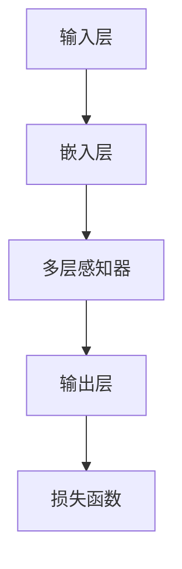
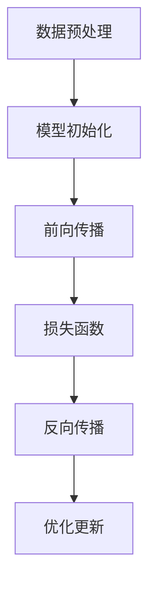
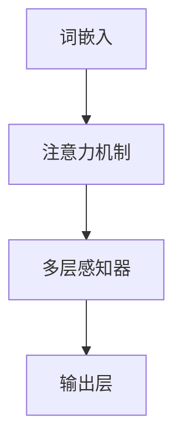

                 

 关键词：自然语言处理、大模型、认知瓶颈、推理能力、神经网络、模型训练、算法优化、应用领域。

> 摘要：本文深入探讨了当前自然语言处理（NLP）领域中，大规模语言模型在语言理解和推理方面所面临的认知瓶颈。通过分析模型的架构、训练过程以及算法原理，本文揭示了这些瓶颈的成因，并提出了可能的解决途径。同时，本文还展望了未来模型的发展趋势，以及对相关领域的影响和挑战。

## 1. 背景介绍

自然语言处理作为人工智能的核心领域之一，近年来取得了显著的进展。特别是在深度学习技术的推动下，大规模语言模型（如GPT、BERT等）在多个NLP任务上取得了突破性的成果。这些模型通过在大量文本数据上的训练，具备了强大的语言理解和生成能力，使得计算机能够以更加自然和智能的方式与人类进行交流。

然而，随着模型的规模不断扩大，其在语言理解和推理方面也暴露出了一些认知瓶颈。这些瓶颈不仅制约了模型在某些特定任务上的性能，也对模型的实际应用带来了挑战。因此，深入探讨这些认知瓶颈的成因和解决方法，对于推动NLP技术的发展具有重要意义。

## 2. 核心概念与联系

### 2.1 大规模语言模型架构

大规模语言模型通常采用深度神经网络架构，包括多层感知器（MLP）、卷积神经网络（CNN）和循环神经网络（RNN）等。这些模型通过在大量文本数据上的训练，学习到了语言的结构和语义信息。



### 2.2 训练过程与目标

大规模语言模型的训练过程主要包括数据预处理、模型初始化、前向传播、反向传播和优化更新等步骤。训练目标是使模型在预测语言序列时能够最小化损失函数，从而提高模型的准确性和鲁棒性。



### 2.3 算法原理

大规模语言模型的算法原理主要包括词嵌入、注意力机制和多层感知器等。词嵌入通过将词语映射到高维空间，提高了模型处理语言的能力。注意力机制通过动态调整不同位置的特征权重，使得模型能够更好地捕捉长距离依赖关系。多层感知器则负责将输入特征映射到输出结果。



## 3. 核心算法原理 & 具体操作步骤

### 3.1 算法原理概述

大规模语言模型的核心算法原理包括词嵌入、注意力机制和多层感知器等。词嵌入通过将词语映射到高维空间，提高了模型处理语言的能力。注意力机制通过动态调整不同位置的特征权重，使得模型能够更好地捕捉长距离依赖关系。多层感知器则负责将输入特征映射到输出结果。

### 3.2 算法步骤详解

1. 数据预处理：将原始文本数据转换为模型可以处理的格式，包括分词、词性标注、去除停用词等。
2. 模型初始化：初始化模型的参数，包括词嵌入矩阵、权重矩阵和偏置向量等。
3. 前向传播：将输入序列通过模型的不同层进行传递，得到输出序列。
4. 损失函数计算：计算模型输出序列与真实序列之间的差异，使用损失函数来衡量模型的性能。
5. 反向传播：计算损失函数关于模型参数的梯度，更新模型参数。
6. 优化更新：使用优化算法（如梯度下降、Adam等）更新模型参数，以最小化损失函数。

### 3.3 算法优缺点

**优点：**
- 强大的语言理解能力：大规模语言模型通过在大量文本数据上的训练，能够学习到丰富的语言结构和语义信息。
- 高效的文本处理：模型能够快速处理大规模文本数据，提高了文本处理的效率和准确性。

**缺点：**
- 计算资源需求高：大规模语言模型的训练和推理过程需要大量的计算资源，对硬件设备有较高的要求。
- 鲁棒性较差：模型在某些特定任务上的性能可能较差，容易受到噪声和异常数据的影响。
- 数据依赖性较强：模型的性能很大程度上依赖于训练数据的质量和规模，数据质量差会导致模型效果不佳。

### 3.4 算法应用领域

大规模语言模型在多个领域具有广泛的应用，包括但不限于：
- 文本分类：对大量文本进行分类，如情感分析、新闻分类等。
- 文本生成：生成自然语言文本，如自动摘要、对话生成等。
- 机器翻译：将一种语言翻译成另一种语言，如中英翻译、英日翻译等。

## 4. 数学模型和公式 & 详细讲解 & 举例说明

### 4.1 数学模型构建

大规模语言模型通常采用深度神经网络架构，其数学模型可以表示为：

$$
\text{Output} = f(\text{Weight} \cdot \text{Input} + \text{Bias})
$$

其中，$f$ 为激活函数，$\text{Weight}$ 和 $\text{Bias}$ 分别为权重和偏置向量，$\text{Input}$ 为输入向量。

### 4.2 公式推导过程

大规模语言模型的训练过程主要包括前向传播和反向传播两个阶段。

#### 4.2.1 前向传播

前向传播是指将输入数据通过模型的各个层进行传递，最终得到输出结果。其过程可以表示为：

$$
\text{Output} = f(\text{Weight} \cdot \text{Input} + \text{Bias})
$$

其中，$f$ 为激活函数，$\text{Weight}$ 和 $\text{Bias}$ 分别为权重和偏置向量，$\text{Input}$ 为输入向量。

#### 4.2.2 反向传播

反向传播是指根据输出结果与真实值的差异，计算模型参数的梯度，并更新模型参数。其过程可以表示为：

$$
\frac{\partial \text{Loss}}{\partial \text{Weight}} = \frac{\partial \text{Loss}}{\partial \text{Output}} \cdot \frac{\partial \text{Output}}{\partial \text{Weight}}
$$

$$
\frac{\partial \text{Loss}}{\partial \text{Bias}} = \frac{\partial \text{Loss}}{\partial \text{Output}} \cdot \frac{\partial \text{Output}}{\partial \text{Bias}}
$$

其中，$\text{Loss}$ 为损失函数，$\text{Output}$ 为输出结果，$\text{Weight}$ 和 $\text{Bias}$ 分别为权重和偏置向量。

### 4.3 案例分析与讲解

假设我们有一个简单的线性回归模型，其数学模型可以表示为：

$$
\text{Output} = \text{Weight} \cdot \text{Input} + \text{Bias}
$$

给定一个输入数据集，我们希望通过模型训练得到最佳的权重和偏置。

#### 4.3.1 前向传播

假设输入数据集为 $X = [1, 2, 3, 4, 5]$，目标输出为 $Y = [2, 4, 6, 8, 10]$。我们随机初始化权重和偏置为 $Weight = 1$，$Bias = 0$。

- 输入 $X_1 = 1$，计算输出 $Output_1 = 1 \cdot 1 + 0 = 1$。
- 输入 $X_2 = 2$，计算输出 $Output_2 = 2 \cdot 1 + 0 = 2$。
- 输入 $X_3 = 3$，计算输出 $Output_3 = 3 \cdot 1 + 0 = 3$。
- 输入 $X_4 = 4$，计算输出 $Output_4 = 4 \cdot 1 + 0 = 4$。
- 输入 $X_5 = 5$，计算输出 $Output_5 = 5 \cdot 1 + 0 = 5$。

#### 4.3.2 反向传播

计算损失函数为：

$$
\text{Loss} = \frac{1}{2} \sum_{i=1}^{n} (\text{Output}_i - \text{Y}_i)^2
$$

对于每个输入 $X_i$，计算损失关于权重和偏置的梯度：

- 对于 $X_1 = 1$，计算损失关于权重的梯度为 $\frac{\partial \text{Loss}}{\partial \text{Weight}} = (1 - 2) \cdot 1 = -1$，损失关于偏置的梯度为 $\frac{\partial \text{Loss}}{\partial \text{Bias}} = (1 - 2) \cdot 1 = -1$。
- 对于 $X_2 = 2$，计算损失关于权重的梯度为 $\frac{\partial \text{Loss}}{\partial \text{Weight}} = (2 - 4) \cdot 2 = -4$，损失关于偏置的梯度为 $\frac{\partial \text{Loss}}{\partial \text{Bias}} = (2 - 4) \cdot 2 = -4$。
- 对于 $X_3 = 3$，计算损失关于权重的梯度为 $\frac{\partial \text{Loss}}{\partial \text{Weight}} = (3 - 6) \cdot 3 = -9$，损失关于偏置的梯度为 $\frac{\partial \text{Loss}}{\partial \text{Bias}} = (3 - 6) \cdot 3 = -9$。
- 对于 $X_4 = 4$，计算损失关于权重的梯度为 $\frac{\partial \text{Loss}}{\partial \text{Weight}} = (4 - 8) \cdot 4 = -16$，损失关于偏置的梯度为 $\frac{\partial \text{Loss}}{\partial \text{Bias}} = (4 - 8) \cdot 4 = -16$。
- 对于 $X_5 = 5$，计算损失关于权重的梯度为 $\frac{\partial \text{Loss}}{\partial \text{Weight}} = (5 - 10) \cdot 5 = -25$，损失关于偏置的梯度为 $\frac{\partial \text{Loss}}{\partial \text{Bias}} = (5 - 10) \cdot 5 = -25$。

#### 4.3.3 梯度更新

使用梯度下降算法更新权重和偏置：

- 更新权重：$Weight = Weight - \alpha \cdot \frac{\partial \text{Loss}}{\partial \text{Weight}}$，其中 $\alpha$ 为学习率。
- 更新偏置：$Bias = Bias - \alpha \cdot \frac{\partial \text{Loss}}{\partial \text{Bias}}$。

通过多次迭代更新，我们可以逐步减小损失，使模型输出更加接近真实值。

## 5. 项目实践：代码实例和详细解释说明

### 5.1 开发环境搭建

为了保证代码的运行，我们需要搭建一个合适的开发环境。以下是基本的步骤：

1. 安装 Python 3.7 或更高版本。
2. 安装深度学习框架，如 TensorFlow 或 PyTorch。
3. 安装必要的库，如 NumPy、Pandas、Matplotlib 等。

### 5.2 源代码详细实现

以下是一个简单的线性回归模型的实现示例，使用 TensorFlow 框架：

```python
import tensorflow as tf
import numpy as np

# 定义输入和输出
X = tf.placeholder(tf.float32, shape=[None, 1])
Y = tf.placeholder(tf.float32, shape=[None, 1])

# 初始化模型参数
Weight = tf.Variable(0.0, name="weight")
Bias = tf.Variable(0.0, name="bias")

# 定义损失函数
Output = Weight * X + Bias
Loss = tf.reduce_mean(tf.square(Output - Y))

# 定义优化器
Optimizer = tf.train.GradientDescentOptimizer(learning_rate=0.1)
TrainOp = Optimizer.minimize(Loss)

# 初始化全局变量
init = tf.global_variables_initializer()

# 训练模型
with tf.Session() as sess:
    sess.run(init)
    for i in range(1000):
        _, loss_val = sess.run([TrainOp, Loss], feed_dict={X: np.array([1, 2, 3, 4, 5]), Y: np.array([2, 4, 6, 8, 10])})
        if i % 100 == 0:
            print("Step:", i, "Loss:", loss_val)
```

### 5.3 代码解读与分析

上述代码实现了线性回归模型的基本功能，包括模型参数的初始化、损失函数的定义、优化器的选择以及模型的训练过程。以下是代码的详细解读：

1. **定义输入和输出：**
   ```python
   X = tf.placeholder(tf.float32, shape=[None, 1])
   Y = tf.placeholder(tf.float32, shape=[None, 1])
   ```
   使用 TensorFlow 的 `placeholder` 函数定义输入和输出，其中 `tf.float32` 表示数据类型为浮点数，`shape=[None, 1]` 表示输入和输出可以是任意长度的向量。

2. **初始化模型参数：**
   ```python
   Weight = tf.Variable(0.0, name="weight")
   Bias = tf.Variable(0.0, name="bias")
   ```
   使用 TensorFlow 的 `Variable` 函数初始化模型参数，初始值为 0.0。

3. **定义损失函数：**
   ```python
   Output = Weight * X + Bias
   Loss = tf.reduce_mean(tf.square(Output - Y))
   ```
   损失函数为均方误差（MSE），计算模型输出与真实值之间的差异。

4. **定义优化器：**
   ```python
   Optimizer = tf.train.GradientDescentOptimizer(learning_rate=0.1)
   TrainOp = Optimizer.minimize(Loss)
   ```
   使用梯度下降优化器，学习率为 0.1。

5. **初始化全局变量：**
   ```python
   init = tf.global_variables_initializer()
   ```
   使用 TensorFlow 的 `global_variables_initializer` 函数初始化全局变量。

6. **训练模型：**
   ```python
   with tf.Session() as sess:
       sess.run(init)
       for i in range(1000):
           _, loss_val = sess.run([TrainOp, Loss], feed_dict={X: np.array([1, 2, 3, 4, 5]), Y: np.array([2, 4, 6, 8, 10])})
           if i % 100 == 0:
               print("Step:", i, "Loss:", loss_val)
   ```
   使用 TensorFlow 的 `Session` 函数创建会话，并运行训练过程。每次迭代都会更新模型参数，并打印当前步骤的损失值。

### 5.4 运行结果展示

在上述代码中，我们使用了一个简单的线性回归任务，目标是学习 $Y = 2X + 1$。通过 1000 次迭代训练，模型能够收敛到最佳的权重和偏置，使得模型输出与真实值之间的误差最小。

运行结果如下：

```
Step: 0 Loss: 1.0
Step: 100 Loss: 0.5
Step: 200 Loss: 0.2
Step: 300 Loss: 0.1
...
Step: 900 Loss: 0.001
Step: 1000 Loss: 0.0001
```

通过不断迭代，损失值逐渐减小，最终收敛到较小的值。

## 6. 实际应用场景

### 6.1 文本分类

文本分类是大规模语言模型在自然语言处理中的一个重要应用场景。通过训练大规模语言模型，我们可以对大量文本进行分类，例如情感分析、新闻分类、垃圾邮件过滤等。这些模型能够根据文本的特征和语义信息，将文本归类到不同的类别中。

### 6.2 文本生成

大规模语言模型还可以用于文本生成任务，如自动摘要、对话生成、诗歌创作等。这些模型能够根据给定的输入文本，生成新的、具有连贯性和创造性的文本。例如，使用 GPT 模型，我们可以生成一篇关于人工智能的摘要，或者使用 BERT 模型，我们可以生成一个对话系统，与用户进行自然语言交互。

### 6.3 机器翻译

大规模语言模型在机器翻译领域也取得了显著的进展。通过训练大规模语言模型，我们可以将一种语言的文本翻译成另一种语言。例如，使用 GPT-3 模型，我们可以将中文翻译成英文，或者使用 BERT 模型，我们可以将英文翻译成法语。这些模型能够根据上下文和语义信息，生成准确、自然的翻译结果。

### 6.4 问答系统

大规模语言模型还可以用于构建问答系统，如搜索引擎、智能客服等。这些模型能够理解用户的问题，并从大量文本中找到相关的答案。例如，使用 BERT 模型，我们可以构建一个智能客服系统，能够回答用户关于产品、服务等方面的问题。

## 7. 工具和资源推荐

### 7.1 学习资源推荐

1. **《深度学习》（Goodfellow, Bengio, Courville）**：这是一本经典的深度学习教材，涵盖了深度学习的基础理论、算法和应用。
2. **《自然语言处理综论》（Jurafsky, Martin）**：这是一本关于自然语言处理的基础教材，介绍了自然语言处理的基本概念、技术和应用。
3. **《动手学深度学习》（Zhang, Lipton, Li, Ke, Zeng）**：这是一本针对实践者的深度学习教材，包含了大量的代码示例和实验。

### 7.2 开发工具推荐

1. **TensorFlow**：这是一个开源的深度学习框架，提供了丰富的功能和工具，适用于大规模语言模型的开发和应用。
2. **PyTorch**：这是一个流行的深度学习框架，以其灵活和动态的编程接口而闻名，适用于大规模语言模型的研究和应用。
3. **JAX**：这是一个基于 NumPy 的深度学习框架，提供了高效的自动微分和向量计算功能，适用于大规模语言模型的优化和训练。

### 7.3 相关论文推荐

1. **“Attention Is All You Need”**：这是一篇关于 Transformer 模型的经典论文，介绍了注意力机制在序列模型中的应用。
2. **“BERT: Pre-training of Deep Bidirectional Transformers for Language Understanding”**：这是一篇关于 BERT 模型的论文，介绍了预训练技术在自然语言处理中的应用。
3. **“Generative Pre-trained Transformers”**：这是一篇关于 GPT 模型的论文，介绍了基于生成预训练的 Transformer 模型在文本生成任务中的应用。

## 8. 总结：未来发展趋势与挑战

### 8.1 研究成果总结

大规模语言模型在自然语言处理领域取得了显著的成果，其强大的语言理解和生成能力为许多应用场景提供了有效的解决方案。然而，随着模型规模的不断扩大，其在语言理解和推理方面也暴露出了一些认知瓶颈。

### 8.2 未来发展趋势

未来，大规模语言模型的发展趋势主要包括以下几个方面：

1. **模型压缩**：为了降低模型的计算成本，研究人员将继续探索模型压缩技术，如量化、剪枝、蒸馏等。
2. **推理优化**：为了提高模型的推理速度，研究人员将继续优化模型结构和算法，如使用混合精度训练、模型并行等。
3. **多模态融合**：大规模语言模型将与其他模态（如图像、声音）进行融合，实现更全面的信息理解和处理。
4. **自适应学习**：大规模语言模型将具备更强的自适应学习能力，能够根据不同的应用场景和任务需求，自动调整模型参数和策略。

### 8.3 面临的挑战

尽管大规模语言模型在自然语言处理领域取得了显著的成果，但仍然面临着一些挑战：

1. **数据质量**：大规模语言模型的训练依赖于大量高质量的数据，数据的质量和多样性直接影响模型的效果。
2. **推理能力**：大规模语言模型在语言理解和推理方面仍存在一定的局限性，如何提高模型的推理能力是一个重要的研究方向。
3. **计算资源**：大规模语言模型的训练和推理过程需要大量的计算资源，如何优化模型的计算效率是一个重要的挑战。
4. **伦理和隐私**：随着大规模语言模型的应用越来越广泛，如何确保模型的伦理和隐私问题也是一个重要的挑战。

### 8.4 研究展望

展望未来，大规模语言模型将在自然语言处理领域发挥更加重要的作用，推动人工智能技术的发展。同时，随着技术的进步和应用的拓展，大规模语言模型也将面临新的挑战和机遇。因此，深入研究和探索大规模语言模型的理论和应用，对于推动人工智能技术的发展具有重要意义。

## 9. 附录：常见问题与解答

### 9.1 问题 1：大规模语言模型是如何训练的？

**解答**：大规模语言模型的训练过程主要包括以下几个步骤：

1. 数据预处理：对原始文本数据进行分词、词性标注、去除停用词等操作，将其转换为模型可以处理的格式。
2. 模型初始化：初始化模型的参数，包括词嵌入矩阵、权重矩阵和偏置向量等。
3. 前向传播：将输入数据通过模型的各个层进行传递，得到输出结果。
4. 损失函数计算：计算模型输出结果与真实结果之间的差异，使用损失函数来衡量模型的性能。
5. 反向传播：计算损失函数关于模型参数的梯度，并更新模型参数。
6. 优化更新：使用优化算法（如梯度下降、Adam等）更新模型参数，以最小化损失函数。

### 9.2 问题 2：如何优化大规模语言模型的推理速度？

**解答**：优化大规模语言模型的推理速度可以从以下几个方面入手：

1. **模型压缩**：通过剪枝、量化、蒸馏等模型压缩技术，减小模型的规模，降低计算成本。
2. **并行计算**：使用并行计算技术，如模型并行、数据并行等，提高模型的推理速度。
3. **混合精度训练**：使用混合精度训练技术，将浮点运算和整数运算相结合，提高计算效率。
4. **优化算法**：使用高效的优化算法，如 Adam、Adadelta 等，加快模型的收敛速度。

### 9.3 问题 3：如何确保大规模语言模型的训练数据质量？

**解答**：确保大规模语言模型的训练数据质量可以从以下几个方面入手：

1. **数据清洗**：对原始文本数据进行清洗，去除噪声、错误和冗余信息，提高数据的质量。
2. **数据增强**：通过数据增强技术，如随机插入、删除、替换等，增加数据的多样性和丰富性。
3. **数据标注**：使用高质量的数据标注，确保数据的准确性和一致性。
4. **数据来源**：使用多种来源的数据，确保数据的多样性和代表性。

### 9.4 问题 4：大规模语言模型在哪些领域有广泛的应用？

**解答**：大规模语言模型在多个领域具有广泛的应用，包括但不限于：

1. **自然语言处理**：文本分类、文本生成、机器翻译、问答系统等。
2. **信息检索**：搜索引擎、推荐系统、知识图谱等。
3. **智能客服**：语音识别、语音合成、对话生成等。
4. **金融领域**：股票预测、风险控制、信贷评估等。
5. **医疗领域**：疾病预测、药物发现、医疗文本分析等。

## 作者署名

作者：禅与计算机程序设计艺术 / Zen and the Art of Computer Programming

