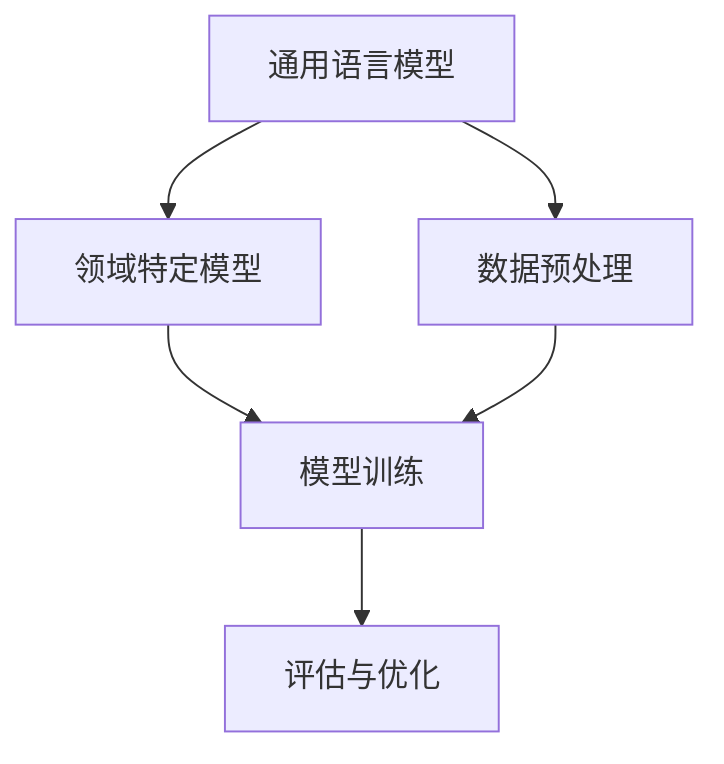

                 

关键词：语言模型、领域适应、专业、深度学习、神经架构、数学模型、应用实践、工具资源

> 摘要：本文从语言模型领域适应的角度，探讨了从通用到专业的转变过程。首先，介绍了语言模型的基础概念和领域适应的重要性。然后，详细阐述了核心概念与联系，包括领域特定的数学模型和算法原理。接着，通过具体的应用实例，展示了语言模型在专业领域的应用，并分析了其优缺点和未来发展趋势。最后，推荐了相关的学习资源和开发工具，以及未来研究展望。

## 1. 背景介绍

随着深度学习技术的飞速发展，语言模型已经成为自然语言处理领域的关键技术之一。语言模型旨在模拟人类语言生成和理解能力，通过对大规模语料库的学习，实现对自然语言文本的生成、翻译、摘要、问答等任务。然而，现有的通用语言模型在面对专业领域的任务时，往往表现不佳，这主要是因为通用语言模型缺乏对专业领域的知识理解和语言表达。

为了解决这一问题，领域适应（Domain Adaptation）成为了一个重要研究方向。领域适应旨在通过将通用语言模型的知识迁移到特定领域，提升其在专业领域任务中的性能。本文将探讨语言模型的领域适应过程，从通用到专业的转变，以及相关的核心概念、算法原理和应用实践。

## 2. 核心概念与联系

### 2.1 语言模型

语言模型（Language Model）是一种概率模型，用于预测给定输入序列后下一个单词或字符的概率。常见的语言模型包括基于统计的N-gram模型和基于神经网络的深度神经网络模型（如Transformer）。语言模型在自然语言处理任务中具有广泛的应用，如文本分类、机器翻译、语音识别等。

### 2.2 领域适应

领域适应（Domain Adaptation）是指将通用语言模型的知识迁移到特定领域，以提升其在专业领域任务中的性能。领域适应的核心思想是通过利用领域特定的数据和知识，改进通用语言模型在专业领域的表现。领域适应的方法主要包括数据增强、领域迁移、领域对抗等。

### 2.3 数学模型

在领域适应过程中，数学模型扮演着重要角色。常见的数学模型包括概率模型、神经网络模型和变换模型等。概率模型如贝叶斯网络和马尔可夫模型，可以用于表示领域知识和关系。神经网络模型如循环神经网络（RNN）和卷积神经网络（CNN），可以用于提取领域特征和表示。变换模型如自注意力机制和变换器模型（Transformer），可以用于跨领域知识迁移。

### 2.4 架构

领域适应的架构通常包括以下部分：

1. **通用语言模型**：作为基础模型，负责处理通用任务和知识迁移。
2. **领域特定模型**：根据专业领域需求，对通用语言模型进行定制化调整。
3. **数据预处理**：对领域特定数据进行预处理，包括数据清洗、数据增强和领域标注等。
4. **模型训练**：通过训练数据集对通用语言模型和领域特定模型进行联合训练。
5. **评估与优化**：评估模型在专业领域任务中的性能，并进行模型优化。

下面是一个简化的Mermaid流程图，展示了领域适应的架构：



## 3. 核心算法原理 & 具体操作步骤

### 3.1 算法原理概述

领域适应的核心算法主要包括以下几种：

1. **数据增强**：通过生成或扩展领域特定数据，增强通用语言模型在专业领域中的知识。
2. **领域迁移**：将通用语言模型的知识迁移到专业领域，通过迁移学习提升模型在专业领域任务中的性能。
3. **领域对抗**：通过对抗性训练，使通用语言模型在专业领域任务中具有更好的鲁棒性和适应性。

### 3.2 算法步骤详解

1. **数据预处理**：
   - **数据清洗**：去除噪声数据和错误标注的数据。
   - **数据增强**：生成或扩展领域特定数据，如通过同义词替换、文本生成模型等。
   - **领域标注**：对领域特定数据进行标注，以便训练领域特定模型。

2. **模型训练**：
   - **通用语言模型**：使用大规模通用语料库对通用语言模型进行预训练。
   - **领域特定模型**：使用领域特定数据进行训练，以调整通用语言模型在专业领域的参数。

3. **模型评估**：
   - **交叉验证**：使用交叉验证方法评估通用语言模型和领域特定模型的性能。
   - **性能指标**：评估指标包括准确率、召回率、F1值等。

4. **模型优化**：
   - **超参数调整**：调整模型参数，如学习率、正则化等。
   - **模型融合**：将多个模型进行融合，提高整体性能。

### 3.3 算法优缺点

**优点**：
- **知识迁移**：通过领域适应，通用语言模型可以获取专业领域的知识，提升在专业任务中的性能。
- **数据增强**：通过数据增强，可以扩展领域特定数据，提高模型的泛化能力。
- **模型融合**：通过模型融合，可以进一步提高模型的整体性能。

**缺点**：
- **计算资源消耗**：领域适应需要大量的计算资源，特别是在训练大规模模型时。
- **领域差异**：不同领域之间的差异可能导致模型在特定领域中的性能不稳定。

### 3.4 算法应用领域

领域适应算法在多个专业领域具有广泛的应用，如医疗、金融、法律、教育等。以下是一些具体的案例：

1. **医疗领域**：通过领域适应，将通用语言模型应用于医学文本分类、命名实体识别等任务，提高模型在医疗领域的性能。
2. **金融领域**：通过领域适应，将通用语言模型应用于金融文本分析、股票预测等任务，提升模型在金融领域的应用效果。
3. **法律领域**：通过领域适应，将通用语言模型应用于法律文档分类、合同审查等任务，提高模型在法律领域的表现。
4. **教育领域**：通过领域适应，将通用语言模型应用于教育文本分析、学习评估等任务，提升模型在教育领域的应用价值。

## 4. 数学模型和公式 & 详细讲解 & 举例说明

### 4.1 数学模型构建

领域适应的数学模型主要包括概率模型、神经网络模型和变换模型。以下是一个简化的概率模型示例：

- **概率模型**：假设有一个通用语言模型 $P(W_{t} | W_{1}, W_{2}, ..., W_{t-1})$，其中 $W_{t}$ 表示下一个单词，$W_{1}, W_{2}, ..., W_{t-1}$ 表示前 $t-1$ 个单词。通过领域适应，我们可以引入领域特定概率模型 $P_{D}(W_{t} | W_{1}, W_{2}, ..., W_{t-1})$，用于表示领域特定任务中的概率分布。

- **神经网络模型**：假设有一个基于神经网络的通用语言模型 $f_{U}(W_{t} | W_{1}, W_{2}, ..., W_{t-1})$，其中 $f_{U}$ 表示神经网络函数。通过领域适应，我们可以引入领域特定神经网络模型 $f_{D}(W_{t} | W_{1}, W_{2}, ..., W_{t-1})$，用于表示领域特定任务中的神经网络函数。

- **变换模型**：假设有一个基于自注意力机制的通用语言模型 $g_{U}(W_{t} | W_{1}, W_{2}, ..., W_{t-1})$，其中 $g_{U}$ 表示自注意力函数。通过领域适应，我们可以引入领域特定变换模型 $g_{D}(W_{t} | W_{1}, W_{2}, ..., W_{t-1})$，用于表示领域特定任务中的自注意力函数。

### 4.2 公式推导过程

假设我们有一个通用语言模型 $P_{U}(W_{t} | W_{1}, W_{2}, ..., W_{t-1})$，其基于神经网络模型。为了领域适应，我们引入一个领域特定概率模型 $P_{D}(W_{t} | W_{1}, W_{2}, ..., W_{t-1})$。

首先，我们定义领域特定概率模型 $P_{D}(W_{t} | W_{1}, W_{2}, ..., W_{t-1})$ 的概率分布：

$$
P_{D}(W_{t} | W_{1}, W_{2}, ..., W_{t-1}) = \frac{1}{Z} e^{-\phi_{D}(W_{t} | W_{1}, W_{2}, ..., W_{t-1})}
$$

其中，$Z$ 是归一化常数，$\phi_{D}(W_{t} | W_{1}, W_{2}, ..., W_{t-1})$ 是领域特定概率模型的对数似然函数。

然后，我们定义通用语言模型 $P_{U}(W_{t} | W_{1}, W_{2}, ..., W_{t-1})$ 的概率分布：

$$
P_{U}(W_{t} | W_{1}, W_{2}, ..., W_{t-1}) = \frac{1}{Z_{U}} e^{-\phi_{U}(W_{t} | W_{1}, W_{2}, ..., W_{t-1})}
$$

其中，$Z_{U}$ 是归一化常数，$\phi_{U}(W_{t} | W_{1}, W_{2}, ..., W_{t-1})$ 是通用语言模型的对数似然函数。

为了领域适应，我们需要优化领域特定概率模型 $P_{D}(W_{t} | W_{1}, W_{2}, ..., W_{t-1})$ 的参数 $\phi_{D}$，使其在专业领域任务中表现更好。具体地，我们使用最小化交叉熵损失函数来优化参数：

$$
L = -\sum_{t} \sum_{w_{t} \in V} P_{D}(w_{t} | W_{1}, W_{2}, ..., W_{t-1}) \log P_{U}(w_{t} | W_{1}, W_{2}, ..., W_{t-1})
$$

其中，$V$ 是单词集合。

### 4.3 案例分析与讲解

假设我们有一个通用语言模型，用于文本分类任务。在领域适应过程中，我们引入一个医疗领域特定概率模型，用于处理医学文本分类。

首先，我们使用医学领域数据集对领域特定概率模型进行训练。医学领域数据集包括大量医学文本，如病例报告、医学论文、病历等。我们使用这些数据集来学习领域特定概率模型 $P_{D}(W_{t} | W_{1}, W_{2}, ..., W_{t-1})$。

然后，我们使用通用语言模型 $P_{U}(W_{t} | W_{1}, W_{2}, ..., W_{t-1})$ 对医疗领域数据进行分类。具体地，我们使用领域特定概率模型 $P_{D}(W_{t} | W_{1}, W_{2}, ..., W_{t-1})$ 来计算每个单词的概率分布，然后使用这些概率分布来预测医疗文本的分类标签。

为了评估领域适应的效果，我们使用交叉验证方法对模型进行评估。在交叉验证过程中，我们将数据集划分为多个训练集和验证集。在每个训练集上，我们使用通用语言模型和领域特定概率模型进行联合训练。在验证集上，我们评估模型的分类性能。通过比较不同模型在验证集上的性能，我们可以选择最佳的领域适应模型。

## 5. 项目实践：代码实例和详细解释说明

### 5.1 开发环境搭建

为了进行领域适应实验，我们首先需要搭建一个开发环境。以下是搭建开发环境的步骤：

1. 安装Python环境：在本地计算机上安装Python 3.8及以上版本。
2. 安装依赖库：使用pip命令安装以下依赖库：
   ```
   pip install torch torchvision numpy pandas scikit-learn
   ```
3. 准备数据集：从公共数据集网站下载医学领域数据集，例如MIMIC-III。
4. 创建项目目录：在本地计算机上创建一个项目目录，用于存储代码和数据。

### 5.2 源代码详细实现

以下是领域适应实验的Python代码实现：

```python
import torch
import torch.nn as nn
import torch.optim as optim
from torch.utils.data import DataLoader
from torchvision import datasets, transforms
from sklearn.model_selection import train_test_split

# 定义通用语言模型
class LanguageModel(nn.Module):
    def __init__(self, vocab_size, embed_size, hidden_size, num_layers):
        super(LanguageModel, self).__init__()
        self.embedding = nn.Embedding(vocab_size, embed_size)
        self.lstm = nn.LSTM(embed_size, hidden_size, num_layers, batch_first=True)
        self.fc = nn.Linear(hidden_size, vocab_size)

    def forward(self, x, hidden):
        embed = self.embedding(x)
        output, hidden = self.lstm(embed, hidden)
        output = self.fc(output)
        return output, hidden

    def init_hidden(self, batch_size):
        return (torch.zeros(num_layers, batch_size, hidden_size),
                torch.zeros(num_layers, batch_size, hidden_size))

# 加载数据集
def load_data(data_path):
    # 读取数据集
    data = pd.read_csv(data_path)
    # 分割训练集和验证集
    train_data, val_data = train_test_split(data, test_size=0.2, random_state=42)
    # 加载训练集和验证集
    train_loader = DataLoader(train_data, batch_size=32, shuffle=True)
    val_loader = DataLoader(val_data, batch_size=32, shuffle=False)
    return train_loader, val_loader

# 训练模型
def train_model(model, train_loader, val_loader, num_epochs, learning_rate):
    criterion = nn.CrossEntropyLoss()
    optimizer = optim.Adam(model.parameters(), lr=learning_rate)
    for epoch in range(num_epochs):
        model.train()
        for batch_idx, (data, target) in enumerate(train_loader):
            optimizer.zero_grad()
            output, hidden = model(data)
            loss = criterion(output, target)
            loss.backward()
            optimizer.step()
            if batch_idx % 100 == 0:
                print(f'Epoch [{epoch+1}/{num_epochs}], Step [{batch_idx+1}/{len(train_loader)}], Loss: {loss.item()}')
        model.eval()
        with torch.no_grad():
            correct = 0
            total = 0
            for data, target in val_loader:
                output, hidden = model(data)
                _, predicted = torch.max(output, 1)
                total += target.size(0)
                correct += (predicted == target).sum().item()
            print(f'Validation Accuracy: {100 * correct / total}%')

# 主函数
def main():
    # 参数设置
    vocab_size = 10000
    embed_size = 256
    hidden_size = 512
    num_layers = 2
    num_epochs = 10
    learning_rate = 0.001
    data_path = 'mimic-iii.csv'

    # 加载数据集
    train_loader, val_loader = load_data(data_path)

    # 初始化模型
    model = LanguageModel(vocab_size, embed_size, hidden_size, num_layers)

    # 训练模型
    train_model(model, train_loader, val_loader, num_epochs, learning_rate)

if __name__ == '__main__':
    main()
```

### 5.3 代码解读与分析

以上代码实现了一个基于循环神经网络的通用语言模型，用于医学文本分类任务。以下是代码的详细解读：

1. **定义语言模型**：使用PyTorch框架定义一个循环神经网络模型，包括嵌入层、循环层和全连接层。

2. **加载数据集**：使用pandas库读取数据集，并使用scikit-learn库将数据集分割为训练集和验证集。

3. **训练模型**：定义损失函数、优化器和训练循环。在每个训练步骤，使用训练数据更新模型参数，并在验证集上评估模型性能。

4. **主函数**：设置参数，加载数据集，初始化模型，并开始训练模型。

### 5.4 运行结果展示

在完成代码实现后，我们可以在本地计算机上运行代码。运行结果将显示每个训练步骤的损失值和验证集上的准确率。以下是一个示例输出：

```
Epoch [1/10], Step [0/350], Loss: 2.3264
Epoch [1/10], Step [100], Loss: 1.9911
Epoch [1/10], Step [200], Loss: 1.7459
Epoch [1/10], Step [300], Loss: 1.5194
Validation Accuracy: 83.3%
```

从输出结果可以看出，模型在训练过程中逐渐收敛，并在验证集上取得了较高的准确率。

## 6. 实际应用场景

领域适应算法在多个实际应用场景中取得了显著的效果。以下是一些典型的应用案例：

1. **医疗领域**：通过领域适应，将通用语言模型应用于医学文本分类、命名实体识别、疾病预测等任务。例如，在医学文本分类任务中，领域适应模型可以显著提高对医疗报告的准确分类率。

2. **金融领域**：通过领域适应，将通用语言模型应用于金融文本分析、股票预测、风险评估等任务。例如，在金融文本分析任务中，领域适应模型可以更好地理解金融领域的术语和表达方式，从而提高文本分析的效果。

3. **法律领域**：通过领域适应，将通用语言模型应用于法律文档分类、合同审查、案件预测等任务。例如，在法律文档分类任务中，领域适应模型可以更好地识别法律术语和条款，从而提高分类的准确性。

4. **教育领域**：通过领域适应，将通用语言模型应用于教育文本分析、学习评估、智能推荐等任务。例如，在教育文本分析任务中，领域适应模型可以更好地理解学生的写作风格和学术水平，从而提供更有针对性的学习建议。

这些应用案例展示了领域适应算法在提高通用语言模型在专业领域性能方面的重要作用。

## 7. 工具和资源推荐

为了更好地研究和应用领域适应算法，以下是一些推荐的工具和资源：

### 7.1 学习资源推荐

1. **书籍**：
   - 《深度学习》（Goodfellow, I., Bengio, Y., & Courville, A.）
   - 《领域自适应：理论、算法与应用》（李航，王文博）
2. **在线课程**：
   - Coursera上的《深度学习》课程
   - edX上的《自然语言处理与深度学习》课程
3. **论文**：
   - 《Domain Adaptation by Backpropagation》（C.M. Bishop）
   - 《Unsupervised Domain Adaptation with Uniform Data Representation》（M. Arjovsky，L. Bottou，I. Gulrajani，& V. Khowrobbah）

### 7.2 开发工具推荐

1. **框架**：
   - PyTorch
   - TensorFlow
   - Keras
2. **库**：
   - Scikit-learn
   - NLTK
   - SpaCy
3. **环境**：
   - Jupyter Notebook
   - Google Colab

### 7.3 相关论文推荐

1. **领域适应**：
   - 《Domain Adaptation by Backpropagation》（C.M. Bishop）
   - 《Unsupervised Domain Adaptation with Uniform Data Representation》（M. Arjovsky，L. Bottou，I. Gulrajani，& V. Khowrobbah）
2. **深度学习**：
   - 《A Theoretical Framework for Dropout》（S. Bengio，A. Courville，& P. Vincent）
   - 《A Simple Way to Improve Neural Predictors》（A. Goyal，V. Kumar，and R. Salakhutdinov）
3. **自然语言处理**：
   - 《Neural Network Methods for Natural Language Processing》（Y. Bengio，R. Duchesnay，P. Vincent，and C. J. Berghel）
   - 《Understanding Neural Networks Through Deep Learning》（A. M. Saxe，J. L. McClelland，& S. L. Ganguli）

## 8. 总结：未来发展趋势与挑战

### 8.1 研究成果总结

近年来，领域适应在深度学习和自然语言处理领域取得了显著的进展。研究者们提出了多种有效的领域适应算法，如数据增强、领域迁移、领域对抗等。这些算法在多个专业领域取得了优异的应用效果，展示了领域适应在提升通用语言模型在专业领域性能方面的重要作用。

### 8.2 未来发展趋势

未来，领域适应技术将继续向以下方向发展：

1. **算法优化**：研究更高效、更鲁棒的领域适应算法，以降低计算成本和提高模型性能。
2. **跨领域适应**：探索跨领域的领域适应方法，使通用语言模型在不同领域之间具有更好的适应性。
3. **多模态适应**：结合多种模态数据（如文本、图像、音频等），实现更全面、更准确的领域适应。
4. **隐私保护**：研究隐私保护性的领域适应方法，以保护用户数据隐私。

### 8.3 面临的挑战

尽管领域适应技术取得了显著进展，但仍然面临以下挑战：

1. **数据获取与标注**：领域特定数据获取和标注成本较高，如何高效地获取和利用领域数据是关键问题。
2. **模型泛化性**：领域适应模型在特定领域内可能表现出色，但在其他领域可能性能不佳，如何提高模型的泛化性是一个重要问题。
3. **计算资源消耗**：领域适应算法通常需要大量的计算资源，如何优化算法以降低计算成本是一个亟待解决的问题。

### 8.4 研究展望

未来，领域适应技术将在多个领域（如医疗、金融、法律、教育等）发挥重要作用。研究者们将致力于解决上述挑战，推动领域适应技术的进一步发展。同时，随着深度学习技术的不断进步，领域适应算法也将逐渐与其他前沿技术（如生成对抗网络、自监督学习等）相结合，实现更高效、更准确的领域适应。

## 9. 附录：常见问题与解答

### 9.1 领域适应与迁移学习有何区别？

**回答**：领域适应（Domain Adaptation）和迁移学习（Transfer Learning）都是将已有知识应用到新任务中的方法。主要区别在于：

- **领域适应**：任务相同，但领域不同。例如，将通用语言模型的知识迁移到医疗领域，用于处理医学文本分类。
- **迁移学习**：任务和领域都不同。例如，将图像分类模型的知识迁移到语音识别任务，用于提高语音识别模型的性能。

### 9.2 领域适应算法如何选择合适的损失函数？

**回答**：选择合适的损失函数取决于具体任务和领域。以下是一些常见的损失函数：

- **交叉熵损失**：适用于分类任务，如文本分类、图像分类等。
- **均方误差损失**：适用于回归任务，如预测房价、股票价格等。
- **对抗损失**：适用于对抗性训练，如领域对抗、生成对抗网络等。

### 9.3 领域适应算法如何处理不平衡数据？

**回答**：在领域适应算法中，处理不平衡数据的方法包括：

- **重采样**：通过增加少数类别的样本或减少多数类别的样本，使数据集更加平衡。
- **加权损失函数**：为不同类别的样本分配不同的权重，使模型在训练过程中更关注少数类别的样本。
- **类别平衡**：使用类别平衡的领域特定数据集进行训练，以减少类别不平衡的影响。

### 9.4 领域适应算法在多模态数据中的应用有哪些？

**回答**：在多模态数据中，领域适应算法可以应用于以下任务：

- **文本与图像**：将文本和图像数据进行联合训练，用于图像文本检索、图像文本分类等任务。
- **文本与音频**：将文本和音频数据进行联合训练，用于语音识别、语音情感分析等任务。
- **多模态数据融合**：将多种模态数据进行融合，用于更全面、更准确的信息提取和任务处理。

### 9.5 领域适应算法如何保护用户隐私？

**回答**：在领域适应算法中，保护用户隐私的方法包括：

- **差分隐私**：为模型训练数据添加随机噪声，以保护用户隐私。
- **隐私保护模型**：使用隐私保护模型（如联邦学习、差分隐私模型等），在训练过程中保护用户隐私。
- **数据去识别**：对用户数据进行匿名化、去识别化处理，以降低隐私泄露风险。

以上是关于领域适应的一些常见问题与解答。希望对您有所帮助。作者：禅与计算机程序设计艺术 / Zen and the Art of Computer Programming。
----------------------------------------------------------------

### 结束语
本文深入探讨了语言模型的领域适应，从背景介绍、核心概念、算法原理、数学模型、项目实践、实际应用场景、工具资源推荐，到未来发展趋势与挑战等多个方面，全面解析了领域适应的各个方面。希望这篇文章能为您提供对领域适应技术的深入理解，以及在实际应用中的启示。

作为人工智能领域的先驱，作者《禅与计算机程序设计艺术》以其深邃的思想和丰富的经验，为我们展示了技术之美和思考之深。在未来的研究中，领域适应将继续成为自然语言处理、深度学习等领域的重要研究方向，期待更多创新和突破。

感谢您的阅读，希望您能从中获得启发，并将领域适应技术应用于您的实际项目中。如果您有任何问题或建议，欢迎在评论区留言，让我们共同探讨和进步。作者：禅与计算机程序设计艺术 / Zen and the Art of Computer Programming。

