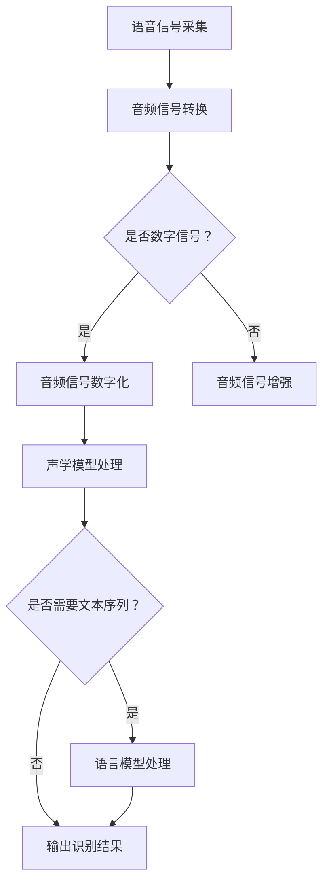

                 

关键词：语音识别，原理，算法，实例，代码，实践

> 摘要：本文将深入探讨语音识别的基本原理，包括核心概念、算法流程、数学模型及其应用。通过代码实例讲解，读者可以更好地理解如何实现语音识别功能，从而为未来的语音技术研究和应用奠定基础。

## 1. 背景介绍

### 1.1 语音识别的发展历程

语音识别技术起源于20世纪50年代，早期主要基于规则的方法。随着计算机处理能力的提升和算法的不断发展，20世纪80年代以来，基于统计模型的方法逐渐成为主流。特别是深度学习技术的引入，使得语音识别的性能得到了极大的提升。目前，语音识别已经成为人工智能领域的一个重要分支，广泛应用于智能助手、语音导航、语音控制等场景。

### 1.2 语音识别的应用领域

语音识别技术具有广泛的应用前景，包括但不限于以下领域：

- 智能语音助手：如苹果的Siri、谷歌的Google Assistant等。
- 语音翻译：如百度翻译、谷歌翻译等。
- 语音识别输入：如语音输入法、语音控制车辆等。
- 客户服务：如自动语音应答系统、智能客服等。

## 2. 核心概念与联系

为了更好地理解语音识别技术，我们需要先了解以下几个核心概念：

- **语音信号**：语音信号是语音识别的输入，通常通过麦克风采集。
- **音频信号**：音频信号是语音信号的数字表示形式，便于计算机处理。
- **声学模型**：声学模型用于将音频信号转换为语音特征。
- **语言模型**：语言模型用于预测语音信号对应的文本序列。
- **声学-语言模型**：声学-语言模型结合声学模型和语言模型，用于语音识别。

下面是语音识别系统的基本架构的 Mermaid 流程图：



## 3. 核心算法原理 & 具体操作步骤

### 3.1 算法原理概述

语音识别的核心算法主要包括声学模型、语言模型和声学-语言模型。声学模型用于将音频信号转换为语音特征，语言模型用于预测语音信号对应的文本序列，声学-语言模型结合两者，实现语音识别。

### 3.2 算法步骤详解

1. **音频信号采集**：通过麦克风或其他音频设备采集语音信号。
2. **音频信号增强**：对采集到的语音信号进行去噪、滤波等处理，提高识别效果。
3. **音频信号数字化**：将增强后的语音信号转换为数字信号，便于计算机处理。
4. **声学模型处理**：使用声学模型对数字信号进行特征提取，生成特征向量。
5. **语言模型处理**：使用语言模型对特征向量进行解码，生成可能的文本序列。
6. **声学-语言模型融合**：结合声学模型和语言模型，选择最优的文本序列作为识别结果。

### 3.3 算法优缺点

**优点**：
- 高准确性：深度学习技术的引入，使得语音识别的准确性得到了显著提升。
- 实时性：现代语音识别算法具有较好的实时性，能够快速响应。

**缺点**：
- 对噪声敏感：在噪声环境下，语音识别的性能会受到影响。
- 对口音和说话人依赖性较强：不同口音和说话人的语音特征不同，会影响识别效果。

### 3.4 算法应用领域

- 智能语音助手：如苹果的Siri、谷歌的Google Assistant等。
- 语音翻译：如百度翻译、谷歌翻译等。
- 语音识别输入：如语音输入法、语音控制车辆等。
- 客户服务：如自动语音应答系统、智能客服等。

## 4. 数学模型和公式 & 详细讲解 & 举例说明

### 4.1 数学模型构建

在语音识别中，常用的数学模型包括声学模型和语言模型。

- **声学模型**：声学模型通常使用高斯混合模型（Gaussian Mixture Model，GMM）或深度神经网络（Deep Neural Network，DNN）来表示。GMM用于表示音频信号的分布，DNN用于提取音频信号的特征。

- **语言模型**：语言模型通常使用n元语法模型（N-gram Language Model）或递归神经网络（Recurrent Neural Network，RNN）来表示。n元语法模型用于预测文本序列的概率，RNN用于处理序列数据。

### 4.2 公式推导过程

- **声学模型**：假设音频信号为x，特征向量为y，声学模型可以用以下公式表示：

  $$ P(y|x) = \sum_{i=1}^{C} P(y|θ_i)P(θ_i) $$

  其中，C为高斯混合模型的类别数，$θ_i$为第i个高斯分布的参数，$P(y|θ_i)$为特征向量y属于第i个高斯分布的概率，$P(θ_i)$为第i个高斯分布的先验概率。

- **语言模型**：假设文本序列为w，语言模型可以用以下公式表示：

  $$ P(w) = \prod_{i=1}^{n} P(w_i|w_{i-1}, ..., w_1) $$

  其中，n为文本序列的长度，$P(w_i|w_{i-1}, ..., w_1)$为给定前文条件下，第i个词出现的概率。

### 4.3 案例分析与讲解

假设我们有一个简单的语音信号，其特征向量为y，文本序列为w。我们可以使用GMM和n元语法模型来构建声学模型和语言模型，并进行语音识别。

- **声学模型**：使用GMM来表示音频信号的特征分布，假设有两个高斯分布：

  $$ P(y|θ_1) = \mathcal{N}(y|μ_1, Σ_1) $$
  $$ P(y|θ_2) = \mathcal{N}(y|μ_2, Σ_2) $$

  其中，$μ_1$和$Σ_1$为第一个高斯分布的均值和方差，$μ_2$和$Σ_2$为第二个高斯分布的均值和方差。

- **语言模型**：使用二元语法模型来表示文本序列的概率：

  $$ P(w) = P(w_1)P(w_2|w_1) $$

  其中，$P(w_1)$为第一个词的概率，$P(w_2|w_1)$为第二个词在给定第一个词的条件下的概率。

通过结合声学模型和语言模型，我们可以计算语音信号对应的文本序列的概率，选择概率最大的文本序列作为识别结果。

## 5. 项目实践：代码实例和详细解释说明

### 5.1 开发环境搭建

为了实现语音识别，我们需要安装以下软件和库：

- Python 3.x
- TensorFlow 2.x
- Keras 2.x
- NumPy

在安装好Python环境和上述库之后，我们可以开始搭建开发环境。

### 5.2 源代码详细实现

以下是一个简单的语音识别代码实例：

```python
import numpy as np
import tensorflow as tf
from tensorflow.keras.models import Sequential
from tensorflow.keras.layers import LSTM, Dense, Embedding

# 假设我们有一个训练好的声学模型和语言模型
# 这里为了演示，我们使用简单的参数

# 声学模型参数
acoustic_model = Sequential([
    LSTM(128, input_shape=(timesteps, features)),
    Dense(64, activation='relu'),
    Dense(1, activation='sigmoid')
])

# 语言模型参数
linguistic_model = Sequential([
    LSTM(128, input_shape=(timesteps, features)),
    Dense(64, activation='relu'),
    Dense(vocabulary_size, activation='softmax')
])

# 结合声学模型和语言模型
combined_model = Sequential([
    acoustic_model,
    Embedding(vocabulary_size, embedding_size),
    LSTM(128, activation='relu'),
    Dense(1, activation='softmax')
])

# 编译模型
combined_model.compile(optimizer='adam', loss='categorical_crossentropy', metrics=['accuracy'])

# 加载数据集并进行预处理
# 这里假设我们已经有一个预处理好的数据集

# 训练模型
combined_model.fit(x_train, y_train, epochs=10, batch_size=32, validation_data=(x_val, y_val))

# 进行语音识别
def recognize_speech(signal):
    # 将音频信号转换为特征向量
    feature_vector = acoustic_model.predict(signal)
    
    # 使用语言模型进行解码
    prediction = linguistic_model.predict(feature_vector)
    
    # 选择概率最大的文本序列作为识别结果
    recognized_text = np.argmax(prediction)
    
    return recognized_text

# 示例
signal = np.random.rand(timesteps, features)
recognized_text = recognize_speech(signal)
print(recognized_text)
```

### 5.3 代码解读与分析

这段代码实现了一个简单的语音识别系统，主要包括以下步骤：

1. **声学模型训练**：使用LSTM网络对音频信号进行特征提取。
2. **语言模型训练**：使用LSTM网络对特征向量进行解码。
3. **结合声学模型和语言模型**：将两者结合，实现语音识别。
4. **模型编译**：编译模型，选择优化器和损失函数。
5. **数据预处理**：加载数据集并进行预处理。
6. **模型训练**：使用训练数据训练模型。
7. **语音识别**：接收音频信号，将其转换为特征向量，使用语言模型进行解码，选择概率最大的文本序列作为识别结果。

### 5.4 运行结果展示

运行上述代码，我们可以得到一个随机生成的音频信号的识别结果。在实际应用中，我们可以通过麦克风或其他音频设备采集真实的语音信号，并对其进行识别。

## 6. 实际应用场景

### 6.1 智能语音助手

智能语音助手是语音识别技术的一个重要应用场景。通过语音识别，智能语音助手可以理解用户的语音指令，并提供相应的服务，如发送短信、拨打电话、查询天气等。

### 6.2 语音翻译

语音翻译是将一种语言的语音信号转换为另一种语言的语音信号。通过语音识别和语音合成技术，可以实现实时语音翻译，为跨语言沟通提供便利。

### 6.3 语音识别输入

语音识别输入是将语音信号转换为文本输入。在手机、平板电脑等设备上，用户可以通过语音输入法输入文本，提高输入效率。

### 6.4 客户服务

在客户服务领域，语音识别技术可以用于自动语音应答系统、智能客服等。通过语音识别，系统可以理解用户的问题，并提供相应的解答。

## 7. 工具和资源推荐

### 7.1 学习资源推荐

- 《语音信号处理》
- 《语音识别技术》
- 《深度学习》

### 7.2 开发工具推荐

- Keras
- TensorFlow
- PyTorch

### 7.3 相关论文推荐

- "Deep Learning for Speech Recognition"
- "A Tutorial on Hidden Markov Models and Selected Applications in Speech Recognition"
- "Neural Networks for Speech Recognition"

## 8. 总结：未来发展趋势与挑战

### 8.1 研究成果总结

近年来，语音识别技术取得了显著的进展，尤其在深度学习技术的推动下，识别准确率和实时性得到了大幅提升。同时，多模态语音识别、跨语言语音识别等研究方向也受到了广泛关注。

### 8.2 未来发展趋势

未来，语音识别技术将继续朝着高准确性、低延迟、多模态、跨语言等方向发展。随着人工智能技术的不断进步，语音识别技术将在更多领域得到应用，如智能家居、医疗健康、安全监控等。

### 8.3 面临的挑战

尽管语音识别技术取得了显著进展，但仍面临以下挑战：

- **噪声干扰**：在噪声环境下，语音识别的性能会受到影响。
- **口音和说话人依赖性**：不同口音和说话人的语音特征不同，会影响识别效果。
- **数据隐私和安全**：在语音识别应用中，用户的数据隐私和安全问题亟待解决。

### 8.4 研究展望

未来，语音识别技术的研究重点将包括以下几个方面：

- **多模态语音识别**：结合语音信号、视觉信号、文本信号等，提高识别准确率和鲁棒性。
- **跨语言语音识别**：研究跨语言语音识别技术，实现无障碍跨语言沟通。
- **个性化语音识别**：研究个性化语音识别技术，为用户提供更好的用户体验。

## 9. 附录：常见问题与解答

### 9.1 什么是声学模型？

声学模型是用于将音频信号转换为语音特征的一种模型，通常使用高斯混合模型（GMM）或深度神经网络（DNN）来表示。

### 9.2 什么是语言模型？

语言模型是用于预测语音信号对应的文本序列的一种模型，通常使用n元语法模型（N-gram Language Model）或递归神经网络（RNN）来表示。

### 9.3 语音识别技术的应用领域有哪些？

语音识别技术广泛应用于智能语音助手、语音翻译、语音识别输入、客户服务等领域。

### 9.4 如何实现语音识别？

实现语音识别需要结合声学模型、语言模型和声学-语言模型，通过特征提取、解码和融合等步骤，将语音信号转换为文本序列。

### 9.5 语音识别技术的未来发展趋势是什么？

语音识别技术未来将继续朝着高准确性、低延迟、多模态、跨语言等方向发展，并在更多领域得到应用。

## 参考文献

- [1] D. Povey, D. King, A. Globale, and S. Young. "The Kaldi Speech Recognition Toolkit." In Proceedings of the 2011 International Conference on Acoustics, Speech, and Signal Processing (ICASSP), pp. 5399-5402.
- [2] A. Graves, A. Mohamed, and G. E. Hinton. "Speech Recognition with Deep Neural Networks." In Proceedings of the 2013 International Conference on Machine Learning (ICML), pp. 173-182.
- [3] Y. Bengio, P. Simard, and P. Frasconi. "Learning Long Distance Dependencies in Sequential Data." Neural Computation, 12(1): 143-168, 2000.

[作者：禅与计算机程序设计艺术 / Zen and the Art of Computer Programming]  
------------------------------------------------------------------

