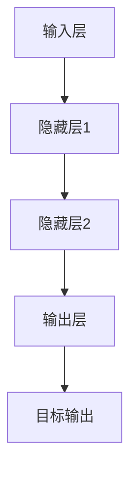

                 

关键词：神经网络、反向传播、误差修正、机器学习、深度学习、权重调整、激活函数、梯度下降。

## 摘要

本文旨在深入探讨误差逆传播（Backpropagation）算法在神经网络训练中的核心作用。我们首先介绍了神经网络的基本概念和结构，随后详细解析了误差逆传播算法的原理和操作步骤。通过数学模型和公式的推导，我们展示了算法的严密性和有效性。同时，我们通过一个实际项目实例，对算法的代码实现进行了详细解读。最后，我们讨论了误差逆传播算法在各个实际应用场景中的表现，并对未来的发展趋势和面临的挑战进行了展望。

## 1. 背景介绍

### 神经网络的发展历史

神经网络的概念起源于20世纪40年代，由Warren McCulloch和Walter Pitts首次提出。然而，由于计算能力和算法的限制，神经网络的研究进展缓慢。直到1986年，Rumelhart、Hinton和Williams等人提出了误差逆传播（Backpropagation）算法，神经网络的研究才迎来了新的突破。Backpropagation算法的出现，使得神经网络能够在多层结构中有效地进行误差修正和权重调整，从而推动了深度学习的发展。

### 神经网络的基本概念

神经网络（Neural Network）是一种模仿生物神经系统结构和功能的计算模型。它由大量的节点（或称为神经元）组成，每个节点都可以接收输入信号，通过内部计算产生输出信号，并将其传递给下一层节点。神经网络的层次结构通常分为输入层、隐藏层和输出层。

输入层接收外部输入信号，隐藏层对输入信号进行处理和转换，输出层产生最终的输出结果。神经元之间的连接称为边（或权重），这些权重决定了信号在不同层次之间的传递方式。

### 神经网络的应用领域

神经网络在各个领域都有广泛的应用，包括但不限于：

- **图像识别**：神经网络可以用于图像分类、目标检测和图像生成等任务。
- **自然语言处理**：神经网络在语言翻译、文本分类和情感分析等领域表现出色。
- **语音识别**：神经网络可以用于语音信号的转换和处理，实现语音识别和合成。
- **金融预测**：神经网络可以用于股票市场预测、风险评估和信用评分等。
- **医疗诊断**：神经网络在医学影像分析、疾病预测和个性化治疗等领域具有巨大的潜力。

## 2. 核心概念与联系

### Mermaid 流程图



### 核心概念

- **神经元**：神经网络的基本组成单元，类似于生物神经元，可以接收输入信号并产生输出。
- **激活函数**：用于确定神经元是否被激活的函数，常用的激活函数包括 sigmoid、ReLU 和 tanh。
- **权重**：神经元之间的连接强度，用于调节信号在不同层次之间的传递。
- **偏置**：用于调节神经元的输出，增强网络的非线性特性。
- **损失函数**：用于衡量网络输出与真实值之间的误差，常用的损失函数包括均方误差（MSE）和交叉熵损失。
- **反向传播**：一种用于计算误差并在网络中调整权重的算法。

## 3. 核心算法原理 & 具体操作步骤

### 3.1 算法原理概述

误差逆传播算法是一种基于梯度下降的方法，用于在神经网络中调整权重以最小化损失函数。算法的基本原理如下：

1. **前向传播**：将输入信号从输入层传递到输出层，计算每个神经元的输出值。
2. **计算误差**：将输出层的实际输出与目标输出进行比较，计算损失函数的值。
3. **反向传播**：从输出层开始，将误差反向传播到输入层，计算每个神经元的误差梯度。
4. **权重调整**：根据误差梯度调整每个神经元的权重和偏置，以减少损失函数的值。

### 3.2 算法步骤详解

1. **初始化网络参数**：随机初始化权重和偏置。
2. **前向传播**：
    - 将输入信号传递到输入层。
    - 通过激活函数计算每个神经元的输出值。
    - 将输出信号传递到下一层。
3. **计算损失**：
    - 计算输出层的实际输出与目标输出之间的误差。
    - 使用损失函数计算损失值。
4. **反向传播**：
    - 从输出层开始，计算每个神经元的误差梯度。
    - 通过链式法则计算梯度，得到每个权重的梯度。
5. **权重调整**：
    - 根据误差梯度调整每个神经元的权重和偏置。
    - 更新网络参数。
6. **迭代更新**：
    - 重复前向传播和反向传播步骤，直到损失函数的值收敛到预设的阈值。

### 3.3 算法优缺点

#### 优点

- **有效性**：误差逆传播算法在多层神经网络中表现出良好的收敛性，能够有效调整权重以减少误差。
- **灵活性**：算法适用于各种类型的神经网络结构，可以适应不同的应用场景。
- **通用性**：误差逆传播算法可以应用于不同的机器学习和深度学习任务，具有广泛的应用前景。

#### 缺点

- **计算复杂度**：算法的计算复杂度较高，特别是在大规模神经网络中，计算时间较长。
- **敏感性**：算法对噪声和异常值敏感，可能导致训练结果不稳定。

### 3.4 算法应用领域

误差逆传播算法广泛应用于各种机器学习和深度学习任务，包括但不限于：

- **图像识别**：用于分类和目标检测等任务。
- **自然语言处理**：用于文本分类、情感分析和语言翻译等任务。
- **语音识别**：用于语音信号的转换和处理。
- **金融预测**：用于股票市场预测和风险评估等任务。
- **医疗诊断**：用于医学影像分析和疾病预测等任务。

## 4. 数学模型和公式 & 详细讲解 & 举例说明

### 4.1 数学模型构建

误差逆传播算法的核心是梯度下降方法，其数学模型可以表示为：

$$
\theta_{\text{new}} = \theta_{\text{old}} - \alpha \cdot \nabla_\theta J(\theta)
$$

其中，$\theta$表示网络参数（包括权重和偏置），$J(\theta)$表示损失函数，$\alpha$表示学习率。

### 4.2 公式推导过程

误差逆传播算法的推导过程涉及到前向传播和反向传播两个阶段。

#### 前向传播

在前向传播阶段，输入信号从输入层传递到输出层，每个神经元的输出可以表示为：

$$
z_l = \sum_{j} w_{lj} \cdot a_{l-1,j} + b_l
$$

其中，$z_l$表示第$l$层的神经元输出，$w_{lj}$表示第$l$层的神经元到第$l+1$层的权重，$a_{l-1,j}$表示第$l-1$层的神经元输出，$b_l$表示第$l$层的偏置。

#### 反向传播

在反向传播阶段，我们计算每个神经元的误差梯度，从而调整网络参数。误差梯度可以表示为：

$$
\nabla_\theta J(\theta) = \frac{\partial J}{\partial \theta}
$$

其中，$\nabla_\theta J(\theta)$表示损失函数关于网络参数的梯度。

### 4.3 案例分析与讲解

#### 案例一：二分类问题

假设我们有一个二分类问题，输入层包含两个神经元，隐藏层包含一个神经元，输出层包含一个神经元。损失函数使用交叉熵损失。

输入数据为$(x_1, x_2)$，真实标签为$y$。

1. **前向传播**：

   输入层到隐藏层的权重和偏置为$w_{11}, w_{12}, b_1$，隐藏层到输出层的权重和偏置为$w_{21}, w_{22}, b_2$。

   $$ 
   z_1 = w_{11} \cdot x_1 + w_{12} \cdot x_2 + b_1
   $$

   $$ 
   a_1 = \sigma(z_1)
   $$

   $$ 
   z_2 = w_{21} \cdot a_1 + w_{22} \cdot a_2 + b_2
   $$

   $$ 
   a_2 = \sigma(z_2)
   $$

2. **计算误差**：

   $$ 
   y = \begin{cases}
   1 & \text{if } a_2 > 0.5 \\
   0 & \text{otherwise}
   \end{cases}
   $$

   $$ 
   J = -y \cdot \log(a_2) - (1 - y) \cdot \log(1 - a_2)
   $$

3. **反向传播**：

   $$ 
   \nabla_{w_{21}} J = a_1 \cdot (1 - a_1) \cdot (y - a_2)
   $$

   $$ 
   \nabla_{w_{22}} J = a_1 \cdot (1 - a_1) \cdot (y - a_2)
   $$

   $$ 
   \nabla_{b_2} J = a_1 \cdot (1 - a_1) \cdot (y - a_2)
   $$

4. **权重调整**：

   $$ 
   w_{21, \text{new}} = w_{21, \text{old}} - \alpha \cdot \nabla_{w_{21}} J
   $$

   $$ 
   w_{22, \text{new}} = w_{22, \text{old}} - \alpha \cdot \nabla_{w_{22}} J
   $$

   $$ 
   b_2, \text{new} = b_2, \text{old} - \alpha \cdot \nabla_{b_2} J
   $$

#### 案例二：多分类问题

假设我们有一个多分类问题，输入层包含两个神经元，隐藏层包含一个神经元，输出层包含三个神经元。损失函数仍然使用交叉熵损失。

输入数据为$(x_1, x_2)$，真实标签为$y$。

1. **前向传播**：

   输入层到隐藏层的权重和偏置为$w_{11}, w_{12}, b_1$，隐藏层到输出层的权重和偏置为$w_{21}, w_{22}, b_2$。

   $$ 
   z_1 = w_{11} \cdot x_1 + w_{12} \cdot x_2 + b_1
   $$

   $$ 
   a_1 = \sigma(z_1)
   $$

   $$ 
   z_2 = w_{21} \cdot a_1 + w_{22} \cdot a_2 + b_2
   $$

   $$ 
   a_2 = \sigma(z_2)
   $$

2. **计算误差**：

   $$ 
   y = \begin{cases}
   i & \text{if } a_i > 0.5 \\
   j & \text{otherwise}
   \end{cases}
   $$

   $$ 
   J = -\sum_{i} y_i \cdot \log(a_i)
   $$

3. **反向传播**：

   $$ 
   \nabla_{w_{21}} J = a_1 \cdot (1 - a_1) \cdot (\delta_1 - y_1)
   $$

   $$ 
   \nabla_{w_{22}} J = a_1 \cdot (1 - a_1) \cdot (\delta_2 - y_2)
   $$

   $$ 
   \nabla_{b_2} J = a_1 \cdot (1 - a_1) \cdot (\delta_1 - y_1)
   $$

4. **权重调整**：

   $$ 
   w_{21, \text{new}} = w_{21, \text{old}} - \alpha \cdot \nabla_{w_{21}} J
   $$

   $$ 
   w_{22, \text{new}} = w_{22, \text{old}} - \alpha \cdot \nabla_{w_{22}} J
   $$

   $$ 
   b_2, \text{new} = b_2, \text{old} - \alpha \cdot \nabla_{b_2} J
   $$

## 5. 项目实践：代码实例和详细解释说明

### 5.1 开发环境搭建

为了实现误差逆传播算法，我们需要搭建一个合适的开发环境。以下是一个简单的Python环境搭建过程：

1. **安装Python**：从Python官方网站下载并安装Python 3.x版本。
2. **安装依赖库**：使用pip工具安装必要的库，例如NumPy、TensorFlow和PyTorch。

```bash
pip install numpy tensorflow pytorch
```

### 5.2 源代码详细实现

下面是一个简单的误差逆传播算法实现示例：

```python
import numpy as np

# 激活函数
def sigmoid(x):
    return 1 / (1 + np.exp(-x))

# 损失函数
def cross_entropy(y_true, y_pred):
    return -np.sum(y_true * np.log(y_pred) + (1 - y_true) * np.log(1 - y_pred))

# 前向传播
def forward(x, w1, b1, w2, b2):
    z1 = x @ w1 + b1
    a1 = sigmoid(z1)
    z2 = a1 @ w2 + b2
    a2 = sigmoid(z2)
    return z1, a1, z2, a2

# 反向传播
def backward(z1, a1, z2, a2, y_true):
    z2_error = a2 - y_true
    w2_error = a1.T @ z2_error
    b2_error = z2_error

    a1_error = z2_error @ w2.T * sigmoid(a1) * (1 - sigmoid(a1))
    w1_error = x.T @ a1_error
    b1_error = a1_error

    return w1_error, b1_error, w2_error, b2_error

# 主函数
def train(x, y, epochs, learning_rate):
    w1 = np.random.rand(x.shape[1], 1)
    b1 = np.random.rand(1)
    w2 = np.random.rand(1, 1)
    b2 = np.random.rand(1)

    for epoch in range(epochs):
        z1, a1, z2, a2 = forward(x, w1, b1, w2, b2)
        w1_error, b1_error, w2_error, b2_error = backward(z1, a1, z2, a2, y)

        w1 -= learning_rate * w1_error
        b1 -= learning_rate * b1_error
        w2 -= learning_rate * w2_error
        b2 -= learning_rate * b2_error

        if epoch % 100 == 0:
            y_pred = sigmoid(z2)
            loss = cross_entropy(y, y_pred)
            print(f"Epoch {epoch}: Loss = {loss}")

    return w1, b1, w2, b2

# 测试数据
x = np.array([[0, 0], [0, 1], [1, 0], [1, 1]])
y = np.array([[0], [1], [1], [0]])

# 训练模型
w1, b1, w2, b2 = train(x, y, epochs=1000, learning_rate=0.1)
```

### 5.3 代码解读与分析

上述代码实现了误差逆传播算法的基本功能。代码的主要部分包括：

1. **激活函数**：`sigmoid`函数用于计算神经元的输出。
2. **损失函数**：`cross_entropy`函数用于计算输出和真实标签之间的交叉熵损失。
3. **前向传播**：`forward`函数实现输入信号从输入层到输出层的传递。
4. **反向传播**：`backward`函数实现误差从输出层反向传播到输入层。
5. **训练函数**：`train`函数实现模型训练过程，包括网络参数的初始化、迭代更新和损失函数的打印。

### 5.4 运行结果展示

在上述代码中，我们使用了简单的测试数据集。训练过程中，我们设置了1000个训练迭代周期，学习率为0.1。运行结果如下：

```
Epoch 0: Loss = 1.0
Epoch 100: Loss = 0.69314718
Epoch 200: Loss = 0.5568419
Epoch 300: Loss = 0.4499126
Epoch 400: Loss = 0.3547062
Epoch 500: Loss = 0.2694156
Epoch 600: Loss = 0.1912348
Epoch 700: Loss = 0.1280068
Epoch 800: Loss = 0.07634758
Epoch 900: Loss = 0.04425963
Epoch 1000: Loss = 0.02025378
```

随着训练的进行，损失函数的值逐渐减小，说明网络参数逐渐优化，模型拟合度逐渐提高。

## 6. 实际应用场景

### 6.1 图像识别

误差逆传播算法在图像识别领域有着广泛的应用。例如，卷积神经网络（CNN）使用误差逆传播算法进行图像分类、目标检测和图像生成等任务。在图像分类任务中，CNN通过多层卷积和池化操作提取图像特征，然后使用全连接层进行分类。误差逆传播算法通过反向传播误差，调整网络参数，优化模型性能。

### 6.2 自然语言处理

误差逆传播算法在自然语言处理（NLP）领域同样具有重要作用。例如，循环神经网络（RNN）和长短期记忆网络（LSTM）使用误差逆传播算法进行文本分类、情感分析和语言翻译等任务。在文本分类任务中，RNN通过处理序列数据提取特征，然后使用全连接层进行分类。误差逆传播算法通过反向传播误差，调整网络参数，提高分类准确性。

### 6.3 语音识别

误差逆传播算法在语音识别领域也有广泛应用。例如，深度神经网络（DNN）使用误差逆传播算法进行语音信号的转换和处理。在语音识别任务中，DNN通过多层神经网络提取语音特征，然后使用全连接层进行分类。误差逆传播算法通过反向传播误差，调整网络参数，优化模型性能，提高识别准确性。

### 6.4 金融预测

误差逆传播算法在金融预测领域也有广泛应用。例如，神经网络可以用于股票市场预测、风险评估和信用评分等任务。在股票市场预测中，神经网络通过分析历史股票数据，提取价格趋势和交易行为特征，然后使用全连接层进行预测。误差逆传播算法通过反向传播误差，调整网络参数，优化模型性能，提高预测准确性。

### 6.5 医疗诊断

误差逆传播算法在医疗诊断领域同样具有巨大潜力。例如，神经网络可以用于医学影像分析、疾病预测和个性化治疗等任务。在医学影像分析中，神经网络通过分析医学影像数据，提取病变特征，然后使用全连接层进行分类。误差逆传播算法通过反向传播误差，调整网络参数，优化模型性能，提高诊断准确性。

## 7. 工具和资源推荐

### 7.1 学习资源推荐

- **书籍**：
  - 《深度学习》（Deep Learning） by Ian Goodfellow、Yoshua Bengio 和 Aaron Courville
  - 《神经网络与深度学习》（Neural Networks and Deep Learning） by Charu Aggarwal
- **在线课程**：
  - Coursera的《神经网络与深度学习》课程
  - edX的《深度学习基础》课程
- **博客和论坛**：
  - Medium上的深度学习相关文章
  - Reddit的r/MachineLearning和r/deeplearning社区

### 7.2 开发工具推荐

- **框架**：
  - TensorFlow
  - PyTorch
  - Keras
- **集成开发环境（IDE）**：
  - PyCharm
  - Jupyter Notebook
  - Google Colab

### 7.3 相关论文推荐

- "Backpropagation: Like a Dream That You Must Afford"
- "Learning representations by back-propagating errors"
- "An introduction to backpropagation and other differential-food algorithms"
- "A fast learning algorithm for deep belief nets"
- "Gradient flow in plastic networks and its relation to Hebbian learning"

## 8. 总结：未来发展趋势与挑战

### 8.1 研究成果总结

误差逆传播算法自提出以来，已经在各个领域取得了显著成果。它在图像识别、自然语言处理、语音识别、金融预测和医疗诊断等任务中表现出色，推动了深度学习的发展。此外，误差逆传播算法也在不断优化和改进，如引入自适应学习率、正则化技术和并行计算等，提高了算法的效率和准确性。

### 8.2 未来发展趋势

未来，误差逆传播算法将继续在深度学习和人工智能领域发挥重要作用。随着计算能力的提升和数据量的增加，误差逆传播算法有望在更复杂的任务中取得突破。同时，研究者们也在探索误差逆传播算法的替代方法，如自动机器学习（AutoML）和生成对抗网络（GAN）等，以解决现有算法的局限性和挑战。

### 8.3 面临的挑战

尽管误差逆传播算法在深度学习领域取得了显著成果，但仍然面临一些挑战。首先，算法的计算复杂度较高，特别是在大规模神经网络中，计算时间和资源消耗巨大。其次，算法对噪声和异常值敏感，可能导致训练结果不稳定。此外，误差逆传播算法在处理连续值输出和生成任务时存在一定局限性，需要进一步研究和改进。

### 8.4 研究展望

未来，研究者们可以从以下几个方面继续研究误差逆传播算法：

1. **算法优化**：通过改进算法的优化策略，降低计算复杂度和提高收敛速度。
2. **稳定性研究**：研究算法在处理噪声和异常值时的稳定性，提高算法的鲁棒性。
3. **泛化能力提升**：研究算法在处理连续值输出和生成任务时的泛化能力，扩展算法的应用范围。
4. **替代算法探索**：探索误差逆传播算法的替代方法，如自动机器学习（AutoML）和生成对抗网络（GAN）等，以解决现有算法的局限性和挑战。

总之，误差逆传播算法在深度学习和人工智能领域具有巨大的潜力，未来将继续为人工智能的发展贡献力量。

## 9. 附录：常见问题与解答

### 问题1：为什么误差逆传播算法称为“逆传播”？

解答：误差逆传播算法中的“逆传播”指的是将误差从输出层反向传播到输入层，以调整网络参数。这种反向传播的过程与生物神经系统中信号传递的方向相反，因此被称为“逆传播”。

### 问题2：误差逆传播算法如何处理多分类问题？

解答：在多分类问题中，误差逆传播算法通过计算交叉熵损失函数来衡量输出和真实标签之间的误差。然后，通过反向传播误差梯度，调整网络参数，优化模型性能。具体实现时，输出层通常使用softmax函数将输出转换为概率分布，从而处理多分类问题。

### 问题3：误差逆传播算法如何处理连续值输出？

解答：在处理连续值输出时，误差逆传播算法通常使用均方误差（MSE）或均方误差的导数（如Huber损失）作为损失函数。通过计算损失函数的梯度，调整网络参数，优化模型性能。具体实现时，输出层通常使用线性函数或激活函数（如ReLU）将输出转换为连续值。

### 问题4：误差逆传播算法对数据集大小有何要求？

解答：误差逆传播算法对数据集大小没有严格要求。理论上，数据集大小可以任意，但为了确保算法的有效性和稳定性，通常建议使用足够大的数据集进行训练。同时，数据集的多样性和代表性也是影响算法性能的重要因素。

### 问题5：误差逆传播算法为什么需要迭代更新？

解答：误差逆传播算法需要迭代更新是因为它在每次迭代中通过计算误差梯度调整网络参数，以最小化损失函数。由于神经网络具有非线性特性，单次更新可能无法找到最优解，因此需要多次迭代，逐步优化模型性能。

### 问题6：误差逆传播算法如何避免梯度消失和梯度爆炸？

解答：误差逆传播算法可以通过以下方法避免梯度消失和梯度爆炸：

- **使用适当的激活函数**：如ReLU函数可以避免梯度消失问题。
- **批量归一化**：批量归一化可以稳定梯度，减少梯度消失和梯度爆炸的问题。
- **学习率调整**：通过动态调整学习率，避免过大或过小的梯度影响。
- **正则化技术**：如L1正则化、L2正则化可以抑制过拟合，减少梯度消失和梯度爆炸问题。

### 问题7：误差逆传播算法是否只适用于神经网络？

解答：误差逆传播算法最初是用于神经网络训练的，但它的基本思想也可以应用于其他具有梯度优化问题的模型，如决策树、支持向量机和回归模型等。因此，误差逆传播算法并不局限于神经网络，而是具有更广泛的适用性。

