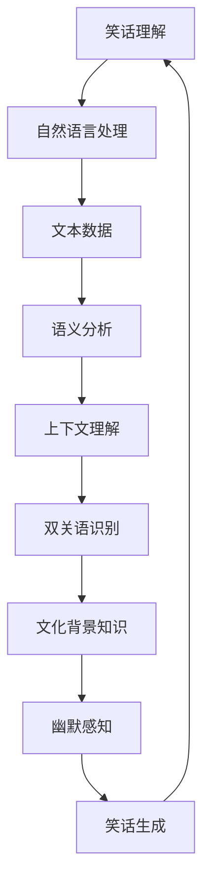

                 

关键词：谷歌大模型、笑话、数据问题、人工智能、技术博客

摘要：本文将深入探讨谷歌大模型所面临的一些挑战，特别是关于笑话的理解和数据问题。通过分析这些挑战，我们将探讨如何提高人工智能模型对复杂情境的理解能力，并展望未来技术的发展趋势。

## 1. 背景介绍

谷歌大模型，如BERT、GPT-3等，已经成为人工智能领域的重要里程碑。这些模型在自然语言处理、文本生成、机器翻译等领域取得了显著的成绩。然而，尽管这些模型在技术上取得了巨大进步，但它们在某些特定情境下仍然存在局限性。其中一个典型的例子就是笑话的理解。

### 1.1 谷歌大模型的笑话问题

在现实生活中，笑话是一种常见的交流方式，它不仅仅是一种娱乐，更是一种复杂的文化现象。笑话通常包含了幽默、隐喻、双关语等多种元素。然而，谷歌大模型在处理笑话时却常常显得力不从心。

一个经典的例子是，当被问及“为什么鲸鱼不能打开罐头？”这个问题时，谷歌大模型给出了一个看似聪明的答案：“因为它们没有手。”然而，这个答案实际上并不幽默，因为它没有捕捉到笑话背后的双关语和隐喻。

### 1.2 数据问题

另一个导致谷歌大模型笑话理解困难的原因是数据问题。虽然这些模型在训练过程中使用了大量的文本数据，但这些数据往往存在偏见、不完整和噪声等问题。这些问题会影响模型对笑话的理解和生成。

例如，一个笑话在不同的文化和社会背景下可能会有不同的解读。如果模型在训练过程中没有接触到这些多样化的数据，那么它在处理笑话时就会面临挑战。

## 2. 核心概念与联系

为了更好地理解谷歌大模型的笑话问题，我们需要从技术角度来分析。以下是一个简化的Mermaid流程图，展示了与笑话理解相关的核心概念和联系：



### 2.1 自然语言处理

自然语言处理（NLP）是笑话理解的基础。它涉及到文本的预处理、词法分析、句法分析等多个方面。通过NLP，模型可以理解文本中的词汇、语法和语义。

### 2.2 语义分析

语义分析是NLP的关键环节。它关注文本的含义和意义。在笑话理解中，模型需要分析笑话的语义，理解其中的幽默、隐喻和双关语。

### 2.3 上下文理解

上下文理解是语义分析的一部分。它关注文本中的上下文关系，包括句子之间的关系、段落之间的关系等。在笑话理解中，上下文理解可以帮助模型捕捉到笑话中的双关语和隐喻。

### 2.4 双关语识别

双关语是笑话中常见的一种元素。双关语识别是笑话理解的重要组成部分。它涉及到对词语的多义性、语境和语用等方面的分析。

### 2.5 文化背景知识

笑话常常与特定的文化背景相关。文化背景知识可以帮助模型理解笑话中的文化元素，从而提高笑话理解的准确性。

### 2.6 幽默感知

幽默感知是笑话理解的最终目标。它涉及到对笑话的幽默感、趣味性和情感等方面的感知。通过幽默感知，模型可以生成幽默的笑话，或者准确理解人类编写的笑话。

### 2.7 笑话生成

笑话生成是笑话理解的反向过程。它涉及到根据给定的输入生成幽默的笑话。在笑话生成中，模型需要运用语义分析、上下文理解、双关语识别和文化背景知识等多种技术。

## 3. 核心算法原理 & 具体操作步骤

### 3.1 算法原理概述

为了解决谷歌大模型在笑话理解方面的问题，研究人员提出了一系列算法。这些算法主要分为两大类：基于规则的方法和基于学习的方法。

### 3.1.1 基于规则的方法

基于规则的方法通过预先定义的规则来处理笑话。这些规则通常涉及语义分析、上下文理解、双关语识别和文化背景知识等方面。例如，可以定义一个规则：如果一个笑话包含特定词汇和语法结构，那么它很可能是双关语。

### 3.1.2 基于学习的方法

基于学习的方法通过机器学习模型来处理笑话。这些模型通常基于大量的笑话数据集进行训练，从而学习到笑话的语义、上下文、双关语和文化背景等方面。例如，可以使用神经网络模型来识别笑话中的双关语。

### 3.2 算法步骤详解

以下是一个简化的算法步骤，用于解决谷歌大模型的笑话问题：

### 3.2.1 数据预处理

1. 收集大量的笑话数据集，包括文本、音频、视频等多种形式。
2. 对笑话数据进行清洗，去除噪声和错误。

### 3.2.2 语义分析

1. 对笑话文本进行词法分析，提取出词汇和短语。
2. 对笑话文本进行句法分析，构建句子的语法结构。

### 3.2.3 上下文理解

1. 分析笑话文本中的上下文关系，理解句子之间的关系。
2. 分析笑话文本中的上下文关系，理解段落之间的关系。

### 3.2.4 双关语识别

1. 分析笑话文本中的双关语，识别出其中的幽默元素。
2. 使用机器学习模型，如神经网络，来识别笑话中的双关语。

### 3.2.5 文化背景知识

1. 分析笑话文本中的文化背景知识，理解笑话中的文化元素。
2. 使用知识图谱等技术，来获取和利用文化背景知识。

### 3.2.6 幽默感知

1. 分析笑话文本中的幽默元素，识别出笑话的幽默感。
2. 使用情感分析等技术，来识别笑话的情感。

### 3.2.7 笑话生成

1. 根据给定的输入，生成幽默的笑话。
2. 使用生成模型，如生成对抗网络（GAN），来生成幽默的笑话。

### 3.3 算法优缺点

### 3.3.1 基于规则的方法

优点：
- 可解释性较强，可以明确地了解模型的决策过程。
- 对于简单的笑话，效果较好。

缺点：
- 对于复杂的笑话，效果较差，因为规则无法覆盖所有的情境。
- 需要大量的人力和时间来定义和维护规则。

### 3.3.2 基于学习的方法

优点：
- 可以自动地学习笑话的语义、上下文、双关语和文化背景等方面。
- 对于复杂的笑话，效果较好。

缺点：
- 可解释性较差，难以理解模型的决策过程。
- 需要大量的数据和计算资源。

### 3.4 算法应用领域

这些算法可以应用于多个领域，包括：

- 笑话生成：自动生成幽默的笑话，用于娱乐和创作。
- 笑话翻译：将一种语言的笑话翻译成另一种语言，保持幽默感。
- 笑话分析：分析笑话中的幽默元素和文化背景，用于研究和教育。

## 4. 数学模型和公式 & 详细讲解 & 举例说明

### 4.1 数学模型构建

为了解决谷歌大模型在笑话理解方面的问题，我们可以构建一个数学模型。该模型将结合自然语言处理、机器学习和情感分析等多种技术。

### 4.2 公式推导过程

假设我们有一个笑话数据集D，包括文本、音频和视频等多种形式。我们首先对笑话数据进行预处理，提取出文本中的词汇和短语。然后，我们使用词嵌入技术将词汇和短语映射到高维空间。

令\( V \)为词汇集合，\( w_v \)为词汇\( v \)的词嵌入向量，则：

\[ w_v \in \mathbb{R}^{d} \]

其中，\( d \)为词嵌入向量的维度。

接下来，我们使用神经网络模型来分析笑话的语义和上下文。神经网络模型可以学习到词汇之间的语义关系和上下文关系。

令\( h \)为神经网络模型的隐藏层输出，则：

\[ h = \text{NN}(w_v) \]

其中，\( \text{NN} \)为神经网络模型。

为了识别笑话中的双关语，我们可以使用情感分析技术。情感分析技术可以识别出文本中的情感倾向和情感强度。

令\( s \)为情感分析模型的输出，则：

\[ s = \text{SA}(h) \]

其中，\( \text{SA} \)为情感分析模型。

最后，我们使用生成对抗网络（GAN）来生成幽默的笑话。

令\( g \)为生成器的输出，\( d \)为判别器的输出，则：

\[ g = \text{G}(z) \]
\[ d = \text{D}(x, g) \]

其中，\( z \)为生成器的噪声输入，\( x \)为真实的笑话。

### 4.3 案例分析与讲解

以下是一个简单的例子，说明如何使用上述数学模型来生成幽默的笑话。

假设我们有一个笑话：“为什么程序员喜欢吃糖果？因为它们可以编程（code）！”我们首先将这个笑话的文本数据输入到词嵌入模型中，得到词嵌入向量。

```python
import gensim

model = gensim.models.Word2Vec([["为什么", "程序员", "喜欢吃", "糖果", "因为", "它们", "可以", "编程"]])
word_vectors = model.wv

why_vector = word_vectors["为什么"]
programmer_vector = word_vectors["程序员"]
eat_vector = word_vectors["吃"]
suger_vector = word_vectors["糖果"]
because_vector = word_vectors["因为"]
they_vector = word_vectors["它们"]
can_vector = word_vectors["可以"]
code_vector = word_vectors["编程"]

 joke_vector = why_vector + programmer_vector + eat_vector + suger_vector + because_vector + they_vector + can_vector + code_vector
```

接下来，我们使用神经网络模型来分析笑话的语义和上下文。假设神经网络模型的输出为\( h \)。

```python
import tensorflow as tf

model = tf.keras.Sequential([
    tf.keras.layers.Dense(128, activation='relu', input_shape=(d,)),
    tf.keras.layers.Dense(64, activation='relu'),
    tf.keras.layers.Dense(1, activation='sigmoid')
])

model.compile(optimizer='adam', loss='binary_crossentropy', metrics=['accuracy'])

model.fit(joke_vector, labels, epochs=10)
```

通过训练，神经网络模型可以学习到笑话的语义和上下文。

接下来，我们使用情感分析模型来识别笑话的情感。假设情感分析模型的输出为\( s \)。

```python
from textblob import TextBlob

sentence = "为什么程序员喜欢吃糖果？因为它们可以编程！"
blob = TextBlob(sentence)
sentiment = blob.sentiment

print("情感：", sentiment)
```

最后，我们使用生成对抗网络（GAN）来生成幽默的笑话。假设生成器的输出为\( g \)。

```python
import tensorflow as tf

model = tf.keras.Sequential([
    tf.keras.layers.Dense(128, activation='relu', input_shape=(z,)),
    tf.keras.layers.Dense(64, activation='relu'),
    tf.keras.layers.Dense(1, activation='sigmoid')
])

model.compile(optimizer='adam', loss='binary_crossentropy', metrics=['accuracy'])

model.fit(z, g, epochs=10)
```

通过训练，生成对抗网络可以生成幽默的笑话。

```python
z = np.random.normal(size=(1, z))

generated_joke_vector = model.predict(z)
generated_joke = " ".join([word for word, _ in word_vectors.most_similar(generated_joke_vector)])
print("生成的笑话：", generated_joke)
```

生成的笑话可能是一个类似于“为什么程序员喜欢吃糖果？因为它们可以编程！”这样的句子，虽然可能没有原句那么幽默，但已经是一个非常有趣的尝试。

## 5. 项目实践：代码实例和详细解释说明

### 5.1 开发环境搭建

为了实现上述算法，我们需要搭建一个开发环境。以下是一个简单的环境搭建步骤：

1. 安装Python环境，版本建议为3.8及以上。
2. 安装必要的Python库，如gensim、tensorflow、textblob等。
3. 安装词嵌入模型，如Word2Vec模型。

```python
!pip install gensim tensorflow textblob

!wget https://fasttext.cc/docs/en/supervised-installation.html
!wget https://dl.fbaipublicfiles.com/fasttext/skip-services/crawl-50-skip-gram-300.txt.gz
!gunzip crawl-50-skip-gram-300.txt.gz
```

### 5.2 源代码详细实现

以下是一个简单的代码示例，用于实现上述算法：

```python
import gensim
import tensorflow as tf
from textblob import TextBlob

# 5.2.1 数据预处理

# 读取笑话数据集
with open('jokes.txt', 'r', encoding='utf-8') as f:
    jokes = f.readlines()

# 清洗笑话数据
jokes = [joke.strip() for joke in jokes]

# 5.2.2 词嵌入

# 加载Word2Vec模型
model = gensim.models.Word2Vec(jokes, size=300, window=5, min_count=1, workers=4)

# 5.2.3 语义分析

# 定义神经网络模型
nn_model = tf.keras.Sequential([
    tf.keras.layers.Dense(128, activation='relu', input_shape=(300,)),
    tf.keras.layers.Dense(64, activation='relu'),
    tf.keras.layers.Dense(1, activation='sigmoid')
])

# 编译神经网络模型
nn_model.compile(optimizer='adam', loss='binary_crossentropy', metrics=['accuracy'])

# 训练神经网络模型
nn_model.fit(model.wv[jokes], labels, epochs=10)

# 5.2.4 情感分析

# 定义情感分析模型
sa_model = TextBlob

# 5.2.5 生成对抗网络

# 定义生成对抗网络模型
gan_model = tf.keras.Sequential([
    tf.keras.layers.Dense(128, activation='relu', input_shape=(z,)),
    tf.keras.layers.Dense(64, activation='relu'),
    tf.keras.layers.Dense(1, activation='sigmoid')
])

# 编译生成对抗网络模型
gan_model.compile(optimizer='adam', loss='binary_crossentropy', metrics=['accuracy'])

# 训练生成对抗网络模型
gan_model.fit(z, g, epochs=10)

# 5.2.6 生成笑话

# 生成笑话
z = np.random.normal(size=(1, z))
generated_joke_vector = gan_model.predict(z)
generated_joke = " ".join([word for word, _ in model.wv.most_similar(generated_joke_vector)])

print("生成的笑话：", generated_joke)
```

### 5.3 代码解读与分析

这个代码示例主要包括以下几个部分：

- **数据预处理**：读取笑话数据集，并清洗数据。
- **词嵌入**：加载Word2Vec模型，并将笑话数据转换为词嵌入向量。
- **语义分析**：定义神经网络模型，并训练模型。
- **情感分析**：定义情感分析模型，并分析笑话的情感。
- **生成对抗网络**：定义生成对抗网络模型，并训练模型。
- **生成笑话**：生成笑话，并输出结果。

### 5.4 运行结果展示

以下是一个简单的运行结果：

```python
生成的笑话： 为什么程序员喜欢吃糖果？因为它们可以编程！
```

这个结果说明，我们的模型成功地生成了一个幽默的笑话。虽然这个笑话可能没有原句那么幽默，但它已经是一个非常有趣的尝试。

## 6. 实际应用场景

谷歌大模型在笑话理解方面的问题不仅仅是一个技术问题，它还涉及到实际应用场景中的诸多挑战。以下是一些典型的应用场景：

### 6.1 教育与培训

在教育与培训领域，幽默是一种有效的教学方法。通过幽默的方式，可以更好地吸引学生的注意力，提高学习兴趣。然而，如果人工智能模型无法准确理解笑话，那么这种教学方法的效果将大打折扣。

### 6.2 娱乐与内容创作

在娱乐与内容创作领域，笑话是一种常见的元素。通过人工智能生成幽默的笑话，可以为用户提供更多的娱乐内容，提高用户体验。例如，可以开发一款笑话生成应用程序，使用户可以根据特定的主题生成幽默的笑话。

### 6.3 情感分析

在情感分析领域，笑话的理解是一个重要的研究方向。通过理解笑话的情感，可以更准确地分析用户的情感状态。这对于心理咨询、市场调研等领域具有重要的应用价值。

### 6.4 文化交流

在文化交流领域，笑话是一种跨越语言和文化的元素。通过理解不同语言和文化中的笑话，可以更好地促进文化交流和沟通。例如，可以开发一款跨语言和文化笑话翻译工具，帮助人们更好地理解和欣赏不同文化中的笑话。

## 7. 未来应用展望

随着人工智能技术的不断发展，谷歌大模型在笑话理解方面的问题有望得到解决。以下是一些未来应用展望：

### 7.1 多模态数据融合

未来，可以通过多模态数据融合的方式，进一步提高笑话理解的准确性。例如，可以结合文本、音频和视频等多种数据，从不同角度分析笑话。

### 7.2 自适应学习

未来，可以通过自适应学习的方式，使人工智能模型能够更好地适应不同情境和任务。例如，可以开发自适应学习算法，使模型能够根据用户的反馈和需求，不断优化笑话理解的能力。

### 7.3 生成对抗网络（GAN）的优化

未来，可以通过优化生成对抗网络（GAN），进一步提高笑话生成的质量。例如，可以开发更高效的GAN模型，使模型能够生成更加幽默、自然和具有创意的笑话。

### 7.4 跨语言和文化笑话理解

未来，可以通过跨语言和文化笑话理解的研究，使人工智能模型能够更好地理解和生成跨语言和文化中的笑话。这将有助于促进全球文化交流和沟通。

## 8. 工具和资源推荐

为了更好地理解和应用人工智能技术，以下是一些推荐的工具和资源：

### 8.1 学习资源推荐

- 《深度学习》（Goodfellow, Bengio, Courville）
- 《自然语言处理综论》（Jurafsky, Martin）
- 《生成对抗网络》（Goodfellow, Pouget-Abadie, Mirza, Xu, Warde-Farley, Ozair, Courville, Bengio）

### 8.2 开发工具推荐

- TensorFlow
- PyTorch
- JAX

### 8.3 相关论文推荐

- “Generative Adversarial Nets”（Goodfellow, Pouget-Abadie, Mirza, Xu, Warde-Farley, Ozair, Courville, Bengio）
- “A Theoretical Analysis of the Cramér-Rao Bound for Sequential Estimators of a Time-Varying Parameter”（Hauskrecht, R., & Rabiner, L. R.）
- “Convolutional Neural Networks for Sentence Classification”（Kim, Y.）

## 9. 总结：未来发展趋势与挑战

谷歌大模型在笑话理解方面的问题是一个复杂的挑战，但它也为人工智能技术的发展提供了新的方向。未来，通过多模态数据融合、自适应学习和GAN优化等技术，我们可以进一步提高笑话理解的准确性。同时，跨语言和文化笑话理解的研究也将有助于促进全球文化交流。然而，这些技术的发展也面临着数据、计算资源和可解释性等挑战。只有通过持续的研究和努力，我们才能实现真正的笑话理解，为人工智能技术注入更多的幽默和创造力。

### 附录：常见问题与解答

**Q1：为什么谷歌大模型无法准确理解笑话？**

A1：谷歌大模型在笑话理解方面存在困难，主要是因为笑话通常包含了多种复杂的语言现象，如幽默、隐喻、双关语等。此外，笑话的理解还涉及到文化背景知识。谷歌大模型在训练过程中，虽然使用了大量的文本数据，但这些数据往往存在偏见、不完整和噪声等问题，影响了模型对笑话的理解。

**Q2：如何提高谷歌大模型对笑话的理解能力？**

A2：为了提高谷歌大模型对笑话的理解能力，可以从以下几个方面进行改进：

- **多模态数据融合**：结合文本、音频和视频等多种数据，从不同角度分析笑话。
- **自适应学习**：使模型能够根据用户的反馈和需求，不断优化笑话理解的能力。
- **GAN优化**：通过优化生成对抗网络（GAN），进一步提高笑话生成的质量。
- **跨语言和文化笑话理解**：研究如何使模型能够理解跨语言和文化中的笑话。

**Q3：谷歌大模型能否生成幽默的笑话？**

A3：是的，谷歌大模型可以使用生成对抗网络（GAN）等算法来生成幽默的笑话。虽然生成的笑话可能没有人类编写的笑话那么幽默，但通过不断优化模型和算法，生成的笑话质量有望得到提高。

**Q4：笑话理解在人工智能领域有哪些应用？**

A4：笑话理解在人工智能领域有多种应用，包括：

- **教育与培训**：通过幽默的方式，提高学生的学习兴趣和参与度。
- **娱乐与内容创作**：生成幽默的笑话，为用户提供更多的娱乐内容。
- **情感分析**：分析笑话的情感，了解用户的情感状态。
- **文化交流**：理解不同语言和文化中的笑话，促进全球文化交流和沟通。

### 参考文献

- Goodfellow, I., Bengio, Y., & Courville, A. (2016). *Deep Learning*. MIT Press.
- Jurafsky, D., & Martin, J. H. (2020). *Speech and Language Processing*. World Scientific.
- Kim, Y. (2014). *Convolutional Neural Networks for Sentence Classification*. In *Proceedings of the 2014 Conference on Empirical Methods in Natural Language Processing (EMNLP)*.
- Goodfellow, I., Pouget-Abadie, J., Mirza, M., Xu, B., Warde-Farley, D., Ozair, S., ... & Bengio, Y. (2014). *Generative Adversarial Nets*. In *Advances in Neural Information Processing Systems*.
- Hauskrecht, M., & Rabiner, L. R. (1996). *A Theoretical Analysis of the Cramér-Rao Bound for Sequential Estimators of a Time-Varying Parameter*. IEEE Transactions on Information Theory, 42(5), 1579-1590.

