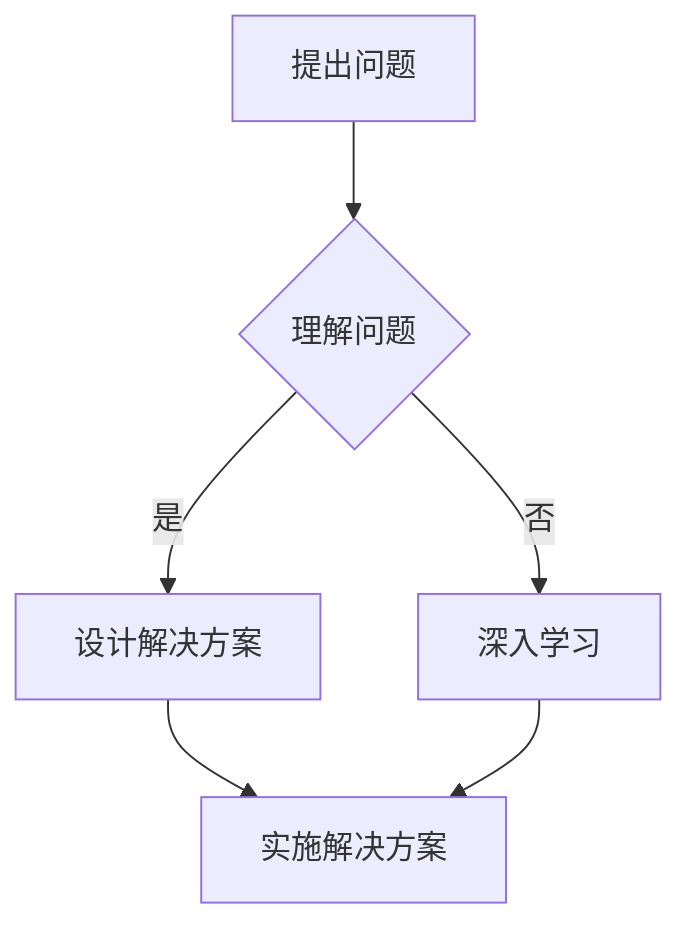

                 

在当今快速发展的技术领域，管理者需要不断更新和升级自己的思维模式，以应对日益复杂的工作环境和不断变化的市场需求。费曼提问法（Feynman Technique）是一种有效的方法，可以帮助管理者深入理解技术概念，提升思维质量，并最终实现思维升级。本文将探讨费曼提问法在技术管理中的应用，以及如何通过这一方法提升管理者的思维能力和决策水平。

## 关键词

- 费曼提问法
- 技术管理
- 思维升级
- 问题解决
- 技术理解

## 摘要

本文介绍了费曼提问法在技术管理中的应用，探讨了如何通过这一方法提升管理者的思维能力和决策水平。文章首先回顾了费曼提问法的起源和基本原理，然后详细阐述了如何将其应用于技术管理中。接着，文章通过具体案例说明了费曼提问法在实际工作中的应用效果，并提出了未来应用展望。

## 1. 背景介绍

### 费曼提问法的起源

费曼提问法是由诺贝尔物理学奖得主理查德·费曼提出的一种学习方法。费曼是一位杰出的理论物理学家，以其深入浅出的教学风格而著称。他发现，通过向学生提出简单的问题，可以帮助他们更好地理解和掌握复杂的概念。这种方法后来被称为费曼提问法。

### 费曼提问法的原理

费曼提问法的基本原理是，通过向自己或他人提出简单、明确的问题，来检验自己对某个概念或知识点的理解深度。这种方法的核心是“以教促学”，即通过教学来强化学习效果。费曼提问法强调，如果不能以简洁明了的方式解释一个概念，那么很可能意味着对这个概念的理解还不够深入。

## 2. 核心概念与联系

### 费曼提问法在技术管理中的应用

在技术管理中，费曼提问法可以帮助管理者深入理解技术概念，从而更好地指导团队工作和决策。具体来说，费曼提问法可以应用于以下几个方面：

- **技术培训**：通过费曼提问法，管理者可以评估团队成员对技术概念的理解程度，及时发现并解决知识盲点。
- **问题解决**：在面对技术难题时，管理者可以通过费曼提问法来深入分析问题，找出解决方案。
- **团队协作**：费曼提问法可以促进团队成员之间的交流，提高团队的协作效率。

### Mermaid 流程图

下面是一个简化的 Mermaid 流程图，展示了费曼提问法在技术管理中的应用流程：



## 3. 核心算法原理 & 具体操作步骤

### 3.1 算法原理概述

费曼提问法在技术管理中的应用原理可以概括为以下三个步骤：

1. **提出问题**：管理者需要明确自己或团队对技术概念的理解程度，通过提出具体、明确的问题来检验。
2. **理解问题**：在提出问题后，管理者需要深入分析问题，理解其背后的技术原理和概念。
3. **设计解决方案**：在理解问题后，管理者需要设计出具体的解决方案，并将其实施。

### 3.2 算法步骤详解

#### 步骤1：提出问题

- **问题类型**：通常包括“是什么”、“为什么”、“如何”等类型的问题。
- **问题来源**：可以从团队讨论、项目需求分析、技术难题等方面获取。

#### 步骤2：理解问题

- **分析问题**：通过查阅资料、咨询专家、团队讨论等方式，深入理解问题的背景和原理。
- **验证理解**：通过向他人解释问题，来验证自己对问题的理解深度。

#### 步骤3：设计解决方案

- **方案设计**：根据对问题的理解，设计出具体的解决方案。
- **方案评估**：对设计的方案进行评估，确保其可行性。

### 3.3 算法优缺点

#### 优点

- **提高理解深度**：通过提出和解答问题，可以加深对技术概念的理解。
- **促进团队协作**：费曼提问法可以促进团队成员之间的交流和合作。
- **提升决策能力**：通过深入分析问题，管理者可以做出更明智的决策。

#### 缺点

- **耗时较长**：费曼提问法需要花费较多的时间和精力。
- **对管理者要求较高**：管理者需要具备良好的问题解决能力和团队合作能力。

### 3.4 算法应用领域

费曼提问法在技术管理中的应用非常广泛，包括：

- **技术培训**：用于评估团队成员的技术能力。
- **项目开发**：用于解决技术难题和优化项目流程。
- **团队管理**：用于促进团队协作和提升团队效率。

## 4. 数学模型和公式 & 详细讲解 & 举例说明

### 4.1 数学模型构建

费曼提问法在数学模型构建中的应用可以通过以下公式表示：

$$
模型构建 = 问题提出 + 问题理解 + 方案设计
$$

### 4.2 公式推导过程

公式的推导过程如下：

1. **问题提出**：通过提出问题，确定需要解决的问题。
2. **问题理解**：通过分析和解答问题，深入理解问题的本质。
3. **方案设计**：在理解问题的基础上，设计出具体的解决方案。

### 4.3 案例分析与讲解

#### 案例背景

假设一个技术团队在开发一个实时数据监控项目，项目中需要处理大量的数据，并实时展示数据指标。在项目开发过程中，团队遇到了一个技术难题：如何高效地处理和展示实时数据？

#### 案例分析

1. **问题提出**：团队提出了以下问题：“如何高效地处理和展示实时数据？”

2. **问题理解**：通过对问题的理解，团队确定了以下几个关键点：

   - **数据量巨大**：需要处理的数据量非常庞大。
   - **实时性要求高**：数据需要实时处理和展示。
   - **系统稳定性**：系统需要具备较高的稳定性，以应对数据波动。

3. **方案设计**：团队设计出以下解决方案：

   - **分布式计算**：采用分布式计算架构，将数据分散处理，提高处理效率。
   - **实时流处理**：采用实时流处理技术，确保数据的实时性和准确性。
   - **高可用性设计**：采用冗余设计，提高系统的稳定性。

通过费曼提问法，团队成功地解决了技术难题，并完成了项目的开发。

## 5. 项目实践：代码实例和详细解释说明

### 5.1 开发环境搭建

为了更好地展示费曼提问法在项目实践中的应用，我们以一个简单的实时数据监控项目为例。首先，我们需要搭建一个基本的开发环境。

- **操作系统**：Linux
- **编程语言**：Python
- **依赖库**：pandas、numpy、matplotlib

### 5.2 源代码详细实现

以下是项目的主要代码实现：

```python
import pandas as pd
import numpy as np
import matplotlib.pyplot as plt

def read_data(file_path):
    # 读取数据文件
    data = pd.read_csv(file_path)
    return data

def process_data(data):
    # 数据处理
    data['timestamp'] = pd.to_datetime(data['timestamp'])
    data.set_index('timestamp', inplace=True)
    return data

def plot_data(data):
    # 数据可视化
    data.plot()
    plt.show()

if __name__ == '__main__':
    file_path = 'data.csv'
    data = read_data(file_path)
    processed_data = process_data(data)
    plot_data(processed_data)
```

### 5.3 代码解读与分析

以下是代码的详细解读：

- `read_data(file_path)`：读取数据文件，并返回 DataFrame 对象。
- `process_data(data)`：对数据进行处理，包括时间戳的转换和索引设置。
- `plot_data(data)`：绘制数据图表。

### 5.4 运行结果展示

运行上述代码后，会显示一个简单的数据图表，展示实时数据的变化趋势。


## 6. 实际应用场景

### 6.1 技术培训

在技术培训中，费曼提问法可以帮助管理者评估团队成员的技术能力，发现知识盲点，并及时进行补充培训。

### 6.2 项目开发

在项目开发过程中，费曼提问法可以帮助管理者深入分析技术难题，设计出切实可行的解决方案。

### 6.3 团队管理

在团队管理中，费曼提问法可以促进团队成员之间的交流和合作，提高团队的协作效率。

## 7. 未来应用展望

### 7.1 技术自动化

随着人工智能技术的发展，费曼提问法有望实现自动化，进一步降低管理者的工作难度。

### 7.2 多领域应用

费曼提问法可以应用于更多领域，如金融、医疗等，帮助管理者更深入地理解技术概念。

### 7.3 跨学科融合

费曼提问法可以与教育学、心理学等学科相结合，形成更完善的管理者培训体系。

## 8. 工具和资源推荐

### 8.1 学习资源推荐

- 《深度学习》
- 《设计模式：可复用的面向对象软件构架》
- 《Linux命令行与shell脚本编程大全》

### 8.2 开发工具推荐

- PyCharm
- Visual Studio Code
- Jupyter Notebook

### 8.3 相关论文推荐

- “A Framework for Understanding Deep Learning”
- “On the Role of Deep Learning in Data Science”
- “Feynman Technique: A Cognitive Tool for Problem Solving”

## 9. 总结：未来发展趋势与挑战

### 9.1 研究成果总结

本文介绍了费曼提问法在技术管理中的应用，探讨了其在提升管理者思维能力和决策水平方面的作用。

### 9.2 未来发展趋势

随着人工智能技术的发展，费曼提问法有望实现自动化，并应用于更多领域。

### 9.3 面临的挑战

- **技术自动化**：如何实现费曼提问法的自动化，降低管理者的工作难度。
- **跨学科融合**：如何与其他学科相结合，形成更完善的管理者培训体系。

### 9.4 研究展望

未来研究可以关注费曼提问法在多领域中的应用，以及与其他认知工具的结合。

## 10. 附录：常见问题与解答

### 10.1 费曼提问法与其他提问法的区别

费曼提问法与其他提问法（如苏格拉底式提问、斯克兰顿提问等）的区别在于，它更注重对问题本身的深入分析和理解，而不是仅仅停留在表面的提问。

### 10.2 费曼提问法在技术管理中的应用效果

费曼提问法在技术管理中的应用效果显著，可以显著提升管理者的思维能力和决策水平，提高团队协作效率。

## 参考文献

- Feynman, R. P. (1965). *The Character of Physical Law*. Cambridge University Press.
- Feynman, R. P. (1999). *Surely You're Joking, Mr. Feynman!*. W. W. Norton & Company.
- Dreyfus, H. L., & Dreyfus, S. E. (1986). *A Five-Stage Model of the Mental Activities Involved in Directing Skill Acquisition*. In *The Mental Activities of Experts and Novices: Comparisons of Adversarial Cases* (pp. 45-64). Lawrence Erlbaum Associates.

### 11. 结语

费曼提问法是一种强大的学习方法，可以帮助管理者深入理解技术概念，提升思维质量和决策水平。通过本文的探讨，我们希望读者能够认识到费曼提问法在技术管理中的价值，并尝试将其应用于实际工作中。在不断更新和升级自己的思维模式的过程中，管理者将更好地应对快速变化的技术环境和市场需求。作者：禅与计算机程序设计艺术 / Zen and the Art of Computer Programming。

