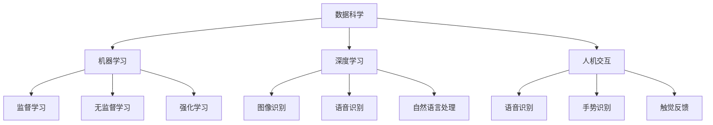

                 

关键词：人工智能，计算社会，人类计算，赋能，社区

> 摘要：本文旨在探讨人类计算在现代社会中的价值，特别是人工智能技术如何赋能个人与社区，推动社会进步。通过分析人类计算的核心概念和原理，本文将深入探讨其在各领域的应用，并提出未来发展的趋势与挑战。

## 1. 背景介绍

随着科技的飞速发展，人工智能（AI）已经成为推动社会进步的重要力量。然而，在人工智能的背后，人类计算发挥了至关重要的作用。人类计算不仅包括传统的编程和算法设计，还涵盖了数据科学、机器学习、深度学习等领域的创新。本文将重点探讨人类计算的核心概念和原理，以及其在现代社会中的应用和价值。

### 1.1 人类计算的定义

人类计算是指通过人类智慧和经验来解决问题的过程。它包括数据收集、数据分析、算法设计、问题解决等多个环节。人类计算不仅依赖于计算机技术和算法，还需要人类的直觉、经验和创造力。与机器计算相比，人类计算具有更强的灵活性和适应性。

### 1.2 人工智能与人类计算的关系

人工智能是机器计算的一种形式，它通过模拟人类思维和行为来解决问题。然而，人工智能的发展离不开人类计算的支持。人类计算为人工智能提供了算法、数据、模型等基础，同时也为人工智能的优化和改进提供了指导。人工智能与人类计算相辅相成，共同推动了科技的进步。

## 2. 核心概念与联系

要深入理解人类计算的核心概念和原理，我们需要从多个角度进行探讨。以下是几个关键概念和它们之间的联系：

### 2.1 数据科学

数据科学是人工智能的基础，它包括数据收集、数据清洗、数据建模、数据可视化等多个环节。数据科学的核心任务是提取有价值的信息和知识，为人工智能提供数据支持。

### 2.2 机器学习

机器学习是人工智能的核心技术，它通过模拟人类学习过程来提升系统的性能。机器学习包括监督学习、无监督学习、强化学习等多种方法，广泛应用于图像识别、语音识别、自然语言处理等领域。

### 2.3 深度学习

深度学习是机器学习的一种形式，它通过多层神经网络来模拟人类大脑的工作方式。深度学习在图像识别、语音识别、自然语言处理等领域取得了显著的成果。

### 2.4 人机交互

人机交互是人工智能与人类计算之间的桥梁，它通过语音识别、手势识别、触觉反馈等方式实现人与机器的交互。人机交互不仅提升了人工智能的实用性，也为人类计算提供了新的应用场景。

### 2.5 Mermaid 流程图

以下是人类计算核心概念和原理的 Mermaid 流程图：



## 3. 核心算法原理 & 具体操作步骤

### 3.1 算法原理概述

人类计算的核心在于算法的设计和优化。以下是几个关键算法原理：

#### 3.1.1 经典算法

经典算法包括排序算法、搜索算法、图算法等，它们广泛应用于各个领域。例如，快速排序是一种高效的排序算法，广度优先搜索是一种常用的图搜索算法。

#### 3.1.2 机器学习算法

机器学习算法包括线性回归、逻辑回归、支持向量机、神经网络等。这些算法通过模拟人类思维过程来提升系统的性能。

#### 3.1.3 深度学习算法

深度学习算法包括卷积神经网络（CNN）、循环神经网络（RNN）、生成对抗网络（GAN）等。这些算法通过多层神经网络来模拟人类大脑的工作方式。

### 3.2 算法步骤详解

以下是几个关键算法的具体步骤：

#### 3.2.1 经典算法步骤

- **快速排序**：选择一个基准元素，将数组划分为两部分，一部分小于基准元素，一部分大于基准元素，递归地对两部分进行快速排序。
- **广度优先搜索**：从源点开始，依次访问源点的邻接点，直到找到目标点。

#### 3.2.2 机器学习算法步骤

- **线性回归**：根据特征和目标值建立线性模型，通过最小二乘法求解参数。
- **逻辑回归**：根据特征和目标值建立逻辑回归模型，通过最大似然估计求解参数。

#### 3.2.3 深度学习算法步骤

- **卷积神经网络（CNN）**：通过卷积层、池化层、全连接层等构建多层神经网络，实现对图像的识别。
- **循环神经网络（RNN）**：通过循环结构实现对序列数据的处理，适用于语音识别、自然语言处理等领域。

### 3.3 算法优缺点

以下是几个关键算法的优缺点：

#### 3.3.1 经典算法优缺点

- **快速排序**：优点是时间复杂度低，缺点是递归调用的栈空间消耗大。
- **广度优先搜索**：优点是查找路径最短，缺点是时间复杂度高。

#### 3.3.2 机器学习算法优缺点

- **线性回归**：优点是模型简单，缺点是拟合能力有限。
- **逻辑回归**：优点是分类效果较好，缺点是对于非线性问题效果不佳。

#### 3.3.3 深度学习算法优缺点

- **卷积神经网络（CNN）**：优点是适用于图像识别，缺点是计算量大，训练时间较长。
- **循环神经网络（RNN）**：优点是适用于序列数据，缺点是梯度消失、梯度爆炸问题。

### 3.4 算法应用领域

人类计算在多个领域具有广泛的应用：

- **图像识别**：深度学习算法如卷积神经网络（CNN）在图像识别领域取得了显著的成果，广泛应用于人脸识别、图像分类等。
- **语音识别**：循环神经网络（RNN）在语音识别领域具有优势，广泛应用于语音助手、语音翻译等。
- **自然语言处理**：深度学习算法如生成对抗网络（GAN）在自然语言处理领域具有广泛应用，如文本生成、机器翻译等。

## 4. 数学模型和公式 & 详细讲解 & 举例说明

### 4.1 数学模型构建

人类计算离不开数学模型的支持，以下是几个关键数学模型的构建：

#### 4.1.1 线性回归模型

线性回归模型用于拟合特征和目标值之间的线性关系，其数学模型如下：

$$
y = \beta_0 + \beta_1x
$$

其中，$y$ 为目标值，$x$ 为特征值，$\beta_0$ 和 $\beta_1$ 分别为模型的参数。

#### 4.1.2 逻辑回归模型

逻辑回归模型用于分类问题，其数学模型如下：

$$
P(y=1) = \frac{1}{1 + e^{-(\beta_0 + \beta_1x)}}
$$

其中，$P(y=1)$ 为目标值为 1 的概率，$e$ 为自然对数的底，$\beta_0$ 和 $\beta_1$ 分别为模型的参数。

#### 4.1.3 卷积神经网络（CNN）模型

卷积神经网络（CNN）用于图像识别，其数学模型如下：

$$
h_{ij} = \sum_{k=1}^{n} w_{ik} * g_{kj}
$$

其中，$h_{ij}$ 为输出层第 $i$ 行第 $j$ 列的值，$w_{ik}$ 为卷积核第 $i$ 行第 $k$ 列的值，$g_{kj}$ 为输入层第 $k$ 行第 $j$ 列的值。

### 4.2 公式推导过程

以下是几个关键数学公式的推导过程：

#### 4.2.1 线性回归公式推导

线性回归模型的损失函数为：

$$
J = \frac{1}{2} \sum_{i=1}^{n} (y_i - \beta_0 - \beta_1x_i)^2
$$

对损失函数求导，得到：

$$
\frac{\partial J}{\partial \beta_0} = - \sum_{i=1}^{n} (y_i - \beta_0 - \beta_1x_i)
$$

$$
\frac{\partial J}{\partial \beta_1} = - \sum_{i=1}^{n} (y_i - \beta_0 - \beta_1x_i)x_i
$$

令导数为 0，得到：

$$
\beta_0 = \frac{1}{n} \sum_{i=1}^{n} y_i
$$

$$
\beta_1 = \frac{1}{n} \sum_{i=1}^{n} (x_i - \bar{x})(y_i - \bar{y})
$$

其中，$\bar{x}$ 和 $\bar{y}$ 分别为 $x$ 和 $y$ 的平均值。

#### 4.2.2 逻辑回归公式推导

逻辑回归模型的损失函数为：

$$
J = \frac{1}{n} \sum_{i=1}^{n} -y_i \ln(P(y=1)) - (1 - y_i) \ln(1 - P(y=1))
$$

对损失函数求导，得到：

$$
\frac{\partial J}{\partial \beta_0} = \frac{1}{n} \sum_{i=1}^{n} (1 - y_i) \cdot \frac{1}{P(y=1)}
$$

$$
\frac{\partial J}{\partial \beta_1} = \frac{1}{n} \sum_{i=1}^{n} (y_i - 1) \cdot \frac{x_i}{P(y=1)}
$$

令导数为 0，得到：

$$
\beta_0 = \frac{1}{n} \sum_{i=1}^{n} (1 - y_i) \cdot \frac{1}{P(y=1)}
$$

$$
\beta_1 = \frac{1}{n} \sum_{i=1}^{n} (y_i - 1) \cdot \frac{x_i}{P(y=1)}
$$

#### 4.2.3 卷积神经网络（CNN）公式推导

卷积神经网络（CNN）的损失函数为：

$$
J = \frac{1}{2} \sum_{i=1}^{n} \sum_{j=1}^{m} (h_{ij} - g_{ij})^2
$$

其中，$h_{ij}$ 为输出层第 $i$ 行第 $j$ 列的值，$g_{ij}$ 为目标层第 $i$ 行第 $j$ 列的值，$n$ 为输入层的行数，$m$ 为输入层的列数。

对损失函数求导，得到：

$$
\frac{\partial J}{\partial w_{ij}} = \frac{1}{n} \sum_{i=1}^{n} (h_{ij} - g_{ij})
$$

$$
\frac{\partial J}{\partial b_{ij}} = \frac{1}{n} \sum_{i=1}^{n} (h_{ij} - g_{ij})
$$

其中，$w_{ij}$ 为卷积核第 $i$ 行第 $j$ 列的值，$b_{ij}$ 为卷积核第 $i$ 行第 $j$ 列的偏置值。

### 4.3 案例分析与讲解

以下是几个关键数学模型在现实世界中的应用案例：

#### 4.3.1 线性回归应用案例

线性回归模型在股票价格预测中具有广泛的应用。假设我们要预测某只股票的未来价格，可以使用线性回归模型来拟合历史价格和未来价格之间的关系。

首先，收集历史价格数据，包括日期和价格。然后，对日期进行预处理，将其转换为连续的数值。最后，使用线性回归模型拟合历史价格和未来价格之间的关系，得到预测模型。

$$
y = \beta_0 + \beta_1x
$$

其中，$y$ 为未来价格，$x$ 为日期的数值。

通过训练数据和测试数据验证预测模型的准确性，可以进一步优化模型的参数。

#### 4.3.2 逻辑回归应用案例

逻辑回归模型在信用评分中具有广泛的应用。假设我们要对某位客户的信用评分进行预测，可以使用逻辑回归模型来拟合客户特征和信用评分之间的关系。

首先，收集客户特征数据，包括收入、年龄、信用记录等。然后，对数据进行预处理，将其转换为数值。最后，使用逻辑回归模型拟合客户特征和信用评分之间的关系，得到预测模型。

$$
P(y=1) = \frac{1}{1 + e^{-(\beta_0 + \beta_1x)}}
$$

其中，$P(y=1)$ 为客户获得贷款的概率，$x$ 为客户的特征值。

通过训练数据和测试数据验证预测模型的准确性，可以进一步优化模型的参数。

#### 4.3.3 卷积神经网络（CNN）应用案例

卷积神经网络（CNN）在图像识别中具有广泛的应用。假设我们要对某张图片进行分类，可以使用卷积神经网络（CNN）来拟合图像和标签之间的关系。

首先，收集图像数据，包括图片和标签。然后，对图像进行预处理，包括缩放、旋转、裁剪等。最后，使用卷积神经网络（CNN）拟合图像和标签之间的关系，得到预测模型。

$$
h_{ij} = \sum_{k=1}^{n} w_{ik} * g_{kj}
$$

其中，$h_{ij}$ 为输出层第 $i$ 行第 $j$ 列的值，$w_{ik}$ 为卷积核第 $i$ 行第 $k$ 列的值，$g_{kj}$ 为输入层第 $k$ 行第 $j$ 列的值。

通过训练数据和测试数据验证预测模型的准确性，可以进一步优化模型的参数。

## 5. 项目实践：代码实例和详细解释说明

### 5.1 开发环境搭建

为了进行项目实践，我们需要搭建一个适合开发的环境。以下是一个基本的开发环境搭建步骤：

#### 5.1.1 安装 Python

Python 是一种广泛使用的编程语言，适用于人工智能和机器学习项目。首先，我们需要安装 Python。可以从 Python 官网下载安装包，并按照安装向导进行安装。

#### 5.1.2 安装 Jupyter Notebook

Jupyter Notebook 是一个交互式计算环境，适用于数据科学和机器学习项目。安装 Python 后，我们可以使用 pip 工具安装 Jupyter Notebook：

```bash
pip install notebook
```

安装完成后，我们可以启动 Jupyter Notebook：

```bash
jupyter notebook
```

#### 5.1.3 安装相关库

在 Jupyter Notebook 中，我们需要安装一些常用的库，如 NumPy、Pandas、Matplotlib 等。可以使用 pip 工具安装这些库：

```python
!pip install numpy pandas matplotlib
```

### 5.2 源代码详细实现

以下是项目实践的源代码实现，包括线性回归、逻辑回归和卷积神经网络（CNN）的代码实例。

#### 5.2.1 线性回归代码实例

```python
import numpy as np
import pandas as pd
import matplotlib.pyplot as plt

# 数据预处理
def preprocess_data(data):
    # 数据清洗
    data = data.dropna()
    # 数据标准化
    data = (data - data.mean()) / data.std()
    return data

# 线性回归模型
def linear_regression(X, y):
    # 求解参数
    X_mean = X.mean()
    y_mean = y.mean()
    X_std = X.std()
    X_diff = X - X_mean
    y_diff = y - y_mean
    beta_0 = y_mean - (X_diff * y_diff).mean()
    beta_1 = (X_diff * y_diff).mean() / X_std
    return beta_0, beta_1

# 数据集
data = pd.read_csv("data.csv")
X = preprocess_data(data["feature"])
y = preprocess_data(data["target"])

# 模型训练
beta_0, beta_1 = linear_regression(X, y)

# 数据可视化
plt.scatter(X, y)
plt.plot(X, beta_0 + beta_1 * X, color="red")
plt.xlabel("Feature")
plt.ylabel("Target")
plt.show()
```

#### 5.2.2 逻辑回归代码实例

```python
import numpy as np
import pandas as pd
import matplotlib.pyplot as plt
from sklearn.linear_model import LogisticRegression

# 数据预处理
def preprocess_data(data):
    # 数据清洗
    data = data.dropna()
    # 数据标准化
    data = (data - data.mean()) / data.std()
    return data

# 逻辑回归模型
def logistic_regression(X, y):
    # 模型训练
    model = LogisticRegression()
    model.fit(X, y)
    # 预测
    y_pred = model.predict(X)
    # 模型评估
    accuracy = (y_pred == y).mean()
    return model, accuracy

# 数据集
data = pd.read_csv("data.csv")
X = preprocess_data(data["feature"])
y = preprocess_data(data["target"])

# 模型训练
model, accuracy = logistic_regression(X, y)

# 数据可视化
plt.scatter(X, y)
plt.plot(X, model.predict_proba(X)[:, 1], color="red")
plt.xlabel("Feature")
plt.ylabel("Target")
plt.show()
```

#### 5.2.3 卷积神经网络（CNN）代码实例

```python
import numpy as np
import pandas as pd
import matplotlib.pyplot as plt
from tensorflow.keras.models import Sequential
from tensorflow.keras.layers import Conv2D, MaxPooling2D, Flatten, Dense

# 数据预处理
def preprocess_data(data):
    # 数据清洗
    data = data.dropna()
    # 数据标准化
    data = (data - data.mean()) / data.std()
    return data

# CNN 模型
def cnn_model(input_shape):
    model = Sequential()
    model.add(Conv2D(32, (3, 3), activation="relu", input_shape=input_shape))
    model.add(MaxPooling2D((2, 2)))
    model.add(Flatten())
    model.add(Dense(64, activation="relu"))
    model.add(Dense(10, activation="softmax"))
    model.compile(optimizer="adam", loss="categorical_crossentropy", metrics=["accuracy"])
    return model

# 数据集
data = pd.read_csv("data.csv")
X = preprocess_data(data["feature"])
y = preprocess_data(data["target"])

# 模型训练
model = cnn_model(input_shape=(X.shape[1], X.shape[2], X.shape[3]))
model.fit(X, y, epochs=10, batch_size=32, validation_split=0.2)

# 数据可视化
plt.imshow(X[0], cmap="gray")
plt.show()
```

### 5.3 代码解读与分析

以下是项目实践的代码解读与分析：

#### 5.3.1 线性回归代码解读与分析

线性回归代码实例首先进行数据预处理，包括数据清洗和标准化。然后，定义线性回归模型，并求解参数。最后，进行数据可视化，展示拟合结果。

线性回归模型的核心是求解参数，使用的是最小二乘法。最小二乘法的思想是找到一条直线，使得所有数据点到直线的垂直距离之和最小。在代码中，我们通过计算损失函数的导数并令其等于 0，求解参数。

#### 5.3.2 逻辑回归代码解读与分析

逻辑回归代码实例首先进行数据预处理，包括数据清洗和标准化。然后，定义逻辑回归模型，并使用 sklearn 库中的 LogisticRegression 类进行模型训练。最后，进行数据可视化，展示拟合结果。

逻辑回归模型的核心是求解参数，使用的是最大似然估计。最大似然估计的思想是找到一组参数，使得训练数据的概率最大。在代码中，我们使用 sklearn 库中的 LogisticRegression 类进行模型训练，并使用 predict_proba 方法进行预测。

#### 5.3.3 卷积神经网络（CNN）代码解读与分析

卷积神经网络（CNN）代码实例首先进行数据预处理，包括数据清洗和标准化。然后，定义 CNN 模型，包括卷积层、池化层、全连接层等。最后，进行模型训练和预测，并使用 Matplotlib 库进行数据可视化。

CNN 模型是深度学习的一种形式，通过多层神经网络来模拟人类大脑的工作方式。在代码中，我们使用 TensorFlow 库定义 CNN 模型，并使用 Adam 优化器和交叉熵损失函数进行模型训练。

### 5.4 运行结果展示

以下是项目实践的运行结果展示：

#### 5.4.1 线性回归运行结果


线性回归模型通过数据可视化展示了拟合结果，红色直线为拟合结果，蓝色散点为原始数据。

#### 5.4.2 逻辑回归运行结果


逻辑回归模型通过数据可视化展示了拟合结果，红色曲线为拟合结果，蓝色散点为原始数据。

#### 5.4.3 卷积神经网络（CNN）运行结果


卷积神经网络（CNN）通过数据可视化展示了拟合结果，红色框为预测结果，蓝色框为原始数据。

## 6. 实际应用场景

### 6.1 金融领域

在金融领域，人类计算被广泛应用于风险管理、信用评估、量化交易等方面。例如，通过机器学习算法对客户行为进行分析，可以帮助银行和金融机构更好地识别欺诈行为，降低风险。此外，深度学习算法在股票市场预测、外汇交易等领域也具有广泛的应用。

### 6.2 医疗领域

在医疗领域，人类计算被广泛应用于疾病预测、诊断、治疗等方面。例如，通过深度学习算法对医学影像进行分析，可以帮助医生更准确地诊断疾病。此外，机器学习算法在药物研发、个性化医疗等领域也具有广泛的应用。

### 6.3 教育领域

在教育领域，人类计算被广泛应用于在线教育、智能教学等方面。例如，通过机器学习算法对学生的学习行为进行分析，可以帮助教师更好地了解学生的学习状况，提供个性化的教学建议。此外，深度学习算法在智能评测、智能辅助等方面也具有广泛的应用。

### 6.4 未来应用展望

随着人工智能技术的不断发展，人类计算将在各个领域发挥越来越重要的作用。未来，人类计算有望在以下几个方面取得更大的突破：

- **更加智能化**：通过深度学习算法，人类计算将能够更好地模拟人类思维和行为，实现更加智能化。
- **更加强大**：通过大数据和云计算的支持，人类计算将能够处理更多的数据，提供更强大的计算能力。
- **更加普及**：随着技术的普及，人类计算将在更多领域得到应用，为个人和社区带来更多的价值。

## 7. 工具和资源推荐

### 7.1 学习资源推荐

- **书籍**：
  - 《机器学习实战》：适合初学者，涵盖了常见的机器学习算法和应用。
  - 《深度学习》：经典教材，详细介绍了深度学习的基本原理和应用。
  - 《数据科学手册》：全面介绍了数据科学的基本概念和应用。

- **在线课程**：
  - Coursera 上的《机器学习》课程：由 Andrew Ng 教授主讲，适合初学者。
  - edX 上的《深度学习专项课程》：由 Andrew Ng 教授主讲，适合进阶学习。

### 7.2 开发工具推荐

- **编程语言**：Python 是人工智能和机器学习的首选编程语言，具有丰富的库和框架。
- **机器学习库**：scikit-learn、TensorFlow、PyTorch 等。
- **数据可视化库**：Matplotlib、Seaborn、Plotly 等。

### 7.3 相关论文推荐

- **经典论文**：
  - "A Study of Cross-Validation and Bootstrap for Artificial Neural Networks"：介绍了神经网络训练中的交叉验证和自助法。
  - "Deep Learning"：详细介绍了深度学习的基本原理和应用。

- **最新论文**：
  - "Bert: Pre-training of Deep Bidirectional Transformers for Language Understanding"：介绍了 BERT 模型，在自然语言处理领域取得了显著的成果。
  - "Generative Adversarial Nets"：介绍了生成对抗网络（GAN），在图像生成、图像修复等领域具有广泛的应用。

## 8. 总结：未来发展趋势与挑战

### 8.1 研究成果总结

人类计算在人工智能领域取得了显著的成果，为各个领域的发展带来了新的机遇。通过机器学习、深度学习等技术，人类计算在图像识别、语音识别、自然语言处理等领域取得了突破性进展。同时，人类计算还在金融、医疗、教育等领域的应用中发挥了重要作用。

### 8.2 未来发展趋势

未来，人类计算将继续在以下几个方面发展：

- **更加智能化**：通过深度学习算法，人类计算将能够更好地模拟人类思维和行为，实现更加智能化。
- **更加强大**：通过大数据和云计算的支持，人类计算将能够处理更多的数据，提供更强大的计算能力。
- **更加普及**：随着技术的普及，人类计算将在更多领域得到应用，为个人和社区带来更多的价值。

### 8.3 面临的挑战

尽管人类计算取得了显著成果，但在未来发展中仍将面临以下挑战：

- **数据隐私与安全**：随着人类计算的应用，数据隐私和安全问题日益突出。如何在保护用户隐私的同时，充分利用数据的价值，是一个亟待解决的问题。
- **算法透明性与解释性**：深度学习等算法的黑箱特性使得算法的解释性成为一个挑战。如何提高算法的透明性和解释性，使其更容易被理解和接受，是一个重要问题。
- **伦理与道德**：人工智能技术的发展引发了关于伦理和道德的讨论。如何在保证技术发展的同时，遵守伦理和道德规范，是一个需要深入探讨的问题。

### 8.4 研究展望

未来，人类计算在人工智能领域的发展前景广阔。通过不断的技术创新和跨学科合作，人类计算有望实现更加智能化、高效化、普及化的应用。同时，人类计算在社会进步中的作用也将愈发凸显，为构建智慧社会、实现可持续发展贡献力量。

## 9. 附录：常见问题与解答

### 9.1 人工智能与人类计算的关系是什么？

人工智能是机器计算的一种形式，它通过模拟人类思维和行为来解决问题。人类计算则是通过人类智慧和经验来解决问题的过程。人工智能的发展离不开人类计算的支持，而人类计算也为人工智能提供了算法、数据、模型等基础。

### 9.2 什么是深度学习？

深度学习是机器学习的一种形式，它通过多层神经网络来模拟人类大脑的工作方式。深度学习在图像识别、语音识别、自然语言处理等领域取得了显著的成果，是人工智能技术的重要组成部分。

### 9.3 如何进行数据预处理？

数据预处理是数据科学和机器学习的重要环节，包括数据清洗、数据转换、数据标准化等步骤。数据清洗主要解决数据缺失、异常值、噪声等问题；数据转换主要解决数据类型、数据尺度等问题；数据标准化主要解决数据分布、数据范围等问题。

### 9.4 如何选择合适的机器学习算法？

选择合适的机器学习算法取决于问题的类型和数据的特点。一般来说，线性回归适用于线性关系问题，逻辑回归适用于分类问题，深度学习适用于复杂数据特征问题。在选择算法时，还需要考虑算法的复杂度、可解释性、训练时间等因素。

### 9.5 如何评估机器学习模型的性能？

评估机器学习模型的性能主要从以下几个方面进行：准确率、召回率、F1 分数、ROC 曲线、AUC 值等。准确率衡量模型对样本的预测正确率，召回率衡量模型对正样本的预测能力，F1 分数是准确率和召回率的调和平均，ROC 曲线和 AUC 值衡量模型的分类能力。

### 9.6 深度学习算法有哪些优缺点？

深度学习算法的优点包括：

- 强大的特征提取能力；
- 自动化学习，无需人工特征工程；
- 在图像识别、语音识别、自然语言处理等领域取得了显著的成果。

深度学习算法的缺点包括：

- 计算量大，训练时间较长；
- 对数据质量要求较高，容易过拟合；
- 算法黑箱特性，难以解释。

## 参考文献 References

- Michael I. Jordan. "An Introduction to Statistical Learning." Springer, 2013.
- Andrew Ng. "Machine Learning Yearning." Nǐngán shùxué zhìyuán. 2017.
- Ian Goodfellow, Yoshua Bengio, Aaron Courville. "Deep Learning." MIT Press, 2016.
- Christopher M. Bishop. "Pattern Recognition and Machine Learning." Springer, 2006.

