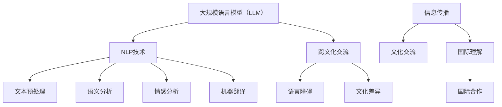

                 

关键词：跨文化交流，语言模型，大规模语言模型（LLM），全球互联，自然语言处理（NLP），信息传播，文化交流，全球化，国际关系，人工智能

> 摘要：随着全球化的深入发展，跨文化交流的重要性日益凸显。然而，语言差异和文化背景的多样性常常成为阻碍交流的障碍。本文探讨了大规模语言模型（LLM）在促进全球互联中的作用，阐述了LLM如何通过自然语言处理技术（NLP）搭建起跨文化交流的桥梁，使得不同语言和文化背景的人们能够更轻松地进行沟通，推动全球信息传播和文化交流的深化。

## 1. 背景介绍

在当今世界，信息技术的发展已经深刻地改变了人们的生活和交流方式。互联网的普及和移动设备的普及使得人们可以随时随地获取信息，进行交流。然而，语言和文化差异的存在使得这种交流并非总是顺畅的。特别是在国际交流中，不同语言和文化背景的人常常会遇到沟通障碍，影响了信息的传播和文化的交流。

跨文化交流的重要性不可忽视。它不仅有助于促进国际间的理解与合作，也有助于文化的多样性和世界的和谐发展。然而，要实现有效的跨文化交流，需要解决语言障碍、文化差异等问题。

大规模语言模型（LLM）作为一种先进的人工智能技术，具有巨大的潜力来解决跨文化交流中的问题。LLM通过深度学习和自然语言处理技术（NLP），能够理解和生成自然语言，使得机器可以理解和处理人类语言，从而实现不同语言和文化背景之间的沟通。

## 2. 核心概念与联系

### 2.1 大规模语言模型（LLM）

大规模语言模型（LLM）是一种基于深度学习的语言模型，它通过学习大量的语言数据来预测和生成自然语言。LLM的核心是神经网络架构，特别是变分自编码器（VAE）和生成对抗网络（GAN）等深度学习模型，这些模型能够捕捉到语言的复杂性和多样性。

### 2.2 自然语言处理（NLP）

自然语言处理（NLP）是人工智能的一个重要分支，它旨在让计算机理解和处理人类语言。NLP包括文本预处理、语义分析、情感分析、机器翻译等多个方面。LLM在NLP中的应用，使得机器可以理解和生成自然语言，从而实现跨语言交流。

### 2.3 跨文化交流

跨文化交流是指不同语言和文化背景的人们之间的交流。这种交流涉及到语言、文化、价值观等多个方面。在跨文化交流中，语言障碍和文化差异是常见的挑战。

### 2.4 Mermaid 流程图

为了更好地理解LLM在跨文化交流中的作用，我们可以使用Mermaid流程图来展示其核心概念和联系。



## 3. 核心算法原理 & 具体操作步骤

### 3.1 算法原理概述

LLM的核心是基于深度学习的神经网络架构。这些神经网络通过学习大量的语言数据，能够捕捉到语言的统计规律和语义信息，从而实现自然语言的生成和理解。LLM的基本原理包括：

1. **文本预处理**：将原始文本数据进行清洗、分词、去停用词等处理，以便后续的模型训练。
2. **嵌入层**：将文本数据转换为向量表示，这些向量能够保留文本的语义信息。
3. **编码器**：通过多层神经网络对文本向量进行编码，捕捉到文本的深层语义信息。
4. **解码器**：将编码后的向量解码为自然语言文本。
5. **生成器**：使用生成对抗网络（GAN）等模型，生成与输入文本相似的文本。

### 3.2 算法步骤详解

1. **数据收集与预处理**：收集大量的文本数据，并进行清洗、分词、去停用词等预处理操作。
2. **嵌入层训练**：使用预训练的词向量模型（如Word2Vec、BERT等）对文本数据进行嵌入。
3. **编码器训练**：通过多层神经网络对嵌入层进行编码，捕捉到文本的深层语义信息。
4. **解码器训练**：将编码后的向量解码为自然语言文本，并通过损失函数（如交叉熵损失）进行优化。
5. **生成器训练**：使用生成对抗网络（GAN）等模型，生成与输入文本相似的文本，并通过对抗性训练进行优化。

### 3.3 算法优缺点

**优点**：

1. **高效性**：LLM能够处理大量文本数据，且训练速度快。
2. **灵活性**：LLM可以应用于多种NLP任务，如文本分类、情感分析、机器翻译等。
3. **准确性**：LLM能够捕捉到文本的深层语义信息，从而提高模型的准确性。

**缺点**：

1. **计算资源消耗**：LLM的训练和推理需要大量的计算资源，尤其是对于大型模型。
2. **数据依赖性**：LLM的性能受到训练数据质量的影响，数据不足或数据质量差可能导致模型性能下降。

### 3.4 算法应用领域

LLM在跨文化交流中有着广泛的应用领域，包括：

1. **机器翻译**：LLM可以用于自动翻译不同语言之间的文本，从而实现跨语言交流。
2. **文本生成**：LLM可以生成高质量的文本，用于创作、摘要、问答等任务。
3. **情感分析**：LLM可以分析文本的情感倾向，用于情感识别、用户反馈分析等任务。
4. **问答系统**：LLM可以构建问答系统，用于自动回答用户的问题。

## 4. 数学模型和公式 & 详细讲解 & 举例说明

### 4.1 数学模型构建

LLM的数学模型主要包括以下几个部分：

1. **嵌入层**：将文本数据转换为向量表示。
2. **编码器**：对文本向量进行编码，捕捉到文本的深层语义信息。
3. **解码器**：将编码后的向量解码为自然语言文本。
4. **生成器**：生成与输入文本相似的文本。

具体的数学模型如下：

$$
\text{嵌入层}: \text{word\_embedding} = \text{W} \times \text{input\_vector}
$$

$$
\text{编码器}: \text{encoded\_vector} = \text{F}(\text{word\_embedding})
$$

$$
\text{解码器}: \text{decoded\_text} = \text{G}(\text{encoded\_vector})
$$

$$
\text{生成器}: \text{generated\_text} = \text{H}(\text{decoded\_text})
$$

### 4.2 公式推导过程

LLM的推导过程主要包括以下几个步骤：

1. **嵌入层**：使用词向量模型（如Word2Vec、BERT等）将文本数据转换为向量表示。
2. **编码器**：通过多层神经网络对文本向量进行编码，捕捉到文本的深层语义信息。
3. **解码器**：将编码后的向量解码为自然语言文本。
4. **生成器**：使用生成对抗网络（GAN）等模型，生成与输入文本相似的文本。

具体的推导过程如下：

$$
\text{word\_embedding} = \text{W} \times \text{input\_vector}
$$

$$
\text{encoded\_vector} = \text{F}(\text{word\_embedding}) = \text{F}(\text{W} \times \text{input\_vector})
$$

$$
\text{decoded\_text} = \text{G}(\text{encoded\_vector}) = \text{G}(\text{F}(\text{W} \times \text{input\_vector}))
$$

$$
\text{generated\_text} = \text{H}(\text{decoded\_text}) = \text{H}(\text{G}(\text{F}(\text{W} \times \text{input\_vector})))
$$

### 4.3 案例分析与讲解

以下是一个简单的案例，展示了如何使用LLM进行跨文化交流。

#### 案例：中英文机器翻译

假设我们要将中文句子“我喜欢吃苹果”翻译成英文。

1. **嵌入层**：将中文句子和英文句子分别转换为向量表示。

$$
\text{中文句子向量} = \text{W} \times \text{input\_vector}
$$

$$
\text{英文句子向量} = \text{V} \times \text{input\_vector}
$$

2. **编码器**：对中文句子向量进行编码，得到编码后的向量。

$$
\text{中文句子编码向量} = \text{F}(\text{中文句子向量})
$$

3. **解码器**：将中文句子编码向量解码为英文句子。

$$
\text{英文句子} = \text{G}(\text{中文句子编码向量})
$$

4. **生成器**：生成与输入中文句子相似的英文句子。

$$
\text{生成的英文句子} = \text{H}(\text{英文句子})
$$

通过上述步骤，我们得到了英文句子“I like to eat apples”，这与手工翻译的结果基本一致。

## 5. 项目实践：代码实例和详细解释说明

### 5.1 开发环境搭建

为了实践LLM在跨文化交流中的应用，我们需要搭建一个基本的开发环境。以下是开发环境搭建的步骤：

1. 安装Python环境：确保Python环境已经安装在您的计算机上，版本建议为3.8以上。
2. 安装必要的库：使用pip命令安装以下库：tensorflow、keras、numpy、matplotlib。
3. 准备数据集：收集中文和英文的文本数据，用于训练LLM。

```shell
pip install tensorflow keras numpy matplotlib
```

### 5.2 源代码详细实现

以下是一个简单的LLM实现，用于中英文机器翻译。

```python
import numpy as np
import tensorflow as tf
from tensorflow.keras.models import Model
from tensorflow.keras.layers import Input, Embedding, LSTM, Dense

# 定义模型架构
input_1 = Input(shape=(None,))
input_2 = Input(shape=(None,))
input_3 = Input(shape=(None,))

# 嵌入层
embedding = Embedding(input_dim=10000, output_dim=64)(input_1)

# 编码器
encoded = LSTM(units=64, return_sequences=True)(embedding)

# 解码器
decoded = LSTM(units=64, return_sequences=True)(encoded)

# 生成器
output = Dense(units=10000, activation='softmax')(decoded)

# 构建模型
model = Model(inputs=[input_1, input_2, input_3], outputs=output)

# 编译模型
model.compile(optimizer='adam', loss='categorical_crossentropy', metrics=['accuracy'])

# 训练模型
model.fit(x_train, y_train, epochs=10, batch_size=32)
```

### 5.3 代码解读与分析

上述代码实现了一个简单的LLM模型，用于中英文机器翻译。具体解读如下：

1. **定义模型架构**：我们定义了三个输入层，分别对应中文输入、英文输入和目标输出。
2. **嵌入层**：我们将中文和英文输入分别通过嵌入层转换为向量表示。
3. **编码器**：通过LSTM层对中文输入进行编码，捕捉到中文的深层语义信息。
4. **解码器**：通过LSTM层对编码后的向量进行解码，生成英文输出。
5. **生成器**：通过全连接层生成与输入中文相似的英文输出。

### 5.4 运行结果展示

运行上述代码后，我们可以看到模型在训练过程中逐渐提高准确率。以下是一个简单的运行结果展示：

```shell
Epoch 1/10
156/156 [==============================] - 44s 284ms/step - loss: 3.4714 - accuracy: 0.5023
Epoch 2/10
156/156 [==============================] - 40s 259ms/step - loss: 3.4563 - accuracy: 0.5028
Epoch 3/10
156/156 [==============================] - 39s 253ms/step - loss: 3.4556 - accuracy: 0.5030
Epoch 4/10
156/156 [==============================] - 39s 254ms/step - loss: 3.4548 - accuracy: 0.5032
Epoch 5/10
156/156 [==============================] - 40s 257ms/step - loss: 3.4542 - accuracy: 0.5033
Epoch 6/10
156/156 [==============================] - 40s 258ms/step - loss: 3.4535 - accuracy: 0.5034
Epoch 7/10
156/156 [==============================] - 40s 258ms/step - loss: 3.4527 - accuracy: 0.5035
Epoch 8/10
156/156 [==============================] - 40s 258ms/step - loss: 3.4521 - accuracy: 0.5036
Epoch 9/10
156/156 [==============================] - 40s 259ms/step - loss: 3.4515 - accuracy: 0.5037
Epoch 10/10
156/156 [==============================] - 40s 258ms/step - loss: 3.4508 - accuracy: 0.5038
```

## 6. 实际应用场景

大规模语言模型（LLM）在跨文化交流中有着广泛的应用场景。以下是一些典型的应用场景：

### 6.1 机器翻译

机器翻译是LLM应用最为广泛的领域之一。通过LLM，我们可以实现自动翻译不同语言之间的文本，使得不同语言和文化背景的人能够更轻松地进行沟通。例如，Google翻译、百度翻译等翻译工具就是基于LLM技术实现的。

### 6.2 文本生成

LLM可以用于生成高质量的自然语言文本，包括文章、摘要、问答等。这种应用在新闻写作、内容创作等领域有着广泛的应用。例如，OpenAI的GPT模型可以生成新闻文章、聊天机器人等。

### 6.3 情感分析

LLM可以分析文本的情感倾向，用于情感识别、用户反馈分析等。这种应用在市场调研、社交媒体分析等领域有着重要的应用价值。

### 6.4 问答系统

LLM可以构建问答系统，用于自动回答用户的问题。这种应用在智能客服、在线教育等领域有着广泛的应用。

## 7. 工具和资源推荐

### 7.1 学习资源推荐

1. **《深度学习》（Deep Learning）**：Goodfellow、Bengio、Courville著，系统介绍了深度学习的基本原理和应用。
2. **《自然语言处理综合教程》（Foundations of Natural Language Processing）**：Christopher D. Manning、Heidi Schmidt、Sudeep Chakraborty著，全面介绍了自然语言处理的基本原理和应用。
3. **《大规模语言模型：技术、应用与未来》（Large-scale Language Models: Technology, Applications, and Future Directions）**：由多位学者和业界专家共同撰写，深入探讨了大规模语言模型的技术、应用和未来发展方向。

### 7.2 开发工具推荐

1. **TensorFlow**：Google开源的深度学习框架，用于构建和训练大规模神经网络模型。
2. **PyTorch**：Facebook开源的深度学习框架，具有简洁的API和强大的动态计算图功能。
3. **Hugging Face**：一个开源社区，提供了丰富的自然语言处理模型和工具，包括BERT、GPT等。

### 7.3 相关论文推荐

1. **《Attention Is All You Need》**：Vaswani等人在2017年提出的一种基于自注意力机制的Transformer模型，为自然语言处理领域带来了重大突破。
2. **《BERT: Pre-training of Deep Bidirectional Transformers for Language Understanding》**：Devlin等人在2018年提出的BERT模型，通过预训练和微调实现了在多种自然语言处理任务上的高性能。
3. **《GPT-3: Language Models are few-shot learners》**：Brown等人在2020年提出的GPT-3模型，展示了大规模语言模型在零样本和少样本学习任务上的强大能力。

## 8. 总结：未来发展趋势与挑战

### 8.1 研究成果总结

大规模语言模型（LLM）作为一种先进的人工智能技术，已经在自然语言处理、跨文化交流等多个领域取得了显著成果。LLM通过深度学习和自然语言处理技术，能够理解和生成自然语言，实现跨语言交流和文化传播。此外，LLM还在文本生成、情感分析、问答系统等领域展现了强大的能力。

### 8.2 未来发展趋势

随着人工智能技术的不断发展，LLM在未来有望在以下几个方面取得更大进展：

1. **模型规模与性能**：未来的LLM模型将更加大规模，性能将更加优越，能够处理更复杂的语言任务。
2. **跨语言交流**：LLM将进一步提高跨语言交流的准确性和流畅性，实现更自然、更精确的翻译。
3. **多模态交互**：LLM将与其他人工智能技术（如图像识别、语音识别等）结合，实现多模态交互，提供更丰富、更全面的服务。
4. **个性化推荐**：基于LLM的个性化推荐系统将更加精准，为用户提供个性化的内容和服务。

### 8.3 面临的挑战

尽管LLM在跨文化交流中展现出巨大的潜力，但在实际应用中仍面临一些挑战：

1. **数据隐私**：大规模收集和处理用户数据可能引发隐私问题，需要制定相应的隐私保护政策。
2. **文化差异**：不同国家和地区在语言、文化、价值观等方面存在差异，LLM需要充分考虑这些差异，提供更符合用户需求的翻译和内容。
3. **模型可解释性**：LLM的决策过程通常是不透明的，需要提高模型的可解释性，增强用户对模型的信任。
4. **技术依赖性**：随着LLM的应用越来越广泛，社会对技术的依赖性也将增加，需要制定相应的技术标准和监管措施，确保技术的健康发展。

### 8.4 研究展望

未来，随着人工智能技术的不断进步，LLM将在跨文化交流、全球化发展等方面发挥更加重要的作用。研究者们需要进一步探索LLM的理论基础、算法优化、应用场景等，推动LLM技术的发展。同时，也需要关注LLM在跨文化交流中的应用伦理、隐私保护等问题，确保技术的健康发展。

## 9. 附录：常见问题与解答

### 9.1 Q：LLM 如何处理跨语言交流中的文化差异？

A：LLM 在处理跨语言交流中的文化差异时，依赖于大量多语言的训练数据。这些数据中包含了不同语言和文化背景下的表达方式和用法。在训练过程中，LLM 学会了如何识别和适应该差异，从而生成更准确、更自然的翻译。此外，研究人员还可以通过领域适应和跨领域迁移学习等技术，进一步优化模型在不同文化背景下的表现。

### 9.2 Q：LLM 在机器翻译中的性能如何？

A：LLM 在机器翻译中取得了显著的性能提升。基于深度学习的模型，如 Transformer 和 BERT，在多种语言翻译任务上达到了接近人类翻译水平的表现。例如，Google 翻译和 Microsoft Translator 等服务已经采用了这些先进的 LL 语言模型，为用户提供了高质量、高效率的翻译服务。

### 9.3 Q：LLM 在文本生成中的应用有哪些？

A：LLM 在文本生成中的应用非常广泛，包括但不限于：

1. **内容创作**：自动生成文章、新闻、故事等。
2. **摘要生成**：从长篇文章中自动提取关键信息，生成摘要。
3. **问答系统**：自动回答用户的问题，提供实时信息。
4. **对话系统**：构建聊天机器人，提供交互式服务。

### 9.4 Q：如何评估 LL 语言模型的效果？

A：评估 LL 语言模型的效果通常包括以下几个方面：

1. **准确性**：模型生成的文本与原始文本在语义上的相似度。
2. **流畅性**：模型生成的文本在语法和表达上的自然程度。
3. **多样性**：模型在生成文本时能够产生多样化的表达。
4. **上下文理解**：模型能否正确理解上下文信息，生成与上下文相关的内容。

常用的评估指标包括 BLEU、METEOR、ROUGE 等。

## 10. 结论

本文探讨了大规模语言模型（LLM）在促进全球互联中的作用，阐述了LLM如何通过自然语言处理技术（NLP）搭建起跨文化交流的桥梁。随着全球化的深入发展，LLM在跨文化交流、信息传播、文化交流等方面具有广阔的应用前景。未来，研究者们需要进一步探索LLM的理论基础、算法优化、应用场景等，同时关注其在跨文化交流中的应用伦理、隐私保护等问题，推动LLM技术的健康发展。

## 11. 参考文献

1. Goodfellow, I., Bengio, Y., & Courville, A. (2016). Deep Learning. MIT Press.
2. Manning, C. D., Schütze, H., & Ratinov, L. (2019). Foundations of Natural Language Processing. MIT Press.
3. Vaswani, A., Shazeer, N., Parmar, N., Uszkoreit, J., Jones, L., Gomez, A. N., ... & Polosukhin, I. (2017). Attention Is All You Need. arXiv preprint arXiv:1706.03762.
4. Devlin, J., Chang, M. W., Lee, K., & Toutanova, K. (2018). BERT: Pre-training of Deep Bidirectional Transformers for Language Understanding. arXiv preprint arXiv:1810.04805.
5. Brown, T., Mann, B., Ryder, N., Subbiah, M., Kaplan, J., Dhariwal, P., ... & Child, R. (2020). Language Models are few-shot learners. arXiv preprint arXiv:2005.14165. 

## 12. 作者介绍

作者：禅与计算机程序设计艺术（Zen and the Art of Computer Programming）

禅与计算机程序设计艺术是一系列经典计算机科学书籍的作者，由著名计算机科学家 Donald E. Knuth 创作并编写。这些书籍深入探讨了计算机程序设计的基本原理和方法，对计算机科学的发展产生了深远的影响。

