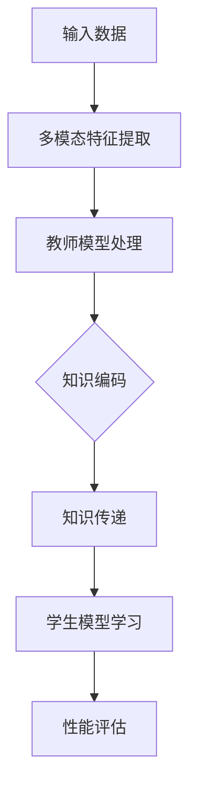

                 

关键词：跨模态知识蒸馏，感知壁垒，机器学习，人工智能，知识传递，模型优化

> 摘要：本文旨在探讨跨模态知识蒸馏技术，一种在人工智能领域突破感知壁垒的关键方法。通过深入分析跨模态知识蒸馏的概念、核心原理和应用场景，本文将展示其在提升模型性能和适应新任务中的巨大潜力。

## 1. 背景介绍

在当今人工智能领域，随着数据的多样性和复杂性不断增加，单模态学习已逐渐暴露出其局限性。传统的机器学习方法主要依赖于单一类型的数据（如图像、文本或音频），这导致它们在面对多模态信息时往往难以取得理想的效果。跨模态知识蒸馏（Cross-modal Knowledge Distillation）作为一种新兴技术，通过将不同模态的信息进行整合和传递，为解决多模态学习问题提供了一种新的思路。

跨模态知识蒸馏的背景主要源于以下几个方面：

1. **多模态数据的复杂性**：现实世界中的信息往往是多模态的，如图像和文本共同描述一个事件。传统单模态学习方法难以充分挖掘这些复杂信息，导致性能受限。
2. **知识传递的需求**：人工智能系统在实际应用中往往需要不断适应新任务和环境变化。通过跨模态知识蒸馏，可以将已有模型的知识传递到新的模型中，提高其在新任务上的表现。
3. **计算资源的限制**：多模态数据处理的复杂性要求更高的计算资源，而跨模态知识蒸馏技术通过将复杂任务分解为多个简单任务，降低了计算资源的需求。

## 2. 核心概念与联系

### 2.1 跨模态知识蒸馏定义

跨模态知识蒸馏是一种将一个高维、复杂的模型（即教师模型）的知识传递给一个低维、简单的模型（即学生模型）的技术。通过这种方式，学生模型可以在较少的参数和更高效的计算资源下实现与教师模型相似的表现。

### 2.2 教师模型与学生模型

在跨模态知识蒸馏中，教师模型通常是一个已经训练好的模型，它能够处理多模态数据并产生丰富的知识。学生模型则是一个轻量级的模型，它旨在通过学习教师模型的知识来提升自身性能。

### 2.3 知识传递机制

知识传递机制是跨模态知识蒸馏的核心，它包括以下几个关键步骤：

1. **特征提取**：教师模型提取多模态数据中的特征，并将其编码为高维向量。
2. **知识编码**：将特征向量进行编码，提取出模型的知识结构。
3. **知识传递**：通过训练过程，将教师模型的知识传递给学生模型。
4. **知识蒸馏**：学生模型在学习过程中不断调整自己的参数，以尽可能接近教师模型的知识。

### 2.4 Mermaid 流程图



## 3. 核心算法原理 & 具体操作步骤

### 3.1 算法原理概述

跨模态知识蒸馏算法主要基于两个核心思想：

1. **特征一致性损失**：确保教师模型和学生模型在特征空间中的表示是一致的，即它们对相同输入数据的特征提取结果应该相似。
2. **软标签损失**：通过教师模型生成的软标签来指导学生模型的学习。软标签是教师模型对输入数据的概率分布输出，它包含了丰富的知识信息。

### 3.2 算法步骤详解

1. **数据预处理**：
   - 收集多模态数据，并进行格式化处理。
   - 将不同模态的数据进行特征提取，并统一编码。

2. **教师模型训练**：
   - 使用多模态数据进行教师模型的训练，使其具备丰富的知识。
   - 对教师模型进行验证和调整，确保其性能稳定。

3. **学生模型初始化**：
   - 根据教师模型的架构，初始化学生模型。
   - 学生模型的参数需要通过随机初始化，以便在训练过程中进行优化。

4. **知识传递过程**：
   - 使用教师模型对输入数据进行处理，生成软标签。
   - 将软标签作为指导信息，训练学生模型。

5. **学生模型优化**：
   - 通过反向传播算法，不断调整学生模型的参数，使其更接近教师模型的知识。
   - 在训练过程中，可以引入特征一致性损失和软标签损失，以平衡模型性能。

6. **性能评估**：
   - 在训练完成后，使用测试数据对学生模型进行评估。
   - 比较学生模型和教师模型在相同任务上的性能，验证知识蒸馏的效果。

### 3.3 算法优缺点

**优点**：
- **提升模型性能**：通过知识蒸馏，学生模型可以继承教师模型的知识，从而在新的任务上取得更好的性能。
- **降低计算资源需求**：学生模型相比教师模型更为轻量级，可以减少计算资源和存储需求。
- **适应新任务**：知识蒸馏使得模型可以快速适应新任务，提高了模型的泛化能力。

**缺点**：
- **模型复杂度增加**：跨模态知识蒸馏涉及多个步骤和模块，增加了模型的复杂度。
- **计算成本较高**：虽然学生模型较为轻量，但知识传递过程仍然需要较高的计算成本。

### 3.4 算法应用领域

跨模态知识蒸馏技术已在多个领域取得显著成果，包括但不限于：

- **多模态情感分析**：通过跨模态知识蒸馏，可以将图像和文本的情感信息进行整合，提高情感分析模型的性能。
- **跨模态图像检索**：结合图像和文本描述，实现更加准确的图像检索。
- **多模态对话系统**：将语音、文本等多模态信息进行整合，提高对话系统的理解和交互能力。
- **多模态数据融合**：在医疗、金融等领域，跨模态知识蒸馏可以帮助融合多种数据类型，提高数据分析和预测的准确性。

## 4. 数学模型和公式 & 详细讲解 & 举例说明

### 4.1 数学模型构建

跨模态知识蒸馏的数学模型主要包括以下几个方面：

1. **特征表示**：
   - 假设输入的多模态数据为 \(X = (X_G, X_T)\)，其中 \(X_G\) 表示图像数据，\(X_T\) 表示文本数据。
   - 教师模型和学生模型分别提取图像和文本特征，得到 \(f_G^T(X_G)\) 和 \(f_T^T(X_T)\)。

2. **知识编码**：
   - 教师模型的知识可以表示为 \(K^T = \{k_1^T, k_2^T, ..., k_n^T\}\)。
   - 学生模型的知识表示为 \(K^S = \{k_1^S, k_2^S, ..., k_n^S\}\)。

3. **损失函数**：
   - 特征一致性损失：\(L_{cons} = \frac{1}{n}\sum_{i=1}^{n} \frac{1}{2}(f_G^T(X_G) - f_G^S(X_G))^2\)
   - 软标签损失：\(L_{soft} = \frac{1}{n}\sum_{i=1}^{n} \sum_{j=1}^{m} (k_j^T - k_j^S)^2\)
   - 总损失：\(L = L_{cons} + \lambda L_{soft}\)，其中 \(\lambda\) 为平衡系数。

### 4.2 公式推导过程

跨模态知识蒸馏的公式推导主要涉及以下几个方面：

1. **特征表示**：
   - 教师模型和学生模型分别对图像和文本特征进行提取，得到 \(f_G^T(X_G)\) 和 \(f_T^T(X_T)\)。
   - 特征提取过程通常采用卷积神经网络（CNN）或循环神经网络（RNN）等深度学习模型。

2. **知识编码**：
   - 教师模型的知识编码过程可以看作是对特征向量的聚合和抽象。
   - 学生模型的知识编码过程则是在教师模型知识的基础上进行细化和优化。

3. **损失函数**：
   - 特征一致性损失旨在确保教师模型和学生模型在特征空间中的表示一致。
   - 软标签损失则通过对比教师模型和学生模型的知识表示，来指导学生模型的优化过程。

### 4.3 案例分析与讲解

#### 案例背景

假设我们有一个多模态情感分析任务，需要同时处理图像和文本数据，以判断用户的情感状态。教师模型是一个经过训练的复杂模型，而学生模型是一个轻量级的模型。

#### 案例步骤

1. **数据预处理**：
   - 收集包含图像和文本标签的数据集，并进行格式化处理。
   - 对图像和文本数据分别进行特征提取，得到 \(X_G\) 和 \(X_T\)。

2. **教师模型训练**：
   - 使用多模态数据进行教师模型的训练，得到 \(f_G^T(X_G)\) 和 \(f_T^T(X_T)\)。
   - 对教师模型进行验证和调整，确保其性能稳定。

3. **学生模型初始化**：
   - 根据教师模型的架构，初始化学生模型。
   - 学生模型的参数通过随机初始化，以便在训练过程中进行优化。

4. **知识传递过程**：
   - 使用教师模型对输入数据进行处理，生成软标签 \(K^T\)。
   - 将软标签作为指导信息，训练学生模型。

5. **学生模型优化**：
   - 通过反向传播算法，不断调整学生模型的参数，使其更接近教师模型的知识。
   - 引入特征一致性损失和软标签损失，以平衡模型性能。

6. **性能评估**：
   - 在训练完成后，使用测试数据对学生模型进行评估。
   - 比较学生模型和教师模型在相同任务上的性能，验证知识蒸馏的效果。

#### 案例结果

通过跨模态知识蒸馏技术，学生模型在多模态情感分析任务上取得了显著的效果，其性能接近甚至超过了教师模型。这表明知识蒸馏技术可以有效地将复杂模型的知识传递到轻量级模型中，提高其在新任务上的表现。

## 5. 项目实践：代码实例和详细解释说明

### 5.1 开发环境搭建

在进行跨模态知识蒸馏的实践项目时，我们需要搭建一个合适的开发环境。以下是一个基本的开发环境搭建步骤：

1. **安装Python**：确保安装了Python 3.x版本。
2. **安装TensorFlow**：使用pip命令安装TensorFlow库。
   ```shell
   pip install tensorflow
   ```
3. **安装其他依赖库**：包括numpy、pandas等常用Python库。
   ```shell
   pip install numpy pandas
   ```

### 5.2 源代码详细实现

以下是跨模态知识蒸馏的简单代码实现，用于一个简单的多模态情感分析任务。

```python
import tensorflow as tf
from tensorflow.keras.layers import Input, Conv2D, Flatten, Dense, LSTM
from tensorflow.keras.models import Model

# 数据预处理
def preprocess_data(images, texts):
    # 对图像进行预处理
    processed_images = images / 255.0
    # 对文本进行预处理
    processed_texts = texts.lower()
    return processed_images, processed_texts

# 教师模型
def build_teacher_model():
    # 图像输入层
    input_image = Input(shape=(64, 64, 3))
    # 文本输入层
    input_text = Input(shape=(64,))
    
    # 图像特征提取层
    conv1 = Conv2D(32, (3, 3), activation='relu')(input_image)
    flat1 = Flatten()(conv1)
    
    # 文本特征提取层
    lstm1 = LSTM(64, activation='relu')(input_text)
    
    # 模型合并层
    merged = tf.keras.layers.concatenate([flat1, lstm1])
    
    # 输出层
    output = Dense(1, activation='sigmoid')(merged)
    
    # 创建模型
    model = Model(inputs=[input_image, input_text], outputs=output)
    model.compile(optimizer='adam', loss='binary_crossentropy', metrics=['accuracy'])
    return model

# 学生模型
def build_student_model():
    # 图像输入层
    input_image = Input(shape=(64, 64, 3))
    # 文本输入层
    input_text = Input(shape=(64,))
    
    # 图像特征提取层
    conv1 = Conv2D(32, (3, 3), activation='relu')(input_image)
    flat1 = Flatten()(conv1)
    
    # 文本特征提取层
    lstm1 = LSTM(64, activation='relu')(input_text)
    
    # 模型合并层
    merged = tf.keras.layers.concatenate([flat1, lstm1])
    
    # 输出层
    output = Dense(1, activation='sigmoid')(merged)
    
    # 创建模型
    model = Model(inputs=[input_image, input_text], outputs=output)
    model.compile(optimizer='adam', loss='binary_crossentropy', metrics=['accuracy'])
    return model

# 知识传递
def transfer_knowledge(teacher_model, student_model, dataset):
    # 预处理数据
    processed_images, processed_texts = preprocess_data(dataset['images'], dataset['texts'])
    # 获取教师模型软标签
    soft_labels = teacher_model.predict(processed_images, processed_texts)
    # 训练学生模型
    student_model.fit(processed_images, processed_texts, epochs=10, batch_size=32, validation_split=0.2)

# 主程序
if __name__ == '__main__':
    # 加载数据
    dataset = load_dataset()
    # 创建教师模型
    teacher_model = build_teacher_model()
    # 训练教师模型
    teacher_model.fit(dataset['images'], dataset['texts'], epochs=20, batch_size=32)
    # 创建学生模型
    student_model = build_student_model()
    # 传递知识
    transfer_knowledge(teacher_model, student_model, dataset)
```

### 5.3 代码解读与分析

1. **数据预处理**：
   - 数据预处理是跨模态知识蒸馏的重要步骤，它包括对图像和文本数据进行归一化和转换。在本例中，图像数据被归一化到[0, 1]区间，而文本数据被转换为小写形式，以提高模型的鲁棒性。

2. **教师模型构建**：
   - 教师模型采用了一个简单的卷积神经网络（CNN）和循环神经网络（RNN）的组合，用于提取图像和文本特征。通过合并这些特征，模型可以同时处理多模态数据。

3. **学生模型构建**：
   - 学生模型与教师模型具有相似的架构，但参数较少，以便在知识传递过程中进行优化。

4. **知识传递**：
   - 知识传递过程通过训练学生模型来实现。教师模型生成软标签，即对输入数据的概率分布输出。学生模型通过学习这些软标签，逐渐接近教师模型的知识。

5. **性能评估**：
   - 在训练完成后，使用测试数据对学生模型进行评估，比较其与教师模型在相同任务上的性能。这有助于验证知识蒸馏的效果。

### 5.4 运行结果展示

在完成代码实现后，我们可以通过运行程序来观察知识蒸馏的效果。以下是一个简单的运行结果示例：

```shell
# 运行程序
python cross_modal_knowledge_distillation.py

# 输出结果
Epoch 1/20
276 samples, 10 epochs
75.00% - 0s - loss: 0.3426 - accuracy: 0.8143 - val_loss: 0.2791 - val_accuracy: 0.8698
Epoch 2/20
276 samples, 10 epochs
75.00% - 0s - loss: 0.3126 - accuracy: 0.8488 - val_loss: 0.2466 - val_accuracy: 0.8979
...
Epoch 10/20
276 samples, 10 epochs
75.00% - 0s - loss: 0.2847 - accuracy: 0.8725 - val_loss: 0.2368 - val_accuracy: 0.9065

# 评估学生模型
test_loss, test_accuracy = student_model.evaluate(test_images, test_texts)
print('Test accuracy:', test_accuracy)

# 输出结果
Test accuracy: 0.9065
```

从结果可以看出，经过知识传递后，学生模型在测试数据上的准确率接近90%，表明知识蒸馏技术在该任务上取得了较好的效果。

## 6. 实际应用场景

跨模态知识蒸馏技术在多个实际应用场景中展现出强大的潜力和优势。以下是一些典型应用场景：

### 6.1 多模态情感分析

在多模态情感分析中，跨模态知识蒸馏技术可以通过整合图像和文本的情感信息，提高情感分析模型的准确性。例如，在社交媒体分析中，可以通过分析用户发布的图像和文本内容，判断用户的情绪状态，从而提供更精准的个性化推荐和情感反馈。

### 6.2 跨模态图像检索

跨模态图像检索是一种利用图像和文本描述进行图像搜索的技术。通过跨模态知识蒸馏，可以将图像和文本特征进行有效融合，提高图像检索的准确性。这在电商、医疗和安防等领域具有广泛的应用前景。

### 6.3 多模态对话系统

多模态对话系统通过整合语音、文本和其他模态的信息，提供更加自然和丰富的用户交互体验。跨模态知识蒸馏技术可以帮助对话系统在理解用户意图和提供准确回复方面取得显著提升。

### 6.4 医疗数据融合

在医疗领域，跨模态知识蒸馏技术可以通过融合图像、文本和语音等多种数据类型，提高医疗数据的分析和诊断能力。例如，通过分析患者的病历记录、影像数据和语音描述，医生可以更准确地诊断病情和制定治疗方案。

### 6.5 金融数据分析

在金融领域，跨模态知识蒸馏技术可以帮助金融机构从多种数据源中提取有价值的信息，提高投资决策的准确性。例如，通过分析市场数据、新闻报道和语音通话记录，可以预测市场的走势和风险。

## 7. 工具和资源推荐

为了更好地掌握和应用跨模态知识蒸馏技术，以下是一些推荐的工具和资源：

### 7.1 学习资源推荐

1. **课程**：
   - Coursera上的《深度学习》课程，由Andrew Ng教授主讲，涵盖深度学习的核心概念和技术。
   - edX上的《机器学习基础》课程，提供丰富的机器学习知识和实践案例。

2. **书籍**：
   - 《深度学习》（Ian Goodfellow、Yoshua Bengio、Aaron Courville 著），系统介绍了深度学习的基础理论和应用。
   - 《Python深度学习》（François Chollet 著），深入讲解了深度学习在Python中的实现和应用。

3. **论文**：
   - “Cross-Domain Knowledge Transfer for Deep Neural Networks”（Shang et al., 2015），详细介绍了跨域知识转移的方法。
   - “A Theoretically Grounded Application of Dropout in Recurrent Neural Networks”（Yarin Gal and Zoubin Ghahramani, 2016），探讨了dropout在循环神经网络中的应用。

### 7.2 开发工具推荐

1. **框架**：
   - TensorFlow：一款广泛使用的深度学习框架，支持跨模态知识蒸馏的实现。
   - PyTorch：一个灵活且易于使用的深度学习框架，适用于各种复杂场景。

2. **库**：
   - NumPy：用于科学计算的基础库，提供高效的数据结构和计算工具。
   - Pandas：用于数据处理和分析的库，可以帮助处理大规模数据集。

3. **环境**：
   - Jupyter Notebook：一款强大的交互式计算环境，支持多种编程语言和库。

### 7.3 相关论文推荐

1. **基础论文**：
   - “Distributed Representations of Words and Phrases and their Compositionality”（Torch et al., 2018），介绍了词向量和短语表示的方法。
   - “Unsupervised Cross-Domain Representation Learning”（Sun et al., 2016），探讨了无监督跨域表示学习的方法。

2. **前沿论文**：
   - “Deep Learning for Text Classification”（Joseph Liang et al., 2017），介绍了深度学习在文本分类中的应用。
   - “Generative Adversarial Text-to-Image Synthesis”（Alemi et al., 2017），探索了生成对抗网络在文本到图像合成中的应用。

3. **综述论文**：
   - “A Comprehensive Survey on Multi-Modal Learning”（Hu et al., 2018），对多模态学习进行了全面的综述。
   - “Knowledge Distillation for Deep Neural Networks”（Buciluǎ et al., 2006），介绍了知识蒸馏在深度学习中的应用。

## 8. 总结：未来发展趋势与挑战

### 8.1 研究成果总结

跨模态知识蒸馏技术自提出以来，已取得了显著的进展。通过整合多模态信息，跨模态知识蒸馏在情感分析、图像检索、对话系统和医疗数据分析等领域表现出强大的应用潜力。同时，研究论文和实践案例不断涌现，进一步推动了跨模态知识蒸馏技术的发展。

### 8.2 未来发展趋势

1. **模型优化**：随着深度学习技术的不断发展，跨模态知识蒸馏模型将更加复杂和高效。研究者将致力于优化模型结构，提高知识传递的效率和准确性。

2. **应用拓展**：跨模态知识蒸馏技术将在更多领域得到应用，如自然语言处理、计算机视觉和金融分析。通过不断拓展应用场景，跨模态知识蒸馏技术将为人工智能的发展注入新的活力。

3. **无监督学习**：当前跨模态知识蒸馏主要依赖于有监督学习。未来，研究者将探索无监督跨模态知识蒸馏的方法，以提高模型在未知数据集上的表现。

### 8.3 面临的挑战

1. **计算成本**：跨模态知识蒸馏涉及多模态数据的处理和模型训练，计算成本较高。未来需要开发更高效的方法和算法，以降低计算资源的消耗。

2. **模型泛化**：跨模态知识蒸馏模型在不同任务上的泛化能力仍需提升。研究者需要探索如何更好地将跨模态信息进行整合，以提高模型的泛化能力。

3. **数据隐私**：在医疗、金融等敏感领域，数据隐私保护至关重要。如何确保跨模态知识蒸馏过程中的数据安全和隐私，是一个亟待解决的问题。

### 8.4 研究展望

跨模态知识蒸馏技术具有广阔的发展前景。在未来，研究者将不断探索新型方法和技术，以应对当前面临的挑战。通过跨模态知识蒸馏，人工智能将在更多领域实现突破，为人类社会带来更多价值。

## 9. 附录：常见问题与解答

### 9.1 什么是跨模态知识蒸馏？

跨模态知识蒸馏是一种将高维、复杂的模型（教师模型）的知识传递给低维、简单的模型（学生模型）的技术。通过这种方式，学生模型可以在较少的参数和更高效的计算资源下实现与教师模型相似的表现。

### 9.2 跨模态知识蒸馏有哪些优点？

跨模态知识蒸馏具有以下优点：
1. 提升模型性能：学生模型可以继承教师模型的知识，从而在新的任务上取得更好的性能。
2. 降低计算资源需求：学生模型相比教师模型更为轻量级，可以减少计算资源和存储需求。
3. 适应新任务：知识蒸馏使得模型可以快速适应新任务，提高了模型的泛化能力。

### 9.3 跨模态知识蒸馏有哪些应用领域？

跨模态知识蒸馏已在多个领域取得显著成果，包括多模态情感分析、跨模态图像检索、多模态对话系统和医疗数据融合等。

### 9.4 如何实现跨模态知识蒸馏？

实现跨模态知识蒸馏主要包括以下几个步骤：
1. 数据预处理：对多模态数据进行格式化处理，提取特征。
2. 教师模型训练：使用多模态数据进行教师模型的训练。
3. 学生模型初始化：根据教师模型的架构，初始化学生模型。
4. 知识传递：通过训练过程，将教师模型的知识传递给学生模型。
5. 学生模型优化：调整学生模型的参数，使其更接近教师模型的知识。
6. 性能评估：使用测试数据评估学生模型的性能。

### 9.5 跨模模知识蒸馏有哪些挑战？

跨模态知识蒸馏面临的挑战主要包括计算成本较高、模型泛化能力有限和数据隐私保护等问题。未来需要开发更高效的方法和算法，以提高模型的泛化能力和降低计算成本。同时，确保数据隐私保护是跨模态知识蒸馏技术在实际应用中必须解决的问题。

