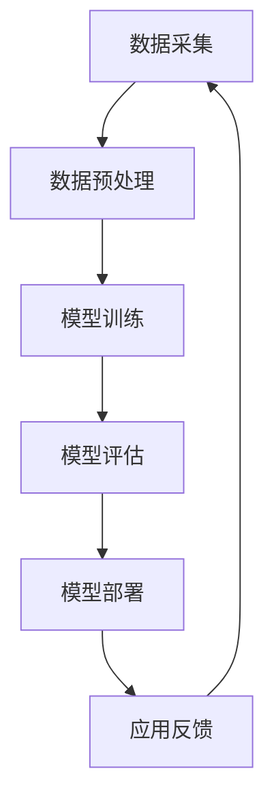

                 

关键词：AI解决方案、垂直领域、Lepton AI、跨行业应用、技术拓展

> 摘要：本文深入探讨了Lepton AI在跨行业应用中的解决方案，分析了其垂直领域拓展的核心概念、算法原理、数学模型、实践案例以及未来展望。通过详细阐述Lepton AI在各个行业的应用场景，本文旨在为人工智能技术的研究与应用提供新的视角和思路。

## 1. 背景介绍

随着人工智能技术的飞速发展，AI已经在多个领域展现出了巨大的潜力和应用价值。然而，传统的AI解决方案往往在特定的领域内取得成功，跨行业的应用仍然面临诸多挑战。Lepton AI作为一个创新的AI框架，致力于通过垂直领域的拓展，为不同行业提供定制化的AI解决方案。

### 1.1 Lepton AI的概念

Lepton AI是一个基于深度学习和神经网络技术构建的AI框架。它具有高度的可定制性和灵活性，能够快速适应不同的业务场景和需求。Lepton AI的核心优势在于其模块化设计，可以轻松集成到现有的系统中，实现快速部署和规模化应用。

### 1.2 跨行业应用的重要性

跨行业应用是当前AI技术发展的重要趋势。不同行业的数据特点和业务流程各异，单一的AI解决方案难以满足多样化的需求。通过垂直领域的拓展，Lepton AI可以为各行各业提供定制化的AI服务，从而推动人工智能技术在各个领域的深入应用。

## 2. 核心概念与联系

为了更好地理解Lepton AI在垂直领域拓展中的应用，我们需要首先了解其核心概念和架构。以下是Lepton AI的核心概念原理及架构的Mermaid流程图：



### 2.1 数据采集

数据采集是AI解决方案的基础。Lepton AI通过多种数据源进行数据采集，包括结构化数据、非结构化数据和实时数据等。这一过程需要确保数据的质量和多样性，以满足模型训练的需求。

### 2.2 数据预处理

数据预处理是确保数据质量的重要步骤。Lepton AI采用了一系列数据清洗和特征提取技术，包括缺失值填充、异常值处理、数据标准化和特征工程等，以提高数据的质量和模型的性能。

### 2.3 模型训练

模型训练是Lepton AI的核心环节。通过深度学习和神经网络技术，Lepton AI可以自动从数据中学习特征，并构建预测模型。训练过程采用了一系列优化算法，如梯度下降、Adam优化器等，以提高模型的收敛速度和精度。

### 2.4 模型评估

模型评估是验证模型性能的重要步骤。Lepton AI采用多种评估指标，如准确率、召回率、F1分数等，对模型的性能进行全面的评估。评估过程可以帮助我们了解模型的优点和不足，为后续的优化提供依据。

### 2.5 模型部署

模型部署是将训练好的模型应用到实际业务场景中的关键步骤。Lepton AI支持多种部署方式，包括在线部署、离线部署和嵌入式部署等，以满足不同场景的需求。

### 2.6 应用反馈

应用反馈是持续优化AI解决方案的重要环节。通过收集用户反馈和业务数据，Lepton AI可以不断调整和优化模型，以实现更好的业务效果。

## 3. 核心算法原理 & 具体操作步骤

### 3.1 算法原理概述

Lepton AI的核心算法基于深度学习和神经网络技术。深度学习是一种通过多层神经网络对数据进行建模的方法，能够自动提取数据的特征并构建预测模型。神经网络则是由大量的神经元连接而成的计算模型，通过学习输入数据和输出数据之间的关系，实现数据的分类、回归和预测等功能。

### 3.2 算法步骤详解

1. **数据采集**：通过API接口、数据库连接等方式，从各种数据源采集数据。
2. **数据预处理**：对采集到的数据进行清洗、标准化和特征提取，生成适合模型训练的数据集。
3. **模型训练**：使用预处理后的数据集，通过深度学习算法训练神经网络模型。
4. **模型评估**：使用验证集对训练好的模型进行评估，调整模型参数以优化性能。
5. **模型部署**：将训练好的模型部署到生产环境中，进行实时预测和应用。
6. **应用反馈**：收集用户反馈和业务数据，对模型进行持续优化。

### 3.3 算法优缺点

**优点**：

- **高度可定制**：Lepton AI支持多种数据源和部署方式，能够满足不同业务场景的需求。
- **高效训练**：深度学习算法具有强大的学习能力，能够快速构建高质量的预测模型。
- **灵活扩展**：Lepton AI采用模块化设计，可以方便地集成到现有的系统中，实现快速部署和扩展。

**缺点**：

- **计算资源需求高**：深度学习算法的训练过程需要大量的计算资源和时间。
- **数据质量要求高**：数据质量对模型性能有重要影响，需要严格的数据清洗和预处理。
- **模型解释性差**：深度学习模型通常具有很高的预测性能，但模型内部的决策过程较为复杂，难以解释。

### 3.4 算法应用领域

Lepton AI可以应用于多个垂直领域，如金融、医疗、零售、制造等。以下是Lepton AI在部分领域的应用案例：

- **金融领域**：利用Lepton AI进行风险评估、股票预测、欺诈检测等。
- **医疗领域**：利用Lepton AI进行疾病诊断、治疗方案推荐、医学图像分析等。
- **零售领域**：利用Lepton AI进行客户行为分析、商品推荐、库存管理等。
- **制造领域**：利用Lepton AI进行生产优化、设备故障预测、质量检测等。

## 4. 数学模型和公式 & 详细讲解 & 举例说明

### 4.1 数学模型构建

Lepton AI的数学模型基于深度学习技术，其核心是多层神经网络。神经网络的基本结构包括输入层、隐藏层和输出层。输入层接收外部输入，隐藏层通过神经元之间的连接进行信息传递和计算，输出层产生最终的预测结果。

### 4.2 公式推导过程

多层神经网络的数学模型可以表示为：

$$
Y = f(Z)
$$

其中，$Y$表示输出层的结果，$Z$表示隐藏层的结果，$f$表示激活函数。隐藏层的结果可以表示为：

$$
Z = \sigma(W \cdot X + b)
$$

其中，$X$表示输入层的结果，$W$表示权重矩阵，$b$表示偏置项，$\sigma$表示激活函数。

### 4.3 案例分析与讲解

以一个简单的二分类问题为例，我们使用多层神经网络进行模型构建和训练。假设输入层有2个神经元，隐藏层有3个神经元，输出层有1个神经元。激活函数采用ReLU函数。

输入层：

$$
X = [x_1, x_2]
$$

隐藏层：

$$
Z = \sigma(W_1 \cdot X + b_1) = [z_1, z_2, z_3]
$$

输出层：

$$
Y = f(W_2 \cdot Z + b_2) = y
$$

其中，$W_1$和$W_2$分别为隐藏层和输出层的权重矩阵，$b_1$和$b_2$分别为隐藏层和输出层的偏置项。

### 4.4 案例分析与讲解（续）

假设我们有一个训练数据集，包含100个样本。每个样本有2个特征和1个标签。我们使用梯度下降算法进行模型训练。训练过程如下：

1. **初始化参数**：随机初始化权重矩阵$W_1$和$W_2$，以及偏置项$b_1$和$b_2$。
2. **前向传播**：对于每个训练样本，计算输入层、隐藏层和输出层的输出。
3. **计算损失函数**：使用均方误差（MSE）作为损失函数，计算预测值与真实值之间的误差。
4. **反向传播**：计算梯度，更新权重矩阵和偏置项。
5. **迭代训练**：重复步骤2-4，直到模型收敛或达到预设的训练次数。

## 5. 项目实践：代码实例和详细解释说明

### 5.1 开发环境搭建

在开始项目实践之前，我们需要搭建一个适合开发的环境。以下是开发环境的搭建步骤：

1. 安装Python环境（版本3.8以上）。
2. 安装TensorFlow库：`pip install tensorflow`。
3. 安装NumPy库：`pip install numpy`。
4. 安装Matplotlib库：`pip install matplotlib`。

### 5.2 源代码详细实现

以下是一个简单的Lepton AI项目实例，实现一个二分类问题。

```python
import tensorflow as tf
import numpy as np
import matplotlib.pyplot as plt

# 初始化参数
input_size = 2
hidden_size = 3
output_size = 1

# 随机生成训练数据
X = np.random.rand(100, input_size)
y = np.random.randint(0, 2, (100, 1))

# 定义模型结构
W1 = tf.Variable(np.random.randn(input_size, hidden_size), dtype=tf.float32)
b1 = tf.Variable(np.random.randn(hidden_size), dtype=tf.float32)
W2 = tf.Variable(np.random.randn(hidden_size, output_size), dtype=tf.float32)
b2 = tf.Variable(np.random.randn(output_size), dtype=tf.float32)

# 定义激活函数
sigma = tf.nn.relu

# 定义前向传播
def forward(x):
    z1 = sigma(tf.matmul(x, W1) + b1)
    z2 = tf.matmul(z1, W2) + b2
    return z2

# 定义损失函数和优化器
loss = tf.reduce_mean(tf.square(y - forward(X)))
optimizer = tf.optimizers.Adam()

# 定义训练过程
def train(X, y, epochs=1000):
    for epoch in range(epochs):
        with tf.GradientTape() as tape:
            predictions = forward(X)
            loss_value = loss(y, predictions)
        grads = tape.gradient(loss_value, [W1, b1, W2, b2])
        optimizer.apply_gradients(zip(grads, [W1, b1, W2, b2]))
        if epoch % 100 == 0:
            print(f"Epoch {epoch}, Loss: {loss_value.numpy()}")

# 训练模型
train(X, y)

# 预测结果
predictions = forward(X)
predictions = np.round(predictions.numpy())

# 绘制结果
plt.scatter(X[:, 0], X[:, 1], c=predictions[:, 0])
plt.xlabel("Feature 1")
plt.ylabel("Feature 2")
plt.show()
```

### 5.3 代码解读与分析

该示例代码实现了Lepton AI在二分类问题中的应用。代码主要包括以下几个部分：

1. **初始化参数**：定义输入层、隐藏层和输出层的神经元数量，以及权重矩阵和偏置项。
2. **定义模型结构**：使用TensorFlow构建多层神经网络模型。
3. **定义激活函数**：选择ReLU函数作为激活函数。
4. **定义前向传播**：实现前向传播过程，计算输入层、隐藏层和输出层的输出。
5. **定义损失函数和优化器**：选择均方误差作为损失函数，使用Adam优化器进行模型训练。
6. **定义训练过程**：实现模型训练过程，包括前向传播、损失函数计算、反向传播和权重更新。
7. **预测结果**：使用训练好的模型进行预测，并将结果绘制成图。

## 6. 实际应用场景

### 6.1 金融领域

在金融领域，Lepton AI可以应用于风险评估、股票预测、欺诈检测等。例如，利用Lepton AI进行股票预测，可以结合历史股价数据、市场情绪数据和宏观经济数据，构建预测模型，为投资者提供决策支持。

### 6.2 医疗领域

在医疗领域，Lepton AI可以应用于疾病诊断、治疗方案推荐、医学图像分析等。例如，利用Lepton AI进行疾病诊断，可以结合患者的病历数据、基因数据和生活习惯数据，构建预测模型，提高诊断准确率。

### 6.3 零售领域

在零售领域，Lepton AI可以应用于客户行为分析、商品推荐、库存管理等。例如，利用Lepton AI进行客户行为分析，可以结合用户的购买记录、浏览记录和搜索记录，构建预测模型，为商家提供精准营销策略。

### 6.4 制造领域

在制造领域，Lepton AI可以应用于生产优化、设备故障预测、质量检测等。例如，利用Lepton AI进行设备故障预测，可以结合设备的运行数据、维护记录和环境数据，构建预测模型，提前发现潜在故障，提高设备利用率。

## 7. 工具和资源推荐

### 7.1 学习资源推荐

- 《深度学习》（Ian Goodfellow、Yoshua Bengio、Aaron Courville 著）
- 《神经网络与深度学习》（邱锡鹏 著）
- 《机器学习实战》（Peter Harrington 著）

### 7.2 开发工具推荐

- TensorFlow
- PyTorch
- Keras

### 7.3 相关论文推荐

- "Deep Learning for Speech Recognition"（Google Research）
- "Deep Learning for Natural Language Processing"（Google Research）
- "Deep Learning for Computer Vision"（Facebook AI Research）

## 8. 总结：未来发展趋势与挑战

### 8.1 研究成果总结

Lepton AI在跨行业应用中展现了良好的性能和潜力。通过垂直领域的拓展，Lepton AI为不同行业提供了定制化的AI解决方案，推动了人工智能技术在各个领域的深入应用。

### 8.2 未来发展趋势

未来，Lepton AI将继续在深度学习和神经网络领域深耕，探索更多的应用场景。同时，随着计算能力的提升和数据规模的扩大，Lepton AI的性能和泛化能力有望进一步提升。

### 8.3 面临的挑战

尽管Lepton AI在跨行业应用中取得了显著成果，但仍面临一些挑战。首先，数据质量和计算资源的需求较高，如何有效管理和利用数据资源成为关键问题。其次，深度学习模型的可解释性较差，如何提高模型的可解释性，使其更加透明和可靠，也是一个重要的研究方向。

### 8.4 研究展望

未来，Lepton AI将继续在以下几个方面展开研究：

1. **优化模型结构**：探索更加高效和灵活的模型结构，提高模型性能和泛化能力。
2. **提升数据利用效率**：研究数据预处理和特征提取技术，提高数据利用效率，降低数据质量对模型性能的影响。
3. **增强模型可解释性**：研究模型可解释性方法，提高模型透明度和可靠性，为用户和决策者提供更好的理解和信任。

## 9. 附录：常见问题与解答

### 9.1 Lepton AI适用于哪些行业？

Lepton AI适用于多个行业，包括金融、医疗、零售、制造等。其高度可定制性和灵活性使其能够满足不同行业的需求。

### 9.2 如何提高Lepton AI模型的性能？

提高Lepton AI模型性能可以从以下几个方面入手：

1. **优化模型结构**：选择合适的模型结构，如深度、宽度和层类型等。
2. **增加训练数据**：增加训练数据量和多样性，提高模型泛化能力。
3. **调整超参数**：调整学习率、批次大小、正则化等超参数，优化模型性能。
4. **数据预处理**：提高数据质量，进行有效的数据清洗、标准化和特征提取。

### 9.3 如何保证Lepton AI模型的可解释性？

提高Lepton AI模型的可解释性可以从以下几个方面入手：

1. **模型选择**：选择具有较好可解释性的模型结构，如线性模型、决策树等。
2. **模型可视化**：通过可视化技术，如热力图、特征重要性等，展示模型内部的决策过程。
3. **特征工程**：进行有效的特征工程，选择具有明确业务含义的特征，提高模型可解释性。
4. **模型集成**：使用模型集成方法，如Bagging、Boosting等，提高模型整体的可解释性。 
----------------------------------------------------------------

以上就是本文的完整内容，希望对您在人工智能领域的研究和应用提供一些启示和帮助。作者：禅与计算机程序设计艺术 / Zen and the Art of Computer Programming。再次感谢您的阅读！


