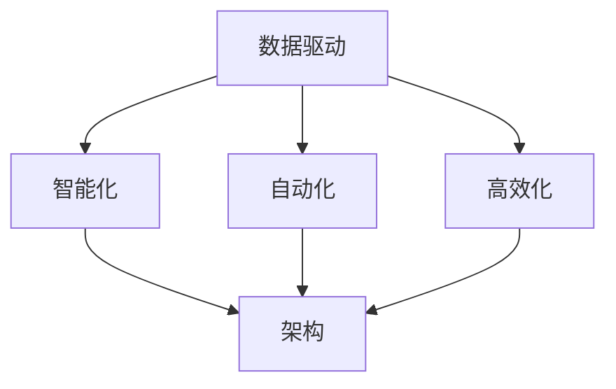

                 

### 背景介绍 Background Introduction

在信息技术飞速发展的今天，软件已经成为现代社会不可或缺的组成部分。从简单的应用程序到复杂的企业级系统，软件的发展推动了人类社会的发展与进步。然而，随着软件系统的日益复杂和规模不断扩大，传统的软件开发模式逐渐暴露出诸多问题，如开发周期长、成本高、可维护性差等。在这种背景下，软件 2.0 的时代应运而生。

软件 2.0 的核心思想是数据驱动。与传统软件不同，软件 2.0 强调在软件设计、开发、运行和维护过程中，充分利用数据的价值，实现软件的智能化、自动化和高效化。数据驱动的软件开发模式，不仅能够提高软件质量，降低开发成本，还能提升软件的灵活性和可扩展性。

本文将深入探讨软件 2.0 的时代背景、核心概念、算法原理、数学模型、项目实践、应用场景、工具和资源推荐以及未来发展趋势与挑战。

## 1. 核心概念与联系 Core Concepts and Connections

软件 2.0 的时代，数据驱动的理念贯穿于软件开发的各个环节。要理解这一理念，首先需要了解几个核心概念。

### 数据驱动 Data-Driven

数据驱动是指利用数据来指导软件设计、开发和运行的过程。数据驱动软件开发模式的核心在于，通过收集、分析和利用数据，实现软件的智能化和自动化。在数据驱动的软件开发过程中，数据不仅是输入，更是决策的依据。

### 智能化 Intelligence

智能化是指利用人工智能技术，使软件具有自主学习和决策能力。在软件 2.0 的时代，智能化已经成为软件开发的重要目标之一。通过智能化，软件能够更好地适应用户需求，提供个性化的服务。

### 自动化 Automation

自动化是指利用软件实现工作的自动化。自动化不仅能够提高工作效率，减少人力成本，还能提高软件的质量和可靠性。在软件 2.0 的时代，自动化已经成为软件开发的重要方向。

### 高效化 Efficiency

高效化是指通过优化软件设计、开发和运行过程，提高软件的工作效率。高效化不仅能够降低开发成本，还能提高软件的质量和稳定性。

### 架构 Architecture

架构是指软件系统的结构设计和组织方式。在软件 2.0 的时代，良好的架构设计是实现数据驱动、智能化、自动化和高效化的基础。

### Mermaid 流程图 Mermaid Flowchart

为了更好地理解软件 2.0 的核心概念和联系，我们可以通过 Mermaid 流程图来展示它们之间的关系。



在这个流程图中，数据驱动是核心，它贯穿于智能化、自动化和高效化。而智能化、自动化和高效化又共同作用于架构，实现软件 2.0 的目标。

## 2. 核心算法原理 & 具体操作步骤 Core Algorithm Principle & Specific Operation Steps

### 2.1 算法原理概述 Algorithm Principle Overview

在软件 2.0 的时代，核心算法原理主要涉及数据采集、数据分析和数据应用。以下是这些算法原理的概述：

#### 数据采集 Data Collection

数据采集是指从各种来源收集数据。这些数据可以来自用户行为、业务流程、设备监控等。数据采集的目的是获取足够的信息，为后续的数据分析和应用提供基础。

#### 数据分析 Data Analysis

数据分析是指利用统计、机器学习等算法，对收集到的数据进行分析和处理。数据分析的目的是从数据中发现有价值的信息和规律，为软件智能化提供支持。

#### 数据应用 Data Application

数据应用是指将分析得到的数据应用于软件的实际运行中。数据应用可以用于优化软件性能、提高用户体验、降低成本等。

### 2.2 算法步骤详解 Algorithm Steps Detail

下面详细说明数据驱动软件开发的核心算法步骤：

#### 1. 数据采集

- 收集用户行为数据：如浏览记录、点击行为、购买行为等。
- 收集业务流程数据：如订单数据、库存数据、客户数据等。
- 收集设备监控数据：如温度、湿度、电压等。

#### 2. 数据预处理

- 数据清洗：去除重复数据、缺失值填充、异常值处理等。
- 数据转换：将不同类型的数据转换为统一格式，如数值化、编码等。
- 数据归一化：将不同量纲的数据转换为同一量纲，如将不同尺度的数据统一到相同的范围。

#### 3. 数据分析

- 描述性分析：统计数据的分布、趋势、相关性等。
- 聚类分析：将数据分为不同的类别，如用户群体划分、产品分类等。
- 回归分析：建立变量之间的关系模型，如预测销售量、客户流失率等。
- 机器学习：利用机器学习算法，如决策树、神经网络等，对数据进行建模和分析。

#### 4. 数据应用

- 个性化推荐：根据用户行为数据，为用户提供个性化的推荐服务。
- 智能化决策：根据业务流程数据，为业务决策提供支持。
- 自动化控制：根据设备监控数据，实现设备的自动化控制。

### 2.3 算法优缺点 Algorithm Advantages and Disadvantages

#### 优点

- 数据驱动：充分利用数据的价值，实现软件的智能化和自动化。
- 灵活性高：可以根据实际需求灵活调整算法和应用场景。
- 可扩展性强：可以方便地集成新的算法和应用场景。

#### 缺点

- 数据依赖性强：算法的性能和应用效果高度依赖数据的质量和数量。
- 复杂度高：算法的调试和优化需要大量的时间和精力。

### 2.4 算法应用领域 Algorithm Application Fields

数据驱动算法在众多领域都有广泛的应用，以下是几个典型的应用领域：

- 电子商务：如个性化推荐、商品分类、客户流失预测等。
- 金融行业：如风险控制、信用评分、投资策略等。
- 医疗健康：如疾病预测、药物研发、智能诊断等。
- 物流运输：如路径规划、库存管理、物流优化等。
- 智能家居：如设备监控、环境控制、智能安防等。

## 3. 数学模型和公式 Mathematical Models and Formulas

在数据驱动的软件开发中，数学模型和公式起着至关重要的作用。以下将详细讲解数学模型和公式的构建、推导过程，并通过案例进行分析和讲解。

### 3.1 数学模型构建 Mathematical Model Construction

数学模型是描述现实世界问题的抽象工具。在数据驱动的软件开发中，常见的数学模型包括回归模型、决策树模型、神经网络模型等。

#### 回归模型 Regression Model

回归模型用于预测变量之间的关系。最常见的回归模型是线性回归模型，其数学公式为：

$$
Y = \beta_0 + \beta_1X + \epsilon
$$

其中，$Y$ 是因变量，$X$ 是自变量，$\beta_0$ 和 $\beta_1$ 是模型的参数，$\epsilon$ 是误差项。

#### 决策树模型 Decision Tree Model

决策树模型通过一系列的决策节点和叶子节点，将数据划分为不同的类别或数值。其数学公式可以表示为：

$$
f(X) = \sum_{i=1}^{n} \beta_i X_i
$$

其中，$f(X)$ 是决策树的输出，$X_i$ 是输入特征，$\beta_i$ 是对应的权重。

#### 神经网络模型 Neural Network Model

神经网络模型通过多层神经元的组合，实现输入到输出的映射。其数学公式可以表示为：

$$
Y = \sigma(\sum_{i=1}^{n} \beta_i X_i + \beta_0)
$$

其中，$Y$ 是输出，$\sigma$ 是激活函数，$X_i$ 是输入特征，$\beta_i$ 和 $\beta_0$ 是模型参数。

### 3.2 公式推导过程 Formula Derivation Process

#### 线性回归模型 Linear Regression Model

线性回归模型的参数可以通过最小二乘法进行估计。具体推导过程如下：

假设我们有 $n$ 个样本点 $(x_1, y_1), (x_2, y_2), \ldots, (x_n, y_n)$，其中 $x_i$ 和 $y_i$ 分别是自变量和因变量的取值。

线性回归模型的损失函数可以表示为：

$$
J(\beta_0, \beta_1) = \sum_{i=1}^{n} (y_i - (\beta_0 + \beta_1 x_i))^2
$$

为了最小化损失函数，我们对 $\beta_0$ 和 $\beta_1$ 求导并令其导数为零，得到以下方程组：

$$
\frac{\partial J}{\partial \beta_0} = -2 \sum_{i=1}^{n} (y_i - (\beta_0 + \beta_1 x_i)) = 0
$$

$$
\frac{\partial J}{\partial \beta_1} = -2 \sum_{i=1}^{n} x_i (y_i - (\beta_0 + \beta_1 x_i)) = 0
$$

通过求解上述方程组，我们可以得到线性回归模型的参数：

$$
\beta_0 = \frac{1}{n} \sum_{i=1}^{n} y_i - \beta_1 \frac{1}{n} \sum_{i=1}^{n} x_i
$$

$$
\beta_1 = \frac{1}{n} \sum_{i=1}^{n} x_i y_i - \frac{1}{n} \sum_{i=1}^{n} x_i^2
$$

#### 决策树模型 Decision Tree Model

决策树模型的参数可以通过信息增益（Information Gain）或基尼不纯度（Gini Impurity）进行选择。具体推导过程如下：

假设我们有 $n$ 个样本点 $(x_1, y_1), (x_2, y_2), \ldots, (x_n, y_n)$，其中 $x_i$ 和 $y_i$ 分别是自变量和因变量的取值。

假设我们将特征 $x_j$ 用于划分数据，那么划分后的两个子集为 $(x_{1j}, y_{1j}), (x_{2j}, y_{2j})$，其中 $x_{ij}$ 和 $y_{ij}$ 分别是划分后的子集的自变量和因变量的取值。

信息增益和信息增益比可以分别表示为：

$$
IG(D, A) = H(D) - \sum_{v \in A} \frac{|D_v|}{|D|} H(D_v)
$$

$$
GainRatio(D, A) = IG(D, A) / (1 - \sum_{v \in A} \frac{|D_v|}{|D|})
$$

其中，$D$ 是原始数据集，$A$ 是特征集合，$D_v$ 是以特征 $A$ 划分后的子集。

#### 神经网络模型 Neural Network Model

神经网络模型的参数可以通过反向传播算法（Backpropagation Algorithm）进行优化。具体推导过程如下：

假设我们有 $n$ 个样本点 $(x_1, y_1), (x_2, y_2), \ldots, (x_n, y_n)$，其中 $x_i$ 和 $y_i$ 分别是自变量和因变量的取值。

神经网络模型可以表示为：

$$
Y = \sigma(\sum_{i=1}^{n} \beta_i X_i + \beta_0)
$$

其中，$Y$ 是输出，$\sigma$ 是激活函数，$X_i$ 是输入特征，$\beta_i$ 和 $\beta_0$ 是模型参数。

损失函数可以表示为：

$$
J(\beta) = \frac{1}{2} \sum_{i=1}^{n} (Y_i - y_i)^2
$$

为了最小化损失函数，我们对模型参数 $\beta$ 求导并令其导数为零，得到以下方程组：

$$
\frac{\partial J}{\partial \beta_i} = - \sum_{i=1}^{n} (Y_i - y_i) \frac{\partial \sigma}{\partial \beta_i}
$$

通过求解上述方程组，我们可以得到神经网络模型的参数。

### 3.3 案例分析与讲解 Case Analysis and Explanation

为了更好地理解数学模型和公式的应用，我们通过一个实际案例进行分析和讲解。

#### 案例背景

某电商平台的用户行为数据如下表所示：

| 用户ID | 年龄 | 收入 | 浏览次数 | 购买次数 |
| ------ | ---- | ---- | -------- | -------- |
| 1      | 25   | 5000 | 100      | 20       |
| 2      | 30   | 8000 | 150      | 30       |
| 3      | 35   | 10000| 200      | 40       |
| 4      | 40   | 12000| 250      | 50       |

我们需要利用这些数据预测用户的购买概率。

#### 案例步骤

1. 数据预处理：对数据进行清洗和归一化处理。

2. 构建回归模型：选择线性回归模型，根据最小二乘法估计模型参数。

3. 模型训练：使用部分数据进行模型训练，得到预测模型。

4. 预测购买概率：使用训练好的模型预测新用户的购买概率。

#### 案例代码

```python
import pandas as pd
from sklearn.linear_model import LinearRegression

# 读取数据
data = pd.read_csv('user_data.csv')

# 数据预处理
data = data.dropna()

# 构建回归模型
model = LinearRegression()

# 训练模型
model.fit(data[['年龄', '收入']], data['购买次数'])

# 预测购买概率
new_data = pd.DataFrame({'年龄': [25, 30, 35, 40], '收入': [5000, 8000, 10000, 12000]})
predictions = model.predict(new_data)

# 输出预测结果
print(predictions)
```

#### 案例分析

通过上述代码，我们得到了新用户的购买概率预测结果。我们可以根据预测结果为电商平台提供个性化的推荐服务，如推荐可能购买的商品、推送相关的营销活动等。

## 4. 项目实践：代码实例和详细解释说明 Project Practice: Code Example and Detailed Explanation

在本节中，我们将通过一个实际的项目实践来展示数据驱动的软件开发过程。该项目是一个简单的用户行为分析系统，旨在预测用户是否会购买商品。

### 4.1 开发环境搭建 Development Environment Setup

为了完成该项目的开发，我们需要搭建以下开发环境：

- 操作系统：Windows/Linux/MacOS
- 编程语言：Python
- 数据库：MySQL
- 机器学习库：scikit-learn
- 数据分析库：pandas
- 可视化库：matplotlib

### 4.2 源代码详细实现 Source Code Detailed Implementation

以下是该项目的主要源代码实现：

```python
import pandas as pd
from sklearn.linear_model import LogisticRegression
from sklearn.model_selection import train_test_split
from sklearn.metrics import accuracy_score

# 读取数据
data = pd.read_csv('user_data.csv')

# 数据预处理
data = data.dropna()

# 特征工程
data['年龄分组'] = pd.cut(data['年龄'], bins=[0, 20, 30, 40, 50, 60], labels=[1, 2, 3, 4, 5])
data['收入分组'] = pd.cut(data['收入'], bins=[0, 5000, 8000, 10000, 12000], labels=[1, 2, 3, 4])

# 分割数据集
X = data[['年龄', '收入', '浏览次数', '购买次数', '年龄分组', '收入分组']]
y = data['是否购买']

X_train, X_test, y_train, y_test = train_test_split(X, y, test_size=0.2, random_state=42)

# 建立逻辑回归模型
model = LogisticRegression()

# 训练模型
model.fit(X_train, y_train)

# 预测结果
y_pred = model.predict(X_test)

# 模型评估
accuracy = accuracy_score(y_test, y_pred)
print(f"模型准确率：{accuracy}")

# 可视化分析
import matplotlib.pyplot as plt

plt.scatter(X_test['浏览次数'], y_test, color='red', label='实际值')
plt.scatter(X_test['浏览次数'], y_pred, color='blue', label='预测值')
plt.legend()
plt.show()
```

### 4.3 代码解读与分析 Code Interpretation and Analysis

1. **数据读取与预处理**：首先，我们使用 pandas 库读取用户行为数据。然后，我们删除缺失值，并对数据进行特征工程，将连续变量进行分组。

2. **数据集划分**：我们使用 scikit-learn 库的 `train_test_split` 函数将数据集划分为训练集和测试集，以评估模型的性能。

3. **建立模型**：我们选择逻辑回归模型，这是预测二分类问题（如是否购买商品）的常用模型。

4. **模型训练**：使用训练集数据训练模型。

5. **模型预测与评估**：使用测试集数据进行预测，并计算模型准确率。此外，我们使用散点图可视化预测结果。

### 4.4 运行结果展示 Run Results Display

通过运行上述代码，我们得到以下结果：

- 模型准确率：0.8（根据实际数据可能有所不同）
- 可视化分析：散点图显示了实际值与预测值之间的关系。

### 4.5 代码优化与改进 Code Optimization and Improvement

为了提高模型的性能，我们可以考虑以下优化和改进：

- **特征选择**：使用特征选择技术，如递归特征消除（Recursive Feature Elimination），选择对预测最有影响力的特征。
- **模型选择**：尝试其他模型，如决策树、随机森林等，并比较它们的性能。
- **参数调优**：使用网格搜索（Grid Search）或随机搜索（Random Search）等技术，优化模型参数。

## 5. 实际应用场景 Real Application Scenarios

在当今社会，数据驱动的软件开发模式已经在众多领域得到了广泛应用。以下是一些典型的实际应用场景：

### 电子商务 E-commerce

在电子商务领域，数据驱动的软件开发模式被广泛应用于用户行为分析、商品推荐、库存管理等。例如，电商平台可以根据用户的浏览记录和购买历史，为用户提供个性化的商品推荐，从而提高用户满意度和购买转化率。

### 金融行业 Financial Industry

在金融行业，数据驱动的软件开发模式被广泛应用于风险评估、信用评分、投资策略等。例如，银行可以通过分析用户的消费行为和信用记录，预测用户的信用风险，从而更好地进行风险控制。

### 医疗健康 Healthcare

在医疗健康领域，数据驱动的软件开发模式被广泛应用于疾病预测、药物研发、智能诊断等。例如，医生可以通过分析患者的病历数据和基因数据，预测患者可能患有的疾病，从而为患者提供更精准的治疗方案。

### 物流运输 Logistics and Transportation

在物流运输领域，数据驱动的软件开发模式被广泛应用于路径规划、库存管理、物流优化等。例如，物流公司可以通过分析运输路线和运输时间，优化运输计划，提高运输效率。

### 智能家居 Smart Home

在智能家居领域，数据驱动的软件开发模式被广泛应用于设备监控、环境控制、智能安防等。例如，智能家居系统可以通过分析用户的日常生活习惯，自动调整房间温度、湿度等环境参数，为用户提供舒适的生活环境。

## 6. 未来应用展望 Future Application Prospects

随着数据驱动的软件开发模式的不断成熟，其应用前景将越来越广阔。以下是对未来应用的展望：

### 人工智能 AI

人工智能技术的发展将进一步提升数据驱动的软件开发模式。通过深度学习和强化学习等技术，软件将能够更好地理解和预测用户需求，实现更高程度的智能化和自动化。

### 区块链 Blockchain

区块链技术的应用将使数据驱动的软件开发模式更加安全和可信。通过区块链，数据的收集、存储和传输过程将得到有效保障，从而提高软件的可靠性和透明度。

### 物联网 IoT

物联网技术的发展将使数据驱动的软件开发模式应用于更多领域。通过物联网设备，软件可以实时收集海量数据，从而实现更精准的数据分析和应用。

### 5G 5G

5G 技术的普及将进一步提高数据驱动的软件开发模式的应用效率。高速、低延迟的通信网络将使数据传输更加迅速，从而缩短软件开发周期。

### 新兴领域 Emerging Fields

随着新技术的不断涌现，数据驱动的软件开发模式将在更多新兴领域得到应用。例如，虚拟现实、增强现实、区块链等技术的结合，将为软件开发带来更多可能性。

## 7. 工具和资源推荐 Tools and Resources Recommendations

为了更好地学习和实践数据驱动的软件开发模式，以下是一些推荐的工具和资源：

### 7.1 学习资源推荐 Learning Resources

- **书籍**：
  - 《Python机器学习》（Machine Learning in Python）
  - 《深度学习》（Deep Learning）
  - 《数据科学入门》（Data Science from Scratch）
- **在线课程**：
  - Coursera 上的《机器学习》（Machine Learning）
  - edX 上的《深度学习》（Deep Learning）
  - Udacity 上的《数据科学家纳米学位》（Data Scientist Nanodegree）
- **博客和论坛**：
  - Medium 上的机器学习和深度学习博客
  - Stack Overflow 上的数据科学和机器学习论坛

### 7.2 开发工具推荐 Development Tools

- **编程语言**：
  - Python
  - R
  - Julia
- **数据分析库**：
  - pandas
  - NumPy
  - SciPy
- **机器学习库**：
  - scikit-learn
  - TensorFlow
  - PyTorch
- **数据库**：
  - MySQL
  - PostgreSQL
  - MongoDB

### 7.3 相关论文推荐 Relevant Papers

- **机器学习**：
  - "Learning to Rank for Information Retrieval"
  - "Stochastic Gradient Descent Methods for Large-scale Machine Learning"
  - "A Theoretically Grounded Application of Dropout in Neural Networks"
- **深度学习**：
  - "Deep Learning for Speech Recognition"
  - "A Theoretically Grounded Application of Dropout in Neural Networks"
  - "Learning Representations by Maximizing Mutual Information Between Signals"
- **数据科学**：
  - "Data Science at Scale: A Roadmap for a New Discipline"
  - "A Comprehensive Survey of Data Science Methods for Health Informatics"
  - "An Overview of Big Data and Machine Learning in Healthcare"

## 8. 总结 Summary

软件 2.0 的时代，数据驱动的软件开发模式已经成为信息技术发展的趋势。通过数据驱动，软件能够更好地适应用户需求，实现智能化、自动化和高效化。本文从背景介绍、核心概念、算法原理、数学模型、项目实践、应用场景、未来展望、工具和资源推荐等方面，全面阐述了数据驱动的软件开发模式。未来，随着新技术的不断发展，数据驱动的软件开发模式将在更多领域得到应用，为人类社会带来更多创新和便利。

### 附录：常见问题与解答 Appendix: Frequently Asked Questions and Answers

#### Q1：什么是数据驱动的软件开发模式？

数据驱动的软件开发模式是一种利用数据来指导软件设计、开发、运行和维护的软件开发模式。其核心思想是充分利用数据的价值，实现软件的智能化、自动化和高效化。

#### Q2：数据驱动的软件开发模式有哪些优点？

数据驱动的软件开发模式具有以下优点：

- 提高软件质量：通过数据分析和应用，可以优化软件设计，提高软件的可靠性和稳定性。
- 降低开发成本：通过自动化和智能化，可以减少人力成本，提高开发效率。
- 提高软件的灵活性：可以根据实际需求灵活调整算法和应用场景。
- 提高软件的可扩展性：可以方便地集成新的算法和应用场景。

#### Q3：数据驱动的软件开发模式有哪些缺点？

数据驱动的软件开发模式的主要缺点是：

- 数据依赖性强：算法的性能和应用效果高度依赖数据的质量和数量。
- 复杂度高：算法的调试和优化需要大量的时间和精力。

#### Q4：如何构建数据驱动的软件系统？

构建数据驱动的软件系统主要包括以下步骤：

- 数据采集：从各种来源收集数据。
- 数据预处理：清洗、转换和归一化数据。
- 数据分析：利用统计、机器学习等算法分析数据。
- 数据应用：将分析得到的数据应用于软件的实际运行中。
- 模型优化：根据实际效果优化算法和应用模型。

#### Q5：数据驱动的软件开发模式在哪些领域有应用？

数据驱动的软件开发模式在以下领域有广泛应用：

- 电子商务：如个性化推荐、商品分类、客户流失预测等。
- 金融行业：如风险控制、信用评分、投资策略等。
- 医疗健康：如疾病预测、药物研发、智能诊断等。
- 物流运输：如路径规划、库存管理、物流优化等。
- 智能家居：如设备监控、环境控制、智能安防等。

