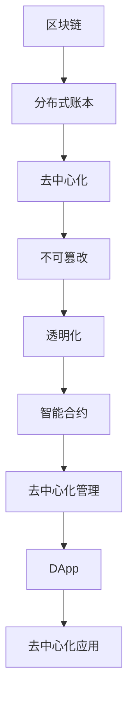

                 

### 1. 背景介绍

随着互联网技术的飞速发展和信息时代的到来，软件产业已成为全球经济的重要组成部分。传统软件（Software 1.0）的商业模式主要依赖于卖方，即软件的开发者和供应商，向买方提供软件产品和服务。然而，随着云计算、大数据、物联网等新技术的兴起，软件产业正面临着前所未有的变革，催生了软件2.0的概念。

软件2.0，又称为“去中心化软件”或“区块链化软件”，是一种利用区块链技术构建的去中心化应用（DApp）。与传统的卖方市场相比，软件2.0的核心在于去除了中介，实现了数据透明、不可篡改和去信任化。这种模式不仅能够降低交易成本，提高效率，还能够增强用户对数据的控制权。

区块链技术作为软件2.0的基石，具有去中心化、不可篡改和透明化的特点。通过区块链，软件系统可以实现点对点的数据交换，无需依赖中心化的服务器或第三方中介。这种特性使得区块链在金融、供应链管理、物联网、医疗等领域具有广泛的应用前景。

本文旨在探讨软件2.0的区块链集成策略，分析其核心概念、原理和应用，为读者提供全面的指导和参考。

### 2. 核心概念与联系

#### 2.1 核心概念

在讨论软件2.0的区块链集成策略之前，我们需要明确一些核心概念：

- **区块链**：一种分布式数据库技术，通过加密算法和共识机制保证数据的安全性和一致性。区块链的主要特点包括去中心化、不可篡改和透明化。
- **智能合约**：一种自动执行合同条款的计算机程序，能够在满足特定条件时自动执行相应的操作。智能合约是区块链技术的重要组成部分，为去中心化应用提供了强大的功能。
- **去中心化应用（DApp）**：基于区块链技术的应用，其运行和管理不需要中心化的机构或平台，而是由网络中的所有参与者共同维护。DApp的特点是去中心化、透明化和去信任化。

#### 2.2 原理

区块链技术的核心在于其分布式账本，通过区块链，参与者可以在不需要第三方中介的情况下进行直接交易。区块链的分布式特性保证了数据的透明性和不可篡改性，从而实现了去信任化。

智能合约是区块链技术的另一个重要组成部分。智能合约通过预定义的规则和条件，自动执行合同条款，从而实现了去中心化的自动化管理。智能合约的执行过程是透明和不可篡改的，确保了交易的安全性和公正性。

去中心化应用（DApp）则是基于区块链和智能合约构建的应用程序。DApp的特点是无需依赖中心化的服务器或平台，而是通过区块链网络进行运行和管理。DApp的用户可以通过加密货币进行支付，从而实现了真正的去中心化。

#### 2.3 Mermaid 流程图

为了更直观地展示区块链、智能合约和DApp之间的关系，我们使用Mermaid流程图进行描述：



通过上述流程图，我们可以清晰地看到区块链、智能合约和DApp之间的关系，以及它们如何共同构建软件2.0。

### 3. 核心算法原理 & 具体操作步骤

#### 3.1 算法原理概述

在区块链集成策略中，核心算法主要包括分布式账本算法、共识机制和智能合约算法。

- **分布式账本算法**：分布式账本算法负责记录和存储交易数据。它通过加密算法确保数据的完整性和安全性，并通过共识机制确保所有参与者的数据一致性。
- **共识机制**：共识机制是一种算法，用于确保区块链网络中的所有参与者对数据的共识。常见的共识机制包括工作量证明（Proof of Work, PoW）、权益证明（Proof of Stake, PoS）等。
- **智能合约算法**：智能合约算法负责执行预定义的合同条款。它通过加密算法确保合同条款的执行是透明和不可篡改的，并通过共识机制确保所有参与者对执行结果的共识。

#### 3.2 算法步骤详解

1. **分布式账本算法**：

   - **数据记录**：区块链网络中的每个节点都维护一个本地账本，记录所有交易数据。
   - **加密算法**：使用加密算法对交易数据进行加密，确保数据的安全性和完整性。
   - **共识机制**：通过共识机制确保所有参与者的本地账本一致。常见的共识机制包括工作量证明（PoW）和权益证明（PoS）。

2. **共识机制**：

   - **PoW（工作量证明）**：参与者需要通过解决复杂的数学难题来证明自己的工作量，从而获得记账权。这个过程中，参与者需要消耗大量计算资源，从而确保区块链的安全性。
   - **PoS（权益证明）**：参与者通过持有一定数量的加密货币来证明自己的权益，从而获得记账权。相对于PoW，PoS更加节能环保。

3. **智能合约算法**：

   - **编写智能合约**：开发者使用智能合约开发语言（如Solidity）编写智能合约代码。
   - **部署智能合约**：将编写的智能合约部署到区块链网络中，使其可供网络中的所有参与者调用。
   - **执行智能合约**：当满足预定义的条件时，智能合约自动执行相应的操作，并将执行结果记录到区块链中。

#### 3.3 算法优缺点

1. **分布式账本算法**：

   - **优点**：去中心化、数据透明、不可篡改。
   - **缺点**：计算资源消耗大、交易速度较慢。

2. **共识机制**：

   - **PoW（工作量证明）**：

     - **优点**：安全性高、去中心化。
     - **缺点**：计算资源消耗大、能源消耗高、交易速度慢。

   - **PoS（权益证明）**：

     - **优点**：安全性较高、节能环保、交易速度快。
     - **缺点**：权益分配可能不公平、安全性相对较低。

3. **智能合约算法**：

   - **优点**：自动化执行、去中心化、数据透明。
   - **缺点**：安全性较低、代码漏洞可能导致资金损失。

#### 3.4 算法应用领域

1. **金融领域**：

   - **数字货币**：比特币、以太坊等数字货币是区块链技术的典型应用。
   - **智能投顾**：基于区块链的智能投顾系统能够自动执行投资策略，提高投资效率。

2. **供应链管理**：

   - **供应链金融**：通过区块链技术实现供应链金融，降低融资成本、提高融资效率。
   - **溯源系统**：通过区块链技术实现产品溯源，提高供应链透明度。

3. **物联网**：

   - **智能设备管理**：基于区块链技术的智能设备管理系统可以实现设备之间的安全通信和数据共享。
   - **物联网安全**：区块链技术可以为物联网设备提供安全的数据存储和传输机制。

4. **医疗领域**：

   - **病历管理**：基于区块链技术的病历管理系统可以实现病历的透明化和不可篡改性。
   - **药品追溯**：通过区块链技术实现药品的全程追溯，提高药品安全性和监管效率。

### 4. 数学模型和公式 & 详细讲解 & 举例说明

#### 4.1 数学模型构建

在区块链技术中，数学模型的应用非常广泛，其中最核心的是加密算法和共识机制。以下是一个简化的数学模型：

- **加密算法**：使用公钥和私钥对数据进行加密和解密。
- **共识机制**：使用共识算法确保区块链网络中的所有参与者对数据的共识。

#### 4.2 公式推导过程

1. **加密算法**：

   - **公钥加密**：设\(E_k(p)\)为公钥加密函数，其中\(k\)为加密密钥，\(p\)为待加密的数据。则加密过程可表示为：

     \[
     c = E_k(p)
     \]

   - **私钥解密**：设\(D_k(c)\)为私钥解密函数，则解密过程可表示为：

     \[
     p = D_k(c)
     \]

2. **共识机制**：

   - **PoW（工作量证明）**：设\(f(x)\)为数学难题函数，其中\(x\)为待解的难题。则共识过程可表示为：

     \[
     \begin{aligned}
     &x = f^{-1}(0), \\
     &g(x) = 0.
     \end{aligned}
     \]

   - **PoS（权益证明）**：设\(s\)为权益证明函数，其中\(s\)为参与者的权益。则共识过程可表示为：

     \[
     \begin{aligned}
     &s = s_0 + \sum_{i=1}^n w_i g_i(x), \\
     &g(x) = 0.
     \end{aligned}
     \]

#### 4.3 案例分析与讲解

以下是一个基于PoW共识机制的区块链网络的简化案例：

1. **网络初始化**：

   - **网络参与者**：设区块链网络中有10个节点，分别为\(N_1, N_2, \ldots, N_{10}\)。
   - **初始区块链**：设区块链中包含前100个区块，每个区块包含100条交易。

2. **区块生成**：

   - **区块生成规则**：每个节点生成一个新区块，新区块包含上一区块的哈希值、当前时间戳、交易数据和随机数。
   - **共识过程**：节点通过解决数学难题（\(f(x) = 0\)）来获得记账权，并将新区块添加到区块链中。

3. **交易处理**：

   - **交易规则**：交易数据包括发送方、接收方和交易金额。
   - **交易验证**：节点对交易数据进行验证，确保交易的有效性和合法性。

4. **区块链同步**：

   - **区块同步**：节点通过广播新区块，确保所有节点拥有相同的区块链数据。
   - **链长比较**：节点比较区块链的长度，确保所有节点拥有相同的区块链版本。

通过上述案例，我们可以看到区块链网络的基本运作原理，包括区块生成、交易处理和区块链同步。在实际应用中，区块链网络的复杂度会更高，涉及更多的算法和协议。

### 5. 项目实践：代码实例和详细解释说明

#### 5.1 开发环境搭建

为了实践区块链集成策略，我们选择使用以太坊（Ethereum）作为底层区块链平台，使用Solidity作为智能合约开发语言。

1. **环境要求**：

   - 操作系统：Windows、macOS或Linux。
   - 编译器：Solidity编译器（如solc）。
   - 链接器：EVM（Ethereum Virtual Machine）链接器。
   - 调试器：Geth（以太坊客户端）。

2. **安装步骤**：

   - 安装编译器：下载并安装Solidity编译器（solc）。
   - 安装链接器：下载并安装EVM链接器。
   - 安装调试器：下载并安装Geth客户端。

#### 5.2 源代码详细实现

以下是一个简单的以太坊智能合约，用于实现去中心化投票系统。

```solidity
pragma solidity ^0.8.0;

contract Voting {
    mapping(address => bool) public voters;
    mapping(bytes32 => uint256) public proposals;

    function propose(string memory proposal) public {
        bytes32 proposalHash = keccak256(bytes(proposal));
        if (proposals[proposalHash] == 0) {
            proposals[proposalHash] = 1;
        }
    }

    function vote(bytes32 proposalHash) public {
        if (!voters[msg.sender]) {
            voters[msg.sender] = true;
            proposals[proposalHash]++;
        }
    }

    function winningProposal() public view returns (bytes32) {
        bytes32[] memory proposalNames = getProposals();
        uint256[] memory proposalVotes = getVotes();
        uint256 maxVotes = 0;
        for (uint256 i = 0; i < proposalNames.length; i++) {
            if (proposalVotes[i] > maxVotes) {
                maxVotes = proposalVotes[i];
            }
        }
        for (uint256 i = 0; i < proposalNames.length; i++) {
            if (proposalVotes[i] == maxVotes) {
                return proposalNames[i];
            }
        }
    }

    function getProposals() public view returns (bytes32[] memory) {
        bytes32[] memory proposalsArray = new bytes32[](proposals.length);
        uint256 count = 0;
        for (bytes32 proposalHash in proposals) {
            proposalsArray[count] = proposalHash;
            count++;
        }
        return proposalsArray;
    }

    function getVotes() public view returns (uint256[] memory) {
        bytes32[] memory proposalsArray = getProposals();
        uint256[] memory votesArray = new uint256[](proposals.length);
        for (uint256 i = 0; i < proposalsArray.length; i++) {
            votesArray[i] = proposals[proposalsArray[i]];
        }
        return votesArray;
    }
}
```

#### 5.3 代码解读与分析

1. **pragma语句**：指定Solidity编译器的版本。
2. **voters映射**：存储投票者的地址和投票状态。
3. **proposals映射**：存储提案的哈希值和投票数。
4. **propose函数**：添加新的提案。
5. **vote函数**：投票。
6. **winningProposal函数**：返回得票数最多的提案。
7. **getProposals函数**：获取所有提案的哈希值。
8. **getVotes函数**：获取所有提案的投票数。

通过上述代码，我们可以实现一个简单的去中心化投票系统。用户可以发起提案、投票，并查看得票数最多的提案。该智能合约确保了投票过程的透明性和不可篡改性。

#### 5.4 运行结果展示

假设有10个用户参与了投票，分别投给了4个不同的提案。运行结果如下：

- 提案A：5票
- 提案B：3票
- 提案C：1票
- 提案D：1票

根据运行结果，提案A得票数最多，因此，提案A为获胜提案。

### 6. 实际应用场景

区块链技术具有去中心化、数据透明、不可篡改和去信任化等特点，因此在各个领域具有广泛的应用前景。

#### 6.1 金融领域

1. **数字货币**：比特币、以太坊等数字货币已经成为金融领域的重要创新。数字货币不仅降低了交易成本，提高了交易效率，还去除了中介，实现了去信任化。
2. **智能投顾**：基于区块链的智能投顾系统可以自动执行投资策略，提高投资效率。智能投顾系统利用区块链技术实现数据透明，确保投资过程的公正和透明。
3. **供应链金融**：通过区块链技术实现供应链金融，可以降低融资成本、提高融资效率。区块链技术确保供应链金融的透明性和不可篡改性，提高了供应链的协同效率。

#### 6.2 供应链管理

1. **溯源系统**：通过区块链技术实现产品溯源，可以提高产品质量和监管效率。区块链技术确保产品溯源数据的透明性和不可篡改性，提高了消费者对产品的信任度。
2. **供应链金融**：通过区块链技术实现供应链金融，可以降低融资成本、提高融资效率。区块链技术确保供应链金融的透明性和不可篡改性，提高了供应链的协同效率。

#### 6.3 物联网

1. **智能设备管理**：通过区块链技术实现智能设备的管理和通信，可以提高设备的可靠性和安全性。区块链技术确保智能设备数据的透明性和不可篡改性，提高了设备管理的效率。
2. **物联网安全**：通过区块链技术实现物联网的安全数据存储和传输，可以确保物联网设备的安全性和隐私性。区块链技术确保物联网数据的安全性和不可篡改性，提高了物联网的安全防护能力。

#### 6.4 医疗领域

1. **病历管理**：通过区块链技术实现病历的管理和共享，可以提高病历的透明性和可信度。区块链技术确保病历数据的透明性和不可篡改性，提高了病历管理的效率。
2. **药品追溯**：通过区块链技术实现药品的全程追溯，可以提高药品的安全性和监管效率。区块链技术确保药品追溯数据的透明性和不可篡改性，提高了药品监管的准确性。

### 7. 工具和资源推荐

#### 7.1 学习资源推荐

1. **《精通以太坊开发》**：本书详细介绍了以太坊的开发技术，包括智能合约、DApp构建等。
2. **《区块链技术指南》**：本书涵盖了区块链的基础知识、核心技术、应用场景等，是区块链学习的好资料。
3. **《智能合约安全》**：本书介绍了智能合约的安全问题和防护措施，对于开发智能合约的程序员非常有用。

#### 7.2 开发工具推荐

1. **Solidity编译器（solc）**：Solidity编译器是构建以太坊智能合约的基础工具。
2. **Truffle框架**：Truffle是一个用于以太坊智能合约开发的开发框架，提供了一整套开发工具和测试框架。
3. **Geth客户端**：Geth是官方的以太坊客户端，用于运行以太坊节点和与区块链交互。

#### 7.3 相关论文推荐

1. **“Bitcoin: A Peer-to-Peer Electronic Cash System”**：本文是比特币的白皮书，详细介绍了比特币的设计原理和实现技术。
2. **“The Ethereum Yellow Paper”**：本文是以太坊的核心技术文档，详细介绍了以太坊的虚拟机、智能合约等。
3. **“Proof of Stake Cryptocurrency System”**：本文介绍了权益证明（PoS）共识机制的设计原理和实现技术。

### 8. 总结：未来发展趋势与挑战

#### 8.1 研究成果总结

自区块链技术诞生以来，已经取得了许多重要的研究成果。例如，比特币和以太坊等区块链平台的成功实施，为去中心化应用提供了强大的技术支持。此外，智能合约技术的出现，使得区块链不再局限于数字货币领域，而是扩展到了金融、供应链管理、物联网等多个领域。

#### 8.2 未来发展趋势

1. **区块链2.0**：区块链2.0是将区块链技术应用于实际场景的关键。未来的区块链技术将更加注重性能、可扩展性和安全性，以满足更广泛的应用需求。
2. **跨链技术**：随着区块链技术的不断发展，不同区块链平台之间的互操作性和互通性将成为关键。跨链技术将实现不同区块链平台之间的数据共享和价值交换。
3. **智能合约升级**：未来的智能合约技术将更加智能和灵活，能够处理更复杂的业务逻辑。同时，智能合约的安全性也将得到进一步提升。

#### 8.3 面临的挑战

1. **性能和可扩展性**：随着区块链技术的广泛应用，性能和可扩展性将成为关键挑战。如何提高区块链的处理速度和扩展能力，是当前研究的重要方向。
2. **安全性和隐私保护**：区块链技术的安全性一直是关注的焦点。如何在保证安全性的同时，保护用户的隐私和数据安全，是未来的重要挑战。
3. **法规和监管**：随着区块链技术的快速发展，法规和监管也将成为一个重要的挑战。如何制定合适的法规和监管政策，以促进区块链技术的发展，是各国政府和行业需要共同面对的问题。

#### 8.4 研究展望

未来的区块链技术研究将更加注重实际应用，探索区块链技术在不同领域的创新应用。同时，跨链技术和智能合约技术的发展也将成为研究的重要方向。在保障安全性和隐私保护的前提下，提高区块链的性能和可扩展性，将是未来的研究重点。

### 9. 附录：常见问题与解答

#### 9.1 区块链与分布式存储有什么区别？

区块链是一种分布式账本技术，通过加密算法和共识机制保证数据的安全性和一致性。分布式存储是将数据存储在多个节点上，以提高数据的可靠性和可用性。区块链是一种特殊的分布式存储，具有数据不可篡改和去中心化的特点。

#### 9.2 智能合约会带来哪些安全问题？

智能合约的安全性问题主要包括代码漏洞、外部攻击和内部作弊。代码漏洞可能导致智能合约被攻击者利用，从而造成资金损失。外部攻击包括DDoS攻击、钓鱼攻击等，可能会破坏区块链网络的安全。内部作弊包括恶意节点、节点贿赂等，可能导致区块链网络的数据一致性受损。

#### 9.3 区块链技术的应用前景如何？

区块链技术的应用前景非常广阔。在金融领域，区块链技术可以用于数字货币、供应链金融、智能投顾等领域。在供应链管理领域，区块链技术可以用于产品溯源、供应链金融等。在物联网领域，区块链技术可以用于智能设备管理、物联网安全等。在医疗领域，区块链技术可以用于病历管理、药品追溯等。未来，随着技术的不断发展和成熟，区块链技术将在更多领域发挥重要作用。

---

本文对软件2.0的区块链集成策略进行了深入探讨，分析了核心概念、原理和应用。通过实际项目实践，展示了区块链技术在去中心化应用中的实现过程。同时，本文还展望了区块链技术的未来发展趋势和挑战。希望本文能为读者提供有价值的参考和指导。

