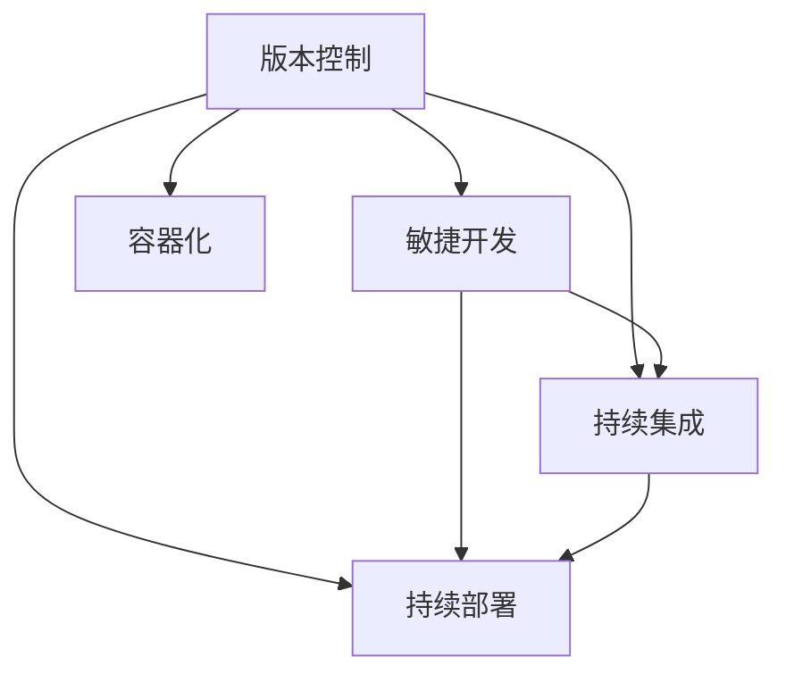

                 

关键词：软件2.0，发布管理，流程，版本控制，敏捷开发，持续集成，容器化，自动化测试，持续部署。

> 摘要：本文旨在探讨软件2.0时代下的发布管理流程，分析其在敏捷开发、持续集成、持续部署等现代软件开发实践中的应用，并提供具体的操作步骤和实用技巧，以帮助开发者更好地应对复杂的项目管理挑战。

## 1. 背景介绍

随着信息技术的发展，软件的复杂性和规模日益增加。传统的软件发布管理流程已经无法满足现代软件开发的需求，特别是在软件2.0时代，敏捷开发、持续集成、持续部署等现代软件开发实践的应用日益普及。软件2.0的发布管理流程，不仅是软件开发过程中的重要环节，也是保证软件质量和项目进度的重要保障。

### 1.1 软件2.0的定义

软件2.0是指从传统的单体应用向微服务架构、云原生应用等方向发展的过程。它强调软件的可扩展性、可维护性和可移植性，以及与云计算、大数据、人工智能等新兴技术的深度融合。

### 1.2 现代软件开发实践

现代软件开发实践包括敏捷开发、持续集成、持续部署等。这些实践强调快速反馈、持续改进和自动化，以提高软件质量和开发效率。

## 2. 核心概念与联系

在软件2.0的发布管理流程中，我们需要理解以下几个核心概念：版本控制、敏捷开发、持续集成、持续部署和容器化。

### 2.1 版本控制

版本控制是软件发布管理的基础，它能够帮助我们追踪代码的变更历史，确保代码的稳定性和一致性。常用的版本控制工具有Git、SVN等。

### 2.2 敏捷开发

敏捷开发强调快速迭代、持续交付和客户参与。通过敏捷开发，我们可以更好地适应需求的变化，提高开发效率。

### 2.3 持续集成

持续集成是一种软件开发实践，通过自动化构建和测试，确保代码的质量和稳定性。持续集成可以减少集成过程中的风险和问题。

### 2.4 持续部署

持续部署是将代码从开发环境部署到生产环境的过程。通过自动化部署，我们可以提高部署效率，减少人为错误。

### 2.5 容器化

容器化是一种轻量级的应用打包和部署技术，它可以提高软件的可移植性和可扩展性。常见的容器化技术有Docker、Kubernetes等。

下面是一个Mermaid流程图，展示了这些核心概念之间的关系：



## 3. 核心算法原理 & 具体操作步骤

### 3.1 算法原理概述

软件2.0的发布管理流程涉及多个算法和工具，包括Git的版本控制、Jenkins的持续集成和Kubernetes的持续部署等。

### 3.2 算法步骤详解

1. **版本控制：** 使用Git进行版本控制，确保代码的版本一致性和变更追踪。
2. **敏捷开发：** 使用Scrum等敏捷开发方法，进行快速迭代和持续交付。
3. **持续集成：** 使用Jenkins等工具，进行自动化构建和测试，确保代码的质量和稳定性。
4. **持续部署：** 使用Kubernetes等工具，实现自动化部署，提高部署效率。

### 3.3 算法优缺点

- **版本控制：** 优点是能够追踪代码的变更历史，确保代码的稳定性和一致性；缺点是初期设置较为复杂。
- **敏捷开发：** 优点是能够快速适应需求变化，提高开发效率；缺点是项目管理需要较强的组织和协调能力。
- **持续集成：** 优点是能够减少集成过程中的风险和问题，提高代码质量；缺点是自动化测试覆盖率需要较高。
- **持续部署：** 优点是能够提高部署效率，减少人为错误；缺点是部署过程中需要处理一些复杂的问题，如容错性和回滚等。

### 3.4 算法应用领域

软件2.0的发布管理流程广泛应用于互联网公司、金融科技、人工智能等领域，特别是那些需要快速迭代和持续交付的项目。

## 4. 数学模型和公式 & 详细讲解 & 举例说明

### 4.1 数学模型构建

在软件发布管理流程中，我们可以使用一些数学模型来衡量项目的进度、质量和风险。例如，我们可以使用WBS（工作分解结构）来分解项目任务，使用CPM（关键路径法）来计算项目完成时间，使用QFD（质量功能展开）来衡量项目质量。

### 4.2 公式推导过程

1. **WBS分解公式：** WBS分解公式为 $T(n) = \sum_{i=1}^{n} T(i)$，其中 $T(n)$ 表示第 $n$ 个任务的完成时间，$T(i)$ 表示第 $i$ 个子任务的完成时间。
2. **CPM计算公式：** CPM计算公式为 $T(n) = T(n-1) + T(n-2) + ... + T(1)$，其中 $T(n)$ 表示第 $n$ 个任务的完成时间。
3. **QFD衡量公式：** QFD衡量公式为 $Q = \frac{P - F}{P}$，其中 $Q$ 表示质量得分，$P$ 表示项目目标，$F$ 表示项目完成度。

### 4.3 案例分析与讲解

假设我们有一个项目，目标是在3个月内完成。我们使用WBS将项目分解为10个子任务，使用CPM计算关键路径，使用QFD衡量项目质量。

1. **WBS分解：** 子任务1需要2周完成，子任务2需要3周完成，...，子任务10需要1周完成。
2. **CPM计算：** 关键路径为子任务1、子任务2、...、子任务9、子任务10，总完成时间为 $T(10) = 2 + 3 + ... + 1 = 10$ 周。
3. **QFD衡量：** 项目目标为3个月，即12周，项目完成度为10周，质量得分为 $Q = \frac{12 - 10}{12} = \frac{1}{6}$。

通过以上案例，我们可以看到数学模型在软件发布管理流程中的应用，以及如何使用这些模型来评估项目的进度、质量和风险。

## 5. 项目实践：代码实例和详细解释说明

### 5.1 开发环境搭建

在开始项目实践之前，我们需要搭建一个开发环境。以下是一个基于Docker的Vue.js项目环境搭建示例：

```bash
# 安装Docker
brew install docker

# 启动Docker服务
sudo systemctl start docker

# 拉取Vue.js基础镜像
docker pull vuejs/vue-cli:latest

# 运行Vue.js项目
docker run -it --name my-vue-project -p 8080:80 vuejs/vue-cli /bin/bash
```

### 5.2 源代码详细实现

在Docker容器中，我们创建一个简单的Vue.js项目，并实现一个计数器功能：

```html
<!-- src/App.vue -->
<template>
  <div id="app">
    <h1>计数器</h1>
    <p>{{ count }}</p>
    <button @click="increment">增加</button>
    <button @click="decrement">减少</button>
  </div>
</template>

<script>
export default {
  data() {
    return {
      count: 0,
    };
  },
  methods: {
    increment() {
      this.count++;
    },
    decrement() {
      this.count--;
    },
  },
};
</script>
```

### 5.3 代码解读与分析

在这个Vue.js项目中，我们使用了Vue框架来实现一个简单的计数器功能。通过使用`data`属性来定义数据状态，使用`methods`属性来定义方法。在`template`标签中，我们使用了`{{ count }}`来显示当前计数器的值，并使用`@click`指令来绑定按钮点击事件。

### 5.4 运行结果展示

在Docker容器中运行Vue.js项目后，我们可以通过访问本地8080端口来查看项目运行结果。此时，我们会看到一个简单的计数器界面，可以通过点击“增加”和“减少”按钮来改变计数器的值。

## 6. 实际应用场景

软件2.0的发布管理流程在实际应用场景中具有广泛的应用，以下是一些实际应用场景：

- **互联网公司：** 互联网公司通常需要快速迭代和持续交付，以适应市场变化和客户需求。软件2.0的发布管理流程可以帮助互联网公司提高开发效率，确保软件质量和项目进度。
- **金融科技：** 金融科技公司需要处理大量数据和交易，软件2.0的发布管理流程可以帮助金融科技公司提高数据处理能力，确保交易的安全性和可靠性。
- **人工智能：** 人工智能领域的开发过程通常涉及大量实验和迭代，软件2.0的发布管理流程可以帮助人工智能团队提高实验效率，确保模型的质量和稳定性。

## 7. 工具和资源推荐

### 7.1 学习资源推荐

- 《敏捷软件开发：原则、模式与实践》
- 《持续集成：概念与实践》
- 《Docker实战》

### 7.2 开发工具推荐

- Git：版本控制工具
- Jenkins：持续集成工具
- Kubernetes：容器化部署工具
- Vue.js：前端框架

### 7.3 相关论文推荐

- "Continuous Delivery: Reliable Software Releases through Build, Test, and Deployment Automation"
- "Microservices: Designing Fine-Grained Systems"
- "Containerization of Applications: Best Practices and Common Mistakes"

## 8. 总结：未来发展趋势与挑战

### 8.1 研究成果总结

软件2.0的发布管理流程在敏捷开发、持续集成、持续部署等方面取得了显著的研究成果。这些研究成果为现代软件开发提供了有力的支持，提高了软件质量和开发效率。

### 8.2 未来发展趋势

随着云计算、大数据、人工智能等新兴技术的发展，软件2.0的发布管理流程将继续演进，如自动化程度更高、更智能的发布管理工具，以及更加细粒度的发布管理策略。

### 8.3 面临的挑战

虽然软件2.0的发布管理流程已经取得了显著成果，但仍然面临一些挑战，如复杂项目中的版本控制、持续集成和持续部署的协同工作，以及应对各种突发情况的能力。

### 8.4 研究展望

未来，软件2.0的发布管理流程将更加注重智能化、自动化和精细化，以满足日益复杂的软件开发需求。同时，跨领域、跨平台的发布管理流程研究也将成为重要方向。

## 9. 附录：常见问题与解答

### 9.1 问题1：如何确保持续集成和持续部署的自动化？

解答：确保持续集成和持续部署的自动化，可以通过以下方法：

1. 编写自动化脚本，用于构建、测试和部署代码。
2. 使用配置管理工具，如Ansible，进行环境配置和资源管理。
3. 使用容器化技术，如Docker，简化部署流程。

### 9.2 问题2：如何处理持续集成和持续部署中的异常情况？

解答：处理持续集成和持续部署中的异常情况，可以采取以下措施：

1. 设置报警机制，如使用Jenkins的邮件报警功能。
2. 在部署脚本中添加异常处理逻辑，如回滚部署。
3. 使用监控工具，如Prometheus，对系统运行状态进行实时监控。

### 9.3 问题3：如何选择合适的发布管理工具？

解答：选择合适的发布管理工具，可以从以下几个方面考虑：

1. 功能需求：根据项目需求选择具有相应功能的工具。
2. 用户体验：选择用户界面友好、易于操作的工具。
3. 社区支持：选择拥有活跃社区、丰富资源的工具。

以上是关于软件2.0的发布管理流程的详细分析和操作指南。通过本文，我们了解了软件2.0时代下的发布管理流程，包括版本控制、敏捷开发、持续集成、持续部署和容器化等方面的内容。希望本文对您的软件开发工作有所帮助。作者：禅与计算机程序设计艺术 / Zen and the Art of Computer Programming。
----------------------------------------------------------------


