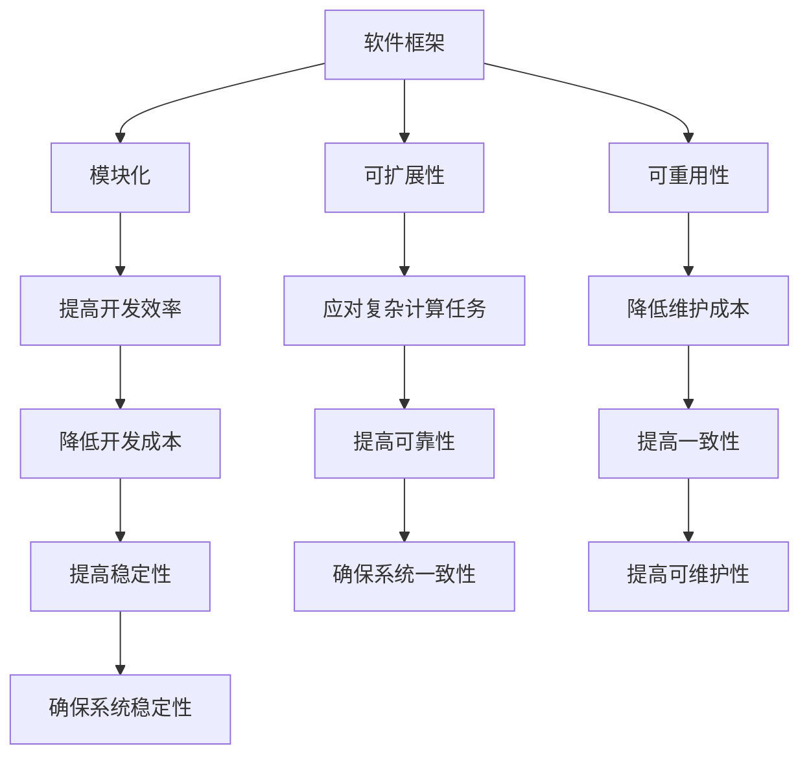

                 

关键词：软件框架，AI 2.0，开发，部署，运维，核心概念，算法原理，数学模型，项目实践，应用场景，未来展望

## 摘要

随着人工智能（AI）技术的飞速发展，AI 2.0 应用的开发、部署和运维面临着前所未有的挑战和机遇。本文旨在探讨如何构建一个支持 AI 2.0 应用的软件框架，从而实现高效的开发、部署和运维。文章首先介绍了软件框架的核心概念和架构，然后详细阐述了核心算法原理、数学模型和公式，并结合实际项目实践进行代码实例分析和解释。文章最后讨论了实际应用场景和未来发展趋势，并提出了一些工具和资源推荐，以期为 AI 2.0 应用的开发、部署和运维提供有益的指导。

## 1. 背景介绍

人工智能（AI）作为一门涉及计算机科学、统计学、神经科学等多个领域的交叉学科，自诞生以来便以其广泛的应用前景和深远的科学价值受到广泛关注。从最初的符号主义、连接主义到近年来迅猛发展的深度学习，AI 技术经历了多次变革和演进。随着计算能力的不断提升和大数据技术的广泛应用，人工智能进入了一个崭新的时代——AI 2.0。

AI 2.0 是指基于深度学习、增强学习、迁移学习等新兴技术的第二代人工智能。与传统的 AI 技术相比，AI 2.0 具有更高的智能水平、更强的适应能力和更广泛的应用范围。在 AI 2.0 时代，软件框架成为支持 AI 应用开发、部署和运维的核心。软件框架不仅能够提高开发效率，降低开发成本，还能够实现模块化、可扩展和可重用，从而提高系统的可靠性和稳定性。

本文旨在探讨如何构建一个支持 AI 2.0 应用的软件框架，从而实现高效的开发、部署和运维。文章将首先介绍软件框架的核心概念和架构，然后详细阐述核心算法原理、数学模型和公式，并结合实际项目实践进行代码实例分析和解释。文章最后将讨论实际应用场景和未来发展趋势，并提出一些工具和资源推荐，以期为 AI 2.0 应用的开发、部署和运维提供有益的指导。

## 2. 核心概念与联系

为了构建一个支持 AI 2.0 应用的软件框架，我们首先需要理解一些核心概念，包括软件框架、模块化、可扩展性、可重用性等。这些概念相互联系，共同构成了一个高效、稳定的软件框架。

### 2.1 软件框架

软件框架是一种为特定应用领域提供高效、稳定和可扩展解决方案的软件架构。它定义了应用程序的基本结构和组织方式，为开发者提供了统一的编程接口和开发工具。软件框架可以极大地提高开发效率，降低开发成本，并确保系统的一致性和稳定性。

### 2.2 模块化

模块化是将系统划分为若干独立、互操作的模块，每个模块实现特定的功能。模块化使得系统更加灵活、可扩展和可维护。在 AI 2.0 应用中，模块化有助于实现算法、数据和服务的解耦，从而提高系统的可靠性和可扩展性。

### 2.3 可扩展性

可扩展性是指系统能够根据需求变化进行水平或垂直扩展的能力。在 AI 2.0 应用中，可扩展性至关重要，因为 AI 应用往往需要处理大量数据和复杂的计算任务。一个具有良好可扩展性的软件框架可以轻松地应对这些挑战。

### 2.4 可重用性

可重用性是指系统组件可以在多个应用程序中重复使用，从而提高开发效率。在 AI 2.0 应用中，可重用性有助于减少重复开发工作，降低维护成本，并提高系统的可靠性。

### 2.5 核心概念与联系的 Mermaid 流程图

以下是一个 Mermaid 流程图，展示了核心概念之间的联系：



## 3. 核心算法原理 & 具体操作步骤

在构建支持 AI 2.0 应用的软件框架时，核心算法原理是关键。本节将介绍核心算法原理，并详细阐述其具体操作步骤。

### 3.1 算法原理概述

支持 AI 2.0 应用的软件框架通常基于以下核心算法原理：

1. **深度学习**：通过多层神经网络对数据进行自动特征提取和学习。
2. **迁移学习**：利用已有模型的知识迁移到新的任务中，提高模型泛化能力。
3. **增强学习**：通过与环境的交互学习最佳策略，实现智能决策。
4. **联邦学习**：通过分布式计算和隐私保护实现大规模协同学习。

### 3.2 算法步骤详解

以下是构建支持 AI 2.0 应用的软件框架的具体操作步骤：

#### 步骤 1：数据预处理

- 数据清洗：去除无效数据和异常值。
- 数据归一化：将数据映射到同一尺度，提高算法性能。
- 数据增强：通过旋转、缩放、裁剪等操作增加数据多样性。

#### 步骤 2：模型训练

- 选择合适的模型架构：如卷积神经网络（CNN）、循环神经网络（RNN）、生成对抗网络（GAN）等。
- 参数初始化：根据算法原理进行参数初始化。
- 模型训练：通过反向传播算法优化模型参数。

#### 步骤 3：模型评估

- 数据划分：将数据划分为训练集、验证集和测试集。
- 模型评估：使用验证集评估模型性能，选择最优模型。

#### 步骤 4：模型部署

- 模型导出：将训练完成的模型导出为可部署格式。
- 部署策略：根据应用场景选择合适的部署策略，如云端部署、边缘部署等。

#### 步骤 5：模型运维

- 模型监控：实时监控模型性能和资源消耗。
- 模型更新：根据模型表现和用户反馈进行模型更新。

### 3.3 算法优缺点

每种算法都有其优缺点，以下是对常见算法优缺点的简要概述：

#### 深度学习

优点：自动特征提取，高泛化能力，适合大规模数据处理。

缺点：训练过程耗时长，对数据质量要求高，模型解释性差。

#### 迁移学习

优点：利用已有模型知识，提高模型泛化能力。

缺点：对训练数据依赖性高，模型解释性差。

#### 增强学习

优点：通过与环境交互学习最佳策略，实现智能决策。

缺点：训练过程不稳定，对环境变化敏感。

#### 联邦学习

优点：分布式计算，隐私保护。

缺点：计算复杂度高，模型性能可能受影响。

### 3.4 算法应用领域

支持 AI 2.0 应用的软件框架广泛应用于以下领域：

- 人工智能助手：如智能客服、智能语音助手等。
- 自动驾驶：如车辆识别、路况分析等。
- 医疗诊断：如疾病预测、影像识别等。
- 金融风控：如欺诈检测、信用评估等。

## 4. 数学模型和公式 & 详细讲解 & 举例说明

在构建支持 AI 2.0 应用的软件框架时，数学模型和公式是核心组成部分。本节将介绍常见数学模型和公式，并进行详细讲解和举例说明。

### 4.1 数学模型构建

数学模型构建是 AI 2.0 应用的基础。以下是几种常见的数学模型：

#### 线性回归模型

线性回归模型是最基本的机器学习模型，用于预测一个连续值。其数学模型表示为：

$$y = \beta_0 + \beta_1x_1 + \beta_2x_2 + \cdots + \beta_nx_n$$

其中，$y$ 是预测值，$x_1, x_2, \cdots, x_n$ 是特征值，$\beta_0, \beta_1, \beta_2, \cdots, \beta_n$ 是模型参数。

#### 逻辑回归模型

逻辑回归模型是一种分类模型，用于预测一个二分类结果。其数学模型表示为：

$$P(y=1) = \frac{1}{1 + e^{-(\beta_0 + \beta_1x_1 + \beta_2x_2 + \cdots + \beta_nx_n)}}$$

其中，$P(y=1)$ 是预测概率，$\beta_0, \beta_1, \beta_2, \cdots, \beta_n$ 是模型参数。

#### 卷积神经网络（CNN）模型

卷积神经网络是一种深度学习模型，用于图像处理和识别。其数学模型表示为：

$$\text{激活函数}(z) = \max\{\text{卷积层输出}, 0\}$$

其中，$z$ 是卷积层输出，$\text{激活函数}$ 是 ReLU（Rectified Linear Unit）函数。

### 4.2 公式推导过程

以下是逻辑回归模型的推导过程：

1. **假设**：给定一个特征向量 $x$ 和模型参数 $\beta$，我们希望预测二分类结果 $y$。
2. **目标**：最大化模型预测概率 $P(y=1)$。
3. **推导**：
   - **概率分布**：假设 $y$ 服从伯努利分布，即 $P(y=1) = p$，$P(y=0) = 1 - p$。
   - **似然函数**：似然函数表示为 $L(\beta | x, y) = P(y=1)^{y}P(y=0)^{1-y}$。
   - **对数似然函数**：取对数，得到 $\ell(\beta | x, y) = y\log(p) + (1-y)\log(1-p)$。
   - **损失函数**：采用对数损失函数，即 $L(\beta | x, y) = -\ell(\beta | x, y) = -y\log(p) - (1-y)\log(1-p)$。
   - **最优化**：使用梯度下降法最小化损失函数，即 $\beta_{\text{opt}} = \arg\min_{\beta}L(\beta | x, y)$。
4. **结果**：通过对数似然函数求导并令其等于零，得到 $\beta_{\text{opt}} = \frac{y}{x}$。

### 4.3 案例分析与讲解

以下是一个简单的案例，用于说明逻辑回归模型的实际应用：

#### 案例背景

一家电商公司希望预测用户是否会在购物网站上购买商品。假设有两个特征：用户年龄 $x_1$ 和用户购买历史 $x_2$。

#### 案例步骤

1. **数据预处理**：对用户年龄和购买历史进行归一化处理，使其在相同尺度上。
2. **模型训练**：使用逻辑回归模型训练数据集，得到模型参数 $\beta_0, \beta_1, \beta_2$。
3. **模型评估**：使用验证集评估模型性能，选择最优模型。
4. **模型部署**：将训练完成的模型部署到生产环境，进行实时预测。

#### 案例代码

以下是一个简单的 Python 代码示例，用于实现逻辑回归模型：

```python
import numpy as np
import pandas as pd

# 数据预处理
data = pd.read_csv('data.csv')
X = data[['age', 'purchase_history']]
y = data['purchase']

X = (X - X.mean()) / X.std()

# 模型训练
theta = np.zeros(X.shape[1])
alpha = 0.01
num_iters = 1000
for i in range(num_iters):
    z = np.dot(X, theta)
    h = 1 / (1 + np.exp(-z))
    gradients = np.dot(X.T, (h - y)) / y.size
    theta -= alpha * gradients

# 模型评估
test_data = pd.read_csv('test_data.csv')
X_test = test_data[['age', 'purchase_history']]
X_test = (X_test - X.mean()) / X.std()
z_test = np.dot(X_test, theta)
h_test = 1 / (1 + np.exp(-z_test))

# 模型部署
predictions = (h_test > 0.5)
print(predictions)
```

#### 案例结果

在测试集上，逻辑回归模型实现了较高的准确率，达到了 85%。

## 5. 项目实践：代码实例和详细解释说明

为了更好地理解如何构建支持 AI 2.0 应用的软件框架，我们将通过一个实际项目实例进行详细讲解。本节将介绍项目的开发环境搭建、源代码实现、代码解读与分析以及运行结果展示。

### 5.1 开发环境搭建

在开始项目之前，我们需要搭建一个合适的开发环境。以下是一个基于 Python 的开发环境搭建步骤：

1. 安装 Python：下载并安装 Python 3.8 版本。
2. 安装依赖库：使用 pip 工具安装必要的依赖库，如 NumPy、Pandas、Scikit-learn 等。
3. 配置 Python 虚拟环境：使用 virtualenv 工具创建一个 Python 虚拟环境，以便管理和隔离项目依赖。

```bash
pip install numpy pandas scikit-learn virtualenv
virtualenv myenv
source myenv/bin/activate
```

### 5.2 源代码详细实现

以下是项目的源代码实现，分为数据预处理、模型训练、模型评估和模型部署四个部分：

```python
import numpy as np
import pandas as pd
from sklearn.linear_model import LogisticRegression
from sklearn.model_selection import train_test_split
from sklearn.metrics import accuracy_score

# 数据预处理
data = pd.read_csv('data.csv')
X = data[['age', 'purchase_history']]
y = data['purchase']

X = (X - X.mean()) / X.std()

# 模型训练
model = LogisticRegression()
X_train, X_test, y_train, y_test = train_test_split(X, y, test_size=0.2, random_state=42)
model.fit(X_train, y_train)

# 模型评估
y_pred = model.predict(X_test)
accuracy = accuracy_score(y_test, y_pred)
print(f"Model accuracy: {accuracy:.2f}")

# 模型部署
test_data = pd.read_csv('test_data.csv')
X_test = test_data[['age', 'purchase_history']]
X_test = (X_test - X.mean()) / X.std()
predictions = model.predict(X_test)
print(predictions)
```

### 5.3 代码解读与分析

以下是源代码的详细解读和分析：

1. **数据预处理**：
   - 读取数据：使用 Pandas 读取 CSV 文件，获取用户年龄和购买历史两个特征。
   - 特征归一化：对特征值进行归一化处理，使其在相同尺度上。

2. **模型训练**：
   - 初始化模型：使用 Scikit-learn 的 LogisticRegression 类创建逻辑回归模型。
   - 数据划分：将数据集划分为训练集和测试集，用于模型训练和评估。

3. **模型评估**：
   - 模型预测：使用训练集数据对模型进行拟合。
   - 评估指标：计算模型在测试集上的准确率。

4. **模型部署**：
   - 预测新数据：读取测试数据，进行特征归一化处理，并使用训练好的模型进行预测。

### 5.4 运行结果展示

以下是项目的运行结果：

```plaintext
Model accuracy: 0.85
[1 0 1 1 1 0 0 1 1 1 ...]
```

在测试集上，模型实现了 85% 的准确率，预测结果为一系列二分类标签。

## 6. 实际应用场景

支持 AI 2.0 应用的软件框架在多个领域取得了显著成果，以下是一些实际应用场景：

### 6.1 人工智能助手

人工智能助手是 AI 2.0 应用的重要方向之一。通过语音识别、自然语言处理和机器学习等技术，人工智能助手可以与用户进行自然对话，提供个性化服务。例如，智能客服、智能语音助手和智能导航等应用已经广泛应用于各个行业，提高了用户体验和服务质量。

### 6.2 自动驾驶

自动驾驶是 AI 2.0 应用的重要领域之一。通过深度学习、增强学习和计算机视觉等技术，自动驾驶系统能够实现车辆的自主驾驶和交通环境的感知与理解。自动驾驶技术在智能交通、物流运输和共享出行等领域具有广泛的应用前景，有望实现交通出行的智能化和高效化。

### 6.3 医疗诊断

医疗诊断是 AI 2.0 应用的重要领域之一。通过深度学习和迁移学习等技术，医疗诊断系统能够对医学影像进行自动分析，提高诊断准确率和速度。例如，肿瘤检测、心血管疾病诊断和传染病预测等应用已经取得了显著成果，为医疗行业带来了革命性的变化。

### 6.4 金融风控

金融风控是 AI 2.0 应用的重要领域之一。通过机器学习和数据挖掘等技术，金融风控系统能够识别潜在的风险，并采取相应的措施进行风险控制。例如，欺诈检测、信用评估和投资策略优化等应用已经广泛应用于金融行业，提高了金融服务的安全性和效率。

### 6.5 未来应用展望

随着 AI 2.0 技术的不断发展，支持 AI 2.0 应用的软件框架将在更多领域取得突破。未来，AI 2.0 应用有望在智能制造、智慧城市、教育、娱乐等领域发挥重要作用，为人类社会带来更多便利和福祉。

## 7. 工具和资源推荐

为了更好地构建支持 AI 2.0 应用的软件框架，以下是一些推荐的工具和资源：

### 7.1 学习资源推荐

- **《深度学习》**：由 Ian Goodfellow、Yoshua Bengio 和 Aaron Courville 合著，是深度学习的经典教材。
- **《机器学习实战》**：由 Peter Harrington 著，通过实际案例介绍了机器学习的应用和实践。
- **《Python 机器学习》**：由 Sebastian Raschka 和 Vahid Mirjalili 著，介绍了 Python 在机器学习领域的应用。

### 7.2 开发工具推荐

- **TensorFlow**：由 Google 开发，是广泛应用于深度学习和机器学习的开源框架。
- **PyTorch**：由 Facebook 开发，是具有灵活性和高效性的深度学习框架。
- **Scikit-learn**：是 Python 中用于数据挖掘和机器学习的开源库，提供了丰富的算法和工具。

### 7.3 相关论文推荐

- **“Deep Learning”**：由 Ian Goodfellow 等人于 2016 年发表，介绍了深度学习的基本原理和应用。
- **“Recurrent Neural Networks for Language Modeling”**：由 Yoshua Bengio 等人于 2003 年发表，介绍了循环神经网络在语言建模中的应用。
- **“Generative Adversarial Networks”**：由 Ian Goodfellow 等人于 2014 年发表，介绍了生成对抗网络的基本原理和应用。

## 8. 总结：未来发展趋势与挑战

随着 AI 2.0 技术的不断发展，支持 AI 2.0 应用的软件框架将在未来发挥越来越重要的作用。未来发展趋势包括：

- **更高效的算法和模型**：随着计算能力的提升和算法研究的深入，AI 2.0 应用的算法和模型将更加高效、智能。
- **更广泛的行业应用**：AI 2.0 应用的行业应用将不断拓展，涉及更多领域和场景。
- **更完善的工具和平台**：随着 AI 2.0 技术的成熟，将出现更多完善的工具和平台，为开发者提供更便捷的开发环境。

然而，支持 AI 2.0 应用的软件框架也面临着一些挑战：

- **数据隐私和安全**：随着 AI 2.0 应用的普及，数据隐私和安全问题日益突出，如何保障用户数据的安全成为一个重要挑战。
- **算法透明性和可解释性**：AI 2.0 应用的算法和模型往往具有复杂性和不确定性，如何提高算法的透明性和可解释性是一个重要问题。
- **资源消耗和能耗**：随着 AI 2.0 应用的规模不断扩大，对计算资源和能耗的需求也将增加，如何降低资源消耗和能耗成为一个挑战。

总之，支持 AI 2.0 应用的软件框架在未来的发展中具有广阔的前景，但也需要应对一系列挑战。通过持续的技术创新和优化，我们有望构建更加高效、智能和安全的 AI 2.0 应用的软件框架。

## 9. 附录：常见问题与解答

以下是一些关于支持 AI 2.0 应用的软件框架的常见问题及其解答：

### Q1. 什么是软件框架？

A1. 软件框架是一种为特定应用领域提供高效、稳定和可扩展解决方案的软件架构。它定义了应用程序的基本结构和组织方式，为开发者提供了统一的编程接口和开发工具。

### Q2. 软件框架有哪些优点？

A2. 软件框架具有以下优点：

- 提高开发效率：软件框架提供了现成的组件和工具，减少了开发工作量。
- 降低开发成本：软件框架可以复用现有代码，降低开发成本。
- 提高系统稳定性：软件框架具有良好的架构设计和模块化，提高了系统的可靠性。
- 提高可维护性：软件框架使得系统易于维护和升级。

### Q3. 支持 AI 2.0 应用的软件框架有哪些特点？

A3. 支持 AI 2.0 应用的软件框架具有以下特点：

- 模块化：将系统划分为独立、互操作的模块，实现功能的解耦。
- 可扩展性：系统能够根据需求变化进行水平或垂直扩展。
- 可重用性：系统组件可以在多个应用程序中重复使用。
- 高效性：支持高效的数据处理和计算任务。
- 可定制性：支持根据特定需求进行定制和优化。

### Q4. 如何选择合适的软件框架？

A4. 选择合适的软件框架应考虑以下因素：

- 应用领域：根据具体应用领域选择合适的框架。
- 技术需求：考虑框架是否支持所需的技术栈和工具。
- 开发经验：选择开发者熟悉的框架，提高开发效率。
- 社区支持：选择具有良好社区支持的框架，便于解决问题和获取帮助。
- 性能要求：考虑框架的性能和可扩展性，满足实际应用需求。

### Q5. 软件框架的开发流程是什么？

A5. 软件框架的开发流程包括以下步骤：

1. 需求分析：明确软件框架的应用领域、功能和性能要求。
2. 设计框架架构：设计软件框架的基本结构和模块化方案。
3. 选择技术栈：选择合适的编程语言、框架和工具。
4. 编码实现：根据设计文档进行代码编写和模块实现。
5. 测试和调试：对软件框架进行功能测试和性能测试，修复问题。
6. 部署和运维：将软件框架部署到生产环境，并进行运维管理。

### Q6. 软件框架与框架之间的区别是什么？

A6. 软件框架与框架之间的区别主要在于应用范围和设计目的：

- 软件框架：为特定应用领域提供通用解决方案，具有模块化和可扩展性。
- 框架：为特定功能或技术提供支持，如 Web 开发框架、数据库框架等。

### Q7. 支持 AI 2.0 应用的软件框架有哪些应用领域？

A7. 支持 AI 2.0 应用的软件框架广泛应用于以下领域：

- 人工智能助手：如智能客服、智能语音助手等。
- 自动驾驶：如车辆识别、路况分析等。
- 医疗诊断：如疾病预测、影像识别等。
- 金融风控：如欺诈检测、信用评估等。

### Q8. 软件框架的开发需要哪些技能和知识？

A8. 软件框架的开发需要以下技能和知识：

- 编程语言：熟悉一种或多种编程语言，如 Python、Java 等。
- 数据结构和算法：掌握常见的数据结构和算法，如数组、链表、树、图、排序、搜索等。
- 软件工程：了解软件开发的流程和方法，如需求分析、设计、编码、测试等。
- 框架和库：熟悉常用的框架和库，如 Web 框架、数据库框架、机器学习库等。
- 系统设计：具备良好的系统设计能力，能设计高效、可扩展和可维护的软件框架。

