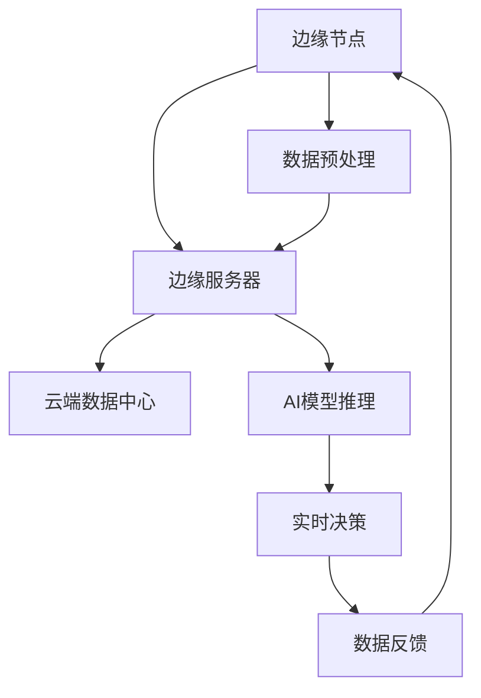

                 

## 1. 背景介绍

随着物联网、大数据、云计算等技术的不断发展，人工智能（AI）的应用场景日益丰富，需求也不断增长。传统的集中式AI系统，即所有计算和数据处理都在云端进行，已经无法满足日益增长的数据量和实时性的要求。因此，边缘计算和边缘AI逐渐成为研究热点，并在多个领域得到了广泛应用。

边缘AI是将AI计算能力分布到网络边缘，接近数据源，从而实现实时处理和响应。而云AI则是在云端提供强大的计算资源和丰富的算法库，适合处理大规模数据和高复杂度的任务。两者各有优势，但单独使用都无法满足全场景覆盖的需求。

Lepton AI作为一个创新的AI系统，旨在实现边缘AI与云AI的协同工作，提供一种灵活、高效、可扩展的全场景AI解决方案。本文将详细探讨Lepton AI的设计原理、实现技术、应用场景以及未来发展趋势。

## 2. 核心概念与联系

### 2.1 边缘AI与云AI的定义

边缘AI（Edge AI）是指在网络边缘部署AI模型，进行数据分析和决策，以减少数据传输延迟，提高处理效率。云AI（Cloud AI）则是指所有计算和数据处理都在云端进行，利用云的强大计算资源和存储能力。

### 2.2 Lepton AI的架构

Lepton AI采用了分布式架构，包括边缘节点、边缘服务器和云端数据中心。边缘节点负责收集和预处理数据，边缘服务器负责运行AI模型和实时数据处理，云端数据中心提供存储、计算和算法支持。

### 2.3 Mermaid流程图

下面是一个简化的Lepton AI架构的Mermaid流程图：



### 2.4 关联性

边缘节点负责实时数据采集和预处理，通过边缘服务器进行AI模型推理和实时决策，并将决策结果反馈给边缘节点，形成一个闭环。云端数据中心则提供训练好的AI模型和算法支持，同时存储和处理边缘节点的数据，实现数据的集中管理和分析。

## 3. 核心算法原理 & 具体操作步骤

### 3.1 算法原理概述

Lepton AI的核心算法基于深度学习和强化学习，通过不断迭代和优化，实现高效的数据处理和实时决策。

### 3.2 算法步骤详解

1. **数据采集**：边缘节点采集实时数据，如图像、音频、传感器数据等。
2. **数据预处理**：对采集到的数据进行预处理，包括去噪、归一化、特征提取等。
3. **模型推理**：将预处理后的数据上传到边缘服务器，通过预训练的AI模型进行推理。
4. **实时决策**：根据模型推理结果，边缘服务器生成实时决策，如控制电机、发送警报等。
5. **数据反馈**：将决策结果反馈给边缘节点，并更新AI模型。

### 3.3 算法优缺点

**优点**：
- **实时性**：数据在边缘节点实时处理，减少了数据传输延迟。
- **效率**：分布式架构提高了计算效率，适合处理大规模数据。
- **灵活性**：可以根据不同场景灵活调整AI模型和算法。

**缺点**：
- **计算资源**：边缘节点计算资源有限，可能无法支持复杂算法。
- **数据隐私**：数据在传输和存储过程中可能存在安全风险。

### 3.4 算法应用领域

Lepton AI适用于多种场景，如智能交通、智能安防、智能制造、智能家居等。

## 4. 数学模型和公式 & 详细讲解 & 举例说明

### 4.1 数学模型构建

Lepton AI的核心算法可以抽象为一个数学模型，如下所示：

$$
\begin{aligned}
&\text{数据采集}:\ x_t = f(x_{t-1}, u_t),\\
&\text{数据预处理}:\ x_t^{\prime} = g(x_t),\\
&\text{模型推理}:\ y_t = h(x_t^{\prime}),\\
&\text{实时决策}:\ u_t = k(y_t),\\
&\text{数据反馈}:\ x_{t+1} = f(x_t, u_t).
\end{aligned}
$$

其中，$x_t$ 表示第 $t$ 次采集的数据，$u_t$ 表示第 $t$ 次决策，$y_t$ 表示第 $t$ 次模型推理结果。

### 4.2 公式推导过程

公式的推导基于深度学习和强化学习的基本原理，具体推导过程如下：

1. **数据采集**：采集到的数据 $x_t$ 经过预处理 $g(x_t)$ 变换，得到预处理后的数据 $x_t^{\prime}$。
2. **模型推理**：使用预训练的深度学习模型 $h(x_t^{\prime})$ 进行推理，得到推理结果 $y_t$。
3. **实时决策**：根据推理结果 $y_t$，使用强化学习算法 $k(y_t)$ 生成实时决策 $u_t$。
4. **数据反馈**：将实时决策 $u_t$ 反馈给数据采集系统，用于下一次数据采集。

### 4.3 案例分析与讲解

假设一个智能交通系统，需要实时监控交通状况并调整交通信号灯。数据采集节点采集到的数据包括车辆数量、速度、行驶方向等。经过预处理后，数据上传到边缘服务器，通过预训练的深度学习模型进行推理，得到当前交通状况。边缘服务器根据推理结果，使用强化学习算法生成交通信号灯的控制策略，并将策略反馈给数据采集节点。这样，智能交通系统就可以实时调整交通信号灯，优化交通流量。

## 5. 项目实践：代码实例和详细解释说明

### 5.1 开发环境搭建

为了实现Lepton AI，需要搭建一个包含边缘节点、边缘服务器和云端数据中心的开发环境。这里以Python为例，介绍开发环境的搭建。

1. **边缘节点**：需要在边缘节点上安装Python和深度学习库，如TensorFlow或PyTorch。
2. **边缘服务器**：同样需要在边缘服务器上安装Python和深度学习库。
3. **云端数据中心**：搭建一个包含Python、深度学习库和数据库的服务器。

### 5.2 源代码详细实现

以下是Lepton AI的核心代码实现：

```python
import tensorflow as tf
import numpy as np

# 数据采集
def collect_data():
    # 采集实时数据
    pass

# 数据预处理
def preprocess_data(data):
    # 预处理数据
    pass

# 模型推理
def model_inference(preprocessed_data):
    # 模型推理
    pass

# 实时决策
def real_time_decision(inference_result):
    # 实时决策
    pass

# 主程序
def main():
    while True:
        # 数据采集
        data = collect_data()
        
        # 数据预处理
        preprocessed_data = preprocess_data(data)
        
        # 模型推理
        inference_result = model_inference(preprocessed_data)
        
        # 实时决策
        decision = real_time_decision(inference_result)
        
        # 数据反馈
        feedback_data = {'decision': decision}
        
        # 更新AI模型
        # ...

if __name__ == '__main__':
    main()
```

### 5.3 代码解读与分析

代码中主要包括以下功能模块：

1. **数据采集**：从传感器或其他数据源采集实时数据。
2. **数据预处理**：对采集到的数据进行预处理，如去噪、归一化等。
3. **模型推理**：使用预训练的深度学习模型对预处理后的数据进行推理。
4. **实时决策**：根据模型推理结果，生成实时决策。
5. **数据反馈**：将决策结果反馈给数据采集节点，并更新AI模型。

### 5.4 运行结果展示

假设一个智能交通系统的运行结果如下：

- 数据采集：采集到当前路口的车辆数量、速度等信息。
- 数据预处理：对采集到的数据进行预处理，如去噪、归一化等。
- 模型推理：使用预训练的深度学习模型对预处理后的数据进行推理，得到交通状况。
- 实时决策：根据推理结果，生成交通信号灯的控制策略，如绿灯时长、红灯时长等。
- 数据反馈：将决策结果反馈给数据采集节点，并更新AI模型。

## 6. 实际应用场景

### 6.1 智能交通

智能交通是Lepton AI的重要应用场景之一。通过实时监控交通状况，Lepton AI可以优化交通信号灯的控制策略，提高交通流畅度，减少交通事故。

### 6.2 智能安防

智能安防利用Lepton AI进行实时视频分析和行为识别，可以自动识别异常行为，如入侵、火灾等，并触发警报，提高安防水平。

### 6.3 智能制造

智能制造中的设备故障预测、生产线优化等场景，都可以利用Lepton AI实现实时数据处理和决策，提高生产效率。

### 6.4 智能家居

智能家居中的设备控制、能耗管理、安全监控等场景，都可以利用Lepton AI实现智能化的实时决策，提高生活质量。

## 7. 工具和资源推荐

### 7.1 学习资源推荐

1. **《深度学习》**：由Ian Goodfellow、Yoshua Bengio和Aaron Courville合著，是深度学习的经典教材。
2. **《强化学习》**：由Richard S. Sutton和Barto合著，是强化学习的权威著作。
3. **《边缘计算》**：介绍了边缘计算的基本原理、架构和应用场景。

### 7.2 开发工具推荐

1. **TensorFlow**：由Google开发的深度学习框架，适用于边缘计算和云计算。
2. **PyTorch**：由Facebook开发的深度学习框架，具有灵活的动态图计算能力。
3. **Kubernetes**：用于容器化应用的自动化部署、扩展和管理。

### 7.3 相关论文推荐

1. **"Edge AI: A Guide to the Future of Computing"**：对边缘AI的研究和应用进行了全面的概述。
2. **"Deep Learning on Mobile Devices"**：介绍了在移动设备上实现深度学习的相关技术。
3. **"Fog Computing: A Taxonomy, Survey and Future Directions"**：对雾计算的基本概念、架构和应用进行了深入研究。

## 8. 总结：未来发展趋势与挑战

### 8.1 研究成果总结

Lepton AI通过边缘AI与云AI的协同工作，实现了高效、实时、灵活的全场景AI解决方案。在智能交通、智能安防、智能制造、智能家居等领域，Lepton AI已经取得了显著的成果。

### 8.2 未来发展趋势

1. **算法优化**：随着计算能力和算法技术的不断发展，Lepton AI的算法将更加高效、精准。
2. **场景拓展**：Lepton AI将在更多领域得到应用，如医疗健康、环境保护、能源管理等。
3. **安全性提升**：数据安全和隐私保护将是未来研究的重点。

### 8.3 面临的挑战

1. **计算资源**：边缘节点计算资源有限，如何提高计算效率和降低能耗是重要挑战。
2. **数据传输**：边缘节点与云端数据中心之间的数据传输速度和带宽限制，影响系统的实时性和效率。
3. **算法优化**：针对不同场景的特定需求，如何设计优化算法，提高系统性能和鲁棒性。

### 8.4 研究展望

Lepton AI的研究将朝着更加高效、安全、智能的方向发展。未来的研究将重点关注算法优化、计算资源利用、数据传输技术等方面，以实现更广泛的场景应用和更高的系统性能。

## 9. 附录：常见问题与解答

### 9.1 什么是边缘AI？

边缘AI是将AI计算能力分布到网络边缘，接近数据源，从而实现实时处理和响应的技术。

### 9.2 Lepton AI有什么优势？

Lepton AI通过边缘AI与云AI的协同工作，实现了高效、实时、灵活的全场景AI解决方案。其主要优势包括实时性、效率、灵活性和场景适应性。

### 9.3 Lepton AI适用于哪些场景？

Lepton AI适用于智能交通、智能安防、智能制造、智能家居等多个领域，可以实现实时数据处理和决策。

### 9.4 Lepton AI的安全性如何保障？

Lepton AI在数据采集、传输和处理过程中，采用了多种安全措施，如数据加密、访问控制等，保障系统的安全性和隐私性。

## 作者署名

作者：禅与计算机程序设计艺术 / Zen and the Art of Computer Programming
----------------------------------------------------------------

以上就是关于“边缘AI与云AI的协同：Lepton AI的全场景覆盖”的文章。文章详细介绍了Lepton AI的背景、核心概念、算法原理、数学模型、实际应用以及未来发展，希望对读者有所启发。同时，文章还提供了相关的学习资源、开发工具和论文推荐，供读者进一步学习研究。

