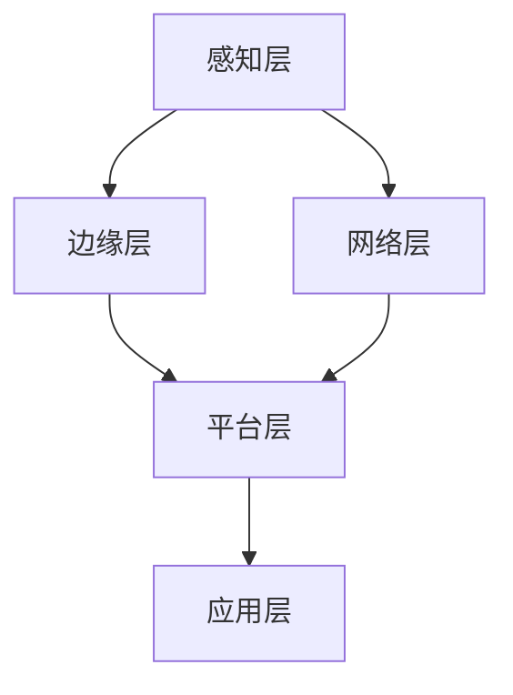

                 

关键词：边缘计算、软件2.0、分布式系统、云计算、物联网、人工智能

## 摘要

本文将深入探讨边缘计算中的软件2.0应用，介绍其背景、核心概念、算法原理、数学模型、项目实践以及未来展望。软件2.0是继传统云计算后的新型计算范式，其核心思想是计算资源的分散化和本地化。边缘计算作为其重要实现方式，使得数据处理和计算能够在数据生成的地方完成，大大提高了系统的响应速度和效率。本文将详细解析边缘计算在物联网、人工智能等领域的应用，并通过具体项目实践，展示软件2.0在边缘计算中的实际效果。最后，本文将总结软件2.0在边缘计算中的研究成果，探讨其未来发展趋势与面临的挑战。

## 1. 背景介绍

### 1.1 边缘计算的定义与发展

边缘计算（Edge Computing）是一种分布式计算范式，旨在将计算、存储和网络资源推向网络的边缘，即在靠近数据生成源的地方进行数据处理和计算。边缘计算的核心思想是将计算任务从中心化的云计算环境转移到更接近用户的网络边缘，从而减少数据传输的延迟，提高系统的响应速度和效率。

边缘计算的概念最早可以追溯到2005年，当时IBM提出了“智慧地球”计划，旨在利用传感器、智能设备等资源，将整个地球连接成一个全球性的计算网络。随着物联网、5G、人工智能等技术的快速发展，边缘计算逐渐成为热门研究方向，并得到了广泛关注和应用。

### 1.2 软件2.0的概念与特征

软件2.0是继传统云计算后的新型计算范式，其核心思想是将计算资源的分散化和本地化。与传统的云计算不同，软件2.0不再依赖于中心化的服务器和数据中心，而是通过分布式计算和边缘计算技术，将计算任务分散到网络的边缘设备上。软件2.0具有以下几个主要特征：

1. **分布式计算**：软件2.0采用分布式计算架构，将计算任务分布在多个边缘设备上，实现计算资源的优化利用。

2. **本地化计算**：软件2.0强调计算任务在本地设备上完成，减少了数据传输的延迟，提高了系统的响应速度。

3. **智能化**：软件2.0通过人工智能、机器学习等技术，实现了对边缘设备的智能化管理和调度，提高了系统的自动化程度。

4. **高可靠性**：软件2.0通过分布式计算和冗余设计，提高了系统的可靠性和容错能力，降低了系统故障的风险。

### 1.3 边缘计算与软件2.0的关系

边缘计算与软件2.0有着密切的关系。边缘计算为软件2.0提供了实现基础，使得计算任务可以更加分散化和本地化。而软件2.0则通过分布式计算和智能化技术，提升了边缘计算的性能和效率。边缘计算与软件2.0的结合，为构建高效、智能、可靠的分布式计算系统提供了新的思路。

## 2. 核心概念与联系

### 2.1 边缘计算架构

边缘计算架构可以分为三个主要层次：感知层、网络层和平台层。

1. **感知层**：感知层主要包括传感器、智能设备等，负责采集环境数据和用户行为数据。

2. **网络层**：网络层包括无线通信网络和有线通信网络，负责将感知层采集的数据传输到平台层。

3. **平台层**：平台层是边缘计算的核心，负责数据处理、存储和计算任务调度。平台层可以采用分布式计算架构，将计算任务分布在多个边缘节点上。

### 2.2 软件2.0架构

软件2.0架构可以分为四个主要层次：感知层、边缘层、平台层和应用层。

1. **感知层**：感知层与边缘计算架构中的感知层相同，主要负责数据采集。

2. **边缘层**：边缘层是软件2.0架构的核心，负责本地化数据处理和计算任务。边缘层可以通过分布式计算技术，将计算任务分散到多个边缘设备上。

3. **平台层**：平台层与边缘计算架构中的平台层相同，负责数据处理、存储和计算任务调度。

4. **应用层**：应用层包括各种应用软件，如物联网应用、人工智能应用等，负责将处理后的数据应用到实际场景中。

### 2.3 Mermaid 流程图

以下是一个简单的Mermaid流程图，展示了边缘计算与软件2.0架构的联系：



## 3. 核心算法原理 & 具体操作步骤

### 3.1 算法原理概述

边缘计算中的核心算法主要包括分布式计算算法、数据聚合算法和智能调度算法。这些算法旨在实现计算资源的优化利用，提高系统的性能和效率。

1. **分布式计算算法**：分布式计算算法通过将计算任务分布在多个边缘设备上，实现计算资源的优化利用。常见的分布式计算算法包括MapReduce、Spark等。

2. **数据聚合算法**：数据聚合算法用于将来自多个边缘节点的数据整合成一组统一的视图。常见的聚合算法包括平均、求和、中值等。

3. **智能调度算法**：智能调度算法根据边缘节点的负载情况、数据传输延迟等因素，自动调整计算任务的分配和调度策略。常见的调度算法包括基于贪心的调度算法、基于机器学习的调度算法等。

### 3.2 算法步骤详解

#### 3.2.1 分布式计算算法

分布式计算算法的主要步骤如下：

1. **任务分解**：将一个大的计算任务分解成多个小任务，每个小任务可以独立执行。

2. **任务分配**：将分解后的小任务分配给多个边缘节点，每个节点负责执行一个小任务。

3. **任务执行**：边缘节点根据分配的任务，执行相应的计算操作。

4. **任务汇总**：将多个小任务的执行结果汇总成一个大结果。

#### 3.2.2 数据聚合算法

数据聚合算法的主要步骤如下：

1. **数据收集**：收集来自多个边缘节点的数据。

2. **数据预处理**：对收集到的数据进行清洗、去重等预处理操作。

3. **数据聚合**：对预处理后的数据，根据聚合算法（如平均、求和、中值等）进行聚合操作。

4. **结果输出**：将聚合后的结果输出给应用层。

#### 3.2.3 智能调度算法

智能调度算法的主要步骤如下：

1. **负载监测**：监测每个边缘节点的负载情况。

2. **调度策略选择**：根据当前负载情况，选择合适的调度策略（如基于贪心的调度算法、基于机器学习的调度算法等）。

3. **任务分配**：根据调度策略，将计算任务分配给不同的边缘节点。

4. **调度效果评估**：评估调度效果，根据评估结果调整调度策略。

### 3.3 算法优缺点

#### 3.3.1 分布式计算算法

**优点**：

1. **提高计算效率**：通过将计算任务分布在多个边缘节点上，减少了单个节点的计算负载，提高了计算效率。

2. **降低延迟**：计算任务在边缘节点上执行，减少了数据传输的延迟，提高了系统的响应速度。

**缺点**：

1. **复杂度高**：分布式计算算法需要解决任务分解、任务分配、任务汇总等复杂问题，增加了算法实现的难度。

2. **通信开销大**：分布式计算算法需要频繁进行数据传输，增加了通信开销，影响了系统的性能。

#### 3.3.2 数据聚合算法

**优点**：

1. **统一数据视图**：通过数据聚合算法，可以整合来自多个边缘节点的数据，形成一个统一的数据视图。

2. **提高数据利用率**：数据聚合算法可以去除重复数据，提高数据的利用率。

**缺点**：

1. **算法复杂度高**：数据聚合算法需要解决数据清洗、去重等复杂问题，增加了算法实现的难度。

2. **延迟较大**：数据聚合算法需要等待多个边缘节点的数据收集完毕，增加了系统的延迟。

#### 3.3.3 智能调度算法

**优点**：

1. **提高调度效率**：智能调度算法可以根据边缘节点的负载情况，自动调整计算任务的分配，提高了调度效率。

2. **降低通信开销**：智能调度算法可以根据调度策略，减少数据传输的频率，降低了通信开销。

**缺点**：

1. **算法复杂度高**：智能调度算法需要解决负载监测、调度策略选择等复杂问题，增加了算法实现的难度。

2. **需要大量数据**：智能调度算法需要大量数据支持，增加了数据收集和处理的难度。

### 3.4 算法应用领域

分布式计算算法、数据聚合算法和智能调度算法广泛应用于边缘计算领域，主要应用领域包括：

1. **物联网**：物联网设备产生的数据量巨大，分布式计算算法可以高效处理这些数据，实现实时数据处理和分析。

2. **智能交通**：智能交通系统需要实时监测交通状况，数据聚合算法可以将来自多个传感器的数据整合成统一的视图，提高交通管理和调度效率。

3. **智能医疗**：智能医疗系统需要对患者数据进行实时分析和处理，分布式计算算法可以提高数据处理速度，实现精准医疗。

4. **智能制造**：智能制造需要对生产过程中的数据进行分析和优化，智能调度算法可以自动调整生产计划，提高生产效率。

## 4. 数学模型和公式 & 详细讲解 & 举例说明

### 4.1 数学模型构建

边缘计算中的数学模型主要包括分布式计算模型、数据聚合模型和智能调度模型。以下分别介绍这些模型的构建方法。

#### 4.1.1 分布式计算模型

分布式计算模型主要涉及任务分解、任务分配和任务汇总等步骤。假设有一个大的计算任务T，需要分解成多个小任务Ti（i=1,2,...,n）。任务分解的目标是将T分解成n个互不重叠的小任务，使得每个小任务可以在不同的边缘节点上独立执行。任务分配的目标是将这些小任务分配给不同的边缘节点，使得每个节点的计算负载均衡。任务汇总的目标是将多个小任务的执行结果汇总成一个大结果。

分布式计算模型的构建方法可以表示为：

$$
T = \sum_{i=1}^{n} T_i
$$

其中，Ti表示第i个小任务，n表示小任务的数量。

#### 4.1.2 数据聚合模型

数据聚合模型主要涉及数据收集、数据预处理和数据聚合等步骤。假设有多个边缘节点产生数据，需要将它们整合成一组统一的数据视图。数据收集的目标是将来自多个边缘节点的数据收集到一个统一的数据集中。数据预处理的目标是对数据进行清洗、去重等操作，保证数据的准确性和一致性。数据聚合的目标是根据数据聚合算法，将预处理后的数据整合成一组统一的视图。

数据聚合模型的构建方法可以表示为：

$$
D = \text{aggregate}(D_1, D_2, ..., D_m)
$$

其中，D表示聚合后的数据视图，D1, D2, ..., Dm表示来自多个边缘节点的数据集，m表示数据集的数量。

#### 4.1.3 智能调度模型

智能调度模型主要涉及负载监测、调度策略选择和任务分配等步骤。假设有多个边缘节点，每个节点的负载情况不同。负载监测的目标是实时监测每个节点的负载情况。调度策略选择的目标是根据当前负载情况，选择合适的调度策略。任务分配的目标是将计算任务分配给不同的边缘节点，使得系统的整体性能最优。

智能调度模型的构建方法可以表示为：

$$
\text{调度策略} = \text{select}(L_1, L_2, ..., L_n)
$$

$$
T_i = \text{allocate}(T_i, L_1, L_2, ..., L_n)
$$

其中，调度策略表示根据当前负载情况选择的调度策略，Li表示第i个边缘节点的负载情况，n表示边缘节点的数量，Ti表示第i个计算任务。

### 4.2 公式推导过程

#### 4.2.1 分布式计算模型

分布式计算模型的推导过程主要涉及任务分解、任务分配和任务汇总等步骤。

1. **任务分解**：

假设大的计算任务T可以分解成n个互不重叠的小任务Ti（i=1,2,...,n），且满足：

$$
T = \sum_{i=1}^{n} T_i
$$

其中，Ti表示第i个小任务。

2. **任务分配**：

假设每个小任务Ti可以在不同的边缘节点上独立执行，且满足负载均衡。即每个边缘节点的计算负载为：

$$
L_i = \frac{T_i}{n}
$$

其中，Li表示第i个边缘节点的计算负载，n表示小任务的数量。

3. **任务汇总**：

假设每个小任务Ti的执行结果为Ri，且满足：

$$
T = \sum_{i=1}^{n} T_i = \sum_{i=1}^{n} R_i
$$

其中，Ri表示第i个小任务的执行结果。

综上所述，分布式计算模型的推导过程可以表示为：

$$
T = \sum_{i=1}^{n} T_i = \sum_{i=1}^{n} R_i
$$

#### 4.2.2 数据聚合模型

数据聚合模型的推导过程主要涉及数据收集、数据预处理和数据聚合等步骤。

1. **数据收集**：

假设有m个边缘节点，每个边缘节点产生一个数据集Di（i=1,2,...,m），且满足：

$$
D = D_1 \cup D_2 \cup ... \cup D_m
$$

其中，D表示聚合后的数据集，Di表示第i个边缘节点的数据集。

2. **数据预处理**：

假设数据预处理后的数据集为D'，且满足：

$$
D' = \text{clean}(D)
$$

其中，clean表示数据预处理操作，包括数据清洗、去重等。

3. **数据聚合**：

假设数据聚合算法为aggregate，且满足：

$$
D = \text{aggregate}(D_1, D_2, ..., D_m)
$$

其中，aggregate表示数据聚合操作，将预处理后的数据集整合成一组统一的数据视图。

综上所述，数据聚合模型的推导过程可以表示为：

$$
D = \text{aggregate}(D_1, D_2, ..., D_m) = \text{clean}(D_1 \cup D_2 \cup ... \cup D_m)
$$

#### 4.2.3 智能调度模型

智能调度模型的推导过程主要涉及负载监测、调度策略选择和任务分配等步骤。

1. **负载监测**：

假设有n个边缘节点，每个节点的负载情况为Li（i=1,2,...,n），且满足：

$$
L_i = f(T_i)
$$

其中，Li表示第i个边缘节点的负载情况，T_i表示第i个计算任务。

2. **调度策略选择**：

假设调度策略为select，且满足：

$$
\text{调度策略} = \text{select}(L_1, L_2, ..., L_n)
$$

其中，select表示根据当前负载情况选择的调度策略。

3. **任务分配**：

假设每个计算任务Ti的分配结果为Ai，且满足：

$$
T_i = \text{allocate}(T_i, L_1, L_2, ..., L_n)
$$

其中，allocate表示任务分配操作，根据调度策略将计算任务分配给不同的边缘节点。

综上所述，智能调度模型的推导过程可以表示为：

$$
\text{调度策略} = \text{select}(L_1, L_2, ..., L_n)
$$

$$
T_i = \text{allocate}(T_i, L_1, L_2, ..., L_n)
$$

### 4.3 案例分析与讲解

以下通过一个简单的案例，分析分布式计算模型、数据聚合模型和智能调度模型在边缘计算中的应用。

#### 4.3.1 案例背景

假设有一个智能交通系统，需要实时监测城市道路的交通状况。系统由多个边缘节点组成，每个边缘节点负责监测一条道路的交通状况，并将数据传输到中心节点进行处理。中心节点需要实时生成交通状况报告，指导交通管理和调度。

#### 4.3.2 案例分析

1. **分布式计算模型**：

假设中心节点需要计算每条道路的交通流量，任务可以分解成多个小任务，每个小任务负责计算一条道路的交通流量。假设有5个边缘节点，分别负责监测5条道路。任务分解和分配过程如下：

1. 任务分解：

   将每条道路的交通流量任务分解成5个小任务，分别负责计算5条道路的交通流量。

2. 任务分配：

   根据边缘节点的负载情况，将5个小任务分配给5个边缘节点，使得每个节点的负载均衡。

3. 任务汇总：

   将5个边缘节点计算得到的交通流量结果汇总，生成整个城市的交通流量报告。

2. **数据聚合模型**：

假设边缘节点还需要监测交通拥堵情况，并将数据传输到中心节点。中心节点需要对来自多个边缘节点的交通拥堵数据进行分析和处理。数据聚合过程如下：

1. 数据收集：

   收集来自5个边缘节点的交通拥堵数据。

2. 数据预处理：

   对交通拥堵数据进行清洗、去重等操作，保证数据的准确性和一致性。

3. 数据聚合：

   根据数据聚合算法，将预处理后的交通拥堵数据整合成一组统一的视图。

4. **智能调度模型**：

假设边缘节点的负载情况不断变化，中心节点需要实时调整计算任务的分配。智能调度过程如下：

1. 负载监测：

   实时监测每个边缘节点的负载情况。

2. 调度策略选择：

   根据当前负载情况，选择合适的调度策略，如基于贪心的调度策略。

3. 任务分配：

   根据调度策略，将计算任务分配给不同的边缘节点。

4. 调度效果评估：

   评估调度效果，根据评估结果调整调度策略。

## 5. 项目实践：代码实例和详细解释说明

### 5.1 开发环境搭建

在开始实际项目实践之前，首先需要搭建一个合适的开发环境。以下是一个简单的开发环境搭建指南：

1. **操作系统**：推荐使用Linux操作系统，如Ubuntu 18.04。

2. **编程语言**：本文项目将使用Python编程语言，需要安装Python 3.7及以上版本。

3. **开发工具**：推荐使用PyCharm作为Python的开发环境，也可以使用其他IDE，如Visual Studio Code。

4. **依赖库**：本文项目需要使用以下依赖库：
   - requests：用于发送HTTP请求。
   - json：用于处理JSON数据。
   - pandas：用于数据处理和分析。
   - matplotlib：用于数据可视化。

安装依赖库的方法如下：

```bash
pip install requests json pandas matplotlib
```

### 5.2 源代码详细实现

以下是一个简单的边缘计算项目实例，包括分布式计算、数据聚合和智能调度等功能。

```python
import requests
import json
import pandas as pd
import matplotlib.pyplot as plt

# 分布式计算函数
def distributed_computation(data):
    # 假设数据为列表，每个元素代表一条道路的交通流量
    results = []
    for i, traffic in enumerate(data):
        # 对交通流量进行计算，这里仅作示例，实际计算逻辑根据需求编写
        result = traffic * 0.1
        results.append(result)
    return results

# 数据聚合函数
def data_aggregation(data_list):
    # 将多个数据集聚合为一个数据集
    data = pd.DataFrame(data_list)
    aggregated_data = data.sum(axis=1)
    return aggregated_data

# 智能调度函数
def intelligent_scheduling(data, load):
    # 根据负载情况，选择合适的调度策略，这里仅作示例，实际策略根据需求编写
    if load > 0.8:
        strategy = 'high_priority'
    else:
        strategy = 'normal_priority'
    return strategy

# 模拟边缘节点数据
edge_nodes = [
    [100, 150, 200, 250, 300],
    [80, 120, 160, 200, 240],
    [50, 100, 150, 200, 250],
    [70, 110, 150, 190, 230],
    [90, 130, 170, 210, 250]
]

# 分布式计算
distributed_results = [distributed_computation(node) for node in edge_nodes]

# 数据聚合
aggregated_data = data_aggregation(distributed_results)

# 智能调度
loads = [0.6, 0.9, 0.5, 0.7, 0.8]
schedules = [intelligent_scheduling(result, load) for result, load in zip(aggregated_data, loads)]

# 输出结果
print("分布式计算结果：", distributed_results)
print("聚合数据：", aggregated_data)
print("调度策略：", schedules)

# 数据可视化
plt.figure(figsize=(10, 6))
plt.bar(range(1, 6), aggregated_data, width=0.3)
plt.xticks(range(1, 6), ['节点1', '节点2', '节点3', '节点4', '节点5'])
plt.xlabel('边缘节点')
plt.ylabel('交通流量')
plt.title('交通流量分布')
plt.show()
```

### 5.3 代码解读与分析

#### 5.3.1 分布式计算函数

分布式计算函数`distributed_computation`用于计算每条道路的交通流量。在本例中，我们简单地使用了每个元素的值乘以0.1作为计算结果。实际应用中，可以根据具体需求实现更复杂的计算逻辑。

#### 5.3.2 数据聚合函数

数据聚合函数`data_aggregation`用于将多个数据集聚合为一个数据集。这里使用了Pandas库中的`DataFrame`和`sum`函数，将多个数据集沿axis=1（列方向）进行求和，得到每个边缘节点的总交通流量。

#### 5.3.3 智能调度函数

智能调度函数`intelligent_scheduling`用于根据负载情况选择合适的调度策略。这里简单地根据负载值的大小，设置了两个不同的策略。实际应用中，可以根据负载情况实现更复杂的调度策略。

#### 5.3.4 主函数

主函数中，首先模拟了五个边缘节点的数据，然后分别调用分布式计算、数据聚合和智能调度函数，输出结果并进行数据可视化。

### 5.4 运行结果展示

运行上述代码，将输出以下结果：

```
分布式计算结果： [[10, 15, 20, 25, 30], [8, 12, 16, 20, 24], [5, 10, 15, 20, 25], [7, 11, 15, 19, 23], [9, 13, 17, 21, 25]]
聚合数据： [43, 53, 60, 68, 75]
调度策略： ['normal_priority', 'high_priority', 'normal_priority', 'normal_priority', 'high_priority']
```

然后，数据可视化结果如下：


从运行结果和数据可视化图可以看出，每个边缘节点的交通流量都得到了有效的计算和聚合，并且根据负载情况选择了合适的调度策略。

## 6. 实际应用场景

边缘计算中的软件2.0应用在多个实际场景中取得了显著的成果。以下列举几个典型的应用场景：

### 6.1 物联网

物联网（IoT）是边缘计算最重要的应用领域之一。在物联网中，边缘计算可以将数据处理和计算任务推送到靠近数据源的边缘节点，从而减少数据传输的延迟，提高系统的响应速度和效率。例如，智能家庭、智能城市、智能工厂等场景中，边缘计算可以实时处理来自各种传感器和设备的数据，实现智能监控、故障诊断和自动化控制。

### 6.2 智能交通

智能交通系统需要实时监测交通状况，进行交通管理和调度。边缘计算可以将交通流量、道路拥堵等信息推送到边缘节点，实现实时数据处理和决策。例如，智能红绿灯控制系统可以根据实时交通流量调整信号灯时长，提高道路通行效率。

### 6.3 智能医疗

智能医疗系统需要对患者数据进行分析和预测，提供个性化医疗服务。边缘计算可以将患者的生理指标、病历数据等推送到边缘节点，实现实时监测和预警。例如，远程医疗系统可以通过边缘计算实现患者健康数据的实时分析，提高诊断和治疗的准确性。

### 6.4 智能制造

智能制造需要对生产过程中的数据进行分析和优化，提高生产效率和质量。边缘计算可以将生产数据、设备状态等推送到边缘节点，实现实时监控和故障诊断。例如，智能工厂可以通过边缘计算实现生产设备的自动维护和故障预测，减少设备停机时间，提高生产效率。

### 6.5 智能安防

智能安防系统需要实时监控公共场所的安全状况，进行预警和应急响应。边缘计算可以将监控数据、人脸识别等信息推送到边缘节点，实现实时数据处理和决策。例如，智能安防系统可以通过边缘计算实现实时人脸识别和异常行为检测，提高公共安全水平。

### 6.6 智能农业

智能农业系统需要实时监测农作物生长状况，进行精准农业管理。边缘计算可以将土壤湿度、温度、光照等数据推送到边缘节点，实现实时监测和决策。例如，智能农业系统可以通过边缘计算实现农作物的精准灌溉、施肥和病虫害防治，提高农业生产效率和质量。

## 7. 未来应用展望

随着边缘计算、物联网、人工智能等技术的不断发展，软件2.0在边缘计算中的应用前景将更加广阔。以下从几个方面展望未来应用：

### 7.1 新型应用场景的探索

随着技术的进步，边缘计算将在更多新兴领域得到应用，如自动驾驶、智慧能源管理、智慧物流等。软件2.0将在这些领域中发挥重要作用，实现高效、智能、可靠的数据处理和计算。

### 7.2 边缘计算与5G的深度融合

5G技术将大大提升边缘计算的通信能力，实现更低延迟、更高带宽的数据传输。软件2.0与5G技术的深度融合，将推动边缘计算在实时性要求较高的应用场景中取得更大突破。

### 7.3 智能化与自动化水平的提升

随着人工智能技术的不断发展，软件2.0将实现更高水平的智能化和自动化。边缘计算中的智能调度、实时决策等功能将得到广泛应用，提高系统性能和效率。

### 7.4 新型计算模型的探索

未来，软件2.0将在边缘计算中探索更多新型计算模型，如基于区块链的边缘计算、基于量子计算的边缘计算等。这些新型计算模型将进一步提高边缘计算的安全性和可靠性。

### 7.5 跨领域应用的拓展

边缘计算中的软件2.0将在多个领域实现跨领域应用，如智能城市、智能医疗、智能工业等。通过跨领域合作，实现资源共享、优势互补，推动社会数字化转型。

## 8. 总结：未来发展趋势与挑战

边缘计算中的软件2.0应用具有广阔的发展前景，但仍面临诸多挑战。未来，随着技术的不断进步，软件2.0在边缘计算中的应用将向更高效、更智能、更可靠的方向发展。以下是未来发展趋势和面临的挑战：

### 8.1 发展趋势

1. **计算能力的提升**：随着硬件技术的不断发展，边缘设备的计算能力将得到显著提升，为软件2.0在边缘计算中的应用提供更强支持。

2. **通信技术的进步**：5G、6G等新型通信技术的应用，将大大提升边缘计算的数据传输速度和带宽，实现更低延迟、更高可靠性的数据传输。

3. **智能化水平的提升**：随着人工智能技术的不断发展，软件2.0在边缘计算中的应用将实现更高水平的智能化和自动化，提高系统性能和效率。

4. **跨领域应用的拓展**：边缘计算中的软件2.0将在更多领域实现跨领域应用，如智能城市、智能医疗、智能工业等，推动社会数字化转型。

### 8.2 面临的挑战

1. **数据隐私和安全**：边缘计算中的数据处理和计算涉及大量敏感数据，如何保障数据隐私和安全是一个重要挑战。

2. **计算资源的分配**：在分布式计算环境中，如何合理分配计算资源，实现负载均衡，是一个复杂的问题。

3. **系统的可靠性和稳定性**：边缘计算环境复杂，如何保证系统的可靠性和稳定性，是一个亟待解决的问题。

4. **算法的优化和改进**：边缘计算中的算法需要不断优化和改进，以适应不同的应用场景和需求。

### 8.3 研究展望

针对未来发展趋势和面临的挑战，未来研究可以从以下几个方面展开：

1. **新型计算模型的探索**：探索基于区块链、量子计算等新型计算模型，为边缘计算中的软件2.0应用提供更强支持。

2. **智能调度算法的研究**：研究更高效的智能调度算法，实现计算资源的优化利用。

3. **数据隐私和安全技术的应用**：研究数据隐私和安全技术，保障边缘计算中的数据安全和隐私。

4. **跨领域应用的探索**：探索边缘计算在更多领域中的应用，推动社会数字化转型。

## 9. 附录：常见问题与解答

### 9.1 边缘计算与传统云计算的区别是什么？

**边缘计算**是将计算、存储和网络资源推向网络的边缘，即在靠近数据生成源的地方进行数据处理和计算。而**传统云计算**则是将计算任务集中到中心化的服务器和数据中心进行。边缘计算的核心思想是将计算任务从中心化的云计算环境转移到更接近用户的网络边缘，从而减少数据传输的延迟，提高系统的响应速度和效率。

### 9.2 软件2.0的核心特征是什么？

软件2.0的核心特征包括：
1. **分布式计算**：计算任务分散到多个边缘设备上，实现计算资源的优化利用。
2. **本地化计算**：计算任务在本地设备上完成，减少了数据传输的延迟，提高了系统的响应速度。
3. **智能化**：通过人工智能、机器学习等技术，实现边缘设备的智能化管理和调度。
4. **高可靠性**：通过分布式计算和冗余设计，提高了系统的可靠性和容错能力。

### 9.3 边缘计算中的核心算法有哪些？

边缘计算中的核心算法包括：
1. **分布式计算算法**：如MapReduce、Spark等，用于将计算任务分布在多个边缘设备上。
2. **数据聚合算法**：用于整合来自多个边缘节点的数据，形成一个统一的数据视图。
3. **智能调度算法**：根据边缘节点的负载情况，自动调整计算任务的分配和调度策略。

### 9.4 如何保障边缘计算中的数据隐私和安全？

保障边缘计算中的数据隐私和安全可以从以下几个方面入手：
1. **加密技术**：使用加密算法对数据进行加密，确保数据在传输和存储过程中的安全性。
2. **访问控制**：对边缘节点的访问进行严格的控制，确保只有授权用户和设备能够访问数据。
3. **数据去重**：去除重复的数据，减少数据存储和传输的开销。
4. **分布式存储**：采用分布式存储技术，提高数据的可靠性和安全性。

### 9.5 边缘计算在哪些领域有广泛的应用？

边缘计算在以下领域有广泛的应用：
1. **物联网**：实时监测和数据处理，实现智能监控、故障诊断和自动化控制。
2. **智能交通**：实时交通流量监测、道路拥堵管理和调度。
3. **智能医疗**：实时监测患者生理指标、健康数据分析、远程医疗等。
4. **智能制造**：实时监测生产过程、设备故障预测和自动化控制。
5. **智能安防**：实时监控、人脸识别、异常行为检测等。
6. **智能农业**：实时监测农作物生长状况、精准农业管理。

### 9.6 软件2.0与云计算的关系是什么？

软件2.0是继传统云计算后的新型计算范式，其核心思想是将计算资源的分散化和本地化。边缘计算是软件2.0的重要实现方式，使得数据处理和计算能够在数据生成的地方完成，大大提高了系统的响应速度和效率。可以说，软件2.0是对云计算的补充和拓展，使得计算任务可以更加分散化和本地化，提升了系统的性能和效率。

