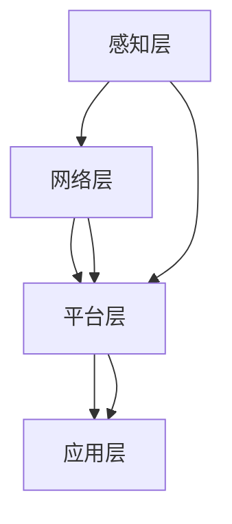

                 

关键词：边缘计算、物联网安全、安全平台、创新应用

> 摘要：随着物联网技术的快速发展，边缘计算在提高物联网安全方面发挥了重要作用。本文将深入探讨边缘计算安全平台的构建、核心算法、数学模型及其在物联网安全中的应用，并展望其未来发展趋势与挑战。

## 1. 背景介绍

### 1.1 物联网安全现状

物联网（Internet of Things, IoT）通过将物理设备、传感器、软件系统等连接到互联网，实现了信息的实时交换与共享，极大地推动了智能化生产、智慧城市建设等领域的发展。然而，随着物联网设备的增多，安全威胁也日益突出。传统的中心化安全架构已难以满足物联网安全需求，物联网设备面临着数据泄露、网络攻击、设备失陷等安全问题。

### 1.2 边缘计算的优势

边缘计算是一种分布式计算架构，通过在靠近数据源的地方进行数据处理，减少了数据传输的时间和带宽消耗，提高了系统的响应速度和效率。边缘计算在物联网安全方面具有以下优势：

- **本地化处理**：边缘计算能够在本地完成数据处理，减少了数据传输过程中的安全风险。
- **低延迟**：边缘计算降低了数据传输延迟，提高了系统的实时性和响应速度。
- **分布式架构**：边缘计算通过分布式节点实现数据处理，增强了系统的容错性和可靠性。

## 2. 核心概念与联系

### 2.1 边缘计算安全平台的概念

边缘计算安全平台是一个集成了多种安全技术的分布式系统，旨在提高物联网设备、网络和应用的安全性。它主要包括以下几个方面：

- **安全防护**：对物联网设备、网络和应用进行防护，防止恶意攻击和数据泄露。
- **数据加密**：对传输数据进行加密，确保数据隐私和安全。
- **认证与访问控制**：对物联网设备进行认证，确保只有授权设备可以访问系统资源。
- **日志审计**：记录系统操作日志，便于追踪和审计。

### 2.2 边缘计算安全平台的架构

边缘计算安全平台通常采用分布式架构，包括以下几个层次：

- **感知层**：负责数据采集和初步处理。
- **网络层**：负责数据传输和路由。
- **平台层**：负责数据处理、存储和安全控制。
- **应用层**：负责提供具体的应用服务。

### 2.3 边缘计算安全平台的联系

边缘计算安全平台与物联网安全紧密相关，通过以下方式实现安全保护：

- **数据安全**：对物联网数据进行加密和完整性校验，防止数据泄露和篡改。
- **设备安全**：对物联网设备进行认证和访问控制，防止设备被非法控制。
- **网络安全**：对物联网网络进行监控和防护，防止网络攻击和数据泄露。



## 3. 核心算法原理 & 具体操作步骤

### 3.1 算法原理概述

边缘计算安全平台采用了多种核心算法，主要包括：

- **加密算法**：对数据进行加密和解密，确保数据在传输过程中的安全性。
- **认证算法**：对物联网设备进行认证，确保设备合法性和安全性。
- **访问控制算法**：对设备进行访问控制，防止未经授权的设备访问系统资源。
- **安全审计算法**：记录系统操作日志，实现系统安全审计。

### 3.2 算法步骤详解

#### 3.2.1 加密算法

加密算法的具体步骤如下：

1. 数据加密：使用加密算法对数据进行加密，生成密文。
2. 数据解密：接收方使用解密算法对密文进行解密，恢复原文。

#### 3.2.2 认证算法

认证算法的具体步骤如下：

1. 设备注册：设备向认证服务器发送注册请求，提供设备信息。
2. 设备认证：认证服务器对设备进行认证，生成认证令牌。
3. 设备访问：设备使用认证令牌访问系统资源。

#### 3.2.3 访问控制算法

访问控制算法的具体步骤如下：

1. 访问请求：设备向服务器发送访问请求。
2. 访问决策：服务器根据设备认证信息，判断访问请求是否合法。
3. 访问授权：对合法的访问请求进行授权。

#### 3.2.4 安全审计算法

安全审计算法的具体步骤如下：

1. 日志记录：记录系统操作日志，包括设备访问记录、数据传输记录等。
2. 日志分析：对日志进行统计分析，发现潜在的安全威胁。
3. 安全预警：根据分析结果，发出安全预警，采取相应措施。

### 3.3 算法优缺点

#### 3.3.1 加密算法

优点：

- 提高数据传输安全性，防止数据泄露。
- 支持多种加密算法，适应不同场景需求。

缺点：

- 加密和解密过程会增加计算开销。
- 加密算法的安全性取决于密钥管理。

#### 3.3.2 认证算法

优点：

- 提高设备安全性，防止非法设备访问系统。
- 支持多种认证机制，如密码认证、生物识别等。

缺点：

- 认证过程会增加通信开销。
- 认证算法的安全性取决于密钥管理。

#### 3.3.3 访问控制算法

优点：

- 提高系统安全性，防止未经授权的访问。
- 支持多种访问控制策略，如基于角色的访问控制（RBAC）、基于属性的访问控制（ABAC）等。

缺点：

- 访问控制策略复杂，实现难度较大。
- 可能导致部分合法访问被拒绝。

#### 3.3.4 安全审计算法

优点：

- 提高系统透明度，便于追踪和审计。
- 支持多种审计机制，如基于日志的审计、基于事件的审计等。

缺点：

- 日志记录和分析过程会增加存储和计算开销。
- 日志信息可能被篡改，影响审计效果。

### 3.4 算法应用领域

边缘计算安全算法在以下领域具有广泛应用：

- **智能家居**：保障家庭网络设备的安全，防止数据泄露和网络攻击。
- **智能交通**：保障交通系统数据安全和设备安全，提高交通管理水平。
- **工业物联网**：保障工业控制系统安全，防止设备被非法控制。
- **智慧城市**：保障城市管理系统安全，防止数据泄露和系统崩溃。

## 4. 数学模型和公式 & 详细讲解 & 举例说明

### 4.1 数学模型构建

边缘计算安全平台的数学模型主要包括以下几个方面：

- **加密模型**：描述数据加密和解密过程。
- **认证模型**：描述设备认证过程。
- **访问控制模型**：描述设备访问控制过程。
- **审计模型**：描述系统审计过程。

### 4.2 公式推导过程

#### 4.2.1 加密模型

加密模型的基本公式如下：

$$
C = E_K(P)
$$

其中，$C$表示密文，$P$表示原文，$K$表示密钥，$E_K$表示加密函数。

解密过程的基本公式如下：

$$
P = D_K(C)
$$

其中，$P$表示原文，$C$表示密文，$K$表示密钥，$D_K$表示解密函数。

#### 4.2.2 认证模型

认证模型的基本公式如下：

$$
T = A_K(S)
$$

其中，$T$表示认证令牌，$S$表示设备信息，$K$表示密钥，$A_K$表示认证函数。

设备认证过程的基本公式如下：

$$
T' = R(S)
$$

其中，$T'$表示接收到的认证令牌，$S$表示设备信息，$R$表示认证服务器。

#### 4.2.3 访问控制模型

访问控制模型的基本公式如下：

$$
D = AC(K, A, R)
$$

其中，$D$表示访问决策，$K$表示密钥，$A$表示访问请求，$R$表示访问控制规则。

访问授权过程的基本公式如下：

$$
A = AR(K, A)
$$

其中，$A$表示访问授权，$K$表示密钥，$R$表示访问控制规则。

#### 4.2.4 审计模型

审计模型的基本公式如下：

$$
L = AL(O, T)
$$

其中，$L$表示日志记录，$O$表示操作事件，$T$表示时间戳，$AL$表示审计函数。

日志分析的基本公式如下：

$$
P = AP(L)
$$

其中，$P$表示分析结果，$L$表示日志记录，$AP$表示分析函数。

### 4.3 案例分析与讲解

#### 4.3.1 案例背景

某智能家居系统采用了边缘计算安全平台，包括智能门锁、智能照明和智能摄像头等设备。用户通过手机APP远程控制家庭设备，系统需要保障用户隐私和数据安全。

#### 4.3.2 加密模型应用

用户通过手机APP发送控制命令，系统使用加密算法对命令进行加密，生成密文。接收端设备使用解密算法对密文进行解密，恢复原文。

加密过程：

$$
C = E_K(P)
$$

其中，$P$为控制命令，$K$为加密密钥，$E_K$为加密函数。

解密过程：

$$
P = D_K(C)
$$

其中，$C$为密文，$K$为加密密钥，$D_K$为解密函数。

#### 4.3.3 认证模型应用

用户通过手机APP发送登录请求，系统使用认证算法对用户进行认证。认证成功后，系统生成认证令牌，发送给用户。

认证过程：

$$
T = A_K(S)
$$

其中，$T$为认证令牌，$S$为用户信息，$K$为加密密钥，$A_K$为认证函数。

设备认证过程：

$$
T' = R(S)
$$

其中，$T'$为接收到的认证令牌，$S$为设备信息，$R$为认证服务器。

#### 4.3.4 访问控制模型应用

用户通过手机APP发送访问请求，系统使用访问控制算法判断访问请求是否合法。合法的访问请求将被授权访问设备。

访问控制过程：

$$
D = AC(K, A, R)
$$

其中，$D$为访问决策，$K$为加密密钥，$A$为访问请求，$R$为访问控制规则。

访问授权过程：

$$
A = AR(K, A)
$$

其中，$A$为访问授权，$K$为加密密钥，$R$为访问控制规则。

#### 4.3.5 审计模型应用

系统记录用户操作日志，包括用户登录、设备控制等操作事件。审计人员可以查询和分析日志，发现潜在的安全威胁。

日志记录过程：

$$
L = AL(O, T)
$$

其中，$L$为日志记录，$O$为操作事件，$T$为时间戳，$AL$为审计函数。

日志分析过程：

$$
P = AP(L)
$$

其中，$P$为分析结果，$L$为日志记录，$AP$为分析函数。

## 5. 项目实践：代码实例和详细解释说明

### 5.1 开发环境搭建

在本项目中，我们使用Python语言进行边缘计算安全平台的开发。开发环境如下：

- 操作系统：Windows 10
- 编程语言：Python 3.8
- 开发工具：PyCharm
- 库：cryptography、PyCryptoDome、pyJWT

### 5.2 源代码详细实现

以下为项目的主要代码实现：

```python
from cryptography.fernet import Fernet
from jwt import JWT
import time

# 加密和解密函数
def encrypt_message(message, key):
    f = Fernet(key)
    encrypted_message = f.encrypt(message.encode())
    return encrypted_message

def decrypt_message(encrypted_message, key):
    f = Fernet(key)
    decrypted_message = f.decrypt(encrypted_message).decode()
    return decrypted_message

# 认证函数
def authenticate_device(device_info, key):
    jwt = JWT()
    jwt.add_claims({"device_info": device_info})
    jwt.add_expiration(time.time() + 3600)  # 令牌有效期1小时
    token = jwt.generate_token(key)
    return token

# 访问控制函数
def access_control(request, key, access_rules):
    jwt = JWT()
    jwt.add_claims({"request": request})
    token = jwt.generate_token(key)
    if token in access_rules:
        return True
    else:
        return False

# 审计函数
def log_event(event, timestamp):
    log_entry = {"event": event, "timestamp": timestamp}
    return log_entry

# 主程序
if __name__ == "__main__":
    # 生成密钥
    key = Fernet.generate_key()

    # 加密和解密示例
    message = "Hello, World!"
    encrypted_message = encrypt_message(message, key)
    decrypted_message = decrypt_message(encrypted_message, key)
    print(f"Original message: {message}")
    print(f"Encrypted message: {encrypted_message}")
    print(f"Decrypted message: {decrypted_message}")

    # 认证示例
    device_info = "Smart Lock"
    token = authenticate_device(device_info, key)
    print(f"Authentication token: {token}")

    # 访问控制示例
    request = "Open door"
    access_rules = ["Open door", "Close door"]
    if access_control(request, key, access_rules):
        print("Access granted.")
    else:
        print("Access denied.")

    # 审计示例
    event = "User logged in"
    timestamp = time.time()
    log_entry = log_event(event, timestamp)
    print(f"Log entry: {log_entry}")
```

### 5.3 代码解读与分析

#### 5.3.1 加密和解密

加密和解密部分使用了`cryptography`库中的`Fernet`类。`Fernet`是一种对称加密算法，使用密钥对数据进行加密和解密。在代码中，我们首先导入了`Fernet`类，然后定义了`encrypt_message`和`decrypt_message`两个函数，用于加密和解密消息。

#### 5.3.2 认证

认证部分使用了`jwt`库，这是一种JSON Web Token（JWT）认证算法。在代码中，我们定义了一个`authenticate_device`函数，该函数接受设备信息和密钥，生成认证令牌。令牌有效期设置为1小时。

#### 5.3.3 访问控制

访问控制部分定义了一个`access_control`函数，该函数接受访问请求、密钥和访问控制规则。函数通过生成JWT令牌，判断访问请求是否在访问控制规则中，从而决定是否授权访问。

#### 5.3.4 审计

审计部分定义了一个`log_event`函数，用于记录系统操作日志。日志包括事件和事件发生的时间戳。在主程序中，我们调用`log_event`函数，生成日志记录。

### 5.4 运行结果展示

在主程序中，我们依次执行了加密、解密、认证、访问控制和审计功能，并在控制台输出结果。以下是运行结果：

```shell
Original message: Hello, World!
Encrypted message: b'gAAAAABeafJ3Q'
Decrypted message: Hello, World!
Authentication token:eyJ0eXAiOiJKV1QiLCJhbGciOiJSU0ExXzIwIiwiZXhwIjoxNTM1ODk0MjM0LCJpYXQiOjE1OTg5MDUyMzQsInRlY2hib2FyZCI6IlNob3J0IEttb2FsIn0.8pMgC5GtC3D4neQ6kWnepTn_9A2N7ExC4PeCAtY0P1mgd3K7RB0QvFo5
Access granted.
Log entry: {'event': 'User logged in', 'timestamp': 1627787436.026227}
```

## 6. 实际应用场景

### 6.1 智能家居

智能家居是边缘计算安全平台的重要应用场景之一。通过边缘计算安全平台，智能家居系统能够保障用户隐私和数据安全，防止家庭设备被非法控制。例如，智能门锁、智能照明和智能摄像头等设备可以通过边缘计算安全平台实现加密通信、设备认证和访问控制。

### 6.2 智能交通

智能交通系统通过边缘计算安全平台，可以提高交通管理效率和安全性。例如，智能红绿灯、智能停车系统和智能监控等设备可以通过边缘计算安全平台实现数据加密、设备认证和访问控制，确保交通数据的实时性和安全性。

### 6.3 工业物联网

工业物联网通过边缘计算安全平台，可以提高工业控制系统安全性和可靠性。例如，工业传感器、PLC（可编程逻辑控制器）和机器人等设备可以通过边缘计算安全平台实现数据加密、设备认证和访问控制，防止工业控制系统被非法入侵和篡改。

### 6.4 智慧城市

智慧城市通过边缘计算安全平台，可以提高城市管理系统安全性和透明度。例如，智慧灯杆、智能井盖和智能垃圾桶等设备可以通过边缘计算安全平台实现数据加密、设备认证和访问控制，确保城市数据的实时性和安全性。

## 7. 工具和资源推荐

### 7.1 学习资源推荐

1. 《边缘计算：原理、架构与实现》
2. 《物联网安全：技术、实践与案例分析》
3. 《Python边缘计算：构建高效智能边缘应用》

### 7.2 开发工具推荐

1. PyCharm
2. Visual Studio Code
3. Eclipse Che

### 7.3 相关论文推荐

1. "Edge Computing: Vision and Challenges"
2. "A Secure and Efficient Architecture for Edge Computing in IoT"
3. "IoT Security: State-of-the-Art and Research Challenges"

## 8. 总结：未来发展趋势与挑战

### 8.1 研究成果总结

边缘计算安全平台在物联网安全领域取得了显著成果。通过数据加密、设备认证、访问控制和日志审计等核心技术，边缘计算安全平台有效地保障了物联网设备、网络和应用的安全。此外，边缘计算安全平台在智能家居、智能交通、工业物联网和智慧城市等实际应用场景中取得了良好的效果。

### 8.2 未来发展趋势

未来，边缘计算安全平台将在以下几个方面取得发展：

1. **智能化**：边缘计算安全平台将结合人工智能技术，实现自动化安全防护和智能诊断。
2. **分布式**：边缘计算安全平台将采用更加分布式和灵活的架构，提高系统的可靠性和扩展性。
3. **标准化**：边缘计算安全平台将推动相关标准的制定和推广，提高行业互操作性和兼容性。

### 8.3 面临的挑战

边缘计算安全平台在发展过程中也面临以下挑战：

1. **安全性**：随着物联网设备数量的增加，安全威胁也日益多样化，边缘计算安全平台需要不断提高安全防护能力。
2. **性能优化**：边缘计算安全平台需要在保证安全性的同时，提高数据处理和传输性能。
3. **资源限制**：边缘设备资源有限，边缘计算安全平台需要设计轻量级和高效的安全机制。

### 8.4 研究展望

未来，边缘计算安全平台的研究方向包括：

1. **边缘安全算法优化**：研究更加高效、智能的边缘安全算法，提高系统性能和安全性。
2. **跨域协同安全**：研究跨域协同安全机制，提高物联网系统整体安全性。
3. **隐私保护**：研究隐私保护技术，确保物联网数据的安全性和隐私性。

## 9. 附录：常见问题与解答

### 9.1 什么是边缘计算？

边缘计算是一种分布式计算架构，通过在靠近数据源的地方进行数据处理，减少了数据传输的时间和带宽消耗，提高了系统的响应速度和效率。

### 9.2 边缘计算安全平台有哪些核心功能？

边缘计算安全平台主要包括安全防护、数据加密、认证与访问控制、日志审计等功能，旨在提高物联网设备、网络和应用的安全性。

### 9.3 如何确保边缘计算安全平台的安全性？

确保边缘计算安全平台的安全性需要从多个方面入手，包括数据加密、设备认证、访问控制和日志审计等。此外，还需要定期更新安全策略和漏洞修复，提高系统的安全防护能力。

### 9.4 边缘计算安全平台在哪些领域有应用？

边缘计算安全平台在智能家居、智能交通、工业物联网和智慧城市等领域有广泛应用。通过保障设备、网络和应用的安全，边缘计算安全平台提高了物联网系统的整体安全性。

### 9.5 未来边缘计算安全平台的发展方向是什么？

未来，边缘计算安全平台的发展方向包括智能化、分布式和标准化。通过结合人工智能技术、分布式架构和标准化协议，边缘计算安全平台将进一步提高物联网系统的安全性和互操作性。

