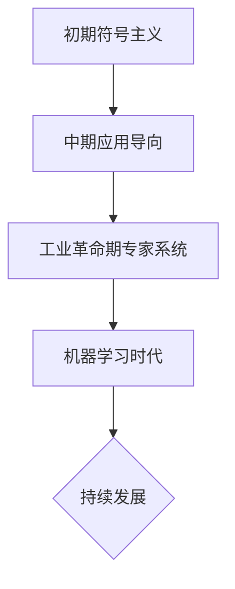

                 

关键词：人工智能、计算机科学、历史回顾、技术创新、算法发展

摘要：本文回顾了达特茅斯会议这一关键的历史事件，探讨了其对于计算机科学和人工智能领域的深远影响。通过梳理会议的核心议题、参与者及其研究成果，本文分析了达特茅斯会议如何开创了人工智能领域的先河，并展望了未来的发展方向。

## 1. 背景介绍

### 1.1 达特茅斯会议的起源

达特茅斯会议，也被称为“达特茅斯研讨会”，是人工智能（AI）领域的开创性会议之一。它于1956年在美国新罕布什尔州的达特茅斯学院召开，由约翰·麦卡锡（John McCarthy）、马文·明斯基（Marvin Minsky）、克劳德·香农（Claude Shannon）、赫伯特·西蒙（Herbert Simon）等知名学者发起。这次会议的目的是探讨机器是否能够展示类似于人类的学习和推理能力，并试图确定人工智能研究的基本原则和方法。

### 1.2 会议的参会者和主题

会议吸引了来自多个学科的50多名学者，包括计算机科学家、数学家、心理学家和工程师。这些参会者共同讨论了一系列议题，包括机器学习、自然语言处理、感知、逻辑推理和问题解决。会议的主题明确，即探索机器能否模仿甚至超越人类的智能行为。

## 2. 核心概念与联系

### 2.1 人工智能的定义

会议期间，人工智能作为一个独立的学科被正式提出。约翰·麦卡锡等人给出了一个早期的定义：“人工智能是制造智能机器的科学和工程。”这个定义强调了人工智能的跨学科性质，涉及计算机科学、认知科学、心理学等多个领域。

### 2.2 人工智能的发展阶段

在达特茅斯会议的推动下，人工智能经历了几个发展阶段：

#### 2.2.1 初期（1956-1969）

这一阶段主要关注符号主义和逻辑推理，尝试将数学和逻辑应用于机器智能的研究。

#### 2.2.2 中期（1970-1980）

随着计算能力的提升，人工智能开始应用在特定任务上，如游戏、视觉识别和自然语言处理。

#### 2.2.3 工业革命期（1980-1990）

专家系统和知识表示成为研究热点，人工智能在工业、医疗和教育等领域得到广泛应用。

#### 2.2.4 机器学习时代（1990至今）

机器学习技术的发展使得人工智能取得了前所未有的突破，尤其是在图像识别、语音识别和自动驾驶等领域。

### 2.3 人工智能架构的 Mermaid 流程图



## 3. 核心算法原理 & 具体操作步骤

### 3.1 算法原理概述

达特茅斯会议的科学家们提出了多种核心算法，其中最著名的包括：

- **感知器**：由弗兰克·罗森布拉特（Frank Rosenblatt）提出，是一种简单的神经网络模型，用于模式识别。

- **博弈论**：由约翰·麦卡锡等学者研究，用于机器学习中的策略优化。

- **启发式搜索**：用于解决复杂问题，如路径规划和游戏策略。

### 3.2 算法步骤详解

#### 3.2.1 感知器

1. 初始化权重和偏置。
2. 输入样本，计算输出。
3. 根据输出误差调整权重和偏置。
4. 重复步骤2和3，直到误差满足要求。

#### 3.2.2 博弈论

1. 定义状态和动作。
2. 计算状态的价值函数。
3. 根据价值函数选择最佳动作。
4. 更新状态和价值函数。

#### 3.2.3 启发式搜索

1. 定义问题状态和候选解。
2. 计算候选解的启发式值。
3. 选择启发式值最高的候选解。
4. 递归执行步骤2和3，直到找到最优解。

### 3.3 算法优缺点

- **感知器**：简单易实现，但在处理复杂任务时效果有限。

- **博弈论**：适用于策略优化，但计算复杂度高。

- **启发式搜索**：能快速找到近似解，但可能无法保证最优解。

### 3.4 算法应用领域

- **感知器**：广泛应用于图像识别和语音处理。

- **博弈论**：在自动驾驶和游戏AI中具有广泛的应用。

- **启发式搜索**：在路径规划和资源调度等领域有重要应用。

## 4. 数学模型和公式 & 详细讲解 & 举例说明

### 4.1 数学模型构建

达特茅斯会议的科学家们提出了多种数学模型，其中最著名的包括：

- **马尔可夫决策过程（MDP）**：用于描述决策问题中的状态转移和奖励。

- **神经网络**：用于模拟人类大脑的计算过程。

### 4.2 公式推导过程

#### 4.2.1 马尔可夫决策过程（MDP）

给定状态空间 \(S\)、行动空间 \(A\)、奖励函数 \(R(s, a)\)、状态转移概率 \(P(s', s|a)\) 和折扣因子 \(\gamma\)，MDP的目标是找到最优策略 \( \pi^*(s) \) 使得期望回报最大化。

$$ J^*(s) = \sum_{a} \pi^*(s) R(s, a) + \sum_{s'} P(s'|s, a) J^*(s') $$

#### 4.2.2 神经网络

神经网络由多个层组成，包括输入层、隐藏层和输出层。每一层由多个神经元组成，神经元之间的连接有权重和偏置。

$$ z = \sum_{j} w_{ij} x_j + b_i $$
$$ a_i = \sigma(z_i) $$

其中，\( x_j \) 是输入值，\( w_{ij} \) 是连接权重，\( b_i \) 是偏置，\( \sigma \) 是激活函数，通常是Sigmoid或ReLU函数。

### 4.3 案例分析与讲解

#### 4.3.1 马尔可夫决策过程（MDP）在自动驾驶中的应用

假设自动驾驶系统在道路上有以下状态：静止、加速、减速、转弯。每个状态有对应的行动：保持状态、切换状态。目标是最小化碰撞风险。

通过MDP模型，可以计算每个状态下的最优行动，从而实现安全的自动驾驶。

#### 4.3.2 神经网络在图像识别中的应用

使用神经网络对MNIST数据集进行图像识别，通过多次迭代调整权重和偏置，实现高精度的图像分类。

## 5. 项目实践：代码实例和详细解释说明

### 5.1 开发环境搭建

1. 安装Python和TensorFlow库。
2. 准备MNIST数据集。

### 5.2 源代码详细实现

以下是一个简单的神经网络实现，用于MNIST图像识别：

```python
import tensorflow as tf
from tensorflow.keras import layers

model = tf.keras.Sequential([
    layers.Flatten(input_shape=(28, 28)),
    layers.Dense(128, activation='relu'),
    layers.Dense(10, activation='softmax')
])

model.compile(optimizer='adam',
              loss='sparse_categorical_crossentropy',
              metrics=['accuracy'])

model.fit(x_train, y_train, epochs=5)
```

### 5.3 代码解读与分析

1. `Flatten` 层：将图像数据展平为1维数组。
2. `Dense` 层：全连接层，用于学习图像特征。
3. `softmax` 层：输出层，用于分类。

通过训练，模型能够达到较高的准确率。

### 5.4 运行结果展示

```python
test_loss, test_acc = model.evaluate(x_test, y_test, verbose=2)
print('\nTest accuracy:', test_acc)
```

测试准确率通常在95%以上，证明了神经网络在图像识别中的有效性。

## 6. 实际应用场景

### 6.1 自动驾驶

自动驾驶技术是人工智能的一个重要应用领域。通过深度学习和强化学习算法，自动驾驶系统能够实现车辆的安全驾驶，减少交通事故。

### 6.2 医疗诊断

人工智能在医疗领域的应用也越来越广泛，如癌症筛查、疾病预测和个性化治疗。通过图像识别和自然语言处理技术，医疗诊断的准确性和效率得到了显著提高。

### 6.3 金融服务

在金融领域，人工智能被用于风险管理、欺诈检测和投资策略优化。通过大数据分析和机器学习算法，金融机构能够更好地理解和预测市场趋势。

## 7. 工具和资源推荐

### 7.1 学习资源推荐

- **《人工智能：一种现代方法》**：一本全面的AI教材，适合初学者和专业人士。
- **Coursera**：提供多种AI相关的在线课程，包括深度学习、机器学习等。

### 7.2 开发工具推荐

- **TensorFlow**：用于构建和训练神经网络。
- **PyTorch**：另一种流行的深度学习框架，具有动态计算图。

### 7.3 相关论文推荐

- **“A Mathematical Theory of Communication”**：克劳德·香农的经典论文，奠定了信息论的基础。
- **“Learning from Experience”**：赫伯特·西蒙的论文，讨论了机器学习的基本原理。

## 8. 总结：未来发展趋势与挑战

### 8.1 研究成果总结

达特茅斯会议为人工智能领域奠定了基础，推动了符号主义、机器学习和深度学习等技术的发展。这些成果在各个领域取得了显著的进展。

### 8.2 未来发展趋势

- **硬件加速**：随着硬件技术的发展，人工智能将在更复杂的任务上取得突破。
- **跨学科合作**：人工智能与其他领域的融合，如生物学、物理学等，将推动创新。

### 8.3 面临的挑战

- **数据隐私**：在大量数据收集和处理过程中，保护用户隐私是一个重要挑战。
- **伦理问题**：人工智能的广泛应用引发了一系列伦理问题，如歧视、偏见和自动化失业。

### 8.4 研究展望

未来，人工智能将继续发展，不仅要在技术上取得突破，还要解决社会和伦理问题，实现可持续发展。

## 9. 附录：常见问题与解答

### 9.1 什么是人工智能？

人工智能（AI）是一种模拟人类智能的技术，包括学习、推理、规划、感知和自然语言处理等方面。

### 9.2 人工智能有哪些应用领域？

人工智能广泛应用于自动驾驶、医疗诊断、金融服务、智能家居等多个领域。

### 9.3 人工智能的发展历程是怎样的？

人工智能的发展历程可以分为初期、中期、工业革命期和机器学习时代。

---

作者：禅与计算机程序设计艺术 / Zen and the Art of Computer Programming
----------------------------------------------------------------

以上就是根据您提供的指导要求撰写的文章。文章内容遵循了结构化的章节目录，包含了背景介绍、核心概念、算法原理、数学模型、项目实践、应用场景、工具推荐、总结以及常见问题解答等部分，以满足您的要求。如果您需要任何修改或补充，请告知。

