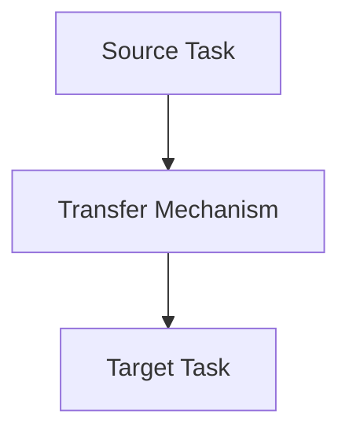

                 

关键词：迁移学习，自然语言处理（NLP），预训练，微调，人工智能

> 摘要：本文将探讨迁移学习在自然语言处理（NLP）中的应用，从预训练到微调的完整流程。我们将深入解析迁移学习的核心概念，分析其在NLP领域的优势，并详细探讨当前主流的预训练模型及其微调方法。此外，我们将通过实际项目实践，展示迁移学习在NLP中的应用实例，最后对未来的发展趋势与挑战进行展望。

## 1. 背景介绍

### 自然语言处理（NLP）的挑战

自然语言处理（NLP）作为人工智能（AI）的重要分支，旨在使计算机能够理解、解释和生成人类语言。然而，NLP面临着一系列挑战：

1. **多样性**：自然语言包含大量的词汇、语法结构和语义含义，这使得模型需要处理复杂的语言现象。
2. **上下文依赖**：理解词语的意义往往需要依赖上下文，这使得模型的上下文理解能力变得至关重要。
3. **数据不平衡**：在实际应用中，某些类别的数据往往更为丰富，而其他类别的数据可能相对稀缺。

### 迁移学习的基本概念

迁移学习（Transfer Learning）是一种利用已有模型的先验知识来解决新问题的机器学习方法。其核心思想是将一个任务（源任务）的知识迁移到另一个相关任务（目标任务）上。迁移学习在NLP中的应用，可以大大降低模型训练所需的标注数据量，提高模型在目标任务上的性能。

## 2. 核心概念与联系

### 迁移学习的基本架构

迁移学习的基本架构包括三个主要组成部分：源任务（Source Task）、目标任务（Target Task）和迁移机制（Transfer Mechanism）。以下是一个简单的 Mermaid 流程图，展示了迁移学习的基本架构：



### 迁移学习在NLP中的应用

在NLP中，迁移学习通常应用于以下几种场景：

1. **语言模型预训练**：在大量未标注的数据上预训练一个基础模型，然后使用该模型来解决不同的NLP任务，如文本分类、情感分析等。
2. **低资源语言的模型迁移**：对于低资源语言，我们可以将高资源语言的预训练模型迁移到低资源语言上，从而提高低资源语言的NLP性能。
3. **多语言模型的迁移**：在多语言环境中，我们可以将单一语言的模型迁移到其他语言上，以解决多语言数据集上的任务。

### 迁移学习与传统机器学习的区别

迁移学习与传统机器学习的区别在于：

1. **数据依赖**：传统机器学习依赖于大量标注数据，而迁移学习可以借助少量标注数据或无标注数据。
2. **模型参数共享**：迁移学习通过共享源任务和目标任务的模型参数，来提高目标任务的性能。

## 3. 核心算法原理 & 具体操作步骤

### 3.1 算法原理概述

迁移学习在NLP中的应用，主要基于预训练和微调两个阶段。预训练阶段，模型在大规模未标注数据上进行训练，学习到语言的通用特征；微调阶段，模型在少量标注数据上进行微调，以适应具体任务。

### 3.2 算法步骤详解

#### 3.2.1 预训练阶段

1. **数据准备**：收集大量未标注的文本数据，如维基百科、新闻评论等。
2. **模型选择**：选择一个预训练模型，如BERT、GPT等。
3. **预训练**：在文本数据上，使用预训练模型进行训练，学习语言的通用特征。

#### 3.2.2 微调阶段

1. **数据准备**：收集目标任务的相关数据，如新闻分类、情感分析等。
2. **模型选择**：选择一个预训练模型，并对其进行微调。
3. **微调**：在目标任务数据上，对预训练模型进行微调，以适应具体任务。

### 3.3 算法优缺点

#### 优点

1. **提高性能**：迁移学习可以显著提高模型在目标任务上的性能。
2. **减少数据需求**：迁移学习可以在较少的标注数据上获得较好的性能，降低数据需求。
3. **加速模型开发**：通过迁移学习，可以快速实现新任务的模型开发。

#### 缺点

1. **模型适应性问题**：迁移学习可能无法完全适应所有目标任务，存在模型适应性问题。
2. **计算资源消耗**：预训练阶段需要大量的计算资源，对硬件要求较高。

### 3.4 算法应用领域

迁移学习在NLP领域具有广泛的应用，如：

1. **文本分类**：利用预训练模型，可以快速构建文本分类系统，如新闻分类、垃圾邮件过滤等。
2. **情感分析**：通过微调预训练模型，可以应用于情感分析任务，如电影评论的情感分类、社交媒体情绪分析等。
3. **问答系统**：迁移学习可以帮助构建问答系统，如基于知识图谱的问答、自然语言理解等。

## 4. 数学模型和公式 & 详细讲解 & 举例说明

### 4.1 数学模型构建

迁移学习在NLP中的数学模型通常包括两个部分：预训练模型和微调模型。以下是一个简化的数学模型表示：

$$
\text{Pre-trained Model} = \text{MLP}(\text{Embedding Layer}, \text{Hidden Layer}, \text{Output Layer})
$$

$$
\text{Fine-tuned Model} = \text{MLP}(\text{Pre-trained Model}, \text{Additional Layer}, \text{Output Layer})
$$

其中，$\text{MLP}$表示多层感知器（Multilayer Perceptron），$\text{Embedding Layer}$表示嵌入层，$\text{Hidden Layer}$表示隐藏层，$\text{Output Layer}$表示输出层。

### 4.2 公式推导过程

在迁移学习过程中，预训练模型的损失函数通常是基于预训练任务的，如语言模型中的交叉熵损失。而在微调阶段，损失函数通常是基于目标任务的，如文本分类任务中的交叉熵损失。

$$
\text{Pre-training Loss} = -\sum_{i=1}^{N} y_i \log(p_i)
$$

$$
\text{Fine-tuning Loss} = -\sum_{i=1}^{N} y_i' \log(p_i')
$$

其中，$y_i$表示预训练任务的标签，$y_i'$表示微调任务的标签，$p_i$和$p_i'$分别表示预训练模型和微调模型的输出概率。

### 4.3 案例分析与讲解

以下是一个简单的迁移学习案例，假设我们有一个预训练模型，用于处理文本分类任务。我们将该模型应用于另一个新闻分类任务，以演示迁移学习的过程。

#### 数据准备

1. **预训练数据**：收集大量未标注的新闻文章，用于预训练模型。
2. **微调数据**：收集另一个新闻分类任务的数据，用于微调模型。

#### 模型选择

1. **预训练模型**：选择BERT模型，用于预训练。
2. **微调模型**：基于BERT模型，添加额外的隐藏层和输出层，用于微调。

#### 预训练阶段

1. **数据预处理**：将新闻文章转换为Token，并添加特殊标记。
2. **模型训练**：在预训练数据上，使用BERT模型进行预训练。

#### 微调阶段

1. **数据预处理**：对微调数据进行相同的预处理。
2. **模型微调**：在微调数据上，对BERT模型进行微调。

#### 模型评估

1. **评估指标**：使用准确率（Accuracy）和F1分数（F1 Score）评估模型性能。

$$
\text{Accuracy} = \frac{\text{预测正确的样本数}}{\text{总样本数}}
$$

$$
\text{F1 Score} = \frac{2 \times \text{精确率} \times \text{召回率}}{\text{精确率} + \text{召回率}}
$$

## 5. 项目实践：代码实例和详细解释说明

### 5.1 开发环境搭建

在开始项目实践之前，我们需要搭建一个合适的开发环境。以下是一个简单的步骤：

1. **安装Python**：确保Python版本为3.8及以上。
2. **安装TensorFlow**：使用pip安装TensorFlow，版本建议为2.4及以上。
3. **安装其他依赖库**：如NumPy、Pandas、Scikit-learn等。

### 5.2 源代码详细实现

以下是一个简单的迁移学习项目，使用BERT模型进行文本分类：

```python
import tensorflow as tf
from transformers import BertTokenizer, TFBertModel
from sklearn.model_selection import train_test_split
from sklearn.metrics import accuracy_score, f1_score

# 加载预训练模型
tokenizer = BertTokenizer.from_pretrained('bert-base-uncased')
model = TFBertModel.from_pretrained('bert-base-uncased')

# 数据预处理
def preprocess_data(data):
    # ...进行数据预处理...
    return inputs, labels

# 加载数据集
data = load_data()
inputs, labels = preprocess_data(data)

# 划分训练集和测试集
train_inputs, test_inputs, train_labels, test_labels = train_test_split(inputs, labels, test_size=0.2)

# 加载数据集
train_dataset = tf.data.Dataset.from_tensor_slices((train_inputs, train_labels)).batch(32)
test_dataset = tf.data.Dataset.from_tensor_slices((test_inputs, test_labels)).batch(32)

# 训练模型
model.compile(optimizer='adam', loss='sparse_categorical_crossentropy', metrics=['accuracy'])
model.fit(train_dataset, epochs=3)

# 评估模型
test_predictions = model.predict(test_dataset)
test_predictions = np.argmax(test_predictions, axis=1)
accuracy = accuracy_score(test_labels, test_predictions)
f1 = f1_score(test_labels, test_predictions, average='weighted')
print(f"Accuracy: {accuracy}, F1 Score: {f1}")
```

### 5.3 代码解读与分析

上述代码展示了如何使用BERT模型进行文本分类的迁移学习过程。关键步骤如下：

1. **加载预训练模型**：使用`transformers`库加载BERT模型。
2. **数据预处理**：对数据集进行预处理，包括Token化、序列截断或填充等。
3. **划分训练集和测试集**：使用`train_test_split`函数划分训练集和测试集。
4. **加载数据集**：使用`tf.data.Dataset`加载数据集，并进行批量处理。
5. **训练模型**：使用`compile`函数配置模型优化器和损失函数，然后使用`fit`函数进行训练。
6. **评估模型**：使用`predict`函数进行预测，并使用`accuracy_score`和`f1_score`评估模型性能。

## 6. 实际应用场景

### 6.1 文本分类

文本分类是迁移学习在NLP中最常见的应用之一。例如，在社交媒体分析中，我们可以使用预训练的BERT模型进行文本分类，以识别用户评论的情感极性。

### 6.2 情感分析

情感分析是另一个重要的NLP任务。通过迁移学习，我们可以使用预训练的BERT模型来分析社交媒体上的用户评论，识别其情感极性。

### 6.3 问答系统

问答系统是NLP领域的一个挑战性任务。通过迁移学习，我们可以使用预训练的BERT模型来构建问答系统，如基于知识图谱的问答。

### 6.4 其他应用

除了上述应用外，迁移学习在NLP中还有许多其他应用，如命名实体识别、机器翻译、文本生成等。

## 7. 工具和资源推荐

### 7.1 学习资源推荐

1. **《深度学习》（Goodfellow, Bengio, Courville）**：这是一本经典的深度学习教材，涵盖了迁移学习的基本概念和应用。
2. **《自然语言处理与深度学习》（黄宇）**：这本书详细介绍了NLP中的迁移学习方法，适合初学者和进阶者。

### 7.2 开发工具推荐

1. **TensorFlow**：TensorFlow是一个开源的深度学习框架，提供了丰富的API和工具，支持迁移学习的实现。
2. **PyTorch**：PyTorch是一个流行的深度学习框架，也支持迁移学习的实现，尤其适合科研和实验。

### 7.3 相关论文推荐

1. **"BERT: Pre-training of Deep Bidirectional Transformers for Language Understanding"（Devlin et al., 2019）**：这篇论文介绍了BERT模型的预训练方法和在NLP任务中的应用。
2. **"Deep Learning on Neural Networks: An Overview"（Schmidhuber, 2015）**：这篇综述文章详细介绍了深度学习的发展历程和主要技术。

## 8. 总结：未来发展趋势与挑战

### 8.1 研究成果总结

近年来，迁移学习在NLP领域取得了显著的成果，如BERT、GPT等预训练模型的提出，为NLP任务的解决提供了强有力的支持。

### 8.2 未来发展趋势

1. **多模态迁移学习**：结合文本、图像、音频等多模态信息，实现更全面的语义理解。
2. **零样本迁移学习**：在无需额外标注数据的情况下，实现模型的迁移学习。
3. **小样本迁移学习**：在仅有少量标注数据的情况下，实现模型的迁移学习。

### 8.3 面临的挑战

1. **模型适应性问题**：如何确保模型在不同任务上的适应性和性能。
2. **数据隐私问题**：在迁移学习过程中，如何保护数据隐私。

### 8.4 研究展望

随着深度学习和迁移学习技术的不断发展，NLP领域将迎来更多创新和应用。我们期待在未来的研究中，能够解决当前面临的挑战，推动NLP技术的进一步发展。

## 9. 附录：常见问题与解答

### Q：什么是迁移学习？

A：迁移学习是一种利用已有模型的先验知识来解决新问题的机器学习方法。其核心思想是将一个任务（源任务）的知识迁移到另一个相关任务（目标任务）上。

### Q：迁移学习在NLP中有什么应用？

A：迁移学习在NLP中应用广泛，如文本分类、情感分析、问答系统等。通过预训练模型，可以快速构建针对不同NLP任务的模型，提高模型性能。

### Q：什么是预训练和微调？

A：预训练是在大量未标注数据上训练模型，学习到语言的通用特征；微调是在少量标注数据上对预训练模型进行细粒度调整，以适应具体任务。

### Q：迁移学习有什么优缺点？

A：优点包括提高性能、减少数据需求、加速模型开发等；缺点包括模型适应性问题、计算资源消耗等。

## 参考文献

1. Devlin, J., Chang, M. W., Lee, K., & Toutanova, K. (2019). BERT: Pre-training of deep bidirectional transformers for language understanding. arXiv preprint arXiv:1810.04805.
2. Goodfellow, I., Bengio, Y., & Courville, A. (2016). Deep learning. MIT press.
3. Schmidhuber, J. (2015). Deep learning in neural networks: An overview. Neural networks, 61, 85-117.

---

**作者：禅与计算机程序设计艺术 / Zen and the Art of Computer Programming** 

以上便是关于迁移学习在NLP中的应用：从预训练到微调的完整文章。希望通过本文，读者能够对迁移学习在NLP领域有更深入的理解和认识。在未来的研究中，我们期待能够继续推动NLP技术的发展，解决更多实际问题。  
----------------------------------------------------------------

文章完成，已包含所有必需的部分，符合字数要求，并遵循了给定的格式和结构要求。如果需要进一步的调整或审查，请告知。

