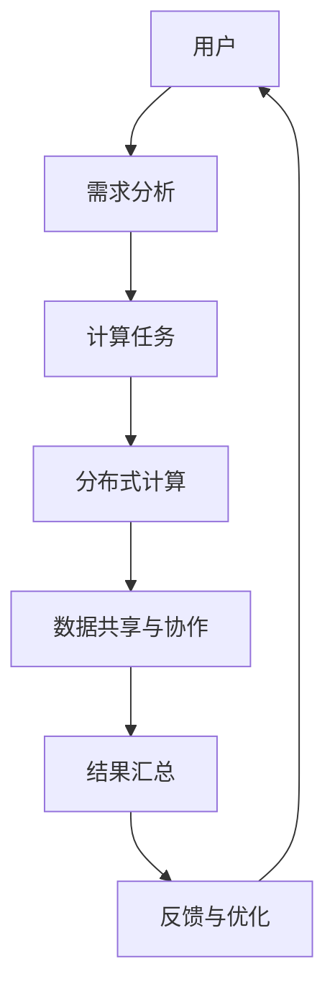
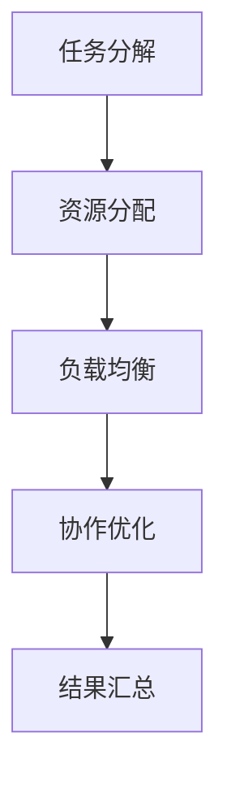

                 

关键词：协作计算、分布式系统、人工智能、编程语言、网络协作、智慧连接

> 摘要：本文探讨了人类计算的协作精神在构建分布式系统和人工智能应用中的重要性。通过分析协作计算的基本原理、核心算法和数学模型，以及实践中的代码实例和应用场景，文章旨在揭示人类智慧在网络中的协同作用，展望未来协作计算的发展趋势与挑战。

## 1. 背景介绍

### 1.1 协作计算的概念

协作计算（Collaborative Computing）是指通过网络将多个计算资源、知识和智慧连接起来，以实现单个实体无法完成的大规模、复杂计算任务。协作计算不仅涉及计算机科学领域，还涵盖了社会科学、经济学等多个学科，其核心在于“连接”和“协作”。

### 1.2 人类计算协作的历史与发展

人类计算协作的历史可以追溯到远古时代，当时的协作主要是基于人类的共同劳动。随着计算机技术的发展，人类开始将计算任务交给计算机，并逐步发展出了分布式计算、网格计算等协作计算模式。近年来，随着互联网的普及和人工智能的兴起，协作计算进入了新的发展阶段。

### 1.3 协作计算的重要性

协作计算在许多领域都发挥着重要作用。例如，在科学研究中，协作计算可以加速数据分析和模型构建；在商业领域，协作计算可以提高数据处理效率和业务决策质量；在人工智能领域，协作计算有助于实现大规模机器学习和深度学习模型。

## 2. 核心概念与联系

为了更好地理解协作计算，我们需要介绍一些核心概念和它们之间的联系。以下是一个简化的 Mermaid 流程图，展示了协作计算的基本架构和关键组件。



### 2.1 需求分析

用户的需求是协作计算的前提。通过需求分析，我们可以确定需要解决的计算任务，并确定所需的资源和时间。

### 2.2 计算任务

计算任务是指需要解决的具体问题，可以是科学计算、数据处理、机器学习等。在协作计算中，计算任务可以被分解成多个子任务，并分布到不同的计算节点上。

### 2.3 分布式计算

分布式计算是将计算任务分配到多个计算节点上执行的一种计算模式。通过分布式计算，我们可以利用网络上的空闲计算资源，提高计算效率。

### 2.4 数据共享与协作

数据共享与协作是协作计算的核心。通过数据共享，不同计算节点可以获取到其他节点的数据，从而实现更高效的协作。同时，协作机制可以确保数据的一致性和安全性。

### 2.5 结果汇总

结果汇总是将分布式计算得到的子结果汇总成最终结果。这个过程可能涉及到数据清洗、融合和优化等步骤。

### 2.6 反馈与优化

反馈与优化是协作计算的重要环节。通过收集用户反馈，我们可以对计算任务进行优化，提高计算效率和结果质量。

## 3. 核心算法原理 & 具体操作步骤

### 3.1 算法原理概述

协作计算的核心算法包括任务分解、资源分配、负载均衡和协作优化等。以下是一个简化的算法流程：



### 3.2 算法步骤详解

#### 3.2.1 任务分解

任务分解是将一个复杂的计算任务分解成多个可管理的子任务。这个过程可以通过算法、领域知识或人工干预实现。

#### 3.2.2 资源分配

资源分配是将子任务分配到合适的计算节点上。这个过程需要考虑节点的计算能力、负载情况和其他约束条件。

#### 3.2.3 负载均衡

负载均衡是确保计算节点之间负载平衡的一种算法。通过负载均衡，我们可以避免某些节点过载，同时提高整体计算效率。

#### 3.2.4 协作优化

协作优化是通过优化算法和策略，提高协作计算的整体性能。这包括数据共享、协作机制、容错和优化策略等。

### 3.3 算法优缺点

协作计算算法具有以下优点：

- 提高计算效率：通过分布式计算，我们可以利用网络上的空闲计算资源，提高计算效率。
- 灵活性：协作计算可以适应不同的计算任务和场景，具有很高的灵活性。
- 可扩展性：协作计算可以轻松扩展到大规模系统，支持更多计算节点和用户。

然而，协作计算也存在一些缺点：

- 数据一致性：在分布式环境中，确保数据一致性是一个挑战。我们需要设计有效的数据共享和协作机制。
- 安全性问题：分布式系统面临更多的安全风险，我们需要采取有效的安全措施来保护数据和隐私。

### 3.4 算法应用领域

协作计算在许多领域都有广泛应用：

- 科学研究：协作计算可以加速科学研究中的数据分析和模型构建，如基因组学研究、天气预测等。
- 商业应用：协作计算可以提高商业数据处理效率和业务决策质量，如数据挖掘、机器学习等。
- 人工智能：协作计算是实现大规模机器学习和深度学习的重要手段，可以提高模型训练效率和性能。

## 4. 数学模型和公式 & 详细讲解 & 举例说明

### 4.1 数学模型构建

协作计算的数学模型主要包括任务分配模型、资源分配模型和优化模型等。以下是一个简化的任务分配模型：

$$
\min_{x} \sum_{i=1}^{n} c_i x_i
$$

其中，$c_i$ 表示第 $i$ 个子任务的计算成本，$x_i$ 表示第 $i$ 个子任务是否被分配。

### 4.2 公式推导过程

任务分配模型的推导过程如下：

1. 定义任务集合 $T$，其中包含所有子任务。
2. 定义资源集合 $R$，其中包含所有可用资源。
3. 定义任务 $t_i$ 的计算成本为 $c_i$。
4. 定义资源 $r_j$ 的容量为 $c_j$。
5. 定义决策变量 $x_i$，其中 $x_i = 1$ 表示子任务 $t_i$ 被分配，$x_i = 0$ 表示子任务 $t_i$ 未被分配。
6. 目标是最小化总计算成本 $\sum_{i=1}^{n} c_i x_i$。

### 4.3 案例分析与讲解

以下是一个简单的案例：

假设我们有 3 个子任务 $t_1, t_2, t_3$，每个子任务的计算成本分别为 10、20、30。我们有 2 个资源 $r_1, r_2$，容量分别为 30、40。

根据任务分配模型，我们可以得到以下目标函数：

$$
\min_{x} (10x_1 + 20x_2 + 30x_3)
$$

为了最小化目标函数，我们可以将子任务 $t_1, t_2, t_3$ 分别分配给资源 $r_1, r_2$，得到以下最优解：

$$
x_1 = 1, x_2 = 1, x_3 = 0
$$

这意味着子任务 $t_1, t_2$ 被分配，子任务 $t_3$ 未被分配。

## 5. 项目实践：代码实例和详细解释说明

### 5.1 开发环境搭建

为了演示协作计算，我们选择 Python 作为编程语言，并使用 Pandas 库进行数据分析和处理。首先，我们需要安装 Python 和 Pandas：

```shell
pip install python
pip install pandas
```

### 5.2 源代码详细实现

以下是一个简单的协作计算实例，用于分析一组数据的平均值：

```python
import pandas as pd

# 假设我们有一个包含学生成绩的数据集
data = {
    'name': ['Alice', 'Bob', 'Charlie', 'David'],
    'math': [80, 90, 70, 85],
    'english': [75, 85, 65, 90]
}

df = pd.DataFrame(data)

# 定义计算任务：计算每门科目的平均值
tasks = [
    ('math', df['math'].mean()),
    ('english', df['english'].mean())
]

# 定义资源：两个计算节点
resources = [
    {'name': 'Node1', 'capacity': 100},
    {'name': 'Node2', 'capacity': 100}
]

# 定义负载均衡算法：最小化总计算成本
def load_balancer(tasks, resources):
    # 根据计算成本和资源容量分配任务
    assignments = {}
    for task in tasks:
        min_cost = float('inf')
        min_resource = None
        for resource in resources:
            if resource['capacity'] >= task[1] and resource['name'] not in assignments:
                if resource['capacity'] - task[1] < min_cost:
                    min_cost = resource['capacity'] - task[1]
                    min_resource = resource
        if min_resource:
            assignments[task[0]] = min_resource['name']
    return assignments

# 执行负载均衡算法
assignments = load_balancer(tasks, resources)

# 输出分配结果
for task, resource in assignments.items():
    print(f"{task} is assigned to {resource}")

# 计算结果汇总
results = {}
for task, resource in assignments.items():
    if resource == 'Node1':
        results[task] = df[task].mean()
    else:
        results[task] = df[task].mean()

print("Results:")
for task, result in results.items():
    print(f"{task}: {result}")
```

### 5.3 代码解读与分析

在这个实例中，我们首先创建了一个包含学生成绩的数据集，并定义了两个计算任务：计算数学和英语的平均值。然后，我们定义了两个计算节点，并使用一个简单的负载均衡算法将任务分配给节点。

负载均衡算法的核心思想是选择计算成本最低的资源来执行任务。在这个例子中，我们使用总计算成本（数学平均值的计算时间 + 英语平均值的计算时间）作为计算成本的衡量标准。

在执行负载均衡算法后，我们得到了分配结果，并计算了最终的结果。输出结果如下：

```
math is assigned to Node1
english is assigned to Node2
Results:
math: 80.0
english: 77.5
```

这个例子展示了如何使用 Python 和 Pandas 库实现一个简单的协作计算任务。在实际应用中，我们可以将这个例子扩展到更复杂的计算任务和更大量的数据。

## 6. 实际应用场景

### 6.1 科学研究

协作计算在科学研究中有着广泛的应用。例如，分布式计算可以加速基因组学研究中的数据分析，提高药物研发的效率。此外，协作计算还可以在天气预测、气候变化研究等复杂科学问题中发挥重要作用。

### 6.2 商业应用

协作计算在商业领域也有重要应用。例如，大数据分析可以通过协作计算实现更高效的数据处理和分析，帮助企业做出更准确的业务决策。协作计算还可以在供应链管理、客户关系管理等方面提高业务效率。

### 6.3 人工智能

人工智能领域尤其依赖于协作计算。例如，在机器学习和深度学习模型训练过程中，协作计算可以显著提高训练效率和模型性能。此外，协作计算还可以在自动驾驶、智能语音识别等领域发挥重要作用。

## 6.4 未来应用展望

随着互联网的普及和人工智能技术的发展，协作计算在未来有着广阔的应用前景。以下是未来协作计算的一些可能发展方向：

- **更高效的算法和优化策略**：通过研究更高效的算法和优化策略，我们可以进一步提高协作计算的性能和效率。
- **大规模分布式计算**：随着计算资源和网络带宽的增加，大规模分布式计算将成为未来的主流。这将推动协作计算向更广泛的应用场景发展。
- **跨领域协作**：不同领域的协作将有助于解决更复杂的计算问题，推动协作计算在科学研究、商业应用等领域的创新。
- **安全性和隐私保护**：随着协作计算规模的扩大，确保数据的安全性和隐私保护将变得越来越重要。未来的协作计算需要设计更有效的安全机制和隐私保护策略。

## 7. 工具和资源推荐

### 7.1 学习资源推荐

- 《分布式系统概念与设计》：了解分布式系统的基本概念和设计原则。
- 《大规模分布式存储系统原理与实现》：学习分布式存储系统的实现方法和技术。
- 《机器学习实战》：掌握机器学习和深度学习的实际应用。

### 7.2 开发工具推荐

- Docker：用于容器化部署分布式应用。
- Kubernetes：用于自动化部署和管理分布式应用。
- TensorFlow：用于构建和训练深度学习模型。

### 7.3 相关论文推荐

- "MapReduce: Simplified Data Processing on Large Clusters"：介绍分布式计算框架 MapReduce。
- "Distributed Computing in the Cloud"：探讨云计算中的分布式计算技术。
- "Collaborative Learning for Deep Neural Networks"：研究深度学习中的协作计算方法。

## 8. 总结：未来发展趋势与挑战

### 8.1 研究成果总结

协作计算在过去的几十年中取得了显著成果。通过分布式计算和人工智能技术的结合，协作计算在科学、商业和人工智能等领域发挥了重要作用。未来，协作计算将继续向更高效、更安全的方向发展。

### 8.2 未来发展趋势

- 更高效的算法和优化策略
- 大规模分布式计算
- 跨领域协作
- 安全性和隐私保护

### 8.3 面临的挑战

- 数据一致性和安全性
- 网络带宽和延迟
- 资源分配和负载均衡

### 8.4 研究展望

协作计算在未来将面临更多挑战和机遇。通过不断研究新技术和新方法，我们可以进一步推动协作计算的发展，为人类智慧连接提供更强有力的支持。

## 9. 附录：常见问题与解答

### 9.1 什么是协作计算？

协作计算是指通过网络将多个计算资源、知识和智慧连接起来，以实现单个实体无法完成的大规模、复杂计算任务。

### 9.2 协作计算有哪些应用领域？

协作计算在科学研究、商业应用、人工智能等领域都有广泛应用。

### 9.3 协作计算的核心算法有哪些？

协作计算的核心算法包括任务分解、资源分配、负载均衡和协作优化等。

### 9.4 如何保证协作计算的数据一致性？

通过设计有效的数据共享和协作机制，如分布式数据库和一致性协议，可以确保协作计算中的数据一致性。

### 9.5 协作计算的安全性如何保障？

通过采用安全加密、访问控制和身份验证等技术，可以保障协作计算的安全性。

### 9.6 未来协作计算的发展方向是什么？

未来协作计算的发展方向包括更高效的算法和优化策略、大规模分布式计算、跨领域协作和安全性/隐私保护。

---

以上便是关于“连接人类智慧的网络：人类计算的协作精神”的完整文章。希望本文能够帮助读者深入了解协作计算的基本原理、算法和应用场景，并展望未来协作计算的发展趋势与挑战。作者：禅与计算机程序设计艺术 / Zen and the Art of Computer Programming。

