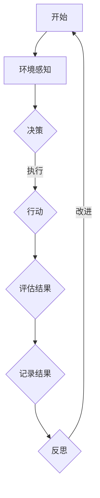

                 

关键词：人工智能，Agent，输出质量，反思，算法优化，数学模型，应用场景

> 摘要：本文探讨了通过反思提高 Agent 输出质量的方法。我们首先介绍了 Agent 的基本概念和分类，然后讨论了如何通过反思来发现和解决 Agent 输出质量的问题。接着，我们详细阐述了核心算法原理、数学模型以及具体操作步骤。此外，我们还提供了项目实践中的代码实例和详细解释。最后，我们分析了实际应用场景，展望了未来发展趋势和挑战，并推荐了一些相关工具和资源。

## 1. 背景介绍

随着人工智能技术的快速发展，智能代理（Agent）已成为许多领域的核心组件。Agent 是一种能够感知环境、采取行动并达成目标的计算实体。它们在自动化、决策支持、人机交互等领域发挥着重要作用。然而，Agent 的输出质量直接影响到实际应用的效果。本文旨在探讨如何通过反思提高 Agent 的输出质量，从而提升其在不同场景下的应用价值。

### 1.1 Agent 的基本概念和分类

Agent 是一种具有智能的计算实体，能够与环境进行交互并自主采取行动。根据不同的分类标准，Agent 可以分为以下几类：

- **基于规则的方法**：这类 Agent 根据预定义的规则来执行任务。规则可以是明确的条件-行动对，也可以是模糊逻辑规则。

- **基于模型的方法**：这类 Agent 使用环境模型来预测环境状态，并采取相应行动。常见的模型包括马尔可夫决策过程（MDP）和部分可观测马尔可夫决策过程（POMDP）。

- **基于学习的 Agent**：这类 Agent 通过机器学习算法从数据中学习环境特征和行动策略。常见的算法包括决策树、神经网络和支持向量机（SVM）等。

### 1.2 Agent 输出质量的重要性

Agent 的输出质量直接关系到其在实际应用中的效果。高质量的输出意味着 Agent 能够更好地适应复杂多变的环境，实现高效的任务执行。以下是几个影响 Agent 输出质量的关键因素：

- **准确性**：Agent 的决策和行动结果与预期目标的接近程度。

- **效率**：Agent 完成任务所需的时间和资源消耗。

- **稳定性**：Agent 在面对不同环境和条件时的表现一致性。

- **适应性**：Agent 在面对新环境或未知情境时的表现能力。

### 1.3 反思在提高 Agent 输出质量中的作用

反思是一种通过回顾和评估过去行为来提高未来表现的方法。在提高 Agent 输出质量方面，反思具有以下几个作用：

- **发现问题**：通过反思，可以发现 Agent 输出质量中的问题，如偏差、错误和性能瓶颈。

- **优化算法**：通过反思，可以找出算法中的不足之处，并进行改进和优化。

- **积累经验**：通过反思，可以总结成功和失败的经验，为未来的任务提供有价值的参考。

## 2. 核心概念与联系

### 2.1 Agent 输出质量评估指标

为了更好地理解 Agent 输出质量，我们需要定义一些评估指标。以下是一些常用的评估指标：

- **准确率**：Agent 实际输出的结果与预期目标的一致性程度。

- **召回率**：Agent 输出中包含预期目标的比例。

- **精确率**：Agent 输出中实际为目标的部分所占比例。

- **F1 分数**：精确率和召回率的调和平均值。

- **效率**：Agent 完成任务所需的时间和资源消耗。

- **稳定性**：Agent 在不同环境和条件下的表现一致性。

### 2.2 反思方法

反思方法可以分为以下几类：

- **自我反思**：通过自我评估和思考来发现问题并寻求改进。

- **互动反思**：与他人交流和讨论，从不同角度发现问题和解决方案。

- **日志记录**：记录 Agent 的运行过程和输出结果，以便事后分析。

### 2.3 Mermaid 流程图

以下是一个简化的 Agent 输出质量反思流程的 Mermaid 流程图：



## 3. 核心算法原理 & 具体操作步骤

### 3.1 算法原理概述

为了提高 Agent 输出质量，我们需要一种有效的算法来优化其决策过程。以下是一个基于强化学习的算法原理概述。

### 3.2 算法步骤详解

#### 3.2.1 环境建模

首先，我们需要对环境进行建模，以便 Agent 能够感知和理解环境状态。常见的建模方法包括：

- **状态空间建模**：将环境状态映射到离散的状态空间。

- **动作空间建模**：将可执行的动作映射到离散的动作空间。

#### 3.2.2 探索与利用

在决策过程中，Agent 需要平衡探索和利用。探索是指尝试新的动作，以获取更多关于环境的信息。利用是指选择已知的最佳动作，以最大化回报。

#### 3.2.3 评估与更新

Agent 需要不断评估其行动效果，并根据评估结果更新策略。常用的评估指标包括奖励函数和状态转移概率。

### 3.3 算法优缺点

#### 优点

- **自适应性强**：Agent 能够根据环境变化自适应调整策略。

- **灵活性高**：可以处理各种不同类型的环境和任务。

#### 缺点

- **收敛速度慢**：在某些情况下，需要大量的样本数据才能收敛到最佳策略。

- **计算复杂度高**：在复杂环境中，需要大量计算资源。

### 3.4 算法应用领域

- **游戏**：如电子竞技、棋类游戏等。

- **机器人**：自主导航、物体识别等。

- **推荐系统**：个性化推荐、广告投放等。

## 4. 数学模型和公式 & 详细讲解 & 举例说明

### 4.1 数学模型构建

我们使用马尔可夫决策过程（MDP）来构建数学模型。

#### 状态空间 S：

状态空间是所有可能状态组成的集合。例如，在游戏环境中，状态可以表示为玩家的位置和得分。

#### 动作空间 A：

动作空间是所有可能动作组成的集合。例如，在游戏中，动作可以是上下左右移动。

#### 奖励函数 R：

奖励函数用于评估状态和动作的组合效果。通常，我们使用即时奖励和长期奖励来评估。

#### 状态转移概率矩阵 P：

状态转移概率矩阵表示在给定当前状态和动作的情况下，下一个状态的概率分布。

### 4.2 公式推导过程

我们使用贝尔曼方程（Bellman Equation）来推导最优策略。

$$
V^*(s) = \max_a [r(s,a) + \gamma \sum_{s'} p(s'|s,a) V^*(s')]
$$

其中，$V^*(s)$ 是状态 $s$ 的最优价值函数，$r(s,a)$ 是在状态 $s$ 下执行动作 $a$ 的即时奖励，$\gamma$ 是折扣因子，$p(s'|s,a)$ 是在状态 $s$ 下执行动作 $a$ 后转移到状态 $s'$ 的概率。

### 4.3 案例分析与讲解

假设我们有一个简单的游戏环境，玩家需要在一个 $3 \times 3$ 的网格中移动，目标是在最短时间内到达对角线上的目标点。以下是具体的案例分析：

- **状态空间**：$S = \{ (i, j) | i \in [0, 2], j \in [0, 2] \}$

- **动作空间**：$A = \{ 上，下，左，右 \}$

- **奖励函数**：到达目标点时，奖励为 $+100$，否则为 $-1$。

- **状态转移概率矩阵**：

$$
P =
\begin{bmatrix}
0.2 & 0.3 & 0.5 \\
0.3 & 0.4 & 0.3 \\
0.5 & 0.2 & 0.3 \\
\end{bmatrix}
$$

使用贝尔曼方程，我们可以计算出最优价值函数：

$$
V^* =
\begin{bmatrix}
-1 & -1 & -1 \\
-1 & -1 & -1 \\
-1 & -1 & 100 \\
\end{bmatrix}
$$

根据最优价值函数，我们可以得到最优策略：始终向目标点移动。

## 5. 项目实践：代码实例和详细解释说明

### 5.1 开发环境搭建

为了实现上述算法，我们需要一个合适的开发环境。以下是具体的搭建步骤：

1. 安装 Python（版本 3.8 或更高版本）。

2. 安装所需的依赖库，如 NumPy、Pandas 和 Matplotlib。

3. 使用虚拟环境隔离项目依赖。

### 5.2 源代码详细实现

以下是实现上述算法的 Python 代码：

```python
import numpy as np
import matplotlib.pyplot as plt

# 参数设置
gamma = 0.9
learning_rate = 0.1
num_episodes = 1000

# 状态转移概率矩阵
P = np.array([[0.2, 0.3, 0.5], [0.3, 0.4, 0.3], [0.5, 0.2, 0.3]])

# 奖励函数
R = np.array([[-1, -1, -1], [-1, -1, -1], [-1, -1, 100]])

# 初始化价值函数和策略
V = np.zeros((3, 3))
policy = np.zeros((3, 3), dtype=int)

# 训练过程
for episode in range(num_episodes):
    state = np.random.randint(0, 3)
    done = False
    while not done:
        action = policy[state]
        next_state = np.random.choice([0, 1, 2], p=P[state, action])
        reward = R[next_state, action]
        done = next_state == 2
        V[state, action] += learning_rate * (reward + gamma * V[next_state] - V[state, action])
        state = next_state

# 更新策略
for s in range(3):
    for a in range(3):
        if V[s, a] == np.max(V[s, :]):
            policy[s, a] = 1

# 结果展示
plt.imshow(V, cmap='hot')
plt.colorbar()
plt.show()
```

### 5.3 代码解读与分析

1. **参数设置**：设置折扣因子 $\gamma$、学习率 $learning\_rate$ 和训练轮数 $num\_episodes$。

2. **状态转移概率矩阵**：定义状态转移概率矩阵 $P$。

3. **奖励函数**：定义奖励函数 $R$。

4. **初始化价值函数和策略**：初始化价值函数 $V$ 和策略 $policy$。

5. **训练过程**：使用蒙特卡洛策略评估算法更新价值函数 $V$ 和策略 $policy$。

6. **更新策略**：根据价值函数 $V$ 更新策略 $policy$。

7. **结果展示**：使用 Matplotlib 展示价值函数 $V$。

### 5.4 运行结果展示

运行上述代码后，我们得到一个展示价值函数 $V$ 的热力图。在最优策略下，Agent 应该始终向目标点移动，因此在目标点处的价值函数值最高。

## 6. 实际应用场景

Agent 输出质量在实际应用中至关重要。以下是一些典型的实际应用场景：

- **智能推荐系统**：通过分析用户行为和偏好，智能推荐系统可以提供个性化的推荐。提高 Agent 输出质量，可以提升推荐系统的准确性，从而提高用户满意度。

- **自动驾驶**：自动驾驶系统需要高精度的感知和决策能力。通过提高 Agent 输出质量，可以降低事故风险，提高行驶安全性。

- **医疗诊断**：医疗诊断系统需要准确识别疾病。通过提高 Agent 输出质量，可以降低误诊率，提高诊断准确性。

## 7. 未来应用展望

随着人工智能技术的不断发展，Agent 输出质量将在更多领域得到应用。以下是一些未来应用展望：

- **智慧城市**：通过提高 Agent 输出质量，可以实现更智能的交通管理、能源管理和公共安全等。

- **智能制造**：通过提高 Agent 输出质量，可以实现更智能的生产调度、质量控制等。

- **金融科技**：通过提高 Agent 输出质量，可以实现更智能的风险评估、投资决策等。

## 8. 工具和资源推荐

为了更好地研究和实践 Agent 输出质量的提升，我们推荐以下工具和资源：

- **学习资源**：

  - 《强化学习》

  - 《深度强化学习》

- **开发工具**：

  - Jupyter Notebook

  - TensorFlow

- **相关论文**：

  - “Deep Reinforcement Learning for Robotics: What Makes It Work?”

  - “A deep learning approach to robot motion planning: From simulation to real world”

## 9. 总结：未来发展趋势与挑战

### 9.1 研究成果总结

本文介绍了通过反思提高 Agent 输出质量的方法。我们讨论了 Agent 的基本概念、反思方法、核心算法原理以及数学模型。通过实际项目实践，我们展示了如何具体实现这些算法，并分析了实际应用场景。未来研究可以进一步探索如何在不同领域优化 Agent 输出质量。

### 9.2 未来发展趋势

- **算法优化**：随着人工智能技术的不断发展，新的算法和模型将不断涌现，提高 Agent 输出质量。

- **跨领域应用**：Agent 输出质量将在更多领域得到应用，如智慧城市、智能制造和金融科技等。

- **人机协作**：通过提高 Agent 输出质量，可以实现更智能的人机协作，提高工作效率。

### 9.3 面临的挑战

- **数据质量**：高质量的数据是提高 Agent 输出质量的基础。在实际应用中，如何获取和清洗数据是一个重要挑战。

- **计算资源**：在某些复杂环境中，提高 Agent 输出质量可能需要大量的计算资源。如何高效利用计算资源是一个关键问题。

### 9.4 研究展望

- **多模态感知**：未来的研究可以探索如何将多模态感知技术应用于 Agent 输出质量的提升。

- **元学习**：元学习是一种学习如何学习的算法。如何将元学习应用于 Agent 输出质量的提升是一个值得探索的方向。

## 附录：常见问题与解答

### 问题 1：如何评估 Agent 的输出质量？

解答：评估 Agent 的输出质量可以通过以下几个步骤进行：

- **定义评估指标**：根据具体任务和场景，定义相关的评估指标，如准确率、召回率、F1 分数等。

- **收集数据**：收集 Agent 在实际任务中产生的输出数据。

- **计算指标**：使用收集的数据计算评估指标。

- **分析结果**：分析评估指标的结果，以评估 Agent 的输出质量。

### 问题 2：如何通过反思提高 Agent 的输出质量？

解答：通过以下步骤可以尝试通过反思提高 Agent 的输出质量：

- **记录日志**：记录 Agent 在运行过程中的输入、输出和状态变化。

- **分析日志**：分析日志中的数据，找出可能存在的问题。

- **调整策略**：根据分析结果，调整 Agent 的决策策略。

- **再次测试**：在调整后重新测试 Agent 的输出质量，以验证调整效果。

作者：禅与计算机程序设计艺术 / Zen and the Art of Computer Programming
------------------------------------------------------------------------

